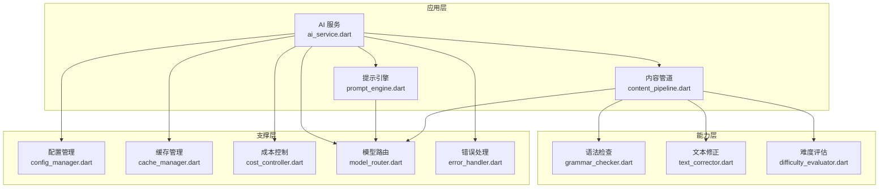
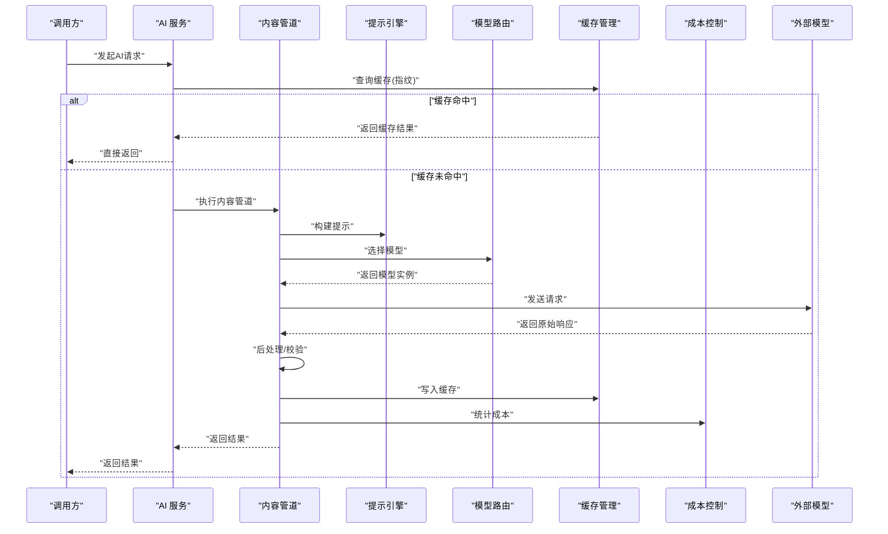
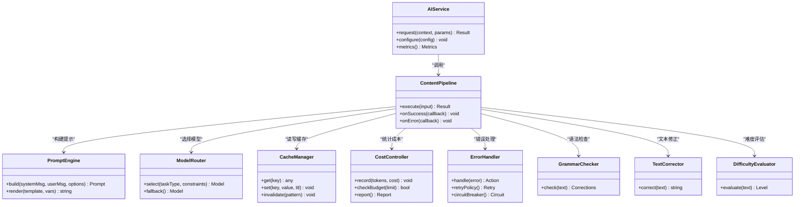
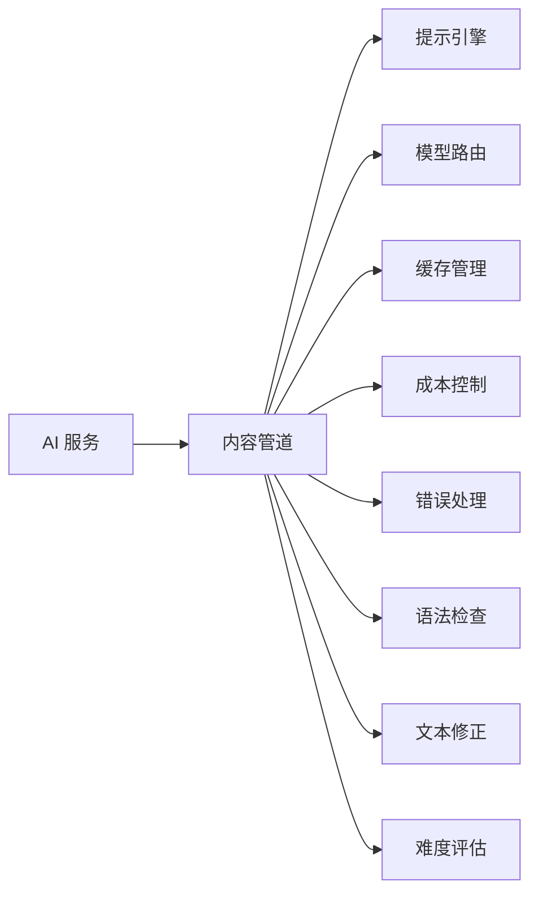

# AI功能集成

<cite>
**本文引用的文件**   
- [lib/application/ai/ai_service.dart](file://lib/application/ai/ai_service.dart)
- [lib/application/ai/prompt_engine.dart](file://lib/application/ai/prompt_engine.dart)
- [lib/application/ai/content_pipeline.dart](file://lib/application/ai/content_pipeline.dart)
- [lib/application/ai/config_manager.dart](file://lib/application/ai/config_manager.dart)
- [lib/application/ai/cache_manager.dart](file://lib/application/ai/cache_manager.dart)
- [lib/application/ai/cost_controller.dart](file://lib/application/ai/cost_controller.dart)
- [lib/application/ai/model_router.dart](file://lib/application/ai/model_router.dart)
- [lib/application/ai/error_handler.dart](file://lib/application/ai/error_handler.dart)
- [lib/application/ai/difficulty_evaluator.dart](file://lib/application/ai/difficulty_evaluator.dart)
- [lib/application/ai/grammar_checker.dart](file://lib/application/ai/grammar_checker.dart)
- [lib/application/ai/text_corrector.dart](file://lib/application/ai/text_corrector.dart)
- [test/application/ai/ai_service_test.dart](file://test/application/ai/ai_service_test.dart)
- [test/application/ai/prompt_engine_test.dart](file://test/application/ai/prompt_engine_test.dart)
- [test/application/ai/content_pipeline_test.dart](file://test/application/ai/content_pipeline_test.dart)
- [test/application/ai/config_manager_test.dart](file://test/application/ai/config_manager_test.dart)
- [test/application/ai/cache_manager_test.dart](file://test/application/ai/cache_manager_test.dart)
- [test/application/ai/cost_controller_test.dart](file://test/application/ai/cost_controller_test.dart)
- [test/application/ai/model_router_test.dart](file://test/application/ai/model_router_test.dart)
- [test/application/ai/error_handler_test.dart](file://test/application/ai/error_handler_test.dart)
- [test/application/ai/difficulty_evaluator_test.dart](file://test/application/ai/difficulty_evaluator_test.dart)
- [test/application/ai/grammar_checker_test.dart](file://test/application/ai/grammar_checker_test.dart)
- [test/application/ai/text_corrector_test.dart](file://test/application/ai/text_corrector_test.dart)
</cite>

## 目录
1. [简介](#简介)
2. [项目结构](#项目结构)
3. [核心组件](#核心组件)
4. [架构总览](#架构总览)
5. [详细组件分析](#详细组件分析)
6. [依赖关系分析](#依赖关系分析)
7. [性能考量](#性能考量)
8. [故障排查指南](#故障排查指南)
9. [结论](#结论)
10. [附录](#附录)

## 简介
本文件面向 Varnamalaplus 的 AI 功能集成，系统性阐述 AI 服务架构、提示工程策略与内容生成管道。文档覆盖智能提示、内容修正、语法检查与难度评估等能力，并说明多模型支持、配置管理、缓存策略、成本控制、错误处理与降级策略。同时提供定制指南、性能优化建议与最佳实践，帮助开发者快速理解与扩展 AI 能力。

## 项目结构
AI 相关代码主要位于 lib/application/ai 与 test/application/ai 两个目录：
- lib/application/ai：实现 AI 服务、提示引擎、内容管道、配置、缓存、成本、路由、错误处理、语法检查、文本修正与难度评估等模块。
- test/application/ai：对应模块的单测用例，用于验证行为与边界条件。

图表来源
- [lib/application/ai/ai_service.dart](file://lib/application/ai/ai_service.dart)
- [lib/application/ai/prompt_engine.dart](file://lib/application/ai/prompt_engine.dart)
- [lib/application/ai/content_pipeline.dart](file://lib/application/ai/content_pipeline.dart)
- [lib/application/ai/config_manager.dart](file://lib/application/ai/config_manager.dart)
- [lib/application/ai/cache_manager.dart](file://lib/application/ai/cache_manager.dart)
- [lib/application/ai/cost_controller.dart](file://lib/application/ai/cost_controller.dart)
- [lib/application/ai/model_router.dart](file://lib/application/ai/model_router.dart)
- [lib/application/ai/error_handler.dart](file://lib/application/ai/error_handler.dart)
- [lib/application/ai/grammar_checker.dart](file://lib/application/ai/grammar_checker.dart)
- [lib/application/ai/text_corrector.dart](file://lib/application/ai/text_corrector.dart)
- [lib/application/ai/difficulty_evaluator.dart](file://lib/application/ai/difficulty_evaluator.dart)

章节来源
- [lib/application/ai/ai_service.dart](file://lib/application/ai/ai_service.dart)
- [lib/application/ai/prompt_engine.dart](file://lib/application/ai/prompt_engine.dart)
- [lib/application/ai/content_pipeline.dart](file://lib/application/ai/content_pipeline.dart)
- [lib/application/ai/config_manager.dart](file://lib/application/ai/config_manager.dart)
- [lib/application/ai/cache_manager.dart](file://lib/application/ai/cache_manager.dart)
- [lib/application/ai/cost_controller.dart](file://lib/application/ai/cost_controller.dart)
- [lib/application/ai/model_router.dart](file://lib/application/ai/model_router.dart)
- [lib/application/ai/error_handler.dart](file://lib/application/ai/error_handler.dart)
- [lib/application/ai/grammar_checker.dart](file://lib/application/ai/grammar_checker.dart)
- [lib/application/ai/text_corrector.dart](file://lib/application/ai/text_corrector.dart)
- [lib/application/ai/difficulty_evaluator.dart](file://lib/application/ai/difficulty_evaluator.dart)

## 核心组件
- AI 服务（ai_service.dart）：对外统一入口，协调提示引擎、内容管道、配置、缓存、成本、路由与错误处理，屏蔽底层模型差异。
- 提示引擎（prompt_engine.dart）：负责模板渲染、上下文组装、参数化与结构化输出控制。
- 内容管道（content_pipeline.dart）：编排“输入校验→提示构建→模型调用→后处理→缓存/成本记录”的端到端流程。
- 配置管理（config_manager.dart）：集中管理模型密钥、速率限制、超时、重试、开关与灰度策略。
- 缓存管理（cache_manager.dart）：基于请求指纹的 LRU/TTL 缓存，命中即短路，降低延迟与成本。
- 成本控制（cost_controller.dart）：统计 token 用量、预算上限、节流与告警，支持按用户/会话维度隔离。
- 模型路由（model_router.dart）：根据任务类型、质量要求、成本阈值与可用性选择最优模型，支持回退。
- 错误处理（error_handler.dart）：统一异常分类、重试、熔断与降级策略，保障稳定性。
- 语法检查（grammar_checker.dart）：针对目标语言的语法纠错与规则增强。
- 文本修正（text_corrector.dart）：拼写、格式、风格一致性修正与本地化适配。
- 难度评估（difficulty_evaluator.dart）：基于词汇密度、句法复杂度、语义负载等指标评估学习材料难度。

章节来源
- [lib/application/ai/ai_service.dart](file://lib/application/ai/ai_service.dart)
- [lib/application/ai/prompt_engine.dart](file://lib/application/ai/prompt_engine.dart)
- [lib/application/ai/content_pipeline.dart](file://lib/application/ai/content_pipeline.dart)
- [lib/application/ai/config_manager.dart](file://lib/application/ai/config_manager.dart)
- [lib/application/ai/cache_manager.dart](file://lib/application/ai/cache_manager.dart)
- [lib/application/ai/cost_controller.dart](file://lib/application/ai/cost_controller.dart)
- [lib/application/ai/model_router.dart](file://lib/application/ai/model_router.dart)
- [lib/application/ai/error_handler.dart](file://lib/application/ai/error_handler.dart)
- [lib/application/ai/grammar_checker.dart](file://lib/application/ai/grammar_checker.dart)
- [lib/application/ai/text_corrector.dart](file://lib/application/ai/text_corrector.dart)
- [lib/application/ai/difficulty_evaluator.dart](file://lib/application/ai/difficulty_evaluator.dart)

## 架构总览
AI 服务作为门面，将业务侧请求转译为提示，经内容管道调度至合适模型，并在返回后进行结果校验、缓存与成本统计。错误处理贯穿全链路，确保失败可恢复、可观测。

图表来源
- [lib/application/ai/ai_service.dart](file://lib/application/ai/ai_service.dart)
- [lib/application/ai/content_pipeline.dart](file://lib/application/ai/content_pipeline.dart)
- [lib/application/ai/prompt_engine.dart](file://lib/application/ai/prompt_engine.dart)
- [lib/application/ai/model_router.dart](file://lib/application/ai/model_router.dart)
- [lib/application/ai/cache_manager.dart](file://lib/application/ai/cache_manager.dart)
- [lib/application/ai/cost_controller.dart](file://lib/application/ai/cost_controller.dart)

## 详细组件分析

### AI 服务（ai_service.dart）
- 职责：统一入口、生命周期管理、跨组件协调、监控埋点。
- 关键流程：接收请求→构造上下文→调用内容管道→处理结果→上报指标。
- 设计要点：
  - 通过依赖注入装配各子组件，便于替换与测试。
  - 对上层暴露稳定的接口，屏蔽模型差异与错误细节。
  - 结合配置开关实现功能灰度与特性裁剪。

章节来源
- [lib/application/ai/ai_service.dart](file://lib/application/ai/ai_service.dart)
- [test/application/ai/ai_service_test.dart](file://test/application/ai/ai_service_test.dart)

### 提示引擎（prompt_engine.dart）
- 职责：模板渲染、变量注入、系统/用户消息拼装、结构化输出约束。
- 关键能力：
  - 多语言模板与占位符替换。
  - 动态上下文拼接（课程、词汇、语法规则）。
  - 输出格式控制（JSON/Markdown/纯文本）。
- 优化点：
  - 预编译常用模板，减少运行时开销。
  - 缓存高频提示组合，避免重复构建。

章节来源
- [lib/application/ai/prompt_engine.dart](file://lib/application/ai/prompt_engine.dart)
- [test/application/ai/prompt_engine_test.dart](file://test/application/ai/prompt_engine_test.dart)

### 内容管道（content_pipeline.dart）
- 职责：编排端到端处理步骤，保证一致性与可观测性。
- 典型阶段：
  - 输入校验与清洗
  - 提示构建（委托提示引擎）
  - 模型调用（委托模型路由）
  - 结果解析与校验
  - 缓存写入与成本统计
- 容错：每阶段可插拔重试与降级逻辑。

章节来源
- [lib/application/ai/content_pipeline.dart](file://lib/application/ai/content_pipeline.dart)
- [test/application/ai/content_pipeline_test.dart](file://test/application/ai/content_pipeline_test.dart)

### 配置管理（config_manager.dart）
- 职责：集中加载与热更新配置项，包括模型密钥、超时、重试、速率限制、功能开关。
- 关键点：
  - 分层配置（默认/环境/用户），优先级明确。
  - 安全存储敏感信息（如密钥）。
  - 变更事件通知，驱动路由与缓存策略调整。

章节来源
- [lib/application/ai/config_manager.dart](file://lib/application/ai/config_manager.dart)
- [test/application/ai/config_manager_test.dart](file://test/application/ai/config_manager_test.dart)

### 缓存管理（cache_manager.dart）
- 职责：基于请求指纹的内存缓存，支持 TTL 与容量限制。
- 关键点：
  - 指纹计算包含输入、提示版本、模型与参数哈希。
  - LRU 淘汰策略，避免内存膨胀。
  - 读写分离与并发安全。

章节来源
- [lib/application/ai/cache_manager.dart](file://lib/application/ai/cache_manager.dart)
- [test/application/ai/cache_manager_test.dart](file://test/application/ai/cache_manager_test.dart)

### 成本控制（cost_controller.dart）
- 职责：统计 token 用量、预算控制、节流与告警。
- 关键点：
  - 按用户/会话维度隔离统计。
  - 软/硬限额触发不同策略（限流/拒绝/降级）。
  - 导出用量报表，支持审计与结算。

章节来源
- [lib/application/ai/cost_controller.dart](file://lib/application/ai/cost_controller.dart)
- [test/application/ai/cost_controller_test.dart](file://test/application/ai/cost_controller_test.dart)

### 模型路由（model_router.dart）
- 职责：根据任务类型、质量要求、成本阈值与可用性选择模型，支持回退。
- 关键点：
  - 策略表（任务→候选模型→权重）。
  - 健康检查与自动摘除不可用模型。
  - 灰度发布与流量切分。

章节来源
- [lib/application/ai/model_router.dart](file://lib/application/ai/model_router.dart)
- [test/application/ai/model_router_test.dart](file://test/application/ai/model_router_test.dart)

### 错误处理（error_handler.dart）
- 职责：统一异常分类、重试、熔断与降级。
- 关键点：
  - 网络/鉴权/配额/模型限流等错误区分处理。
  - 指数退避与抖动重试。
  - 熔断器防止雪崩，快速失败。

章节来源
- [lib/application/ai/error_handler.dart](file://lib/application/ai/error_handler.dart)
- [test/application/ai/error_handler_test.dart](file://test/application/ai/error_handler_test.dart)

### 语法检查（grammar_checker.dart）
- 职责：目标语言语法纠错、规则增强与教学解释生成。
- 关键点：
  - 规则库与模型判断双轨并行，优先规则。
  - 错误定位与修复建议结构化输出。

章节来源
- [lib/application/ai/grammar_checker.dart](file://lib/application/ai/grammar_checker.dart)
- [test/application/ai/grammar_checker_test.dart](file://test/application/ai/grammar_checker_test.dart)

### 文本修正（text_corrector.dart）
- 职责：拼写、标点、大小写、风格一致性与本地化修正。
- 关键点：
  - 词典与正则预处理，提升准确率。
  - 保持原文语义与语气不变。

章节来源
- [lib/application/ai/text_corrector.dart](file://lib/application/ai/text_corrector.dart)
- [test/application/ai/text_corrector_test.dart](file://test/application/ai/text_corrector_test.dart)

### 难度评估（difficulty_evaluator.dart）
- 职责：基于词汇密度、句法复杂度、语义负载等指标评估学习材料难度。
- 关键点：
  - 指标加权与阈值分级（A1-C2）。
  - 与课程大纲对齐，支持动态调参。

章节来源
- [lib/application/ai/difficulty_evaluator.dart](file://lib/application/ai/difficulty_evaluator.dart)
- [test/application/ai/difficulty_evaluator_test.dart](file://test/application/ai/difficulty_evaluator_test.dart)

### 类图（组件关系）

图表来源
- [lib/application/ai/ai_service.dart](file://lib/application/ai/ai_service.dart)
- [lib/application/ai/content_pipeline.dart](file://lib/application/ai/content_pipeline.dart)
- [lib/application/ai/prompt_engine.dart](file://lib/application/ai/prompt_engine.dart)
- [lib/application/ai/model_router.dart](file://lib/application/ai/model_router.dart)
- [lib/application/ai/cache_manager.dart](file://lib/application/ai/cache_manager.dart)
- [lib/application/ai/cost_controller.dart](file://lib/application/ai/cost_controller.dart)
- [lib/application/ai/error_handler.dart](file://lib/application/ai/error_handler.dart)
- [lib/application/ai/grammar_checker.dart](file://lib/application/ai/grammar_checker.dart)
- [lib/application/ai/text_corrector.dart](file://lib/application/ai/text_corrector.dart)
- [lib/application/ai/difficulty_evaluator.dart](file://lib/application/ai/difficulty_evaluator.dart)

## 依赖关系分析
- 松耦合：AI 服务仅依赖抽象接口，具体实现可替换。
- 内聚性：每个模块职责单一，易于测试与维护。
- 外部依赖：模型 API、缓存后端、配置源与监控系统。
- 潜在风险：循环依赖需避免；外部服务不稳定需通过错误处理与熔断保护。

图表来源
- [lib/application/ai/ai_service.dart](file://lib/application/ai/ai_service.dart)
- [lib/application/ai/content_pipeline.dart](file://lib/application/ai/content_pipeline.dart)
- [lib/application/ai/prompt_engine.dart](file://lib/application/ai/prompt_engine.dart)
- [lib/application/ai/model_router.dart](file://lib/application/ai/model_router.dart)
- [lib/application/ai/cache_manager.dart](file://lib/application/ai/cache_manager.dart)
- [lib/application/ai/cost_controller.dart](file://lib/application/ai/cost_controller.dart)
- [lib/application/ai/error_handler.dart](file://lib/application/ai/error_handler.dart)
- [lib/application/ai/grammar_checker.dart](file://lib/application/ai/grammar_checker.dart)
- [lib/application/ai/text_corrector.dart](file://lib/application/ai/text_corrector.dart)
- [lib/application/ai/difficulty_evaluator.dart](file://lib/application/ai/difficulty_evaluator.dart)

章节来源
- [lib/application/ai/ai_service.dart](file://lib/application/ai/ai_service.dart)
- [lib/application/ai/content_pipeline.dart](file://lib/application/ai/content_pipeline.dart)

## 性能考量
- 缓存命中率：通过合理指纹与 TTL 提升命中，减少模型调用。
- 提示长度控制：裁剪冗余上下文，避免超长导致延迟与费用上升。
- 批量与异步：非关键路径异步化，合并请求以降低开销。
- 模型选择：低成本模型用于草稿，高质量模型用于终稿。
- 资源限制：连接池、线程池与队列限流，防止过载。
- 监控与采样：关键指标采样上报，避免监控自身成为瓶颈。

[本节为通用指导，不直接分析具体文件]

## 故障排查指南
- 常见问题定位：
  - 缓存未命中：检查指纹计算是否稳定，TTL 是否过短。
  - 模型超时/限流：查看错误分类与重试策略，必要时切换模型。
  - 成本超支：核对 token 统计口径与预算阈值，启用节流。
  - 提示效果差：审查模板与上下文，进行 A/B 对比。
- 诊断手段：
  - 开启调试日志与请求追踪。
  - 使用单测与回归用例复现问题。
  - 通过成本与指标面板定位热点与异常。

章节来源
- [lib/application/ai/error_handler.dart](file://lib/application/ai/error_handler.dart)
- [lib/application/ai/cache_manager.dart](file://lib/application/ai/cache_manager.dart)
- [lib/application/ai/cost_controller.dart](file://lib/application/ai/cost_controller.dart)
- [lib/application/ai/model_router.dart](file://lib/application/ai/model_router.dart)

## 结论
Varnamalaplus 的 AI 功能以清晰的分层与模块化设计，实现了从提示工程到内容生成的完整闭环。通过配置管理、缓存与成本控制，系统在可用性与经济性之间取得平衡；借助错误处理与模型路由，提升了鲁棒性与可扩展性。建议持续完善模板库、指标体系与自动化测试，推动 AI 能力在语言学习场景中的稳定落地。

[本节为总结性内容，不直接分析具体文件]

## 附录
- 定制指南：
  - 新增能力：在内容管道中插入新阶段，实现最小侵入。
  - 新增模型：在路由策略表中注册，完成健康检查与回退。
  - 自定义提示：扩展模板库与渲染器，保持向后兼容。
- 最佳实践：
  - 明确输入契约与输出规范，强化校验。
  - 小步快跑，灰度发布新功能。
  - 以数据驱动优化提示与模型选择。
- 参考用例：
  - 智能提示：根据课程与学习者水平生成个性化引导。
  - 内容修正：自动纠正拼写与格式，保持语义一致。
  - 语法检查：定位错误并提供教学解释。
  - 难度评估：依据指标划分等级，辅助课程设计。

[本节为补充信息，不直接分析具体文件]