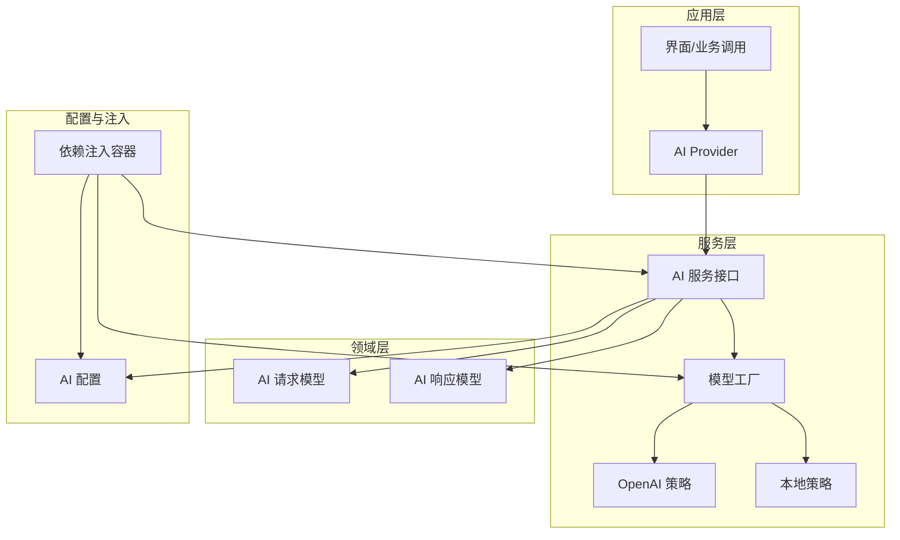
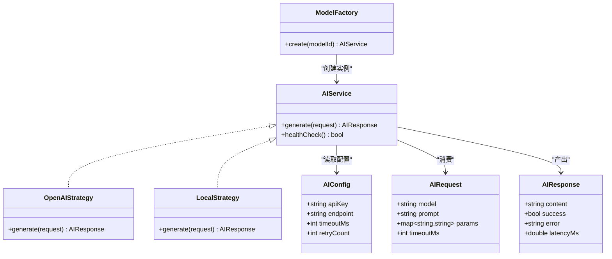
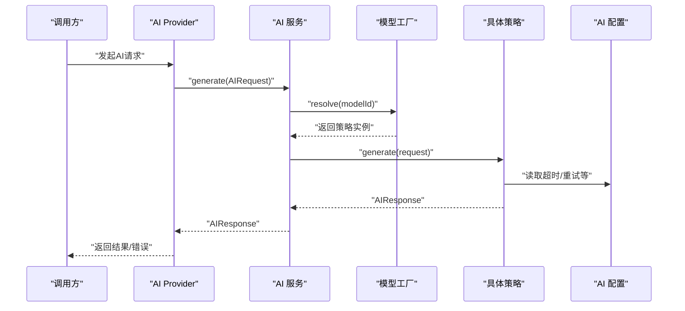
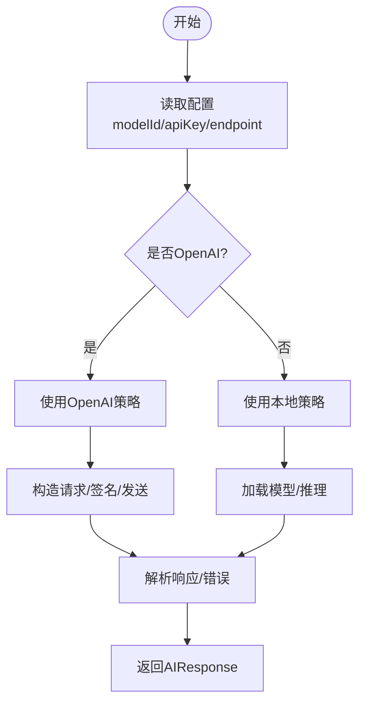
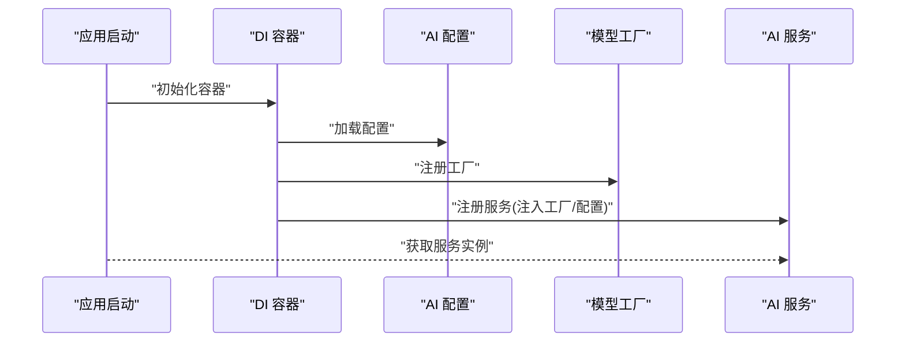
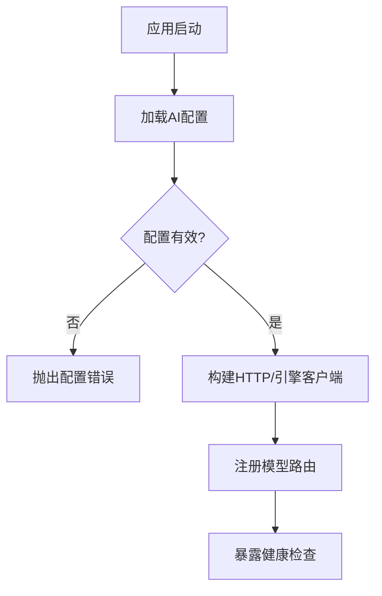
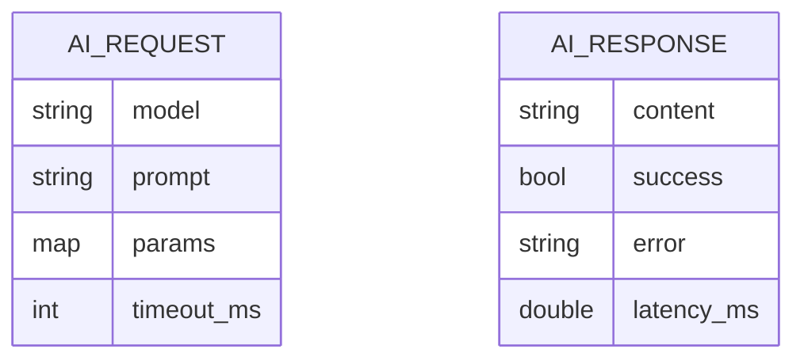
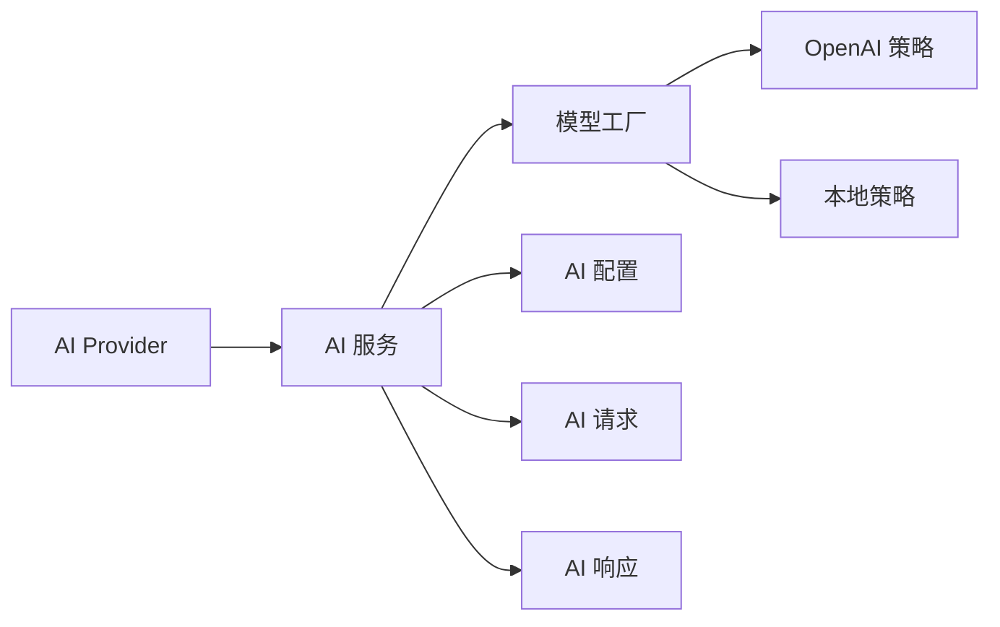

# AI架构设计

<cite>
**本文档引用的文件**   
- [lib/main.dart](file://lib/main.dart)
- [lib/di/dependency_injection.dart](file://lib/di/dependency_injection.dart)
- [lib/service/ai_service.dart](file://lib/service/ai_service.dart)
- [lib/service/ai_model_factory.dart](file://lib/service/ai_model_factory.dart)
- [lib/service/ai_strategy_openai.dart](file://lib/service/ai_strategy_openai.dart)
- [lib/service/ai_strategy_local.dart](file://lib/service/ai_strategy_local.dart)
- [lib/config/ai_config.dart](file://lib/config/ai_config.dart)
- [lib/domain/models/ai_request.dart](file://lib/domain/models/ai_request.dart)
- [lib/domain/models/ai_response.dart](file://lib/domain/models/ai_response.dart)
- [lib/application/providers/ai_provider.dart](file://lib/application/providers/ai_provider.dart)
- [test/application/ai/ai_service_test.dart](file://test/application/ai/ai_service_test.dart)
</cite>

## 目录
1. [简介](#简介)
2. [项目结构](#项目结构)
3. [核心组件](#核心组件)
4. [架构总览](#架构总览)
5. [详细组件分析](#详细组件分析)
6. [依赖关系分析](#依赖关系分析)
7. [性能考虑](#性能考虑)
8. [故障排查指南](#故障排查指南)
9. [结论](#结论)
10. [附录](#附录)

## 简介
本文件面向Varnamalaplus项目的AI子系统，系统化阐述其整体架构模式、组件交互与数据流。重点覆盖：
- AI服务层的设计原则、接口抽象与依赖注入机制
- 多模型支持（策略模式+工厂模式）的实现方式
- AI配置管理、服务发现与生命周期管理
- 架构图与组件关系图，明确各模块职责边界与通信协议

## 项目结构
AI相关代码遵循分层与模块化组织：
- domain层定义AI请求/响应等核心领域模型
- service层提供AI能力抽象与具体实现（OpenAI、本地模型等）
- config层集中管理AI配置项
- di层负责依赖注入与服务注册
- application层通过Provider暴露状态给UI
- test层包含AI服务的单元测试

**图表来源** 
- [lib/main.dart:1-100](file://lib/main.dart#L1-L100)
- [lib/di/dependency_injection.dart:1-120](file://lib/di/dependency_injection.dart#L1-L120)
- [lib/service/ai_service.dart:1-150](file://lib/service/ai_service.dart#L1-L150)
- [lib/service/ai_model_factory.dart:1-120](file://lib/service/ai_model_factory.dart#L1-L120)
- [lib/service/ai_strategy_openai.dart:1-120](file://lib/service/ai_strategy_openai.dart#L1-L120)
- [lib/service/ai_strategy_local.dart:1-120](file://lib/service/ai_strategy_local.dart#L1-L120)
- [lib/config/ai_config.dart:1-120](file://lib/config/ai_config.dart#L1-L120)
- [lib/domain/models/ai_request.dart:1-120](file://lib/domain/models/ai_request.dart#L1-L120)
- [lib/domain/models/ai_response.dart:1-120](file://lib/domain/models/ai_response.dart#L1-L120)
- [lib/application/providers/ai_provider.dart:1-120](file://lib/application/providers/ai_provider.dart#L1-L120)

**章节来源**
- [lib/main.dart:1-100](file://lib/main.dart#L1-L100)
- [lib/di/dependency_injection.dart:1-120](file://lib/di/dependency_injection.dart#L1-L120)

## 核心组件
- AI服务接口：统一对外暴露“生成/推理”能力，屏蔽底层模型差异
- 模型工厂：根据配置或运行时条件选择具体策略实现
- 策略实现：OpenAI策略、本地策略等，各自封装网络/引擎调用细节
- 领域模型：标准化请求/响应结构，确保跨层一致性
- 配置中心：集中管理API密钥、端点、超时、重试等参数
- 依赖注入：在应用启动时完成服务装配与生命周期管理
- Provider：将AI状态与结果暴露给UI层

**章节来源**
- [lib/service/ai_service.dart:1-150](file://lib/service/ai_service.dart#L1-L150)
- [lib/service/ai_model_factory.dart:1-120](file://lib/service/ai_model_factory.dart#L1-L120)
- [lib/service/ai_strategy_openai.dart:1-120](file://lib/service/ai_strategy_openai.dart#L1-L120)
- [lib/service/ai_strategy_local.dart:1-120](file://lib/service/ai_strategy_local.dart#L1-L120)
- [lib/config/ai_config.dart:1-120](file://lib/config/ai_config.dart#L1-L120)
- [lib/domain/models/ai_request.dart:1-120](file://lib/domain/models/ai_request.dart#L1-L120)
- [lib/domain/models/ai_response.dart:1-120](file://lib/domain/models/ai_response.dart#L1-L120)
- [lib/application/providers/ai_provider.dart:1-120](file://lib/application/providers/ai_provider.dart#L1-L120)

## 架构总览
AI子系统采用“接口抽象 + 策略模式 + 工厂模式 + 依赖注入”的分层架构：
- 上层仅依赖接口，不感知具体模型实现
- 工厂依据配置/环境动态选择策略
- 配置集中化，便于热更新与多环境切换
- 依赖注入贯穿服务生命周期，保证单例与可测试性

**图表来源** 
- [lib/domain/models/ai_request.dart:1-120](file://lib/domain/models/ai_request.dart#L1-L120)
- [lib/domain/models/ai_response.dart:1-120](file://lib/domain/models/ai_response.dart#L1-L120)
- [lib/service/ai_service.dart:1-150](file://lib/service/ai_service.dart#L1-L150)
- [lib/service/ai_model_factory.dart:1-120](file://lib/service/ai_model_factory.dart#L1-L120)
- [lib/service/ai_strategy_openai.dart:1-120](file://lib/service/ai_strategy_openai.dart#L1-L120)
- [lib/service/ai_strategy_local.dart:1-120](file://lib/service/ai_strategy_local.dart#L1-L120)
- [lib/config/ai_config.dart:1-120](file://lib/config/ai_config.dart#L1-L120)

## 详细组件分析

### AI服务层与接口抽象
- 目标：为上层提供统一的AI能力入口，屏蔽不同模型的差异
- 关键职责：
  - 接收标准化请求并返回标准化响应
  - 处理错误码、超时、重试等横切关注点
  - 暴露健康检查与元信息能力
- 设计要点：
  - 接口最小化，避免泄露实现细节
  - 异常统一包装，便于上层处理
  - 与配置解耦，通过注入获取

**图表来源** 
- [lib/application/providers/ai_provider.dart:1-120](file://lib/application/providers/ai_provider.dart#L1-L120)
- [lib/service/ai_service.dart:1-150](file://lib/service/ai_service.dart#L1-L150)
- [lib/service/ai_model_factory.dart:1-120](file://lib/service/ai_model_factory.dart#L1-L120)
- [lib/service/ai_strategy_openai.dart:1-120](file://lib/service/ai_strategy_openai.dart#L1-L120)
- [lib/service/ai_strategy_local.dart:1-120](file://lib/service/ai_strategy_local.dart#L1-L120)
- [lib/config/ai_config.dart:1-120](file://lib/config/ai_config.dart#L1-L120)

**章节来源**
- [lib/service/ai_service.dart:1-150](file://lib/service/ai_service.dart#L1-L150)
- [lib/application/providers/ai_provider.dart:1-120](file://lib/application/providers/ai_provider.dart#L1-L120)

### 多模型支持与策略模式
- 目标：在不改动上层的前提下，灵活接入新模型
- 实现要点：
  - 所有模型实现同一接口
  - 策略内部封装各自的网络/引擎调用细节
  - 通过工厂按modelId选择策略
- 扩展性：新增模型只需实现接口并注册到工厂

**图表来源** 
- [lib/service/ai_model_factory.dart:1-120](file://lib/service/ai_model_factory.dart#L1-L120)
- [lib/service/ai_strategy_openai.dart:1-120](file://lib/service/ai_strategy_openai.dart#L1-L120)
- [lib/service/ai_strategy_local.dart:1-120](file://lib/service/ai_strategy_local.dart#L1-L120)
- [lib/config/ai_config.dart:1-120](file://lib/config/ai_config.dart#L1-L120)

**章节来源**
- [lib/service/ai_model_factory.dart:1-120](file://lib/service/ai_model_factory.dart#L1-L120)
- [lib/service/ai_strategy_openai.dart:1-120](file://lib/service/ai_strategy_openai.dart#L1-L120)
- [lib/service/ai_strategy_local.dart:1-120](file://lib/service/ai_strategy_local.dart#L1-L120)

### 工厂模式与依赖注入
- 目标：集中管理对象创建与装配，降低耦合
- 关键点：
  - 工厂根据配置或环境变量返回不同实现
  - 依赖注入容器负责生命周期（单例/作用域）
  - 测试时可替换为Mock/Fake实现
- 典型流程：应用启动 -> 初始化配置 -> 注册服务 -> 解析依赖 -> 提供服务

**图表来源** 
- [lib/di/dependency_injection.dart:1-120](file://lib/di/dependency_injection.dart#L1-L120)
- [lib/config/ai_config.dart:1-120](file://lib/config/ai_config.dart#L1-L120)
- [lib/service/ai_model_factory.dart:1-120](file://lib/service/ai_model_factory.dart#L1-L120)
- [lib/service/ai_service.dart:1-150](file://lib/service/ai_service.dart#L1-L150)

**章节来源**
- [lib/di/dependency_injection.dart:1-120](file://lib/di/dependency_injection.dart#L1-L120)

### 配置管理与服务发现
- 配置项建议：
  - API密钥、端点、超时、重试次数、并发限制
  - 模型路由表（modelId -> 策略类型）
- 服务发现：
  - 基于配置表的静态路由
  - 可扩展为动态注册（如插件式加载）
- 生命周期：
  - 配置变更触发重连/重建客户端
  - 健康检查失败自动降级

**图表来源** 
- [lib/config/ai_config.dart:1-120](file://lib/config/ai_config.dart#L1-L120)
- [lib/service/ai_service.dart:1-150](file://lib/service/ai_service.dart#L1-L150)

**章节来源**
- [lib/config/ai_config.dart:1-120](file://lib/config/ai_config.dart#L1-L120)

### 领域模型与数据流
- 请求模型：包含模型标识、提示词、参数、超时等
- 响应模型：包含内容、成功标志、错误信息、延迟统计
- 数据流：
  - 上层组装请求 -> 服务层校验 -> 策略执行 -> 响应归一化 -> 返回上层

**图表来源** 
- [lib/domain/models/ai_request.dart:1-120](file://lib/domain/models/ai_request.dart#L1-L120)
- [lib/domain/models/ai_response.dart:1-120](file://lib/domain/models/ai_response.dart#L1-L120)

**章节来源**
- [lib/domain/models/ai_request.dart:1-120](file://lib/domain/models/ai_request.dart#L1-L120)
- [lib/domain/models/ai_response.dart:1-120](file://lib/domain/models/ai_response.dart#L1-L120)

## 依赖关系分析
- 松耦合：上层仅依赖接口；具体实现通过工厂与DI装配
- 内聚性：每个策略自包含网络/引擎逻辑，易于独立测试
- 外部依赖：
  - HTTP客户端（OpenAI策略）
  - 本地推理引擎（本地策略）
  - 配置存储（文件或环境变量）

**图表来源** 
- [lib/application/providers/ai_provider.dart:1-120](file://lib/application/providers/ai_provider.dart#L1-L120)
- [lib/service/ai_service.dart:1-150](file://lib/service/ai_service.dart#L1-L150)
- [lib/service/ai_model_factory.dart:1-120](file://lib/service/ai_model_factory.dart#L1-L120)
- [lib/service/ai_strategy_openai.dart:1-120](file://lib/service/ai_strategy_openai.dart#L1-L120)
- [lib/service/ai_strategy_local.dart:1-120](file://lib/service/ai_strategy_local.dart#L1-L120)
- [lib/config/ai_config.dart:1-120](file://lib/config/ai_config.dart#L1-L120)
- [lib/domain/models/ai_request.dart:1-120](file://lib/domain/models/ai_request.dart#L1-L120)
- [lib/domain/models/ai_response.dart:1-120](file://lib/domain/models/ai_response.dart#L1-L120)

**章节来源**
- [lib/application/providers/ai_provider.dart:1-120](file://lib/application/providers/ai_provider.dart#L1-L120)
- [lib/service/ai_service.dart:1-150](file://lib/service/ai_service.dart#L1-L150)
- [lib/service/ai_model_factory.dart:1-120](file://lib/service/ai_model_factory.dart#L1-L120)

## 性能考虑
- 连接池与复用：HTTP客户端应复用连接，减少握手开销
- 超时与重试：合理设置超时与退避策略，避免雪崩
- 缓存：对相同请求进行去重或短期缓存
- 并发控制：限制并发数，防止下游限流
- 本地模型：优先使用内存映射与批处理推理

[本节为通用指导，无需特定文件引用]

## 故障排查指南
- 常见问题：
  - 配置缺失或无效（API Key/Endpoint）
  - 网络超时/鉴权失败
  - 模型路由未注册导致无法解析
- 定位步骤：
  - 检查健康检查接口
  - 打印请求/响应日志
  - 验证工厂路由表
- 恢复策略：
  - 自动重试与降级
  - 动态刷新配置
  - 快速回滚到备用模型

**章节来源**
- [lib/service/ai_service.dart:1-150](file://lib/service/ai_service.dart#L1-L150)
- [lib/config/ai_config.dart:1-120](file://lib/config/ai_config.dart#L1-L120)
- [lib/service/ai_model_factory.dart:1-120](file://lib/service/ai_model_factory.dart#L1-L120)

## 结论
本架构通过清晰的接口抽象、策略与工厂模式以及完善的依赖注入，实现了高内聚、低耦合的AI子系统。配置集中化与健康检查保障了可运维性，领域模型确保了数据一致性。未来可在不改动上层的前提下无缝接入更多模型，并通过服务发现与动态配置提升弹性。

[本节为总结，无需特定文件引用]

## 附录
- 单元测试参考：
  - 针对AI服务的关键路径与异常分支进行覆盖

**章节来源**
- [test/application/ai/ai_service_test.dart:1-200](file://test/application/ai/ai_service_test.dart#L1-L200)