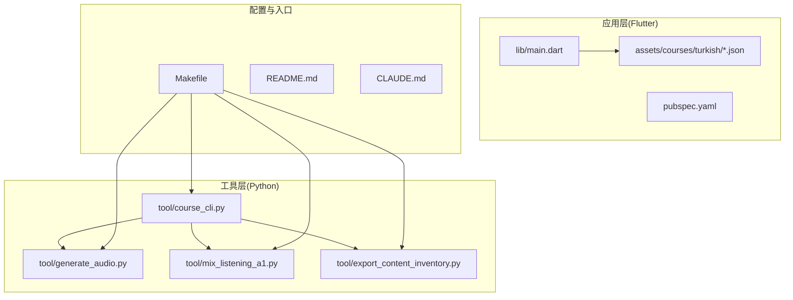
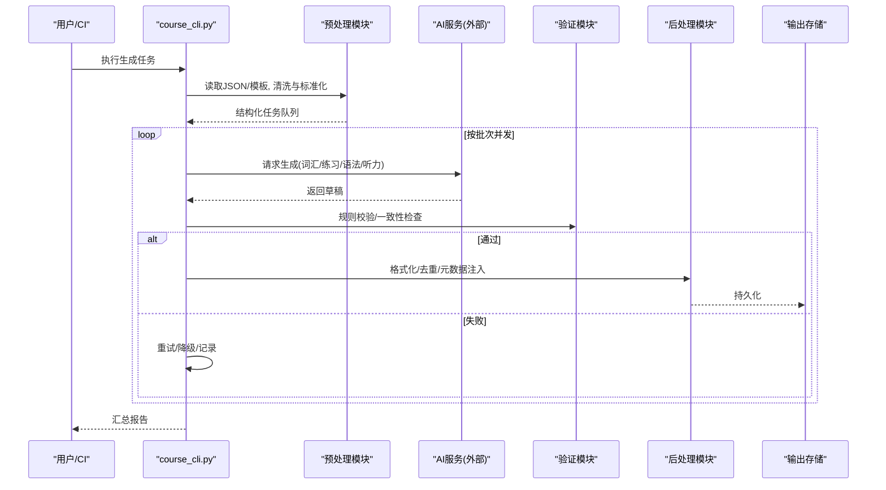
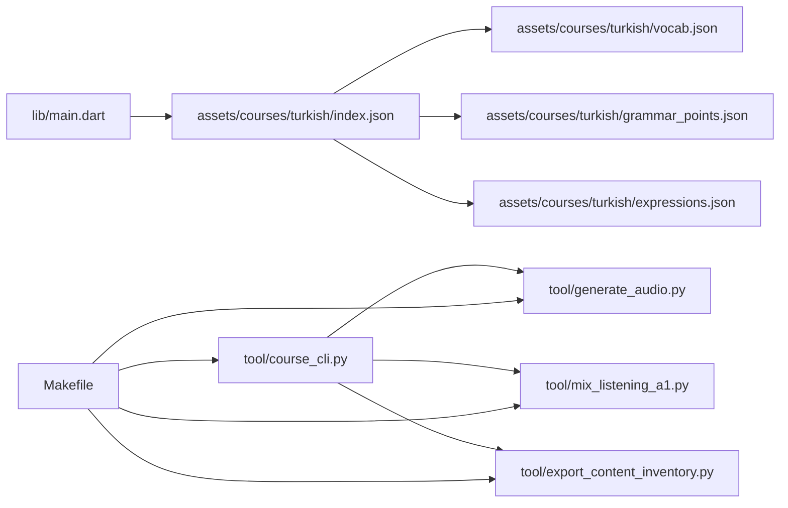

# 内容生成管道

<cite>
**本文档引用的文件**   
- [README.md](file://README.md)
- [CLAUDE.md](file://CLAUDE.md)
- [Makefile](file://Makefile)
- [tool/course_cli.py](file://tool/course_cli.py)
- [tool/generate_audio.py](file://tool/generate_audio.py)
- [tool/mix_listening_a1.py](file://tool/mix_listening_a1.py)
- [tool/export_content_inventory.py](file://tool/export_content_inventory.py)
- [assets/courses/turkish/vocab.json](file://assets/courses/turkish/vocab.json)
- [assets/courses/turkish/grammar_points.json](file://assets/courses/turkish/grammar_points.json)
- [assets/courses/turkish/index.json](file://assets/courses/turkish/index.json)
- [assets/courses/turkish/expressions.json](file://assets/courses/turkish/expressions.json)
- [lib/main.dart](file://lib/main.dart)
- [pubspec.yaml](file://pubspec.yaml)
</cite>

## 目录
1. [简介](#简介)
2. [项目结构](#项目结构)
3. [核心组件](#核心组件)
4. [架构总览](#架构总览)
5. [详细组件分析](#详细组件分析)
6. [依赖关系分析](#依赖关系分析)
7. [性能考量](#性能考量)
8. [故障排查指南](#故障排查指南)
9. [结论](#结论)
10. [附录](#附录)

## 简介
本文件面向“内容生成管道”的完整设计与实现，覆盖从输入到输出的全链路：数据预处理、AI调用、结果验证与后处理。文档同时说明不同类型内容的生成策略（词汇表、练习题、语法示例、听力材料等），并给出批处理机制、并发控制、错误重试策略、质量评估、去重算法与版本控制的实践建议。最后提供性能优化、缓存策略与成本控制方案，帮助读者在工程层面落地可维护、可扩展的内容生产流水线。

## 项目结构
仓库采用多端应用（Flutter）+ 工具脚本（Python）的组合形态：
- Flutter 应用层负责课程加载、展示与交互，资源以 JSON 为主，位于 assets/courses/<语言>/ 下。
- Python 工具脚本集中在 tool/ 目录，用于 CLI 编排、音频生成、听力混合、内容清单导出等。
- Makefile 提供常用命令入口，便于统一触发构建与工具链。

图表来源
- [lib/main.dart:1-200](file://lib/main.dart#L1-L200)
- [pubspec.yaml:1-200](file://pubspec.yaml#L1-L200)
- [tool/course_cli.py:1-200](file://tool/course_cli.py#L1-L200)
- [tool/generate_audio.py:1-200](file://tool/generate_audio.py#L1-L200)
- [tool/mix_listening_a1.py:1-200](file://tool/mix_listening_a1.py#L1-L200)
- [tool/export_content_inventory.py:1-200](file://tool/export_content_inventory.py#L1-L200)
- [Makefile:1-200](file://Makefile#L1-L200)

章节来源
- [README.md:1-200](file://README.md#L1-L200)
- [CLAUDE.md:1-200](file://CLAUDE.md#L1-L200)
- [Makefile:1-200](file://Makefile#L1-L200)
- [pubspec.yaml:1-200](file://pubspec.yaml#L1-L200)

## 核心组件
- 数据源与模型
  - 词汇表 vocab.json：词条、释义、例句、难度等级等。
  - 语法点 grammar_points.json：语法条目、说明、示例句、练习提示。
  - 表达 expressions.json：固定搭配、习语、场景化表达。
  - 索引 index.json：课程结构、章节组织、资源映射。
- 工具脚本
  - course_cli.py：CLI 编排器，协调各子任务（生成、校验、打包）。
  - generate_audio.py：文本转语音、批量音频生成与元数据写入。
  - mix_listening_a1.py：A1 级别听力素材混音、分段与标注。
  - export_content_inventory.py：导出内容清单，便于审计与版本追踪。
- 应用集成
  - lib/main.dart：应用启动、资源加载与路由初始化。
  - pubspec.yaml：依赖声明与构建配置。

章节来源
- [assets/courses/turkish/vocab.json:1-200](file://assets/courses/turkish/vocab.json#L1-L200)
- [assets/courses/turkish/grammar_points.json:1-200](file://assets/courses/turkish/grammar_points.json#L1-L200)
- [assets/courses/turkish/expressions.json:1-200](file://assets/courses/turkish/expressions.json#L1-L200)
- [assets/courses/turkish/index.json:1-200](file://assets/courses/turkish/index.json#L1-L200)
- [tool/course_cli.py:1-200](file://tool/course_cli.py#L1-L200)
- [tool/generate_audio.py:1-200](file://tool/generate_audio.py#L1-L200)
- [tool/mix_listening_a1.py:1-200](file://tool/mix_listening_a1.py#L1-L200)
- [tool/export_content_inventory.py:1-200](file://tool/export_content_inventory.py#L1-L200)
- [lib/main.dart:1-200](file://lib/main.dart#L1-L200)
- [pubspec.yaml:1-200](file://pubspec.yaml#L1-L200)

## 架构总览
内容生成管道遵循“输入→预处理→AI生成→验证→后处理→输出”的分阶段流水线，支持多种内容类型与并行批处理。

图表来源
- [tool/course_cli.py:1-200](file://tool/course_cli.py#L1-L200)
- [tool/generate_audio.py:1-200](file://tool/generate_audio.py#L1-L200)
- [tool/mix_listening_a1.py:1-200](file://tool/mix_listening_a1.py#L1-L200)
- [tool/export_content_inventory.py:1-200](file://tool/export_content_inventory.py#L1-L200)

## 详细组件分析

### 数据预处理
- 目标：将原始 JSON/模板转换为标准化的任务对象，确保字段完整性、编码一致性与格式规范。
- 关键步骤
  - 读取与解析：vocab.json、grammar_points.json、expressions.json、index.json。
  - 清洗与标准化：去除空白、统一大小写、规范化标点、归一化数字与日期。
  - 校验与补全：必填字段检查、枚举值校验、默认值填充。
  - 任务拆分：按内容类型与难度切分批次，生成可并发处理的作业单元。
- 复杂度与优化
  - I/O 密集型，建议使用流式读取与大文件分块处理。
  - 使用内存映射或惰性加载减少峰值内存占用。

章节来源
- [assets/courses/turkish/vocab.json:1-200](file://assets/courses/turkish/vocab.json#L1-L200)
- [assets/courses/turkish/grammar_points.json:1-200](file://assets/courses/turkish/grammar_points.json#L1-L200)
- [assets/courses/turkish/expressions.json:1-200](file://assets/courses/turkish/expressions.json#L1-L200)
- [assets/courses/turkish/index.json:1-200](file://assets/courses/turkish/index.json#L1-L200)

### AI调用与生成策略
- 目标：根据任务类型调用合适的AI能力，产出高质量草稿。
- 策略
  - 词汇表：基于词根/主题扩展，生成释义、例句、搭配与难度标签。
  - 练习题：按题型（选择、填空、匹配）生成题干、选项、答案与解析。
  - 语法示例：围绕语法点生成不同语境下的例句与对比说明。
  - 听力材料：生成对话/独白文本，标注停顿、重音与语速建议。
- 并发与限流
  - 使用令牌桶或滑动窗口限制并发请求数，避免触发服务端限流。
  - 对长文本进行分片，降低单次请求负载。
- 错误处理
  - 网络异常：指数退避重试，设置最大重试次数与超时。
  - 内容不合规：回退到模板或人工审核队列。

章节来源
- [tool/course_cli.py:1-200](file://tool/course_cli.py#L1-L200)
- [tool/generate_audio.py:1-200](file://tool/generate_audio.py#L1-L200)

### 结果验证
- 目标：确保生成内容符合业务规则与质量标准。
- 校验维度
  - 结构校验：JSON Schema/自定义规则集。
  - 语义校验：重复检测、长度阈值、敏感词过滤。
  - 一致性校验：跨文件引用完整性、ID唯一性、索引同步。
- 自动化
  - 单元测试与快照测试保障回归稳定性。
  - 预提交钩子触发轻量校验，阻断不合格变更。

章节来源
- [tool/export_content_inventory.py:1-200](file://tool/export_content_inventory.py#L1-L200)

### 后处理与输出
- 目标：将草稿转化为最终可用资源，便于应用加载与播放。
- 处理项
  - 格式化：统一编码、缩进、键顺序。
  - 去重：基于指纹（哈希）与相似度（编辑距离/余弦）合并近似条目。
  - 元数据注入：版本号、生成时间、来源模型、质量评分。
  - 资源归档：音频文件命名规范、路径映射、索引更新。
- 输出
  - 更新 assets/courses/<语言>/ 下的 JSON 与媒体文件。
  - 生成内容清单与变更日志，供审计与回滚。

章节来源
- [tool/generate_audio.py:1-200](file://tool/generate_audio.py#L1-L200)
- [tool/mix_listening_a1.py:1-200](file://tool/mix_listening_a1.py#L1-L200)
- [tool/export_content_inventory.py:1-200](file://tool/export_content_inventory.py#L1-L200)

### 批处理机制与并发控制
- 批处理
  - 按内容类型与难度划分批次，支持增量与全量模式。
  - 断点续传：记录已处理任务状态，失败后可恢复。
- 并发控制
  - 进程/线程池上限，I/O 与 CPU 密集任务分离。
  - 背压与队列：防止下游过载，保证稳定吞吐。
- 监控
  - 指标采集：QPS、延迟、错误率、资源使用率。
  - 告警：阈值触发通知，快速定位瓶颈。

章节来源
- [tool/course_cli.py:1-200](file://tool/course_cli.py#L1-L200)

### 错误重试策略
- 分类
  - 瞬态错误（网络抖动、限流）：指数退避 + 随机抖动。
  - 幂等错误（重复提交）：基于请求ID去重。
  - 不可恢复错误（参数非法、权限不足）：直接失败并记录。
- 策略
  - 最大重试次数、超时时间、熔断开关。
  - 降级路径：切换备用模型或回退模板。

章节来源
- [tool/course_cli.py:1-200](file://tool/course_cli.py#L1-L200)

### 内容质量评估
- 自动评估
  - 可读性指标：句子长度分布、词汇多样性。
  - 一致性指标：术语统一、风格一致、难度梯度合理。
  - 安全合规：敏感词、版权风险扫描。
- 人工复核
  - 抽样抽检与专家打分，形成反馈闭环。
- 度量与可视化
  - 质量分数趋势、问题类别统计、改进建议。

章节来源
- [tool/export_content_inventory.py:1-200](file://tool/export_content_inventory.py#L1-L200)

### 去重算法
- 指纹去重
  - 对文本/音频片段计算哈希，作为唯一标识。
- 相似度去重
  - 文本：编辑距离、TF-IDF 余弦相似度。
  - 音频：短时能量特征、梅尔频谱相似度。
- 合并策略
  - 保留高质量版本，合并元数据与引用。

章节来源
- [tool/generate_audio.py:1-200](file://tool/generate_audio.py#L1-L200)
- [tool/mix_listening_a1.py:1-200](file://tool/mix_listening_a1.py#L1-L200)

### 版本控制
- 文件级
  - Git 管理 JSON 与脚本，分支策略与代码评审。
- 内容级
  - 每个生成产物附带版本号与时间戳，支持回滚。
- 审计
  - 变更日志、差异对比、影响范围分析。

章节来源
- [tool/export_content_inventory.py:1-200](file://tool/export_content_inventory.py#L1-L200)

### 生成性能优化
- 缓存
  - 请求级缓存（相同输入命中结果）、结果级缓存（持久化至本地/Redis）。
  - 冷启动预热：常用模板与模型权重预加载。
- 并行
  - 多核并行、异步 I/O、批内并行。
- 压缩与传输
  - 文本压缩、音频码率自适应、CDN 分发。

章节来源
- [tool/course_cli.py:1-200](file://tool/course_cli.py#L1-L200)
- [tool/generate_audio.py:1-200](file://tool/generate_audio.py#L1-L200)

### 成本控制方案
- 模型选择
  - 低成本模型用于草稿生成，高成本模型用于精修。
- 用量治理
  - 配额与预算上限、按需扩缩容。
- 优化技巧
  - 提示词精简、上下文裁剪、批量请求合并。

章节来源
- [tool/course_cli.py:1-200](file://tool/course_cli.py#L1-L200)

## 依赖关系分析

图表来源
- [lib/main.dart:1-200](file://lib/main.dart#L1-L200)
- [assets/courses/turkish/index.json:1-200](file://assets/courses/turkish/index.json#L1-L200)
- [assets/courses/turkish/vocab.json:1-200](file://assets/courses/turkish/vocab.json#L1-L200)
- [assets/courses/turkish/grammar_points.json:1-200](file://assets/courses/turkish/grammar_points.json#L1-L200)
- [assets/courses/turkish/expressions.json:1-200](file://assets/courses/turkish/expressions.json#L1-L200)
- [tool/course_cli.py:1-200](file://tool/course_cli.py#L1-L200)
- [tool/generate_audio.py:1-200](file://tool/generate_audio.py#L1-L200)
- [tool/mix_listening_a1.py:1-200](file://tool/mix_listening_a1.py#L1-L200)
- [tool/export_content_inventory.py:1-200](file://tool/export_content_inventory.py#L1-L200)
- [Makefile:1-200](file://Makefile#L1-L200)

章节来源
- [pubspec.yaml:1-200](file://pubspec.yaml#L1-L200)

## 性能考量
- I/O 优化：大文件分块、流式处理、读写分离。
- 计算优化：向量化操作、缓存热点数据、避免重复计算。
- 网络优化：连接复用、超时与重试、负载均衡。
- 存储优化：索引设计、冷热分层、压缩归档。

[本节为通用指导，不直接分析具体文件]

## 故障排查指南
- 常见问题
  - 生成失败：检查网络、鉴权、限流与模型可用性。
  - 内容不一致：核对字段映射、模板版本与索引同步。
  - 音频异常：采样率、编码格式与播放器兼容性。
- 诊断手段
  - 日志聚合与链路追踪，定位失败节点。
  - 单元测试与回放用例，复现问题。
  - 指标看板与告警，提前发现异常。

章节来源
- [tool/course_cli.py:1-200](file://tool/course_cli.py#L1-L200)
- [tool/generate_audio.py:1-200](file://tool/generate_audio.py#L1-L200)
- [tool/mix_listening_a1.py:1-200](file://tool/mix_listening_a1.py#L1-L200)
- [tool/export_content_inventory.py:1-200](file://tool/export_content_inventory.py#L1-L200)

## 结论
本管道以模块化与可观测性为核心，结合批处理、并发控制与智能重试，实现了从数据预处理到内容产出的端到端自动化。通过质量评估、去重与版本控制，保障了内容的一致性与可追溯性。性能优化与成本控制策略进一步提升了吞吐与经济性，适用于大规模语言学习内容的持续生产。

[本节为总结性内容，不直接分析具体文件]

## 附录
- 最佳实践
  - 明确输入契约与输出规范，强化校验与文档。
  - 小步快跑，灰度发布与回滚预案。
  - 建立反馈闭环，持续迭代提示词与流程。
- 参考资源
  - 课程结构与模板说明见 docs/authoring/ 目录。
  - 音频录制与听力格式规范见 docs/audio-recording-guidelines.md。

[本节为补充信息，不直接分析具体文件]