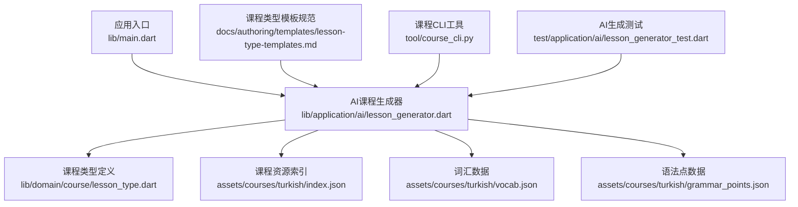
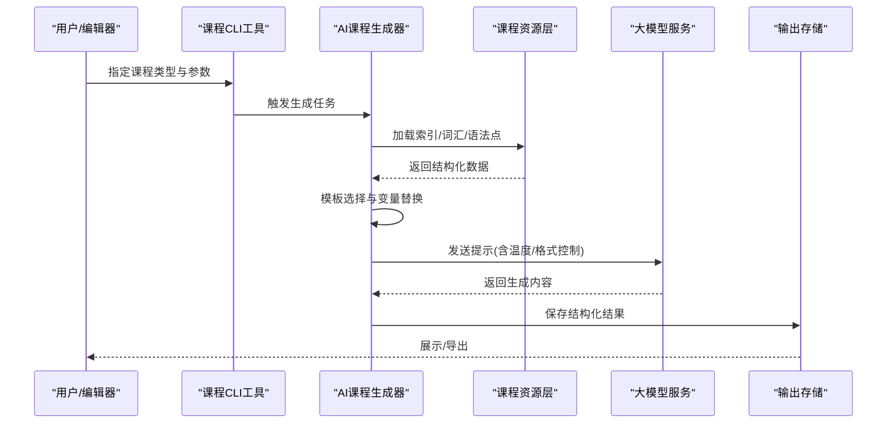
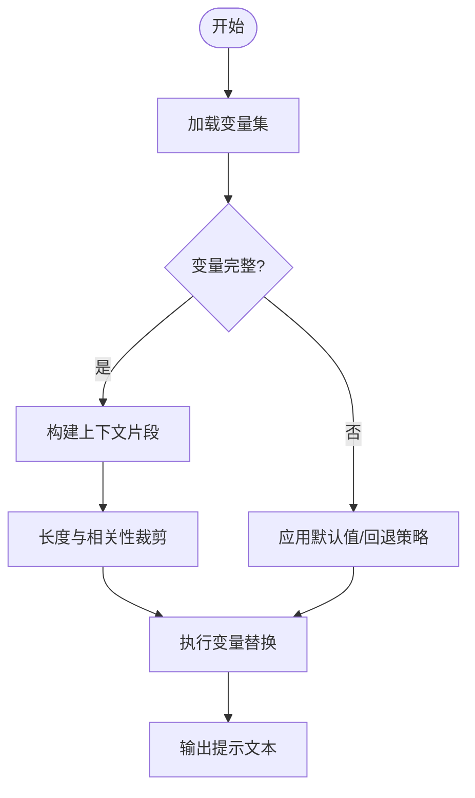
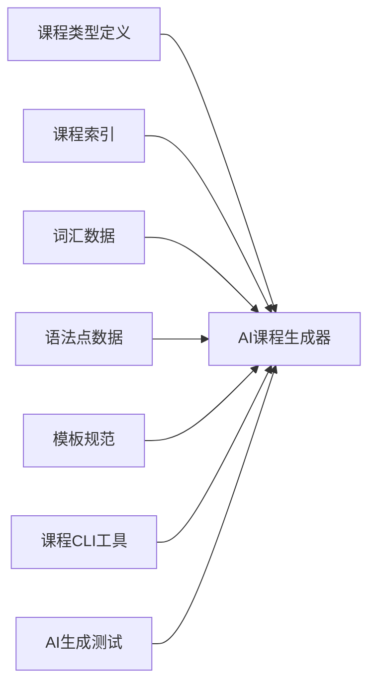

# 提示工程系统

<cite>
**本文档引用的文件**   
- [README.md](file://README.md)
- [CLAUDE.md](file://CLAUDE.md)
- [lib/main.dart](file://lib/main.dart)
- [lib/application/ai/lesson_generator.dart](file://lib/application/ai/lesson_generator.dart)
- [lib/domain/course/lesson_type.dart](file://lib/domain/course/lesson_type.dart)
- [assets/courses/turkish/index.json](file://assets/courses/turkish/index.json)
- [assets/courses/turkish/vocab.json](file://assets/courses/turkish/vocab.json)
- [assets/courses/turkish/grammar_points.json](file://assets/courses/turkish/grammar_points.json)
- [docs/authoring/templates/lesson-type-templates.md](file://docs/authoring/templates/lesson-type-templates.md)
- [tool/course_cli.py](file://tool/course_cli.py)
- [test/application/ai/lesson_generator_test.dart](file://test/application/ai/lesson_generator_test.dart)
</cite>

## 目录
1. [简介](#简介)
2. [项目结构](#项目结构)
3. [核心组件](#核心组件)
4. [架构总览](#架构总览)
5. [详细组件分析](#详细组件分析)
6. [依赖关系分析](#依赖关系分析)
7. [性能考虑](#性能考虑)
8. [故障排查指南](#故障排查指南)
9. [结论](#结论)
10. [附录](#附录)

## 简介
本文件面向“提示工程系统”的开发者与内容作者，系统性阐述提示模板设计、变量替换机制与上下文构建策略；覆盖词汇练习、语法讲解、听力理解等课程类型的提示模板差异；说明提示优化技术（温度参数调优、输出格式控制）、版本管理与A/B测试框架、效果评估指标；并提供调试工具、性能监控与质量检查方法。文档力求在保持技术深度的同时，对非专业读者友好。

## 项目结构
仓库采用多端Flutter应用+Python工具链的组合：
- lib：Flutter应用核心代码，包含AI生成课程的逻辑入口与领域模型
- assets：课程内容资源（如土耳其语课程索引、词汇、语法点）
- docs：作者指南与模板规范，含课程类型模板说明
- tool：命令行工具，用于课程处理与批量生成
- test：单元测试与集成测试，覆盖AI生成流程与数据一致性

图表来源
- [lib/main.dart](file://lib/main.dart)
- [lib/application/ai/lesson_generator.dart](file://lib/application/ai/lesson_generator.dart)
- [lib/domain/course/lesson_type.dart](file://lib/domain/course/lesson_type.dart)
- [assets/courses/turkish/index.json](file://assets/courses/turkish/index.json)
- [assets/courses/turkish/vocab.json](file://assets/courses/turkish/vocab.json)
- [assets/courses/turkish/grammar_points.json](file://assets/courses/turkish/grammar_points.json)
- [docs/authoring/templates/lesson-type-templates.md](file://docs/authoring/templates/lesson-type-templates.md)
- [tool/course_cli.py](file://tool/course_cli.py)
- [test/application/ai/lesson_generator_test.dart](file://test/application/ai/lesson_generator_test.dart)

章节来源
- [README.md](file://README.md)
- [CLAUDE.md](file://CLAUDE.md)

## 核心组件
- AI课程生成器：负责根据课程类型、资源与模板构建上下文，调用大模型生成教学内容，并返回结构化结果
- 课程类型定义：抽象词汇练习、语法讲解、听力理解等类型，统一接口与字段约束
- 课程资源层：提供词汇、语法点、索引等静态数据，作为提示上下文的素材来源
- 模板规范：定义不同课程类型的提示模板结构与变量占位符
- CLI工具：支持批量导入、校验与生成，便于自动化流水线
- 测试套件：验证生成流程、数据一致性与错误路径

章节来源
- [lib/application/ai/lesson_generator.dart](file://lib/application/ai/lesson_generator.dart)
- [lib/domain/course/lesson_type.dart](file://lib/domain/course/lesson_type.dart)
- [assets/courses/turkish/index.json](file://assets/courses/turkish/index.json)
- [assets/courses/turkish/vocab.json](file://assets/courses/turkish/vocab.json)
- [assets/courses/turkish/grammar_points.json](file://assets/courses/turkish/grammar_points.json)
- [docs/authoring/templates/lesson-type-templates.md](file://docs/authoring/templates/lesson-type-templates.md)
- [tool/course_cli.py](file://tool/course_cli.py)
- [test/application/ai/lesson_generator_test.dart](file://test/application/ai/lesson_generator_test.dart)

## 架构总览
提示工程系统的整体流程如下：
- 输入：课程类型、目标语言、学习者水平、资源片段（词汇/语法/音频）
- 构建：按模板选择与变量替换，组装上下文
- 生成：调用大模型API，带温度与输出格式控制
- 输出：结构化教学内容（题目、解析、答案、音频链接等）
- 评估：通过测试与指标进行质量校验

图表来源
- [lib/application/ai/lesson_generator.dart](file://lib/application/ai/lesson_generator.dart)
- [assets/courses/turkish/index.json](file://assets/courses/turkish/index.json)
- [assets/courses/turkish/vocab.json](file://assets/courses/turkish/vocab.json)
- [assets/courses/turkish/grammar_points.json](file://assets/courses/turkish/grammar_points.json)
- [tool/course_cli.py](file://tool/course_cli.py)

## 详细组件分析

### 课程类型与模板
- 词汇练习：以词汇条目为核心，生成匹配题、填空、例句与发音提示
- 语法讲解：围绕语法点展开，提供规则说明、对比示例与练习
- 听力理解：结合音频片段，生成听写、选择题与理解问答

模板设计要点：
- 使用占位符注入变量（如词汇列表、难度等级、目标场景）
- 明确输出结构（JSON Schema或固定段落），便于后续解析
- 针对不同课程类型设置差异化指令与约束

章节来源
- [docs/authoring/templates/lesson-type-templates.md](file://docs/authoring/templates/lesson-type-templates.md)
- [lib/domain/course/lesson_type.dart](file://lib/domain/course/lesson_type.dart)

### 变量替换机制
- 变量来源：课程索引、词汇表、语法点、用户偏好
- 替换策略：安全插值、缺失值回退、长度限制与去重
- 上下文裁剪：按相关性评分与预算控制，避免超限

图表来源
- [lib/application/ai/lesson_generator.dart](file://lib/application/ai/lesson_generator.dart)
- [assets/courses/turkish/vocab.json](file://assets/courses/turkish/vocab.json)
- [assets/courses/turkish/grammar_points.json](file://assets/courses/turkish/grammar_points.json)

### 上下文构建策略
- 分层构建：先基础信息（课程类型、目标语言），再素材（词汇/语法/音频），最后约束（输出格式、风格）
- 动态拼接：按课程类型选择必要片段，减少噪声
- 缓存与复用：对常用片段建立缓存，提升生成速度

章节来源
- [lib/application/ai/lesson_generator.dart](file://lib/application/ai/lesson_generator.dart)
- [assets/courses/turkish/index.json](file://assets/courses/turkish/index.json)

### 提示优化技术
- 温度参数调优：低温度提高稳定性，高温度增强多样性；按题型自动选择
- 输出格式控制：强制JSON或结构化段落，便于解析与渲染
- 少样本提示：提供高质量示例，提升一致性
- 分步生成：将复杂任务拆分为子步骤，降低出错率

章节来源
- [lib/application/ai/lesson_generator.dart](file://lib/application/ai/lesson_generator.dart)
- [test/application/ai/lesson_generator_test.dart](file://test/application/ai/lesson_generator_test.dart)

### 提示版本管理与A/B测试框架
- 版本管理：为每个模板与参数组合分配版本号，记录变更日志
- A/B测试：并行运行多版本提示，收集关键指标（正确率、耗时、成本）
- 回滚策略：基于指标阈值自动切换或回滚到稳定版本

章节来源
- [tool/course_cli.py](file://tool/course_cli.py)
- [test/application/ai/lesson_generator_test.dart](file://test/application/ai/lesson_generator_test.dart)

### 效果评估指标
- 内容质量：语法正确性、语义连贯性、教学有效性
- 学习体验：难度适配度、反馈清晰度、交互流畅性
- 工程指标：响应时间、Token消耗、失败率

章节来源
- [test/application/ai/lesson_generator_test.dart](file://test/application/ai/lesson_generator_test.dart)

### 调试工具与质量检查
- 本地预览：快速查看提示文本与生成结果
- 断言测试：对输出结构、关键字段进行校验
- 日志追踪：记录变量替换、上下文大小、调用参数

章节来源
- [tool/course_cli.py](file://tool/course_cli.py)
- [test/application/ai/lesson_generator_test.dart](file://test/application/ai/lesson_generator_test.dart)

## 依赖关系分析
- 生成器依赖课程类型定义与资源层数据
- 模板规范指导上下文构建与变量替换
- CLI工具驱动生成流程，便于批处理与自动化
- 测试套件保障生成质量与稳定性

图表来源
- [lib/domain/course/lesson_type.dart](file://lib/domain/course/lesson_type.dart)
- [assets/courses/turkish/index.json](file://assets/courses/turkish/index.json)
- [assets/courses/turkish/vocab.json](file://assets/courses/turkish/vocab.json)
- [assets/courses/turkish/grammar_points.json](file://assets/courses/turkish/grammar_points.json)
- [docs/authoring/templates/lesson-type-templates.md](file://docs/authoring/templates/lesson-type-templates.md)
- [tool/course_cli.py](file://tool/course_cli.py)
- [test/application/ai/lesson_generator_test.dart](file://test/application/ai/lesson_generator_test.dart)

章节来源
- [lib/application/ai/lesson_generator.dart](file://lib/application/ai/lesson_generator.dart)

## 性能考虑
- 上下文裁剪：限制Token数量，优先高相关片段
- 并发调用：对独立任务并行处理，缩短端到端时延
- 缓存策略：对重复资源与中间结果进行缓存
- 降级方案：当模型不可用时，回退到模板直出或本地规则

[本节为通用指导，不直接分析具体文件]

## 故障排查指南
- 常见问题：变量缺失、上下文过长、输出格式不符、模型超时
- 定位方法：查看日志、回放提示文本、检查资源完整性
- 修复建议：补充默认值、拆分任务、调整温度与格式约束

章节来源
- [test/application/ai/lesson_generator_test.dart](file://test/application/ai/lesson_generator_test.dart)
- [tool/course_cli.py](file://tool/course_cli.py)

## 结论
本系统通过清晰的模板设计、稳健的变量替换与上下文构建策略，支撑多种课程类型的提示工程需求。配合温度调优、输出格式控制、版本管理与A/B测试，能够在保证质量的同时提升效率。建议持续完善评估指标与监控体系，推动提示工程的系统化与可度量化。

[本节为总结性内容，不直接分析具体文件]

## 附录
- 术语表：提示、上下文、温度、A/B测试、评估指标
- 参考资源：课程类型模板规范、CLI工具使用说明、测试用例集合

[本节为补充信息，不直接分析具体文件]