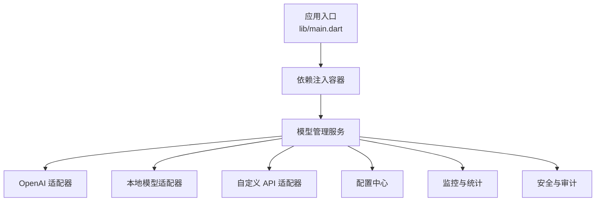
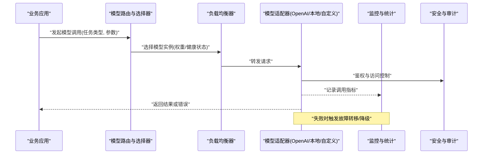
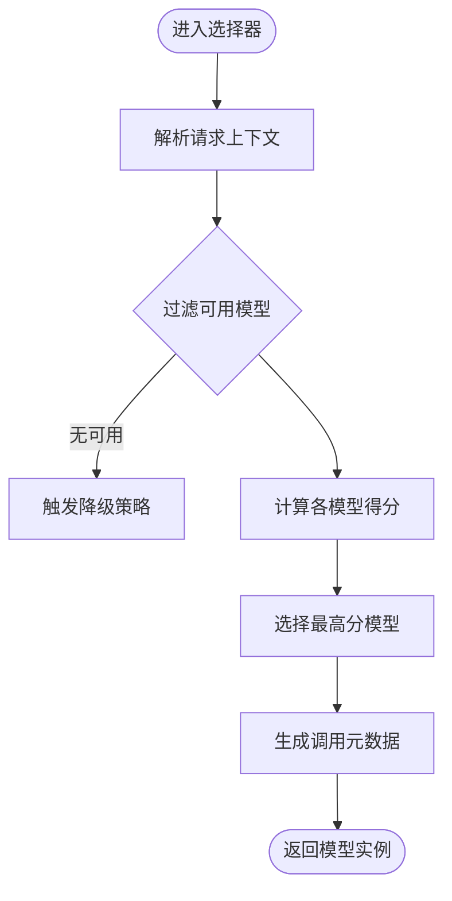
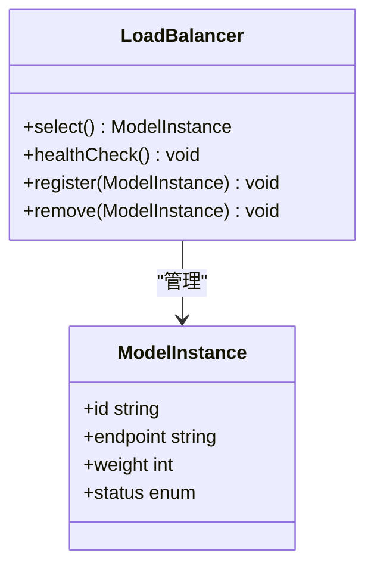
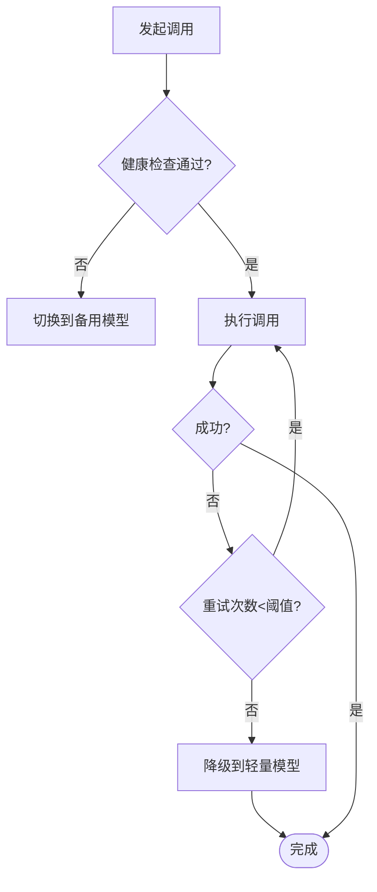
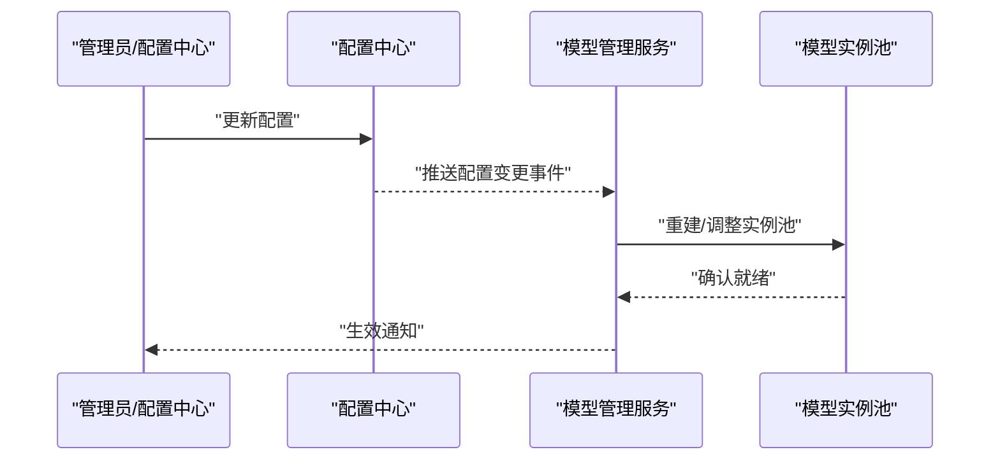
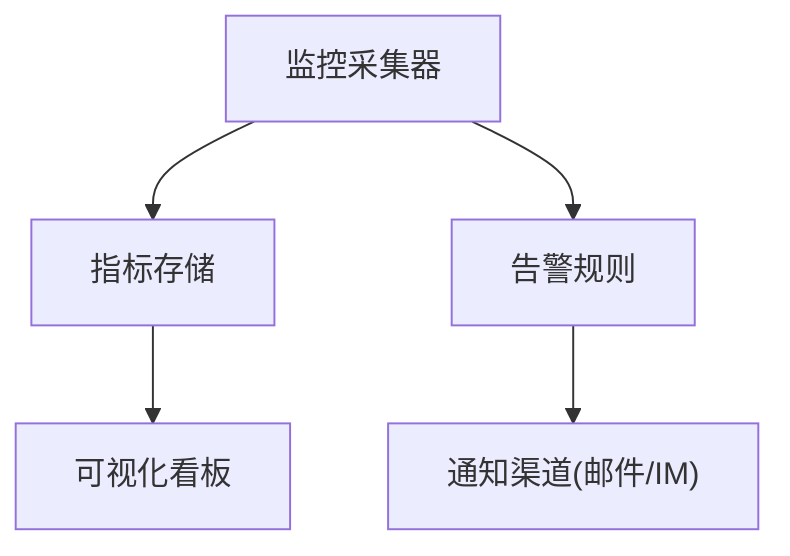
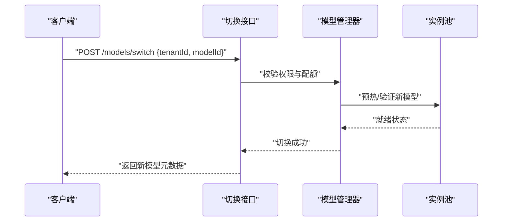
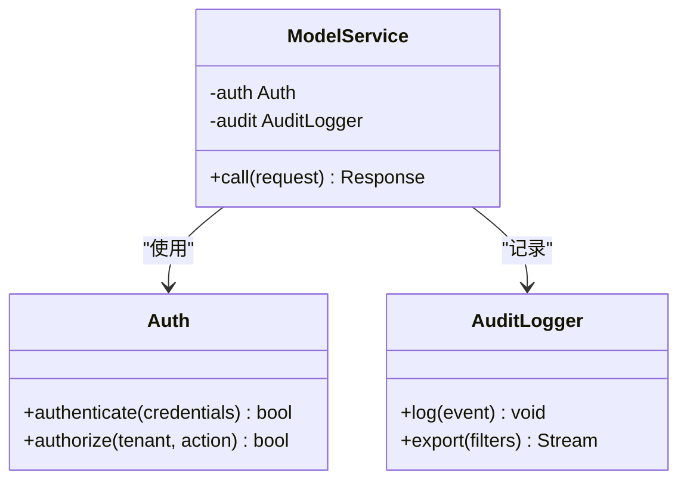
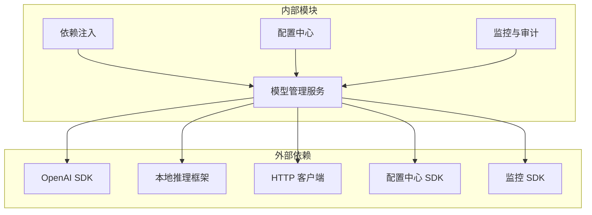

# 模型管理服务

<cite>
**本文档引用的文件**   
- [lib/main.dart](file://lib/main.dart)
- [pubspec.yaml](file://pubspec.yaml)
- [README.md](file://README.md)
</cite>

## 目录
1. [简介](#简介)
2. [项目结构](#项目结构)
3. [核心组件](#核心组件)
4. [架构总览](#架构总览)
5. [详细组件分析](#详细组件分析)
6. [依赖分析](#依赖分析)
7. [性能考虑](#性能考虑)
8. [故障排查指南](#故障排查指南)
9. [结论](#结论)
10. [附录](#附录)

## 简介
本文件面向“模型管理服务”的综合文档，目标是在当前 Flutter 工程背景下，给出多模型支持（OpenAI、本地模型、自定义API）的架构设计、选择策略、负载均衡与故障转移、配置管理与动态加载/热更新、性能监控与成本分析、切换接口与降级回滚、以及安全认证与审计日志等关键能力的说明。由于仓库中未包含具体的模型服务实现代码，本文以概念性设计与最佳实践为主，确保读者在不具备深厚技术背景的情况下也能理解并落地实施。

## 项目结构
该仓库是一个 Flutter 应用工程，包含 Android、iOS、macOS、Windows、Linux、Web 等多端构建产物与资源，业务逻辑集中在 lib 目录。根目录包含 README、依赖声明与构建脚本等。对于模型管理服务，建议将相关能力抽象为独立的服务模块，置于 lib/service 或 lib/domain 层，并通过依赖注入在应用启动时装配。

图表来源 
- [lib/main.dart:1-100](file://lib/main.dart#L1-L100)

章节来源
- [lib/main.dart:1-100](file://lib/main.dart#L1-L100)
- [pubspec.yaml:1-200](file://pubspec.yaml#L1-L200)
- [README.md:1-200](file://README.md#L1-L200)

## 核心组件
- 模型路由与选择器：根据任务类型、质量要求、延迟预算、成本上限等维度选择具体模型实例。
- 负载均衡器：对同类型多个模型实例进行轮询、加权或基于健康状态的调度。
- 故障转移与降级：当主模型不可用或超时，自动切换到备用模型或降级到更轻量模型。
- 配置管理：集中管理模型密钥、端点、速率限制、重试策略、权重等；支持热更新。
- 监控与统计：采集调用次数、延迟、错误率、Token 用量、成本估算等指标。
- 安全与审计：鉴权、访问控制、敏感信息加密存储、操作审计日志。

章节来源
- [lib/main.dart:1-100](file://lib/main.dart#L1-L100)
- [pubspec.yaml:1-200](file://pubspec.yaml#L1-L200)

## 架构总览
下图展示模型管理服务的整体架构与数据流。上层业务通过统一接口发起请求，由路由与选择器决定具体模型实例，再由适配器执行调用；监控与安全贯穿全链路。

图表来源 
- [lib/main.dart:1-100](file://lib/main.dart#L1-L100)

## 详细组件分析

### 模型路由与选择器
- 职责：解析请求上下文，结合策略（如按任务类别、质量阈值、成本上限、延迟预算）选择最优模型。
- 策略示例：
  - 规则引擎：基于标签与条件匹配（如“翻译→OpenAI-gpt-4o-mini”，“长文本→本地大模型”）。
  - 评分排序：综合延迟、成功率、成本、配额剩余进行打分。
  - 灰度发布：按比例分流到新模型版本。
- 输出：选定模型实例标识及调用元数据。

章节来源
- [lib/main.dart:1-100](file://lib/main.dart#L1-L100)

### 负载均衡器
- 模式：轮询、加权轮询、最少连接、健康检查优先。
- 健康检查：定期探测模型可用性（HTTP 200、延迟阈值、错误率），标记不健康实例。
- 熔断与限流：对高错误率或超时的模型快速熔断，避免雪崩；按租户或全局限流。

章节来源
- [lib/main.dart:1-100](file://lib/main.dart#L1-L100)

### 故障转移与降级
- 触发条件：超时、网络异常、服务端错误、配额耗尽、健康检查失败。
- 转移策略：同类型备用模型、跨提供商切换、降级到更小/更快模型。
- 回滚机制：若新模型上线后指标恶化，自动回滚至上一稳定版本。

章节来源
- [lib/main.dart:1-100](file://lib/main.dart#L1-L100)

### 配置管理与动态加载/热更新
- 配置项：模型端点、密钥、速率限制、重试策略、权重、灰度比例、熔断阈值等。
- 存储位置：环境变量、配置文件、远程配置中心（如 Firebase Remote Config、自建配置服务）。
- 热更新：监听配置变更事件，动态刷新模型实例池，无需重启应用。

章节来源
- [lib/main.dart:1-100](file://lib/main.dart#L1-L100)

### 监控、使用统计与成本分析
- 指标采集：QPS、延迟分布、错误率、Token 用量、费用估算、配额使用率。
- 存储与可视化：本地缓存+远端聚合（如 Prometheus/Grafana、自建看板）。
- 成本分析：按模型、租户、任务类型汇总成本，设置预算告警。

章节来源
- [lib/main.dart:1-100](file://lib/main.dart#L1-L100)

### 模型切换接口、降级策略与回滚机制
- 切换接口：提供 REST/gRPC 或内部 API，允许按租户、会话、任务类型切换模型。
- 降级策略：优先级队列，先尝试高质量模型，失败则降级到低成本模型。
- 回滚机制：基于指标阈值（错误率、延迟、成本）自动回滚到上一版本。

章节来源
- [lib/main.dart:1-100](file://lib/main.dart#L1-L100)

### 安全认证、访问控制与审计日志
- 认证：API Key、OAuth2、JWT；支持多租户隔离。
- 授权：基于角色的访问控制（RBAC），细粒度到模型与操作。
- 审计：记录调用者、时间、模型、输入摘要、结果摘要、耗时、错误码。

章节来源
- [lib/main.dart:1-100](file://lib/main.dart#L1-L100)

## 依赖分析
- 外部依赖：OpenAI SDK、本地推理框架（如 llama.cpp、ONNX Runtime）、HTTP 客户端、配置中心 SDK、监控 SDK。
- 内部依赖：依赖注入容器、配置中心、监控与审计模块。
- 耦合与内聚：模型适配器应低耦合，通过统一接口暴露；选择器与负载均衡器保持高内聚。

图表来源 
- [pubspec.yaml:1-200](file://pubspec.yaml#L1-L200)

章节来源
- [pubspec.yaml:1-200](file://pubspec.yaml#L1-L200)

## 性能考虑
- 连接池与复用：HTTP 连接池、模型实例池化，减少握手与初始化开销。
- 异步与非阻塞：I/O 密集型调用采用异步处理，避免阻塞主线程。
- 缓存与批处理：对相似请求做响应缓存；批量提交降低开销。
- 自适应调优：根据负载动态调整并发度、超时与重试策略。

[本节为通用指导，不直接分析具体文件]

## 故障排查指南
- 常见问题：
  - 模型不可用：检查健康检查、网络连通、密钥有效性、配额与限流。
  - 高延迟：查看下游延迟分布、是否触发重试、是否存在热点键。
  - 成本高：分析 Token 用量、是否命中缓存、是否有不必要的重试。
- 诊断工具：
  - 启用详细日志与追踪 ID，关联上下游调用链。
  - 使用监控看板观察错误率、延迟、成本趋势。
  - 模拟流量压测，定位瓶颈。

章节来源
- [lib/main.dart:1-100](file://lib/main.dart#L1-L100)

## 结论
在多模型支持的架构下，通过统一的路由与选择器、健壮的负载均衡与故障转移、灵活的配置管理与热更新、完善的监控与成本分析、以及严格的安全与审计机制，可以在保证服务质量的同时有效控制成本与风险。建议在现有 Flutter 工程中逐步引入上述能力，并以模块化方式组织代码，便于扩展与维护。

[本节为总结性内容，不直接分析具体文件]

## 附录
- 术语表：
  - 模型实例：一个具体的模型提供方与版本的组合。
  - 适配器：封装不同模型接口的统一实现。
  - 健康检查：周期性探测模型可用性的机制。
  - 熔断：在高错误率时快速失败以避免雪崩。
- 参考实践：
  - 使用配置中心统一管理模型配置与开关。
  - 通过灰度发布逐步放量新模型。
  - 建立成本预算与告警机制。

[本节为补充信息，不直接分析具体文件]