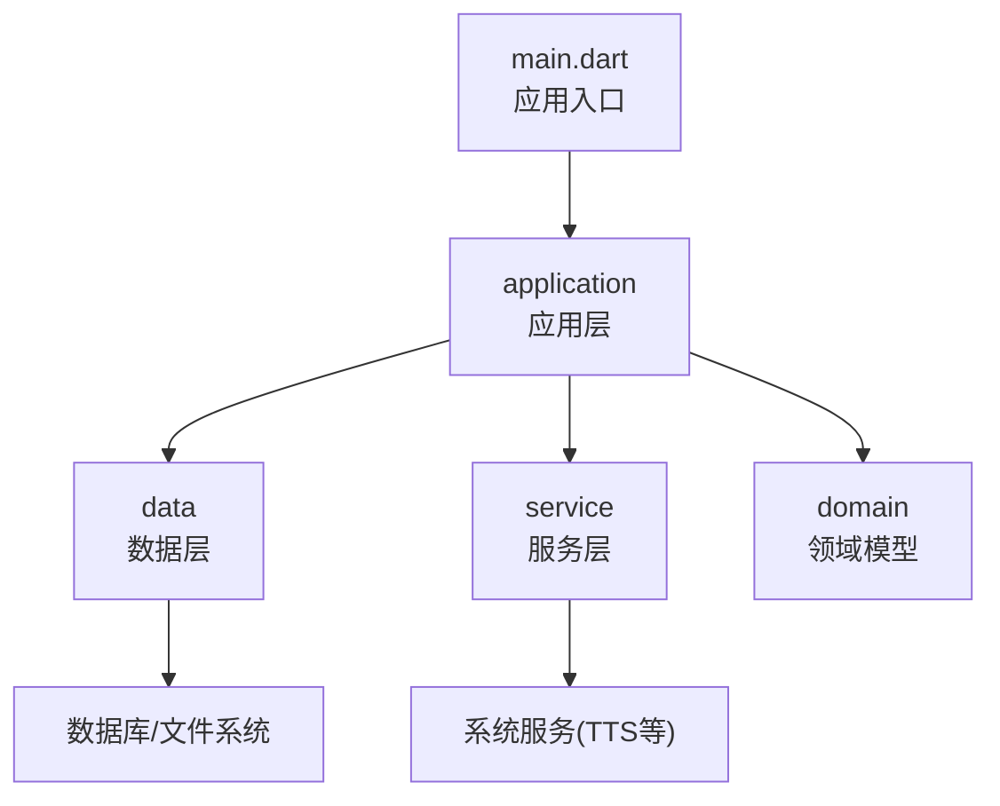
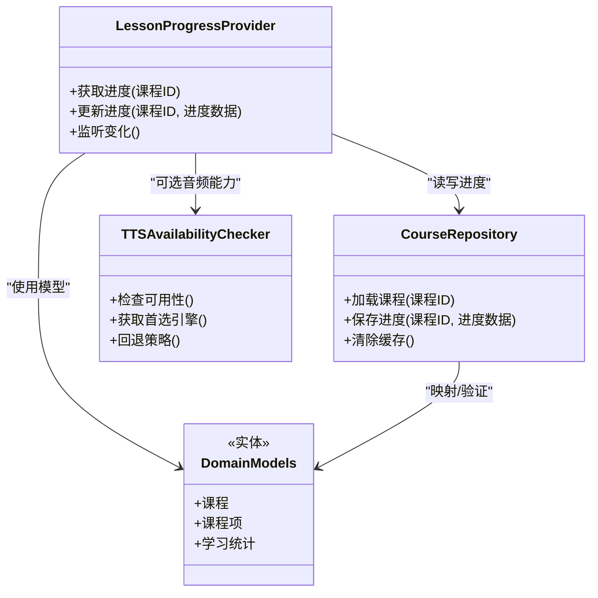
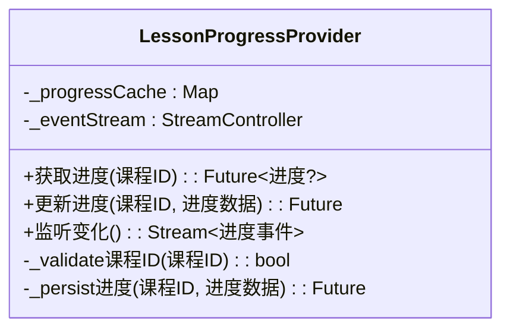
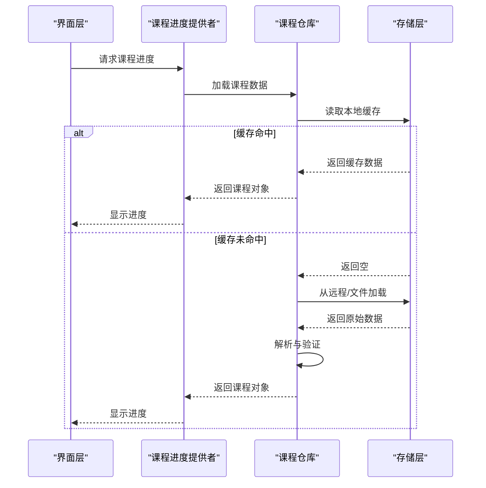
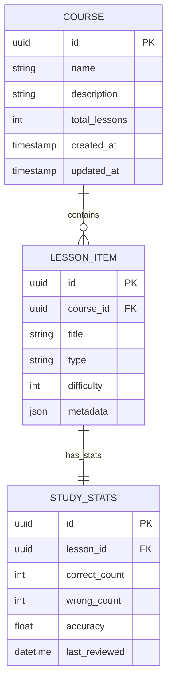
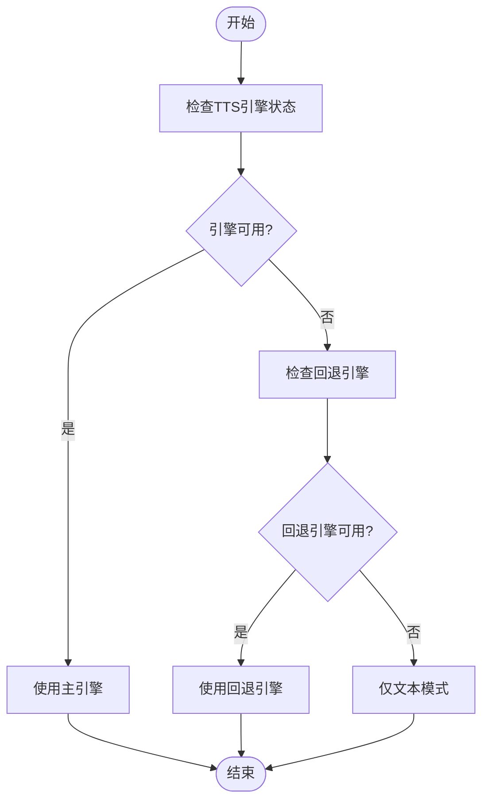
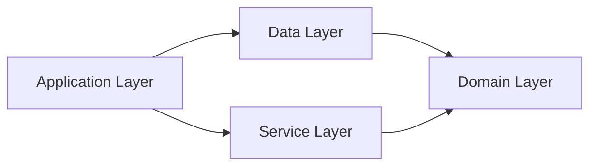

# API参考文档

<cite>
**本文档引用的文件**   
- [lib/main.dart](file://lib/main.dart)
- [pubspec.yaml](file://pubspec.yaml)
- [lib/application/lesson_progress_provider.dart](file://lib/application/lesson_progress_provider.dart)
- [lib/data/course_repository.dart](file://lib/data/course_repository.dart)
- [lib/domain/course/models.dart](file://lib/domain/course/models.dart)
- [lib/service/tts_availability_checker.dart](file://lib/service/tts_availability_checker.dart)
- [test/application/lesson_progress_provider_test.dart](file://test/application/lesson_progress_provider_test.dart)
- [test/data/course_repository_test.dart](file://test/data/course_repository_test.dart)
- [test/service/tts_availability_checker_test.dart](file://test/service/tts_availability_checker_test.dart)
</cite>

## 目录
1. [简介](#简介)
2. [项目结构](#项目结构)
3. [核心组件](#核心组件)
4. [架构总览](#架构总览)
5. [详细组件分析](#详细组件分析)
6. [依赖关系分析](#依赖关系分析)
7. [性能考虑](#性能考虑)
8. [故障排查指南](#故障排查指南)
9. [结论](#结论)
10. [附录：接口版本与迁移指南](#附录接口版本与迁移指南)

## 简介
本API参考文档面向 Varnamalaplus 项目的开发者与集成方，系统化梳理应用层、数据访问层与领域模型之间的公共接口与业务逻辑。文档覆盖服务接口、数据访问接口与业务逻辑接口的完整规范，包括参数、返回值、异常处理、使用示例、接口版本管理、向后兼容性与迁移指南，并给出接口测试方法、调试工具与性能监控指标建议。

## 项目结构
Varnamalaplus 采用 Flutter/Dart 构建，遵循分层架构：
- application（应用层）：编排业务流程、状态管理与交互逻辑
- data（数据层）：封装持久化与外部数据源访问
- domain（领域层）：定义核心数据模型与领域规则
- service（服务层）：提供可复用的系统能力（如TTS可用性检查）
- views/routing（视图与路由）：用户界面与导航
- main.dart：应用入口与初始化

图表来源 
- [lib/main.dart:1-200](file://lib/main.dart#L1-L200)
- [pubspec.yaml:1-200](file://pubspec.yaml#L1-L200)

章节来源
- [lib/main.dart:1-200](file://lib/main.dart#L1-L200)
- [pubspec.yaml:1-200](file://pubspec.yaml#L1-L200)

## 核心组件
本节概述关键组件的职责与对外暴露的接口边界：
- 课程进度提供者（LessonProgressProvider）：负责课程学习进度的读取、更新与状态同步
- 课程仓库（CourseRepository）：统一课程数据的加载、缓存与持久化
- 领域模型（Domain Models）：课程、课程项、学习统计等数据结构定义
- TTS可用性检查器（TTSAvailabilityChecker）：检测系统TTS引擎可用性与回退策略

章节来源
- [lib/application/lesson_progress_provider.dart:1-300](file://lib/application/lesson_progress_provider.dart#L1-L300)
- [lib/data/course_repository.dart:1-300](file://lib/data/course_repository.dart#L1-L300)
- [lib/domain/course/models.dart:1-300](file://lib/domain/course/models.dart#L1-L300)
- [lib/service/tts_availability_checker.dart:1-200](file://lib/service/tts_availability_checker.dart#L1-L200)

## 架构总览
应用采用清晰的职责分离与依赖倒置原则：
- 应用层通过仓储与服务抽象调用数据与系统能力
- 数据层屏蔽底层存储细节，向上提供一致的数据访问接口
- 领域模型作为契约，确保跨层数据一致性
- 服务层解耦平台相关能力（如TTS），便于替换与扩展

图表来源 
- [lib/application/lesson_progress_provider.dart:1-300](file://lib/application/lesson_progress_provider.dart#L1-L300)
- [lib/data/course_repository.dart:1-300](file://lib/data/course_repository.dart#L1-L300)
- [lib/domain/course/models.dart:1-300](file://lib/domain/course/models.dart#L1-L300)
- [lib/service/tts_availability_checker.dart:1-200](file://lib/service/tts_availability_checker.dart#L1-L200)

## 详细组件分析

### 课程进度提供者（LessonProgressProvider）
职责：
- 提供课程学习进度的查询与更新
- 维护进度状态变更通知
- 与课程仓库协作完成持久化

主要接口：
- 获取进度：输入课程标识，返回进度对象或空值
- 更新进度：输入课程标识与进度数据，返回操作结果
- 监听变化：订阅进度变更事件

异常处理：
- 无效课程标识：抛出参数校验异常
- 持久化失败：返回错误结果并记录日志
- 并发写入：使用锁或队列保证一致性

使用示例：
- 在页面初始化时加载进度
- 在学习完成后提交进度更新
- 监听进度变化以刷新UI

章节来源
- [lib/application/lesson_progress_provider.dart:1-300](file://lib/application/lesson_progress_provider.dart#L1-L300)
- [test/application/lesson_progress_provider_test.dart:1-200](file://test/application/lesson_progress_provider_test.dart#L1-L200)

#### 类图

图表来源 
- [lib/application/lesson_progress_provider.dart:1-300](file://lib/application/lesson_progress_provider.dart#L1-L300)

### 课程仓库（CourseRepository）
职责：
- 统一课程数据的加载、缓存与持久化
- 提供课程元数据与内容的访问接口
- 管理数据版本与迁移

主要接口：
- 加载课程：输入课程标识，返回课程对象或错误
- 保存进度：输入课程标识与进度数据，返回操作结果
- 清除缓存：清理本地缓存数据

异常处理：
- 数据损坏：返回解析错误并尝试恢复
- 网络失败：重试机制与降级策略
- 权限不足：提示用户授权

使用示例：
- 启动时预加载热门课程
- 学习过程中增量更新进度
- 定期清理过期缓存

章节来源
- [lib/data/course_repository.dart:1-300](file://lib/data/course_repository.dart#L1-L300)
- [test/data/course_repository_test.dart:1-200](file://test/data/course_repository_test.dart#L1-L200)

#### 序列图：课程加载流程

图表来源 
- [lib/data/course_repository.dart:1-300](file://lib/data/course_repository.dart#L1-L300)
- [lib/application/lesson_progress_provider.dart:1-300](file://lib/application/lesson_progress_provider.dart#L1-L300)

### 领域模型（Domain Models）
核心数据模型：
- 课程（Course）：包含课程元数据、章节结构与学习统计
- 课程项（LessonItem）：单个学习单元的定义与状态
- 学习统计（StudyStats）：正确率、复习间隔等指标

设计原则：
- 不可变性：模型对象创建后不可修改
- 序列化友好：支持JSON编解码
- 验证约束：内置字段验证规则

章节来源
- [lib/domain/course/models.dart:1-300](file://lib/domain/course/models.dart#L1-L300)

#### 数据模型图

图表来源 
- [lib/domain/course/models.dart:1-300](file://lib/domain/course/models.dart#L1-L300)

### TTS可用性检查器（TTSAvailabilityChecker）
职责：
- 检测系统TTS引擎的可用性
- 提供首选引擎选择策略
- 实现回退机制确保语音功能稳定

主要接口：
- 检查可用性：返回TTS引擎可用状态
- 获取首选引擎：根据系统配置选择最佳引擎
- 回退策略：当主引擎不可用时切换到备用方案

异常处理：
- 引擎初始化失败：记录错误并启用回退
- 权限缺失：提示用户授予必要权限
- 资源不足：降级为文本输出

使用示例：
- 应用启动时预检查TTS可用性
- 播放语音前动态检测引擎状态
- 失败时自动切换至文本模式

章节来源
- [lib/service/tts_availability_checker.dart:1-200](file://lib/service/tts_availability_checker.dart#L1-L200)
- [test/service/tts_availability_checker_test.dart:1-200](file://test/service/tts_availability_checker_test.dart#L1-L200)

#### 流程图：TTS检查逻辑

图表来源 
- [lib/service/tts_availability_checker.dart:1-200](file://lib/service/tts_availability_checker.dart#L1-L200)

## 依赖关系分析
组件间依赖关系清晰，遵循单向依赖原则：
- application 层依赖 data 和 service 层
- data 层依赖 domain 层
- service 层独立，不依赖其他层
- domain 层无外部依赖

图表来源 
- [lib/main.dart:1-200](file://lib/main.dart#L1-L200)
- [pubspec.yaml:1-200](file://pubspec.yaml#L1-L200)

章节来源
- [lib/main.dart:1-200](file://lib/main.dart#L1-L200)
- [pubspec.yaml:1-200](file://pubspec.yaml#L1-L200)

## 性能考虑
- 缓存策略：课程数据采用LRU缓存，减少重复加载
- 异步处理：所有IO操作使用异步编程，避免阻塞UI
- 内存管理：及时释放不再使用的资源，防止内存泄漏
- 批量操作：合并频繁的进度更新，减少I/O次数
- 懒加载：按需加载课程详情，优化启动速度

## 故障排查指南
常见问题与解决方案：
- 课程加载失败：检查网络连接与数据完整性
- 进度保存失败：验证存储空间与权限设置
- TTS功能异常：确认系统语音包安装状态
- 内存溢出：监控内存使用，优化大数据处理

调试工具：
- 使用Flutter DevTools进行性能分析
- 启用详细日志记录定位问题
- 单元测试覆盖核心逻辑
- 集成测试验证端到端流程

章节来源
- [test/application/lesson_progress_provider_test.dart:1-200](file://test/application/lesson_progress_provider_test.dart#L1-L200)
- [test/data/course_repository_test.dart:1-200](file://test/data/course_repository_test.dart#L1-L200)
- [test/service/tts_availability_checker_test.dart:1-200](file://test/service/tts_availability_checker_test.dart#L1-L200)

## 结论
Varnamalaplus 项目采用清晰的分层架构与良好的设计模式，提供了稳定可靠的API接口。通过完善的错误处理、性能优化与测试覆盖，确保了系统的健壮性与可维护性。建议后续继续完善API文档自动化生成与接口版本管理机制。

## 附录：接口版本与迁移指南
接口版本管理：
- 使用语义化版本号管理API变更
- 保持向后兼容性至少两个大版本
- 废弃接口提供迁移路径与时间线

向后兼容性策略：
- 新增字段默认值为空或安全默认值
- 移除字段保留占位符并记录日志
- 变更数据类型时提供转换函数

迁移指南：
- 提供详细的迁移脚本与示例代码
- 分阶段实施，支持灰度发布
- 建立回滚机制应对迁移失败

接口测试方法：
- 单元测试：验证单个函数逻辑正确性
- 集成测试：测试组件间交互
- 端到端测试：模拟真实用户场景
- 性能测试：评估接口响应时间与资源消耗

调试工具推荐：
- Flutter DevTools：性能分析与调试
- 日志框架：结构化日志记录
- 监控平台：实时性能指标收集
- 错误追踪：异常捕获与分析