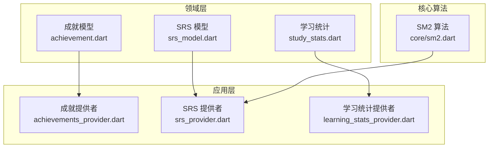
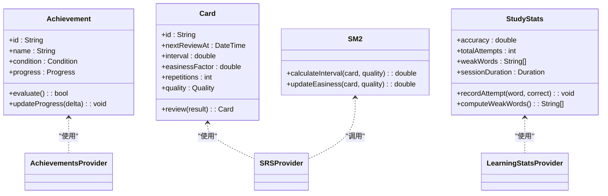
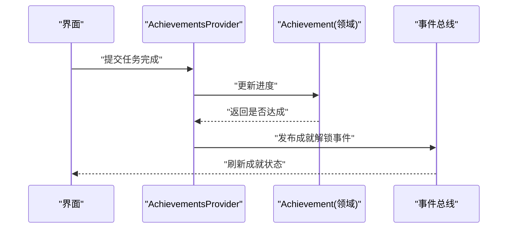
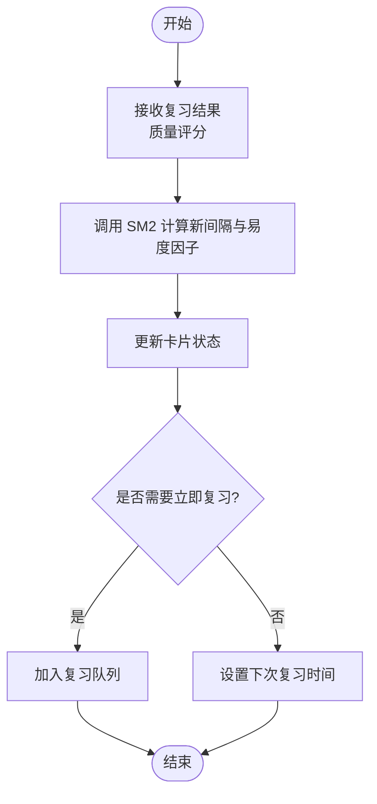
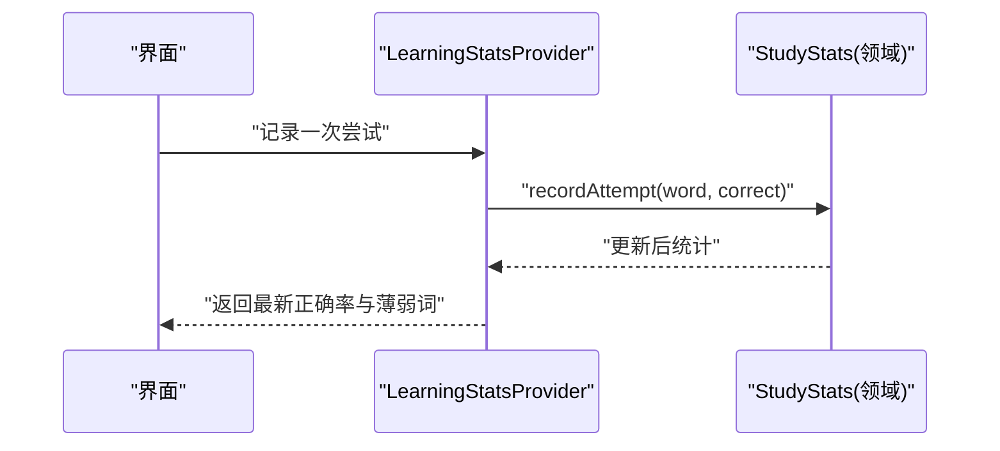
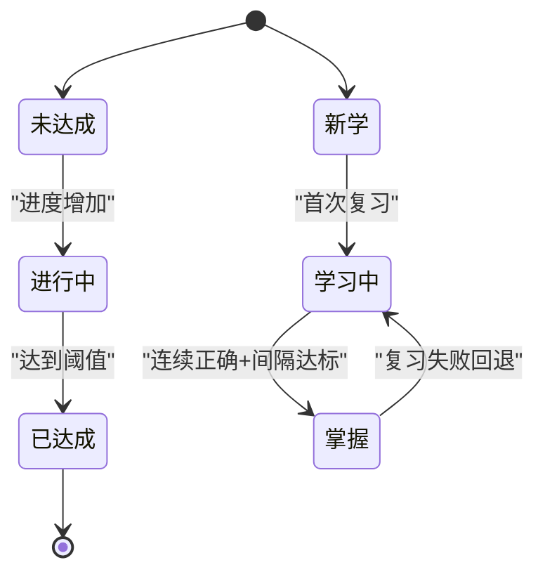
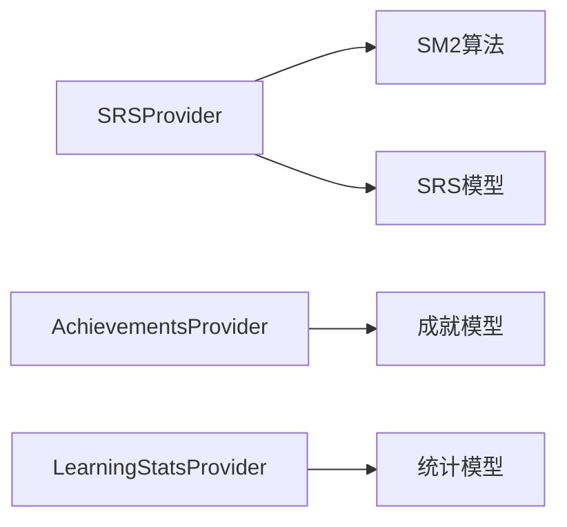

# 业务逻辑API

<cite>
**本文引用的文件**   
- [lib/domain/achievement.dart](file://lib/domain/achievement.dart)
- [lib/domain/srs_model.dart](file://lib/domain/srs_model.dart)
- [lib/domain/study_stats.dart](file://lib/domain/study_stats.dart)
- [lib/core/sm2.dart](file://lib/core/sm2.dart)
- [lib/application/achievements_provider.dart](file://lib/application/achievements_provider.dart)
- [lib/application/srs_provider.dart](file://lib/application/srs_provider.dart)
- [lib/application/learning_stats_provider.dart](file://lib/application/learning_stats_provider.dart)
- [test/core/sm2_test.dart](file://test/core/sm2_test.dart)
- [test/application/achievements_provider_test.dart](file://test/application/achievements_provider_test.dart)
- [test/application/srs_provider_test.dart](file://test/application/srs_provider_test.dart)
- [test/application/learning_stats_accuracy_test.dart](file://test/application/learning_stats_accuracy_test.dart)
</cite>

## 目录
1. [简介](#简介)
2. [项目结构](#项目结构)
3. [核心组件](#核心组件)
4. [架构总览](#架构总览)
5. [详细组件分析](#详细组件分析)
6. [依赖分析](#依赖分析)
7. [性能考虑](#性能考虑)
8. [故障排查指南](#故障排查指南)
9. [结论](#结论)
10. [附录](#附录)

## 简介
本文件为 Varnamalaplus 项目的领域层 API 文档，聚焦以下目标：
- 记录学习算法、间隔重复系统（SRS）、成就系统与统计计算的核心逻辑与接口
- 说明领域实体、值对象与业务规则
- 描述业务状态机、事件驱动架构与领域事件处理
- 给出业务规则验证、错误码定义与异常处理规范
- 提供领域模型演进策略与版本兼容性建议

## 项目结构
领域层位于 lib/domain，核心能力由以下模块构成：
- 成就系统：成就配置、达成判定与进度追踪
- SRS 间隔重复：基于 SM2 的复习调度与记忆强度建模
- 学习统计：正确率、薄弱词、学习时长等指标的计算与缓存

图表来源
- [lib/domain/achievement.dart](file://lib/domain/achievement.dart)
- [lib/domain/srs_model.dart](file://lib/domain/srs_model.dart)
- [lib/domain/study_stats.dart](file://lib/domain/study_stats.dart)
- [lib/core/sm2.dart](file://lib/core/sm2.dart)
- [lib/application/achievements_provider.dart](file://lib/application/achievements_provider.dart)
- [lib/application/srs_provider.dart](file://lib/application/srs_provider.dart)
- [lib/application/learning_stats_provider.dart](file://lib/application/learning_stats_provider.dart)

章节来源
- [lib/domain/achievement.dart](file://lib/domain/achievement.dart)
- [lib/domain/srs_model.dart](file://lib/domain/srs_model.dart)
- [lib/domain/study_stats.dart](file://lib/domain/study_stats.dart)
- [lib/core/sm2.dart](file://lib/core/sm2.dart)
- [lib/application/achievements_provider.dart](file://lib/application/achievements_provider.dart)
- [lib/application/srs_provider.dart](file://lib/application/srs_provider.dart)
- [lib/application/learning_stats_provider.dart](file://lib/application/learning_stats_provider.dart)

## 核心组件
本节概述领域层关键实体与值对象，以及它们与应用层的交互方式。

- 成就系统
  - 实体：成就项、达成条件、进度计数
  - 行为：条件评估、进度更新、解锁判定
  - 应用集成：通过 AchievementsProvider 暴露查询与更新接口

- SRS 间隔重复
  - 实体：卡片、复习间隔、记忆强度、下次复习时间
  - 行为：根据用户表现调整间隔与难度
  - 算法：SM2 算法实现于 core/sm2.dart
  - 应用集成：通过 SRSProvider 暴露复习队列生成与结果提交

- 学习统计
  - 实体：正确率、练习次数、薄弱词列表、学习时长
  - 行为：增量更新、窗口聚合、缓存失效
  - 应用集成：LearningStatsProvider 负责计算与缓存管理

章节来源
- [lib/domain/achievement.dart](file://lib/domain/achievement.dart)
- [lib/domain/srs_model.dart](file://lib/domain/srs_model.dart)
- [lib/domain/study_stats.dart](file://lib/domain/study_stats.dart)
- [lib/application/achievements_provider.dart](file://lib/application/achievements_provider.dart)
- [lib/application/srs_provider.dart](file://lib/application/srs_provider.dart)
- [lib/application/learning_stats_provider.dart](file://lib/application/learning_stats_provider.dart)

## 架构总览
领域层采用“实体 + 值对象 + 服务”的分层设计，应用层通过 Provider 协调领域对象与持久化、UI 状态。

图表来源
- [lib/domain/achievement.dart](file://lib/domain/achievement.dart)
- [lib/domain/srs_model.dart](file://lib/domain/srs_model.dart)
- [lib/domain/study_stats.dart](file://lib/domain/study_stats.dart)
- [lib/core/sm2.dart](file://lib/core/sm2.dart)
- [lib/application/achievements_provider.dart](file://lib/application/achievements_provider.dart)
- [lib/application/srs_provider.dart](file://lib/application/srs_provider.dart)
- [lib/application/learning_stats_provider.dart](file://lib/application/learning_stats_provider.dart)

## 详细组件分析

### 成就系统 API
- 主要职责
  - 维护成就配置与用户进度
  - 评估达成条件并触发解锁事件
  - 提供查询接口供 UI 展示

- 关键接口
  - 查询成就列表与状态
  - 提交进度更新（如完成某类任务）
  - 批量刷新成就状态

- 业务规则
  - 条件不可逆：一旦达成即保持已达成
  - 进度累计不溢出：上限保护
  - 并发安全：多源更新需合并

- 事件驱动
  - 成就解锁事件：通知 UI 与统计系统
  - 进度变更事件：用于审计与回放

图表来源
- [lib/application/achievements_provider.dart](file://lib/application/achievements_provider.dart)
- [lib/domain/achievement.dart](file://lib/domain/achievement.dart)

章节来源
- [lib/domain/achievement.dart](file://lib/domain/achievement.dart)
- [lib/application/achievements_provider.dart](file://lib/application/achievements_provider.dart)
- [test/application/achievements_provider_test.dart](file://test/application/achievements_provider_test.dart)

### SRS 间隔重复系统 API
- 主要职责
  - 维护卡片状态与复习计划
  - 基于用户回答质量调整间隔与易度因子
  - 生成复习队列与回顾结果

- 关键接口
  - 获取下一次复习卡片
  - 提交复习结果（正确/模糊/错误）
  - 批量导入/导出复习数据

- 算法核心（SM2）
  - 输入：卡片当前状态与用户质量评分
  - 输出：新的间隔、易度因子与下次复习时间
  - 边界：最小/最大间隔限制、易度因子下限

图表来源
- [lib/core/sm2.dart](file://lib/core/sm2.dart)
- [lib/domain/srs_model.dart](file://lib/domain/srs_model.dart)
- [lib/application/srs_provider.dart](file://lib/application/srs_provider.dart)

章节来源
- [lib/domain/srs_model.dart](file://lib/domain/srs_model.dart)
- [lib/core/sm2.dart](file://lib/core/sm2.dart)
- [lib/application/srs_provider.dart](file://lib/application/srs_provider.dart)
- [test/core/sm2_test.dart](file://test/core/sm2_test.dart)
- [test/application/srs_provider_test.dart](file://test/application/srs_provider_test.dart)

### 学习统计 API
- 主要职责
  - 记录练习尝试与正确性
  - 计算正确率、薄弱词、会话时长
  - 提供统计快照与趋势

- 关键接口
  - 记录一次尝试（词、是否正确、耗时）
  - 计算当前正确率与薄弱词列表
  - 导出统计快照

- 计算逻辑
  - 正确率：成功次数 / 总尝试次数
  - 薄弱词：低于阈值且出现频率较高的词
  - 窗口聚合：按日/周/月维度汇总

图表来源
- [lib/domain/study_stats.dart](file://lib/domain/study_stats.dart)
- [lib/application/learning_stats_provider.dart](file://lib/application/learning_stats_provider.dart)

章节来源
- [lib/domain/study_stats.dart](file://lib/domain/study_stats.dart)
- [lib/application/learning_stats_provider.dart](file://lib/application/learning_stats_provider.dart)
- [test/application/learning_stats_accuracy_test.dart](file://test/application/learning_stats_accuracy_test.dart)

### 业务状态机
- 成就状态
  - 未达成 -> 进行中 -> 已达成
  - 转换条件：进度达到阈值或满足特定条件

- 卡片状态
  - 新学 -> 学习中 -> 掌握
  - 转换条件：连续正确次数与间隔增长

[此图为概念性状态机，不直接映射具体源码文件]

## 依赖分析
- 领域层内部依赖
  - SRS 提供者依赖 SM2 算法
  - 成就提供者依赖成就模型
  - 学习统计提供者依赖统计模型

- 外部依赖
  - 持久化层（数据库/文件）
  - 事件总线（用于解耦）
  - 配置与国际化资源

图表来源
- [lib/application/srs_provider.dart](file://lib/application/srs_provider.dart)
- [lib/core/sm2.dart](file://lib/core/sm2.dart)
- [lib/domain/srs_model.dart](file://lib/domain/srs_model.dart)
- [lib/application/achievements_provider.dart](file://lib/application/achievements_provider.dart)
- [lib/domain/achievement.dart](file://lib/domain/achievement.dart)
- [lib/application/learning_stats_provider.dart](file://lib/application/learning_stats_provider.dart)
- [lib/domain/study_stats.dart](file://lib/domain/study_stats.dart)

章节来源
- [lib/application/srs_provider.dart](file://lib/application/srs_provider.dart)
- [lib/core/sm2.dart](file://lib/core/sm2.dart)
- [lib/domain/srs_model.dart](file://lib/domain/srs_model.dart)
- [lib/application/achievements_provider.dart](file://lib/application/achievements_provider.dart)
- [lib/domain/achievement.dart](file://lib/domain/achievement.dart)
- [lib/application/learning_stats_provider.dart](file://lib/application/learning_stats_provider.dart)
- [lib/domain/study_stats.dart](file://lib/domain/study_stats.dart)

## 性能考虑
- SRS 计算
  - 批量更新时避免重复计算，使用增量更新
  - 合理设置最小/最大间隔，防止极端值

- 成就评估
  - 条件评估缓存，避免频繁重算
  - 事件去抖，减少 UI 刷新频率

- 统计计算
  - 使用滑动窗口聚合，避免全量重算
  - 异步计算与缓存失效策略

[本节为通用指导，不直接引用具体文件]

## 故障排查指南
- 常见问题
  - SRS 间隔异常：检查质量评分范围与 SM2 参数
  - 成就未解锁：确认进度更新路径与阈值
  - 统计不准确：核对尝试记录与窗口聚合逻辑

- 调试建议
  - 启用详细日志，记录关键状态变化
  - 使用单元测试覆盖边界情况
  - 引入断言与不变式检查

章节来源
- [test/core/sm2_test.dart](file://test/core/sm2_test.dart)
- [test/application/achievements_provider_test.dart](file://test/application/achievements_provider_test.dart)
- [test/application/srs_provider_test.dart](file://test/application/srs_provider_test.dart)
- [test/application/learning_stats_accuracy_test.dart](file://test/application/learning_stats_accuracy_test.dart)

## 结论
Varnamalaplus 的领域层以清晰的实体与值对象为核心，结合应用层 Provider 实现了解耦与可扩展的业务逻辑。SRS 基于成熟的 SM2 算法，成就系统与统计计算提供了完整的学习体验闭环。通过事件驱动与状态机设计，系统具备良好的可维护性与演进能力。

## 附录
- 版本兼容性建议
  - 向后兼容：新增字段默认值，废弃字段保留迁移逻辑
  - 领域事件版本化：事件结构变更需带版本号
  - 配置迁移：提供迁移脚本与回滚机制

[本节为通用指导，不直接引用具体文件]