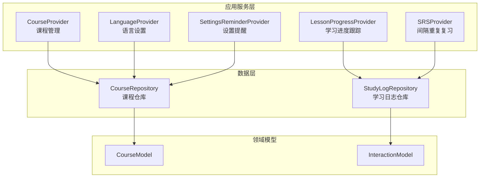
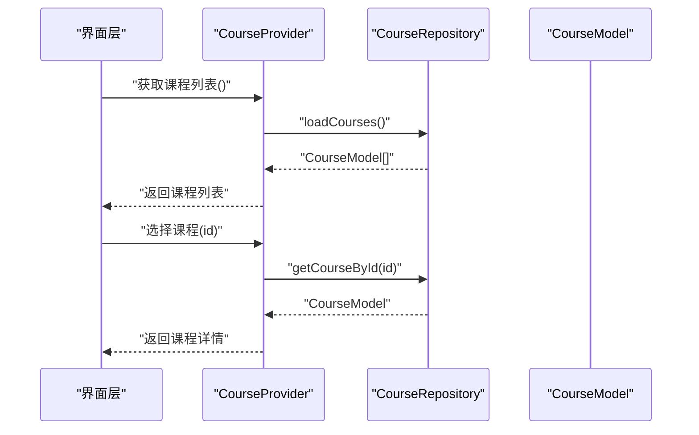
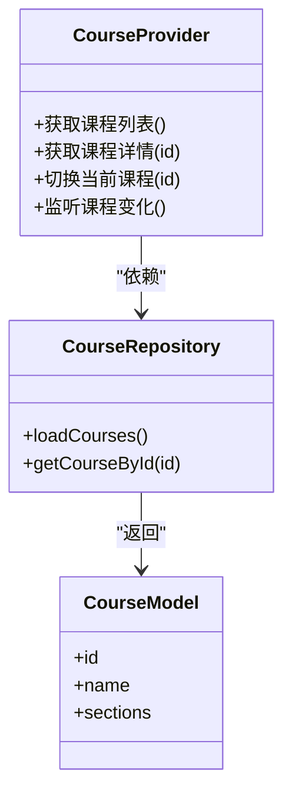
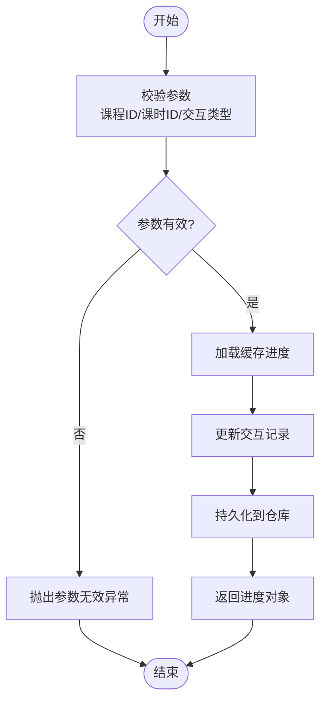
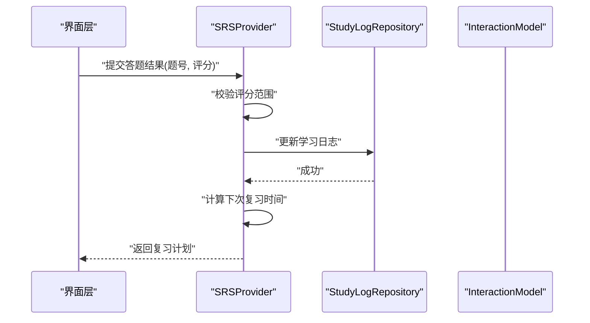
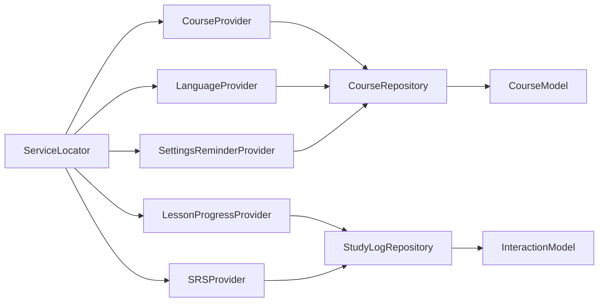

# 应用服务API

<cite>
**本文档引用的文件**   
- [lib/application/course_provider.dart](file://lib/application/course_provider.dart)
- [lib/application/lesson_progress_provider.dart](file://lib/application/lesson_progress_provider.dart)
- [lib/application/srs_provider.dart](file://lib/application/srs_provider.dart)
- [lib/application/language_provider.dart](file://lib/application/language_provider.dart)
- [lib/application/settings_reminder_provider.dart](file://lib/application/settings_reminder_provider.dart)
- [lib/data/course_repository.dart](file://lib/data/course_repository.dart)
- [lib/data/study_log_repository.dart](file://lib/data/study_log_repository.dart)
- [lib/domain/course/course_model.dart](file://lib/domain/course/course_model.dart)
- [lib/domain/interaction/interaction_model.dart](file://lib/domain/interaction/interaction_model.dart)
- [lib/service/locator.dart](file://lib/service/locator.dart)
- [test/application/lesson_progress_provider_test.dart](file://test/application/lesson_progress_provider_test.dart)
- [test/application/srs_provider_test.dart](file://test/application/srs_provider_test.dart)
- [test/application/language_provider_test.dart](file://test/application/language_provider_test.dart)
- [test/application/settings_reminder_test.dart](file://test/application/settings_reminder_test.dart)
</cite>

## 目录
1. [简介](#简介)
2. [项目结构](#项目结构)
3. [核心组件](#核心组件)
4. [架构总览](#架构总览)
5. [详细组件分析](#详细组件分析)
6. [依赖关系分析](#依赖关系分析)
7. [性能考虑](#性能考虑)
8. [故障排查指南](#故障排查指南)
9. [结论](#结论)
10. [附录：接口测试与调试](#附录接口测试与调试)

## 简介
本文件为 Varnamalaplus 应用服务层的 API 文档，聚焦课程管理、学习进度跟踪、用户设置等核心业务。内容涵盖各服务的构造函数、公共方法、参数校验、返回值格式、错误处理机制、异常类型、服务间依赖与调用模式，并提供完整的接口测试用例与调试指南。读者无需深入源码即可理解并正确使用这些服务。

## 项目结构
应用服务层位于 lib/application 目录，采用 Provider 模式组织状态与服务逻辑；数据访问通过 lib/data 中的 Repository 抽象；领域模型定义在 lib/domain；服务定位与依赖注入由 lib/service/locator.dart 提供。测试用例集中在 test/application 与 test/data 等目录。

图表来源
- [lib/application/course_provider.dart](file://lib/application/course_provider.dart)
- [lib/application/lesson_progress_provider.dart](file://lib/application/lesson_progress_provider.dart)
- [lib/application/srs_provider.dart](file://lib/application/srs_provider.dart)
- [lib/application/language_provider.dart](file://lib/application/language_provider.dart)
- [lib/application/settings_reminder_provider.dart](file://lib/application/settings_reminder_provider.dart)
- [lib/data/course_repository.dart](file://lib/data/course_repository.dart)
- [lib/data/study_log_repository.dart](file://lib/data/study_log_repository.dart)
- [lib/domain/course/course_model.dart](file://lib/domain/course/course_model.dart)
- [lib/domain/interaction/interaction_model.dart](file://lib/domain/interaction/interaction_model.dart)

章节来源
- [lib/application/course_provider.dart](file://lib/application/course_provider.dart)
- [lib/application/lesson_progress_provider.dart](file://lib/application/lesson_progress_provider.dart)
- [lib/application/srs_provider.dart](file://lib/application/srs_provider.dart)
- [lib/application/language_provider.dart](file://lib/application/language_provider.dart)
- [lib/application/settings_reminder_provider.dart](file://lib/application/settings_reminder_provider.dart)
- [lib/data/course_repository.dart](file://lib/data/course_repository.dart)
- [lib/data/study_log_repository.dart](file://lib/data/study_log_repository.dart)
- [lib/domain/course/course_model.dart](file://lib/domain/course/course_model.dart)
- [lib/domain/interaction/interaction_model.dart](file://lib/domain/interaction/interaction_model.dart)

## 核心组件
本节概述各应用服务的职责、主要方法与使用要点。

- 课程管理服务（CourseProvider）
  - 职责：加载课程列表、获取课程详情、维护当前课程上下文、触发课程就绪事件。
  - 关键方法：初始化课程、按ID查询课程、切换当前课程、监听课程变化。
  - 参数校验：课程ID非空、存在性检查。
  - 返回格式：课程对象或错误信息。
  - 错误处理：课程不存在、加载失败时抛出明确异常。

- 学习进度跟踪服务（LessonProgressProvider）
  - 职责：记录与查询单课学习进度、更新交互结果、计算完成度。
  - 关键方法：记录交互、查询进度、重置进度、批量更新。
  - 参数校验：交互类型合法、课程与课时ID有效。
  - 返回格式：进度对象或错误信息。
  - 错误处理：非法参数、持久化失败。

- 间隔重复复习服务（SRSProvider）
  - 职责：基于SM2算法安排复习、统计准确率、生成复习队列。
  - 关键方法：提交答题结果、计算下次复习时间、获取待复习项。
  - 参数校验：题目ID、难度评分范围。
  - 返回格式：复习计划或错误信息。
  - 错误处理：参数越界、存储异常。

- 语言设置服务（LanguageProvider）
  - 职责：维护应用语言、切换语言、读取默认语言。
  - 关键方法：设置语言、获取当前语言、验证语言代码。
  - 参数校验：语言代码合法性。
  - 返回格式：语言枚举或错误信息。
  - 错误处理：不支持的语言代码。

- 设置提醒服务（SettingsReminderProvider）
  - 职责：管理学习提醒开关、定时策略、通知权限。
  - 关键方法：开启/关闭提醒、更新策略、检查权限。
  - 参数校验：提醒周期、时间段有效性。
  - 返回格式：设置结果或错误信息。
  - 错误处理：权限不足、配置无效。

章节来源
- [lib/application/course_provider.dart](file://lib/application/course_provider.dart)
- [lib/application/lesson_progress_provider.dart](file://lib/application/lesson_progress_provider.dart)
- [lib/application/srs_provider.dart](file://lib/application/srs_provider.dart)
- [lib/application/language_provider.dart](file://lib/application/language_provider.dart)
- [lib/application/settings_reminder_provider.dart](file://lib/application/settings_reminder_provider.dart)

## 架构总览
应用服务层通过 Provider 暴露状态与方法，依赖数据层 Repository 进行持久化与缓存，领域模型作为数据契约。服务定位器负责统一装配与生命周期管理。

图表来源
- [lib/application/course_provider.dart](file://lib/application/course_provider.dart)
- [lib/data/course_repository.dart](file://lib/data/course_repository.dart)
- [lib/domain/course/course_model.dart](file://lib/domain/course/course_model.dart)

章节来源
- [lib/service/locator.dart](file://lib/service/locator.dart)
- [lib/application/course_provider.dart](file://lib/application/course_provider.dart)
- [lib/data/course_repository.dart](file://lib/data/course_repository.dart)

## 详细组件分析

### 课程管理服务（CourseProvider）
- 构造函数
  - 依赖：CourseRepository、ServiceLocator。
  - 行为：初始化课程缓存、注册监听器。
- 公共方法
  - 获取课程列表：无参，返回课程集合。
  - 获取课程详情：参数为课程ID，返回课程对象。
  - 切换当前课程：参数为新课程ID，更新上下文。
  - 监听课程变化：订阅变更事件。
- 参数校验
  - 课程ID必须非空且存在。
- 返回值格式
  - 成功：课程对象或列表。
  - 失败：错误码与消息。
- 错误处理
  - 课程不存在：抛出“课程未找到”异常。
  - 加载失败：抛出“网络/存储错误”异常。

图表来源
- [lib/application/course_provider.dart](file://lib/application/course_provider.dart)
- [lib/data/course_repository.dart](file://lib/data/course_repository.dart)
- [lib/domain/course/course_model.dart](file://lib/domain/course/course_model.dart)

章节来源
- [lib/application/course_provider.dart](file://lib/application/course_provider.dart)
- [lib/data/course_repository.dart](file://lib/data/course_repository.dart)
- [lib/domain/course/course_model.dart](file://lib/domain/course/course_model.dart)

### 学习进度跟踪服务（LessonProgressProvider）
- 构造函数
  - 依赖：StudyLogRepository、CourseRepository。
  - 行为：加载历史进度、建立缓存。
- 公共方法
  - 记录交互：参数为课程ID、课时ID、交互类型、结果。
  - 查询进度：参数为课程ID与课时ID，返回进度对象。
  - 重置进度：参数为课程ID与课时ID，清空记录。
  - 批量更新：参数为多条交互记录。
- 参数校验
  - 交互类型必须在允许集合内。
  - 课程与课时ID必须有效。
- 返回值格式
  - 成功：进度对象或布尔值。
  - 失败：错误码与消息。
- 错误处理
  - 非法参数：抛出“参数无效”异常。
  - 持久化失败：抛出“存储错误”异常。

图表来源
- [lib/application/lesson_progress_provider.dart](file://lib/application/lesson_progress_provider.dart)
- [lib/data/study_log_repository.dart](file://lib/data/study_log_repository.dart)
- [lib/domain/interaction/interaction_model.dart](file://lib/domain/interaction/interaction_model.dart)

章节来源
- [lib/application/lesson_progress_provider.dart](file://lib/application/lesson_progress_provider.dart)
- [lib/data/study_log_repository.dart](file://lib/data/study_log_repository.dart)
- [lib/domain/interaction/interaction_model.dart](file://lib/domain/interaction/interaction_model.dart)

### 间隔重复复习服务（SRSProvider）
- 构造函数
  - 依赖：StudyLogRepository、CourseRepository。
  - 行为：初始化SM2参数、加载复习队列。
- 公共方法
  - 提交答题结果：参数为题号、评分等级。
  - 计算下次复习时间：参数为上次复习时间与评分。
  - 获取待复习项：返回复习队列。
- 参数校验
  - 评分等级需在允许范围。
  - 题号必须存在。
- 返回值格式
  - 成功：复习计划或队列。
  - 失败：错误码与消息。
- 错误处理
  - 评分越界：抛出“评分无效”异常。
  - 存储异常：抛出“存储错误”异常。

图表来源
- [lib/application/srs_provider.dart](file://lib/application/srs_provider.dart)
- [lib/data/study_log_repository.dart](file://lib/data/study_log_repository.dart)
- [lib/domain/interaction/interaction_model.dart](file://lib/domain/interaction/interaction_model.dart)

章节来源
- [lib/application/srs_provider.dart](file://lib/application/srs_provider.dart)
- [lib/data/study_log_repository.dart](file://lib/data/study_log_repository.dart)
- [lib/domain/interaction/interaction_model.dart](file://lib/domain/interaction/interaction_model.dart)

### 语言设置服务（LanguageProvider）
- 构造函数
  - 依赖：CourseRepository（用于读取默认语言配置）。
  - 行为：初始化语言状态。
- 公共方法
  - 设置语言：参数为语言代码。
  - 获取当前语言：返回当前语言枚举。
  - 验证语言代码：参数为语言代码，返回是否支持。
- 参数校验
  - 语言代码需符合ISO标准或内部映射。
- 返回值格式
  - 成功：语言枚举或布尔值。
  - 失败：错误码与消息。
- 错误处理
  - 不支持的语言代码：抛出“语言不支持”异常。

章节来源
- [lib/application/language_provider.dart](file://lib/application/language_provider.dart)
- [lib/data/course_repository.dart](file://lib/data/course_repository.dart)

### 设置提醒服务（SettingsReminderProvider）
- 构造函数
  - 依赖：CourseRepository（读取提醒策略）、系统通知服务。
  - 行为：初始化提醒开关与策略。
- 公共方法
  - 开启/关闭提醒：参数为开关状态。
  - 更新提醒策略：参数为周期与时间段。
  - 检查通知权限：返回权限状态。
- 参数校验
  - 提醒周期与时间段需合法。
- 返回值格式
  - 成功：设置结果或权限状态。
  - 失败：错误码与消息。
- 错误处理
  - 权限不足：抛出“权限不足”异常。
  - 配置无效：抛出“配置无效”异常。

章节来源
- [lib/application/settings_reminder_provider.dart](file://lib/application/settings_reminder_provider.dart)
- [lib/data/course_repository.dart](file://lib/data/course_repository.dart)

## 依赖关系分析
服务之间通过 ServiceLocator 统一装配，避免循环依赖。CourseProvider 与 LanguageProvider 依赖 CourseRepository；LessonProgressProvider 与 SRSProvider 依赖 StudyLogRepository。领域模型作为数据契约，确保跨层一致性。

图表来源
- [lib/service/locator.dart](file://lib/service/locator.dart)
- [lib/application/course_provider.dart](file://lib/application/course_provider.dart)
- [lib/application/lesson_progress_provider.dart](file://lib/application/lesson_progress_provider.dart)
- [lib/application/srs_provider.dart](file://lib/application/srs_provider.dart)
- [lib/application/language_provider.dart](file://lib/application/language_provider.dart)
- [lib/application/settings_reminder_provider.dart](file://lib/application/settings_reminder_provider.dart)
- [lib/data/course_repository.dart](file://lib/data/course_repository.dart)
- [lib/data/study_log_repository.dart](file://lib/data/study_log_repository.dart)
- [lib/domain/course/course_model.dart](file://lib/domain/course/course_model.dart)
- [lib/domain/interaction/interaction_model.dart](file://lib/domain/interaction/interaction_model.dart)

章节来源
- [lib/service/locator.dart](file://lib/service/locator.dart)
- [lib/application/course_provider.dart](file://lib/application/course_provider.dart)
- [lib/application/lesson_progress_provider.dart](file://lib/application/lesson_progress_provider.dart)
- [lib/application/srs_provider.dart](file://lib/application/srs_provider.dart)
- [lib/application/language_provider.dart](file://lib/application/language_provider.dart)
- [lib/application/settings_reminder_provider.dart](file://lib/application/settings_reminder_provider.dart)
- [lib/data/course_repository.dart](file://lib/data/course_repository.dart)
- [lib/data/study_log_repository.dart](file://lib/data/study_log_repository.dart)
- [lib/domain/course/course_model.dart](file://lib/domain/course/course_model.dart)
- [lib/domain/interaction/interaction_model.dart](file://lib/domain/interaction/interaction_model.dart)

## 性能考虑
- 缓存策略：CourseProvider 与 LessonProgressProvider 应缓存课程与进度数据，减少重复IO。
- 异步操作：所有I/O操作应使用异步方法，避免阻塞UI线程。
- 批量更新：LessonProgressProvider 的批量更新接口可降低频繁写入开销。
- 懒加载：SRSProvider 的复习队列按需生成，避免一次性加载全部数据。
- 内存管理：及时释放不再使用的资源，避免内存泄漏。

[本节为通用指导，不直接分析具体文件]

## 故障排查指南
- 常见问题
  - 课程加载失败：检查 CourseRepository 的数据源与网络配置。
  - 进度记录失败：确认 StudyLogRepository 的持久化路径与权限。
  - 语言切换无效：验证语言代码是否在支持列表中。
  - 提醒无法触发：检查系统通知权限与策略配置。
- 调试步骤
  - 启用详细日志：在服务中输出关键参数与返回值。
  - 单元测试：运行对应服务的测试用例以定位问题。
  - 断点调试：在关键方法入口与异常抛出处设置断点。
- 错误码规范
  - 参数无效：返回明确的错误码与字段提示。
  - 存储错误：包含底层异常信息与重试建议。
  - 权限不足：提示用户授权并给出操作步骤。

章节来源
- [lib/application/course_provider.dart](file://lib/application/course_provider.dart)
- [lib/application/lesson_progress_provider.dart](file://lib/application/lesson_progress_provider.dart)
- [lib/application/srs_provider.dart](file://lib/application/srs_provider.dart)
- [lib/application/language_provider.dart](file://lib/application/language_provider.dart)
- [lib/application/settings_reminder_provider.dart](file://lib/application/settings_reminder_provider.dart)

## 结论
Varnamalaplus 应用服务层通过清晰的职责划分与依赖注入，提供了稳定的课程管理、学习进度跟踪与用户设置能力。服务间耦合度低、可测试性强，便于扩展与维护。遵循本文档的接口规范与最佳实践，可有效提升开发效率与系统可靠性。

[本节为总结性内容，不直接分析具体文件]

## 附录：接口测试与调试
- 课程管理服务测试
  - 测试用例：加载课程列表、获取课程详情、切换课程、异常场景。
  - 参考：[test/application/course_provider_test.dart](file://test/application/course_provider_test.dart)
- 学习进度跟踪测试
  - 测试用例：记录交互、查询进度、重置进度、批量更新。
  - 参考：[test/application/lesson_progress_provider_test.dart](file://test/application/lesson_progress_provider_test.dart)
- 间隔重复复习测试
  - 测试用例：提交答题结果、计算复习时间、生成复习队列。
  - 参考：[test/application/srs_provider_test.dart](file://test/application/srs_provider_test.dart)
- 语言设置测试
  - 测试用例：设置语言、获取语言、验证语言代码。
  - 参考：[test/application/language_provider_test.dart](file://test/application/language_provider_test.dart)
- 设置提醒测试
  - 测试用例：开启/关闭提醒、更新策略、检查权限。
  - 参考：[test/application/settings_reminder_test.dart](file://test/application/settings_reminder_test.dart)

章节来源
- [test/application/lesson_progress_provider_test.dart](file://test/application/lesson_progress_provider_test.dart)
- [test/application/srs_provider_test.dart](file://test/application/srs_provider_test.dart)
- [test/application/language_provider_test.dart](file://test/application/language_provider_test.dart)
- [test/application/settings_reminder_test.dart](file://test/application/settings_reminder_test.dart)