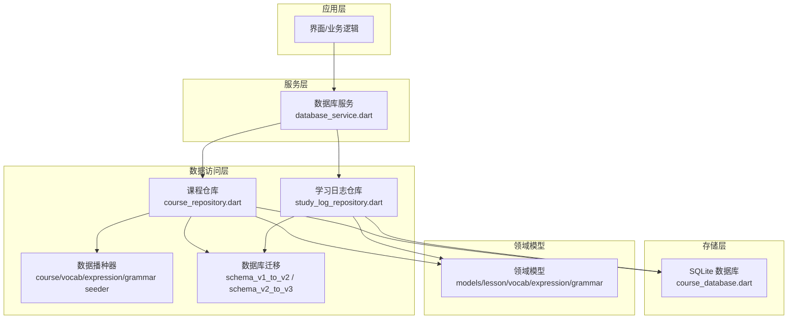
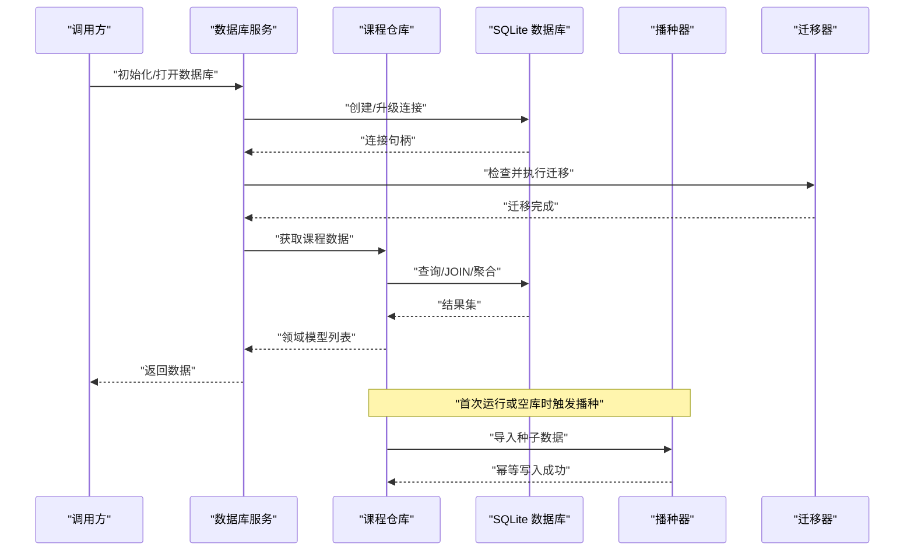
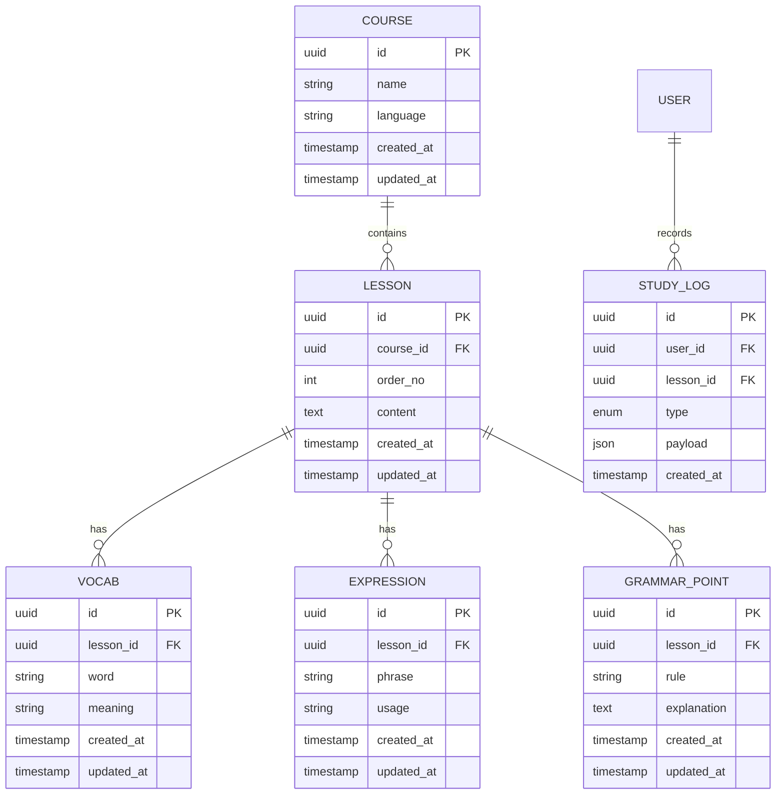
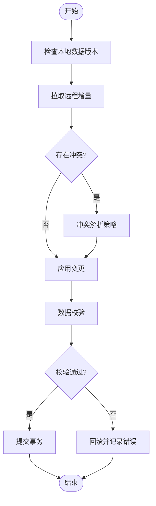

# 数据访问API

<cite>
**本文档引用的文件**   
- [lib/data/course_database.dart](file://lib/data/course_database.dart)
- [lib/data/course_repository.dart](file://lib/data/course_repository.dart)
- [lib/data/study_log_repository.dart](file://lib/data/study_log_repository.dart)
- [lib/domain/course/models.dart](file://lib/domain/course/models.dart)
- [lib/domain/course/lesson_model.dart](file://lib/domain/course/lesson_model.dart)
- [lib/domain/course/vocab_model.dart](file://lib/domain/course/vocab_model.dart)
- [lib/domain/course/expression_model.dart](file://lib/domain/course/expression_model.dart)
- [lib/domain/course/grammar_point_model.dart](file://lib/domain/course/grammar_point_model.dart)
- [lib/data/migrations/schema_v1_to_v2.dart](file://lib/data/migrations/schema_v1_to_v2.dart)
- [lib/data/migrations/schema_v2_to_v3.dart](file://lib/data/migrations/schema_v2_to_v3.dart)
- [lib/data/seeder/course_seeder.dart](file://lib/data/seeder/course_seeder.dart)
- [lib/data/seeder/vocab_seeder.dart](file://lib/data/seeder/vocab_seeder.dart)
- [lib/data/seeder/expression_seeder.dart](file://lib/data/seeder/expression_seeder.dart)
- [lib/data/seeder/grammar_seeder.dart](file://lib/data/seeder/grammar_seeder.dart)
- [lib/service/database_service.dart](file://lib/service/database_service.dart)
- [lib/di/locator.dart](file://lib/di/locator.dart)
- [test/data/course_repository_test.dart](file://test/data/course_repository_test.dart)
- [test/data/study_log_repository_test.dart](file://test/data/study_log_repository_test.dart)
- [test/data/schema_migration_test.dart](file://test/data/schema_migration_test.dart)
</cite>

## 目录
1. [简介](#简介)
2. [项目结构](#项目结构)
3. [核心组件](#核心组件)
4. [架构总览](#架构总览)
5. [详细组件分析](#详细组件分析)
6. [依赖关系分析](#依赖关系分析)
7. [性能考虑](#性能考虑)
8. [故障排查指南](#故障排查指南)
9. [结论](#结论)
10. [附录](#附录)

## 简介
本文件为 Varnamalaplus 项目的数据访问层 API 文档，聚焦于 Repository 模式、SQLite 数据库操作、实体模型与转换器、事务处理、缓存策略、数据迁移与备份恢复、数据同步与冲突解决、以及索引与约束策略。读者可据此快速理解课程学习应用的数据持久化设计与扩展点。

## 项目结构
数据访问相关代码主要分布在以下目录：
- lib/data：Repository、Database、Seeding、Migrations
- lib/domain：领域模型（实体）
- lib/service：服务层封装（如数据库服务）
- lib/di：依赖注入配置
- test/data：数据层单元测试与迁移测试



图表来源
- [lib/service/database_service.dart](file://lib/service/database_service.dart)
- [lib/data/course_repository.dart](file://lib/data/course_repository.dart)
- [lib/data/study_log_repository.dart](file://lib/data/study_log_repository.dart)
- [lib/data/course_database.dart](file://lib/data/course_database.dart)
- [lib/domain/course/models.dart](file://lib/domain/course/models.dart)

章节来源
- [lib/data/course_database.dart](file://lib/data/course_database.dart)
- [lib/data/course_repository.dart](file://lib/data/course_repository.dart)
- [lib/data/study_log_repository.dart](file://lib/data/study_log_repository.dart)
- [lib/service/database_service.dart](file://lib/service/database_service.dart)
- [lib/di/locator.dart](file://lib/di/locator.dart)

## 核心组件
- 数据库抽象与连接管理：提供 SQLite 连接、事务、批量写入、版本管理与迁移入口。
- 仓库接口与实现：按领域划分（课程、学习日志），封装 CRUD、查询、聚合统计、导入导出。
- 实体模型与转换器：领域模型与数据库表结构的映射转换，确保类型安全与一致性。
- 数据播种器：从资源或外部源初始化种子数据，支持幂等与校验。
- 迁移脚本：按版本号顺序执行，保证向后兼容与回滚策略。
- 服务层封装：对外暴露统一 API，屏蔽底层细节，便于 DI 与测试替换。

章节来源
- [lib/data/course_database.dart](file://lib/data/course_database.dart)
- [lib/data/course_repository.dart](file://lib/data/course_repository.dart)
- [lib/data/study_log_repository.dart](file://lib/data/study_log_repository.dart)
- [lib/data/seeder/course_seeder.dart](file://lib/data/seeder/course_seeder.dart)
- [lib/data/migrations/schema_v1_to_v2.dart](file://lib/data/migrations/schema_v1_to_v2.dart)

## 架构总览
数据访问采用分层与 Repository 模式：
- 服务层负责编排与错误处理；
- 仓库层负责领域数据的增删改查与复杂查询；
- 数据层通过 SQLite 持久化；
- 领域模型定义数据结构与约束；
- 迁移与播种保障数据一致性与可演进性。



图表来源
- [lib/service/database_service.dart](file://lib/service/database_service.dart)
- [lib/data/course_repository.dart](file://lib/data/course_repository.dart)
- [lib/data/course_database.dart](file://lib/data/course_database.dart)
- [lib/data/seeder/course_seeder.dart](file://lib/data/seeder/course_seeder.dart)
- [lib/data/migrations/schema_v1_to_v2.dart](file://lib/data/migrations/schema_v1_to_v2.dart)

## 详细组件分析

### 数据库服务（DatabaseService）
职责
- 数据库生命周期管理（打开、关闭、健康检查）
- 事务边界控制与重试策略
- 迁移与备份/恢复的协调
- 对外暴露统一的读写接口

关键方法
- 初始化与版本检查
- 开启/提交/回滚事务
- 执行 SQL 与批量操作
- 触发迁移与备份恢复流程

章节来源
- [lib/service/database_service.dart](file://lib/service/database_service.dart)

### 课程仓库（CourseRepository）
职责
- 课程、课节、词汇、表达、语法点的 CRUD
- 复杂查询（分页、过滤、排序、关联）
- 导入/导出与增量同步
- 统计与指标计算

关键方法
- 获取课程列表与详情
- 插入/更新/删除课节与词条
- 批量写入与事务包裹
- 同步差异与冲突合并

章节来源
- [lib/data/course_repository.dart](file://lib/data/course_repository.dart)

### 学习日志仓库（StudyLogRepository）
职责
- 学习行为记录（练习、复习、正确率）
- 时间序列查询与聚合
- 离线优先写入与批量落盘

关键方法
- 记录学习事件
- 查询学习统计
- 清理过期日志

章节来源
- [lib/data/study_log_repository.dart](file://lib/data/study_log_repository.dart)

### 实体模型与转换器
领域模型
- 课程、课节、词汇、表达、语法点等实体定义
- 字段约束与枚举值

转换器
- 将数据库行映射到领域对象
- 将领域对象序列化入库
- 处理默认值、空值与类型转换

章节来源
- [lib/domain/course/models.dart](file://lib/domain/course/models.dart)
- [lib/domain/course/lesson_model.dart](file://lib/domain/course/lesson_model.dart)
- [lib/domain/course/vocab_model.dart](file://lib/domain/course/vocab_model.dart)
- [lib/domain/course/expression_model.dart](file://lib/domain/course/expression_model.dart)
- [lib/domain/course/grammar_point_model.dart](file://lib/domain/course/grammar_point_model.dart)

### 数据播种器（Seeders）
职责
- 初始化课程、词汇、表达、语法等基础数据
- 幂等写入（避免重复导入）
- 数据校验与失败回滚

章节来源
- [lib/data/seeder/course_seeder.dart](file://lib/data/seeder/course_seeder.dart)
- [lib/data/seeder/vocab_seeder.dart](file://lib/data/seeder/vocab_seeder.dart)
- [lib/data/seeder/expression_seeder.dart](file://lib/data/seeder/expression_seeder.dart)
- [lib/data/seeder/grammar_seeder.dart](file://lib/data/seeder/grammar_seeder.dart)

### 数据库迁移（Migrations）
职责
- 按版本号顺序执行 DDL/DML 变更
- 兼容旧版本数据
- 失败回滚与日志记录

章节来源
- [lib/data/migrations/schema_v1_to_v2.dart](file://lib/data/migrations/schema_v1_to_v2.dart)
- [lib/data/migrations/schema_v2_to_v3.dart](file://lib/data/migrations/schema_v2_to_v3.dart)

### 依赖注入（Locator）
职责
- 注册数据库服务、仓库、播种器、迁移器等单例
- 提供测试替换能力

章节来源
- [lib/di/locator.dart](file://lib/di/locator.dart)

## 依赖关系分析
- 服务层依赖仓库与数据库服务
- 仓库依赖数据库抽象与领域模型
- 播种器与迁移器由服务层在合适时机触发
- 测试通过替换仓库/数据库进行隔离

```mermaid
classDiagram
class DatabaseService {
+initialize()
+beginTransaction()
+commitTransaction()
+rollbackTransaction()
+runMigrations()
+backup()
+restore()
}
class CourseRepository {
+getCourses()
+getLesson(id)
+upsertVocab(list)
+syncAndMerge(remote)
+export()
}
class StudyLogRepository {
+recordEvent(event)
+getStats(range)
+cleanup(days)
}
class CourseSeeder {
+seed()
}
class SchemaMigration {
+migrate(from,to)
}
DatabaseService --> CourseRepository : "调用"
DatabaseService --> StudyLogRepository : "调用"
CourseRepository --> CourseSeeder : "触发"
DatabaseService --> SchemaMigration : "执行"
CourseRepository --> "领域模型" : "使用"
StudyLogRepository --> "领域模型" : "使用"
```

图表来源
- [lib/service/database_service.dart](file://lib/service/database_service.dart)
- [lib/data/course_repository.dart](file://lib/data/course_repository.dart)
- [lib/data/study_log_repository.dart](file://lib/data/study_log_repository.dart)
- [lib/data/seeder/course_seeder.dart](file://lib/data/seeder/course_seeder.dart)
- [lib/data/migrations/schema_v1_to_v2.dart](file://lib/data/migrations/schema_v1_to_v2.dart)

章节来源
- [lib/di/locator.dart](file://lib/di/locator.dart)

## 性能考虑
- 批量写入：使用事务与批量插入减少磁盘 IO 次数
- 索引策略：对高频查询字段建立索引（如课程ID、课节序号、词汇词根）
- 分页与懒加载：列表查询使用 LIMIT/OFFSET 或游标分页
- 连接复用：保持单一数据库连接，避免频繁打开/关闭
- 缓存策略：热点数据（如课程元信息）使用内存缓存，设置失效策略
- 异步执行：耗时操作（导入、迁移、备份）放入后台任务
- 查询优化：避免 N+1 查询，使用 JOIN 与预取

[本节为通用建议，不直接分析具体文件]

## 故障排查指南
常见问题与定位
- 迁移失败：检查版本号与脚本顺序，查看迁移日志与回滚状态
- 并发写入冲突：确认事务边界与唯一约束，必要时增加重试
- 导入数据不一致：核对播种器的幂等逻辑与校验规则
- 查询性能退化：分析 EXPLAIN 计划，补充缺失索引
- 备份恢复异常：验证备份文件完整性与权限

调试手段
- 启用详细日志与慢查询日志
- 使用测试套件覆盖迁移与导入路径
- 使用内存数据库进行快速回归测试

章节来源
- [test/data/schema_migration_test.dart](file://test/data/schema_migration_test.dart)
- [test/data/course_repository_test.dart](file://test/data/course_repository_test.dart)
- [test/data/study_log_repository_test.dart](file://test/data/study_log_repository_test.dart)

## 结论
本数据访问层以 Repository 模式为核心，结合 SQLite 与清晰的迁移/播种机制，提供了稳定可扩展的数据持久化能力。通过服务层封装与依赖注入，既保证了生产环境的健壮性，也提升了测试与维护效率。建议在后续迭代中持续完善索引与缓存策略，强化错误恢复与监控能力。

## 附录

### 实体模型概览（ER 图）


[本图为概念性 ER 图，用于说明实体关系，不直接映射具体文件]

### 数据同步与冲突解决流程


[本图为概念性流程图，用于说明同步与冲突解决思路，不直接映射具体文件]