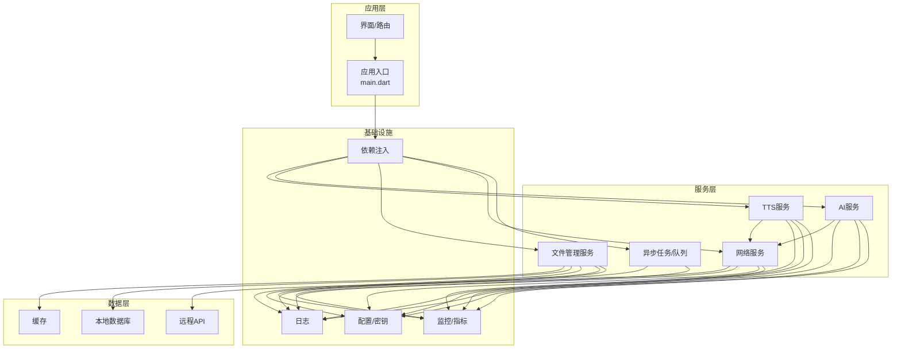
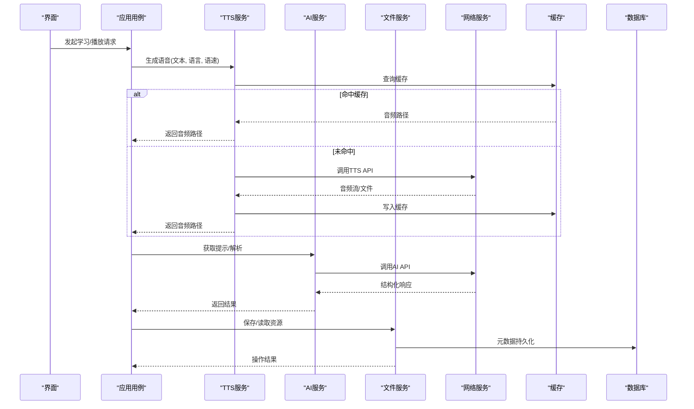
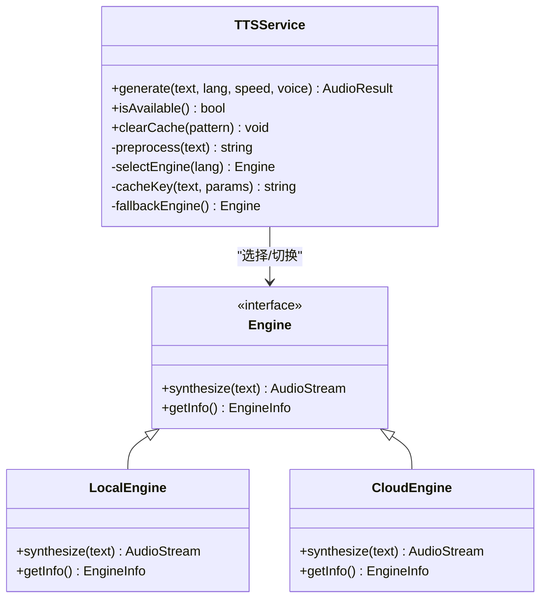
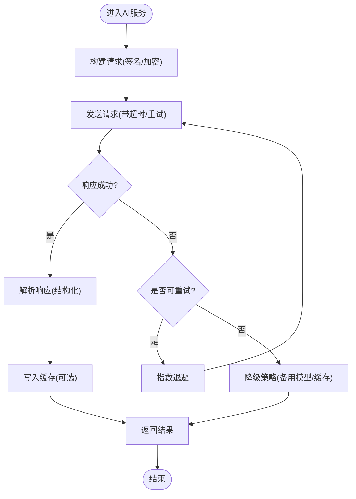
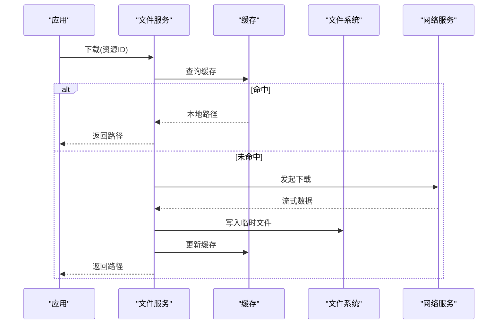
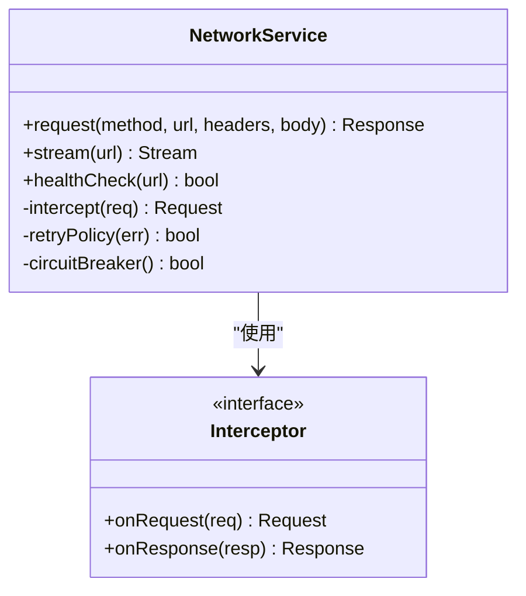
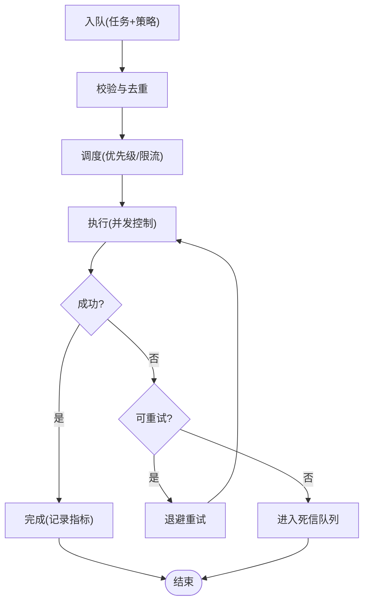
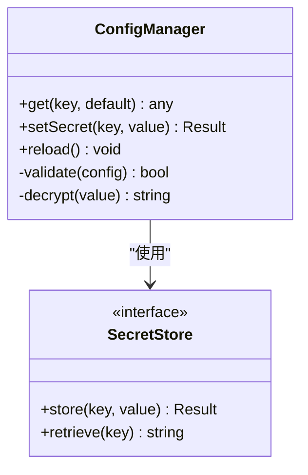
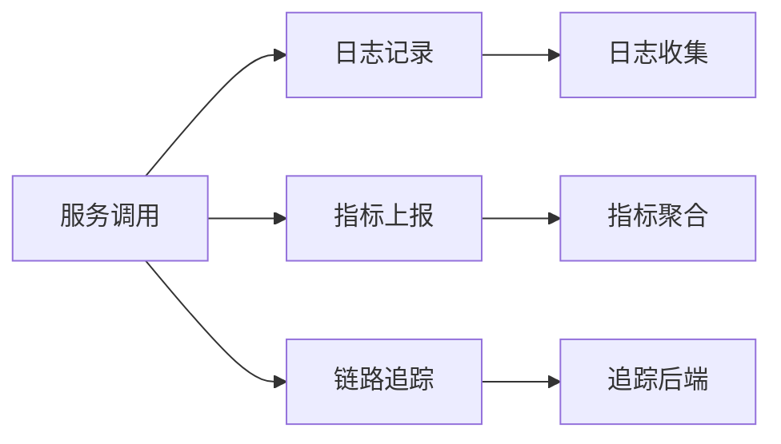
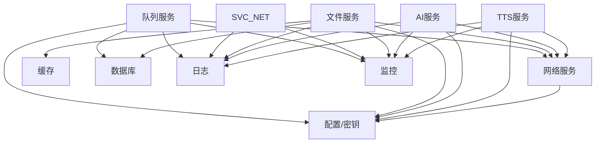

# 服务层API

<cite>
**本文档引用的文件**   
- [lib/service/](file://lib/service/)
- [lib/application/](file://lib/application/)
- [lib/core/](file://lib/core/)
- [lib/data/](file://lib/data/)
- [lib/di/](file://lib/di/)
- [pubspec.yaml](file://pubspec.yaml)
- [README.md](file://README.md)
</cite>

## 目录
1. [简介](#简介)
2. [项目结构](#项目结构)
3. [核心组件](#核心组件)
4. [架构总览](#架构总览)
5. [详细组件分析](#详细组件分析)
6. [依赖分析](#依赖分析)
7. [性能考虑](#性能考虑)
8. [故障排查指南](#故障排查指南)
9. [结论](#结论)
10. [附录](#附录)

## 简介
本文件为 Varnamalaplus 项目的“服务层API”文档，聚焦于外部服务集成与内部服务编排。内容涵盖：
- TTS语音合成、AI服务、文件管理等第三方服务接口
- 服务发现、负载均衡与故障转移机制
- 异步任务处理、队列管理与并发控制
- 第三方认证、密钥管理与安全通信协议
- 服务监控、日志记录与性能指标采集

说明：本项目为 Flutter/Dart 应用，服务层主要位于 lib/service 与 lib/application 等目录中，通过依赖注入（DI）组织服务实例，并通过数据层访问本地存储或网络资源。

## 项目结构
服务相关代码主要分布在以下目录：
- lib/service：对外暴露的服务接口与实现（如TTS、AI、文件管理、网络请求封装等）
- lib/application：业务用例与应用级服务编排（组合多个 service 完成复杂流程）
- lib/core：通用能力（配置、加密、日志、错误模型、结果类型等）
- lib/data：数据访问层（数据库、缓存、远程API客户端）
- lib/di：依赖注入容器与服务注册
- pubspec.yaml：第三方依赖声明（HTTP、加密、序列化、日志等）
- README.md：项目概述与使用说明

图表来源
- [lib/main.dart:1-200](file://lib/main.dart#L1-L200)
- [lib/di/](file://lib/di/)
- [lib/service/](file://lib/service/)
- [lib/application/](file://lib/application/)
- [lib/core/](file://lib/core/)
- [lib/data/](file://lib/data/)

章节来源
- [README.md](file://README.md)
- [pubspec.yaml](file://pubspec.yaml)

## 核心组件
本节对服务层的关键组件进行概览性说明，帮助读者快速建立整体认知。
- TTS服务：负责文本到语音的转换，支持多引擎切换、缓存、失败回退
- AI服务：提供自然语言处理能力（如翻译、摘要、纠错），具备重试与降级策略
- 文件管理服务：统一上传、下载、缓存、清理与权限校验
- 网络服务：HTTP客户端封装、超时/重试/熔断、请求拦截器
- 异步任务/队列：后台任务调度、任务去重、优先级与限流
- 配置与密钥：环境变量、运行时配置、敏感信息加密存储
- 日志与监控：结构化日志、采样、链路追踪、关键指标上报

章节来源
- [lib/service/](file://lib/service/)
- [lib/application/](file://lib/application/)
- [lib/core/](file://lib/core/)
- [lib/data/](file://lib/data/)

## 架构总览
服务层采用分层与模块化设计，通过依赖注入将服务装配到应用中。典型调用链如下：
- 界面触发用例（application）
- 用例编排服务（service）
- 服务调用数据层（data）或直接调用外部API
- 基础设施（日志、监控、配置）贯穿各层

图表来源
- [lib/application/](file://lib/application/)
- [lib/service/](file://lib/service/)
- [lib/data/](file://lib/data/)

## 详细组件分析

### TTS语音合成服务
职责与能力
- 文本预处理（清洗、分词、语言检测）
- 多引擎适配（本地/云端TTS）
- 音频格式与采样率标准化
- 缓存策略（按文本+参数哈希）
- 失败回退（主引擎不可用自动切换备用引擎）
- 并发控制（限制同时生成的任务数）

关键接口（概念性描述）
- 生成语音：输入文本、语言、语速、音色；输出音频路径或流
- 查询可用性：检查当前可用引擎与配额
- 清理缓存：按规则清理过期或冗余音频

错误与降级
- 网络异常：重试+指数退避
- 配额耗尽：切换备用引擎或提示用户
- 编码失败：回退至默认格式并记录指标

图表来源
- [lib/service/](file://lib/service/)

章节来源
- [lib/service/](file://lib/service/)
- [lib/core/](file://lib/core/)

### AI服务
职责与能力
- 统一抽象多种AI能力（翻译、摘要、纠错、解释）
- 请求构建与响应解析
- 重试与熔断（基于错误码/超时）
- 结果缓存（相同语义的请求缓存）
- 安全传输（签名、TLS、证书校验）

关键接口（概念性描述）
- 翻译：输入文本与目标语言；输出翻译结果
- 摘要：输入长文本与长度约束；输出摘要
- 纠错：输入文本；输出修正后文本与差异标记

错误与降级
- 服务端限流：排队与退避
- 模型不可用：切换模型或返回兜底结果
- 鉴权失败：刷新令牌或提示重新登录

图表来源
- [lib/service/](file://lib/service/)
- [lib/core/](file://lib/core/)

章节来源
- [lib/service/](file://lib/service/)
- [lib/core/](file://lib/core/)

### 文件管理服务
职责与能力
- 统一文件访问（本地存储、沙盒、云盘）
- 上传/下载（断点续传、进度回调）
- 缓存与清理（LRU、过期策略）
- 权限与安全（读写权限、完整性校验）
- 元数据管理（索引、标签、版本）

关键接口（概念性描述）
- 上传：输入文件与目标路径；输出URL或本地路径
- 下载：输入URL或ID；输出本地路径
- 删除：输入ID或路径；输出操作结果
- 列表：输入过滤条件；输出文件清单

错误与降级
- 网络中断：断点续传与队列重试
- 磁盘空间不足：清理策略与提示
- 权限拒绝：引导授权或回退到只读模式

图表来源
- [lib/service/](file://lib/service/)
- [lib/data/](file://lib/data/)

章节来源
- [lib/service/](file://lib/service/)
- [lib/data/](file://lib/data/)

### 网络服务
职责与能力
- HTTP客户端封装（GET/POST/PUT/DELETE）
- 请求拦截（鉴权、日志、埋点）
- 重试与熔断（基于状态码/超时/错误）
- 连接池与并发控制
- 代理与证书管理

关键接口（概念性描述）
- 请求：输入方法、URL、头、体；输出响应
- 流式请求：输入URL；输出数据流
- 健康检查：输入服务地址；输出可用性

错误与降级
- 超时：重试或短路
- 5xx：熔断与告警
- 401：刷新令牌并重试

图表来源
- [lib/service/](file://lib/service/)
- [lib/core/](file://lib/core/)

章节来源
- [lib/service/](file://lib/service/)
- [lib/core/](file://lib/core/)

### 异步任务与队列
职责与能力
- 任务调度（延迟、周期、一次性）
- 任务去重（幂等键）
- 优先级与限流（令牌桶/漏桶）
- 失败重试与死信队列
- 监控与审计（执行时间、成功率）

关键接口（概念性描述）
- 入队：输入任务定义与策略；输出任务ID
- 取消：输入任务ID；输出取消结果
- 查询：输入任务ID；输出状态与结果

图表来源
- [lib/service/](file://lib/service/)
- [lib/core/](file://lib/core/)

章节来源
- [lib/service/](file://lib/service/)
- [lib/core/](file://lib/core/)

### 配置与密钥管理
职责与能力
- 环境配置加载（开发/测试/生产）
- 敏感信息加密存储（密钥环/安全存储）
- 动态配置更新（热更新/灰度）
- 配置校验与默认值回退

关键接口（概念性描述）
- 获取配置：输入键；输出值（含默认值）
- 设置密钥：输入键与密文；输出结果
- 刷新配置：触发重载

图表来源
- [lib/core/](file://lib/core/)

章节来源
- [lib/core/](file://lib/core/)

### 监控、日志与指标
职责与能力
- 结构化日志（级别、上下文、TraceId）
- 指标采集（QPS、延迟、错误率、资源使用）
- 链路追踪（跨服务调用串联）
- 告警与上报（阈值、聚合）

关键接口（概念性描述）
- 记录日志：输入级别、消息、上下文
- 上报指标：输入名称、数值、标签
- 开始/结束追踪：输入Span名；输出Span句柄

图表来源
- [lib/core/](file://lib/core/)

章节来源
- [lib/core/](file://lib/core/)

## 依赖分析
服务层依赖关系与耦合情况：
- 高内聚：每个服务职责单一，接口清晰
- 低耦合：通过接口与DI解耦具体实现
- 外部依赖：HTTP、加密、序列化、日志、存储等
- 潜在循环：避免在service之间直接互相引用，必要时通过application层编排

图表来源
- [lib/service/](file://lib/service/)
- [lib/data/](file://lib/data/)
- [lib/core/](file://lib/core/)

章节来源
- [lib/service/](file://lib/service/)
- [lib/data/](file://lib/data/)
- [lib/core/](file://lib/core/)

## 性能考虑
- 缓存优先：TTS/AI/文件均启用缓存，减少重复计算与网络开销
- 连接复用：HTTP连接池与持久连接，降低握手成本
- 并发控制：限制并发任务数，避免资源争用
- 批量处理：合并小请求，减少往返次数
- 异步非阻塞：IO密集型操作异步化，提升吞吐
- 采样与降级：高峰期采样日志与降级非关键功能

[本节为通用指导，不直接分析具体文件]

## 故障排查指南
常见问题与定位步骤：
- TTS无法生成
  - 检查引擎可用性与健康状态
  - 查看缓存命中与网络连通性
  - 确认配额与鉴权状态
- AI请求失败
  - 检查重试与熔断状态
  - 查看错误码与响应体
  - 确认模型可用性与限流
- 文件上传/下载失败
  - 检查权限与磁盘空间
  - 查看断点续传与重试队列
  - 校验完整性与签名
- 网络异常
  - 检查超时与重试策略
  - 查看证书与代理配置
  - 确认DNS与防火墙

章节来源
- [lib/service/](file://lib/service/)
- [lib/core/](file://lib/core/)

## 结论
Varnamalaplus 的服务层以清晰的职责划分与良好的解耦为基础，结合缓存、重试、熔断、监控等机制，提供了稳定可靠的外部服务集成能力。建议在生产环境中完善监控与告警，持续优化性能与稳定性。

[本节为总结性内容，不直接分析具体文件]

## 附录
- 术语表
  - TTS：Text-to-Speech，文本转语音
  - AI：人工智能服务（翻译、摘要、纠错等）
  - 熔断：Circuit Breaker，防止雪崩的保护机制
  - 限流：Rate Limiting，控制请求速率
- 最佳实践
  - 所有外部调用必须包含超时与重试
  - 敏感信息一律加密存储
  - 关键路径增加监控与日志
  - 定期清理缓存与临时文件

[本节为补充信息，不直接分析具体文件]