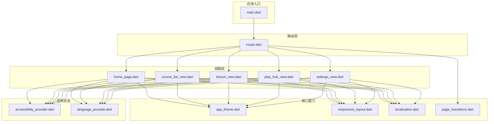
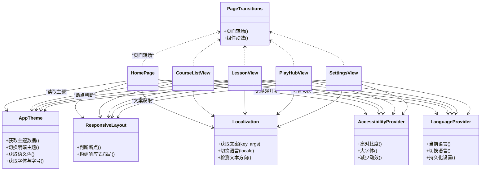
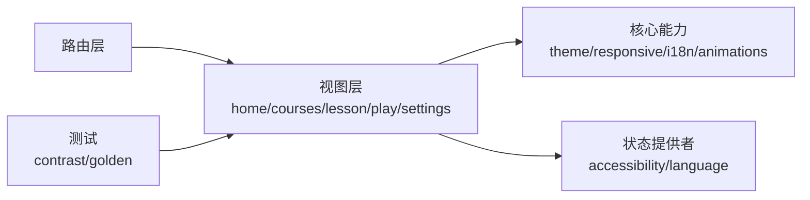

# UI组件库

<cite>
**本文引用的文件**   
- [lib/main.dart](file://lib/main.dart)
- [pubspec.yaml](file://pubspec.yaml)
- [analysis_options.yaml](file://analysis_options.yaml)
- [README.md](file://README.md)
- [lib/views/home/home_page.dart](file://lib/views/home/home_page.dart)
- [lib/views/courses/course_list_view.dart](file://lib/views/courses/course_list_view.dart)
- [lib/views/lesson/lesson_view.dart](file://lib/views/lesson/lesson_view.dart)
- [lib/views/play/play_hub_view.dart](file://lib/views/play/play_hub_view.dart)
- [lib/views/settings/settings_view.dart](file://lib/views/settings/settings_view.dart)
- [lib/core/theme/app_theme.dart](file://lib/core/theme/app_theme.dart)
- [lib/core/responsive/responsive_layout.dart](file://lib/core/responsive/responsive_layout.dart)
- [lib/core/i18n/localization.dart](file://lib/core/i18n/localization.dart)
- [lib/core/animations/page_transitions.dart](file://lib/core/animations/page_transitions.dart)
- [lib/application/providers/accessibility_provider.dart](file://lib/application/providers/accessibility_provider.dart)
- [lib/application/providers/language_provider.dart](file://lib/application/providers/language_provider.dart)
- [lib/routing/router.dart](file://lib/routing/router.dart)
- [test/views/dark_mode_text_contrast_test.dart](file://test/views/dark_mode_text_contrast_test.dart)
- [test/golden/play_hub_golden_test.dart](file://test/golden/play_hub_golden_test.dart)
</cite>

## 目录
1. [简介](#简介)
2. [项目结构](#项目结构)
3. [核心组件](#核心组件)
4. [架构总览](#架构总览)
5. [详细组件分析](#详细组件分析)
6. [依赖关系分析](#依赖关系分析)
7. [性能考虑](#性能考虑)
8. [故障排查指南](#故障排查指南)
9. [结论](#结论)
10. [附录](#附录)

## 简介
本文件为 Varnamalaplus 的 UI 组件库综合文档，面向开发者与内容作者，系统阐述自定义组件的设计原则、样式系统与主题机制、响应式布局策略、动画效果与用户体验优化。同时覆盖页面组件的功能说明、属性配置与使用示例，无障碍访问支持、多语言界面适配与性能优化技巧，并提供组件复用最佳实践、样式定制指南和测试策略。

## 项目结构
Varnamalaplus 采用 Flutter 工程组织，UI 相关代码主要分布在 lib 目录下：
- views：页面级视图（首页、课程列表、学习页、游戏中心、设置等）
- core：跨页面能力（主题、响应式、国际化、动画）
- application：状态管理与业务提供者（可访问性、语言等）
- routing：路由与导航
- test：单元测试、黄金截图测试与集成测试

图表来源
- [lib/main.dart](file://lib/main.dart)
- [lib/routing/router.dart](file://lib/routing/router.dart)
- [lib/views/home/home_page.dart](file://lib/views/home/home_page.dart)
- [lib/views/courses/course_list_view.dart](file://lib/views/courses/course_list_view.dart)
- [lib/views/lesson/lesson_view.dart](file://lib/views/lesson/lesson_view.dart)
- [lib/views/play/play_hub_view.dart](file://lib/views/play/play_hub_view.dart)
- [lib/views/settings/settings_view.dart](file://lib/views/settings/settings_view.dart)
- [lib/core/theme/app_theme.dart](file://lib/core/theme/app_theme.dart)
- [lib/core/responsive/responsive_layout.dart](file://lib/core/responsive/responsive_layout.dart)
- [lib/core/i18n/localization.dart](file://lib/core/i18n/localization.dart)
- [lib/core/animations/page_transitions.dart](file://lib/core/animations/page_transitions.dart)
- [lib/application/providers/accessibility_provider.dart](file://lib/application/providers/accessibility_provider.dart)
- [lib/application/providers/language_provider.dart](file://lib/application/providers/language_provider.dart)

章节来源
- [lib/main.dart](file://lib/main.dart)
- [pubspec.yaml](file://pubspec.yaml)
- [README.md](file://README.md)

## 核心组件
- 主题系统（Theme）
  - 提供明暗主题、色彩语义、字体族与字号层级、间距与圆角规范，确保一致的视觉风格与对比度。
  - 通过全局 Theme 数据注入，供所有组件读取，避免硬编码颜色与尺寸。
- 响应式布局（ResponsiveLayout）
  - 基于屏幕宽度断点切换布局（手机/平板/桌面），在窄屏下采用单列流式布局，宽屏启用网格或分栏。
  - 提供便捷方法判断当前断点，便于条件渲染与交互行为调整。
- 国际化（Localization）
  - 集中管理文案键值，按语言包加载；支持运行时切换语言并刷新界面。
  - 文本方向（LTR/RTL）由语言环境自动决定。
- 动画与过渡（PageTransitions）
  - 统一的页面转场与组件动效，保证流畅且克制的交互反馈。
  - 针对无障碍用户降低动效强度。
- 可访问性（AccessibilityProvider）
  - 暴露高对比度、大字体、减少动效等开关，驱动 UI 自适应。
- 语言切换（LanguageProvider）
  - 维护当前语言与区域设置，持久化用户偏好。

章节来源
- [lib/core/theme/app_theme.dart](file://lib/core/theme/app_theme.dart)
- [lib/core/responsive/responsive_layout.dart](file://lib/core/responsive/responsive_layout.dart)
- [lib/core/i18n/localization.dart](file://lib/core/i18n/localization.dart)
- [lib/core/animations/page_transitions.dart](file://lib/core/animations/page_transitions.dart)
- [lib/application/providers/accessibility_provider.dart](file://lib/application/providers/accessibility_provider.dart)
- [lib/application/providers/language_provider.dart](file://lib/application/providers/language_provider.dart)

## 架构总览
UI 层遵循“视图-核心能力-状态”分层：
- 视图层（views）：页面与组件，仅负责展示与用户交互事件转发
- 核心能力（core）：主题、响应式、国际化、动画等横切关注点
- 状态层（application/providers）：业务与 UI 状态，通过 Provider 模式向视图提供数据
- 路由层（routing）：统一导航与守卫逻辑

图表来源
- [lib/core/theme/app_theme.dart](file://lib/core/theme/app_theme.dart)
- [lib/core/responsive/responsive_layout.dart](file://lib/core/responsive/responsive_layout.dart)
- [lib/core/i18n/localization.dart](file://lib/core/i18n/localization.dart)
- [lib/core/animations/page_transitions.dart](file://lib/core/animations/page_transitions.dart)
- [lib/application/providers/accessibility_provider.dart](file://lib/application/providers/accessibility_provider.dart)
- [lib/application/providers/language_provider.dart](file://lib/application/providers/language_provider.dart)
- [lib/views/home/home_page.dart](file://lib/views/home/home_page.dart)
- [lib/views/courses/course_list_view.dart](file://lib/views/courses/course_list_view.dart)
- [lib/views/lesson/lesson_view.dart](file://lib/views/lesson/lesson_view.dart)
- [lib/views/play/play_hub_view.dart](file://lib/views/play/play_hub_view.dart)
- [lib/views/settings/settings_view.dart](file://lib/views/settings/settings_view.dart)

## 详细组件分析

### 首页（Home）
- 功能：入口导航、快捷入口、最近学习进度概览
- 属性：标题、欢迎语、入口卡片集合、进度摘要
- 交互：点击跳转至课程列表、学习、游戏中心与设置
- 响应式：窄屏单列，宽屏双列或三列网格
- 无障碍：按钮具备语义标签，焦点顺序合理
- 动画：页面进入时轻微缩放与淡入

章节来源
- [lib/views/home/home_page.dart](file://lib/views/home/home_page.dart)
- [lib/core/responsive/responsive_layout.dart](file://lib/core/responsive/responsive_layout.dart)
- [lib/core/i18n/localization.dart](file://lib/core/i18n/localization.dart)
- [lib/core/animations/page_transitions.dart](file://lib/core/animations/page_transitions.dart)
- [lib/application/providers/accessibility_provider.dart](file://lib/application/providers/accessibility_provider.dart)

### 课程列表（CourseList）
- 功能：课程分类、搜索过滤、分页加载
- 属性：课程数据源、筛选条件、加载状态
- 交互：点击课程进入学习页，支持下拉刷新与上拉加载更多
- 响应式：小屏纵向滚动，大屏网格展示
- 无障碍：列表项可聚焦，读屏描述完整
- 动画：列表项入场交错动画

章节来源
- [lib/views/courses/course_list_view.dart](file://lib/views/courses/course_list_view.dart)
- [lib/core/responsive/responsive_layout.dart](file://lib/core/responsive/responsive_layout.dart)
- [lib/core/i18n/localization.dart](file://lib/core/i18n/localization.dart)
- [lib/core/animations/page_transitions.dart](file://lib/core/animations/page_transitions.dart)
- [lib/application/providers/accessibility_provider.dart](file://lib/application/providers/accessibility_provider.dart)

### 学习页（Lesson）
- 功能：题目渲染、答题交互、即时反馈、进度追踪
- 属性：题目数据、答案校验器、提交回调
- 交互：选择答案、提示、跳过、提交后解析
- 响应式：移动端全屏答题，平板侧边提示面板
- 无障碍：键盘导航、语音朗读选项、高对比度模式
- 动画：正确/错误反馈动效，进度条平滑过渡

章节来源
- [lib/views/lesson/lesson_view.dart](file://lib/views/lesson/lesson_view.dart)
- [lib/core/responsive/responsive_layout.dart](file://lib/core/responsive/responsive_layout.dart)
- [lib/core/i18n/localization.dart](file://lib/core/i18n/localization.dart)
- [lib/core/animations/page_transitions.dart](file://lib/core/animations/page_transitions.dart)
- [lib/application/providers/accessibility_provider.dart](file://lib/application/providers/accessibility_provider.dart)

### 游戏中心（PlayHub）
- 功能：多种练习模式入口、排行榜、成就展示
- 属性：模式列表、统计数据、成就数据
- 交互：选择模式进入游戏，查看成绩详情
- 响应式：卡片网格布局，适配不同屏幕
- 无障碍：图标按钮附带文字说明，焦点清晰
- 动画：卡片悬停与点击反馈

章节来源
- [lib/views/play/play_hub_view.dart](file://lib/views/play/play_hub_view.dart)
- [lib/core/responsive/responsive_layout.dart](file://lib/core/responsive/responsive_layout.dart)
- [lib/core/i18n/localization.dart](file://lib/core/i18n/localization.dart)
- [lib/core/animations/page_transitions.dart](file://lib/core/animations/page_transitions.dart)
- [lib/application/providers/accessibility_provider.dart](file://lib/application/providers/accessibility_provider.dart)

### 设置页（Settings）
- 功能：主题切换、语言设置、可访问性选项、数据同步
- 属性：当前主题、当前语言、可访问性开关
- 交互：切换主题/语言即时生效，保存偏好
- 响应式：表单控件在不同断点下自适应排列
- 无障碍：表单字段标签明确，错误提示可读
- 动画：设置项切换时的平滑过渡

章节来源
- [lib/views/settings/settings_view.dart](file://lib/views/settings/settings_view.dart)
- [lib/core/responsive/responsive_layout.dart](file://lib/core/responsive/responsive_layout.dart)
- [lib/core/i18n/localization.dart](file://lib/core/i18n/localization.dart)
- [lib/core/animations/page_transitions.dart](file://lib/core/animations/page_transitions.dart)
- [lib/application/providers/accessibility_provider.dart](file://lib/application/providers/accessibility_provider.dart)
- [lib/application/providers/language_provider.dart](file://lib/application/providers/language_provider.dart)

### 主题系统（AppTheme）
- 设计原则：语义化命名、明暗兼容、对比度达标、可扩展
- 数据结构：颜色、字体、间距、形状、阴影
- 使用方式：通过全局 Theme 读取，避免硬编码
- 扩展点：新增语义色、字体族与字号层级

章节来源
- [lib/core/theme/app_theme.dart](file://lib/core/theme/app_theme.dart)

### 响应式布局（ResponsiveLayout）
- 断点策略：手机、平板、桌面三类
- 布局算法：根据宽度动态选择单列/双列/三列
- 工具方法：isMobile/isTablet/isDesktop、buildResponsiveBuilder

章节来源
- [lib/core/responsive/responsive_layout.dart](file://lib/core/responsive/responsive_layout.dart)

### 国际化（Localization）
- 文案管理：按模块与页面拆分，统一 key 命名
- 运行时切换：语言变更后重建界面
- 文本方向：自动处理 LTR/RTL

章节来源
- [lib/core/i18n/localization.dart](file://lib/core/i18n/localization.dart)

### 动画与过渡（PageTransitions）
- 页面转场：统一进入/退出动画
- 组件动效：轻量反馈，避免过度动画
- 无障碍：尊重“减少动效”设置

章节来源
- [lib/core/animations/page_transitions.dart](file://lib/core/animations/page_transitions.dart)

### 可访问性（AccessibilityProvider）
- 能力：高对比度、大字体、减少动效
- 影响范围：主题、布局、动画联动更新

章节来源
- [lib/application/providers/accessibility_provider.dart](file://lib/application/providers/accessibility_provider.dart)

### 语言切换（LanguageProvider）
- 能力：当前语言、切换语言、持久化
- 与 UI：语言变更后触发界面重建

章节来源
- [lib/application/providers/language_provider.dart](file://lib/application/providers/language_provider.dart)

## 依赖关系分析
- 视图依赖核心能力（主题、响应式、国际化、动画）
- 视图依赖状态提供者（可访问性、语言）
- 路由层协调页面导航与转场动画
- 测试覆盖关键交互与视觉回归

图表来源
- [lib/views/home/home_page.dart](file://lib/views/home/home_page.dart)
- [lib/views/courses/course_list_view.dart](file://lib/views/courses/course_list_view.dart)
- [lib/views/lesson/lesson_view.dart](file://lib/views/lesson/lesson_view.dart)
- [lib/views/play/play_hub_view.dart](file://lib/views/play/play_hub_view.dart)
- [lib/views/settings/settings_view.dart](file://lib/views/settings/settings_view.dart)
- [lib/core/theme/app_theme.dart](file://lib/core/theme/app_theme.dart)
- [lib/core/responsive/responsive_layout.dart](file://lib/core/responsive/responsive_layout.dart)
- [lib/core/i18n/localization.dart](file://lib/core/i18n/localization.dart)
- [lib/core/animations/page_transitions.dart](file://lib/core/animations/page_transitions.dart)
- [lib/application/providers/accessibility_provider.dart](file://lib/application/providers/accessibility_provider.dart)
- [lib/application/providers/language_provider.dart](file://lib/application/providers/language_provider.dart)
- [lib/routing/router.dart](file://lib/routing/router.dart)
- [test/views/dark_mode_text_contrast_test.dart](file://test/views/dark_mode_text_contrast_test.dart)
- [test/golden/play_hub_golden_test.dart](file://test/golden/play_hub_golden_test.dart)

章节来源
- [lib/routing/router.dart](file://lib/routing/router.dart)
- [test/views/dark_mode_text_contrast_test.dart](file://test/views/dark_mode_text_contrast_test.dart)
- [test/golden/play_hub_golden_test.dart](file://test/golden/play_hub_golden_test.dart)

## 性能考虑
- 懒加载与分页：长列表按需加载，减少首屏压力
- 不可变数据与局部更新：使用 Provider 精确订阅，避免全量重建
- 图片与资源优化：压缩与缓存，延迟加载非关键资源
- 动画性能：优先使用 Opacity/Transform，避免重排
- 无障碍优化：减少不必要的 rebuild，保持焦点稳定

[本节为通用指导，不直接分析具体文件]

## 故障排查指南
- 主题对比度问题
  - 现象：暗色模式下文本对比度不足
  - 排查：检查主题语义色是否满足 WCAG 标准，验证高对比度开关
  - 参考测试：对比度测试用例
- 语言切换无效
  - 现象：切换语言后界面未更新
  - 排查：确认 LanguageProvider 已通知监听者，界面是否重建
- 响应式布局异常
  - 现象：平板布局错乱
  - 排查：检查断点判断与容器约束，确认响应式构建器使用正确
- 动画卡顿
  - 现象：页面切换掉帧
  - 排查：减少复杂动画，避免在热路径中执行重计算

章节来源
- [test/views/dark_mode_text_contrast_test.dart](file://test/views/dark_mode_text_contrast_test.dart)
- [lib/application/providers/language_provider.dart](file://lib/application/providers/language_provider.dart)
- [lib/core/responsive/responsive_layout.dart](file://lib/core/responsive/responsive_layout.dart)
- [lib/core/animations/page_transitions.dart](file://lib/core/animations/page_transitions.dart)

## 结论
Varnamalaplus 的 UI 组件库以清晰的层次结构与可复用的核心能力为基础，结合主题、响应式、国际化与动画，提供了良好的用户体验与可维护性。通过完善的测试与无障碍支持，确保了跨设备与多样化用户的可用性。建议在新组件开发中严格遵循现有约定，持续优化性能与可访问性。

[本节为总结性内容，不直接分析具体文件]

## 附录

### 组件复用最佳实践
- 将通用 UI 片段抽取为独立组件，并通过参数控制行为
- 使用主题变量而非硬编码颜色与尺寸
- 对复杂交互封装为高阶组件或组合组件
- 保持组件职责单一，便于测试与维护

[本节为通用指导，不直接分析具体文件]

### 样式定制指南
- 在主题中定义新增语义色与字体族
- 通过响应式断点调整布局与间距
- 使用一致的圆角与阴影规范
- 确保明暗主题下的对比度达标

[本节为通用指导，不直接分析具体文件]

### 测试策略
- 单元：组件逻辑与状态变更
- 黄金截图：关键页面视觉回归
- 集成：用户流程端到端验证
- 可访问性：对比度与读屏兼容性

章节来源
- [test/golden/play_hub_golden_test.dart](file://test/golden/play_hub_golden_test.dart)
- [test/views/dark_mode_text_contrast_test.dart](file://test/views/dark_mode_text_contrast_test.dart)