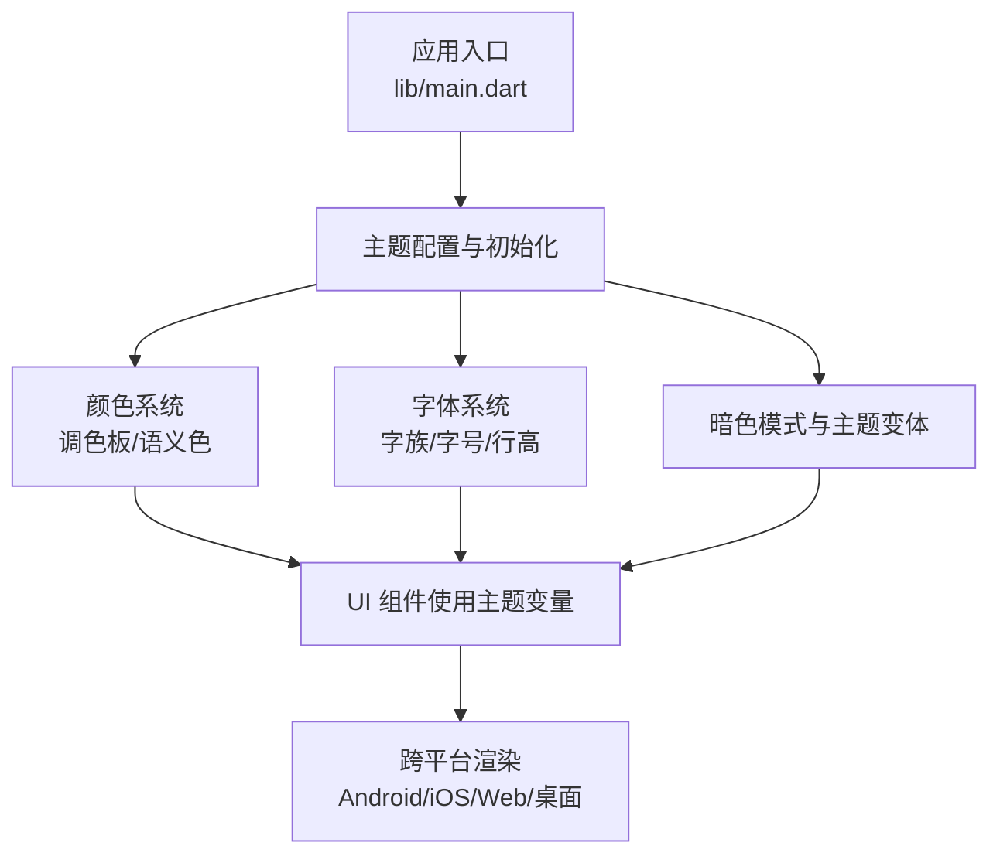
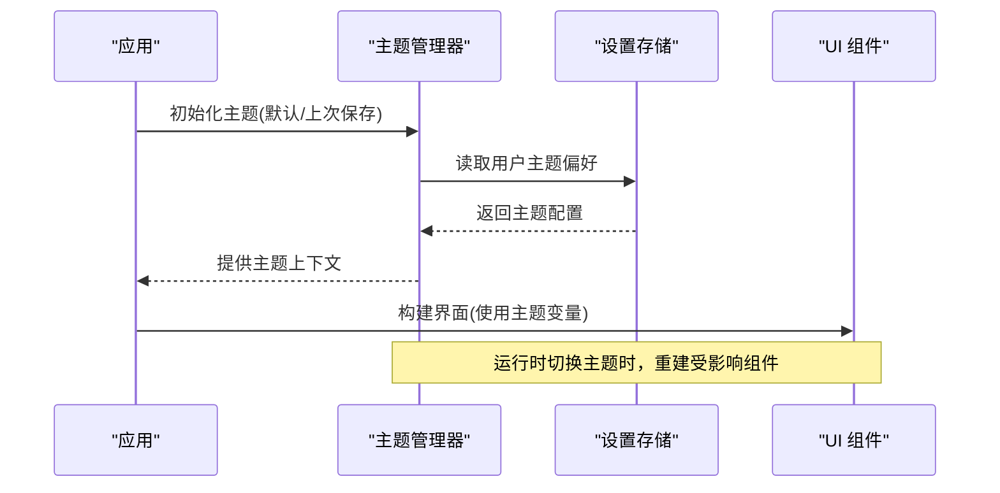
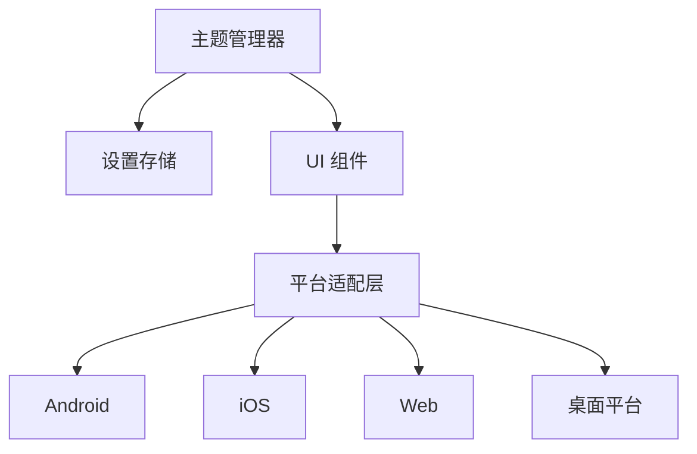

# 主题系统

<cite>
**本文引用的文件**   
- [lib/main.dart](file://lib/main.dart)
- [pubspec.yaml](file://pubspec.yaml)
- [README.md](file://README.md)
</cite>

## 目录
1. [简介](#简介)
2. [项目结构](#项目结构)
3. [核心组件](#核心组件)
4. [架构总览](#架构总览)
5. [详细组件分析](#详细组件分析)
6. [依赖关系分析](#依赖关系分析)
7. [性能考量](#性能考量)
8. [故障排查指南](#故障排查指南)
9. [结论](#结论)
10. [附录](#附录)

## 简介
本文件面向 Varnamalaplus 的主题系统，目标是帮助开发者理解并扩展该项目的主题能力。文档涵盖主题架构设计、颜色系统与字体规范、暗色模式与动态切换机制、多平台适配策略、主题变量定义与继承覆盖规则、自定义主题创建指南、品牌定制方法以及主题测试策略。同时提供运行时切换的技术实现要点与性能优化建议，确保在 Android、iOS、Web、Windows、macOS、Linux 等多平台上保持一致的视觉体验。

## 项目结构
Varnamalaplus 是一个 Flutter 应用，主题相关代码通常集中在 lib 目录下的主题与 UI 层中。当前仓库根目录包含多个平台入口（android、ios、web、windows、macos、linux），Flutter 源码位于 lib 目录。主题系统的入口通常在应用启动时配置，并通过全局主题上下文向各页面提供样式与资源。

图表来源
- [lib/main.dart:1-200](file://lib/main.dart#L1-L200)

章节来源
- [lib/main.dart:1-200](file://lib/main.dart#L1-L200)
- [pubspec.yaml:1-200](file://pubspec.yaml#L1-L200)

## 核心组件
- 主题入口与生命周期管理：负责加载默认主题、读取用户偏好、监听系统主题变化并在运行时切换。
- 颜色系统：定义基础色板与语义色（如成功、警告、错误、主色、背景、前景等），支持明暗两套映射。
- 字体系统：定义字族、字号阶梯、行高与粗细，保证可读性与一致性。
- 暗色模式与主题变体：基于系统或用户选择切换，保持对比度与可访问性。
- 多平台适配：针对不同平台的渲染差异进行微调，确保一致的视觉表现。

章节来源
- [lib/main.dart:1-200](file://lib/main.dart#L1-L200)
- [pubspec.yaml:1-200](file://pubspec.yaml#L1-L200)

## 架构总览
主题系统采用“集中式定义 + 消费式引用”的架构。应用启动时构建主题对象，将其注入到全局上下文中；UI 组件通过主题上下文获取颜色、字体与间距等变量，避免硬编码。暗色模式通过主题变体切换，运行时更新不影响已构建的静态资源。

图表来源
- [lib/main.dart:1-200](file://lib/main.dart#L1-L200)

## 详细组件分析

### 主题入口与生命周期
- 职责：解析默认主题、合并用户偏好、监听系统主题变化、触发运行时重建。
- 关键点：
  - 应用启动阶段完成主题初始化。
  - 主题变更需触发必要的状态更新，避免全量重建。
  - 持久化用户主题选择，确保重启后一致。

章节来源
- [lib/main.dart:1-200](file://lib/main.dart#L1-L200)

### 颜色系统
- 职责：定义基础色板与语义色，维护明暗两套映射，确保对比度符合可访问性标准。
- 关键点：
  - 语义色用于业务含义（如成功、警告、错误）。
  - 背景/前景色区分层级，避免过度依赖固定颜色。
  - 为不同平台提供微调，保证视觉一致性。

章节来源
- [lib/main.dart:1-200](file://lib/main.dart#L1-L200)

### 字体系统
- 职责：统一定义字族、字号阶梯、行高与粗细，提升可读性与一致性。
- 关键点：
  - 标题、正文、辅助文本分别定义字号与粗细。
  - 针对多语言与特殊字符集选择合适的字族。
  - 在不同平台下校验字体可用性并提供回退方案。

章节来源
- [lib/main.dart:1-200](file://lib/main.dart#L1-L200)

### 暗色模式与主题变体
- 职责：根据系统或用户选择切换明暗主题，保持对比度与可访问性。
- 关键点：
  - 优先读取系统主题，其次使用用户偏好。
  - 切换时仅重建必要组件，减少性能开销。
  - 对图片与图标进行适配，避免明暗模式下对比不足。

章节来源
- [lib/main.dart:1-200](file://lib/main.dart#L1-L200)

### 多平台适配
- 职责：针对 Android、iOS、Web、Windows、macOS、Linux 的差异进行微调。
- 关键点：
  - 平台检测与差异化处理。
  - 字体与图标在不同平台的可用性与回退。
  - 屏幕密度与像素对齐，确保清晰度。

章节来源
- [lib/main.dart:1-200](file://lib/main.dart#L1-L200)

### 主题变量定义、继承与覆盖规则
- 定义：主题变量应集中在统一位置，便于管理与复用。
- 继承：基础主题提供通用变量，具体主题可继承并覆盖部分变量。
- 覆盖：优先级从低到高（基础主题 < 平台主题 < 用户主题），确保最终生效值明确。

章节来源
- [lib/main.dart:1-200](file://lib/main.dart#L1-L200)

### 自定义主题创建指南
- 步骤：
  - 复制基础主题，重命名并调整颜色与字体。
  - 在主题管理器中注册新主题。
  - 在设置界面提供主题选择项。
- 最佳实践：
  - 保持语义色的一致性，避免破坏可访问性。
  - 为新主题编写单元测试与视觉回归测试。

章节来源
- [lib/main.dart:1-200](file://lib/main.dart#L1-L200)

### 品牌定制方法
- 方法：
  - 替换主色与强调色，形成品牌识别。
  - 调整圆角、阴影与间距，体现品牌风格。
  - 提供品牌图标与占位图，增强品牌感。
- 注意事项：
  - 确保明暗模式下均满足对比度要求。
  - 避免过度定制导致可访问性问题。

章节来源
- [lib/main.dart:1-200](file://lib/main.dart#L1-L200)

### 主题测试策略
- 单元与集成测试：
  - 验证主题变量是否正确加载与合并。
  - 检查暗色模式切换是否触发预期重建。
- 视觉回归测试：
  - 对不同主题与平台生成基准截图。
  - 自动化比对差异，防止意外变更。

章节来源
- [lib/main.dart:1-200](file://lib/main.dart#L1-L200)

### 运行时切换技术实现
- 实现要点：
  - 使用状态管理库（如 Provider/Riverpod/Bloc）管理主题状态。
  - 主题变更时仅重建受影响的 Widget 树分支。
  - 持久化用户选择，避免每次启动重复询问。

章节来源
- [lib/main.dart:1-200](file://lib/main.dart#L1-L200)

### 资源加载与性能优化
- 资源加载：
  - 延迟加载非关键主题资源，缩短首屏时间。
  - 缓存常用主题变量，避免重复计算。
- 性能优化：
  - 避免在高频回调中重建主题。
  - 使用 const 构造与不可变数据，减少重建范围。

章节来源
- [lib/main.dart:1-200](file://lib/main.dart#L1-L200)

## 依赖关系分析
主题系统依赖 Flutter 框架提供的主题与状态管理能力，同时可能依赖本地存储以持久化用户偏好。UI 组件通过主题上下文消费变量，避免直接耦合具体颜色与字体。

图表来源
- [lib/main.dart:1-200](file://lib/main.dart#L1-L200)

章节来源
- [lib/main.dart:1-200](file://lib/main.dart#L1-L200)

## 性能考量
- 最小化重建：仅在主题变更时重建必要组件，避免全量刷新。
- 资源缓存：缓存主题变量与图片资源，减少重复加载。
- 懒加载：非关键主题资源按需加载，提升启动速度。
- 常量优化：使用 const 构造与不可变数据，降低渲染成本。

## 故障排查指南
- 主题未生效：
  - 检查主题初始化顺序与依赖注入是否正确。
  - 确认用户偏好是否被正确读取与合并。
- 暗色模式异常：
  - 验证系统主题监听是否正常工作。
  - 检查明暗映射是否完整且对比度达标。
- 平台显示不一致：
  - 核对平台适配逻辑与字体回退策略。
  - 使用平台模拟器逐一验证视觉效果。

## 结论
Varnamalaplus 的主题系统通过集中式定义与消费式引用，实现了灵活、可扩展且跨平台一致的视觉体验。遵循本文档的设计原则与实践建议，开发者可以高效地创建自定义主题、进行品牌定制，并确保主题在运行时切换时的性能与稳定性。

## 附录
- 参考文件：
  - [lib/main.dart](file://lib/main.dart)
  - [pubspec.yaml](file://pubspec.yaml)
  - [README.md](file://README.md)