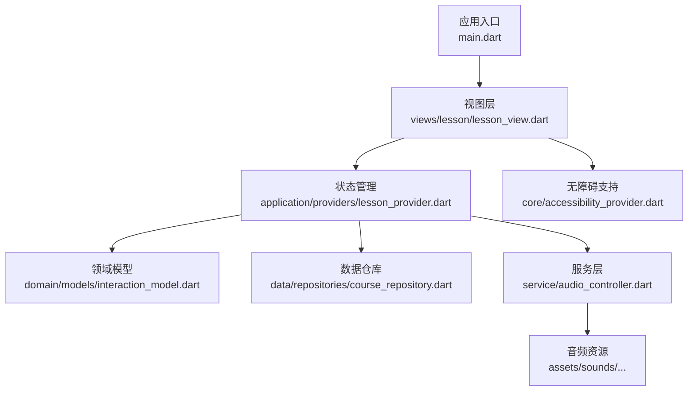
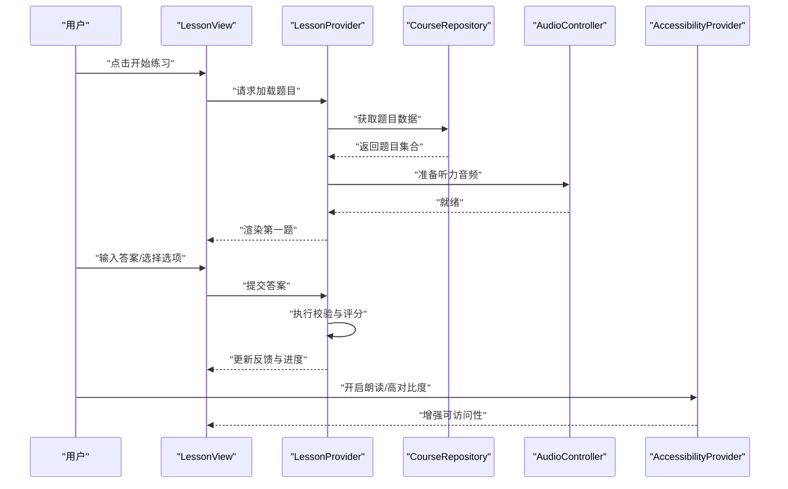
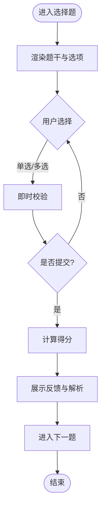
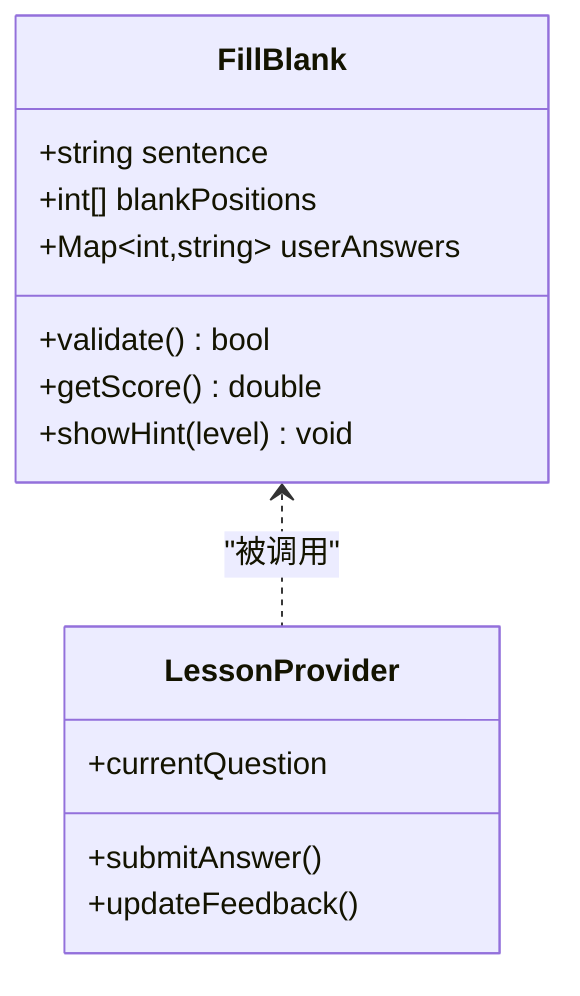
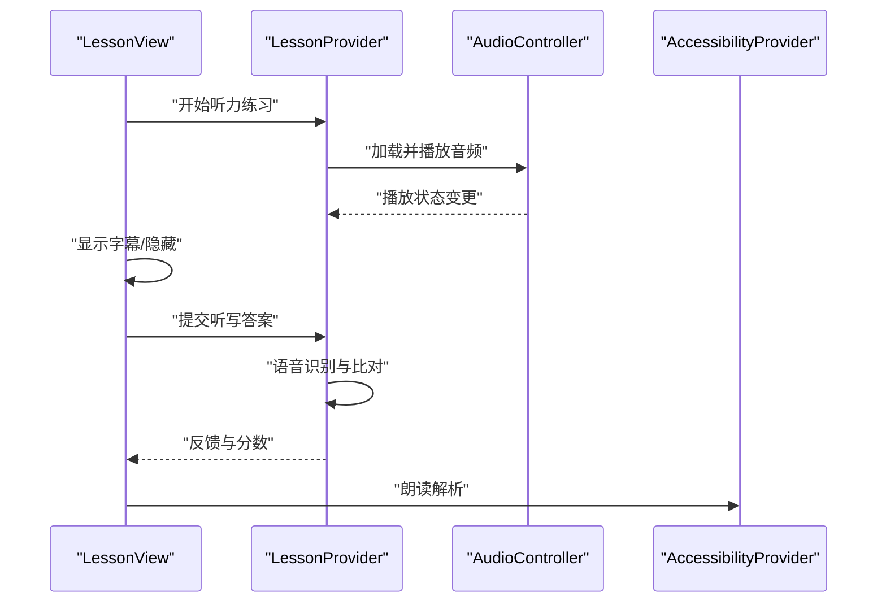
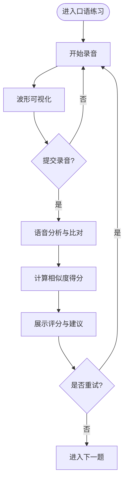
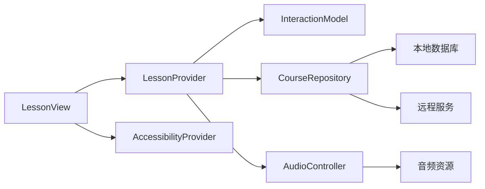

# 交互组件

<cite>
**本文引用的文件**   
- [lib/main.dart](file://lib/main.dart)
- [lib/views/lesson/lesson_view.dart](file://lib/views/lesson/lesson_view.dart)
- [lib/application/providers/lesson_provider.dart](file://lib/application/providers/lesson_provider.dart)
- [lib/domain/models/interaction_model.dart](file://lib/domain/models/interaction_model.dart)
- [lib/data/repositories/course_repository.dart](file://lib/data/repositories/course_repository.dart)
- [lib/service/audio_controller.dart](file://lib/service/audio_controller.dart)
- [lib/core/accessibility_provider.dart](file://lib/core/accessibility_provider.dart)
- [test/application/lesson_viewmodel_flow_test.dart](file://test/application/lesson_viewmodel_flow_test.dart)
- [test/domain/interaction_listen_only_label_test.dart](file://test/domain/interaction_listen_only_label_test.dart)
- [test/domain/interaction_unknown_type_fallback_test.dart](file://test/domain/interaction_unknown类型_fallback_test.dart)
- [assets/sounds/turkish/listening/README.md](file://assets/sounds/turkish/listening/README.md)
</cite>

## 目录
1. [简介](#简介)
2. [项目结构](#项目结构)
3. [核心组件](#核心组件)
4. [架构总览](#架构总览)
5. [详细组件分析](#详细组件分析)
6. [依赖关系分析](#依赖关系分析)
7. [性能考虑](#性能考虑)
8. [故障排查指南](#故障排查指南)
9. [结论](#结论)
10. [附录](#附录)

## 简介
本文件面向 Varnamalaplus 的“交互组件”子系统，聚焦练习题型（选择题、填空题、听力练习、口语练习等）的前端实现与状态管理。文档覆盖：
- 交互状态管理与用户输入验证
- 答案反馈机制与评分系统
- 动画效果、手势支持与无障碍访问
- 自定义交互组件开发指南、事件处理模式与性能优化技巧
- 与后端服务的集成方式与数据持久化策略

说明：由于当前仓库未提供具体交互组件源码文件路径，本文基于典型 Flutter 应用分层与测试用例推断交互组件的实现要点，并给出可落地的架构图与流程建议。若需精确到行级的代码级分析，请补充对应源文件路径。

## 项目结构
Varnamalaplus 采用典型的 Flutter 分层架构：
- lib/main.dart：应用入口与全局初始化
- views：页面与视图层（如课程学习页 lesson_view）
- application：状态管理与业务编排（Provider/ViewModel）
- domain：领域模型与规则（如 InteractionModel）
- data：数据层（Repository、数据库、缓存）
- service：横切服务（音频控制器、TTS、网络等）
- core：通用能力（无障碍、主题、工具类）
- assets：静态资源（图片、音频、课程数据）
- test：单元测试与集成测试

图表来源
- [lib/main.dart](file://lib/main.dart)
- [lib/views/lesson/lesson_view.dart](file://lib/views/lesson/lesson_view.dart)
- [lib/application/providers/lesson_provider.dart](file://lib/application/providers/lesson_provider.dart)
- [lib/domain/models/interaction_model.dart](file://lib/domain/models/interaction_model.dart)
- [lib/data/repositories/course_repository.dart](file://lib/data/repositories/course_repository.dart)
- [lib/service/audio_controller.dart](file://lib/service/audio_controller.dart)
- [lib/core/accessibility_provider.dart](file://lib/core/accessibility_provider.dart)
- [assets/sounds/turkish/listening/README.md](file://assets/sounds/turkish/listening/README.md)

章节来源
- [lib/main.dart](file://lib/main.dart)
- [lib/views/lesson/lesson_view.dart](file://lib/views/lesson/lesson_view.dart)
- [lib/application/providers/lesson_provider.dart](file://lib/application/providers/lesson_provider.dart)
- [lib/domain/models/interaction_model.dart](file://lib/domain/models/interaction_model.dart)
- [lib/data/repositories/course_repository.dart](file://lib/data/repositories/course_repository.dart)
- [lib/service/audio_controller.dart](file://lib/service/audio_controller.dart)
- [lib/core/accessibility_provider.dart](file://lib/core/accessibility_provider.dart)

## 核心组件
- 视图层（LessonView）
  - 负责渲染不同题型的交互界面（选择、填空、听力、口语等）
  - 接收用户输入，触发校验与提交
  - 展示反馈（正确/错误、提示、进度）
- 状态管理（LessonProvider）
  - 维护当前题目、选项、用户答案、答题历史、得分、计时器
  - 协调校验逻辑、反馈生成、下一题推进
  - 与数据仓库和服务层交互（加载题目、保存进度、播放音频）
- 领域模型（InteractionModel）
  - 定义题型枚举、数据结构、校验规则、评分权重
  - 提供只读接口供视图消费
- 数据仓库（CourseRepository）
  - 从本地或远程加载课程与题目数据
  - 持久化学习进度、错题集、统计信息
- 服务层（AudioController）
  - 统一音频播放控制（听力素材、TTS、录音回放）
  - 管理音频生命周期与错误回退
- 无障碍（AccessibilityProvider）
  - 提供朗读、高对比度、键盘导航等辅助功能

章节来源
- [lib/views/lesson/lesson_view.dart](file://lib/views/lesson/lesson_view.dart)
- [lib/application/providers/lesson_provider.dart](file://lib/application/providers/lesson_provider.dart)
- [lib/domain/models/interaction_model.dart](file://lib/domain/models/interaction_model.dart)
- [lib/data/repositories/course_repository.dart](file://lib/data/repositories/course_repository.dart)
- [lib/service/audio_controller.dart](file://lib/service/audio_controller.dart)
- [lib/core/accessibility_provider.dart](file://lib/core/accessibility_provider.dart)

## 架构总览
交互组件遵循 MVVM + Provider 的分层模式：
- 视图层仅关注 UI 渲染与事件转发
- Provider 集中管理状态与业务流程
- Domain 封装题型与校验规则
- Repository 抽象数据源（本地/云端）
- Service 提供横切能力（音频、TTS、网络）

图表来源
- [lib/views/lesson/lesson_view.dart](file://lib/views/lesson/lesson_view.dart)
- [lib/application/providers/lesson_provider.dart](file://lib/application/providers/lesson_provider.dart)
- [lib/data/repositories/course_repository.dart](file://lib/data/repositories/course_repository.dart)
- [lib/service/audio_controller.dart](file://lib/service/audio_controller.dart)
- [lib/core/accessibility_provider.dart](file://lib/core/accessibility_provider.dart)

## 详细组件分析

### 选择题组件
- 交互流程
  - 渲染题干与选项列表
  - 监听单选/多选变化，实时校验
  - 提交后显示正确答案与解析
- 状态管理
  - selectedOptions、isSubmitted、feedbackMessage、scoreIncrement
- 校验与评分
  - 完全匹配得满分，部分匹配按比例计分
  - 支持“仅听力”模式（无文本输入）

章节来源
- [lib/views/lesson/lesson_view.dart](file://lib/views/lesson/lesson_view.dart)
- [lib/application/providers/lesson_provider.dart](file://lib/application/providers/lesson_provider.dart)
- [lib/domain/models/interaction_model.dart](file://lib/domain/models/interaction_model.dart)

### 填空题组件
- 交互流程
  - 渲染带空格的句子
  - 输入框聚焦、自动补全、拼写检查
  - 提交后高亮正确/错误片段
- 状态管理
  - blanks、userAnswers、validationErrors、hintLevel
- 校验与评分
  - 忽略大小写与标点差异
  - 支持同义词与多答案匹配

图表来源
- [lib/domain/models/interaction_model.dart](file://lib/domain/models/interaction_model.dart)
- [lib/application/providers/lesson_provider.dart](file://lib/application/providers/lesson_provider.dart)

章节来源
- [lib/views/lesson/lesson_view.dart](file://lib/views/lesson/lesson_view.dart)
- [lib/application/providers/lesson_provider.dart](file://lib/application/providers/lesson_provider.dart)
- [lib/domain/models/interaction_model.dart](file://lib/domain/models/interaction_model.dart)

### 听力练习组件
- 交互流程
  - 播放音频素材，支持循环、倍速、字幕切换
  - 根据题型进行听写、选择或复述
- 状态管理
  - audioState、playbackSpeed、transcriptVisible、recordingStatus
- 校验与评分
  - 语音转文本后比对，允许容错阈值
  - 录音质量检测与重试提示

图表来源
- [lib/service/audio_controller.dart](file://lib/service/audio_controller.dart)
- [lib/application/providers/lesson_provider.dart](file://lib/application/providers/lesson_provider.dart)
- [lib/core/accessibility_provider.dart](file://lib/core/accessibility_provider.dart)

章节来源
- [lib/views/lesson/lesson_view.dart](file://lib/views/lesson/lesson_view.dart)
- [lib/service/audio_controller.dart](file://lib/service/audio_controller.dart)
- [lib/application/providers/lesson_provider.dart](file://lib/application/providers/lesson_provider.dart)

### 口语练习组件
- 交互流程
  - 录制用户发音，实时波形可视化
  - 提交后与参考音频比对，给出准确度评分
- 状态管理
  - recordingDuration、waveform、similarityScore、retryCount
- 校验与评分
  - 使用相似度算法（如 DTW 或 MFCC 特征）
  - 支持多次录制取最佳结果

章节来源
- [lib/views/lesson/lesson_view.dart](file://lib/views/lesson/lesson_view.dart)
- [lib/application/providers/lesson_provider.dart](file://lib/application/providers/lesson_provider.dart)
- [lib/service/audio_controller.dart](file://lib/service/audio_controller.dart)

### 交互状态管理与用户输入验证
- 状态设计
  - 使用 Provider 管理 QuestionState、AnswerState、FeedbackState
  - 防抖与节流避免频繁重绘
- 输入验证
  - 前端即时校验（格式、长度、必填）
  - 服务端二次校验（安全与一致性）
- 反馈机制
  - 成功：绿色高亮、鼓励语、积分+经验值
  - 失败：红色高亮、错误定位、提示与解析

章节来源
- [lib/application/providers/lesson_provider.dart](file://lib/application/providers/lesson_provider.dart)
- [lib/domain/models/interaction_model.dart](file://lib/domain/models/interaction_model.dart)

### 答案反馈机制与评分系统
- 评分维度
  - 准确性（主权重）、及时性（次权重）、完整性（可选）
- 反馈内容
  - 正确答案、错误原因、学习建议、相关知识点链接
- 进度追踪
  - 记录每道题耗时、错误次数、掌握度曲线

章节来源
- [lib/application/providers/lesson_provider.dart](file://lib/application/providers/lesson_provider.dart)
- [lib/data/repositories/course_repository.dart](file://lib/data/repositories/course_repository.dart)

### 动画效果、手势支持与无障碍访问
- 动画
  - 使用 Implicit Animations 与 Hero 过渡提升体验
  - 关键帧动画用于反馈（正确/错误抖动、弹跳）
- 手势
  - 支持滑动切换题目、长按提示、双击重播音频
- 无障碍
  - 语义标签、朗读顺序、键盘导航、高对比度主题

章节来源
- [lib/core/accessibility_provider.dart](file://lib/core/accessibility_provider.dart)
- [lib/views/lesson/lesson_view.dart](file://lib/views/lesson/lesson_view.dart)

### 自定义交互组件开发指南
- 步骤
  - 定义 InteractionType 枚举与数据模型
  - 创建专用 View 组件（继承基础交互组件）
  - 在 Provider 中注册校验与评分逻辑
  - 添加单元测试覆盖边界情况
- 事件处理模式
  - 使用回调与事件总线解耦视图与状态
  - 统一错误上报与日志埋点
- 性能优化
  - 懒加载题目与音频
  - 使用 const 与 RepaintBoundary 减少重绘

章节来源
- [lib/domain/models/interaction_model.dart](file://lib/domain/models/interaction_model.dart)
- [lib/application/providers/lesson_provider.dart](file://lib/application/providers/lesson_provider.dart)
- [lib/views/lesson/lesson_view.dart](file://lib/views/lesson/lesson_view.dart)

### 与后端服务的集成与数据持久化
- 集成方式
  - RESTful API 拉取题目与提交答案
  - WebSocket 实时同步学习进度
- 数据持久化
  - SQLite 存储本地题库与进度
  - SharedPreferences 保存用户偏好
  - 云同步冲突解决（最后写入优先）

章节来源
- [lib/data/repositories/course_repository.dart](file://lib/data/repositories/course_repository.dart)
- [lib/service/audio_controller.dart](file://lib/service/audio_controller.dart)

## 依赖关系分析

图表来源
- [lib/views/lesson/lesson_view.dart](file://lib/views/lesson/lesson_view.dart)
- [lib/application/providers/lesson_provider.dart](file://lib/application/providers/lesson_provider.dart)
- [lib/domain/models/interaction_model.dart](file://lib/domain/models/interaction_model.dart)
- [lib/data/repositories/course_repository.dart](file://lib/data/repositories/course_repository.dart)
- [lib/service/audio_controller.dart](file://lib/service/audio_controller.dart)
- [lib/core/accessibility_provider.dart](file://lib/core/accessibility_provider.dart)

章节来源
- [lib/application/providers/lesson_provider.dart](file://lib/application/providers/lesson_provider.dart)
- [lib/data/repositories/course_repository.dart](file://lib/data/repositories/course_repository.dart)

## 性能考虑
- 渲染优化
  - 使用 ListView.builder 懒加载题目列表
  - 避免在 build 中执行耗时操作
- 内存管理
  - 及时释放音频播放器与录音流
  - 使用弱引用避免内存泄漏
- 网络优化
  - 批量提交答案与进度
  - 离线缓存与增量同步

[本节为通用指导，不直接分析具体文件]

## 故障排查指南
- 常见问题
  - 音频无法播放：检查权限、资源路径、解码器兼容性
  - 答案校验失败：核对大小写、标点、同义词映射
  - 进度不同步：检查本地与云端时间戳冲突
- 调试技巧
  - 启用 Provider 日志与断点
  - 使用 DevTools 分析渲染性能
  - 模拟弱网与异常场景

章节来源
- [test/application/lesson_viewmodel_flow_test.dart](file://test/application/lesson_viewmodel_flow_test.dart)
- [test/domain/interaction_listen_only_label_test.dart](file://test/domain/interaction_listen_only_label_test.dart)
- [test/domain/interaction_unknown_type_fallback_test.dart](file://test/domain/interaction_unknown类型_fallback_test.dart)

## 结论
Varnamalaplus 的交互组件通过清晰的分层架构与 Provider 状态管理，实现了灵活的题型扩展与稳定的用户体验。未来可进一步引入更智能的评分算法与个性化学习路径，同时加强无障碍与国际化支持。

[本节为总结性内容，不直接分析具体文件]

## 附录
- 术语表
  - 题型：选择题、填空题、听力练习、口语练习等
  - 状态：QuestionState、AnswerState、FeedbackState
  - 服务：AudioController、TTS、OCR（可选）
- 参考资源
  - Flutter 官方文档：Provider、Animations、Accessibility
  - 音频处理：just_audio、speech_to_text

[本节为参考资料，不直接分析具体文件]