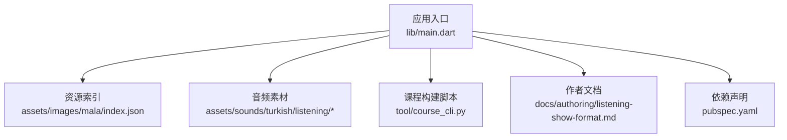
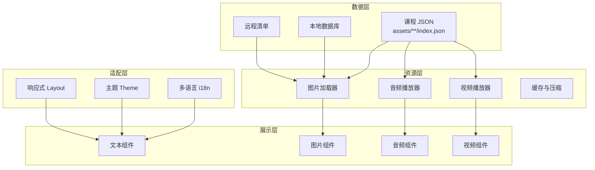
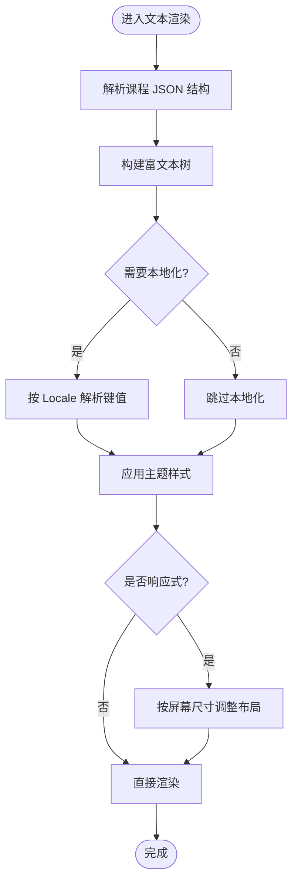
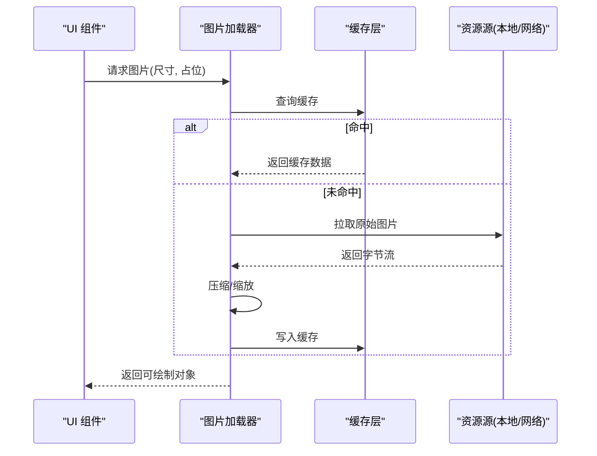
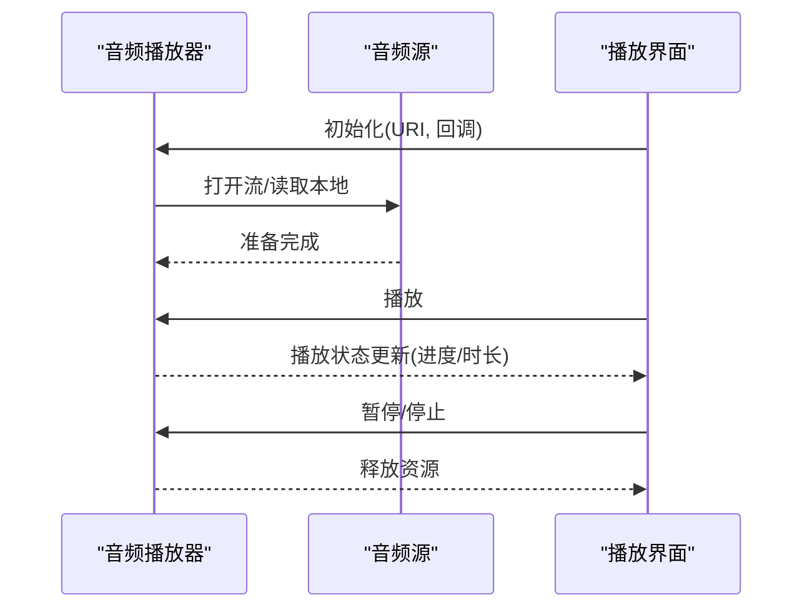
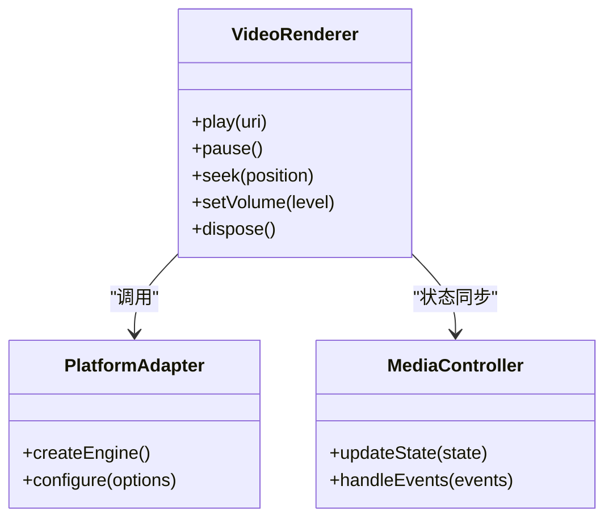
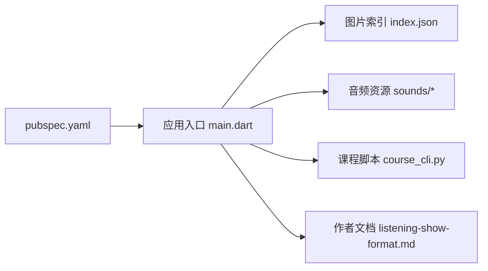

# 展示组件

<cite>
**本文引用的文件**   
- [lib/main.dart](file://lib/main.dart)
- [pubspec.yaml](file://pubspec.yaml)
- [assets/images/mala/index.json](file://assets/images/mala/index.json)
- [assets/sounds/turkish/listening/README.md](file://assets/sounds/turkish/listening/README.md)
- [docs/authoring/listening-show-format.md](file://docs/authoring/listening-show-format.md)
- [tool/course_cli.py](file://tool/course_cli.py)
</cite>

## 目录
1. [简介](#简介)
2. [项目结构](#项目结构)
3. [核心组件](#核心组件)
4. [架构总览](#架构总览)
5. [详细组件分析](#详细组件分析)
6. [依赖关系分析](#依赖关系分析)
7. [性能考量](#性能考量)
8. [故障排查指南](#故障排查指南)
9. [结论](#结论)
10. [附录](#附录)

## 简介
本文件面向 Varnamalaplus 的“展示组件”体系，聚焦文本显示、图片加载、音频播放与视频渲染等基础能力，并覆盖内容格式化、多语言支持、主题适配与响应式设计。同时给出懒加载、缓存策略、内存优化与图片压缩等技术实现建议，提供自定义展示组件的开发规范、样式定制方法与性能监控方案，并说明与内容管理系统的集成和数据更新机制。

## 项目结构
Varnamalaplus 采用 Flutter 跨平台工程组织，资源与代码分层清晰：
- lib：应用逻辑与视图层（入口、路由、服务、领域模型、数据访问等）
- assets：课程素材（图片、音频、JSON 索引等）
- docs：作者与工具文档（含听写展示格式等）
- tool：课程构建与处理脚本（CLI）
- 各平台目录（android/ios/web/windows/linux/macos）：平台适配与打包配置

图表来源 
- [lib/main.dart](file://lib/main.dart)
- [assets/images/mala/index.json](file://assets/images/mala/index.json)
- [assets/sounds/turkish/listening/README.md](file://assets/sounds/turkish/listening/README.md)
- [tool/course_cli.py](file://tool/course_cli.py)
- [docs/authoring/listening-show-format.md](file://docs/authoring/listening-show-format.md)
- [pubspec.yaml](file://pubspec.yaml)

章节来源
- [lib/main.dart](file://lib/main.dart)
- [pubspec.yaml](file://pubspec.yaml)

## 核心组件
围绕“展示组件”，本项目涉及以下关键能力与资源：
- 文本显示与格式化：通过 Flutter 文本组件与本地化包实现多语言与样式；结合课程 JSON 中的结构化内容进行排版。
- 图片加载与压缩：使用 assets 索引与网络图片加载器，配合尺寸裁剪与缓存策略。
- 音频播放：基于 assets 或网络音频流，提供播放控制与状态同步。
- 视频渲染：在支持的平台上使用原生播放器封装，统一交互与生命周期管理。
- 多语言与主题：通过本地化键值与主题数据源驱动 UI 表现。
- 响应式布局：按屏幕尺寸与方向动态调整布局与媒体大小。

章节来源
- [pubspec.yaml](file://pubspec.yaml)
- [assets/images/mala/index.json](file://assets/images/mala/index.json)
- [assets/sounds/turkish/listening/README.md](file://assets/sounds/turkish/listening/README.md)
- [docs/authoring/listening-show-format.md](file://docs/authoring/listening-show-format.md)

## 架构总览
展示组件整体遵循“数据驱动 + 资源抽象 + 平台适配”的分层设计：
- 数据层：课程 JSON、索引文件、本地数据库与远程资源清单
- 资源层：图片、音频、视频的统一获取与缓存
- 展示层：文本、图片、音频、视频的通用组件与组合
- 适配层：多语言、主题、响应式布局与平台差异

图表来源 
- [assets/images/mala/index.json](file://assets/images/mala/index.json)
- [assets/sounds/turkish/listening/README.md](file://assets/sounds/turkish/listening/README.md)
- [docs/authoring/listening-show-format.md](file://docs/authoring/listening-show-format.md)

## 详细组件分析

### 文本显示与内容格式化
- 数据来源：课程 JSON 中定义段落、标题、列表、链接等结构；本地化键值用于文案切换。
- 格式化策略：将结构化数据转换为富文本树，按层级渲染；对特殊标记（如音标、高亮）进行样式映射。
- 多语言支持：根据当前 Locale 选择对应文案；未命中时回退到默认语言。
- 主题适配：字体、字号、行距、颜色由主题数据源注入，支持明暗模式。
- 响应式：根据屏幕宽度自动换行、调整字号与间距。

章节来源
- [docs/authoring/listening-show-format.md](file://docs/authoring/listening-show-format.md)
- [pubspec.yaml](file://pubspec.yaml)

### 图片加载与压缩
- 资源定位：通过 assets 索引或网络 URL 定位图片；优先使用本地缓存。
- 懒加载：仅在可见区域加载，避免首屏压力。
- 压缩与缩放：按目标尺寸生成缩略图，减少内存占用与解码开销。
- 缓存策略：磁盘缓存与内存缓存结合，设置过期与淘汰策略。
- 错误处理：占位图与重试机制，失败时降级为静态图或提示。

章节来源
- [assets/images/mala/index.json](file://assets/images/mala/index.json)
- [pubspec.yaml](file://pubspec.yaml)

### 音频播放
- 资源来源：本地 assets 或网络流；支持多种格式与码率。
- 播放控制：播放、暂停、进度跳转、音量控制、循环模式。
- 状态同步：与 UI 状态联动，显示播放时长、缓冲进度。
- 后台播放：在支持的平台上保持播放，处理系统中断与耳机事件。
- 错误恢复：网络抖动重连、格式不支持回退。

章节来源
- [assets/sounds/turkish/listening/README.md](file://assets/sounds/turkish/listening/README.md)
- [pubspec.yaml](file://pubspec.yaml)

### 视频渲染
- 渲染引擎：使用平台原生播放器封装，统一 API。
- 生命周期：与页面生命周期绑定，避免后台继续渲染。
- 自适应：根据屏幕尺寸与方向调整画面比例与控件布局。
- 字幕与音轨：可选字幕轨道与多音轨切换。
- 性能：硬件解码优先，软解降级。

章节来源
- [pubspec.yaml](file://pubspec.yaml)

### 多语言与主题适配
- 多语言：集中化管理文案键值，运行时切换 Locale；支持复数与日期时间格式化。
- 主题：定义颜色、字体、阴影等主题变量；支持明暗模式与用户偏好。
- 国际化与本地化：数字、货币、度量单位按地区规则显示。

章节来源
- [pubspec.yaml](file://pubspec.yaml)

### 响应式设计
- 断点策略：小屏单列、中屏双列、大屏网格布局。
- 媒体查询：根据设备像素密度与屏幕尺寸调整图片与字体。
- 交互适配：触摸与鼠标事件统一处理，手势识别优化。

章节来源
- [pubspec.yaml](file://pubspec.yaml)

## 依赖关系分析
- 外部依赖：Flutter SDK、音视频插件、图片加载库、本地化与主题包。
- 内部模块：数据层（课程 JSON/数据库）、资源层（加载器/缓存）、展示层（组件）、适配层（i18n/Theme/Layout）。
- 构建脚本：课程资源预处理、索引生成、音频转码与压缩。

图表来源 
- [pubspec.yaml](file://pubspec.yaml)
- [lib/main.dart](file://lib/main.dart)
- [assets/images/mala/index.json](file://assets/images/mala/index.json)
- [assets/sounds/turkish/listening/README.md](file://assets/sounds/turkish/listening/README.md)
- [tool/course_cli.py](file://tool/course_cli.py)
- [docs/authoring/listening-show-format.md](file://docs/authoring/listening-show-format.md)

章节来源
- [pubspec.yaml](file://pubspec.yaml)
- [tool/course_cli.py](file://tool/course_cli.py)

## 性能考量
- 懒加载：仅加载可视区域内的媒体资源，降低首屏延迟与内存峰值。
- 缓存策略：LRU 内存缓存 + 持久化磁盘缓存；合理设置 TTL 与最大条目数。
- 图片压缩：按需生成缩略图，限制最大分辨率与质量；避免重复解码。
- 音频/视频：优先硬件解码，启用预缓冲；空闲时释放资源。
- 内存优化：及时释放不再使用的图片与媒体实例；避免长生命周期持有大对象。
- 监控指标：FPS、卡顿帧、内存占用、I/O 耗时、网络带宽与错误率。

[本节为通用指导，不直接分析具体文件]

## 故障排查指南
- 图片无法显示：检查路径与权限、网络可达性、缓存损坏；查看日志与占位图是否正确。
- 音频播放失败：确认格式支持、编码参数、权限与后台播放策略；尝试降级码率或格式。
- 视频黑屏或卡顿：检查解码器可用性、硬件加速开关、网络缓冲；必要时切换到软解。
- 多语言缺失：确认键值存在与命名一致；检查 Locale 优先级与回退链。
- 主题异常：验证主题变量定义与覆盖顺序；检查深色模式切换逻辑。

章节来源
- [docs/authoring/listening-show-format.md](file://docs/authoring/listening-show-format.md)
- [assets/sounds/turkish/listening/README.md](file://assets/sounds/turkish/listening/README.md)

## 结论
Varnamalaplus 的展示组件以数据驱动为核心，结合资源抽象与平台适配，实现了文本、图片、音频、视频的统一呈现。通过懒加载、缓存、压缩与监控等手段，确保在多端与多场景下的稳定与高效。遵循本文的开发规范与最佳实践，可快速扩展自定义展示组件并与内容管理系统无缝集成。

[本节为总结，不直接分析具体文件]

## 附录
- 自定义展示组件开发规范
  - 接口契约：输入数据结构、输出渲染结果、事件回调约定
  - 生命周期：创建、挂载、更新、销毁的明确语义
  - 错误边界：捕获异常并提供降级展示
  - 测试策略：单元测试与视觉回归测试
- 样式定制方法
  - 主题变量扩展与覆盖
  - 组件级样式注入与全局样式隔离
  - 响应式断点与媒体查询
- 性能监控方案
  - 埋点采集：渲染耗时、内存峰值、I/O 次数
  - 上报与分析：聚合指标与告警阈值
  - 问题定位：日志级别与采样策略

[本节为补充信息，不直接分析具体文件]