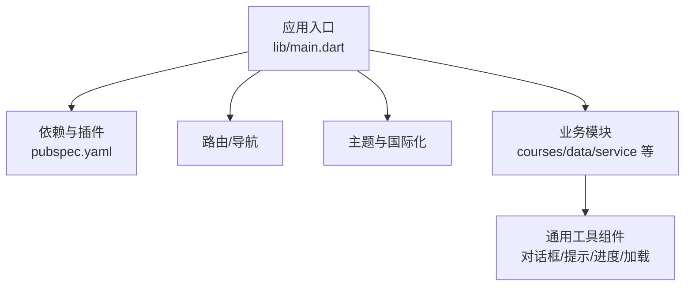
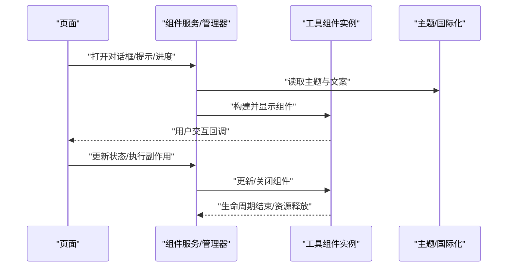
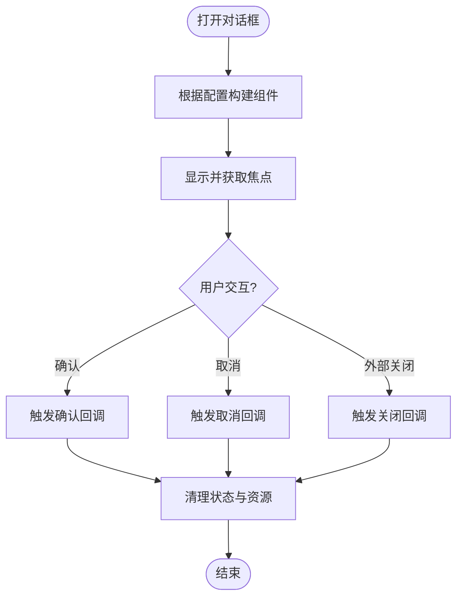
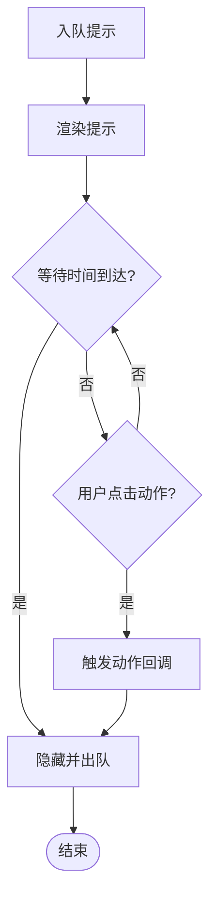
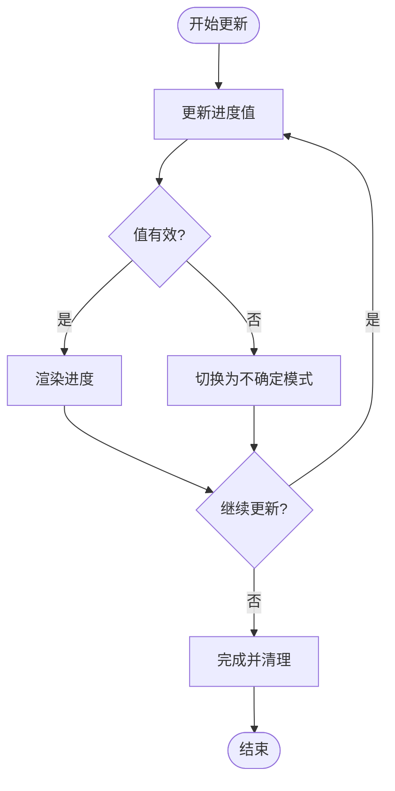
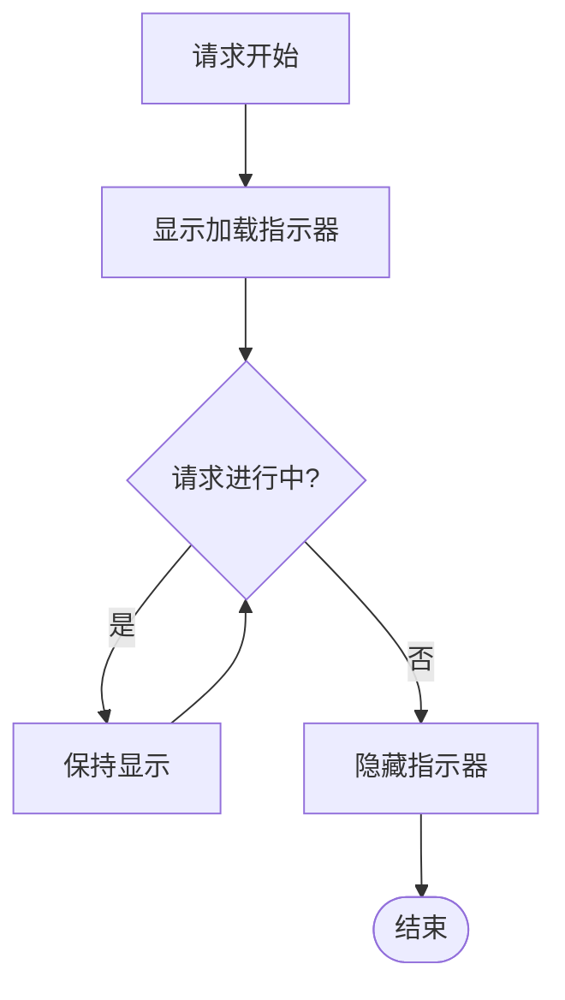
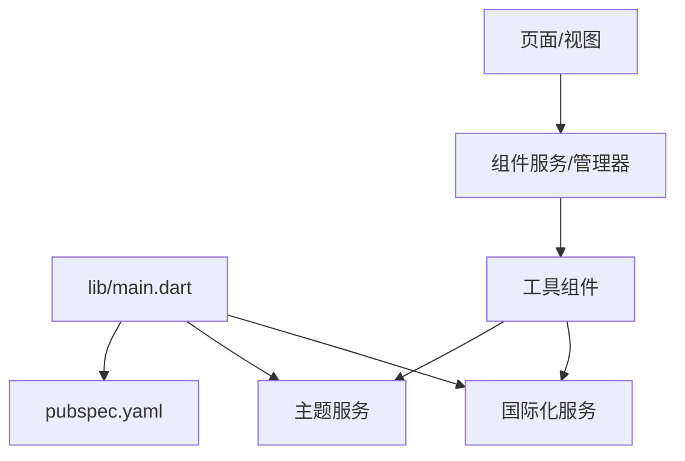

# 工具组件

<cite>
**本文引用的文件**   
- [lib/main.dart](file://lib/main.dart)
- [pubspec.yaml](file://pubspec.yaml)
- [README.md](file://README.md)
</cite>

## 目录
1. [简介](#简介)
2. [项目结构](#项目结构)
3. [核心组件](#核心组件)
4. [架构总览](#架构总览)
5. [详细组件分析](#详细组件分析)
6. [依赖分析](#依赖分析)
7. [性能考虑](#性能考虑)
8. [故障排查指南](#故障排查指南)
9. [结论](#结论)
10. [附录](#附录) 

## 简介
本文件面向 Varnamalaplus 的通用工具类与 UI 组件，聚焦对话框、提示框、进度条、加载指示器等。内容涵盖：
- 配置选项、事件回调与样式定制方法
- 生命周期管理、状态同步与资源清理机制
- 测试策略（Mock 数据生成与单元测试编写）
- 可访问性支持、国际化适配与主题兼容性

说明：当前仓库未包含独立的“工具组件”源码文件。本节基于 Flutter 生态与常见实践给出通用指导，并在需要时引用仓库中的入口与依赖信息以保持一致性。

## 项目结构
Varnamalaplus 为 Flutter 应用，入口位于 lib/main.dart，依赖定义在 pubspec.yaml。UI 层通常由视图与组件构成，工具类多集中于 core 或 shared 目录；但当前仓库中未见明确的工具组件实现文件。因此，本节提供概念性结构与组织建议，便于后续扩展统一的工具组件库。

[无图表来源：该图为概念性结构示意，不直接映射具体源码文件]

## 核心组件
- 对话框（Dialog）
  - 用途：确认操作、表单输入、信息展示
  - 关键配置：标题、内容、按钮集合、是否可取消、遮罩点击行为、动画时长
  - 事件回调：确认/取消、关闭后回调、键盘事件
  - 样式定制：主题色、圆角、阴影、内边距、字体大小
  - 生命周期：创建→显示→交互→关闭→销毁；注意异步任务取消与状态清理
  - 可访问性：语义标签、焦点顺序、屏幕阅读器文本
  - 国际化：文案通过 i18n key 注入
  - 主题兼容：跟随 Material 主题或自定义主题变量

- 提示框（Snackbar/Toast）
  - 用途：轻量反馈、成功/错误/警告提示
  - 关键配置：消息、持续时间、位置、动作按钮
  - 事件回调：点击动作、自动消失回调
  - 样式定制：背景色、文字色、圆角、间距
  - 生命周期：入队→显示→计时→出队；避免频繁叠加导致遮挡
  - 可访问性：announce 文本、无障碍描述
  - 国际化：消息文案本地化
  - 主题兼容：使用主题色板

- 进度条（Linear/Circular Progress）
  - 用途：表示确定/不确定进度
  - 关键配置：值范围、颜色、动画、是否可交互
  - 事件回调：进度变化监听（可选）
  - 样式定制：高度、颜色、轨道色、动画曲线
  - 生命周期：启动→更新→完成；确保异常时回退到不确定模式
  - 可访问性：aria 角色与数值描述
  - 国际化：无需文案
  - 主题兼容：遵循主题色

- 加载指示器（Loading Indicator）
  - 用途：全局或局部加载态
  - 关键配置：类型（旋转/骨架屏）、层级、透明度
  - 事件回调：开始/结束回调
  - 样式定制：尺寸、颜色、动画
  - 生命周期：请求前开启→请求后关闭；需处理并发与取消
  - 可访问性：告知加载状态
  - 国际化：无需文案
  - 主题兼容：跟随主题

[无章节来源：本节为通用组件说明，不直接分析具体源码文件]

## 架构总览
下图展示工具组件在应用中的典型调用链与职责边界：页面触发→组件服务→UI 渲染→事件回调→状态同步。

[无图表来源：该图为概念性流程示意，不直接映射具体源码文件]

## 详细组件分析

### 对话框组件
- 配置项
  - 标题、正文、按钮列表、是否可取消、遮罩行为、动画参数
- 事件回调
  - onConfirm、onCancel、onDismiss、keyboardHandler
- 样式定制
  - 使用主题变量覆盖颜色、圆角、阴影、字号
- 生命周期与状态同步
  - 创建→挂载→交互→卸载；确保异步任务取消与状态重置
- 可访问性与国际化
  - 设置 role、label、hint；文案走 i18n key
- 主题兼容性
  - 优先使用主题色板，避免硬编码颜色

[无图表来源：该图为概念性流程图，不直接映射具体源码文件]

### 提示框组件
- 配置项
  - 消息、持续时间、位置、动作按钮
- 事件回调
  - onTapAction、onAutoHide
- 样式定制
  - 背景、文字、圆角、间距
- 生命周期
  - 入队→显示→计时→出队；避免堆叠过多
- 可访问性与国际化
  - announce 文本、本地化文案

[无图表来源：该图为概念性流程图，不直接映射具体源码文件]

### 进度条组件
- 配置项
  - 值范围、颜色、动画、是否可交互
- 事件回调
  - onProgressChange（可选）
- 样式定制
  - 高度、颜色、轨道色、动画曲线
- 生命周期
  - 启动→更新→完成；异常回退到不确定模式
- 可访问性与国际化
  - aria 角色与数值描述；无需文案

[无图表来源：该图为概念性流程图，不直接映射具体源码文件]

### 加载指示器组件
- 配置项
  - 类型、层级、透明度
- 事件回调
  - onStart、onEnd
- 样式定制
  - 尺寸、颜色、动画
- 生命周期
  - 请求前开启→请求后关闭；处理并发与取消
- 可访问性与国际化
  - 告知加载状态；无需文案

[无图表来源：该图为概念性流程图，不直接映射具体源码文件]

## 依赖分析
- 入口与依赖
  - 应用入口：lib/main.dart
  - 依赖声明：pubspec.yaml
- 建议的依赖关系
  - 工具组件依赖主题与国际化服务
  - 页面通过组件服务调用工具组件
  - 避免组件间直接耦合，统一通过服务/管理器协调

[无图表来源：该图为概念性依赖图，不直接映射具体源码文件]

## 性能考虑
- 避免重复创建：复用组件实例或使用单例管理器
- 减少重绘：按需更新状态，避免全量重建
- 动画优化：合理设置时长与帧率，必要时降级
- 内存管理：及时取消异步任务，释放资源
- 并发控制：限制同时显示的提示数量，防止遮挡

[无章节来源：本节为通用性能建议，不直接分析具体源码文件]

## 故障排查指南
- 常见问题
  - 对话框无法关闭：检查遮罩点击与键盘事件处理
  - 提示堆叠过多：限制队列长度与显示上限
  - 进度卡住：异常分支回退到不确定模式
  - 加载指示器未隐藏：确保所有路径都触发结束回调
- 调试技巧
  - 打印生命周期日志（创建/显示/关闭）
  - 使用 Mock 数据模拟不同状态
  - 断言关键回调是否被调用

[无章节来源：本节为通用排障建议，不直接分析具体源码文件]

## 结论
在当前仓库中未发现独立的工具组件源码。上述文档基于 Flutter 生态与通用实践，提供了对话框、提示框、进度条、加载指示器的配置、事件、样式、生命周期、测试、可访问性、国际化与主题兼容性的完整指导。建议在项目中建立统一的工具组件目录与服务层，集中管理与复用。

[无章节来源：本节为总结性内容，不直接分析具体源码文件]

## 附录
- 入口与依赖参考
  - 应用入口：lib/main.dart
  - 依赖声明：pubspec.yaml
  - 项目说明：README.md

[无章节来源：本节为参考信息，不直接分析具体源码文件]