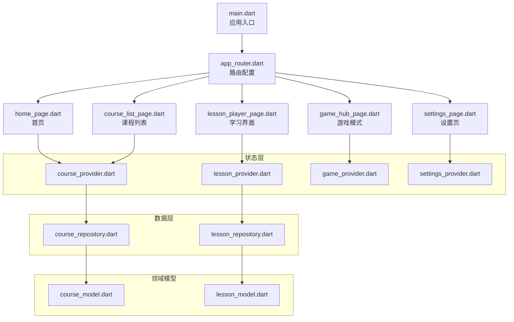
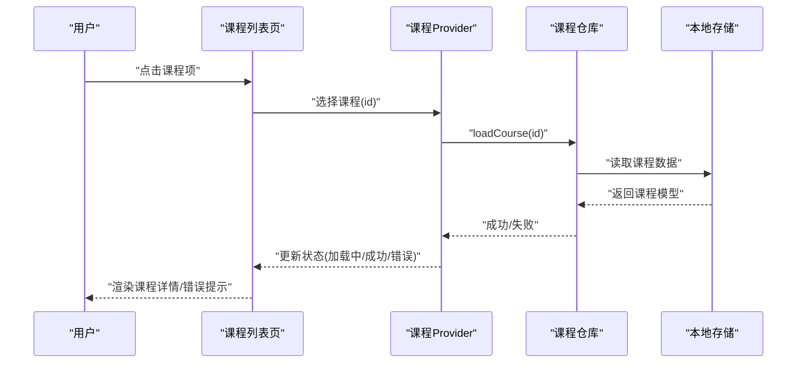
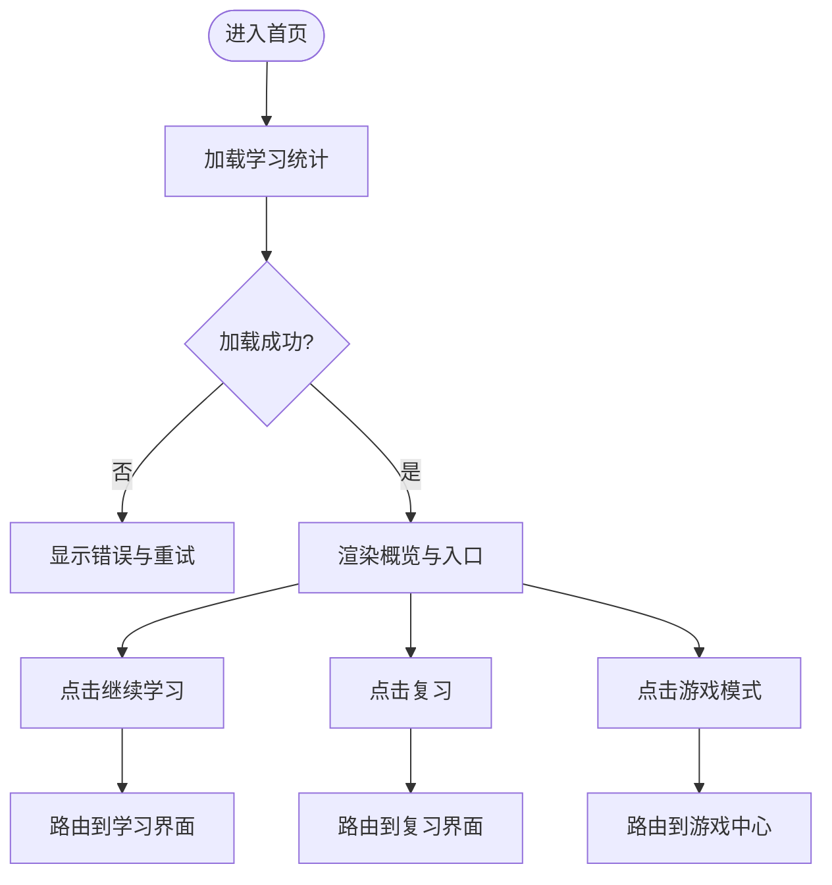
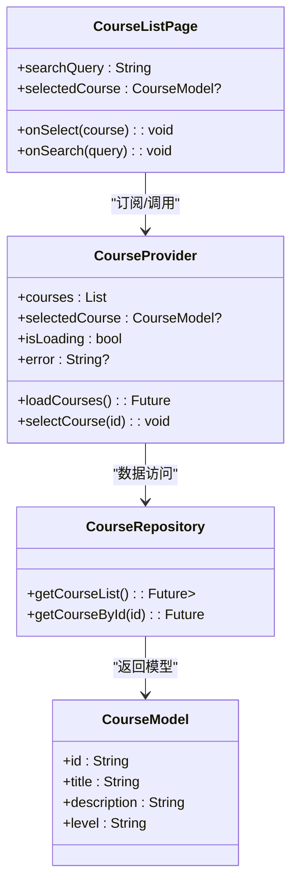
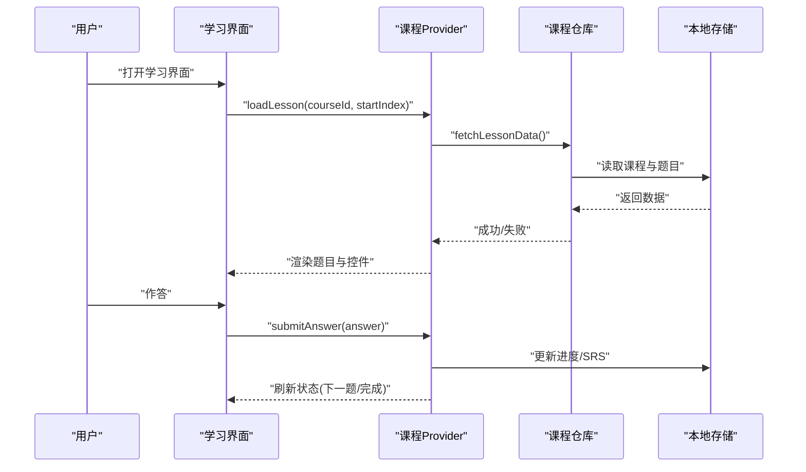
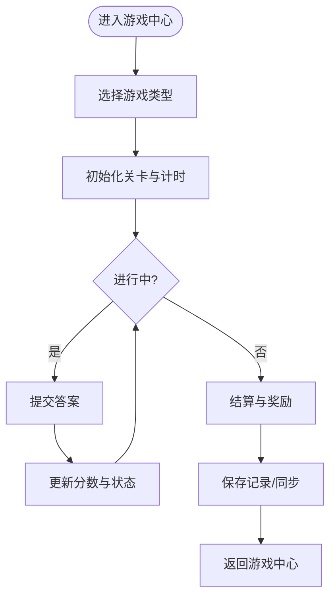
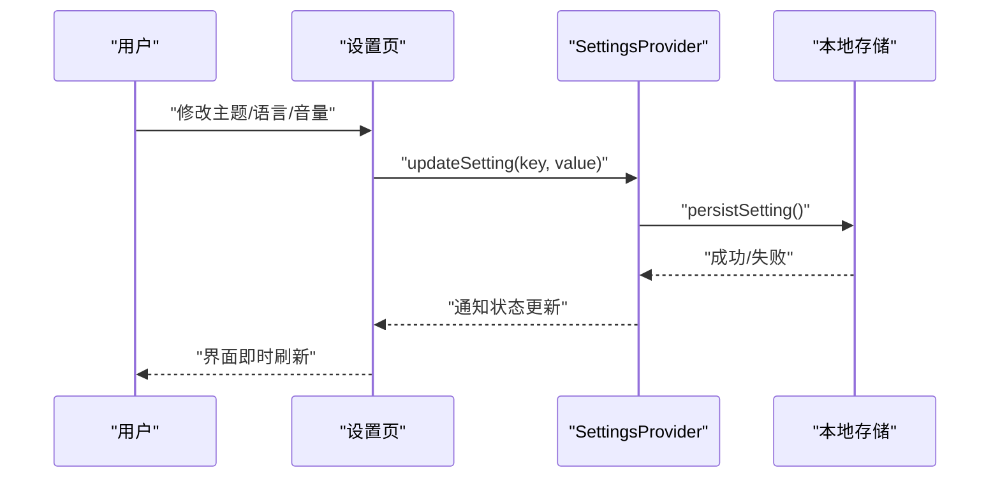
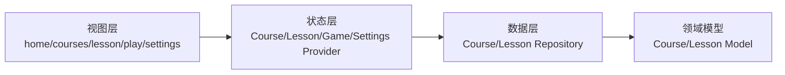

# 页面组件

<cite>
**本文引用的文件**   
- [lib/main.dart](file://lib/main.dart)
- [lib/routing/app_router.dart](file://lib/routing/app_router.dart)
- [lib/views/home/home_page.dart](file://lib/views/home/home_page.dart)
- [lib/views/courses/course_list_page.dart](file://lib/views/courses/course_list_page.dart)
- [lib/views/lesson/lesson_player_page.dart](file://lib/views/lesson/lesson_player_page.dart)
- [lib/views/play/game_hub_page.dart](file://lib/views/play/game_hub_page.dart)
- [lib/views/settings/settings_page.dart](file://lib/views/settings/settings_page.dart)
- [lib/application/providers/course_provider.dart](file://lib/application/providers/course_provider.dart)
- [lib/application/providers/lesson_provider.dart](file://lib/application/providers/lesson_provider.dart)
- [lib/application/providers/game_provider.dart](file://lib/application/providers/game_provider.dart)
- [lib/application/providers/settings_provider.dart](file://lib/application/providers/settings_provider.dart)
- [lib/data/repository/course_repository.dart](file://lib/data/repository/course_repository.dart)
- [lib/data/repository/lesson_repository.dart](file://lib/data/repository/lesson_repository.dart)
- [lib/domain/models/course_model.dart](file://lib/domain/models/course_model.dart)
- [lib/domain/models/lesson_model.dart](file://lib/domain/models/lesson_model.dart)
</cite>

## 目录
1. [简介](#简介)
2. [项目结构](#项目结构)
3. [核心组件](#核心组件)
4. [架构总览](#架构总览)
5. [详细组件分析](#详细组件分析)
6. [依赖分析](#依赖分析)
7. [性能考虑](#性能考虑)
8. [故障排查指南](#故障排查指南)
9. [结论](#结论)
10. [附录](#附录)

## 简介
本文件面向 Varnamalaplus 的页面组件，系统性说明首页、课程管理、学习界面、游戏模式与设置页面的架构设计、功能模块、状态管理与用户交互流程。文档涵盖路由配置、数据流处理、错误处理机制，以及页面复用模式、性能优化策略与响应式布局实现，并解释页面间导航逻辑、参数传递与数据同步机制。

## 项目结构
Varnamalaplus 采用分层与按职责划分的组织方式：
- lib/main.dart：应用入口，初始化全局依赖、主题、路由与根页面。
- lib/routing：集中式路由定义与守卫（如课程就绪守卫）。
- lib/views：页面级 UI 组件，按功能域划分 home、courses、lesson、play、settings。
- lib/application：业务状态与控制器（Provider），负责页面状态与跨页面共享数据。
- lib/data：数据访问层（Repository），封装本地存储与资源加载。
- lib/domain：领域模型与规则（Course、Lesson 等）。

图表来源
- [lib/main.dart:1-120](file://lib/main.dart#L1-L120)
- [lib/routing/app_router.dart:1-200](file://lib/routing/app_router.dart#L1-L200)
- [lib/views/home/home_page.dart:1-150](file://lib/views/home/home_page.dart#L1-L150)
- [lib/views/courses/course_list_page.dart:1-200](file://lib/views/courses/course_list_page.dart#L1-L200)
- [lib/views/lesson/lesson_player_page.dart:1-250](file://lib/views/lesson/lesson_player_page.dart#L1-L250)
- [lib/views/play/game_hub_page.dart:1-180](file://lib/views/play/game_hub_page.dart#L1-L180)
- [lib/views/settings/settings_page.dart:1-160](file://lib/views/settings/settings_page.dart#L1-L160)
- [lib/application/providers/course_provider.dart:1-200](file://lib/application/providers/course_provider.dart#L1-L200)
- [lib/application/providers/lesson_provider.dart:1-220](file://lib/application/providers/lesson_provider.dart#L1-L220)
- [lib/application/providers/game_provider.dart:1-180](file://lib/application/providers/game_provider.dart#L1-L180)
- [lib/application/providers/settings_provider.dart:1-150](file://lib/application/providers/settings_provider.dart#L1-L150)
- [lib/data/repository/course_repository.dart:1-200](file://lib/data/repository/course_repository.dart#L1-L200)
- [lib/data/repository/lesson_repository.dart:1-200](file://lib/data/repository/lesson_repository.dart#L1-L200)
- [lib/domain/models/course_model.dart:1-120](file://lib/domain/models/course_model.dart#L1-L120)
- [lib/domain/models/lesson_model.dart:1-150](file://lib/domain/models/lesson_model.dart#L1-L150)

章节来源
- [lib/main.dart:1-120](file://lib/main.dart#L1-L120)
- [lib/routing/app_router.dart:1-200](file://lib/routing/app_router.dart#L1-L200)

## 核心组件
- 首页（Home）：展示学习概览、快速入口（继续学习、复习、游戏）、统计摘要与推荐课程。
- 课程管理（Courses）：课程列表、筛选与搜索、进入课程详情或开始学习。
- 学习界面（Lesson Player）：逐题播放、交互答题、进度与反馈、SRS 复习触发。
- 游戏模式（Game Hub）：多种小游戏入口、排行榜、成绩记录与分享。
- 设置页（Settings）：语言、主题、音频引擎、提醒与隐私选项。

这些页面通过 Provider 管理状态，并通过 Repository 访问数据，遵循清晰的单向数据流。

章节来源
- [lib/views/home/home_page.dart:1-150](file://lib/views/home/home_page.dart#L1-L150)
- [lib/views/courses/course_list_page.dart:1-200](file://lib/views/courses/course_list_page.dart#L1-L200)
- [lib/views/lesson/lesson_player_page.dart:1-250](file://lib/views/lesson/lesson_player_page.dart#L1-L250)
- [lib/views/play/game_hub_page.dart:1-180](file://lib/views/play/game_hub_page.dart#L1-L180)
- [lib/views/settings/settings_page.dart:1-160](file://lib/views/settings/settings_page.dart#L1-L160)

## 架构总览
应用采用“视图-状态-数据”三层分离：
- 视图层（Views）：纯 UI 组件，订阅 Provider 状态变化，响应用户交互。
- 状态层（Application Providers）：封装业务逻辑与副作用，暴露可观察状态。
- 数据层（Repositories）：统一数据源（本地数据库、文件系统、网络），提供异步 API。
- 领域层（Domain Models）：不可变数据模型与校验规则。

图表来源
- [lib/views/courses/course_list_page.dart:1-200](file://lib/views/courses/course_list_page.dart#L1-L200)
- [lib/application/providers/course_provider.dart:1-200](file://lib/application/providers/course_provider.dart#L1-L200)
- [lib/data/repository/course_repository.dart:1-200](file://lib/data/repository/course_repository.dart#L1-L200)
- [lib/domain/models/course_model.dart:1-120](file://lib/domain/models/course_model.dart#L1-L120)

## 详细组件分析

### 首页（Home）
- 功能模块
  - 学习概览：最近学习进度、连续打卡、待复习数量。
  - 快捷入口：继续学习、今日复习、游戏模式、设置。
  - 推荐课程：基于兴趣与难度动态推荐。
- 状态管理
  - 使用 SettingsProvider 获取主题与语言偏好。
  - 使用 CourseProvider 获取推荐课程与统计数据。
- 用户交互流程
  - 点击“继续学习”→路由跳转至 LessonPlayer（携带上次课程与题目索引）。
  - 点击“复习”→进入 SRS 复习队列。
  - 点击“游戏模式”→跳转到 GameHub。
- 错误处理
  - 数据加载失败时显示重试按钮与友好提示。
  - 网络/IO 异常捕获并降级为缓存数据。

图表来源
- [lib/views/home/home_page.dart:1-150](file://lib/views/home/home_page.dart#L1-L150)
- [lib/application/providers/course_provider.dart:1-200](file://lib/application/providers/course_provider.dart#L1-L200)
- [lib/application/providers/settings_provider.dart:1-150](file://lib/application/providers/settings_provider.dart#L1-L150)

章节来源
- [lib/views/home/home_page.dart:1-150](file://lib/views/home/home_page.dart#L1-L150)

### 课程管理（Courses）
- 功能模块
  - 课程列表：分页/懒加载、搜索与分类筛选。
  - 课程详情：大纲、学习目标、已学进度。
  - 开始学习：根据上次进度定位题目。
- 状态管理
  - CourseProvider 维护课程集合、当前选中课程、加载状态与错误信息。
- 用户交互流程
  - 输入关键词→过滤课程列表。
  - 点击课程→加载详情→进入学习界面。
- 错误处理
  - 网络请求失败时回退到本地缓存；持久化失败时提示用户检查权限。

图表来源
- [lib/views/courses/course_list_page.dart:1-200](file://lib/views/courses/course_list_page.dart#L1-L200)
- [lib/application/providers/course_provider.dart:1-200](file://lib/application/providers/course_provider.dart#L1-L200)
- [lib/data/repository/course_repository.dart:1-200](file://lib/data/repository/course_repository.dart#L1-L200)
- [lib/domain/models/course_model.dart:1-120](file://lib/domain/models/course_model.dart#L1-L120)

章节来源
- [lib/views/courses/course_list_page.dart:1-200](file://lib/views/courses/course_list_page.dart#L1-L200)
- [lib/application/providers/course_provider.dart:1-200](file://lib/application/providers/course_provider.dart#L1-L200)
- [lib/data/repository/course_repository.dart:1-200](file://lib/data/repository/course_repository.dart#L1-L200)
- [lib/domain/models/course_model.dart:1-120](file://lib/domain/models/course_model.dart#L1-L120)

### 学习界面（Lesson Player）
- 功能模块
  - 题目播放：文本、音频、图片、视频等多媒体内容。
  - 交互答题：选择、填空、听写、跟读。
  - 进度追踪：正确率、用时、SRS 间隔更新。
  - 结果反馈：即时反馈、解析、错题收藏。
- 状态管理
  - LessonProvider 管理当前题目索引、答案、计时器、SRS 状态与提交结果。
- 用户交互流程
  - 进入学习→加载课程与题目序列→播放首题。
  - 作答→校验→更新进度→下一题或结束。
  - 中途退出→保存断点（课程ID、题目索引、时间戳）。
- 错误处理
  - 媒体加载失败→自动降级（静音/占位图）。
  - 网络中断→本地缓存优先；恢复后增量同步。

图表来源
- [lib/views/lesson/lesson_player_page.dart:1-250](file://lib/views/lesson/lesson_player_page.dart#L1-L250)
- [lib/application/providers/lesson_provider.dart:1-220](file://lib/application/providers/lesson_provider.dart#L1-L220)
- [lib/data/repository/lesson_repository.dart:1-200](file://lib/data/repository/lesson_repository.dart#L1-L200)
- [lib/domain/models/lesson_model.dart:1-150](file://lib/domain/models/lesson_model.dart#L1-L150)

章节来源
- [lib/views/lesson/lesson_player_page.dart:1-250](file://lib/views/lesson/lesson_player_page.dart#L1-L250)
- [lib/application/providers/lesson_provider.dart:1-220](file://lib/application/providers/lesson_provider.dart#L1-L220)
- [lib/data/repository/lesson_repository.dart:1-200](file://lib/data/repository/lesson_repository.dart#L1-L200)
- [lib/domain/models/lesson_model.dart:1-150](file://lib/domain/models/lesson_model.dart#L1-L150)

### 游戏模式（Game Hub）
- 功能模块
  - 游戏入口：词汇配对、听力竞速、拼写挑战等。
  - 排行榜与成就：分数、排名、徽章解锁。
  - 成绩记录：本地持久化与可选云端同步。
- 状态管理
  - GameProvider 管理当前游戏类型、分数、计时、排行榜缓存。
- 用户交互流程
  - 选择游戏→初始化关卡→开始计时→提交答案→结算与奖励。
- 错误处理
  - 音频/音效加载失败→静默降级。
  - 排行榜同步失败→本地缓存并稍后重试。

图表来源
- [lib/views/play/game_hub_page.dart:1-180](file://lib/views/play/game_hub_page.dart#L1-L180)
- [lib/application/providers/game_provider.dart:1-180](file://lib/application/providers/game_provider.dart#L1-L180)

章节来源
- [lib/views/play/game_hub_page.dart:1-180](file://lib/views/play/game_hub_page.dart#L1-L180)
- [lib/application/providers/game_provider.dart:1-180](file://lib/application/providers/game_provider.dart#L1-L180)

### 设置页（Settings）
- 功能模块
  - 主题切换：亮/暗/跟随系统。
  - 语言与字体：多语言与字号调整。
  - 音频引擎：TTS 引擎选择与音量控制。
  - 提醒与隐私：学习提醒开关、数据导出与清除。
- 状态管理
  - SettingsProvider 集中管理所有用户偏好，支持热重载与持久化。
- 用户交互流程
  - 修改设置→即时生效→持久化存储→其他页面订阅更新。
- 错误处理
  - 写入失败→回滚并提示用户重试。
  - 权限不足→引导用户授权。

图表来源
- [lib/views/settings/settings_page.dart:1-160](file://lib/views/settings/settings_page.dart#L1-L160)
- [lib/application/providers/settings_provider.dart:1-150](file://lib/application/providers/settings_provider.dart#L1-L150)

章节来源
- [lib/views/settings/settings_page.dart:1-160](file://lib/views/settings/settings_page.dart#L1-L160)
- [lib/application/providers/settings_provider.dart:1-150](file://lib/application/providers/settings_provider.dart#L1-L150)

## 依赖分析
- 组件耦合
  - 视图层仅依赖 Provider，不直接访问 Repository，降低耦合度。
  - Provider 依赖 Repository 抽象，便于替换数据源（本地/网络）。
- 外部依赖
  - 本地存储（SQLite/SharedPreferences）、音频播放、TTS、国际化与主题框架。
- 循环依赖
  - 通过接口与 Provider 解耦，避免视图与数据层直接循环引用。

图表来源
- [lib/views/home/home_page.dart:1-150](file://lib/views/home/home_page.dart#L1-L150)
- [lib/views/courses/course_list_page.dart:1-200](file://lib/views/courses/course_list_page.dart#L1-L200)
- [lib/views/lesson/lesson_player_page.dart:1-250](file://lib/views/lesson/lesson_player_page.dart#L1-L250)
- [lib/views/play/game_hub_page.dart:1-180](file://lib/views/play/game_hub_page.dart#L1-L180)
- [lib/views/settings/settings_page.dart:1-160](file://lib/views/settings/settings_page.dart#L1-L160)
- [lib/application/providers/course_provider.dart:1-200](file://lib/application/providers/course_provider.dart#L1-L200)
- [lib/application/providers/lesson_provider.dart:1-220](file://lib/application/providers/lesson_provider.dart#L1-L220)
- [lib/application/providers/game_provider.dart:1-180](file://lib/application/providers/game_provider.dart#L1-L180)
- [lib/application/providers/settings_provider.dart:1-150](file://lib/application/providers/settings_provider.dart#L1-L150)
- [lib/data/repository/course_repository.dart:1-200](file://lib/data/repository/course_repository.dart#L1-L200)
- [lib/data/repository/lesson_repository.dart:1-200](file://lib/data/repository/lesson_repository.dart#L1-L200)
- [lib/domain/models/course_model.dart:1-120](file://lib/domain/models/course_model.dart#L1-L120)
- [lib/domain/models/lesson_model.dart:1-150](file://lib/domain/models/lesson_model.dart#L1-L150)

章节来源
- [lib/routing/app_router.dart:1-200](file://lib/routing/app_router.dart#L1-L200)

## 性能考虑
- 懒加载与分页：课程列表与题目序列按需加载，减少首屏压力。
- 缓存策略：热门课程与题目缓存到本地，提升重复访问速度。
- 媒体优化：音频预缓冲、图片压缩与占位图，降低卡顿。
- 状态粒度：Provider 细粒度更新，避免整页重建。
- 响应式布局：使用自适应布局与断点适配，保证手机/平板体验一致。

[本节为通用指导，无需特定文件引用]

## 故障排查指南
- 常见问题
  - 课程加载失败：检查网络连接与本地缓存是否损坏；查看错误日志。
  - 学习中断：确认断点保存是否成功；核对题目索引与时间戳。
  - 音频无法播放：检查 TTS 引擎可用性与权限；尝试切换引擎。
  - 设置未生效：确认持久化写入权限；重启应用后重试。
- 调试建议
  - 在 Provider 中增加关键状态变更日志。
  - 使用路由守卫验证课程就绪条件。
  - 对 Repository 进行单元测试覆盖异常分支。

章节来源
- [lib/routing/app_router.dart:1-200](file://lib/routing/app_router.dart#L1-L200)
- [lib/application/providers/course_provider.dart:1-200](file://lib/application/providers/course_provider.dart#L1-L200)
- [lib/application/providers/lesson_provider.dart:1-220](file://lib/application/providers/lesson_provider.dart#L1-L220)
- [lib/application/providers/settings_provider.dart:1-150](file://lib/application/providers/settings_provider.dart#L1-L150)

## 结论
Varnamalaplus 的页面组件以清晰的分层架构与 Provider 状态管理为核心，实现了首页、课程管理、学习界面、游戏模式与设置页的高效协作。通过 Repository 抽象与领域模型约束，保证了数据一致性、可测试性与可扩展性。结合懒加载、缓存与响应式布局，提供了流畅且稳定的用户体验。

[本节为总结性内容，无需特定文件引用]

## 附录
- 路由与导航
  - 集中式路由配置，支持命名路由与参数传递。
  - 页面守卫确保必要数据就绪后再渲染。
- 数据同步机制
  - 本地优先，网络冲突时采用合并策略。
  - 后台任务处理离线数据同步。
- 复用模式
  - 通用卡片组件（课程卡片、题目卡片）在多处复用。
  - 表单与输入组件统一样式与校验逻辑。

[本节为补充说明，无需特定文件引用]