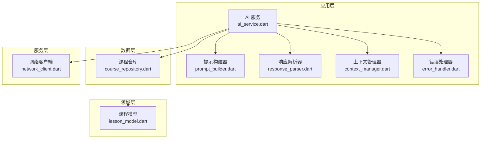
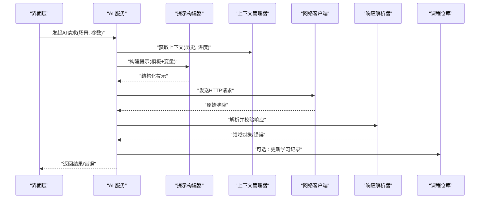
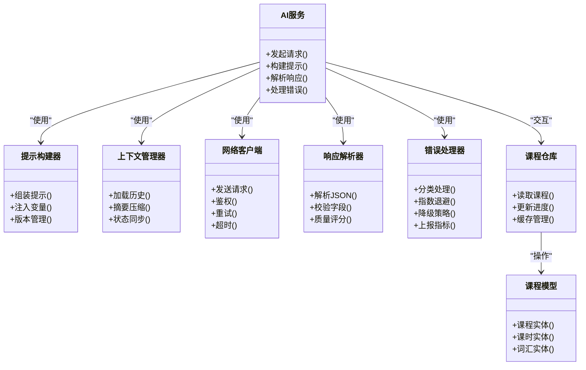

# AI功能集成

<cite>
**本文档引用的文件**   
- [lib/application/ai/ai_service.dart](file://lib/application/ai/ai_service.dart)
- [lib/application/ai/prompt_builder.dart](file://lib/application/ai/prompt_builder.dart)
- [lib/application/ai/response_parser.dart](file://lib/application/ai/response_parser.dart)
- [lib/application/ai/context_manager.dart](file://lib/application/ai/context_manager.dart)
- [lib/application/ai/error_handler.dart](file://lib/application/ai/error_handler.dart)
- [lib/domain/models/lesson_model.dart](file://lib/domain/models/lesson_model.dart)
- [lib/data/repositories/course_repository.dart](file://lib/data/repositories/course_repository.dart)
- [lib/service/network_client.dart](file://lib/service/network_client.dart)
- [test/application/ai/ai_service_test.dart](file://test/application/ai/ai_service_test.dart)
- [test/application/ai/prompt_builder_test.dart](file://test/application/ai/prompt_builder_test.dart)
- [pubspec.yaml](file://pubspec.yaml)
</cite>

## 目录
1. [简介](#简介)
2. [项目结构](#项目结构)
3. [核心组件](#核心组件)
4. [架构总览](#架构总览)
5. [详细组件分析](#详细组件分析)
6. [依赖关系分析](#依赖关系分析)
7. [性能考虑](#性能考虑)
8. [故障排查指南](#故障排查指南)
9. [结论](#结论)
10. [附录](#附录)

## 简介
本技术文档面向 Varnamalaplus 的 AI 功能集成，聚焦以下目标：
- 深入解释 AI 提示工程、内容生成算法与质量评估机制
- 描述 AI 辅助教学功能的实现原理、上下文管理与响应处理逻辑
- 给出 AI 服务配置、API 调用封装与错误处理策略
- 提供 AI 功能定制指南、性能监控与成本控制方案

该文档既适合开发者快速定位实现细节，也适合非技术读者理解整体设计与使用方式。

## 项目结构
AI 相关代码主要位于 lib/application/ai 与 test/application/ai 目录，围绕“提示构建—网络请求—响应解析—上下文管理—错误处理”形成闭环。领域模型与课程数据通过 domain 与 data 层提供，网络通信由 service 层统一封装。

图表来源
- [lib/application/ai/ai_service.dart](file://lib/application/ai/ai_service.dart)
- [lib/application/ai/prompt_builder.dart](file://lib/application/ai/prompt_builder.dart)
- [lib/application/ai/response_parser.dart](file://lib/application/ai/response_parser.dart)
- [lib/application/ai/context_manager.dart](file://lib/application/ai/context_manager.dart)
- [lib/application/ai/error_handler.dart](file://lib/application/ai/error_handler.dart)
- [lib/domain/models/lesson_model.dart](file://lib/domain/models/lesson_model.dart)
- [lib/data/repositories/course_repository.dart](file://lib/data/repositories/course_repository.dart)
- [lib/service/network_client.dart](file://lib/service/network_client.dart)

章节来源
- [lib/application/ai/ai_service.dart](file://lib/application/ai/ai_service.dart)
- [lib/application/ai/prompt_builder.dart](file://lib/application/ai/prompt_builder.dart)
- [lib/application/ai/response_parser.dart](file://lib/application/ai/response_parser.dart)
- [lib/application/ai/context_manager.dart](file://lib/application/ai/context_manager.dart)
- [lib/application/ai/error_handler.dart](file://lib/application/ai/error_handler.dart)
- [lib/domain/models/lesson_model.dart](file://lib/domain/models/lesson_model.dart)
- [lib/data/repositories/course_repository.dart](file://lib/data/repositories/course_repository.dart)
- [lib/service/network_client.dart](file://lib/service/network_client.dart)

## 核心组件
- AI 服务（ai_service.dart）：协调提示构建、上下文管理、网络请求、响应解析与错误处理，对外暴露统一的 AI 能力接口。
- 提示构建器（prompt_builder.dart）：根据教学场景、用户水平、课程主题等参数组装结构化提示，支持模板化与动态变量注入。
- 响应解析器（response_parser.dart）：将 AI 返回的结构化文本或 JSON 转换为领域对象，进行字段校验与降级处理。
- 上下文管理器（context_manager.dart）：维护对话历史、学习进度、知识点掌握度等上下文信息，控制上下文长度与裁剪策略。
- 错误处理器（error_handler.dart）：统一捕获网络异常、超时、限流、鉴权失败等错误，提供重试、降级与可观测性上报。

章节来源
- [lib/application/ai/ai_service.dart](file://lib/application/ai/ai_service.dart)
- [lib/application/ai/prompt_builder.dart](file://lib/application/ai/prompt_builder.dart)
- [lib/application/ai/response_parser.dart](file://lib/application/ai/response_parser.dart)
- [lib/application/ai/context_manager.dart](file://lib/application/ai/context_manager.dart)
- [lib/application/ai/error_handler.dart](file://lib/application/ai/error_handler.dart)

## 架构总览
AI 功能采用分层与职责分离设计：应用层负责编排流程，领域层提供稳定模型，数据层负责持久化与仓库访问，服务层抽象网络通信。AI 服务作为入口，串联提示构建、上下文管理、网络请求与响应解析，并通过错误处理器保障稳定性。

图表来源
- [lib/application/ai/ai_service.dart](file://lib/application/ai/ai_service.dart)
- [lib/application/ai/prompt_builder.dart](file://lib/application/ai/prompt_builder.dart)
- [lib/application/ai/context_manager.dart](file://lib/application/ai/context_manager.dart)
- [lib/service/network_client.dart](file://lib/service/network_client.dart)
- [lib/application/ai/response_parser.dart](file://lib/application/ai/response_parser.dart)
- [lib/data/repositories/course_repository.dart](file://lib/data/repositories/course_repository.dart)

## 详细组件分析

### AI 服务（ai_service.dart）
- 职责：编排提示构建、上下文管理、网络请求、响应解析与错误处理；暴露统一 API。
- 关键流程：
  - 接收业务请求，提取场景与参数
  - 从上下文管理器加载会话历史与学习状态
  - 调用提示构建器生成结构化提示
  - 通过网络客户端发起请求，携带鉴权与速率限制头
  - 将原始响应交给解析器进行校验与转换
  - 错误处理器兜底，执行重试、降级与上报
- 扩展点：新增教学场景时，仅需扩展提示模板与解析规则。

章节来源
- [lib/application/ai/ai_service.dart](file://lib/application/ai/ai_service.dart)

### 提示构建器（prompt_builder.dart）
- 职责：将业务参数与上下文转化为高质量提示，确保一致性、可控性与可追溯性。
- 关键点：
  - 模板系统：按教学场景选择模板，注入变量（如词汇、语法点、难度等级）
  - 约束注入：输出格式、语言风格、长度限制、安全过滤
  - 版本化：提示模板带版本号，便于回滚与A/B测试
- 优化建议：缓存常用模板片段，减少重复拼接开销。

章节来源
- [lib/application/ai/prompt_builder.dart](file://lib/application/ai/prompt_builder.dart)

### 响应解析器（response_parser.dart）
- 职责：将 AI 返回的文本或 JSON 解析为领域对象，并进行完整性与合理性校验。
- 关键点：
  - 多格式兼容：支持 JSON、Markdown 表格、纯文本结构化字段
  - 容错策略：缺失字段默认值、类型转换、边界值修正
  - 质量评分：基于关键字覆盖率、结构完整度、语义相关性打分
- 扩展建议：引入外部评测工具或规则引擎提升质量评估准确性。

章节来源
- [lib/application/ai/response_parser.dart](file://lib/application/ai/response_parser.dart)

### 上下文管理器（context_manager.dart）
- 职责：维护对话历史、学习进度、知识点掌握度等上下文，控制上下文长度与裁剪策略。
- 关键点：
  - 滑动窗口：保留最近 N 轮对话，避免超出模型上下文限制
  - 摘要压缩：对长历史进行关键信息摘要，降低 Token 消耗
  - 状态同步：与课程仓库联动，实时更新学习进度与薄弱点
- 性能注意：避免频繁序列化/反序列化，使用增量更新。

章节来源
- [lib/application/ai/context_manager.dart](file://lib/application/ai/context_manager.dart)

### 错误处理器（error_handler.dart）
- 职责：统一捕获网络异常、超时、限流、鉴权失败等错误，提供重试、降级与上报。
- 关键点：
  - 分类处理：区分可重试（网络抖动、限流）与不可重试（参数错误、权限不足）
  - 指数退避：对限流与临时错误实施指数退避重试
  - 降级策略：在 AI 不可用时返回本地缓存或预设答案
  - 可观测性：记录错误码、耗时、Token 用量，便于监控与成本分析

章节来源
- [lib/application/ai/error_handler.dart](file://lib/application/ai/error_handler.dart)

### 网络客户端（network_client.dart）
- 职责：封装 HTTP 请求，统一鉴权、重试、超时、日志与指标上报。
- 关键点：
  - 鉴权：自动附加 Token，处理刷新与过期
  - 重试：对 5xx、429 等状态码实施重试
  - 超时：设置合理超时时间，避免长时间阻塞
  - 指标：记录请求耗时、成功率、错误分布

章节来源
- [lib/service/network_client.dart](file://lib/service/network_client.dart)

### 课程仓库与模型（course_repository.dart / lesson_model.dart）
- 职责：提供课程数据访问与领域模型定义，支撑 AI 教学场景的数据基础。
- 关键点：
  - 模型：课程、课时、词汇、语法点等实体定义
  - 仓库：读写课程数据，支持缓存与离线模式
  - 关联：与上下文管理器联动，更新学习进度与薄弱点

章节来源
- [lib/data/repositories/course_repository.dart](file://lib/data/repositories/course_repository.dart)
- [lib/domain/models/lesson_model.dart](file://lib/domain/models/lesson_model.dart)

## 依赖关系分析
AI 服务依赖提示构建器、上下文管理器、网络客户端、响应解析器与错误处理器；同时与课程仓库交互以获取/更新学习数据。领域模型为数据载体，网络客户端抽象外部依赖。

图表来源
- [lib/application/ai/ai_service.dart](file://lib/application/ai/ai_service.dart)
- [lib/application/ai/prompt_builder.dart](file://lib/application/ai/prompt_builder.dart)
- [lib/application/ai/context_manager.dart](file://lib/application/ai/context_manager.dart)
- [lib/service/network_client.dart](file://lib/service/network_client.dart)
- [lib/application/ai/response_parser.dart](file://lib/application/ai/response_parser.dart)
- [lib/application/ai/error_handler.dart](file://lib/application/ai/error_handler.dart)
- [lib/data/repositories/course_repository.dart](file://lib/data/repositories/course_repository.dart)
- [lib/domain/models/lesson_model.dart](file://lib/domain/models/lesson_model.dart)

章节来源
- [lib/application/ai/ai_service.dart](file://lib/application/ai/ai_service.dart)
- [lib/application/ai/prompt_builder.dart](file://lib/application/ai/prompt_builder.dart)
- [lib/application/ai/context_manager.dart](file://lib/application/ai/context_manager.dart)
- [lib/service/network_client.dart](file://lib/service/network_client.dart)
- [lib/application/ai/response_parser.dart](file://lib/application/ai/response_parser.dart)
- [lib/application/ai/error_handler.dart](file://lib/application/ai/error_handler.dart)
- [lib/data/repositories/course_repository.dart](file://lib/data/repositories/course_repository.dart)
- [lib/domain/models/lesson_model.dart](file://lib/domain/models/lesson_model.dart)

## 性能考虑
- 提示优化：精简变量注入，避免冗余上下文；使用模板缓存减少拼接开销。
- 上下文管理：采用滑动窗口与摘要压缩，控制 Token 用量与延迟。
- 网络优化：连接复用、合理超时、批量请求；对热点数据启用本地缓存。
- 解析优化：增量解析与懒加载，避免全量反序列化。
- 错误处理：指数退避与熔断，防止雪崩效应。
- 监控指标：请求耗时、成功率、错误率、Token 用量、成本统计。

[本节为通用指导，不直接分析具体文件]

## 故障排查指南
- 常见问题：
  - 网络超时：检查网络客户端超时设置与重试策略
  - 鉴权失败：确认 Token 有效性及刷新逻辑
  - 限流错误：调整重试间隔与并发数
  - 解析失败：检查响应格式与字段完整性
  - 上下文溢出：缩短历史或启用摘要压缩
- 诊断步骤：
  - 查看错误处理器日志与指标上报
  - 验证提示模板与变量注入是否正确
  - 检查课程仓库数据一致性与缓存状态
  - 使用单元测试复现问题（参考测试用例）

章节来源
- [lib/application/ai/error_handler.dart](file://lib/application/ai/error_handler.dart)
- [test/application/ai/ai_service_test.dart](file://test/application/ai/ai_service_test.dart)
- [test/application/ai/prompt_builder_test.dart](file://test/application/ai/prompt_builder_test.dart)

## 结论
Varnamalaplus 的 AI 功能集成通过清晰的分层与职责分离，实现了提示工程、内容生成与质量评估的闭环。AI 服务作为编排中心，结合上下文管理与错误处理，保障了教学场景的稳定与高效。未来可通过模板版本化、质量评测增强与成本监控进一步优化体验与成本。

[本节为总结性内容，不直接分析具体文件]

## 附录
- AI 服务配置：
  - 端点地址、鉴权方式、超时与重试策略
  - 提示模板版本与变量映射
  - 上下文长度限制与摘要阈值
- 质量控制：
  - 字段完整性校验规则
  - 语义相关性评分阈值
  - 降级与回退策略
- 成本优化：
  - Token 用量统计与配额管理
  - 热点内容缓存与预生成
  - 按需调用与批处理

[本节为补充说明，不直接分析具体文件]