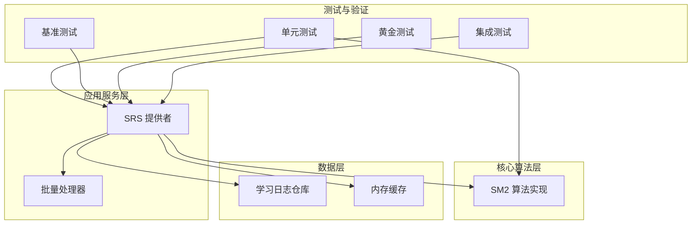
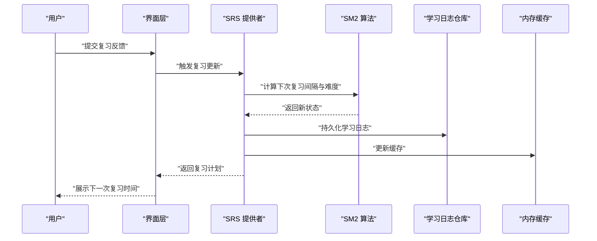
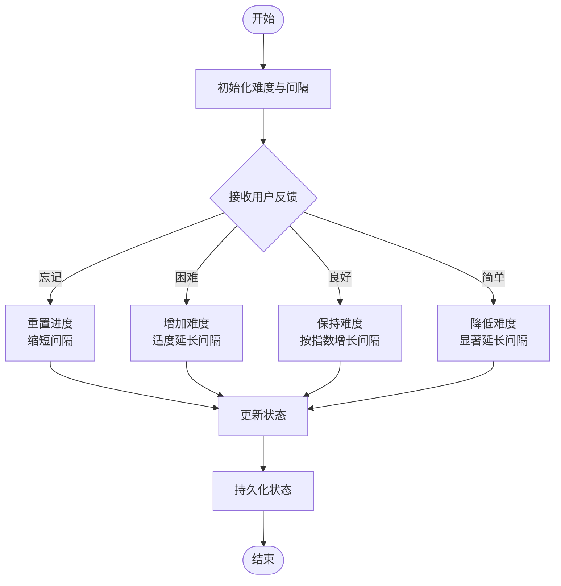
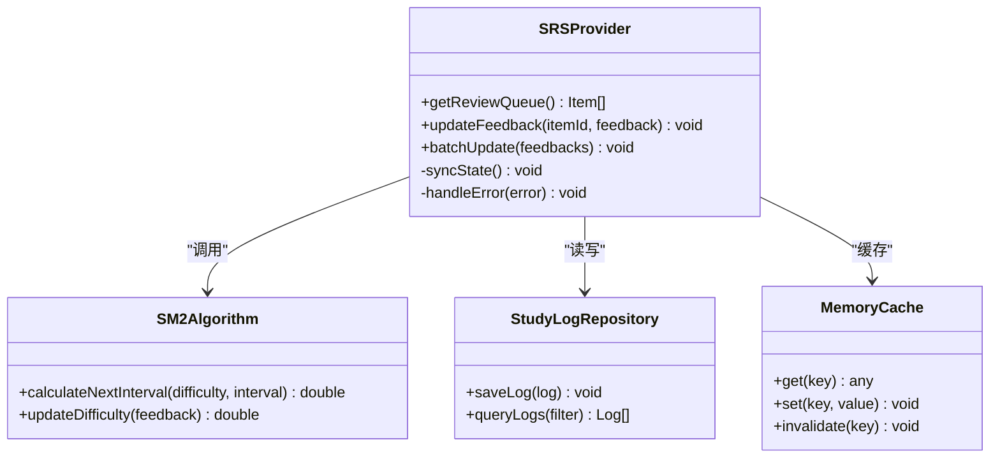
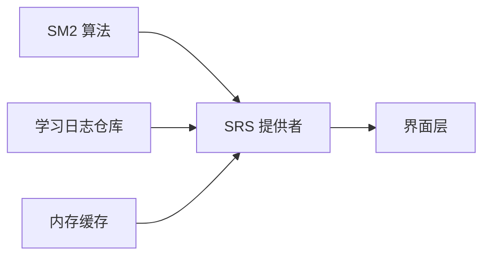

# SRS间隔重复算法

<cite>
**本文档引用的文件**   
- [lib/core/sm2.dart](file://lib/core/sm2.dart)
- [test/core/sm2_test.dart](file://test/core/sm2_test.dart)
- [lib/application/srs_provider.dart](file://lib/application/srs_provider.dart)
- [test/application/srs_provider_test.dart](file://test/application/srs_provider_test.dart)
- [test/application/srs_persist_benchmark_test.dart](file://test/application/srs_persist_benchmark_test.dart)
- [test/golden/srs_review_golden_test.dart](file://test/golden/srs_review_golden_test.dart)
- [test/integration/srs_review_flow_test.dart](file://test/integration/srs_review_flow_test.dart)
- [lib/data/study_log_repository.dart](file://lib/data/study_log_repository.dart)
</cite>

## 目录
1. [简介](#简介)
2. [项目结构](#项目结构)
3. [核心组件](#核心组件)
4. [架构总览](#架构总览)
5. [详细组件分析](#详细组件分析)
6. [依赖关系分析](#依赖关系分析)
7. [性能考虑](#性能考虑)
8. [故障排查指南](#故障排查指南)
9. [结论](#结论)
10. [附录](#附录)

## 简介
本技术文档围绕 Varnamalaplus 的间隔重复系统（SRS）展开，重点解析 SM-2 算法的实现细节、记忆曲线计算逻辑与复习间隔优化策略。文档同时覆盖学习状态管理、难度调整机制、个性化复习计划生成、性能优化方案、内存缓存策略以及批量处理逻辑，并提供参数调优指南与效果评估方法，帮助开发者与研究者深入理解并高效使用该系统。

## 项目结构
SRS 相关代码主要分布在以下模块：
- 核心算法层：SM-2 实现位于核心库中，提供间隔与难度更新的核心计算能力。
- 应用服务层：SRS 提供者负责调度复习任务、维护学习状态、持久化数据与批量处理。
- 数据层：学习日志仓库负责记录复习行为与统计信息，支撑效果评估与个性化策略。
- 测试与验证：单元测试、基准测试、UI 黄金测试与集成测试共同保障算法正确性与性能稳定性。

图表来源
- [lib/core/sm2.dart](file://lib/core/sm2.dart)
- [lib/application/srs_provider.dart](file://lib/application/srs_provider.dart)
- [lib/data/study_log_repository.dart](file://lib/data/study_log_repository.dart)

章节来源
- [lib/core/sm2.dart](file://lib/core/sm2.dart)
- [lib/application/srs_provider.dart](file://lib/application/srs_provider.dart)
- [lib/data/study_log_repository.dart](file://lib/data/study_log_repository.dart)

## 核心组件
- SM-2 算法实现：封装间隔与难度更新的核心公式，支持基于用户反馈的动态调整。
- SRS 提供者：协调复习队列、状态管理与持久化，提供查询与更新接口。
- 学习日志仓库：记录每次复习的行为与结果，用于统计分析与策略优化。
- 内存缓存：提升高频访问数据的读取性能，减少数据库压力。
- 批量处理器：对大量复习项进行批处理，降低 I/O 开销并提高吞吐。

章节来源
- [lib/core/sm2.dart](file://lib/core/sm2.dart)
- [lib/application/srs_provider.dart](file://lib/application/srs_provider.dart)
- [lib/data/study_log_repository.dart](file://lib/data/study_log_repository.dart)

## 架构总览
SRS 的整体流程从用户交互开始，经过 SRS 提供者调用 SM-2 算法计算下一次复习时间，随后通过仓库持久化学习日志，并在内存中进行缓存以提升后续查询效率。批量处理器在后台或定时任务中对待复习项进行聚合处理，确保高并发场景下的稳定与高效。

图表来源
- [lib/application/srs_provider.dart](file://lib/application/srs_provider.dart)
- [lib/core/sm2.dart](file://lib/core/sm2.dart)
- [lib/data/study_log_repository.dart](file://lib/data/study_log_repository.dart)

## 详细组件分析

### SM-2 算法实现
SM-2 是间隔重复系统的经典算法，其核心在于根据用户的反馈动态调整项目的难度与复习间隔。实现通常包含以下关键步骤：
- 初始化：设定初始难度与间隔。
- 反馈处理：根据用户选择（如“忘记”、“困难”、“良好”、“简单”）更新难度与间隔。
- 间隔计算：依据当前难度与历史表现计算下一次复习时间。
- 状态持久化：将更新后的状态写入存储。

图表来源
- [lib/core/sm2.dart](file://lib/core/sm2.dart)

章节来源
- [lib/core/sm2.dart](file://lib/core/sm2.dart)
- [test/core/sm2_test.dart](file://test/core/sm2_test.dart)

### SRS 提供者
SRS 提供者作为应用层的核心协调者，负责：
- 复习队列管理：根据当前时间与复习计划生成待复习列表。
- 状态同步：确保内存状态与持久化存储一致。
- 批量处理：对大量复习项进行批处理，提升性能。
- 错误处理：捕获并处理异常情况，保证系统稳定性。

图表来源
- [lib/application/srs_provider.dart](file://lib/application/srs_provider.dart)
- [lib/core/sm2.dart](file://lib/core/sm2.dart)
- [lib/data/study_log_repository.dart](file://lib/data/study_log_repository.dart)

章节来源
- [lib/application/srs_provider.dart](file://lib/application/srs_provider.dart)
- [test/application/srs_provider_test.dart](file://test/application/srs_provider_test.dart)

### 学习日志仓库
学习日志仓库负责记录每次复习的行为与结果，包括：
- 复习时间戳
- 用户反馈类型
- 项目 ID 与上下文信息
- 统计指标（如连续正确次数）

这些数据为效果评估与个性化策略提供基础。

章节来源
- [lib/data/study_log_repository.dart](file://lib/data/study_log_repository.dart)

### 内存缓存策略
内存缓存用于加速高频访问的数据读取，常见策略包括：
- LRU（最近最少使用）淘汰策略
- 过期时间控制
- 线程安全访问

章节来源
- [lib/application/srs_provider.dart](file://lib/application/srs_provider.dart)

### 批量处理逻辑
批量处理器将多个复习项的更新操作合并执行，减少数据库 I/O 次数，提升吞吐。典型流程包括：
- 收集待更新项
- 构建批量事务
- 执行并提交事务
- 回滚异常处理

章节来源
- [lib/application/srs_provider.dart](file://lib/application/srs_provider.dart)

## 依赖关系分析
SRS 模块内部依赖清晰，核心算法与应用服务解耦，便于独立测试与替换。数据层与缓存层提供稳定的数据访问能力。

图表来源
- [lib/core/sm2.dart](file://lib/core/sm2.dart)
- [lib/application/srs_provider.dart](file://lib/application/srs_provider.dart)
- [lib/data/study_log_repository.dart](file://lib/data/study_log_repository.dart)

章节来源
- [lib/core/sm2.dart](file://lib/core/sm2.dart)
- [lib/application/srs_provider.dart](file://lib/application/srs_provider.dart)
- [lib/data/study_log_repository.dart](file://lib/data/study_log_repository.dart)

## 性能考虑
- 内存缓存：通过 LRU 策略减少重复计算与数据库查询。
- 批量处理：合并多次更新操作，降低 I/O 开销。
- 异步处理：非阻塞地执行耗时操作，提升响应速度。
- 索引优化：为查询条件建立合适索引，加速数据检索。

[本节为通用指导，无需特定文件引用]

## 故障排查指南
常见问题及解决方法：
- 复习间隔异常：检查 SM-2 算法的参数设置与反馈映射。
- 数据不一致：确认状态同步逻辑与事务完整性。
- 性能瓶颈：分析缓存命中率与批量处理效率。
- 日志缺失：验证仓库写入逻辑与权限配置。

章节来源
- [test/application/srs_persist_benchmark_test.dart](file://test/application/srs_persist_benchmark_test.dart)
- [test/integration/srs_review_flow_test.dart](file://test/integration/srs_review_flow_test.dart)

## 结论
Varnamalaplus 的 SRS 系统以 SM-2 算法为核心，结合现代软件工程实践，实现了高效、可扩展且易于维护的间隔重复学习平台。通过合理的架构设计、性能优化与完善的测试体系，系统在用户体验与开发效率之间取得了良好平衡。未来可进一步探索更复杂的记忆模型与个性化推荐策略，以提升学习效果。

[本节为总结性内容，无需特定文件引用]

## 附录
- 参数调优指南：根据用户群体特征调整 SM-2 的初始难度与间隔增长系数。
- 效果评估方法：基于学习日志计算准确率、遗忘率与复习效率等指标。
- 最佳实践：保持算法与服务解耦，优先使用缓存与批量处理提升性能。

[本节为补充信息，无需特定文件引用]