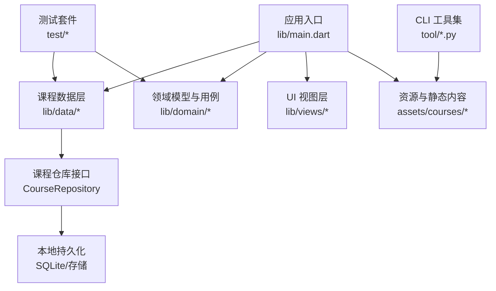
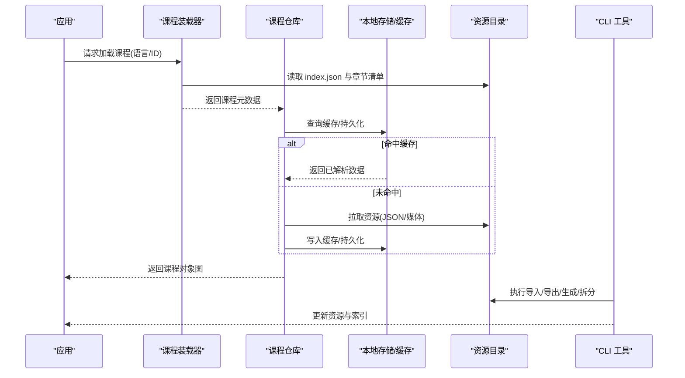
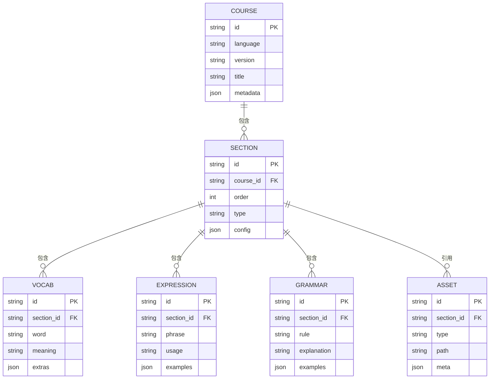
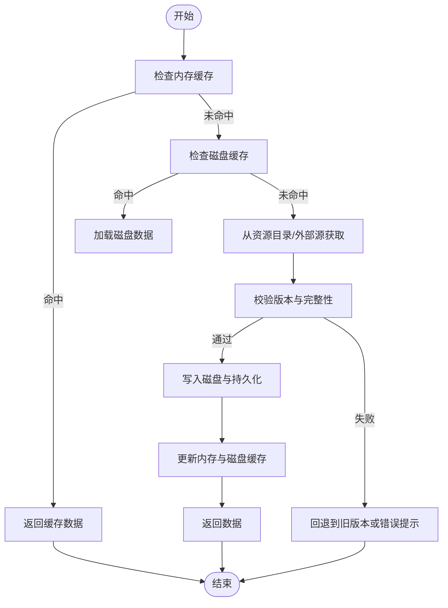
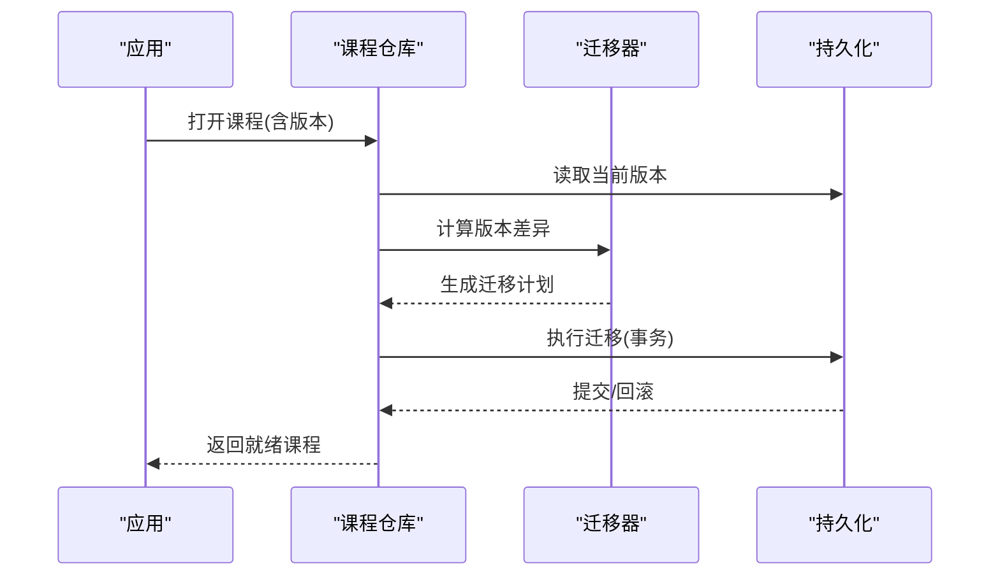
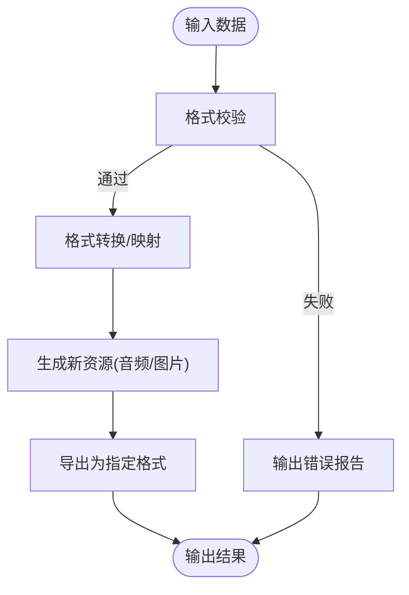
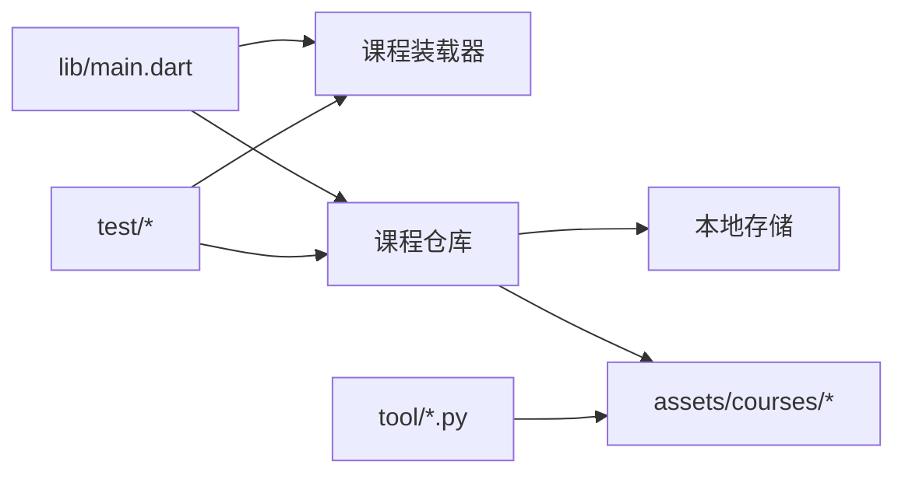

# 内容管理系统

<cite>
**本文引用的文件**   
- [README.md](file://README.md)
- [pubspec.yaml](file://pubspec.yaml)
- [main.dart](file://lib/main.dart)
- [course_loader_test.dart](file://test/courses/course_loader_test.dart)
- [seeder_round_trip_test.dart](file://test/courses/seeder_round_trip_test.dart)
- [course_repository_test.dart](file://test/data/course_repository_test.dart)
- [schema_migration_test.dart](file://test/data/schema_migration_test.dart)
- [gui-course-editor.md](file://docs/authoring/gui-course-editor.md)
- [course-layout.md](file://docs/authoring/course-layout.md)
- [lesson-type-templates.md](file://docs/authoring/lesson-type-templates.md)
- [listening-show-format.md](file://docs/authoring/listening-show-format.md)
- [content_inventory_current.md](file://docs/content_inventory_current.md)
- [0021-git-resource-library-architecture.md](file://docs/decisions/0021-git-resource-library-architecture.md)
- [0025-textbook-git-integration.md](file://docs/decisions/0025-textbook-git-integration.md)
- [0026-local-resource-editor-enhancements.md](file://docs/decisions/0026-local-resource-editor-enhancements.md)
- [course_cli.py](file://tool/course_cli.py)
- [export_content_inventory.py](file://tool/export_content_inventory.py)
- [generate_audio.py](file://tool/generate_audio.py)
- [split_course.py](file://tool/split_course.py)
- [index.json](file://assets/courses/turkish/index.json)
- [expressions.json](file://assets/courses/turkish/expressions.json)
- [grammar_points.json](file://assets/courses/turkish/grammar_points.json)
- [vocab.json](file://assets/courses/turkish/vocab.json)
</cite>

## 目录
1. [简介](#简介)
2. [项目结构](#项目结构)
3. [核心组件](#核心组件)
4. [架构总览](#架构总览)
5. [详细组件分析](#详细组件分析)
6. [依赖关系分析](#依赖关系分析)
7. [性能考量](#性能考量)
8. [故障排查指南](#故障排查指南)
9. [结论](#结论)
10. [附录](#附录)

## 简介
本技术文档面向 Varnamalaplus 的内容管理系统（CMS），聚焦课程数据结构、章节组织与资源管理机制，系统阐述内容加载策略、缓存方案与版本控制逻辑，并覆盖多语言支持、本地化处理与资源优化。同时提供内容导入导出、格式转换与数据迁移工具的使用指南，帮助作者与开发者高效维护课程内容。

## 项目结构
Varnamalaplus 采用 Flutter 跨平台应用结构，内容资产集中于 assets/courses，课程元数据与资源以 JSON 为主，配套 CLI 工具用于批量处理与生成。测试覆盖课程加载、仓库访问与数据库迁移等关键路径，确保内容管线稳定可靠。

图表来源
- [main.dart:1-200](file://lib/main.dart#L1-L200)
- [course_repository_test.dart:1-200](file://test/data/course_repository_test.dart#L1-L200)

章节来源
- [README.md:1-200](file://README.md#L1-L200)
- [pubspec.yaml:1-200](file://pubspec.yaml#L1-L200)
- [main.dart:1-200](file://lib/main.dart#L1-L200)

## 核心组件
- 课程装载器：负责从 assets 或外部源解析课程索引与章节清单，构建可渲染的课程对象图。
- 课程仓库：抽象课程数据的读取与写入，统一访问本地持久化与缓存。
- 领域模型：定义课程、章节、练习、词汇、语法点等实体及关系。
- UI 视图：基于领域模型渲染学习界面与编辑界面。
- CLI 工具：提供导入、导出、音频生成、拆分与校验等能力。

章节来源
- [course_loader_test.dart:1-200](file://test/courses/course_loader_test.dart#L1-L200)
- [course_repository_test.dart:1-200](file://test/data/course_repository_test.dart#L1-L200)
- [gui-course-editor.md:1-200](file://docs/authoring/gui-course-editor.md#L1-L200)

## 架构总览
内容管理系统的核心流程包括：课程发现与索引解析、章节与资源按需加载、本地缓存与持久化、版本一致性校验与迁移、以及通过 CLI 进行批量处理。

图表来源
- [course_loader_test.dart:1-200](file://test/courses/course_loader_test.dart#L1-L200)
- [course_repository_test.dart:1-200](file://test/data/course_repository_test.dart#L1-L200)
- [index.json:1-200](file://assets/courses/turkish/index.json#L1-L200)

## 详细组件分析

### 课程数据结构与章节组织
- 课程根级索引：包含课程基本信息、版本、章节列表与资源映射。
- 章节组织：按顺序编排，每个章节包含标题、类型、目标知识点与关联资源。
- 资源类型：词汇表、表达库、语法点、听力材料、图片与音频。
- 多语言支持：通过语言标识区分不同语种的课程目录与资源命名规范。

图表来源
- [index.json:1-200](file://assets/courses/turkish/index.json#L1-L200)
- [vocab.json:1-200](file://assets/courses/turkish/vocab.json#L1-L200)
- [expressions.json:1-200](file://assets/courses/turkish/expressions.json#L1-L200)
- [grammar_points.json:1-200](file://assets/courses/turkish/grammar_points.json#L1-L200)

章节来源
- [course-layout.md:1-200](file://docs/authoring/course-layout.md#L1-L200)
- [lesson-type-templates.md:1-200](file://docs/authoring/lesson-type-templates.md#L1-L200)
- [listening-show-format.md:1-200](file://docs/authoring/listening-show-format.md#L1-L200)

### 内容加载策略与缓存方案
- 加载策略：优先使用本地缓存；若缺失则从 assets 或外部源拉取，并进行增量更新。
- 缓存层级：内存缓存（热数据）、磁盘缓存（冷数据）、持久化（结构化数据）。
- 版本控制：课程与资源携带版本号，变更时触发迁移与校验。
- 失败回退：网络或资源不可用时降级到离线模式，保证可用性。

图表来源
- [course_loader_test.dart:1-200](file://test/courses/course_loader_test.dart#L1-L200)
- [course_repository_test.dart:1-200](file://test/data/course_repository_test.dart#L1-L200)

章节来源
- [course_loader_test.dart:1-200](file://test/courses/course_loader_test.dart#L1-L200)
- [course_repository_test.dart:1-200](file://test/data/course_repository_test.dart#L1-L200)

### 版本控制与数据迁移
- 版本字段：课程与资源均包含版本信息，便于比较与升级。
- 迁移脚本：根据版本差异自动执行字段增删、重命名与默认值填充。
- 一致性校验：在加载前对索引与资源进行哈希校验，防止损坏或不一致。
- 回滚机制：当迁移失败时回滚到上一个稳定版本。

图表来源
- [schema_migration_test.dart:1-200](file://test/data/schema_migration_test.dart#L1-L200)

章节来源
- [schema_migration_test.dart:1-200](file://test/data/schema_migration_test.dart#L1-L200)
- [0021-git-resource-library-architecture.md:1-200](file://docs/decisions/0021-git-resource-library-architecture.md#L1-L200)

### 多语言支持与本地化处理
- 语言目录隔离：每种语言拥有独立课程目录，避免资源冲突。
- 文本本地化：课程标题、说明与示例文本按语言键值分离。
- 资源命名规范：音频、图片等资源按语言前缀命名，便于检索与替换。
- 运行时切换：支持动态切换显示语言，无需重启应用。

章节来源
- [content_inventory_current.md:1-200](file://docs/content_inventory_current.md#L1-L200)
- [0026-local-resource-editor-enhancements.md:1-200](file://docs/decisions/0026-local-resource-editor-enhancements.md#L1-L200)

### 资源优化技术
- 媒体压缩：音频与图片在构建阶段进行压缩与格式转换。
- 懒加载：仅在需要时加载章节与资源，减少初始包体。
- 预取策略：预测用户下一步操作，提前加载可能用到的资源。
- 缓存淘汰：基于 LRU 策略清理不常用缓存，释放存储空间。

章节来源
- [generate_audio.py:1-200](file://tool/generate_audio.py#L1-L200)
- [course_layout.md:1-200](file://docs/authoring/course-layout.md#L1-L200)

### 内容导入导出、格式转换与数据迁移工具
- 导入导出：将外部课程数据转换为内部 JSON 结构，或将内部结构导出为通用格式。
- 格式转换：在不同版本之间进行字段映射与结构对齐。
- 数据迁移：批量更新资源路径、修正元数据、重建索引。
- 音频生成：根据文本与发音规则批量生成语音素材。
- 课程拆分：按主题或难度将大课程拆分为子课程，便于分发与维护。

图表来源
- [course_cli.py:1-200](file://tool/course_cli.py#L1-L200)
- [export_content_inventory.py:1-200](file://tool/export_content_inventory.py#L1-L200)
- [generate_audio.py:1-200](file://tool/generate_audio.py#L1-L200)
- [split_course.py:1-200](file://tool/split_course.py#L1-L200)

章节来源
- [course_cli.py:1-200](file://tool/course_cli.py#L1-L200)
- [export_content_inventory.py:1-200](file://tool/export_content_inventory.py#L1-L200)
- [generate_audio.py:1-200](file://tool/generate_audio.py#L1-L200)
- [split_course.py:1-200](file://tool/split_course.py#L1-L200)

## 依赖关系分析
- 应用入口依赖课程装载器与仓库，仓库依赖本地存储与资源目录。
- CLI 工具直接操作资源目录与索引文件，不依赖运行时 UI。
- 测试套件覆盖装载、仓库与迁移路径，保障数据一致性。

图表来源
- [main.dart:1-200](file://lib/main.dart#L1-L200)
- [course_repository_test.dart:1-200](file://test/data/course_repository_test.dart#L1-L200)
- [course_loader_test.dart:1-200](file://test/courses/course_loader_test.dart#L1-L200)

章节来源
- [main.dart:1-200](file://lib/main.dart#L1-L200)
- [course_repository_test.dart:1-200](file://test/data/course_repository_test.dart#L1-L200)
- [course_loader_test.dart:1-200](file://test/courses/course_loader_test.dart#L1-L200)

## 性能考量
- 首屏加载：仅加载必要章节与资源，延迟加载其余内容。
- 缓存命中率：合理设置内存与磁盘缓存大小，提升重复访问速度。
- I/O 优化：批量读写与异步任务降低阻塞。
- 媒体处理：构建期压缩与转码，运行时按需解码。

[本节为通用指导，不直接分析具体文件]

## 故障排查指南
- 课程加载失败：检查 index.json 与章节清单完整性，确认资源路径正确。
- 缓存不一致：清除缓存并重新拉取资源，验证版本字段一致性。
- 迁移失败：查看迁移日志，确认字段映射与默认值设置。
- 音频生成异常：检查文本编码与发音规则配置，验证输出路径权限。

章节来源
- [course_loader_test.dart:1-200](file://test/courses/course_loader_test.dart#L1-L200)
- [schema_migration_test.dart:1-200](file://test/data/schema_migration_test.dart#L1-L200)

## 结论
Varnamalaplus 的内容管理系统以 JSON 为中心，结合分层缓存与版本控制，实现了高效、稳定的课程内容与资源管理。通过 CLI 工具链，作者可以便捷地进行导入导出、格式转换与数据迁移，配合多语言支持与资源优化策略，满足复杂教学场景的需求。

[本节为总结性内容，不直接分析具体文件]

## 附录
- 课程布局与模板：参考 authoring 文档了解章节结构与题型模板。
- Git 资源库架构：遵循决策文档中的资源管理与协作规范。
- 本地资源编辑器增强：利用 GUI 工具提升编辑效率与一致性。

章节来源
- [gui-course-editor.md:1-200](file://docs/authoring/gui-course-editor.md#L1-L200)
- [0021-git-resource-library-architecture.md:1-200](file://docs/decisions/0021-git-resource-library-architecture.md#L1-L200)
- [0025-textbook-git-integration.md:1-200](file://docs/decisions/0025-textbook-git-integration.md#L1-L200)
- [0026-local-resource-editor-enhancements.md:1-200](file://docs/decisions/0026-local-resource-editor-enhancements.md#L1-L200)