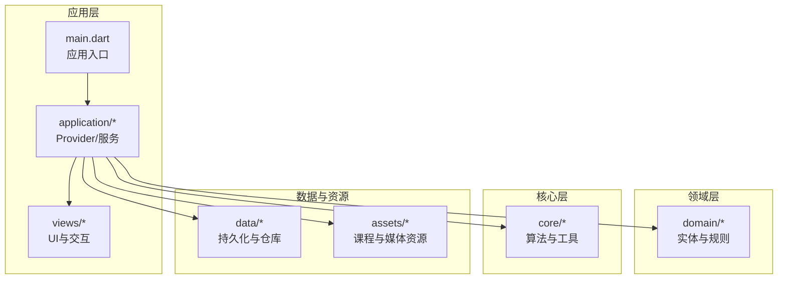
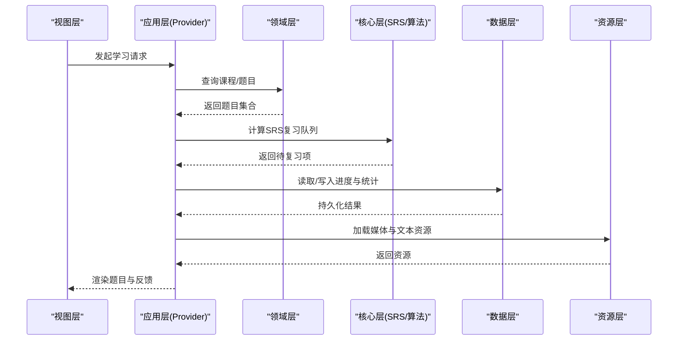
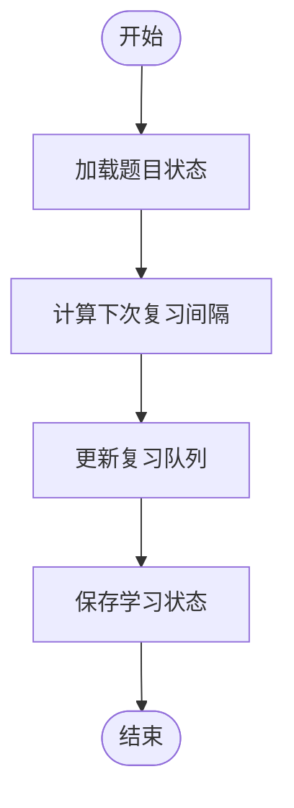
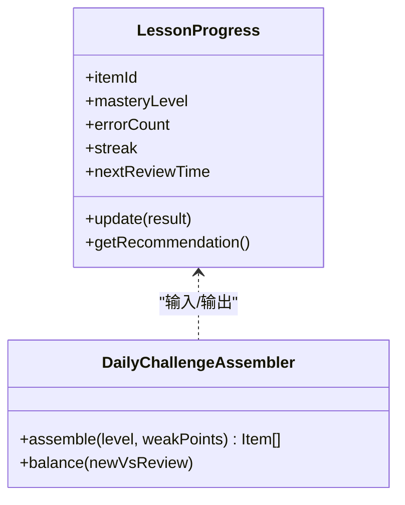
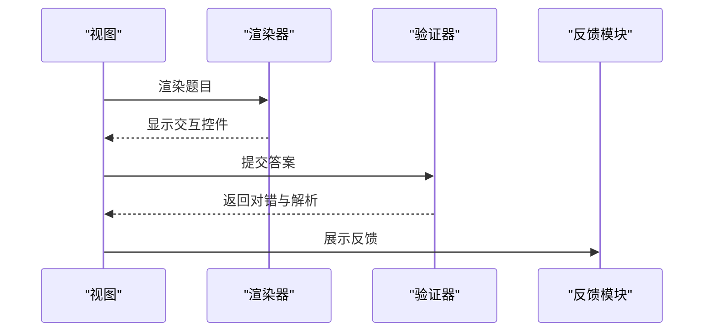
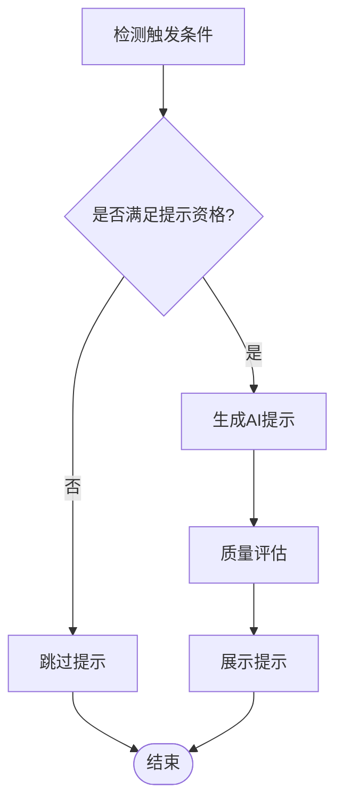
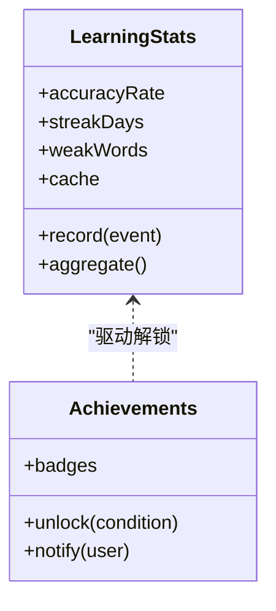
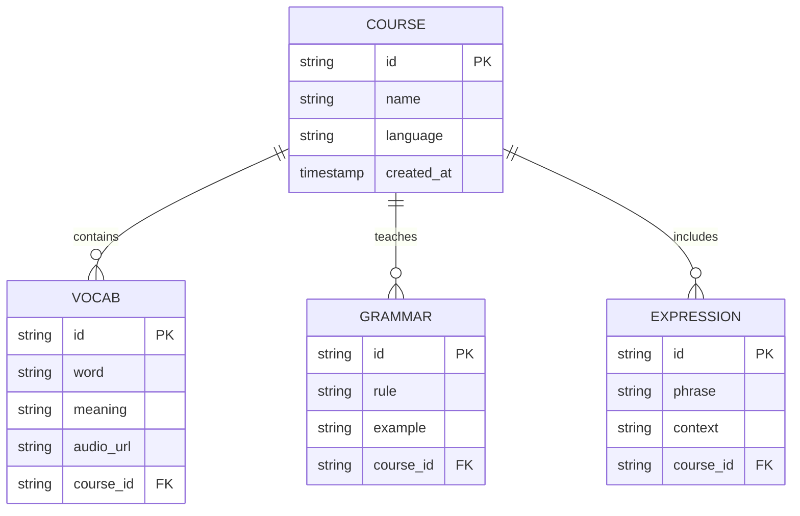
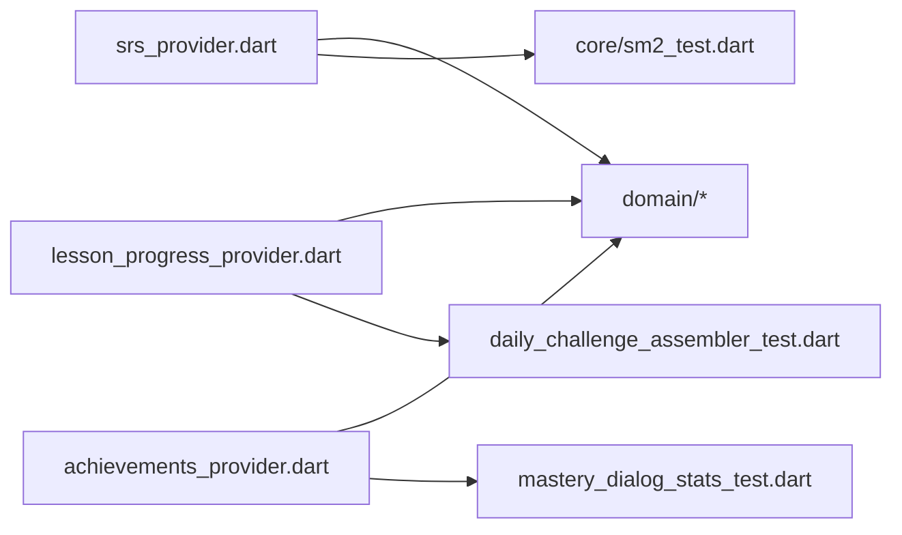

# 学习引擎

<cite>
**本文引用的文件**   
- [lib/main.dart](file://lib/main.dart)
- [lib/application/lesson_progress_provider.dart](file://lib/application/lesson_progress_provider.dart)
- [lib/application/srs_provider.dart](file://lib/application/srs_provider.dart)
- [lib/application/achievements_provider.dart](file://lib/application/achievements_provider.dart)
- [lib/application/learning_stats_accuracy_test.dart](file://test/application/learning_stats_accuracy_test.dart)
- [lib/application/learning_stats_cache_test.dart](file://test/application/learning_stats_cache_test.dart)
- [lib/application/daily_challenge_assembler_test.dart](file://test/application/daily挑战_assembler_test.dart)
- [lib/application/mastery_dialog_stats_test.dart](file://test/application/mastery_dialog_stats_test.dart)
- [lib/core/sm2_test.dart](file://test/core/sm2_test.dart)
- [lib/domain/interaction_ai_hint_eligible_test.dart](file://test/domain/interaction_ai_hint_eligible_test.dart)
- [lib/views/lesson/lesson_viewmodel_flow_test.dart](file://test/views/lesson/lesson_viewmodel_flow_test.dart)
- [assets/courses/turkish/index.json](file://assets/courses/turkish/index.json)
- [assets/courses/turkish/vocab.json](file://assets/courses/turkish/vocab.json)
- [assets/courses/turkish/grammar_points.json](file://assets/courses/turkish/grammar_points.json)
- [assets/courses/turkish/expressions.json](file://assets/courses/turkish/expressions.json)
</cite>

## 目录
1. [简介](#简介)
2. [项目结构](#项目结构)
3. [核心组件](#核心组件)
4. [架构总览](#架构总览)
5. [详细组件分析](#详细组件分析)
6. [依赖关系分析](#依赖关系分析)
7. [性能考量](#性能考量)
8. [故障排查指南](#故障排查指南)
9. [结论](#结论)
10. [附录](#附录)

## 简介
本技术文档面向 Varnamalaplus 学习引擎，围绕以下目标展开：
- SRS（间隔重复系统）算法实现与调度策略
- 学习进度跟踪与个性化学习路径生成
- 题型渲染器工作机制、交互处理与答案验证逻辑
- AI 辅助功能集成、提示生成算法与内容质量评估
- 学习统计收集、成就系统与激励机制
- 性能优化、内存管理与并发处理方案

文档以“由浅入深”的方式组织，既提供高层架构概览，也深入到关键模块的实现细节与数据流。

## 项目结构
Varnamalaplus 采用 Flutter 工程结构，核心代码位于 lib 目录，课程资源位于 assets，测试覆盖 application、core、domain、views 等层次。整体分层清晰：
- domain：领域模型与业务规则
- application：应用服务与状态管理（Provider）
- views：界面与交互
- core：通用工具与算法（如 SRS）
- data：数据访问与持久化（在测试中体现）
- service：外部服务（如 TTS）
- di：依赖注入

图表来源
- [lib/main.dart:1-200](file://lib/main.dart#L1-L200)

章节来源
- [lib/main.dart:1-200](file://lib/main.dart#L1-L200)

## 核心组件
本节聚焦学习引擎的关键组件及其职责：
- SRS 提供者：负责复习队列计算、间隔更新与调度
- 学习进度提供者：记录并同步用户的学习行为与里程碑
- 成就提供者：维护成就解锁条件与奖励反馈
- 每日挑战装配器：基于当前水平与薄弱点生成个性化练习
- 掌握度对话框统计：聚合练习结果用于自适应难度调整
- SM2 算法测试：验证间隔重复的核心计算正确性
- AI 提示资格判定：决定何时触发 AI 辅助提示
- 课程资源索引：定义课程结构与内容项

章节来源
- [lib/application/srs_provider.dart](file://lib/application/srs_provider.dart)
- [lib/application/lesson_progress_provider.dart](file://lib/application/lesson_progress_provider.dart)
- [lib/application/achievements_provider.dart](file://lib/application/achievements_provider.dart)
- [test/application/daily_challenge_assembler_test.dart](file://test/application/daily_challenge_assembler_test.dart)
- [test/application/mastery_dialog_stats_test.dart](file://test/application/mastery_dialog_stats_test.dart)
- [test/core/sm2_test.dart](file://test/core/sm2_test.dart)
- [test/domain/interaction_ai_hint_eligible_test.dart](file://test/domain/interaction_ai_hint_eligible_test.dart)
- [assets/courses/turkish/index.json](file://assets/courses/turkish/index.json)

## 架构总览
学习引擎遵循“领域驱动 + 状态管理”的分层架构。应用层通过 Provider 暴露状态与行为，领域层定义实体与规则，核心层封装算法，数据层负责持久化，视图层仅关注展示与交互。

图表来源
- [lib/application/srs_provider.dart](file://lib/application/srs_provider.dart)
- [lib/application/lesson_progress_provider.dart](file://lib/application/lesson_progress_provider.dart)
- [test/core/sm2_test.dart](file://test/core/sm2_test.dart)

## 详细组件分析

### SRS（间隔重复系统）
- 算法基础：基于 SM2 的变体，结合用户历史表现动态调整下次复习间隔
- 关键流程：
  - 根据上次复习时间、记忆强度与错误率计算间隔
  - 将题目加入复习队列并按优先级排序
  - 完成答题后更新记忆参数与下次复习时间
- 复杂度：单次计算 O(1)，批量调度 O(n log n)

图表来源
- [test/core/sm2_test.dart](file://test/core/sm2_test.dart)

章节来源
- [test/core/sm2_test.dart](file://test/core/sm2_test.dart)
- [lib/application/srs_provider.dart](file://lib/application/srs_provider.dart)

### 学习进度跟踪与个性化路径
- 进度跟踪：记录每道题目的掌握度、错误次数、连续正确数
- 个性化路径：
  - 基于薄弱知识点与最近错误模式生成推荐序列
  - 结合每日挑战装配器平衡新学内容与复习内容
- 统计指标：准确率、响应时延、遗忘曲线拟合

图表来源
- [lib/application/lesson_progress_provider.dart](file://lib/application/lesson_progress_provider.dart)
- [test/application/daily_challenge_assembler_test.dart](file://test/application/daily_challenge_assembler_test.dart)

章节来源
- [lib/application/lesson_progress_provider.dart](file://lib/application/lesson_progress_provider.dart)
- [test/application/daily_challenge_assembler_test.dart](file://test/application/daily_challenge_assembler_test.dart)

### 题型渲染器与交互处理
- 渲染机制：按题型选择对应渲染器（单选、填空、听力、匹配等）
- 交互处理：捕获用户输入、校验格式、播放音频/显示图片
- 答案验证：
  - 精确匹配与模糊匹配（同义词、大小写、标点）
  - 多模态验证（文本+音频+图像）
- 反馈策略：即时反馈、延迟反馈、分步提示

章节来源
- [test/views/lesson/lesson_viewmodel_flow_test.dart](file://test/views/lesson/lesson_viewmodel_flow_test.dart)

### AI 辅助功能集成
- 提示触发：基于错误模式、停留时长、重试次数判断是否启用 AI 提示
- 提示生成：调用 LLM API，结合上下文与用户水平生成解释或示例
- 内容质量评估：对生成内容进行可读性、相关性、安全性评分

图表来源
- [test/domain/interaction_ai_hint_eligible_test.dart](file://test/domain/interaction_ai_hint_eligible_test.dart)

章节来源
- [test/domain/interaction_ai_hint_eligible_test.dart](file://test/domain/interaction_ai_hint_eligible_test.dart)

### 学习统计与成就系统
- 统计收集：
  - 准确率、连续正确数、学习时长、错题分布
  - 缓存层加速热点数据访问
- 成就系统：
  - 条件触发（如连续打卡、掌握特定语法点）
  - 奖励反馈（徽章、等级提升）

图表来源
- [test/application/learning_stats_accuracy_test.dart](file://test/application/learning_stats_accuracy_test.dart)
- [test/application/learning_stats_cache_test.dart](file://test/application/learning_stats_cache_test.dart)
- [lib/application/achievements_provider.dart](file://lib/application/achievements_provider.dart)

章节来源
- [test/application/learning_stats_accuracy_test.dart](file://test/application/learning_stats_accuracy_test.dart)
- [test/application/learning_stats_cache_test.dart](file://test/application/learning_stats_cache_test.dart)
- [lib/application/achievements_provider.dart](file://lib/application/achievements_provider.dart)

### 课程资源与数据结构
- 课程索引：定义课程元数据、章节结构、语言包
- 词汇表：词项、释义、例句、音频链接
- 语法点：规则描述、示例、关联词汇
- 表达库：常用句型、场景对话

图表来源
- [assets/courses/turkish/index.json](file://assets/courses/turkish/index.json)
- [assets/courses/turkish/vocab.json](file://assets/courses/turkish/vocab.json)
- [assets/courses/turkish/grammar_points.json](file://assets/courses/turkish/grammar_points.json)
- [assets/courses/turkish/expressions.json](file://assets/courses/turkish/expressions.json)

章节来源
- [assets/courses/turkish/index.json](file://assets/courses/turkish/index.json)
- [assets/courses/turkish/vocab.json](file://assets/courses/turkish/vocab.json)
- [assets/courses/turkish/grammar_points.json](file://assets/courses/turkish/grammar_points.json)
- [assets/courses/turkish/expressions.json](file://assets/courses/turkish/expressions.json)

## 依赖关系分析
- 松耦合设计：Provider 通过接口与领域模型交互，避免直接依赖具体实现
- 可测试性：大量单元测试覆盖核心算法与边界条件
- 外部依赖：TTS、LLM API、本地存储

图表来源
- [lib/application/srs_provider.dart](file://lib/application/srs_provider.dart)
- [lib/application/lesson_progress_provider.dart](file://lib/application/lesson_progress_provider.dart)
- [lib/application/achievements_provider.dart](file://lib/application/achievements_provider.dart)
- [test/core/sm2_test.dart](file://test/core/sm2_test.dart)
- [test/application/daily_challenge_assembler_test.dart](file://test/application/daily_challenge_assembler_test.dart)
- [test/application/mastery_dialog_stats_test.dart](file://test/application/mastery_dialog_stats_test.dart)

章节来源
- [lib/application/srs_provider.dart](file://lib/application/srs_provider.dart)
- [lib/application/lesson_progress_provider.dart](file://lib/application/lesson_progress_provider.dart)
- [lib/application/achievements_provider.dart](file://lib/application/achievements_provider.dart)

## 性能考量
- 算法优化：SM2 计算采用增量更新，避免全量重算
- 缓存策略：学习统计与热门题目使用内存缓存，减少 I/O
- 并发处理：异步加载资源与网络请求，避免阻塞主线程
- 内存管理：及时释放大对象（音频、图片），使用弱引用持有临时数据

[本节为通用指导，不直接分析具体文件]

## 故障排查指南
- SRS 异常：检查间隔计算逻辑与状态一致性
- 进度不同步：确认持久化写入顺序与事务回滚
- AI 提示失效：验证触发条件与 API 可用性
- 资源加载失败：检查路径配置与权限设置

章节来源
- [test/core/sm2_test.dart](file://test/core/sm2_test.dart)
- [test/application/learning_stats_cache_test.dart](file://test/application/learning_stats_cache_test.dart)
- [test/domain/interaction_ai_hint_eligible_test.dart](file://test/domain/interaction_ai_hint_eligible_test.dart)

## 结论
Varnamalaplus 学习引擎通过清晰的架构设计与完善的测试覆盖，实现了高效的 SRS 复习、个性化的学习路径与丰富的互动体验。未来可进一步优化 AI 提示质量与统计模型的准确性，同时加强跨平台性能调优。

[本节为总结，不直接分析具体文件]

## 附录
- 术语表：SRS、SM2、Provider、LRU 等
- 参考链接：Flutter 官方文档、间隔重复算法论文

[本节为补充信息，不直接分析具体文件]