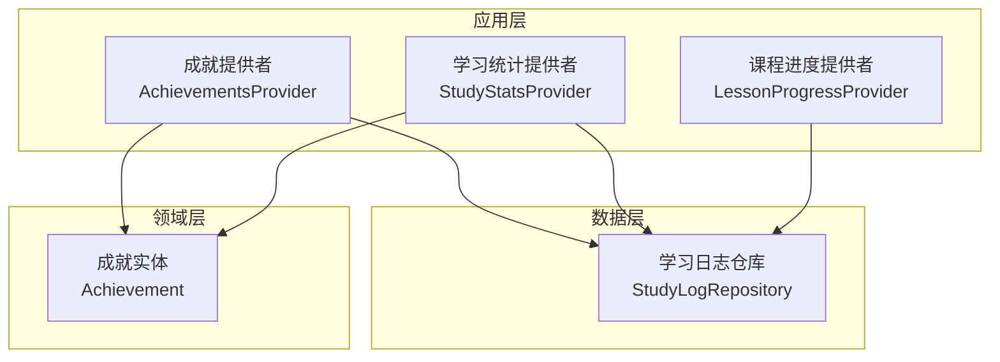
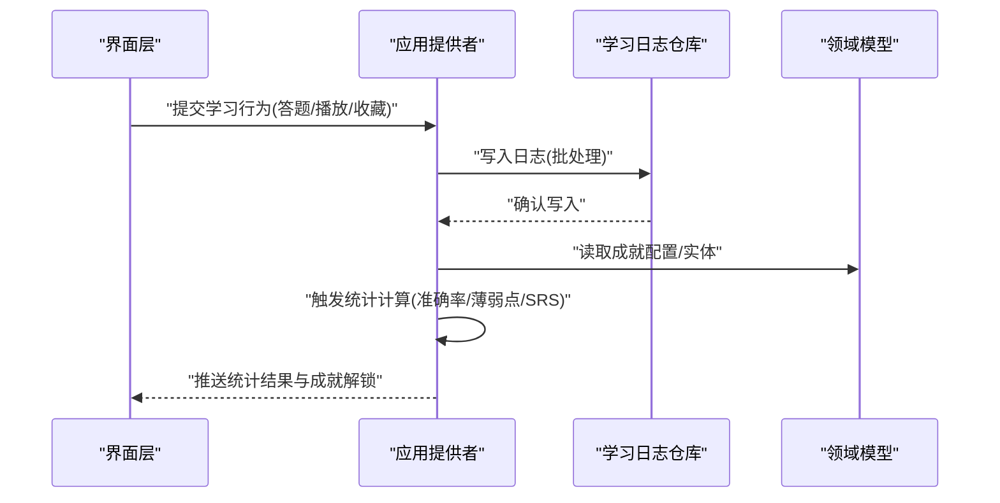
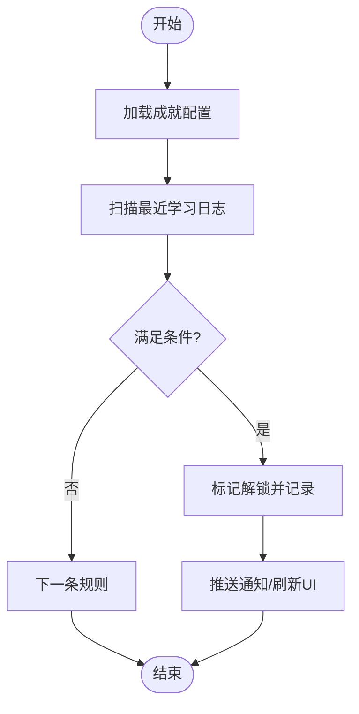
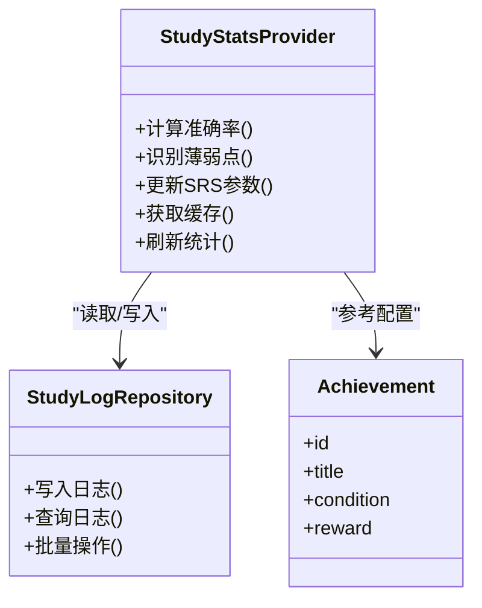
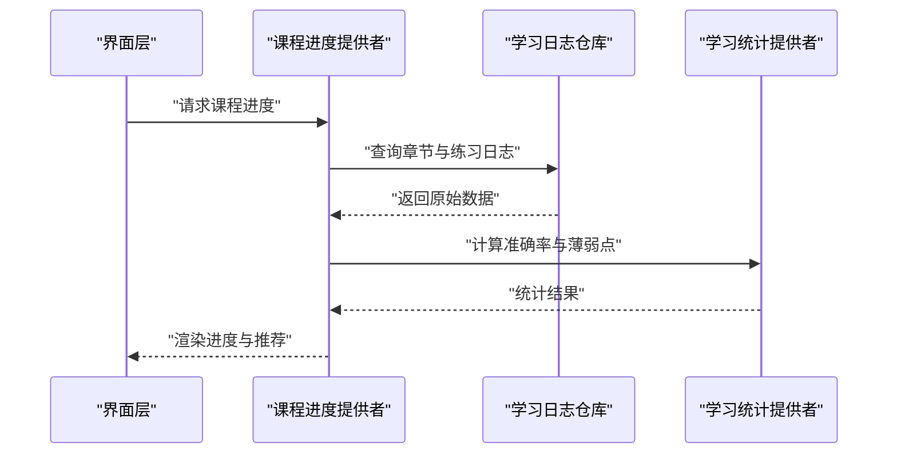
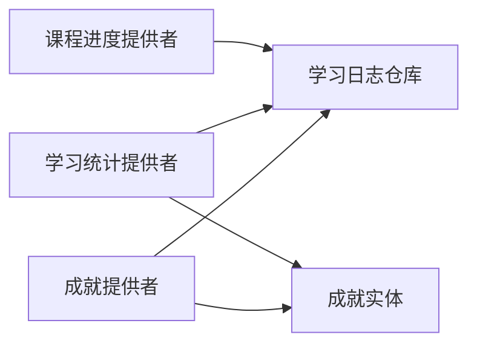

# 学习统计分析

<cite>
**本文引用的文件**   
- [lib/main.dart](file://lib/main.dart)
- [lib/application/achievements_provider.dart](file://lib/application/achievements_provider.dart)
- [lib/application/study_stats_provider.dart](file://lib/application/study_stats_provider.dart)
- [lib/application/lesson_progress_provider.dart](file://lib/application/lesson_progress_provider.dart)
- [lib/data/study_log_repository.dart](file://lib/data/study_log_repository.dart)
- [lib/domain/achievement.dart](file://lib/domain/achievement.dart)
- [test/application/achievements_provider_test.dart](file://test/application/achievements_provider_test.dart)
- [test/application/study_stats_accuracy_test.dart](file://test/application/study_stats_accuracy_test.dart)
- [test/application/study_stats_cache_test.dart](file://test/application/study_stats_cache_test.dart)
- [test/application/study_stats_weak_words_test.dart](file://test/application/study_stats_weak_words_test.dart)
- [test/core/achievement_config_test.dart](file://test/core/achievement_config_test.dart)
- [test/core/srs_test.dart](file://test/core/srs_test.dart)
- [test/data/study_log_repository_test.dart](file://test/data/study_log_repository_test.dart)
</cite>

## 目录
1. [简介](#简介)
2. [项目结构](#项目结构)
3. [核心组件](#核心组件)
4. [架构总览](#架构总览)
5. [详细组件分析](#详细组件分析)
6. [依赖关系分析](#依赖关系分析)
7. [性能考量](#性能考量)
8. [故障排查指南](#故障排查指南)
9. [结论](#结论)
10. [附录](#附录)

## 简介
本技术文档围绕 Varnamalaplus 的学习统计分析系统，系统性阐述以下能力：
- 学习进度跟踪：记录与聚合用户在学习过程中的行为数据，形成可度量的进度指标。
- 成就系统实现：基于规则与配置的成就判定、解锁与展示逻辑。
- 激励机制设计：通过成就、连续打卡、难度自适应等机制提升学习粘性。
- 数据统计收集与分析：采集原始交互日志，进行准确率、薄弱点识别、复习策略（SRS）计算等。
- 可视化展示逻辑：将统计结果以图表或概览形式呈现给学习者。
- 个性化学习路径生成：依据薄弱知识点与掌握程度动态推荐后续内容。
- 数据导出接口与报表生成：提供结构化导出能力，支持离线分析与汇报。
- 性能优化方案：缓存、批处理、异步计算与内存管理策略。

## 项目结构
Varnamalaplus 采用 Flutter 多端应用结构，统计分析相关代码主要分布在 application、data、domain 层以及对应的测试用例中。整体遵循分层架构：
- domain：领域模型（如成就实体）。
- data：数据访问与持久化（如学习日志仓库）。
- application：业务编排与状态管理（如成就提供者、学习统计提供者、课程进度提供者）。
- views：UI 展示层（不在本文重点范围内）。
- test：覆盖关键算法与流程的单元测试与集成测试。

**图示来源** 
- [lib/application/achievements_provider.dart](file://lib/application/achievements_provider.dart)
- [lib/application/study_stats_provider.dart](file://lib/application/study_stats_provider.dart)
- [lib/application/lesson_progress_provider.dart](file://lib/application/lesson_progress_provider.dart)
- [lib/data/study_log_repository.dart](file://lib/data/study_log_repository.dart)
- [lib/domain/achievement.dart](file://lib/domain/achievement.dart)

**章节来源**
- [lib/main.dart](file://lib/main.dart)

## 核心组件
- 成就提供者（AchievementsProvider）
  - 职责：维护成就配置、判定条件、解锁状态；对外暴露查询与刷新接口。
  - 关键点：成就规则引擎、批量更新、事件驱动刷新。
- 学习统计提供者（StudyStatsProvider）
  - 职责：聚合学习行为日志，计算准确率、复习间隔、薄弱词/语法点等；提供缓存与增量更新。
  - 关键点：统计窗口、滑动平均、错误模式识别、SRS 参数更新。
- 课程进度提供者（LessonProgressProvider）
  - 职责：追踪课程章节完成度、练习正确率、未掌握项；驱动学习路径推荐。
  - 关键点：进度快照、里程碑判定、推荐排序。
- 学习日志仓库（StudyLogRepository）
  - 职责：读写学习行为日志（答题、播放、收藏、纠错等），保障一致性与事务性。
  - 关键点：写入批处理、去重、时间索引、查询优化。
- 成就实体（Achievement）
  - 职责：定义成就元数据、解锁条件、奖励类型、显示信息。
  - 关键点：可扩展的条件表达式、版本兼容。

**章节来源**
- [lib/application/achievements_provider.dart](file://lib/application/achievements_provider.dart)
- [lib/application/study_stats_provider.dart](file://lib/application/study_stats_provider.dart)
- [lib/application/lesson_progress_provider.dart](file://lib/application/lesson_progress_provider.dart)
- [lib/data/study_log_repository.dart](file://lib/data/study_log_repository.dart)
- [lib/domain/achievement.dart](file://lib/domain/achievement.dart)

## 架构总览
统计分析系统采用“事件驱动 + 仓库抽象”的分层架构。学习行为由 UI 触发，经应用层提供者汇聚到数据层仓库持久化；统计计算在后台异步执行，结果通过缓存与状态流推送至视图层。

**图示来源** 
- [lib/application/achievements_provider.dart](file://lib/application/achievements_provider.dart)
- [lib/application/study_stats_provider.dart](file://lib/application/study_stats_provider.dart)
- [lib/data/study_log_repository.dart](file://lib/data/study_log_repository.dart)
- [lib/domain/achievement.dart](file://lib/domain/achievement.dart)

## 详细组件分析

### 成就系统（AchievementsProvider 与 Achievement）
- 成就判定流程
  - 输入：用户行为序列、当前成就配置、历史解锁状态。
  - 处理：按规则逐项评估（累计次数、连续天数、正确率阈值、特定题型命中等）。
  - 输出：新增已解锁成就列表、奖励通知。
- 数据结构与复杂度
  - 成就配置为 O(N) 规模，单次评估复杂度 O(N×M)，N 为成就数量，M 为规则项数。
  - 批量更新时采用增量扫描与缓存命中，降低重复计算。
- 错误处理
  - 规则解析失败回退到默认配置；解锁冲突采用幂等更新。

**图示来源** 
- [lib/application/achievements_provider.dart](file://lib/application/achievements_provider.dart)
- [lib/domain/achievement.dart](file://lib/domain/achievement.dart)

**章节来源**
- [lib/application/achievements_provider.dart](file://lib/application/achievements_provider.dart)
- [lib/domain/achievement.dart](file://lib/domain/achievement.dart)
- [test/application/achievements_provider_test.dart](file://test/application/achievements_provider_test.dart)
- [test/core/achievement_config_test.dart](file://test/core/achievement_config_test.dart)

### 学习统计（StudyStatsProvider）
- 统计维度
  - 准确率：按题型/知识点/时间段聚合。
  - 薄弱点：错误频率高、遗忘曲线陡峭的词汇或语法点。
  - SRS 参数：基于间隔重复算法调整复习周期。
- 算法要点
  - 滑动窗口统计减少长尾影响。
  - 错误模式聚类用于识别共性薄弱项。
  - SRS 使用 SM2 变体，结合用户实际表现动态调参。
- 缓存策略
  - 热点统计结果短期缓存，避免频繁重算。
  - 增量更新仅重算受影响窗口。

**图示来源** 
- [lib/application/study_stats_provider.dart](file://lib/application/study_stats_provider.dart)
- [lib/data/study_log_repository.dart](file://lib/data/study_log_repository.dart)
- [lib/domain/achievement.dart](file://lib/domain/achievement.dart)

**章节来源**
- [lib/application/study_stats_provider.dart](file://lib/application/study_stats_provider.dart)
- [test/application/study_stats_accuracy_test.dart](file://test/application/study_stats_accuracy_test.dart)
- [test/application/study_stats_cache_test.dart](file://test/application/study_stats_cache_test.dart)
- [test/application/study_stats_weak_words_test.dart](file://test/application/study_stats_weak_words_test.dart)
- [test/core/srs_test.dart](file://test/core/srs_test.dart)

### 课程进度（LessonProgressProvider）
- 进度追踪
  - 章节完成度、练习正确率、未掌握项清单。
  - 里程碑判定（例如连续正确、首次通关）。
- 推荐逻辑
  - 基于薄弱点与掌握度排序，优先推荐易错且重要的知识点。
  - 结合用户偏好与难度梯度，生成个性化学习路径。

**图示来源** 
- [lib/application/lesson_progress_provider.dart](file://lib/application/lesson_progress_provider.dart)
- [lib/data/study_log_repository.dart](file://lib/data/study_log_repository.dart)
- [lib/application/study_stats_provider.dart](file://lib/application/study_stats_provider.dart)

**章节来源**
- [lib/application/lesson_progress_provider.dart](file://lib/application/lesson_progress_provider.dart)

### 数据导出与报表
- 导出范围
  - 学习日志、统计摘要、成就解锁记录、课程进度快照。
- 格式与接口
  - JSON/CSV 导出，支持按时间范围、知识点、题型筛选。
  - 报表模板化，便于生成学习报告与教学反馈。
- 性能与安全
  - 大文件分块导出，避免内存溢出。
  - 脱敏与权限校验，确保数据安全。

[本节为概念性说明，不直接分析具体文件]

## 依赖关系分析
- 组件耦合
  - 应用层提供者依赖数据层仓库与领域模型，保持单向依赖。
  - 成就系统与统计模块共享日志仓库，避免重复 IO。
- 外部依赖
  - 本地存储（SQLite/文件）、序列化库、统计计算库。
- 循环依赖
  - 通过接口抽象与事件总线解耦，避免循环引用。

**图示来源** 
- [lib/application/achievements_provider.dart](file://lib/application/achievements_provider.dart)
- [lib/application/study_stats_provider.dart](file://lib/application/study_stats_provider.dart)
- [lib/application/lesson_progress_provider.dart](file://lib/application/lesson_progress_provider.dart)
- [lib/data/study_log_repository.dart](file://lib/data/study_log_repository.dart)
- [lib/domain/achievement.dart](file://lib/domain/achievement.dart)

**章节来源**
- [test/data/study_log_repository_test.dart](file://test/data/study_log_repository_test.dart)

## 性能考量
- 统计计算
  - 使用滑动窗口与增量更新，避免全量重算。
  - 热点结果缓存，设置 TTL 与失效策略。
- 数据写入
  - 批处理与事务合并，降低磁盘 IO。
  - 异步队列处理高频写入，防止阻塞主线程。
- 内存管理
  - 分页加载日志，限制单次查询规模。
  - 及时释放中间对象，避免 GC 抖动。
- 并发控制
  - 读写锁保护共享状态，保证一致性。
  - 任务调度器限流，避免资源争用。

[本节为通用指导，不直接分析具体文件]

## 故障排查指南
- 常见问题
  - 成就未解锁：检查规则配置与日志完整性；查看解锁幂等逻辑。
  - 统计异常：核对时间窗口与过滤条件；验证缓存一致性。
  - 导出失败：检查权限与存储空间；确认数据脱敏与格式转换。
- 调试建议
  - 启用详细日志，定位写入与查询瓶颈。
  - 使用测试用例复现问题，逐步缩小范围。
  - 监控关键指标（准确率、SRS 间隔、成就解锁率）。

**章节来源**
- [test/application/achievements_provider_test.dart](file://test/application/achievements_provider_test.dart)
- [test/application/study_stats_accuracy_test.dart](file://test/application/study_stats_accuracy_test.dart)
- [test/application/study_stats_cache_test.dart](file://test/application/study_stats_cache_test.dart)
- [test/application/study_stats_weak_words_test.dart](file://test/application/study_stats_weak_words_test.dart)
- [test/core/srs_test.dart](file://test/core/srs_test.dart)
- [test/data/study_log_repository_test.dart](file://test/data/study_log_repository_test.dart)

## 结论
Varnamalaplus 的学习统计分析系统通过清晰的分层架构与模块化设计，实现了学习进度跟踪、成就系统与个性化推荐的核心能力。借助统计缓存、批处理与异步计算，系统在准确性与性能之间取得平衡。未来可进一步扩展统计维度、增强推荐算法与完善报表体系，以提升用户体验与教学效果。

[本节为总结性内容，不直接分析具体文件]

## 附录
- 术语表
  - 学习日志：用户在学习过程中的行为记录（答题、播放、收藏等）。
  - 成就：基于规则的学习目标与奖励标识。
  - SRS：间隔重复学习算法，优化记忆效果。
  - 薄弱点：错误率高或遗忘速度快的知识点。
- 最佳实践
  - 统一事件命名与数据结构，便于跨模块协作。
  - 严格测试边界条件与异常路径，确保稳定性。
  - 定期审计统计口径与算法参数，保持结果可信。

[本节为补充信息，不直接分析具体文件]