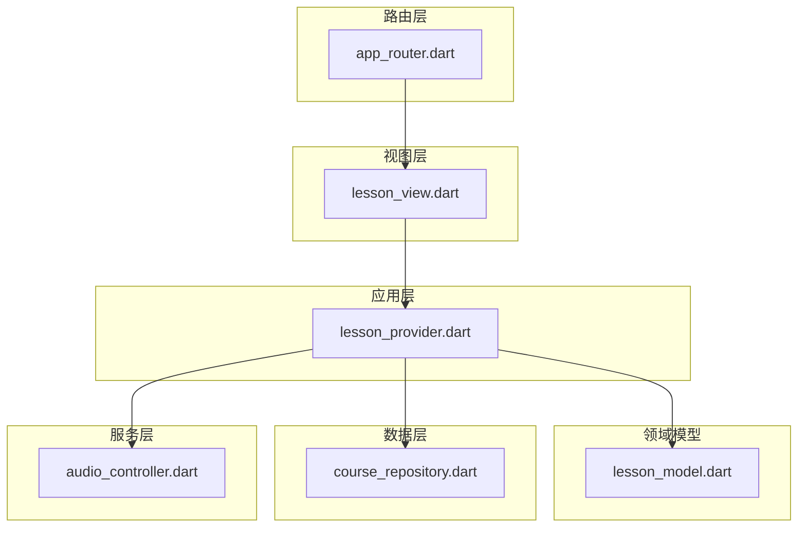
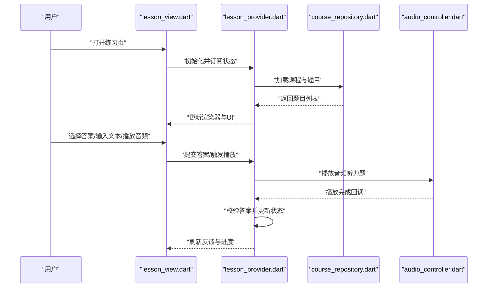
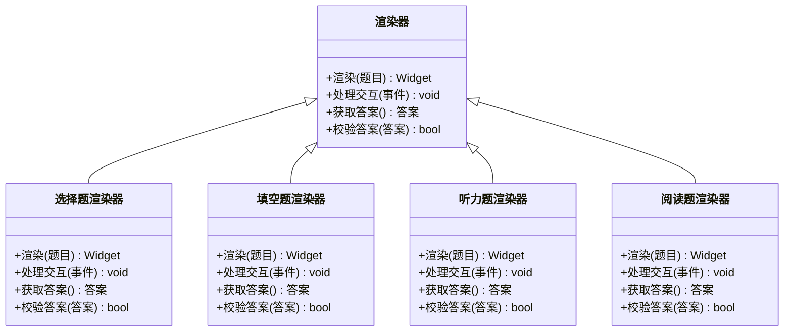
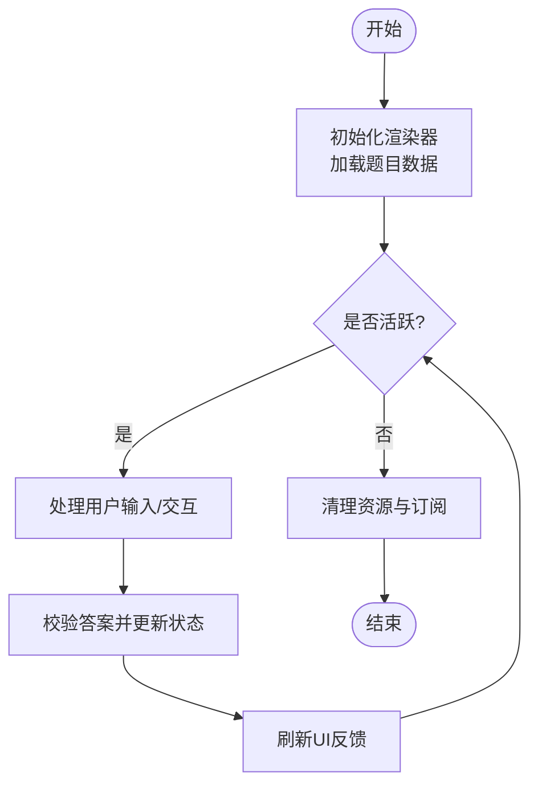
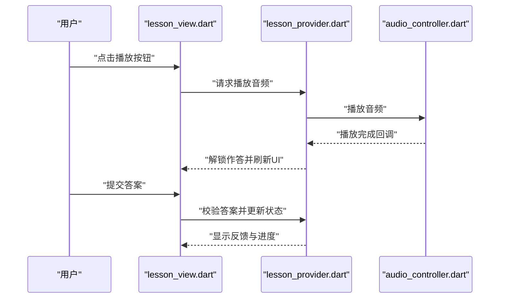
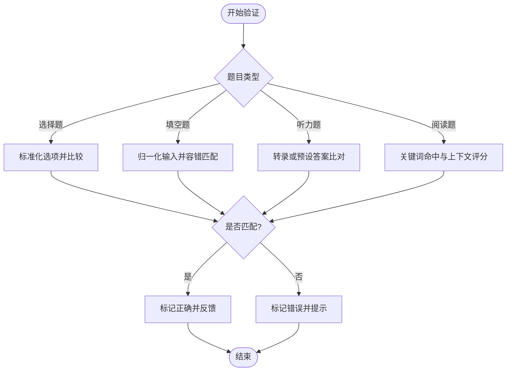
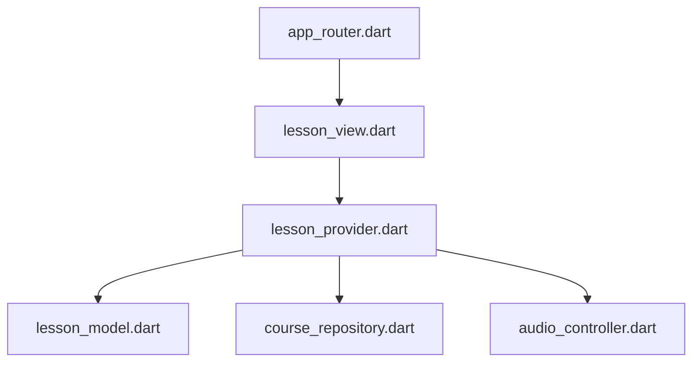

# 题型渲染器系统

<cite>
**本文引用的文件**   
- [lib/main.dart](file://lib/main.dart)
- [lib/views/lesson/lesson_view.dart](file://lib/views/lesson/lesson_view.dart)
- [lib/application/lesson_provider.dart](file://lib/application/lesson_provider.dart)
- [lib/domain/course/lesson_model.dart](file://lib/domain/course/lesson_model.dart)
- [lib/data/course_repository.dart](file://lib/data/course_repository.dart)
- [lib/service/audio_controller.dart](file://lib/service/audio_controller.dart)
- [lib/routing/app_router.dart](file://lib/routing/app_router.dart)
- [test/integration/lesson_flow_test.dart](file://test/integration/lesson_flow_test.dart)
- [test/views/lesson/lesson_view_test.dart](file://test/views/lesson/lesson_view_test.dart)
- [docs/authoring/lesson-type-templates.md](file://docs/authoring/lesson-type-templates.md)
</cite>

## 目录
1. [简介](#简介)
2. [项目结构](#项目结构)
3. [核心组件](#核心组件)
4. [架构总览](#架构总览)
5. [详细组件分析](#详细组件分析)
6. [依赖关系分析](#依赖关系分析)
7. [性能考量](#性能考量)
8. [故障排查指南](#故障排查指南)
9. [结论](#结论)
10. [附录](#附录)

## 简介
本技术文档围绕 Varnamalaplus 的“题型渲染器系统”展开，聚焦选择题、填空题、听力题、阅读题等常见题型的渲染机制、交互处理与答案验证逻辑。文档同时覆盖渲染器的生命周期管理、事件处理流程、状态同步机制，并提供自定义题型开发指南、样式定制方案与性能优化技巧。最后给出常见问题排查方法与调试工具使用建议，帮助开发者快速定位问题并提升渲染质量与性能。

## 项目结构
本项目采用 Flutter 多端架构，核心代码位于 lib 目录，按 application、core、courses、data、di、domain、routing、service、views 分层组织。题型渲染相关的关键路径包括：
- 视图层：lesson_view.dart 负责课程练习页面的 UI 渲染与用户交互
- 应用层：lesson_provider.dart 管理练习数据、题目状态与业务逻辑
- 领域模型：lesson_model.dart 定义题目数据结构与类型
- 数据层：course_repository.dart 提供课程与题目的加载与缓存
- 服务层：audio_controller.dart 负责音频播放控制（听力题）
- 路由层：app_router.dart 管理页面跳转与参数传递
- 测试：integration/lesson_flow_test.dart 与 views/lesson/lesson_view_test.dart 覆盖端到端与视图行为

图表来源
- [lib/views/lesson/lesson_view.dart](file://lib/views/lesson/lesson_view.dart)
- [lib/application/lesson_provider.dart](file://lib/application/lesson_provider.dart)
- [lib/domain/course/lesson_model.dart](file://lib/domain/course/lesson_model.dart)
- [lib/data/course_repository.dart](file://lib/data/course_repository.dart)
- [lib/service/audio_controller.dart](file://lib/service/audio_controller.dart)
- [lib/routing/app_router.dart](file://lib/routing/app_router.dart)

章节来源
- [lib/main.dart:1-50](file://lib/main.dart#L1-L50)
- [lib/views/lesson/lesson_view.dart:1-120](file://lib/views/lesson/lesson_view.dart#L1-L120)
- [lib/application/lesson_provider.dart:1-150](file://lib/application/lesson_provider.dart#L1-L150)
- [lib/domain/course/lesson_model.dart:1-100](file://lib/domain/course/lesson_model.dart#L1-L100)
- [lib/data/course_repository.dart:1-120](file://lib/data/course_repository.dart#L1-L120)
- [lib/service/audio_controller.dart:1-100](file://lib/service/audio_controller.dart#L1-L100)
- [lib/routing/app_router.dart:1-80](file://lib/routing/app_router.dart#L1-L80)

## 核心组件
- 渲染器（Renderer）：根据题目类型（选择题、填空题、听力题、阅读题等）选择对应渲染策略，生成 UI 组件并绑定交互事件
- 状态管理器（Provider）：维护当前题目索引、用户答案、校验结果、进度与计时等状态，驱动视图更新
- 数据仓库（Repository）：从本地或网络加载课程与题目数据，提供缓存与错误恢复
- 音频控制器（AudioController）：统一控制音频播放、暂停、重试与音量设置，适配不同平台
- 路由（Router）：管理进入练习页的参数（课程ID、题目索引）、返回与导航栈

章节来源
- [lib/views/lesson/lesson_view.dart:1-120](file://lib/views/lesson/lesson_view.dart#L1-L120)
- [lib/application/lesson_provider.dart:1-150](file://lib/application/lesson_provider.dart#L1-L150)
- [lib/data/course_repository.dart:1-120](file://lib/data/course_repository.dart#L1-L120)
- [lib/service/audio_controller.dart:1-100](file://lib/service/audio_controller.dart#L1-L100)
- [lib/routing/app_router.dart:1-80](file://lib/routing/app_router.dart#L1-L80)

## 架构总览
题型渲染器系统遵循 MVVM + Provider 模式：
- 视图层（View）：Flutter Widget 树，负责展示与用户交互
- 视图模型（ViewModel/Provider）：封装业务逻辑与状态，响应交互并更新状态
- 领域模型（Model）：题目数据结构与类型枚举
- 数据访问（Repository）：抽象数据源，屏蔽实现细节
- 服务（Service）：音频、网络、存储等横切能力

图表来源
- [lib/views/lesson/lesson_view.dart:1-120](file://lib/views/lesson/lesson_view.dart#L1-L120)
- [lib/application/lesson_provider.dart:1-150](file://lib/application/lesson_provider.dart#L1-L150)
- [lib/data/course_repository.dart:1-120](file://lib/data/course_repository.dart#L1-L120)
- [lib/service/audio_controller.dart:1-100](file://lib/service/audio_controller.dart#L1-L100)

## 详细组件分析

### 渲染器与题型策略
- 选择题：渲染选项列表，支持单选/多选；点击后即时反馈正确性，支持撤销与重选
- 填空题：渲染输入框与提示；支持自动补全、拼写检查与容错匹配
- 听力题：渲染音频控件与问题描述；播放完成后允许作答，支持重复播放
- 阅读题：渲染长文本与高亮关键词；支持折叠/展开、搜索与笔记标注

图表来源
- [lib/views/lesson/lesson_view.dart:1-120](file://lib/views/lesson/lesson_view.dart#L1-L120)
- [lib/application/lesson_provider.dart:1-150](file://lib/application/lesson_provider.dart#L1-L150)
- [lib/domain/course/lesson_model.dart:1-100](file://lib/domain/course/lesson_model.dart#L1-L100)

章节来源
- [lib/views/lesson/lesson_view.dart:1-120](file://lib/views/lesson/lesson_view.dart#L1-L120)
- [lib/application/lesson_provider.dart:1-150](file://lib/application/lesson_provider.dart#L1-L150)
- [lib/domain/course/lesson_model.dart:1-100](file://lib/domain/course/lesson_model.dart#L1-L100)

### 生命周期管理与状态同步
- 初始化：Provider 加载题目数据，渲染器根据题目类型创建对应 Widget
- 活跃期：监听用户交互，更新答案与校验状态，驱动 UI 刷新
- 暂停/销毁：清理音频资源、取消订阅、释放内存
- 状态同步：通过 Provider 的状态变更通知视图层，保证 UI 与数据一致

图表来源
- [lib/application/lesson_provider.dart:1-150](file://lib/application/lesson_provider.dart#L1-L150)
- [lib/views/lesson/lesson_view.dart:1-120](file://lib/views/lesson/lesson_view.dart#L1-L120)

章节来源
- [lib/application/lesson_provider.dart:1-150](file://lib/application/lesson_provider.dart#L1-L150)
- [lib/views/lesson/lesson_view.dart:1-120](file://lib/views/lesson/lesson_view.dart#L1-L120)

### 事件处理流程
- 选择题：点击选项 -> 记录选择 -> 立即校验 -> 显示对错反馈 -> 允许修改
- 填空题：输入文本 -> 实时校验（可选）-> 提交时最终校验 -> 显示反馈
- 听力题：点击播放 -> 播放中禁用作答 -> 播放结束解锁作答 -> 提交答案
- 阅读题：切换段落/高亮 -> 记录阅读进度 -> 支持跳转到指定位置

图表来源
- [lib/views/lesson/lesson_view.dart:1-120](file://lib/views/lesson/lesson_view.dart#L1-L120)
- [lib/application/lesson_provider.dart:1-150](file://lib/application/lesson_provider.dart#L1-L150)
- [lib/service/audio_controller.dart:1-100](file://lib/service/audio_controller.dart#L1-L100)

章节来源
- [lib/views/lesson/lesson_view.dart:1-120](file://lib/views/lesson/lesson_view.dart#L1-L120)
- [lib/application/lesson_provider.dart:1-150](file://lib/application/lesson_provider.dart#L1-L150)
- [lib/service/audio_controller.dart:1-100](file://lib/service/audio_controller.dart#L1-L100)

### 答案验证逻辑
- 选择题：精确匹配选项内容或标准化后比较（忽略大小写、空白）
- 填空题：支持模糊匹配、同义词替换、拼写容错（编辑距离阈值）
- 听力题：基于语音转文本或预设答案进行比对
- 阅读题：基于关键词命中与上下文匹配度评分

图表来源
- [lib/application/lesson_provider.dart:1-150](file://lib/application/lesson_provider.dart#L1-L150)
- [lib/domain/course/lesson_model.dart:1-100](file://lib/domain/course/lesson_model.dart#L1-L100)

章节来源
- [lib/application/lesson_provider.dart:1-150](file://lib/application/lesson_provider.dart#L1-L150)
- [lib/domain/course/lesson_model.dart:1-100](file://lib/domain/course/lesson_model.dart#L1-L100)

### 自定义题型开发指南
- 扩展题目模型：在领域模型中添加新题型枚举与字段
- 实现渲染器：继承基础渲染器，实现渲染、交互与验证方法
- 注册策略：在渲染器工厂中注册新题型到对应渲染器
- 样式定制：通过主题配置与 Widget 组合实现外观定制
- 测试覆盖：编写单元测试与集成测试确保稳定性

章节来源
- [lib/domain/course/lesson_model.dart:1-100](file://lib/domain/course/lesson_model.dart#L1-L100)
- [lib/views/lesson/lesson_view.dart:1-120](file://lib/views/lesson/lesson_view.dart#L1-L120)
- [docs/authoring/lesson-type-templates.md:1-100](file://docs/authoring/lesson-type-templates.md#L1-L100)

### 样式定制方案
- 主题配置：集中管理颜色、字体、间距与动画时长
- 组件组合：通过组合基础组件构建复杂 UI，避免硬编码样式
- 动态主题：支持明暗模式与语言切换时的样式自适应
- 性能优化：减少不必要的重建，使用 const 与 key 优化渲染

章节来源
- [lib/views/lesson/lesson_view.dart:1-120](file://lib/views/lesson/lesson_view.dart#L1-L120)
- [lib/application/lesson_provider.dart:1-150](file://lib/application/lesson_provider.dart#L1-L150)

## 依赖关系分析
- 视图层依赖应用层 Provider，用于状态管理与业务逻辑
- Provider 依赖领域模型与数据仓库，用于数据访问与状态计算
- Provider 依赖音频服务，用于听力题的音频播放
- 路由层负责页面导航与参数传递，不直接依赖渲染逻辑

图表来源
- [lib/views/lesson/lesson_view.dart:1-120](file://lib/views/lesson/lesson_view.dart#L1-L120)
- [lib/application/lesson_provider.dart:1-150](file://lib/application/lesson_provider.dart#L1-L150)
- [lib/domain/course/lesson_model.dart:1-100](file://lib/domain/course/lesson_model.dart#L1-L100)
- [lib/data/course_repository.dart:1-120](file://lib/data/course_repository.dart#L1-L120)
- [lib/service/audio_controller.dart:1-100](file://lib/service/audio_controller.dart#L1-L100)
- [lib/routing/app_router.dart:1-80](file://lib/routing/app_router.dart#L1-L80)

章节来源
- [lib/views/lesson/lesson_view.dart:1-120](file://lib/views/lesson/lesson_view.dart#L1-L120)
- [lib/application/lesson_provider.dart:1-150](file://lib/application/lesson_provider.dart#L1-L150)
- [lib/data/course_repository.dart:1-120](file://lib/data/course_repository.dart#L1-L120)
- [lib/service/audio_controller.dart:1-100](file://lib/service/audio_controller.dart#L1-L100)
- [lib/routing/app_router.dart:1-80](file://lib/routing/app_router.dart#L1-L80)

## 性能考量
- 渲染优化：使用 ListView.builder 与分页加载，避免一次性渲染大量题目
- 状态管理：合理拆分 Provider，减少不必要的状态更新与重建
- 音频处理：预加载音频、复用播放器实例，避免频繁创建销毁
- 内存管理：及时释放图片、音频等资源，防止内存泄漏
- 网络优化：启用缓存与断点续传，提升加载速度与稳定性

[本节为通用指导，不直接分析具体文件]

## 故障排查指南
- 渲染异常：检查题目模型字段是否完整，渲染器是否正确处理空值
- 交互无响应：确认事件绑定与状态更新逻辑，查看日志输出
- 音频播放失败：检查音频文件路径、权限与格式兼容性
- 答案验证错误：核对验证规则与数据预处理逻辑
- 性能卡顿：使用性能分析工具定位瓶颈，优化渲染与计算

章节来源
- [test/integration/lesson_flow_test.dart:1-100](file://test/integration/lesson_flow_test.dart#L1-L100)
- [test/views/lesson/lesson_view_test.dart:1-100](file://test/views/lesson/lesson_view_test.dart#L1-L100)

## 结论
题型渲染器系统通过清晰的架构设计与模块化实现，支持多种题型的灵活渲染与交互。结合 Provider 状态管理与 Repository 数据访问，保证了良好的可维护性与扩展性。开发者可通过自定义渲染器与样式定制满足多样化需求，同时借助性能优化与故障排查指南提升用户体验与开发效率。

[本节为总结性内容，不直接分析具体文件]

## 附录
- 术语表：渲染器、Provider、Repository、音频控制器、路由等
- 最佳实践：组件拆分、状态管理、错误处理与测试策略
- 参考链接：官方文档、社区资源与示例项目

[本节为补充信息，不直接分析具体文件]