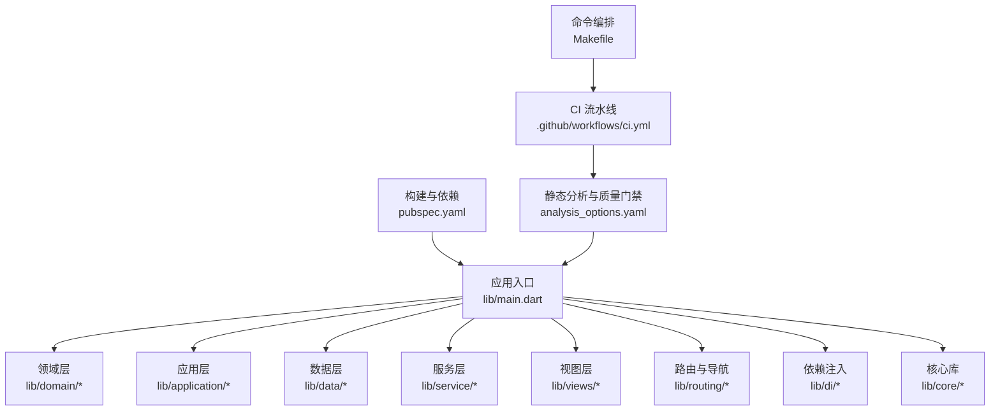
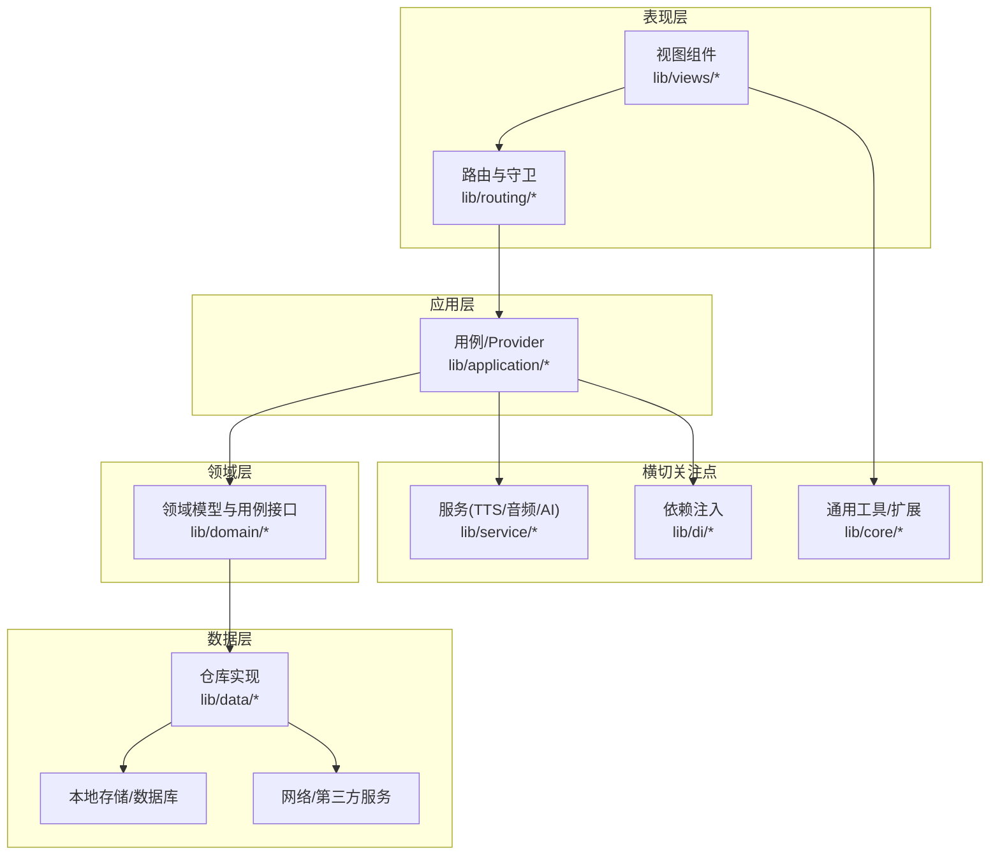
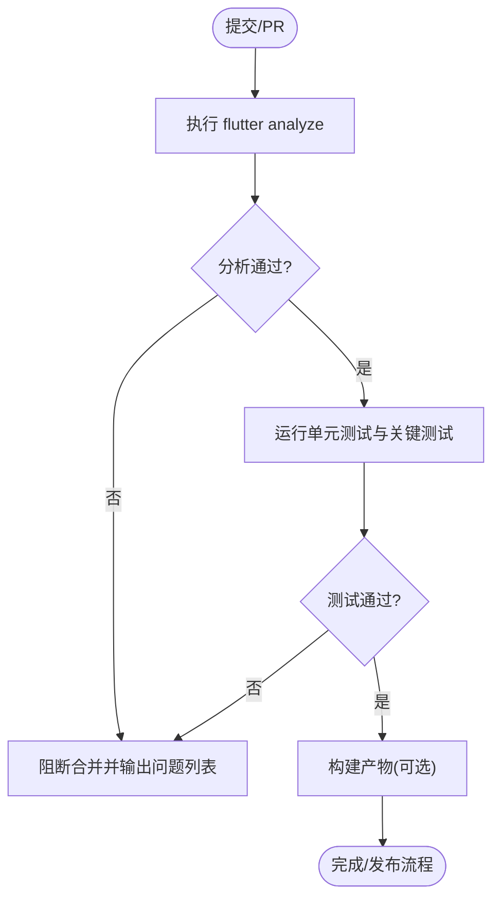
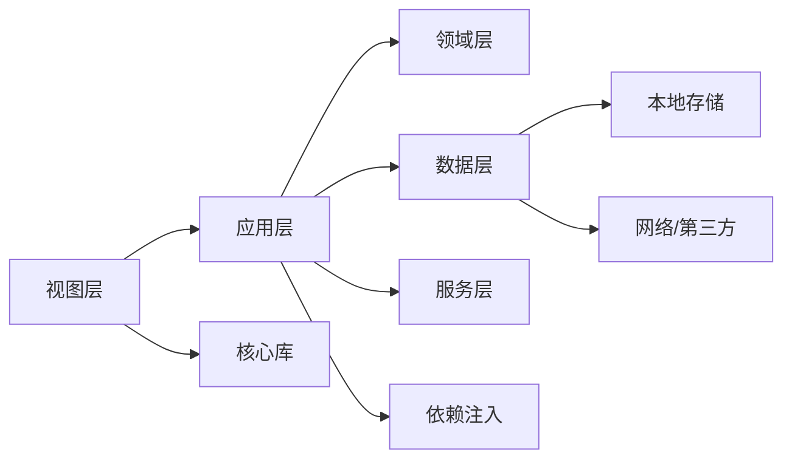

# 代码规范与最佳实践

<cite>
**本文引用的文件**   
- [analysis_options.yaml](file://analysis_options.yaml)
- [pubspec.yaml](file://pubspec.yaml)
- [main.dart](file://lib/main.dart)
- [Makefile](file://Makefile)
- [.github/workflows/ci.yml](file://.github/workflows/ci.yml)
- [README.md](file://README.md)
</cite>

## 目录
1. [简介](#简介)
2. [项目结构](#项目结构)
3. [核心组件](#核心组件)
4. [架构总览](#架构总览)
5. [详细组件分析](#详细组件分析)
6. [依赖分析](#依赖分析)
7. [性能考虑](#性能考虑)
8. [故障排查指南](#故障排查指南)
9. [结论](#结论)
10. [附录](#附录)

## 简介
本文件为 Varnamalaplus 项目的代码规范与最佳实践指南，面向 Dart/Flutter 开发团队。内容覆盖：
- 代码风格与命名约定
- 文件组织结构
- 分析选项配置、静态检查规则与质量门禁
- 错误处理模式与异步编程最佳实践
- 状态管理约定
- 代码审查清单
- 性能优化建议与内存管理指南
- 测试编写规范、文档注释标准与 Git 提交信息格式

目标是通过统一规范提升可读性、可维护性与交付质量，降低回归风险并提高团队协作效率。

## 项目结构
Varnamalaplus 采用 Flutter 多平台工程结构，核心业务代码位于 lib 目录，按职责分层组织（application、core、courses、data、di、domain、routing、service、views）。工具脚本与资源分别位于 tool 与 assets 目录。CI 流水线与质量门禁通过 GitHub Actions 与 Makefile 驱动。

图表来源 
- [main.dart:1-200](file://lib/main.dart#L1-L200)
- [pubspec.yaml:1-200](file://pubspec.yaml#L1-L200)
- [analysis_options.yaml:1-200](file://analysis_options.yaml#L1-L200)
- [.github/workflows/ci.yml:1-200](file://.github/workflows/ci.yml#L1-L200)
- [Makefile:1-200](file://Makefile#L1-L200)

章节来源
- [README.md:1-200](file://README.md#L1-L200)
- [pubspec.yaml:1-200](file://pubspec.yaml#L1-L200)

## 核心组件
- 应用入口与初始化：负责启动 Flutter 引擎、注册全局主题、路由与依赖注入容器，确保应用环境就绪。
- 领域模型与用例：定义课程、学习进度、SRS、成就等核心实体与用例接口，保持业务逻辑与 UI 解耦。
- 数据访问与持久化：封装数据库与本地存储，提供仓库抽象，屏蔽底层实现细节。
- 服务与外部集成：TTS、音频播放、网络请求、AI 能力等跨功能服务。
- 视图与交互：页面级组件与小组件，遵循单一职责与可组合原则。
- 路由与导航：集中式路由表与守卫逻辑，保证页面跳转安全与参数校验。
- 依赖注入：统一的 DI 容器，管理服务生命周期与作用域。

章节来源
- [main.dart:1-200](file://lib/main.dart#L1-L200)

## 架构总览
本项目采用分层架构与依赖倒置原则，UI 层仅依赖应用层，应用层依赖领域层，数据层通过仓库接口被上层消费。静态分析由 analysis_options.yaml 统一约束，CI 在每次提交时执行 lint、测试与构建任务，形成质量门禁。

图表来源 
- [main.dart:1-200](file://lib/main.dart#L1-L200)
- [pubspec.yaml:1-200](file://pubspec.yaml#L1-L200)

## 详细组件分析

### 静态分析与质量门禁
- 分析选项：通过 analysis_options.yaml 启用严格规则集，统一 lint 行为，禁止危险 API，强制类型推断与空安全。
- CI 门禁：GitHub Actions 在 PR 与推送时运行 flutter analyze、单元测试与关键集成测试，失败则阻断合并。
- 命令编排：Makefile 提供一键 lint、test、build 等常用命令，减少环境差异。

图表来源 
- [analysis_options.yaml:1-200](file://analysis_options.yaml#L1-L200)
- [.github/workflows/ci.yml:1-200](file://.github/workflows/ci.yml#L1-L200)
- [Makefile:1-200](file://Makefile#L1-L200)

章节来源
- [analysis_options.yaml:1-200](file://analysis_options.yaml#L1-L200)
- [.github/workflows/ci.yml:1-200](file://.github/workflows/ci.yml#L1-L200)
- [Makefile:1-200](file://Makefile#L1-L200)

### 错误处理模式
- 统一结果类型：使用 Result/ResultLike 模式表达成功与失败，避免异常滥用。
- 异常边界：仅在不可恢复或框架级别抛出异常；业务层返回明确错误码与消息。
- 日志与上报：关键路径记录结构化日志，生产环境脱敏敏感信息。
- 用户反馈：对 UI 层提供友好提示，避免崩溃与白屏。

章节来源
- [analysis_options.yaml:1-200](file://analysis_options.yaml#L1-L200)

### 异步编程最佳实践
- Future/Stream：优先使用 async/await 与 StreamBuilder，避免嵌套回调地狱。
- 取消与超时：对外部 IO 设置合理超时，监听取消信号释放资源。
- 背压与节流：高频事件使用防抖/节流，避免 UI 卡顿。
- 错误传播：在调用链中尽早捕获并转换错误，保持上层语义清晰。

章节来源
- [analysis_options.yaml:1-200](file://analysis_options.yaml#L1-L200)

### 状态管理约定
- Provider/Riverpod/Bloc：根据复杂度选择合适方案，保持状态单向流动。
- 不可变更新：使用不可变数据结构与纯函数更新状态，便于测试与调试。
- 局部与全局：区分页面级状态与应用级状态，避免过度共享。
- 序列化：持久化前进行版本兼容与迁移策略设计。

章节来源
- [pubspec.yaml:1-200](file://pubspec.yaml#L1-L200)

### 文件组织结构
- 按功能与层次划分：domain、application、data、service、views、routing、di、core。
- 小文件优先：单文件聚焦单一职责，便于定位与维护。
- 命名一致：类名大驼峰，变量/方法小驼峰，常量全大写加下划线。
- 资源隔离：assets 按语言/模块分组，避免冲突。

章节来源
- [pubspec.yaml:1-200](file://pubspec.yaml#L1-L200)

### 代码审查清单
- 可读性：命名清晰、注释必要且准确、无冗余逻辑。
- 正确性：边界条件、空值、异常路径均已覆盖。
- 性能：避免重复计算、不必要的重建、内存泄漏。
- 安全性：敏感信息不落地、权限最小化。
- 可测性：可独立测试、Mock 清晰、覆盖率达标。
- 一致性：遵循本规范与现有代码风格。

章节来源
- [analysis_options.yaml:1-200](file://analysis_options.yaml#L1-L200)

### 性能优化建议与内存管理
- 渲染优化：合理使用 const、RepaintBoundary、ListView.builder。
- 计算优化：缓存昂贵计算结果，避免主线程阻塞。
- 资源管理：及时释放图片、音频、流订阅与定时器。
- 内存监控：使用 DevTools 检测内存增长与泄漏。

章节来源
- [pubspec.yaml:1-200](file://pubspec.yaml#L1-L200)

### 测试编写规范
- 单元/集成/黄金测试：分层覆盖，关键路径必测。
- 测试数据：使用工厂与种子数据，避免硬编码。
- Mock 策略：隔离外部依赖，保证确定性。
- 持续验证：CI 自动执行，失败即阻断。

章节来源
- [.github/workflows/ci.yml:1-200](file://.github/workflows/ci.yml#L1-L200)

### 文档注释标准
- 公共 API：包含用途、参数、返回值、异常说明。
- 复杂逻辑：解释动机与约束，而非复述代码。
- 示例：提供最小可运行示例链接或片段路径。

章节来源
- [analysis_options.yaml:1-200](file://analysis_options.yaml#L1-L200)

### Git 提交信息格式
- 类型：feat、fix、docs、style、refactor、perf、test、chore、revert
- 范围：模块/文件/功能域
- 描述：简洁明了，动词开头，不超过 72 字符
- 正文：必要时补充动机与影响面
- 关联：引用 Issue/PR 编号

章节来源
- [.github/workflows/ci.yml:1-200](file://.github/workflows/ci.yml#L1-L200)

## 依赖分析
- 内部依赖：应用层依赖领域与数据抽象，视图层仅依赖应用与核心工具。
- 外部依赖：通过 pubspec.yaml 声明，按需引入，避免臃肿。
- 循环依赖：严禁跨层反向依赖，使用接口与 DI 解耦。
- 版本锁定：使用 pubspec.lock 固定依赖版本，确保可重现构建。

图表来源 
- [pubspec.yaml:1-200](file://pubspec.yaml#L1-L200)

章节来源
- [pubspec.yaml:1-200](file://pubspec.yaml#L1-L200)

## 性能考虑
- 构建优化：按需编译、关闭无用特性、使用 release 模式。
- 运行时优化：减少 rebuild、懒加载、分页与虚拟列表。
- 资源优化：压缩图片与音频、按需下载、缓存策略。
- 监控与度量：埋点关键指标，定期复盘瓶颈。

[本节为通用指导，无需特定文件来源]

## 故障排查指南
- 常见问题：分析失败、测试不稳定、构建超时、内存泄漏。
- 定位步骤：查看 CI 日志、复现步骤、缩小范围、添加断言与日志。
- 修复策略：最小变更、回归测试、灰度发布。
- 预防机制：加强 lint、增加覆盖率、完善错误处理。

章节来源
- [analysis_options.yaml:1-200](file://analysis_options.yaml#L1-L200)
- [.github/workflows/ci.yml:1-200](file://.github/workflows/ci.yml#L1-L200)

## 结论
通过统一的代码规范、严格的静态分析与质量门禁、清晰的架构分层与最佳实践，Varnamalaplus 能够在快速迭代的同时保持高质量与高稳定性。建议团队在日常开发中严格执行本规范，并结合 CI 与代码审查持续改进。

[本节为总结性内容，无需特定文件来源]

## 附录
- 参考命令：lint、test、build、analyze
- 参考配置：analysis_options.yaml、pubspec.yaml
- 参考流水线：.github/workflows/ci.yml
- 参考入口：lib/main.dart

章节来源
- [Makefile:1-200](file://Makefile#L1-L200)
- [analysis_options.yaml:1-200](file://analysis_options.yaml#L1-L200)
- [pubspec.yaml:1-200](file://pubspec.yaml#L1-L200)
- [.github/workflows/ci.yml:1-200](file://.github/workflows/ci.yml#L1-L200)
- [main.dart:1-200](file://lib/main.dart#L1-L200)