# 开发工作流程

<cite>
**本文引用的文件**   
- [Makefile](file://Makefile)
- [README.md](file://README.md)
- [pubspec.yaml](file://pubspec.yaml)
- [analysis_options.yaml](file://analysis_options.yaml)
- [build.yaml](file://build.yaml)
- [devtools_options.yaml](file://devtools_options.yaml)
- [.github/workflows/ci.yml](file://.github/workflows/ci.yml)
- [android/build.gradle](file://android/build.gradle)
- [android/app/build.gradle](file://android/app/build.gradle)
- [android/gradle.properties](file://android/gradle.properties)
- [android/gradle/wrapper/gradle-wrapper.properties](file://android/gradle/wrapper/gradle-wrapper.properties)
- [ios/Podfile](file://ios/Podfile)
- [macos/Podfile](file://macos/Podfile)
- [linux/CMakeLists.txt](file://linux/CMakeLists.txt)
- [windows/CMakeLists.txt](file://windows/CMakeLists.txt)
- [web/index.html](file://web/index.html)
- [tool/build_release.py](file://tool/build_release.py)
- [tool/course_cli.py](file://tool/course_cli.py)
- [tool/generate_audio.py](file://tool/generate_audio.py)
- [tool/split_course.py](file://tool/split_course.py)
- [tool/mix_listening_a1.py](file://tool/mix_listening_a1.py)
- [tool/export_content_inventory.py](file://tool/export_content_inventory.py)
- [lib/main.dart](file://lib/main.dart)
</cite>

## 目录
1. [简介](#简介)
2. [项目结构](#项目结构)
3. [核心组件](#核心组件)
4. [架构总览](#架构总览)
5. [详细组件分析](#详细组件分析)
6. [依赖分析](#依赖分析)
7. [性能考虑](#性能考虑)
8. [故障排查指南](#故障排查指南)
9. [结论](#结论)
10. [附录](#附录)

## 简介
本文件面向 Varnamalaplus 项目的开发者，提供从本地环境搭建、依赖管理、构建与发布，到 Git 分支策略、CI/CD 流水线以及多平台打包的完整工作流说明。文档同时覆盖 Makefile 命令、自动化脚本使用、Flutter 工具链配置、热重载与调试技巧，帮助团队高效协作与稳定交付。

## 项目结构
Varnamalaplus 是一个基于 Flutter 的多端应用工程，包含 Android、iOS、Web、Linux、Windows、macOS 等目标平台。根目录通过 Makefile 统一编排常用任务；tool 目录下集中了内容处理与构建辅助脚本；lib 为 Dart 源码；各平台目录分别维护原生构建配置。

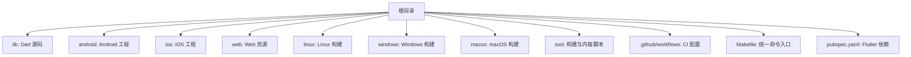

**图示来源** 
- [Makefile](file://Makefile)
- [pubspec.yaml](file://pubspec.yaml)
- [android/build.gradle](file://android/build.gradle)
- [ios/Podfile](file://ios/Podfile)
- [linux/CMakeLists.txt](file://linux/CMakeLists.txt)
- [windows/CMakeLists.txt](file://windows/CMakeLists.txt)
- [web/index.html](file://web/index.html)

**章节来源**
- [README.md](file://README.md)
- [Makefile](file://Makefile)
- [pubspec.yaml](file://pubspec.yaml)

## 核心组件
- 构建与任务编排：Makefile 作为统一入口，封装 Flutter、Android、iOS、Web、Desktop 的常用操作（如获取依赖、运行、测试、构建产物）。
- 依赖管理：pubspec.yaml 管理 Dart/Flutter 包；Android 使用 Gradle；iOS/macOS 使用 CocoaPods；Linux/Windows 使用 CMake。
- 自动化脚本：tool 目录下的 Python 脚本用于内容生成、音频处理、课程拆分与导出清单等。
- 代码质量与分析：analysis_options.yaml 定义静态分析与格式化规则；build.yaml 控制构建行为；devtools_options.yaml 配置 DevTools。
- 入口与应用初始化：lib/main.dart 为应用启动入口。

**章节来源**
- [Makefile](file://Makefile)
- [pubspec.yaml](file://pubspec.yaml)
- [analysis_options.yaml](file://analysis_options.yaml)
- [build.yaml](file://build.yaml)
- [devtools_options.yaml](file://devtools_options.yaml)
- [lib/main.dart](file://lib/main.dart)

## 架构总览
下图展示本地开发与 CI 的整体流程：开发者通过 Makefile 触发任务，Flutter 负责跨平台编译，Android/iOS 使用各自工具链，Python 脚本在构建前后进行数据处理，GitHub Actions 执行 CI 检查与构建。

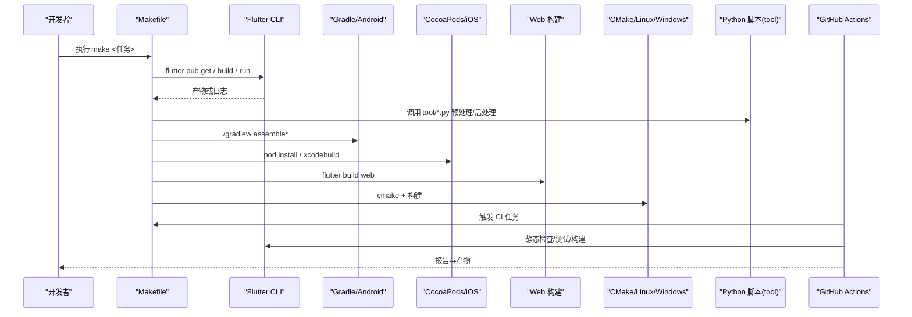

**图示来源** 
- [Makefile](file://Makefile)
- [.github/workflows/ci.yml](file://.github/workflows/ci.yml)
- [android/build.gradle](file://android/build.gradle)
- [ios/Podfile](file://ios/Podfile)
- [linux/CMakeLists.txt](file://linux/CMakeLists.txt)
- [windows/CMakeLists.txt](file://windows/CMakeLists.txt)
- [tool/build_release.py](file://tool/build_release.py)

## 详细组件分析

### 构建系统与 Makefile 命令
- 作用：统一封装 Flutter、Android、iOS、Web、Desktop 的常用命令，减少重复输入与环境差异影响。
- 典型任务：获取依赖、清理缓存、运行调试、单元测试、集成测试、构建各平台产物、生成资源、导出清单。
- 建议：将复杂逻辑下沉到 tool 脚本中，Makefile 仅做编排与参数透传。

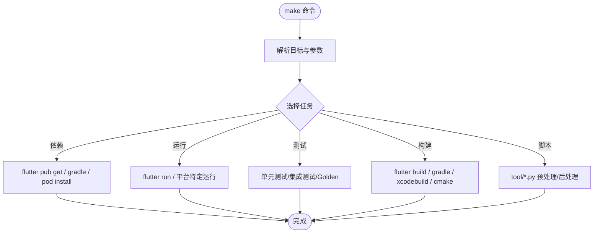

**图示来源** 
- [Makefile](file://Makefile)

**章节来源**
- [Makefile](file://Makefile)

### 依赖管理与版本控制
- Dart/Flutter：通过 pubspec.yaml 声明依赖与版本约束；建议使用锁定文件（pubspec.lock）保证可重现构建。
- Android：Gradle 管理依赖与构建变体；gradle.properties 可设置全局属性；wrapper 指定 Gradle 版本。
- iOS/macOS：CocoaPods 管理原生依赖；Podfile 定义依赖源与版本。
- Linux/Windows：CMake 管理原生库与链接；CMakeLists.txt 定义目标与选项。
- 版本策略：语义化版本（主.次.补丁），标签与发行说明配合发布流程。

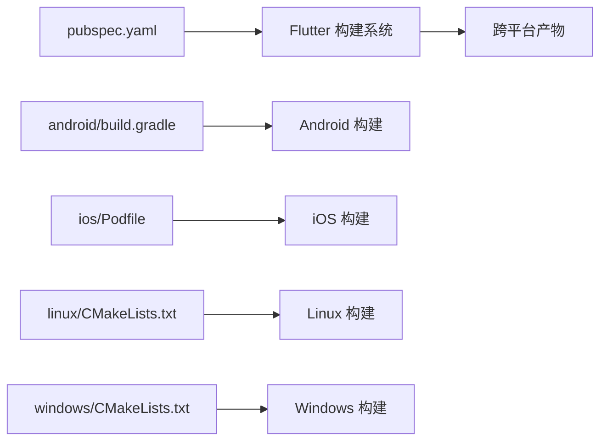

**图示来源** 
- [pubspec.yaml](file://pubspec.yaml)
- [android/build.gradle](file://android/build.gradle)
- [android/gradle.properties](file://android/gradle.properties)
- [android/gradle/wrapper/gradle-wrapper.properties](file://android/gradle/wrapper/gradle-wrapper.properties)
- [ios/Podfile](file://ios/Podfile)
- [macos/Podfile](file://macos/Podfile)
- [linux/CMakeLists.txt](file://linux/CMakeLists.txt)
- [windows/CMakeLists.txt](file://windows/CMakeLists.txt)

**章节来源**
- [pubspec.yaml](file://pubspec.yaml)
- [android/build.gradle](file://android/build.gradle)
- [android/gradle.properties](file://android/gradle.properties)
- [android/gradle/wrapper/gradle-wrapper.properties](file://android/gradle/wrapper/gradle-wrapper.properties)
- [ios/Podfile](file://ios/Podfile)
- [macos/Podfile](file://macos/Podfile)
- [linux/CMakeLists.txt](file://linux/CMakeLists.txt)
- [windows/CMakeLists.txt](file://windows/CMakeLists.txt)

### 自动化脚本与内容处理
- tool/build_release.py：协调多平台构建与产物整理，可能包含签名、混淆、归档等步骤。
- tool/course_cli.py：课程内容命令行工具，支持导入、校验、转换等操作。
- tool/generate_audio.py：批量生成音频资源，优化 TTS/录音流程。
- tool/split_course.py：按章节或单元拆分课程内容。
- tool/mix_listening_a1.py：听力素材混音与预处理。
- tool/export_content_inventory.py：导出内容清单，便于审计与同步。

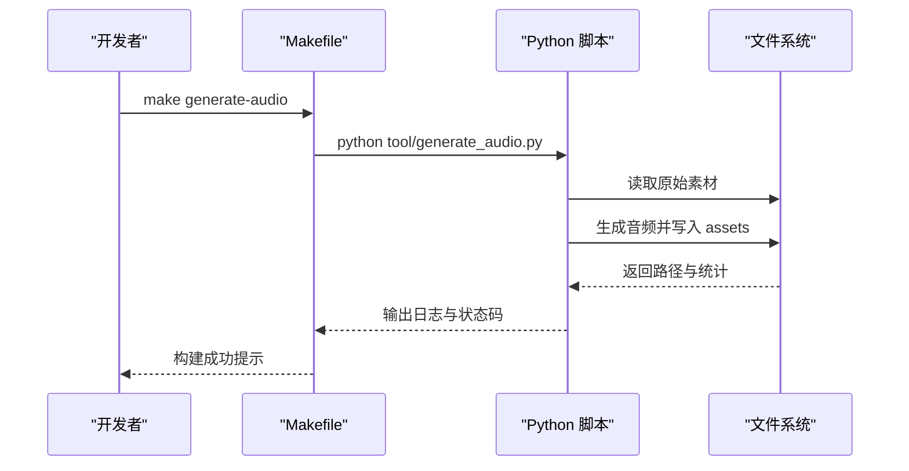

**图示来源** 
- [Makefile](file://Makefile)
- [tool/generate_audio.py](file://tool/generate_audio.py)
- [tool/build_release.py](file://tool/build_release.py)
- [tool/course_cli.py](file://tool/course_cli.py)
- [tool/split_course.py](file://tool/split_course.py)
- [tool/mix_listening_a1.py](file://tool/mix_listening_a1.py)
- [tool/export_content_inventory.py](file://tool/export_content_inventory.py)

**章节来源**
- [tool/build_release.py](file://tool/build_release.py)
- [tool/course_cli.py](file://tool/course_cli.py)
- [tool/generate_audio.py](file://tool/generate_audio.py)
- [tool/split_course.py](file://tool/split_course.py)
- [tool/mix_listening_a1.py](file://tool/mix_listening_a1.py)
- [tool/export_content_inventory.py](file://tool/export_content_inventory.py)

### 代码质量与分析
- analysis_options.yaml：启用 lint、禁用不推荐规则、统一风格。
- build.yaml：控制代码生成与构建阶段行为（如序列化、资源生成）。
- devtools_options.yaml：配置 DevTools 行为（如内存、性能面板默认项）。

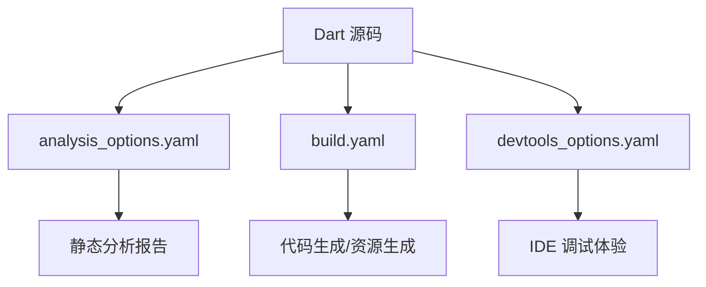

**图示来源** 
- [analysis_options.yaml](file://analysis_options.yaml)
- [build.yaml](file://build.yaml)
- [devtools_options.yaml](file://devtools_options.yaml)

**章节来源**
- [analysis_options.yaml](file://analysis_options.yaml)
- [build.yaml](file://build.yaml)
- [devtools_options.yaml](file://devtools_options.yaml)

### 多平台构建与打包发布
- Android：通过 Gradle 构建 APK/AAB，支持签名与 ProGuard/R8 混淆。
- iOS：通过 CocoaPods 与 Xcode 构建 IPA，支持签名与归档。
- Web：构建为静态站点，部署至 CDN 或托管服务。
- Desktop：Linux/Windows 通过 CMake 构建可执行文件，macOS 通过 Xcode 构建 App。
- 发布：结合 tool/build_release.py 与 Makefile 目标，统一产物命名与上传。

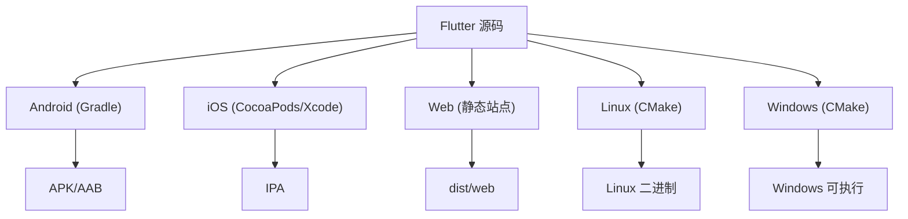

**图示来源** 
- [android/build.gradle](file://android/build.gradle)
- [android/app/build.gradle](file://android/app/build.gradle)
- [ios/Podfile](file://ios/Podfile)
- [linux/CMakeLists.txt](file://linux/CMakeLists.txt)
- [windows/CMakeLists.txt](file://windows/CMakeLists.txt)
- [web/index.html](file://web/index.html)

**章节来源**
- [android/build.gradle](file://android/build.gradle)
- [android/app/build.gradle](file://android/app/build.gradle)
- [ios/Podfile](file://ios/Podfile)
- [linux/CMakeLists.txt](file://linux/CMakeLists.txt)
- [windows/CMakeLists.txt](file://windows/CMakeLists.txt)
- [web/index.html](file://web/index.html)

### 应用入口与运行时
- lib/main.dart：应用启动入口，初始化依赖注入、路由、主题、国际化等。
- 建议：将平台特定初始化放入对应平台入口（如 android/ios/linux/windows/macos），保持 Dart 层解耦。

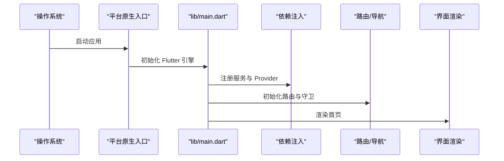

**图示来源** 
- [lib/main.dart](file://lib/main.dart)

**章节来源**
- [lib/main.dart](file://lib/main.dart)

### Git 分支策略与版本控制
- 分支模型：推荐使用主干优先（main）+ 功能分支（feature/*）+ 修复分支（fix/*）+ 发布分支（release/*）。
- 提交规范：约定式提交（Conventional Commits），便于自动生成变更日志。
- 版本标签：语义化版本标签（vX.Y.Z），配合发布说明。
- 合并策略：Pull Request 审查、CI 通过后合并，避免直接推送 main。

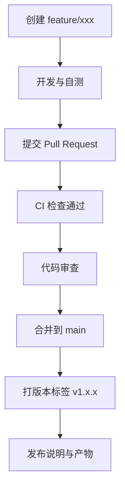

[此图为概念性流程，无需图示来源]

### CI/CD 流水线
- GitHub Actions：在 .github/workflows/ci.yml 中定义拉取请求与推送事件触发的检查、测试与构建。
- 典型步骤：安装依赖、静态检查、单元测试、集成测试、构建多平台产物、上传工件。
- 缓存：对 Flutter/Gradle/CocoaPods 缓存加速构建。
- 安全：敏感信息通过 Secrets 管理，不在仓库中明文存储。

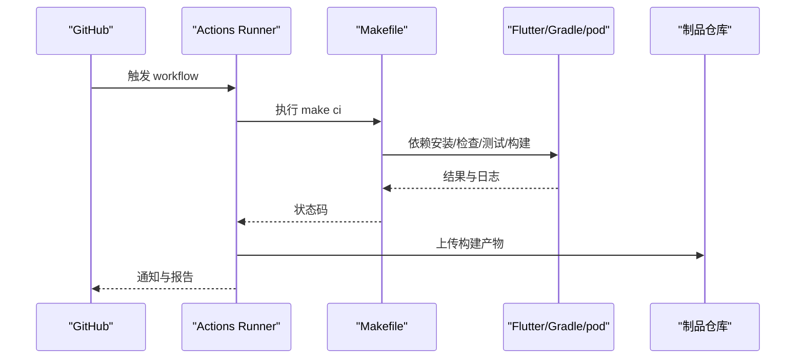

**图示来源** 
- [.github/workflows/ci.yml](file://.github/workflows/ci.yml)
- [Makefile](file://Makefile)

**章节来源**
- [.github/workflows/ci.yml](file://.github/workflows/ci.yml)

## 依赖分析
- 耦合关系：Makefile 与 tool 脚本强耦合；Flutter 与平台构建系统弱耦合（通过命令行接口）。
- 外部依赖：Flutter SDK、Android SDK/NDK、Xcode、CocoaPods、CMake、Python 3。
- 潜在循环：确保 Makefile 目标之间无循环依赖；脚本间通过参数与临时文件交互。
- 集成点：CI 与本地 Makefile 保持一致的命令集，降低环境差异。

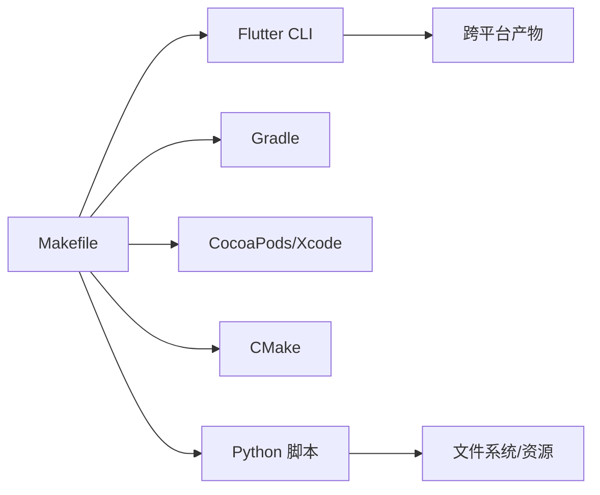

**图示来源** 
- [Makefile](file://Makefile)
- [tool/build_release.py](file://tool/build_release.py)
- [tool/course_cli.py](file://tool/course_cli.py)

**章节来源**
- [Makefile](file://Makefile)
- [tool/build_release.py](file://tool/build_release.py)

## 性能考虑
- 构建缓存：缓存 Flutter 包、Gradle 依赖、CocoaPods 与 CMake 中间产物。
- 增量构建：合理使用 flutter build --split-debug-info 与平台混淆，减小体积。
- 资源优化：压缩图片、按需加载音频、懒加载课程数据。
- 测试并行：单元测试与 Golden 测试并行执行，缩短 CI 时间。
- 内存与 CPU：监控 DevTools 性能面板，定位热点与泄漏。

[本节为通用指导，无需章节来源]

## 故障排查指南
- 依赖问题：清理缓存后重新获取（flutter clean、./gradlew clean、pod install --repo-update）。
- 构建失败：查看平台日志（Android Logcat、Xcode Console、Chrome DevTools、桌面应用 stderr）。
- 脚本错误：在 tool 脚本中添加详细日志与异常捕获，确认输入数据完整性。
- 权限问题：确保 Android Keystore、iOS 证书与描述文件正确配置。
- 网络问题：代理与镜像配置（Flutter/Gradle/pod 源）。

**章节来源**
- [Makefile](file://Makefile)
- [tool/build_release.py](file://tool/build_release.py)

## 结论
通过统一的 Makefile 编排、清晰的依赖管理与自动化脚本，Varnamalaplus 实现了跨平台的高效开发与稳定发布。结合 Git 分支策略与 CI/CD 流水线，团队可在保证质量的前提下快速迭代。建议持续优化构建缓存与测试并行度，提升整体效率。

[本节为总结，无需章节来源]

## 附录
- 本地开发环境准备：安装 Flutter SDK、Android Studio、Xcode、CocoaPods、CMake、Python 3。
- 常用命令：参考 Makefile 目标与 tool 脚本使用说明。
- 调试技巧：使用 flutter run -d 指定设备；开启 --debug/--profile/--release；使用 DevTools 分析性能与内存。
- 发布清单：版本号、签名、渠道包、更新说明、回滚策略。

[本节为补充信息，无需章节来源]