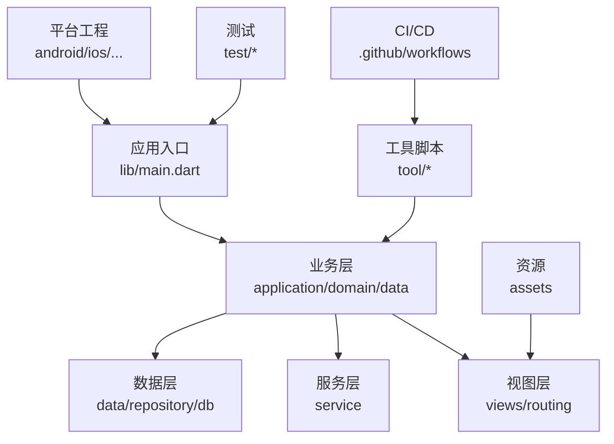
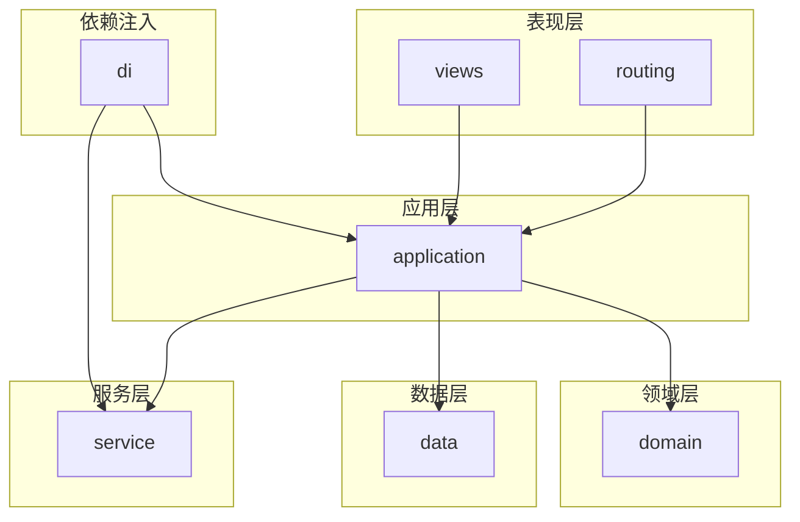
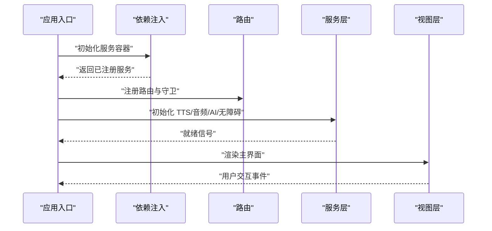
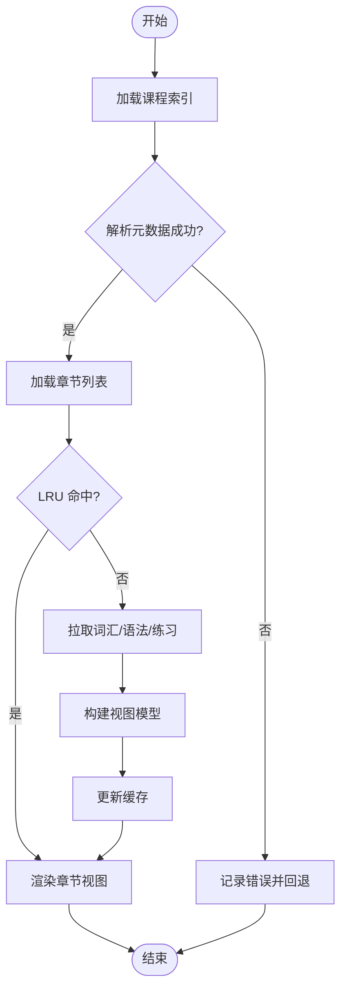
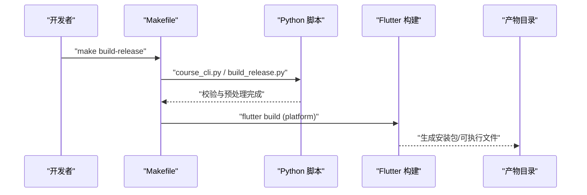
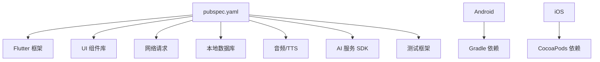

# 开发指南

<cite>
**本文档引用的文件**   
- [README.md](file://README.md)
- [pubspec.yaml](file://pubspec.yaml)
- [analysis_options.yaml](file://analysis_options.yaml)
- [Makefile](file://Makefile)
- [CLAUDE.md](file://CLAUDE.md)
- [lib/main.dart](file://lib/main.dart)
- [tool/course_cli.py](file://tool/course_cli.py)
- [tool/build_release.py](file://tool/build_release.py)
- [.github/workflows](file://.github/workflows)
- [docs/decisions/0023-git-branch-and-conflict-resolution.md](file://docs/decisions/0023-git-branch-and-conflict-resolution.md)
- [docs/decisions/0024-team-collaboration-enhancements.md](file://docs/decisions/0024-team-collaboration-enhancements.md)
- [docs/authoring/course-layout.md](file://docs/authoring/course-layout.md)
- [docs/authoring/gui-course-editor.md](file://docs/authoring/gui-course-editor.md)
- [test/BASELINE.md](file://test/BASELINE.md)
</cite>

## 目录
1. [简介](#简介)
2. [项目结构](#项目结构)
3. [核心组件](#核心组件)
4. [架构总览](#架构总览)
5. [详细组件分析](#详细组件分析)
6. [依赖分析](#依赖分析)
7. [性能与内存优化](#性能与内存优化)
8. [调试与故障排查](#调试与故障排查)
9. [插件开发与扩展点](#插件开发与扩展点)
10. [第三方集成方法](#第三方集成方法)
11. [代码规范与命名约定](#代码规范与命名约定)
12. [开发工作流与分支策略](#开发工作流与分支策略)
13. [代码审查流程](#代码审查流程)
14. [常见问题与解决方案](#常见问题与解决方案)
15. [社区贡献指南](#社区贡献指南)
16. [结论](#结论)

## 简介
本指南面向 Varnamalaplus 项目的开发者，提供从环境搭建、代码规范、命名约定到开发工作流、分支策略、代码审查的完整说明。同时涵盖调试技巧、性能分析与内存泄漏检测、插件与扩展点使用、第三方集成方法，以及常见问题与社区贡献流程。目标是帮助新成员快速上手，提升团队协作效率与代码质量。

## 项目结构
Varnamalaplus 是一个基于 Flutter 的多端应用（Android/iOS/Web/Linux/macOS/Windows），采用分层架构：
- lib: 应用核心逻辑与 UI
- android/ios/macos/linux/windows/web: 各平台原生工程与配置
- assets: 课程资源、图片、音频等静态资源
- tool: 命令行工具与脚本（课程处理、构建发布）
- test: 单元测试、集成测试、黄金测试
- docs: 设计决策、作者指南、课程布局文档
- .github: CI/CD 工作流
- pubspec.yaml: 依赖与构建配置
- analysis_options.yaml: Dart 静态分析与格式化规则
- Makefile: 常用命令入口

图表来源
- [lib/main.dart](file://lib/main.dart)
- [pubspec.yaml](file://pubspec.yaml)
- [tool/course_cli.py](file://tool/course_cli.py)
- [.github/workflows](file://.github/workflows)

章节来源
- [README.md](file://README.md)
- [pubspec.yaml](file://pubspec.yaml)

## 核心组件
- 应用入口与初始化：负责启动 Flutter 引擎、注册路由、加载全局配置与服务定位器。
- 课程系统：课程加载、章节组织、词汇与语法点管理、学习进度与统计。
- 数据持久化：本地数据库与缓存、SRS（间隔重复）状态存储。
- 服务层：TTS、音频播放、AI 辅助、无障碍设置、成就系统等。
- 视图与路由：页面导航、主题与国际化、响应式 UI。
- 工具链：课程 CLI、构建发布脚本、内容生成与校验。

章节来源
- [lib/main.dart](file://lib/main.dart)
- [tool/course_cli.py](file://tool/course_cli.py)
- [tool/build_release.py](file://tool/build_release.py)

## 架构总览
应用遵循清晰的分层与职责分离：
- 表现层（views/routing）：用户交互与界面渲染
- 应用层（application）：用例编排、状态管理、领域服务协调
- 领域层（domain）：业务实体、规则与算法
- 数据层（data）：仓库、数据库、网络与文件系统访问
- 服务层（service）：跨领域能力（TTS、音频、AI、无障碍）
- 依赖注入（di）：服务与模块装配

图表来源
- [lib/main.dart](file://lib/main.dart)
- [pubspec.yaml](file://pubspec.yaml)

## 详细组件分析

### 应用入口与初始化流程
- 启动时加载配置、初始化日志与错误捕获
- 注册路由与主题、语言包
- 初始化服务定位器并注册服务实例
- 启动主界面与根路由

图表来源
- [lib/main.dart](file://lib/main.dart)

章节来源
- [lib/main.dart](file://lib/main.dart)

### 课程加载与展示流程
- 解析课程索引与章节元数据
- 按需加载词汇、语法点与练习体
- 构建 LRU 缓存以提升渲染性能
- 将数据映射为视图模型供 UI 消费

图表来源
- [docs/authoring/course-layout.md](file://docs/authoring/course-layout.md)

章节来源
- [docs/authoring/course-layout.md](file://docs/authoring/course-layout.md)

### 构建与发布流程
- 使用 Makefile 统一命令入口
- 调用 Python 脚本进行课程校验与内容生成
- 执行 Flutter 构建与签名（平台相关）
- 输出产物至指定目录

图表来源
- [Makefile](file://Makefile)
- [tool/course_cli.py](file://tool/course_cli.py)
- [tool/build_release.py](file://tool/build_release.py)

章节来源
- [Makefile](file://Makefile)
- [tool/course_cli.py](file://tool/course_cli.py)
- [tool/build_release.py](file://tool/build_release.py)

## 依赖分析
- 外部依赖通过 pubspec.yaml 声明，包含框架、UI、网络、数据库、音频、AI 等库
- 平台特定依赖在各自工程中声明（如 Android Gradle、iOS CocoaPods）
- 工具链依赖 Python 脚本与 Flutter CLI

图表来源
- [pubspec.yaml](file://pubspec.yaml)

章节来源
- [pubspec.yaml](file://pubspec.yaml)

## 性能与内存优化
- 使用 LRU 缓存减少重复加载与渲染开销
- 避免在热路径中进行阻塞 I/O，使用异步与背压
- 合理拆分 Widget，避免不必要的重建
- 使用 devtools 进行性能剖析与内存快照分析
- 对大对象进行池化或延迟加载

[本节为通用指导，不直接分析具体文件]

## 调试与故障排查
- 启用详细日志与错误上报，便于问题定位
- 使用断点与条件断点进行交互式调试
- 针对 UI 问题使用 widget inspector 与 golden 测试对比
- 针对性能问题使用 timeline 与 memory profiler
- 针对数据问题检查仓库实现与缓存一致性

章节来源
- [test/BASELINE.md](file://test/BASELINE.md)

## 插件开发与扩展点
- 通过 service 层暴露扩展接口，允许第三方实现替换默认行为
- 使用依赖注入注册自定义服务，保持松耦合
- 课程与章节结构支持模板化，便于扩展新的题型与展示方式
- 工具链可扩展新的校验与转换脚本

[本节为通用指导，不直接分析具体文件]

## 第三方集成方法
- 网络 API：通过统一的 HTTP 客户端封装，支持重试与超时控制
- 音频与 TTS：抽象出播放器与合成器接口，便于切换后端
- AI 服务：通过适配器模式接入不同提供商
- 平台功能：通过 platform channel 调用原生能力

[本节为通用指导，不直接分析具体文件]

## 代码规范与命名约定
- 遵循 Dart 官方风格指南与 analysis_options.yaml 配置
- 文件与类名使用小写下划线或驼峰，视上下文而定
- 常量使用大写蛇形，变量使用小写驼峰
- 函数与方法名表达意图，避免缩写歧义
- 注释与文档字符串覆盖公共 API 与复杂逻辑

章节来源
- [analysis_options.yaml](file://analysis_options.yaml)

## 开发工作流与分支策略
- 主分支保护，所有变更通过 Pull Request 合并
- 功能分支以 feature/ 前缀命名，修复分支以 fix/ 前缀命名
- 提交信息遵循约定式提交格式，便于自动生成变更日志
- 冲突解决与协作增强见决策文档

章节来源
- [docs/decisions/0023-git-branch-and-conflict-resolution.md](file://docs/decisions/0023-git-branch-and-conflict-resolution.md)
- [docs/decisions/0024-team-collaboration-enhancements.md](file://docs/decisions/0024-team-collaboration-enhancements.md)

## 代码审查流程
- 每个 PR 至少一名 reviewer，关注正确性、可读性与性能
- 自动化检查包括 lint、测试、构建与静态分析
- 审查意见需明确且可操作，必要时提供示例
- 合并前确保 CI 全绿且无遗留问题

章节来源
- [docs/decisions/0024-team-collaboration-enhancements.md](file://docs/decisions/0024-team-collaboration-enhancements.md)

## 常见问题与解决方案
- 构建失败：检查依赖版本与平台配置，清理缓存后重试
- 运行时崩溃：查看日志堆栈，复现最小用例，添加防御性检查
- 性能退化：使用 profiling 定位热点，优化算法与 I/O
- 数据不一致：检查缓存失效策略与事务边界

[本节为通用指导，不直接分析具体文件]

## 社区贡献指南
- 先 Fork 仓库，创建功能分支进行开发
- 编写或更新测试，确保覆盖率与稳定性
- 提交清晰的描述与关联 Issue，便于追踪
- 遵循贡献者协议与行为准则

[本节为通用指导，不直接分析具体文件]

## 结论
本指南提供了 Varnamalaplus 项目的全面开发参考，涵盖架构、规范、流程与最佳实践。建议团队成员结合本文档与源码深入理解，持续提升代码质量与协作效率。