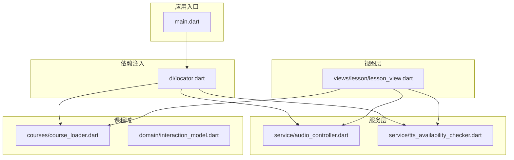
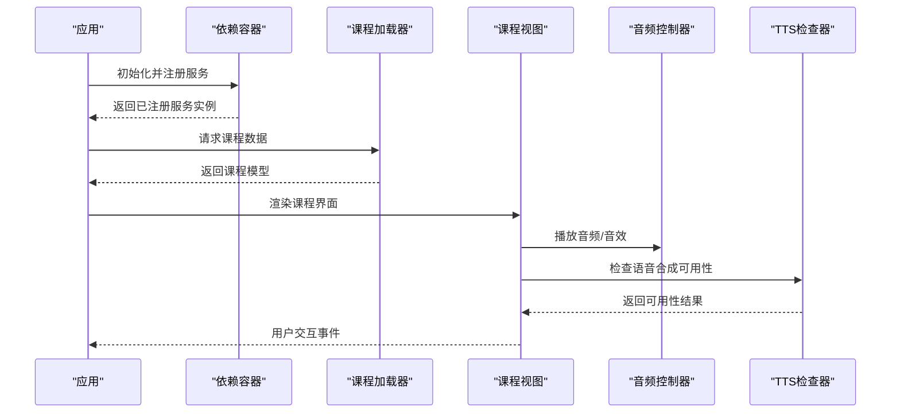
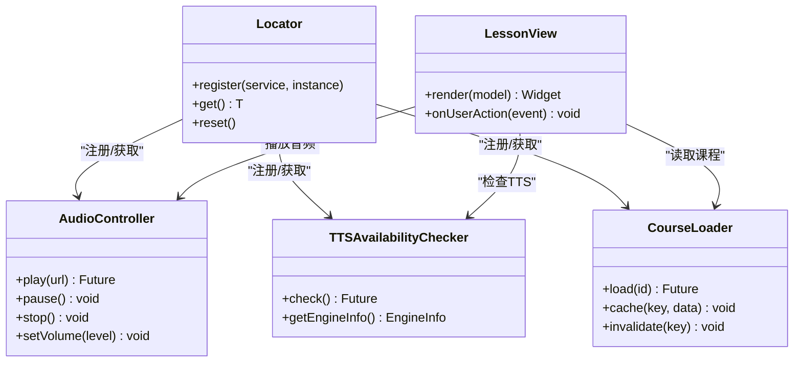
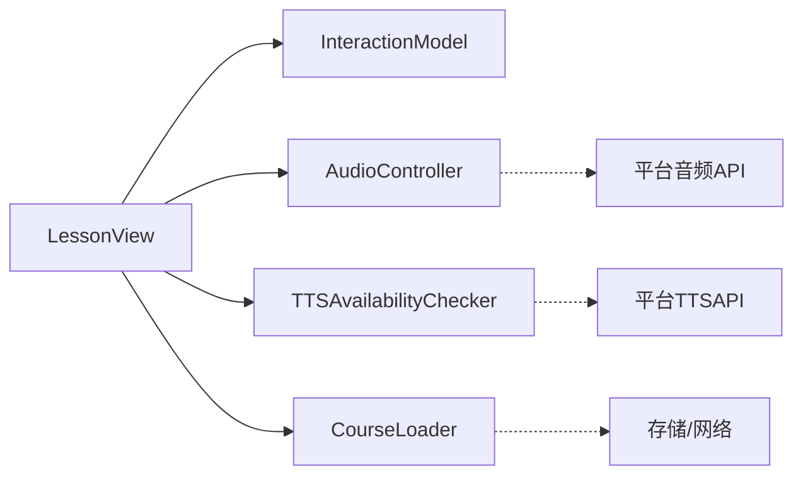

# 插件开发与扩展

<cite>
**本文档引用的文件**   
- [lib/main.dart](file://lib/main.dart)
- [lib/di/locator.dart](file://lib/di/locator.dart)
- [lib/service/audio_controller.dart](file://lib/service/audio_controller.dart)
- [lib/service/tts_availability_checker.dart](file://lib/service/tts_availability_checker.dart)
- [lib/courses/course_loader.dart](file://lib/courses/course_loader.dart)
- [lib/domain/interaction_model.dart](file://lib/domain/interaction_model.dart)
- [lib/views/lesson/lesson_view.dart](file://lib/views/lesson/lesson_view.dart)
- [test/service/locator_test.dart](file://test/service/locator_test.dart)
- [test/service/tts_availability_checker_test.dart](file://test/service/tts_availability_checker_test.dart)
- [test/courses/course_loader_test.dart](file://test/courses/course_loader_test.dart)
</cite>

## 目录
1. [简介](#简介)
2. [项目结构](#项目结构)
3. [核心组件](#核心组件)
4. [架构总览](#架构总览)
5. [详细组件分析](#详细组件分析)
6. [依赖分析](#依赖分析)
7. [性能考虑](#性能考虑)
8. [故障排查指南](#故障排查指南)
9. [结论](#结论)
10. [附录](#附录)

## 简介
本指南面向希望在 Varnamalaplus 中开发插件与扩展的开发者，围绕服务注入机制、依赖容器使用、接口设计模式展开，并给出自定义课程类型、交互组件与渲染器的实现方法。同时涵盖第三方库集成、原生平台桥接、权限管理、事件总线与消息传递、状态同步机制，以及插件架构设计原则、生命周期管理与错误处理策略。目标是帮助读者以最小成本接入现有系统，并以可维护、可扩展的方式构建插件能力。

## 项目结构
Varnamalaplus 采用 Flutter/Dart 工程组织，核心代码位于 lib 目录，按职责分层：
- application：应用层编排与用例
- core：通用工具与基础能力
- courses：课程内容加载与管理
- data：数据访问与持久化
- di：依赖注入与服务定位器
- domain：领域模型与业务规则
- routing：路由与导航
- service：横切服务（如音频、TTS）
- views：UI 视图与交互

图表来源
- [lib/main.dart:1-200](file://lib/main.dart#L1-L200)
- [lib/di/locator.dart:1-200](file://lib/di/locator.dart#L1-L200)
- [lib/service/audio_controller.dart:1-200](file://lib/service/audio_controller.dart#L1-L200)
- [lib/service/tts_availability_checker.dart:1-200](file://lib/service/tts_availability_checker.dart#L1-L200)
- [lib/courses/course_loader.dart:1-200](file://lib/courses/course_loader.dart#L1-L200)
- [lib/domain/interaction_model.dart:1-200](file://lib/domain/interaction_model.dart#L1-L200)
- [lib/views/lesson/lesson_view.dart:1-200](file://lib/views/lesson/lesson_view.dart#L1-L200)

章节来源
- [lib/main.dart:1-200](file://lib/main.dart#L1-L200)
- [lib/di/locator.dart:1-200](file://lib/di/locator.dart#L1-L200)

## 核心组件
- 依赖注入与服务定位器：集中注册与获取服务，解耦模块间依赖，支持测试替换与运行时切换。
- 音频控制器：统一播放、暂停、音量控制与资源释放，提供跨平台一致性。
- TTS 可用性检查：检测系统或第三方引擎是否可用，决定回退策略。
- 课程加载器：解析课程元数据与内容，提供缓存与增量更新能力。
- 交互模型：定义课程中的交互类型与数据结构，便于扩展新的题型与渲染逻辑。
- 课程视图：根据交互模型渲染 UI，并与服务层协作完成用户操作。

章节来源
- [lib/di/locator.dart:1-200](file://lib/di/locator.dart#L1-L200)
- [lib/service/audio_controller.dart:1-200](file://lib/service/audio_controller.dart#L1-L200)
- [lib/service/tts_availability_checker.dart:1-200](file://lib/service/tts_availability_checker.dart#L1-L200)
- [lib/courses/course_loader.dart:1-200](file://lib/courses/course_loader.dart#L1-L200)
- [lib/domain/interaction_model.dart:1-200](file://lib/domain/interaction_model.dart#L1-L200)
- [lib/views/lesson/lesson_view.dart:1-200](file://lib/views/lesson/lesson_view.dart#L1-L200)

## 架构总览
插件体系围绕“服务 + 模型 + 视图”的分层展开，通过依赖注入将服务暴露给上层，视图消费模型并通过服务执行副作用。课程加载器作为数据源，为视图提供结构化内容；音频与 TTS 作为横切服务被多处复用。

图表来源
- [lib/main.dart:1-200](file://lib/main.dart#L1-L200)
- [lib/di/locator.dart:1-200](file://lib/di/locator.dart#L1-L200)
- [lib/courses/course_loader.dart:1-200](file://lib/courses/course_loader.dart#L1-L200)
- [lib/views/lesson/lesson_view.dart:1-200](file://lib/views/lesson/lesson_view.dart#L1-L200)
- [lib/service/audio_controller.dart:1-200](file://lib/service/audio_controller.dart#L1-L200)
- [lib/service/tts_availability_checker.dart:1-200](file://lib/service/tts_availability_checker.dart#L1-L200)

## 详细组件分析

### 依赖注入与服务定位器
- 作用：集中管理服务生命周期与获取方式，避免全局单例滥用，提升可测试性。
- 关键点：
  - 服务注册：在应用启动时完成所有服务的注册与配置。
  - 按需获取：通过统一的定位器接口获取服务实例。
  - 测试替换：在测试中注入模拟实现，隔离外部依赖。
- 建议：
  - 明确服务边界，单一职责。
  - 对异步服务提供就绪状态与错误回调。
  - 避免循环依赖，必要时引入中间适配器。

章节来源
- [lib/di/locator.dart:1-200](file://lib/di/locator.dart#L1-L200)
- [test/service/locator_test.dart:1-200](file://test/service/locator_test.dart#L1-L200)

### 音频控制器
- 作用：封装音频播放、暂停、停止、音量控制与资源释放。
- 关键点：
  - 跨平台兼容：在不同平台上统一 API。
  - 资源管理：确保播放器正确释放，避免内存泄漏。
  - 错误处理：网络失败、解码异常等场景的降级策略。
- 建议：
  - 提供队列与优先级控制，避免并发冲突。
  - 暴露状态流，便于 UI 同步。

章节来源
- [lib/service/audio_controller.dart:1-200](file://lib/service/audio_controller.dart#L1-L200)

### TTS 可用性检查器
- 作用：检测系统或第三方 TTS 引擎是否可用，返回可用性结果。
- 关键点：
  - 多引擎探测：优先选择高质量引擎，回退到默认引擎。
  - 权限与设置：检查必要权限与系统设置。
  - 缓存结果：避免重复探测开销。
- 建议：
  - 提供可插拔的引擎实现，便于扩展新引擎。
  - 暴露错误码与诊断信息，便于问题定位。

章节来源
- [lib/service/tts_availability_checker.dart:1-200](file://lib/service/tts_availability_checker.dart#L1-L200)
- [test/service/tts_availability_checker_test.dart:1-200](file://test/service/tts_availability_checker_test.dart#L1-L200)

### 课程加载器
- 作用：解析课程元数据与内容，提供缓存与增量更新。
- 关键点：
  - 数据源抽象：支持本地文件、网络、数据库等多源。
  - 版本与校验：保证数据一致性与完整性。
  - 缓存策略：LRU 或基于时间戳的缓存。
- 建议：
  - 提供进度回调与取消令牌，改善用户体验。
  - 对大体积资源进行分块加载与懒加载。

章节来源
- [lib/courses/course_loader.dart:1-200](file://lib/courses/course_loader.dart#L1-L200)
- [test/courses/course_loader_test.dart:1-200](file://test/courses/course_loader_test.dart#L1-L200)

### 交互模型与渲染器
- 作用：定义课程中的交互类型与数据结构，驱动视图渲染与用户输入处理。
- 关键点：
  - 类型安全：使用枚举或 sealed class 限定交互类型。
  - 可扩展性：新增交互类型无需修改既有渲染逻辑。
  - 数据绑定：视图与模型之间保持单向数据流。
- 建议：
  - 为每种交互类型提供独立的渲染器与处理器。
  - 提供单元测试覆盖边界条件与异常路径。

章节来源
- [lib/domain/interaction_model.dart:1-200](file://lib/domain/interaction_model.dart#L1-L200)
- [lib/views/lesson/lesson_view.dart:1-200](file://lib/views/lesson/lesson_view.dart#L1-L200)

### 课程视图
- 作用：根据交互模型渲染 UI，响应用户操作，调用服务层执行副作用。
- 关键点：
  - 状态管理：局部状态与全局状态分离。
  - 事件派发：将用户操作转化为领域事件。
  - 服务调用：通过依赖注入获取服务实例。
- 建议：
  - 使用不可变数据更新，避免竞态条件。
  - 对长耗时操作进行节流与防抖。

章节来源
- [lib/views/lesson/lesson_view.dart:1-200](file://lib/views/lesson/lesson_view.dart#L1-L200)

#### 类关系图（示例）

图表来源
- [lib/di/locator.dart:1-200](file://lib/di/locator.dart#L1-L200)
- [lib/service/audio_controller.dart:1-200](file://lib/service/audio_controller.dart#L1-L200)
- [lib/service/tts_availability_checker.dart:1-200](file://lib/service/tts_availability_checker.dart#L1-L200)
- [lib/courses/course_loader.dart:1-200](file://lib/courses/course_loader.dart#L1-L200)
- [lib/views/lesson/lesson_view.dart:1-200](file://lib/views/lesson/lesson_view.dart#L1-L200)

## 依赖分析
- 耦合度：视图层仅依赖服务接口与模型，不直接感知底层实现，降低耦合。
- 内聚性：每个服务职责单一，便于独立测试与维护。
- 循环依赖：通过依赖注入避免直接引用，必要时引入适配器或事件总线。
- 外部依赖：音频与 TTS 可能涉及平台特定实现，需通过抽象层屏蔽差异。

图表来源
- [lib/views/lesson/lesson_view.dart:1-200](file://lib/views/lesson/lesson_view.dart#L1-L200)
- [lib/domain/interaction_model.dart:1-200](file://lib/domain/interaction_model.dart#L1-L200)
- [lib/service/audio_controller.dart:1-200](file://lib/service/audio_controller.dart#L1-L200)
- [lib/service/tts_availability_checker.dart:1-200](file://lib/service/tts_availability_checker.dart#L1-L200)
- [lib/courses/course_loader.dart:1-200](file://lib/courses/course_loader.dart#L1-L200)

章节来源
- [lib/di/locator.dart:1-200](file://lib/di/locator.dart#L1-L200)
- [lib/views/lesson/lesson_view.dart:1-200](file://lib/views/lesson/lesson_view.dart#L1-L200)

## 性能考虑
- 懒加载与分页：课程内容与媒体资源按需加载，减少首屏压力。
- 缓存策略：对频繁访问的数据与检测结果进行缓存，降低重复计算。
- 资源释放：及时释放音频与 TTS 资源，避免内存泄漏。
- 并发控制：限制并发请求数，避免阻塞主线程。
- 渲染优化：避免不必要的重建，使用不可变数据与局部状态。

[本节为通用指导，不涉及具体文件分析]

## 故障排查指南
- 依赖未注册：检查应用启动时的服务注册顺序与命名。
- 音频播放失败：确认权限、网络状态与资源路径，查看错误码与日志。
- TTS 不可用：检查系统设置与引擎安装情况，尝试回退策略。
- 课程加载超时：检查数据源可达性与缓存有效性，增加重试与超时配置。
- 视图状态不同步：核对事件派发与状态更新路径，确保单向数据流。

章节来源
- [test/service/locator_test.dart:1-200](file://test/service/locator_test.dart#L1-L200)
- [test/service/tts_availability_checker_test.dart:1-200](file://test/service/tts_availability_checker_test.dart#L1-L200)
- [test/courses/course_loader_test.dart:1-200](file://test/courses/course_loader_test.dart#L1-L200)

## 结论
通过清晰的依赖注入、模块化服务设计与可扩展的交互模型，Varnamalaplus 为插件与扩展提供了坚实基础。遵循本文的设计原则与实践建议，开发者可以高效地集成第三方库、桥接原生平台、管理权限与事件，构建稳定且易维护的插件生态。

[本节为总结性内容，不涉及具体文件分析]

## 附录
- 插件架构设计原则
  - 单一职责：每个插件聚焦一个能力域。
  - 开闭原则：对扩展开放，对修改封闭。
  - 依赖倒置：高层模块不依赖低层模块细节。
- 生命周期管理
  - 初始化：在应用启动阶段完成服务注册与配置。
  - 运行期：动态启用/禁用插件，支持热重载。
  - 销毁：有序释放资源，清理状态。
- 错误处理策略
  - 分级上报：区分警告、错误与致命错误。
  - 降级恢复：提供备用方案与默认行为。
  - 可观测性：记录上下文与堆栈，便于定位问题。
- 事件总线与消息传递
  - 事件命名规范：清晰表达意图与作用域。
  - 订阅管理：避免内存泄漏，及时取消订阅。
  - 消息格式：统一序列化与反序列化。
- 状态同步机制
  - 单向数据流：从模型到视图的单向更新。
  - 幂等更新：重复操作不会产生副作用。
  - 冲突解决：合并策略与版本控制。

[本节为概念性内容，不涉及具体文件分析]