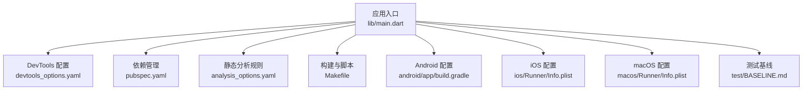
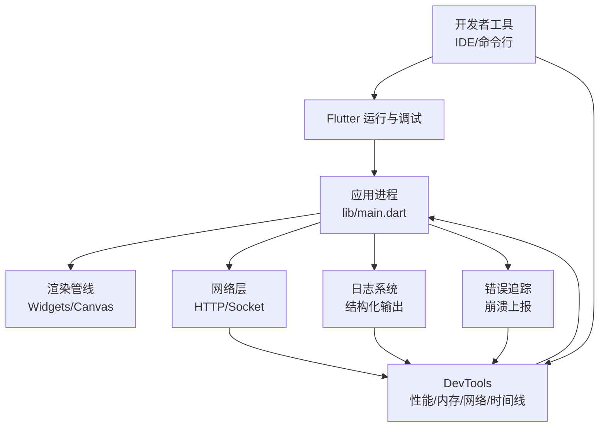
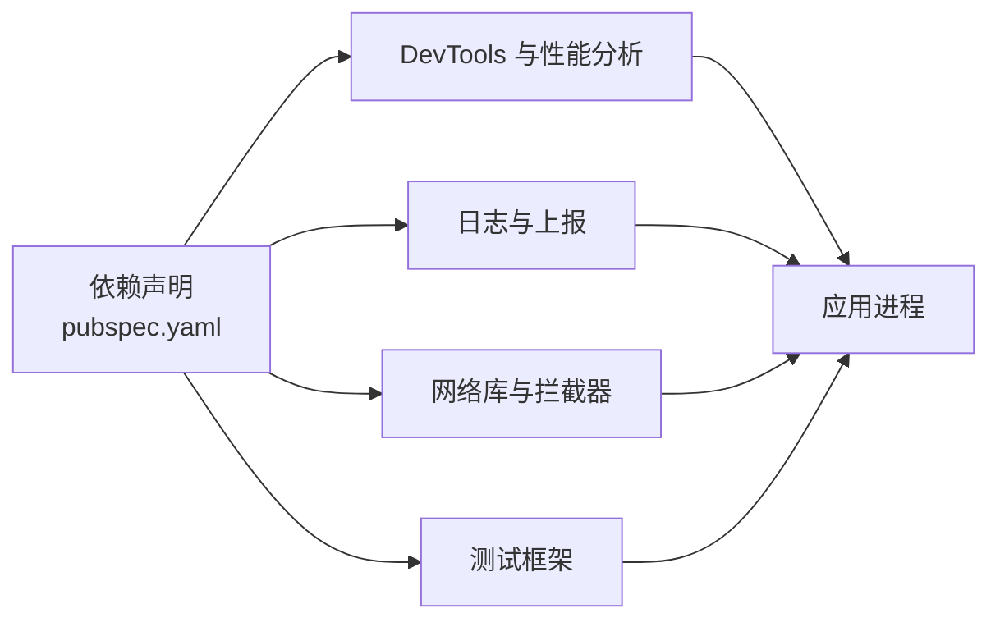

# 调试与性能分析

<cite>
**本文引用的文件**   
- [lib/main.dart](file://lib/main.dart)
- [devtools_options.yaml](file://devtools_options.yaml)
- [pubspec.yaml](file://pubspec.yaml)
- [analysis_options.yaml](file://analysis_options.yaml)
- [Makefile](file://Makefile)
- [android/app/build.gradle](file://android/app/build.gradle)
- [ios/Runner/Info.plist](file://ios/Runner/Info.plist)
- [macos/Runner/Info.plist](file://macos/Runner/Info.plist)
- [test/BASELINE.md](file://test/BASELINE.md)
</cite>

## 目录
1. [简介](#简介)
2. [项目结构](#项目结构)
3. [核心组件](#核心组件)
4. [架构总览](#架构总览)
5. [详细组件分析](#详细组件分析)
6. [依赖关系分析](#依赖关系分析)
7. [性能注意事项](#性能注意事项)
8. [故障排查指南](#故障排查指南)
9. [结论](#结论)
10. [附录](#附录)

## 简介
本指南面向 Varnamalaplus Flutter 项目的开发与维护人员，聚焦于调试与性能分析实践。内容涵盖：
- Flutter DevTools 的使用方法与最佳实践
- 调试器配置、断点设置与条件断点
- 性能分析方法（CPU、内存、渲染）
- 网络请求监控与日志记录策略
- 错误追踪与崩溃报告集成思路
- 单元测试、集成测试与 UI 测试的调试与录制
- 常见性能问题诊断、内存优化技巧与渲染调优方法

## 项目结构
Varnamalaplus 采用标准 Flutter 工程结构，关键调试与性能相关配置集中在以下位置：
- lib/main.dart：应用入口，通常负责初始化依赖、路由与全局状态
- devtools_options.yaml：DevTools 行为与扩展选项
- pubspec.yaml：依赖声明，包含调试与分析相关包
- analysis_options.yaml：静态分析与代码质量规则
- Makefile：常用命令封装，便于快速启动调试与分析流程
- 平台配置：android/app/build.gradle、ios/Runner/Info.plist、macos/Runner/Info.plist 等用于平台级调试开关与权限
- test/BASELINE.md：基准与回归基线说明，辅助性能回归检测

**图表来源** 
- [lib/main.dart](file://lib/main.dart)
- [devtools_options.yaml](file://devtools_options.yaml)
- [pubspec.yaml](file://pubspec.yaml)
- [analysis_options.yaml](file://analysis_options.yaml)
- [Makefile](file://Makefile)
- [android/app/build.gradle](file://android/app/build.gradle)
- [ios/Runner/Info.plist](file://ios/Runner/Info.plist)
- [macos/Runner/Info.plist](file://macos/Runner/Info.plist)
- [test/BASELINE.md](file://test/BASELINE.md)

**章节来源**
- [lib/main.dart](file://lib/main.dart)
- [devtools_options.yaml](file://devtools_options.yaml)
- [pubspec.yaml](file://pubspec.yaml)
- [analysis_options.yaml](file://analysis_options.yaml)
- [Makefile](file://Makefile)
- [android/app/build.gradle](file://android/app/build.gradle)
- [ios/Runner/Info.plist](file://ios/Runner/Info.plist)
- [macos/Runner/Info.plist](file://macos/Runner/Info.plist)
- [test/BASELINE.md](file://test/BASELINE.md)

## 核心组件
围绕调试与性能分析的核心要素包括：
- 应用初始化与依赖注入：在入口中完成服务注册、日志与崩溃上报初始化
- DevTools 集成：启用性能、内存、网络、时间线等面板
- 日志系统：结构化日志、分级输出、敏感信息脱敏
- 网络层：拦截器统一记录请求/响应、耗时与错误
- 错误追踪：捕获未处理异常、异步错误与平台崩溃
- 测试框架：单元、集成、UI 测试的断言与可视化录制

**章节来源**
- [lib/main.dart](file://lib/main.dart)
- [devtools_options.yaml](file://devtools_options.yaml)
- [pubspec.yaml](file://pubspec.yaml)

## 架构总览
下图展示调试与性能分析在应用中的整体交互关系：开发者通过 IDE/命令行触发运行，Flutter 引擎驱动 UI 渲染，DevTools 收集运行时指标；日志与网络拦截贯穿业务层；错误追踪覆盖全链路。

[此图为概念性架构图，不直接映射具体源码文件]

## 详细组件分析

### Flutter DevTools 使用
- 启动方式：通过 IDE 或命令行启动应用后连接 DevTools，确保端口可达
- 关键面板：
  - 性能：帧率、构建耗时、布局与绘制开销
  - 内存：对象分配、堆快照、泄漏定位
  - 网络：请求/响应、缓存、重试与错误
  - 时间线：事件时序、阻塞点识别
- 建议：
  - 在开发环境开启详细日志与采样
  - 使用“热重载”快速验证修复效果
  - 结合“性能模式”与“发布模式”对比差异

**章节来源**
- [devtools_options.yaml](file://devtools_options.yaml)
- [pubspec.yaml](file://pubspec.yaml)

### 调试器配置与断点设置
- 断点类型：普通断点、条件断点、异常断点、日志断点
- 推荐实践：
  - 在关键业务函数与回调处设置断点
  - 对高频调用路径使用条件断点降低干扰
  - 利用变量监视与调用栈回溯定位问题
- 平台差异：
  - Android/iOS/macOS/Windows/Linux 的调试器行为略有不同，注意线程与异步上下文

**章节来源**
- [lib/main.dart](file://lib/main.dart)

### 性能分析方法
- CPU 分析：
  - 使用性能面板观察帧构建与绘制耗时
  - 识别长任务与阻塞操作，拆分计算与 IO
- 内存分析：
  - 采集堆快照，查找未释放对象与循环引用
  - 关注图片、音频等大对象的生命周期
- 渲染优化：
  - 减少重建范围，使用 const/immutable 数据
  - 避免在 build 中进行复杂计算与 IO
- 基准与回归：
  - 基于 test/BASELINE.md 建立性能基线，自动化回归检测

**章节来源**
- [test/BASELINE.md](file://test/BASELINE.md)

### 网络请求监控
- 拦截器：统一记录 URL、方法、头部、耗时、状态码与错误
- 缓存策略：区分读多写少场景，合理设置 TTL 与失效策略
- 错误处理：超时、重试、降级与用户提示
- DevTools 网络面板：过滤、搜索、导出请求详情

**章节来源**
- [pubspec.yaml](file://pubspec.yaml)

### 日志记录策略
- 分级输出：DEBUG/INFO/WARN/ERROR，按环境控制级别
- 结构化字段：模块、用户会话、设备信息、时间戳
- 敏感信息脱敏：令牌、密码、个人信息需过滤
- 持久化与上报：本地日志轮转与远程聚合

**章节来源**
- [lib/main.dart](file://lib/main.dart)

### 错误追踪与崩溃报告
- 未处理异常：捕获顶层异常并上报堆栈
- 异步错误：Future 未捕获异常、Stream 错误
- 平台崩溃：Native 层崩溃符号化与上报
- 用户反馈：附带上下文信息与复现步骤

**章节来源**
- [lib/main.dart](file://lib/main.dart)

### 单元测试调试
- 断言与期望：明确输入输出与边界条件
- 模拟依赖：隔离外部服务与数据库
- 覆盖率与基线：结合 BASELINE 进行回归检查

**章节来源**
- [test/BASELINE.md](file://test/BASELINE.md)

### 集成测试执行
- 端到端流程：模拟真实用户操作路径
- 环境准备：种子数据、Mock 服务、网络拦截
- 结果验证：界面状态、数据一致性、性能阈值

**章节来源**
- [pubspec.yaml](file://pubspec.yaml)

### UI 测试录制
- 录制脚本：自动生成交互序列与断言
- 回放与对比：视觉回归与功能回归
- 跨平台兼容：适配不同分辨率与主题

**章节来源**
- [pubspec.yaml](file://pubspec.yaml)

## 依赖关系分析
调试与性能分析相关的依赖主要来源于：
- 分析工具链：DevTools、性能与内存分析库
- 日志与上报：结构化日志、崩溃上报 SDK
- 网络库：HTTP 客户端与拦截器
- 测试框架：单元测试、集成测试、UI 测试

**图表来源** 
- [pubspec.yaml](file://pubspec.yaml)

**章节来源**
- [pubspec.yaml](file://pubspec.yaml)

## 性能注意事项
- 构建阶段：
  - 使用分析选项提升代码质量与可维护性
  - 关闭不必要的插件与资源以减小体积
- 运行阶段：
  - 避免主线程阻塞，使用 Isolate 或 Future 调度
  - 合理使用缓存与懒加载
- 平台差异：
  - Android/iOS/macOS/Windows/Linux 的性能特征不同，需针对性优化
- 持续改进：
  - 建立性能基线与回归检测
  - 定期审查热点路径与内存占用

**章节来源**
- [analysis_options.yaml](file://analysis_options.yaml)
- [Makefile](file://Makefile)
- [android/app/build.gradle](file://android/app/build.gradle)
- [ios/Runner/Info.plist](file://ios/Runner/Info.plist)
- [macos/Runner/Info.plist](file://macos/Runner/Info.plist)

## 故障排查指南
- 常见问题：
  - 启动失败：检查依赖安装、端口占用与证书配置
  - 性能下降：查看帧率与构建耗时，定位重建热点
  - 内存泄漏：采集堆快照，检查未释放对象
  - 网络错误：检查拦截器与超时配置
- 排查步骤：
  - 使用 DevTools 逐步缩小范围
  - 添加结构化日志与条件断点
  - 复现最小用例并隔离问题
- 平台特定：
  - Android：检查 Gradle 配置与 ProGuard 规则
  - iOS/macOS：检查 Info.plist 权限与签名
  - Windows/Linux：检查 CMake 与依赖库版本

**章节来源**
- [android/app/build.gradle](file://android/app/build.gradle)
- [ios/Runner/Info.plist](file://ios/Runner/Info.plist)
- [macos/Runner/Info.plist](file://macos/Runner/Info.plist)

## 结论
通过系统化地运用 DevTools、调试器、日志与错误追踪，并结合性能分析与测试基线，可以在 Varnamalaplus 项目中高效定位与解决性能与稳定性问题。建议在团队内推广标准化调试流程与性能基线，持续提升用户体验与交付质量。

## 附录
- 常用命令：
  - 启动调试：通过 IDE 或命令行运行应用并连接 DevTools
  - 性能采样：开启性能模式并采集时间线
  - 内存快照：采集堆快照并分析对象分布
  - 网络抓包：启用网络面板并导出请求详情
- 参考文档：
  - Flutter 官方 DevTools 文档
  - 各平台调试与发布指南

[本节为通用指导，不直接分析具体文件]