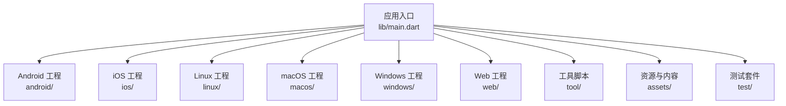
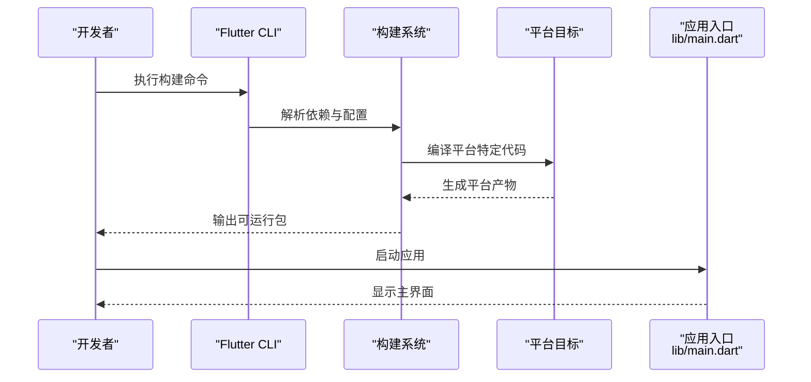
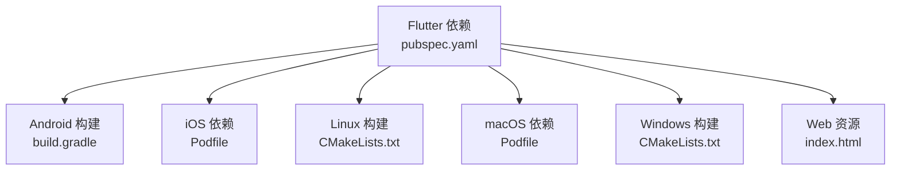

# 快速开始

<cite>
**本文引用的文件**   
- [README.md](file://README.md)
- [pubspec.yaml](file://pubspec.yaml)
- [Makefile](file://Makefile)
- [lib/main.dart](file://lib/main.dart)
- [android/build.gradle](file://android/build.gradle)
- [android/app/build.gradle](file://android/app/build.gradle)
- [android/gradle.properties](file://android/gradle.properties)
- [ios/Podfile](file://ios/Podfile)
- [macos/Podfile](file://macos/Podfile)
- [linux/CMakeLists.txt](file://linux/CMakeLists.txt)
- [windows/CMakeLists.txt](file://windows/CMakeLists.txt)
- [web/index.html](file://web/index.html)
- [tool/course_cli.py](file://tool/course_cli.py)
- [tool/build_release.py](file://tool/build_release.py)
</cite>

## 目录
1. [简介](#简介)
2. [项目结构](#项目结构)
3. [核心组件](#核心组件)
4. [架构总览](#架构总览)
5. [详细组件分析](#详细组件分析)
6. [依赖分析](#依赖分析)
7. [性能考虑](#性能考虑)
8. [故障排查指南](#故障排查指南)
9. [结论](#结论)
10. [附录](#附录)

## 简介
本指南面向首次接触 Varnamalaplus 的开发者，目标是帮助你在最短时间内完成环境准备、依赖安装、克隆与构建，并在 Android、iOS、Web 与桌面端（Linux/macOS/Windows）成功运行。文档同时提供常见环境问题解决方案、调试工具配置建议以及基本命令行操作示例，帮助你快速进入开发状态。

## 项目结构
Varnamalaplus 是一个基于 Flutter 的多平台应用，包含以下关键目录：
- lib：Flutter 应用源码入口与业务模块
- android / ios / linux / macos / windows / web：各平台工程与资源
- tool：辅助脚本（课程处理、音频生成、发布构建等）
- assets：课程数据、图片与声音资源
- test：单元测试、集成测试与黄金测试
- docs：设计决策与作者指南

图表来源
- [lib/main.dart:1-200](file://lib/main.dart#L1-L200)
- [android/build.gradle:1-200](file://android/build.gradle#L1-L200)
- [ios/Podfile:1-200](file://ios/Podfile#L1-L200)
- [linux/CMakeLists.txt:1-200](file://linux/CMakeLists.txt#L1-L200)
- [macos/Podfile:1-200](file://macos/Podfile#L1-L200)
- [windows/CMakeLists.txt:1-200](file://windows/CMakeLists.txt#L1-L200)
- [web/index.html:1-200](file://web/index.html#L1-L200)

章节来源
- [README.md:1-200](file://README.md#L1-L200)
- [pubspec.yaml:1-200](file://pubspec.yaml#L1-L200)

## 核心组件
- 应用入口与路由初始化：位于 lib/main.dart，负责启动 Flutter 引擎、初始化依赖注入与路由。
- 平台适配层：android、ios、linux、macos、windows、web 各自包含平台特定的构建配置与原生桥接代码。
- 工具链：tool 目录下提供课程数据处理、音频生成与发布构建脚本，便于自动化流程。
- 资源管理：assets 目录集中存放课程数据、图片与声音，供运行时加载。
- 测试体系：test 目录覆盖单元、集成与黄金测试，保障功能稳定性。

章节来源
- [lib/main.dart:1-200](file://lib/main.dart#L1-L200)
- [tool/course_cli.py:1-200](file://tool/course_cli.py#L1-L200)
- [tool/build_release.py:1-200](file://tool/build_release.py#L1-L200)

## 架构总览
下图展示了从应用入口到各平台构建产物的整体流程。Flutter 代码通过平台插件与原生层交互，最终生成对应平台的可执行或 Web 产物。

图表来源
- [lib/main.dart:1-200](file://lib/main.dart#L1-L200)
- [android/build.gradle:1-200](file://android/build.gradle#L1-L200)
- [ios/Podfile:1-200](file://ios/Podfile#L1-L200)
- [linux/CMakeLists.txt:1-200](file://linux/CMakeLists.txt#L1-L200)
- [macos/Podfile:1-200](file://macos/Podfile#L1-L200)
- [windows/CMakeLists.txt:1-200](file://windows/CMakeLists.txt#L1-L200)
- [web/index.html:1-200](file://web/index.html#L1-L200)

## 详细组件分析

### 环境搭建与依赖安装
- 安装 Flutter SDK 并配置环境变量，确保 flutter doctor 无错误。
- 安装各平台所需依赖：
  - Android：Android Studio、SDK、NDK、Gradle 与模拟器或真机。
  - iOS：Xcode、CocoaPods 与 iOS 模拟器或真机。
  - Linux：GCC、CMake、Flutter Linux 依赖。
  - macOS：Xcode、CocoaPods、Flutter macOS 依赖。
  - Windows：Visual Studio 与 CMake。
  - Web：现代浏览器与 Chrome 用于调试。
- 在仓库根目录执行依赖拉取与预检查。

章节来源
- [README.md:1-200](file://README.md#L1-L200)
- [pubspec.yaml:1-200](file://pubspec.yaml#L1-L200)

### 项目克隆与构建流程
- 克隆仓库后，进入项目根目录。
- 使用 Flutter 命令获取依赖并验证环境。
- 选择目标平台进行构建与运行：
  - Android：连接设备或启动模拟器后运行。
  - iOS：连接设备或启动模拟器后运行。
  - Web：在本地启动 Web 服务器或通过 Flutter 直接运行。
  - 桌面端：分别针对 Linux、macOS、Windows 构建与运行。

章节来源
- [Makefile:1-200](file://Makefile#L1-L200)
- [pubspec.yaml:1-200](file://pubspec.yaml#L1-L200)

### 平台具体说明

#### Android
- 确保 Android SDK、NDK、Gradle 版本与项目要求一致。
- 检查 android/gradle.properties 中的 JDK 路径与编译选项。
- 使用 Gradle Wrapper 构建，避免版本冲突。

章节来源
- [android/build.gradle:1-200](file://android/build.gradle#L1-L200)
- [android/app/build.gradle:1-200](file://android/app/build.gradle#L1-L200)
- [android/gradle.properties:1-200](file://android/gradle.properties#L1-L200)

#### iOS
- 安装 CocoaPods 并更新依赖。
- 使用 Xcode 打开 Runner 工程或直接通过 Flutter 命令运行。
- 确保签名与证书配置正确以支持真机调试。

章节来源
- [ios/Podfile:1-200](file://ios/Podfile#L1-L200)

#### Web
- 使用 Chrome 作为默认调试浏览器。
- 如需自定义 Web 入口，修改 web/index.html 与 manifest.json。

章节来源
- [web/index.html:1-200](file://web/index.html#L1-L200)

#### Linux
- 安装必要的系统库与编译器。
- 使用 CMake 构建并运行。

章节来源
- [linux/CMakeLists.txt:1-200](file://linux/CMakeLists.txt#L1-L200)

#### macOS
- 安装 CocoaPods 与必要依赖。
- 通过 Xcode 或 Flutter 命令运行。

章节来源
- [macos/Podfile:1-200](file://macos/Podfile#L1-L200)

#### Windows
- 安装 Visual Studio 与 CMake。
- 使用 Flutter 命令构建与运行。

章节来源
- [windows/CMakeLists.txt:1-200](file://windows/CMakeLists.txt#L1-L200)

### 调试工具配置
- 启用 Flutter DevTools 进行性能分析与内存诊断。
- 在 Android/iOS 上使用 Logcat/Xcode Console 查看日志。
- 在 Web 上使用浏览器开发者工具进行网络与渲染调试。
- 在桌面端使用平台原生调试器（如 LLDB/GDB）。

章节来源
- [lib/main.dart:1-200](file://lib/main.dart#L1-L200)

### 首次运行验证
- 启动应用后确认主界面正常加载。
- 尝试切换语言或课程模块，验证资源加载。
- 播放音频或触发 TTS，确认媒体功能正常。

章节来源
- [lib/main.dart:1-200](file://lib/main.dart#L1-L200)

### 基本命令行操作示例
- 获取依赖与环境检查
- 运行目标平台应用
- 构建发布包（Android APK/AAB、iOS IPA、Web 静态资源、桌面安装包）
- 运行测试套件

章节来源
- [Makefile:1-200](file://Makefile#L1-L200)
- [tool/build_release.py:1-200](file://tool/build_release.py#L1-L200)

### 开发工作流指导
- 使用 Git 分支策略进行功能开发与合并。
- 提交前运行测试与静态分析，确保代码质量。
- 使用工具脚本批量处理课程内容与音频资源。
- 定期更新依赖并检查兼容性。

章节来源
- [tool/course_cli.py:1-200](file://tool/course_cli.py#L1-L200)
- [tool/build_release.py:1-200](file://tool/build_release.py#L1-L200)

## 依赖分析
下图展示 Flutter 应用与各平台构建系统的依赖关系。

图表来源
- [pubspec.yaml:1-200](file://pubspec.yaml#L1-L200)
- [android/build.gradle:1-200](file://android/build.gradle#L1-L200)
- [ios/Podfile:1-200](file://ios/Podfile#L1-L200)
- [linux/CMakeLists.txt:1-200](file://linux/CMakeLists.txt#L1-L200)
- [macos/Podfile:1-200](file://macos/Podfile#L1-L200)
- [windows/CMakeLists.txt:1-200](file://windows/CMakeLists.txt#L1-L200)
- [web/index.html:1-200](file://web/index.html#L1-L200)

章节来源
- [pubspec.yaml:1-200](file://pubspec.yaml#L1-L200)

## 性能考虑
- 合理分包与懒加载，减少首屏加载时间。
- 使用缓存策略优化资源访问。
- 避免在主线程执行耗时任务，使用后台线程处理。
- 监控内存与 CPU 使用，及时定位瓶颈。

## 故障排查指南
- 依赖拉取失败：清理缓存并重新拉取依赖。
- 平台构建失败：检查编译器与 SDK 版本是否匹配。
- 运行时崩溃：查看平台日志与堆栈信息。
- 资源加载异常：确认资源路径与权限配置。

章节来源
- [lib/main.dart:1-200](file://lib/main.dart#L1-L200)

## 结论
通过本指南，你应已完成 Varnamalaplus 的环境搭建、依赖安装与多平台构建运行。建议结合测试与调试工具持续优化代码质量与性能，并遵循团队开发规范进行协作。

## 附录
- 常见问题与解决方案汇总
- 推荐编辑器与插件配置
- 第三方服务接入指南（如 TTS、音频播放）