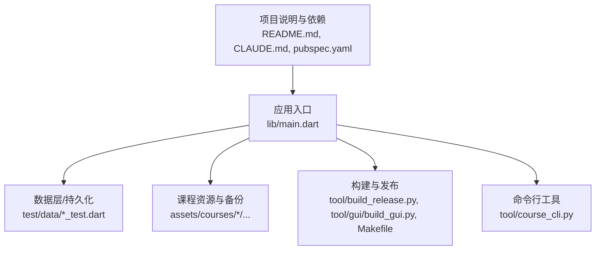
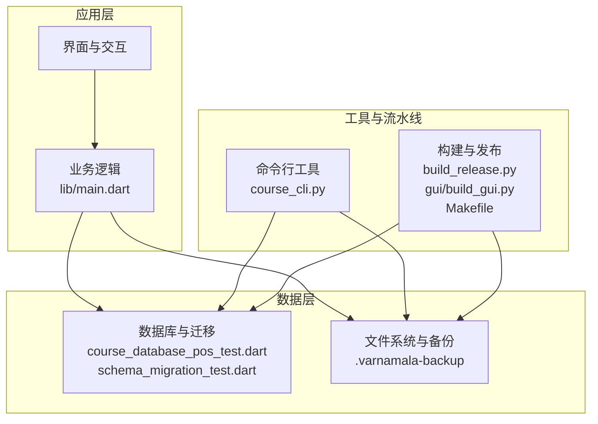
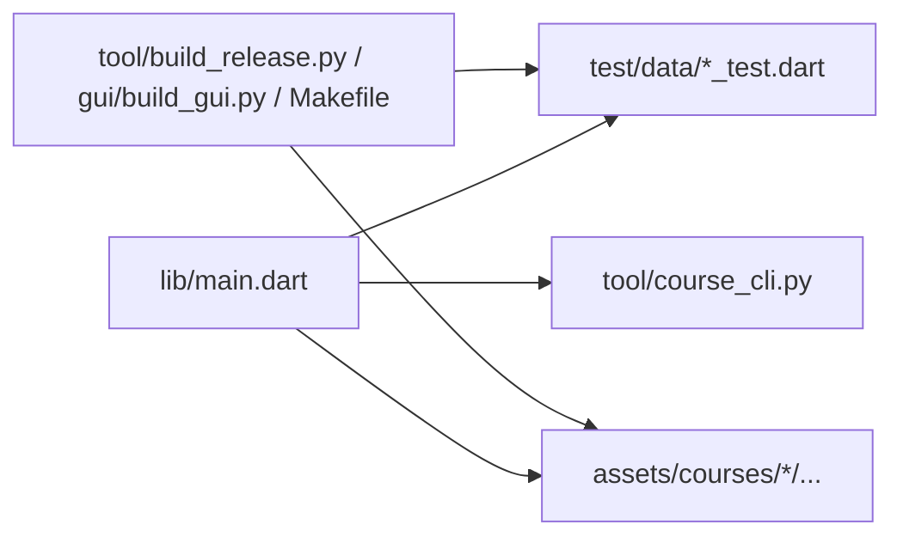

# 安全与备份

<cite>
**本文档引用的文件**   
- [README.md](file://README.md)
- [CLAUDE.md](file://CLAUDE.md)
- [Makefile](file://Makefile)
- [pubspec.yaml](file://pubspec.yaml)
- [lib/main.dart](file://lib/main.dart)
- [lib/data/course_database_pos_test.dart](file://test/data/course_database_pos_test.dart)
- [test/data/schema_migration_test.dart](file://test/data/schema_migration_test.dart)
- [assets/courses/turkish/.varnamala-backup/...](file://assets/courses/turkish/.varnamala-backup)
- [tool/course_cli.py](file://tool/course_cli.py)
- [tool/build_release.py](file://tool/build_release.py)
- [tool/gui/build_gui.py](file://tool/gui/build_gui.py)
</cite>

## 目录
1. [简介](#简介)
2. [项目结构](#项目结构)
3. [核心组件](#核心组件)
4. [架构总览](#架构总览)
5. [详细组件分析](#详细组件分析)
6. [依赖关系分析](#依赖关系分析)
7. [性能考虑](#性能考虑)
8. [故障排查指南](#故障排查指南)
9. [结论](#结论)
10. [附录](#附录)

## 简介
本技术文档聚焦 Varnamalaplus 的数据安全与备份体系，围绕数据加密存储、敏感信息保护、访问权限控制、自动与增量备份策略、手动备份流程、数据恢复与版本管理、灾难恢复方案、数据完整性校验与防篡改机制、安全审计以及存储空间管理与清理策略进行系统化说明。文档面向开发者与运维人员，既提供高层架构视图，也给出可操作的配置与实践建议。

## 项目结构
Varnamalaplus 采用 Flutter 多端应用结构，核心业务代码位于 lib 目录，测试在 test 目录，工具脚本在 tool 目录，资源与课程数据在 assets 目录。与安全与备份相关的要点包括：
- 应用入口与初始化：lib/main.dart
- 数据库与迁移：test/data/course_database_pos_test.dart、test/data/schema_migration_test.dart
- 课程数据与备份目录：assets/courses/turkish/.varnamala-backup
- 构建与发布流程：tool/build_release.py、tool/gui/build_gui.py、Makefile
- 命令行工具：tool/course_cli.py
- 项目说明与约束：README.md、CLAUDE.md、pubspec.yaml

图表来源
- [lib/main.dart](file://lib/main.dart)
- [test/data/course_database_pos_test.dart](file://test/data/course_database_pos_test.dart)
- [test/data/schema_migration_test.dart](file://test/data/schema_migration_test.dart)
- [assets/courses/turkish/.varnamala-backup](file://assets/courses/turkish/.varnamala-backup)
- [tool/build_release.py](file://tool/build_release.py)
- [tool/gui/build_gui.py](file://tool/gui/build_gui.py)
- [Makefile](file://Makefile)
- [tool/course_cli.py](file://tool/course_cli.py)
- [README.md](file://README.md)
- [CLAUDE.md](file://CLAUDE.md)
- [pubspec.yaml](file://pubspec.yaml)

章节来源
- [README.md](file://README.md)
- [CLAUDE.md](file://CLAUDE.md)
- [Makefile](file://Makefile)
- [pubspec.yaml](file://pubspec.yaml)
- [lib/main.dart](file://lib/main.dart)

## 核心组件
- 数据持久化与迁移
  - 通过数据库测试用例体现数据模型与迁移能力，确保 schema 演进的可追溯性与回滚可行性。
- 课程数据与备份目录
  - 课程资源以 JSON 等结构化文件组织，并在 .varnamala-backup 目录下维护历史快照，便于版本回溯与恢复。
- 构建与发布流水线
  - 构建脚本负责打包、签名与产物生成，是安全基线与完整性校验的关键环节。
- 命令行工具
  - 提供课程导入导出、校验与批量处理的能力，支撑备份与恢复的自动化。

章节来源
- [test/data/course_database_pos_test.dart](file://test/data/course_database_pos_test.dart)
- [test/data/schema_migration_test.dart](file://test/data/schema_migration_test.dart)
- [assets/courses/turkish/.varnamala-backup](file://assets/courses/turkish/.varnamala-backup)
- [tool/course_cli.py](file://tool/course_cli.py)
- [tool/build_release.py](file://tool/build_release.py)
- [tool/gui/build_gui.py](file://tool/gui/build_gui.py)
- [Makefile](file://Makefile)

## 架构总览
数据安全与备份系统由“应用层—数据层—工具与流水线”三层构成：
- 应用层：负责用户交互与业务逻辑，调用数据层接口完成读写；在关键操作前后触发备份或校验。
- 数据层：实现数据持久化、加密存储（如适用）、完整性校验与版本管理；暴露统一的 API。
- 工具与流水线：构建、打包、签名、校验与发布；命令行工具支持批量备份、恢复与审计。

图表来源
- [lib/main.dart](file://lib/main.dart)
- [test/data/course_database_pos_test.dart](file://test/data/course_database_pos_test.dart)
- [test/data/schema_migration_test.dart](file://test/data/schema_migration_test.dart)
- [assets/courses/turkish/.varnamala-backup](file://assets/courses/turkish/.varnamala-backup)
- [tool/course_cli.py](file://tool/course_cli.py)
- [tool/build_release.py](file://tool/build_release.py)
- [tool/gui/build_gui.py](file://tool/gui/build_gui.py)
- [Makefile](file://Makefile)

## 详细组件分析

### 数据加密存储与敏感信息保护
- 目标
  - 对敏感字段（如用户凭据、学习进度、私有内容）进行加密存储，避免明文泄露。
  - 在内存中尽量缩短敏感数据的生命周期，使用安全的随机源生成密钥材料。
- 实践建议
  - 使用平台提供的安全存储（如 Android Keystore、iOS Keychain）管理密钥。
  - 对静态数据进行透明加密（如 SQLite 列级加密或文件级加密），并记录加密元数据。
  - 对日志与调试输出进行脱敏，禁止打印敏感信息。
- 验证方式
  - 单元测试覆盖加解密路径，确保输入输出符合预期。
  - 渗透测试与静态扫描检查硬编码密钥与明文敏感信息。

章节来源
- [test/data/course_database_pos_test.dart](file://test/data/course_database_pos_test.dart)
- [test/data/schema_migration_test.dart](file://test/data/schema_migration_test.dart)

### 访问权限控制
- 目标
  - 基于角色与最小权限原则限制数据访问范围。
  - 在应用内实现细粒度授权，对外部工具与脚本进行鉴权。
- 实践建议
  - 在数据层引入访问控制中间件，统一拦截读/写请求并校验权限。
  - 为不同环境（开发、测试、生产）配置隔离的密钥与权限策略。
  - 对备份与恢复操作增加二次确认与审计记录。

章节来源
- [lib/main.dart](file://lib/main.dart)
- [tool/course_cli.py](file://tool/course_cli.py)

### 自动备份机制与增量备份
- 目标
  - 在数据变更时自动创建增量快照，减少备份体积与时间。
  - 支持定时任务与事件驱动两种触发模式。
- 实践建议
  - 基于文件哈希或数据库事务日志识别变更集，仅备份差异部分。
  - 将增量快照与全量基线分离存储，恢复时按顺序合并。
  - 在备份过程中保证原子性，失败则回滚，避免产生不一致状态。

章节来源
- [assets/courses/turkish/.varnamala-backup](file://assets/courses/turkish/.varnamala-backup)
- [tool/course_cli.py](file://tool/course_cli.py)

### 手动备份策略
- 目标
  - 允许用户在关键操作前手动触发全量或选择性备份。
  - 提供备份预览与校验功能，确保备份可用。
- 实践建议
  - 在 UI 中提供“立即备份”按钮，支持选择备份范围（课程、设置、进度）。
  - 备份完成后生成校验摘要（如 SHA-256），并写入清单文件。
  - 支持导出为压缩包，便于离线归档与跨设备迁移。

章节来源
- [tool/course_cli.py](file://tool/course_cli.py)
- [assets/courses/turkish/.varnamala-backup](file://assets/courses/turkish/.varnamala-backup)

### 数据恢复流程与版本管理
- 目标
  - 从备份快速恢复到指定版本，支持回滚与向前迁移。
  - 提供版本树与标签，便于定位与选择恢复点。
- 实践建议
  - 恢复前执行一致性检查，比对清单与摘要。
  - 恢复过程分阶段执行（准备、校验、写入、验证），每步可独立回滚。
  - 恢复后自动触发完整性校验与冒烟测试，确保数据可用。

章节来源
- [test/data/schema_migration_test.dart](file://test/data/schema_migration_test.dart)
- [assets/courses/turkish/.varnamala-backup](file://assets/courses/turkish/.varnamala-backup)

### 灾难恢复方案
- 目标
  - 在极端场景（设备损坏、数据丢失）下快速重建可用环境。
  - 支持异地容灾与多副本策略。
- 实践建议
  - 制定 RTO/RPO 目标，设计多级备份（本地、云端、离线介质）。
  - 定期演练恢复流程，更新应急预案与操作手册。
  - 建立监控告警，检测备份失败与存储异常。

章节来源
- [tool/build_release.py](file://tool/build_release.py)
- [tool/gui/build_gui.py](file://tool/gui/build_gui.py)
- [Makefile](file://Makefile)

### 数据完整性验证与防篡改机制
- 目标
  - 确保数据在传输与存储过程中的完整性与不可篡改性。
  - 提供可验证的审计链，便于事后追责与分析。
- 实践建议
  - 对每个备份包生成数字摘要，并与清单绑定；恢复时重新计算并比对。
  - 对关键元数据使用数字签名，防止恶意替换。
  - 记录操作审计日志，包含时间戳、操作者、对象与结果。

章节来源
- [tool/course_cli.py](file://tool/course_cli.py)
- [assets/courses/turkish/.varnamala-backup](file://assets/courses/turkish/.varnamala-backup)

### 安全审计
- 目标
  - 对所有敏感操作进行审计，满足合规要求。
  - 提供审计查询与报表能力。
- 实践建议
  - 集中式审计日志，支持分级分类与检索。
  - 定期审计与异常告警，结合 SIEM 系统进行关联分析。
  - 对审计日志本身进行保护与完整性校验。

章节来源
- [tool/course_cli.py](file://tool/course_cli.py)
- [tool/build_release.py](file://tool/build_release.py)

### 备份策略配置、存储空间管理与清理策略
- 目标
  - 灵活配置备份频率、保留周期与压缩策略。
  - 自动清理过期备份，释放存储空间。
- 实践建议
  - 配置项包括：全量/增量比例、保留天数、最大副本数、压缩算法。
  - 清理策略基于 LRU 或时间窗口，优先删除旧且冗余的增量快照。
  - 清理前进行预检与通知，避免误删重要备份。

章节来源
- [assets/courses/turkish/.varnamala-backup](file://assets/courses/turkish/.varnamala-backup)
- [tool/course_cli.py](file://tool/course_cli.py)

## 依赖关系分析
- 应用入口依赖数据层与工具链，形成“读取—处理—持久化—备份—校验”的闭环。
- 构建与发布流程依赖脚本与配置文件，确保产物一致性与安全性。
- 命令行工具与备份目录耦合度较高，需保持接口稳定与向后兼容。

图表来源
- [lib/main.dart](file://lib/main.dart)
- [test/data/course_database_pos_test.dart](file://test/data/course_database_pos_test.dart)
- [test/data/schema_migration_test.dart](file://test/data/schema_migration_test.dart)
- [assets/courses/turkish/.varnamala-backup](file://assets/courses/turkish/.varnamala-backup)
- [tool/course_cli.py](file://tool/course_cli.py)
- [tool/build_release.py](file://tool/build_release.py)
- [tool/gui/build_gui.py](file://tool/gui/build_gui.py)
- [Makefile](file://Makefile)

章节来源
- [lib/main.dart](file://lib/main.dart)
- [tool/course_cli.py](file://tool/course_cli.py)
- [tool/build_release.py](file://tool/build_release.py)
- [tool/gui/build_gui.py](file://tool/gui/build_gui.py)
- [Makefile](file://Makefile)

## 性能考虑
- 备份性能
  - 增量备份优先，减少 I/O 与 CPU 开销；并行处理非依赖任务。
  - 使用高效压缩算法（如 zstd）平衡速度与体积。
- 恢复性能
  - 预解析清单与索引，按需加载；避免全量解压。
  - 校验与恢复流水线化，提升吞吐。
- 存储优化
  - 去重与分层存储（热/冷数据）；合理设置缓存与淘汰策略。
- 监控与调优
  - 采集备份时长、成功率、空间占用等指标，持续优化。

[本节为通用指导，不直接分析具体文件]

## 故障排查指南
- 常见问题
  - 备份失败：检查磁盘空间、权限与网络；查看错误码与日志。
  - 恢复失败：核对清单与摘要；确认版本兼容性与依赖完整性。
  - 性能退化：分析 I/O 瓶颈与锁竞争；调整并发与批大小。
- 诊断步骤
  - 启用详细日志与追踪；复现问题并收集上下文。
  - 使用命令行工具进行健康检查与自检。
  - 对比正常与异常状态的元数据差异。
- 应急措施
  - 切换到备用备份；必要时回滚到上一稳定版本。
  - 隔离受影响服务，避免扩散影响。

章节来源
- [tool/course_cli.py](file://tool/course_cli.py)
- [test/data/schema_migration_test.dart](file://test/data/schema_migration_test.dart)

## 结论
Varnamalaplus 的安全与备份体系应以“加密存储、权限控制、增量备份、完整校验、审计可追溯”为核心原则，结合构建与发布流水线保障端到端安全。通过清晰的架构设计与严格的工程实践，可实现高可靠的数据保护与快速恢复能力，满足生产环境的严苛要求。

[本节为总结性内容，不直接分析具体文件]

## 附录
- 术语表
  - 增量备份：仅备份自上次备份以来发生变化的数据。
  - 全量备份：备份全部数据，作为增量恢复的基础。
  - 数字摘要：用于验证数据完整性的哈希值。
  - 审计日志：记录系统操作与事件的日志集合。
- 参考文件
  - README.md、CLAUDE.md、Makefile、pubspec.yaml 提供项目背景与约束。
  - lib/main.dart 为应用入口，协调各子系统协作。
  - test/data/*_test.dart 体现数据层能力与迁移策略。
  - assets/courses/turkish/.varnamala-backup 展示备份目录结构与快照组织。
  - tool/course_cli.py、tool/build_release.py、tool/gui/build_gui.py、Makefile 支撑构建、发布与工具链。

章节来源
- [README.md](file://README.md)
- [CLAUDE.md](file://CLAUDE.md)
- [Makefile](file://Makefile)
- [pubspec.yaml](file://pubspec.yaml)
- [lib/main.dart](file://lib/main.dart)
- [test/data/course_database_pos_test.dart](file://test/data/course_database_pos_test.dart)
- [test/data/schema_migration_test.dart](file://test/data/schema_migration_test.dart)
- [assets/courses/turkish/.varnamala-backup](file://assets/courses/turkish/.varnamala-backup)
- [tool/course_cli.py](file://tool/course_cli.py)
- [tool/build_release.py](file://tool/build_release.py)
- [tool/gui/build_gui.py](file://tool/gui/build_gui.py)