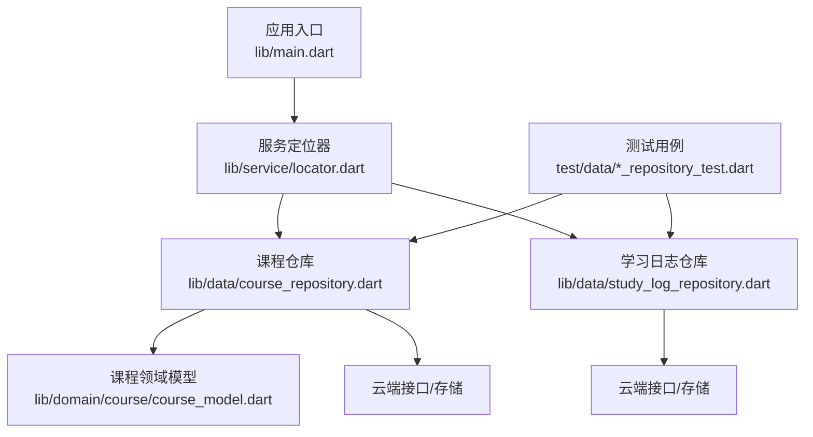
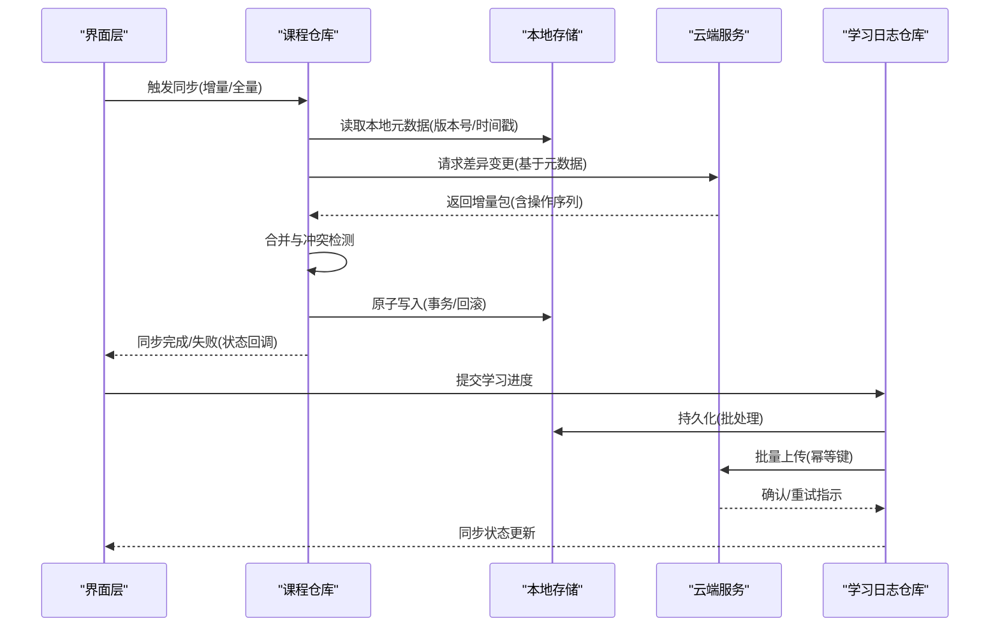
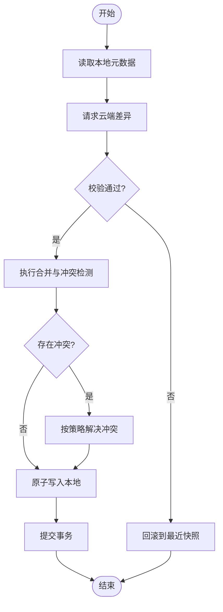
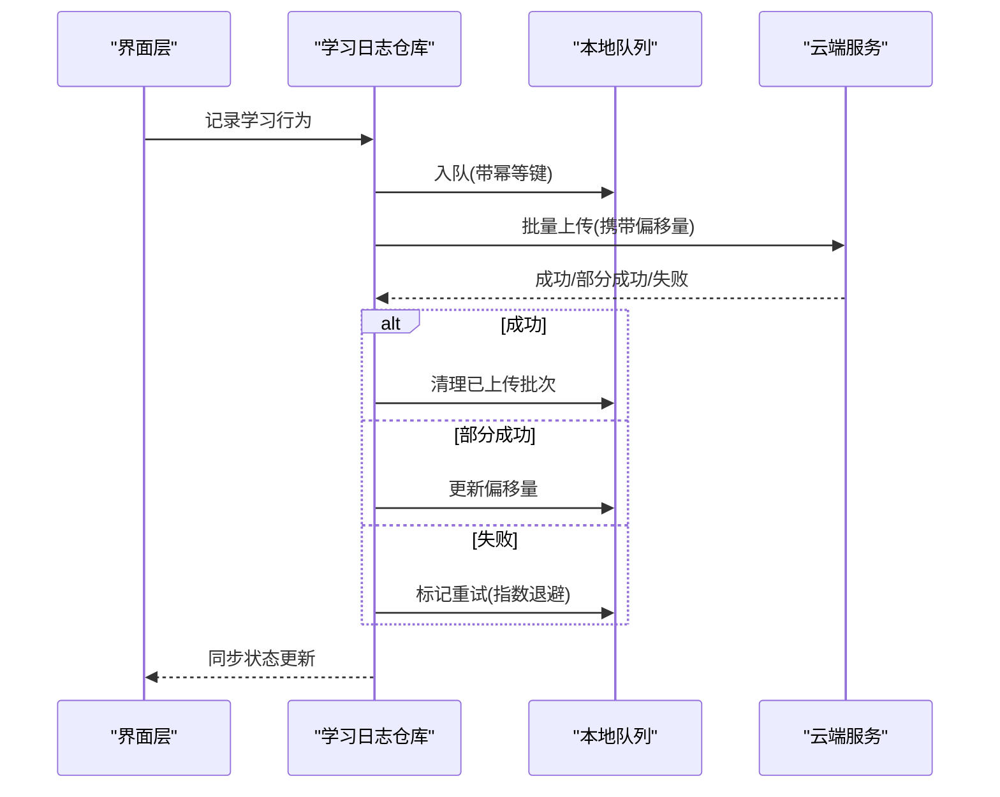
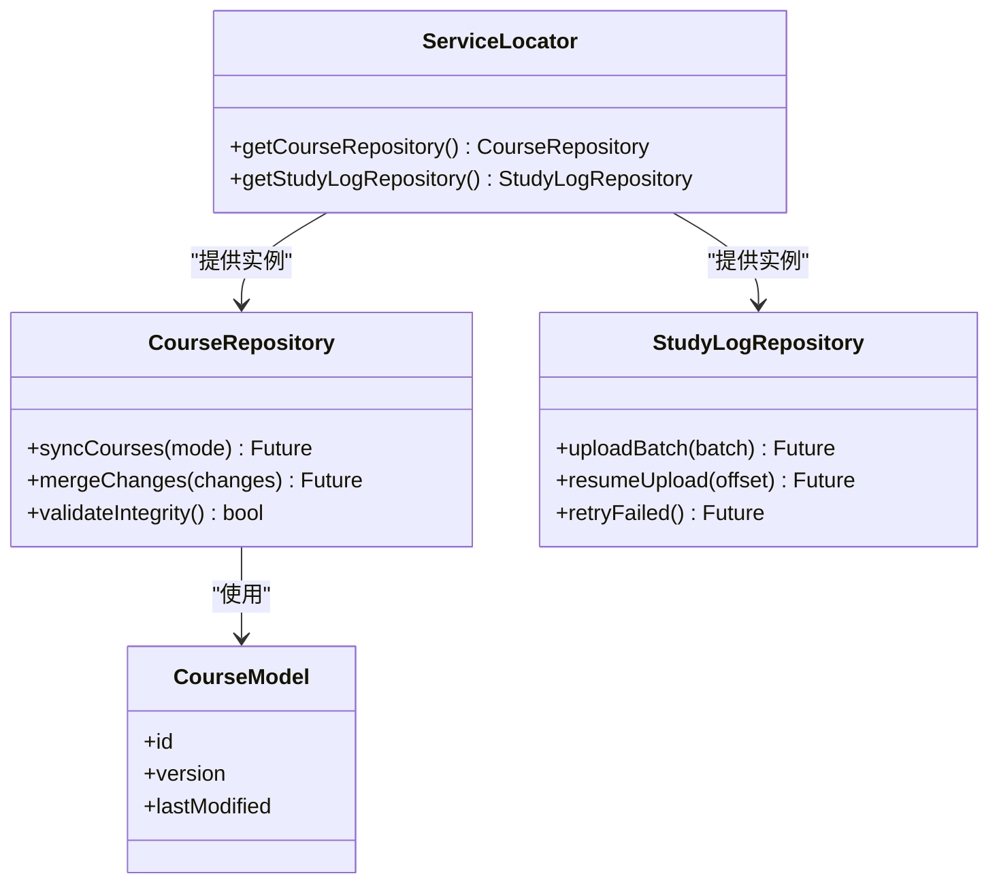

# 数据同步

<cite>
**本文引用的文件**   
- [README.md](file://README.md)
- [lib/main.dart](file://lib/main.dart)
- [lib/data/course_repository.dart](file://lib/data/course_repository.dart)
- [lib/data/study_log_repository.dart](file://lib/data/study_log_repository.dart)
- [lib/domain/course/course_model.dart](file://lib/domain/course/course_model.dart)
- [lib/service/locator.dart](file://lib/service/locator.dart)
- [test/data/course_repository_test.dart](file://test/data/course_repository_test.dart)
- [test/data/study_log_repository_test.dart](file://test/data/study_log_repository_test.dart)
- [docs/decisions/0023-git-branch-and-conflict-resolution.md](file://docs/decisions/0023-git-branch-and-conflict-resolution.md)
- [docs/decisions/0022-git-auth-and-credential-store.md](file://docs/decisions/0022-git-auth-and-credential-store.md)
</cite>

## 目录
1. [简介](#简介)
2. [项目结构](#项目结构)
3. [核心组件](#核心组件)
4. [架构总览](#架构总览)
5. [详细组件分析](#详细组件分析)
6. [依赖关系分析](#依赖关系分析)
7. [性能考量](#性能考量)
8. [故障排查指南](#故障排查指南)
9. [结论](#结论)
10. [附录](#附录)

## 简介
本技术文档聚焦 Varnamalaplus 的数据同步机制，围绕本地与云端数据同步、增量同步策略、冲突解决、课程数据同步、用户进度同步、设置项同步的实现原理展开。同时覆盖断点续传、网络异常处理与重试机制、数据一致性验证与完整性检查、回滚策略，以及同步状态监控、日志记录与调试工具使用方法。文档旨在帮助开发者快速理解并扩展同步能力，确保跨设备一致性与高可用。

## 项目结构
本项目采用 Flutter 多端应用结构，核心逻辑位于 lib 目录，测试位于 test 目录，设计决策与规范位于 docs/decisions。与数据同步相关的关键位置包括：
- 领域模型与数据层：lib/domain 与 lib/data
- 服务定位与依赖注入：lib/service
- 应用入口与初始化：lib/main.dart
- 测试用例：test/data 下的仓库级测试
- 设计决策：docs/decisions 中的分支与冲突策略、认证与凭据存储等

图表来源
- [lib/main.dart](file://lib/main.dart)
- [lib/service/locator.dart](file://lib/service/locator.dart)
- [lib/data/course_repository.dart](file://lib/data/course_repository.dart)
- [lib/data/study_log_repository.dart](file://lib/data/study_log_repository.dart)
- [lib/domain/course/course_model.dart](file://lib/domain/course/course_model.dart)
- [test/data/course_repository_test.dart](file://test/data/course_repository_test.dart)
- [test/data/study_log_repository_test.dart](file://test/data/study_log_repository_test.dart)

章节来源
- [README.md](file://README.md)
- [lib/main.dart](file://lib/main.dart)
- [lib/service/locator.dart](file://lib/service/locator.dart)

## 核心组件
- 课程仓库（CourseRepository）：负责课程数据的本地缓存与云端同步，支持增量拉取与合并，维护版本或时间戳以驱动增量同步。
- 学习日志仓库（StudyLogRepository）：负责用户学习进度、练习结果、SRS 状态等数据的本地持久化与云端同步，支持批量上传与幂等写入。
- 服务定位器（ServiceLocator）：集中管理仓库实例与依赖注入，便于在应用生命周期内统一初始化与销毁。
- 领域模型（CourseModel 等）：定义课程实体结构与校验规则，为同步提供强类型保障。

章节来源
- [lib/data/course_repository.dart](file://lib/data/course_repository.dart)
- [lib/data/study_log_repository.dart](file://lib/data/study_log_repository.dart)
- [lib/service/locator.dart](file://lib/service/locator.dart)
- [lib/domain/course/course_model.dart](file://lib/domain/course/course_model.dart)

## 架构总览
数据同步采用“仓库模式 + 领域模型”的分层架构。仓库封装本地存储与远程 API 的交互细节，向上暴露统一的同步接口；领域模型保证数据结构与约束的一致性；服务定位器负责依赖注入与生命周期管理。

图表来源
- [lib/data/course_repository.dart](file://lib/data/course_repository.dart)
- [lib/data/study_log_repository.dart](file://lib/data/study_log_repository.dart)
- [lib/service/locator.dart](file://lib/service/locator.dart)

## 详细组件分析

### 课程数据同步（CourseRepository）
- 增量同步：通过本地元数据（如 lastSyncTimestamp、etag/version）向云端请求差异，减少带宽与延迟。
- 合并策略：对新增、更新、删除三类操作进行有序合并，避免重复与丢失。
- 冲突解决：当本地与云端存在同一实体的并发修改时，依据时间戳或版本号选择保留策略（如“服务端优先”或“用户手动合并”）。
- 完整性校验：对下载包进行哈希校验，确保内容未被篡改或损坏。
- 回滚机制：在合并失败或校验不通过时，回滚到上次已知一致的快照。

图表来源
- [lib/data/course_repository.dart](file://lib/data/course_repository.dart)
- [docs/decisions/0023-git-branch-and-conflict-resolution.md](file://docs/decisions/0023-git-branch-and-conflict-resolution.md)

章节来源
- [lib/data/course_repository.dart](file://lib/data/course_repository.dart)
- [test/data/course_repository_test.dart](file://test/data/course_repository_test.dart)
- [docs/decisions/0023-git-branch-and-conflict-resolution.md](file://docs/decisions/0023-git-branch-and-conflict-resolution.md)

### 用户进度同步（StudyLogRepository）
- 批量上传：将多次学习行为聚合为批次，降低网络开销。
- 幂等性：使用唯一键（如 userId+lessonId+timestamp）避免重复提交。
- 断点续传：记录已上传批次的偏移量，网络中断后可从断点继续。
- 重试机制：对可重试错误（如超时、限流）实施指数退避重试。
- 一致性：上传成功后再清理本地待上传队列，失败则保留并重试。

图表来源
- [lib/data/study_log_repository.dart](file://lib/data/study_log_repository.dart)
- [test/data/study_log_repository_test.dart](file://test/data/study_log_repository_test.dart)

章节来源
- [lib/data/study_log_repository.dart](file://lib/data/study_log_repository.dart)
- [test/data/study_log_repository_test.dart](file://test/data/study_log_repository_test.dart)

### 设置项同步
- 设置项通常较小且变更频率低，可采用全量拉取与本地覆盖策略。
- 版本控制：云端设置项附带版本号，客户端比较后决定是否更新。
- 冲突处理：若本地有未同步的设置变更，优先提示用户或自动合并（取决于字段语义）。

章节来源
- [lib/data/course_repository.dart](file://lib/data/course_repository.dart)
- [lib/data/study_log_repository.dart](file://lib/data/study_log_repository.dart)

### 认证与凭据存储
- 安全存储：敏感凭据（如 Token）应加密存储于系统安全容器。
- 刷新机制：Token 过期时自动刷新，失败则降级为离线模式或引导重新登录。
- 权限控制：不同用户或角色对应不同的数据可见性与操作权限。

章节来源
- [docs/decisions/0022-git-auth-and-credential-store.md](file://docs/decisions/0022-git-auth-and-credential-store.md)

## 依赖关系分析
仓库之间通过服务定位器解耦，避免循环依赖；领域模型作为契约，确保数据一致性。测试用例覆盖关键路径，保障同步逻辑的正确性。

图表来源
- [lib/data/course_repository.dart](file://lib/data/course_repository.dart)
- [lib/data/study_log_repository.dart](file://lib/data/study_log_repository.dart)
- [lib/service/locator.dart](file://lib/service/locator.dart)
- [lib/domain/course/course_model.dart](file://lib/domain/course/course_model.dart)

章节来源
- [lib/service/locator.dart](file://lib/service/locator.dart)
- [lib/domain/course/course_model.dart](file://lib/domain/course/course_model.dart)

## 性能考量
- 增量同步：仅传输差异数据，显著降低带宽与延迟。
- 批量上传：合并多条学习日志，减少请求次数。
- 缓存策略：热点课程数据本地缓存，提升加载速度。
- 压缩与分片：大文件分片传输，支持断点续传与并行下载。
- 重试与退避：指数退避避免雪崩，提高稳定性。

[本节为通用指导，无需特定文件引用]

## 故障排查指南
- 同步状态监控：通过仓库提供的状态回调或事件总线观察同步进度与结果。
- 日志记录：开启详细日志，记录请求、响应、错误码与堆栈，便于定位问题。
- 常见错误：
  - 网络超时：检查网络连通性与服务器状态，启用重试。
  - 权限不足：确认认证状态与权限配置。
  - 数据不一致：检查版本/时间戳与哈希校验，必要时回滚。
- 调试工具：
  - 模拟网络异常与延迟，验证重试与回滚逻辑。
  - 使用测试用例复现问题，逐步缩小范围。

章节来源
- [test/data/course_repository_test.dart](file://test/data/course_repository_test.dart)
- [test/data/study_log_repository_test.dart](file://test/data/study_log_repository_test.dart)

## 结论
Varnamalaplus 的数据同步机制以仓库模式为核心，结合领域模型与服务定位器，实现了稳定、高效、可扩展的本地与云端同步。通过增量同步、冲突解决、断点续传、重试与回滚等策略，保障了数据一致性与用户体验。建议持续完善监控与日志体系，强化测试覆盖，以提升系统的健壮性与可维护性。

[本节为总结，无需特定文件引用]

## 附录
- 设计决策参考：
  - 分支与冲突解决策略
  - 认证与凭据存储方案
- 测试用例参考：
  - 课程仓库测试
  - 学习日志仓库测试

章节来源
- [docs/decisions/0023-git-branch-and-conflict-resolution.md](file://docs/decisions/0023-git-branch-and-conflict-resolution.md)
- [docs/decisions/0022-git-auth-and-credential-store.md](file://docs/decisions/0022-git-auth-and-credential-store.md)
- [test/data/course_repository_test.dart](file://test/data/course_repository_test.dart)
- [test/data/study_log_repository_test.dart](file://test/data/study_log_repository_test.dart)