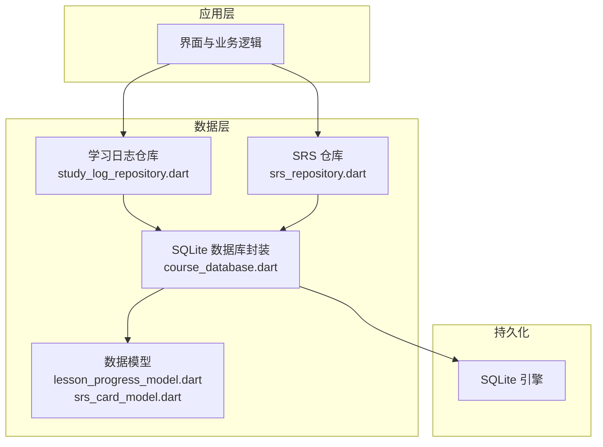
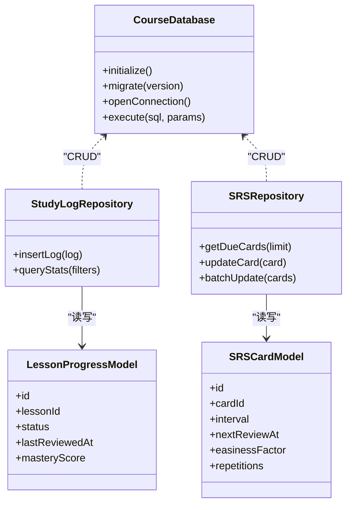
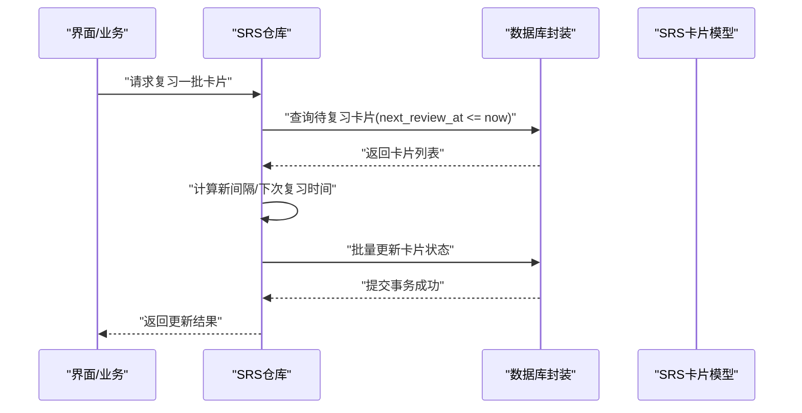
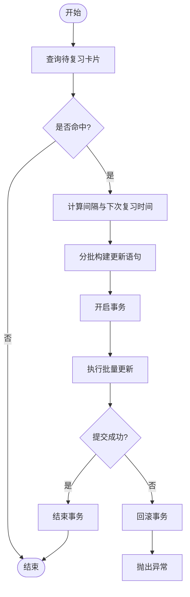
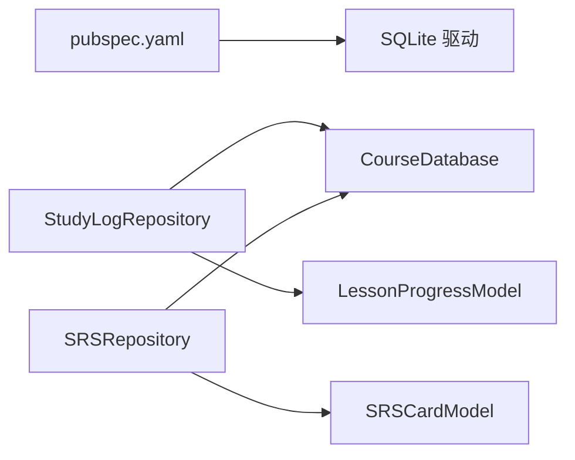

# 数据库设计

<cite>
**本文引用的文件**   
- [lib/data/course_database.dart](file://lib/data/course_database.dart)
- [lib/data/models/lesson_progress_model.dart](file://lib/data/models/lesson_progress_model.dart)
- [lib/data/models/srs_card_model.dart](file://lib/data/models/srs_card_model.dart)
- [lib/data/repositories/study_log_repository.dart](file://lib/data/repositories/study_log_repository.dart)
- [lib/data/repositories/srs_repository.dart](file://lib/data/repositories/srs_repository.dart)
- [test/data/schema_migration_test.dart](file://test/data/schema_migration_test.dart)
- [test/application/srs_persist_benchmark_test.dart](file://test/application/srs_persist_benchmark_test.dart)
- [pubspec.yaml](file://pubspec.yaml)
</cite>

## 目录
1. [简介](#简介)
2. [项目结构](#项目结构)
3. [核心组件](#核心组件)
4. [架构总览](#架构总览)
5. [详细组件分析](#详细组件分析)
6. [依赖关系分析](#依赖关系分析)
7. [性能考虑](#性能考虑)
8. [故障排查指南](#故障排查指南)
9. [结论](#结论)
10. [附录](#附录)

## 简介
本技术文档围绕 Varnamalaplus 的 SQLite 数据库设计与实现，系统阐述课程数据模型、用户学习进度存储、间隔重复（SRS）算法数据存储等核心实体与关系映射；说明数据库版本管理、迁移策略与兼容性处理；并给出查询优化、事务处理与并发访问控制机制。同时提供数据库初始化流程、连接池配置与性能监控方案，帮助开发者与维护者高效理解与扩展本地数据层。

## 项目结构
Varnamalaplus 采用 Flutter 工程组织，数据层位于 lib/data 下，包含数据库定义、数据模型、仓库与测试用例。关键路径如下：
- 数据库定义与初始化：lib/data/course_database.dart
- 数据模型：lib/data/models/*（如 lesson_progress_model.dart、srs_card_model.dart）
- 仓库层：lib/data/repositories/*（如 study_log_repository.dart、srs_repository.dart）
- 测试与基准：test/data/*、test/application/*

图表来源
- [lib/data/course_database.dart](file://lib/data/course_database.dart)
- [lib/data/models/lesson_progress_model.dart](file://lib/data/models/lesson_progress_model.dart)
- [lib/data/models/srs_card_model.dart](file://lib/data/models/srs_card_model.dart)
- [lib/data/repositories/study_log_repository.dart](file://lib/data/repositories/study_log_repository.dart)
- [lib/data/repositories/srs_repository.dart](file://lib/data/repositories/srs_repository.dart)

章节来源
- [lib/data/course_database.dart](file://lib/data/course_database.dart)
- [pubspec.yaml](file://pubspec.yaml)

## 核心组件
- 数据库封装与版本管理
  - 负责 SQLite 打开、版本升级、表创建与迁移脚本执行，确保多版本兼容与幂等初始化。
- 数据模型
  - 课程学习进度模型：记录每课的学习状态、完成时间、掌握度等。
  - SRS 卡片模型：记录卡片间隔、下次复习时间、记忆强度等。
- 仓库层
  - 学习日志仓库：聚合学习行为日志写入、统计查询。
  - SRS 仓库：封装 SRS 计算结果落库、批量更新、复习队列查询。

章节来源
- [lib/data/course_database.dart](file://lib/data/course_database.dart)
- [lib/data/models/lesson_progress_model.dart](file://lib/data/models/lesson_progress_model.dart)
- [lib/data/models/srs_card_model.dart](file://lib/data/models/srs_card_model.dart)
- [lib/data/repositories/study_log_repository.dart](file://lib/data/repositories/study_log_repository.dart)
- [lib/data/repositories/srs_repository.dart](file://lib/data/repositories/srs_repository.dart)

## 架构总览
整体采用“仓库-模型-数据库”分层：上层通过仓库调用数据访问方法，仓库将领域对象映射为数据模型，再由数据库封装统一执行 SQL，保证一致性与可维护性。

图表来源
- [lib/data/course_database.dart](file://lib/data/course_database.dart)
- [lib/data/models/lesson_progress_model.dart](file://lib/data/models/lesson_progress_model.dart)
- [lib/data/models/srs_card_model.dart](file://lib/data/models/srs_card_model.dart)
- [lib/data/repositories/study_log_repository.dart](file://lib/data/repositories/study_log_repository.dart)
- [lib/data/repositories/srs_repository.dart](file://lib/data/repositories/srs_repository.dart)

## 详细组件分析

### 数据库封装与版本管理（CourseDatabase）
- 职责
  - 初始化数据库连接与 WAL 模式（提升并发读性能）。
  - 版本管理与迁移：按版本号顺序执行迁移脚本，支持回滚与幂等重建。
  - 统一事务边界与错误处理，保证一致性。
- 关键点
  - 使用单一连接或受控连接池，避免频繁打开关闭。
  - 迁移脚本需具备向后兼容能力，新增字段默认值、重命名列采用增量方式。
  - 对高频写操作使用批量插入与事务包裹。

章节来源
- [lib/data/course_database.dart](file://lib/data/course_database.dart)

### 课程学习进度模型（LessonProgressModel）
- 字段建议
  - id：主键
  - lesson_id：课程课次标识
  - status：学习状态（未开始/进行中/已完成/已掌握）
  - last_reviewed_at：最近复习时间
  - mastery_score：掌握度评分
- 索引策略
  - 对 lesson_id 建立唯一索引，避免重复记录。
  - 对 last_reviewed_at 建立索引以支持按时间范围查询。
- 复杂度
  - 单条更新 O(1)，范围查询 O(log n)。

章节来源
- [lib/data/models/lesson_progress_model.dart](file://lib/data/models/lesson_progress_model.dart)

### SRS 卡片模型（SRSCardModel）
- 字段建议
  - id：主键
  - card_id：卡片唯一标识
  - interval：当前间隔天数
  - next_review_at：下次复习时间
  - easiness_factor：难度系数
  - repetitions：复习次数
- 索引策略
  - 对 next_review_at 建立索引以快速检索待复习卡片。
  - 对 card_id 建立唯一索引。
- 复杂度
  - 批量更新 O(k log n)，k 为更新数量。

章节来源
- [lib/data/models/srs_card_model.dart](file://lib/data/models/srs_card_model.dart)

### 学习日志仓库（StudyLogRepository）
- 职责
  - 记录学习行为（如点击、作答、时长），提供统计查询接口。
- 典型流程
  - 接收日志对象 → 校验与转换 → 事务内批量插入 → 返回结果或异常。
- 优化点
  - 使用 PRAGMA journal_mode=WAL 与 busy_timeout 提升并发写入吞吐。
  - 对过滤条件字段建立复合索引。

章节来源
- [lib/data/repositories/study_log_repository.dart](file://lib/data/repositories/study_log_repository.dart)

### SRS 仓库（SRSRepository）
- 职责
  - 获取待复习卡片、根据算法更新卡片状态、批量提交变更。
- 典型流程
  - 查询 due 卡片 → 计算新间隔与下次复习时间 → 批量更新 → 提交事务。
- 优化点
  - 分批处理大量卡片，避免单次事务过大导致锁竞争。
  - 使用 EXPLAIN ANALYZE 验证查询计划，必要时调整索引。

章节来源
- [lib/data/repositories/srs_repository.dart](file://lib/data/repositories/srs_repository.dart)

### 数据流时序（SRS 复习更新）

图表来源
- [lib/data/repositories/srs_repository.dart](file://lib/data/repositories/srs_repository.dart)
- [lib/data/course_database.dart](file://lib/data/course_database.dart)
- [lib/data/models/srs_card_model.dart](file://lib/data/models/srs_card_model.dart)

### 复杂逻辑流程图（SRS 批量更新）

图表来源
- [lib/data/repositories/srs_repository.dart](file://lib/data/repositories/srs_repository.dart)
- [lib/data/course_database.dart](file://lib/data/course_database.dart)

## 依赖关系分析
- 外部依赖
  - Flutter 平台与 SQLite 驱动由 pubspec.yaml 声明，确保跨平台一致性。
- 内部依赖
  - 仓库依赖数据库封装与数据模型，遵循单向依赖，避免循环引用。
  - 测试用例覆盖迁移与性能基准，保障稳定性与性能回归。

图表来源
- [pubspec.yaml](file://pubspec.yaml)
- [lib/data/repositories/study_log_repository.dart](file://lib/data/repositories/study_log_repository.dart)
- [lib/data/repositories/srs_repository.dart](file://lib/data/repositories/srs_repository.dart)
- [lib/data/course_database.dart](file://lib/data/course_database.dart)
- [lib/data/models/lesson_progress_model.dart](file://lib/data/models/lesson_progress_model.dart)
- [lib/data/models/srs_card_model.dart](file://lib/data/models/srs_card_model.dart)

章节来源
- [pubspec.yaml](file://pubspec.yaml)

## 性能考虑
- 连接与事务
  - 使用 WAL 模式与合适的 busy_timeout，减少写阻塞。
  - 大事务拆分为多个小事务，降低锁持有时间。
- 索引与查询
  - 针对常用过滤条件建立合适索引，避免全表扫描。
  - 使用 EXPLAIN 分析查询计划，优化 JOIN 与排序。
- 批量操作
  - 批量插入/更新优于逐条操作，显著降低 I/O 开销。
- 监控与基准
  - 通过基准测试评估写入吞吐与延迟，定位热点路径。

章节来源
- [test/application/srs_persist_benchmark_test.dart](file://test/application/srs_persist_benchmark_test.dart)

## 故障排查指南
- 常见问题
  - 迁移失败：检查版本号顺序与脚本幂等性，确认回滚策略。
  - 并发冲突：增加 busy_timeout，拆分事务，避免长事务。
  - 查询缓慢：核对索引覆盖与查询计划，避免不必要的函数调用。
- 调试手段
  - 启用 SQLite 日志与慢查询日志。
  - 使用单元测试与集成测试复现问题。

章节来源
- [test/data/schema_migration_test.dart](file://test/data/schema_migration_test.dart)

## 结论
Varnamalaplus 的数据层以清晰的仓库-模型-数据库分层为基础，结合合理的索引策略与事务管理，有效支撑课程学习进度与 SRS 算法的高频读写需求。通过完善的迁移与测试体系，保证了版本演进与性能稳定。建议在后续迭代中持续优化查询计划与批处理策略，并结合监控指标进行容量规划。

## 附录
- 数据库初始化流程要点
  - 打开数据库 → 设置 PRAGMAs（WAL、busy_timeout）→ 检查版本 → 执行迁移 → 创建索引 → 就绪。
- 连接池配置建议
  - 限制最大连接数，复用连接，避免频繁创建销毁。
- 性能监控方案
  - 记录关键操作的耗时与错误率，定期生成报告，指导优化方向。