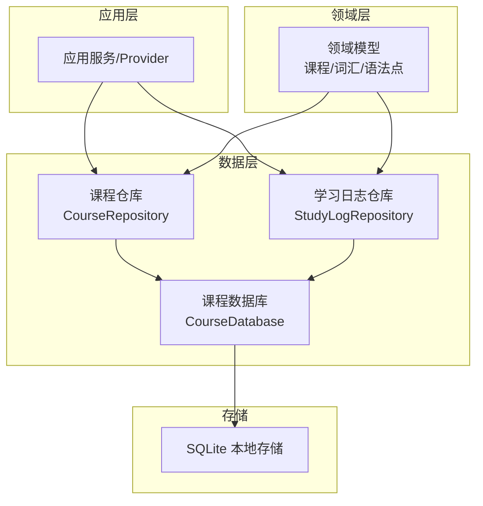
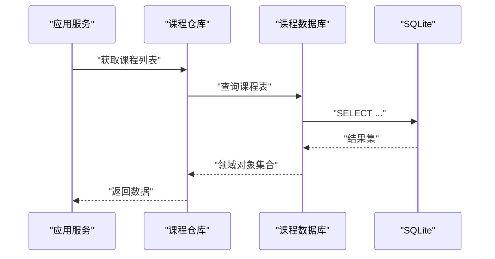
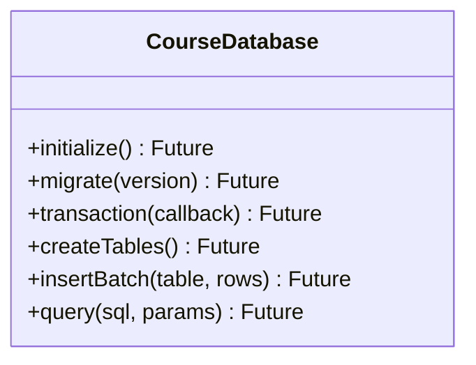
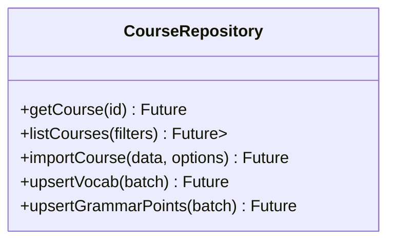
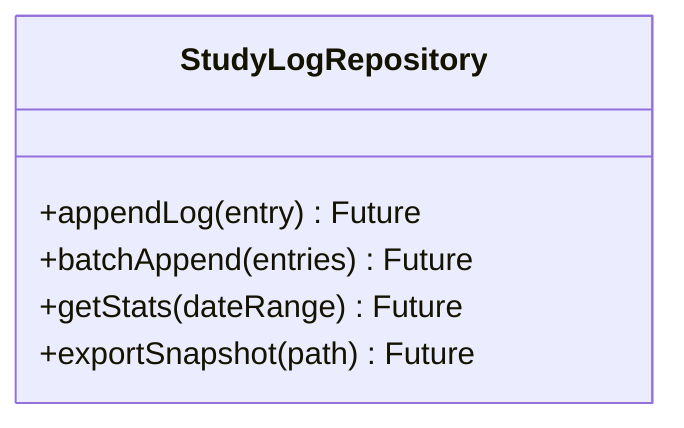
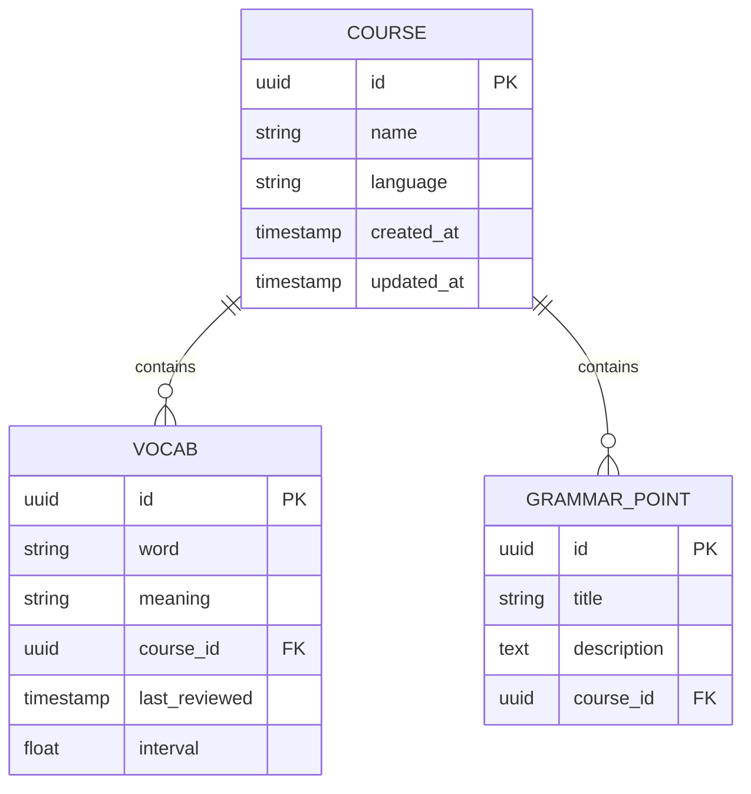
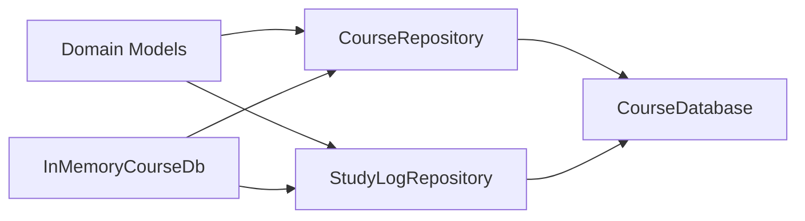

# 数据持久化

<cite>
**本文引用的文件**   
- [lib/data/course_database.dart](file://lib/data/course_database.dart)
- [lib/data/course_repository.dart](file://lib/data/course_repository.dart)
- [lib/data/study_log_repository.dart](file://lib/data/study_log_repository.dart)
- [lib/domain/course/models.dart](file://lib/domain/course/models.dart)
- [test/data/course_database_pos_test.dart](file://test/data/course_database_pos_test.dart)
- [test/data/schema_migration_test.dart](file://test/data/schema_migration_test.dart)
- [test/data/seeder_cross_course_validation_test.dart](file://test/data/seeder_cross_course_validation_test.dart)
- [test/data/seeder_idempotent_test.dart](file://test/data/seeder_idempotent_test.dart)
- [test/application/srs_persist_benchmark_test.dart](file://test/application/srs_persist_benchmark_test.dart)
- [test/helpers/in_memory_course_db.dart](file://test/helpers/in_memory_course_db.dart)
</cite>

## 目录
1. [简介](#简介)
2. [项目结构](#项目结构)
3. [核心组件](#核心组件)
4. [架构总览](#架构总览)
5. [详细组件分析](#详细组件分析)
6. [依赖关系分析](#依赖关系分析)
7. [性能考虑](#性能考虑)
8. [故障排查指南](#故障排查指南)
9. [结论](#结论)
10. [附录](#附录)

## 简介
本技术文档聚焦 Varnamalaplus 的数据持久化层，围绕数据库设计、ORM 映射与迁移策略展开，并补充缓存机制、数据同步与离线支持、加密与备份恢复、完整性校验、性能调优与内存管理等关键主题。文档面向不同技术背景的读者，提供从高层架构到代码级细节的渐进式说明，并给出可操作的优化建议与排障指引。

## 项目结构
Varnamalaplus 采用分层架构：领域模型位于 domain，数据访问与仓储实现位于 data，应用逻辑位于 application，UI 位于 views。数据持久化相关代码主要集中在 lib/data 与 test/data 中，配合测试用例验证迁移、幂等性与一致性。

图表来源
- [lib/data/course_repository.dart](file://lib/data/course_repository.dart)
- [lib/data/study_log_repository.dart](file://lib/data/study_log_repository.dart)
- [lib/data/course_database.dart](file://lib/data/course_database.dart)
- [lib/domain/course/models.dart](file://lib/domain/course/models.dart)

章节来源
- [lib/data/course_database.dart](file://lib/data/course_database.dart)
- [lib/data/course_repository.dart](file://lib/data/course_repository.dart)
- [lib/data/study_log_repository.dart](file://lib/data/study_log_repository.dart)
- [lib/domain/course/models.dart](file://lib/domain/course/models.dart)

## 核心组件
- 课程数据库（CourseDatabase）：封装 SQLite 初始化、版本管理与迁移脚本执行，提供统一的读写入口。
- 课程仓库（CourseRepository）：面向应用的课程数据聚合接口，负责课程、词汇、语法点等实体的增删改查与批量操作。
- 学习日志仓库（StudyLogRepository）：记录学习行为与进度，支撑统计与个性化推荐。
- 领域模型（Domain Models）：定义课程、词汇、语法点、学习进度等实体结构与约束。

章节来源
- [lib/data/course_database.dart](file://lib/data/course_database.dart)
- [lib/data/course_repository.dart](file://lib/data/course_repository.dart)
- [lib/data/study_log_repository.dart](file://lib/data/study_log_repository.dart)
- [lib/domain/course/models.dart](file://lib/domain/course/models.dart)

## 架构总览
数据流遵循“应用调用仓库 → 仓库通过数据库访问 SQLite”的单向路径。领域模型作为契约，确保上层业务与底层存储解耦。迁移由数据库层在启动时按版本号顺序执行，保证 schema 演进的可追溯性。

图表来源
- [lib/data/course_repository.dart](file://lib/data/course_repository.dart)
- [lib/data/course_database.dart](file://lib/data/course_database.dart)

## 详细组件分析

### 课程数据库（CourseDatabase）
职责
- 初始化数据库连接与事务管理
- 维护 schema 版本与迁移脚本
- 提供统一的数据访问方法（CRUD、批量写入、索引创建）

设计与模式
- 单例或依赖注入持有，避免重复打开连接
- 迁移采用“版本号 + 增量脚本”的策略，确保可回滚与幂等
- 使用事务包裹批量写入，提升一致性与性能

图表来源
- [lib/data/course_database.dart](file://lib/data/course_database.dart)

章节来源
- [lib/data/course_database.dart](file://lib/data/course_database.dart)
- [test/data/schema_migration_test.dart](file://test/data/schema_migration_test.dart)

### 课程仓库（CourseRepository）
职责
- 暴露课程、词汇、语法点的聚合接口
- 处理跨表关联查询与数据组装
- 协调批量导入与幂等插入

设计与模式
- 以领域模型为中心，屏蔽 SQL 细节
- 使用分页与游标优化大结果集读取
- 对高频读路径引入内存缓存（LRU），降低磁盘压力

图表来源
- [lib/data/course_repository.dart](file://lib/data/course_repository.dart)

章节来源
- [lib/data/course_repository.dart](file://lib/data/course_repository.dart)
- [test/data/seeder_idempotent_test.dart](file://test/data/seeder_idempotent_test.dart)
- [test/data/seeder_cross_course_validation_test.dart](file://test/data/seeder_cross_course_validation_test.dart)

### 学习日志仓库（StudyLogRepository）
职责
- 记录学习事件（练习、错误、复习间隔）
- 生成统计指标（正确率、薄弱词、连续打卡）
- 支持离线写入与延迟合并

设计与模式
- 写多读少场景，采用批处理与异步落盘
- 使用时间戳与去重键保障日志完整性
- 提供快照导出用于分析与备份

图表来源
- [lib/data/study_log_repository.dart](file://lib/data/study_log_repository.dart)

章节来源
- [lib/data/study_log_repository.dart](file://lib/data/study_log_repository.dart)

### 领域模型（Domain Models）
职责
- 定义课程、词汇、语法点、学习进度的数据结构与约束
- 提供序列化/反序列化工具，便于导入导出与迁移

设计与模式
- 不可变对象优先，减少副作用
- 使用枚举与值对象表达状态与类型
- 与 ORM 映射保持一一对应，避免歧义

图表来源
- [lib/domain/course/models.dart](file://lib/domain/course/models.dart)

章节来源
- [lib/domain/course/models.dart](file://lib/domain/course/models.dart)

## 依赖关系分析
- CourseRepository 依赖 CourseDatabase 进行数据存取
- StudyLogRepository 同样依赖 CourseDatabase
- 领域模型被仓库层消费，作为输入输出契约
- 测试辅助类 InMemoryCourseDb 提供内存数据库实现，便于单元测试

图表来源
- [lib/data/course_repository.dart](file://lib/data/course_repository.dart)
- [lib/data/study_log_repository.dart](file://lib/data/study_log_repository.dart)
- [lib/data/course_database.dart](file://lib/data/course_database.dart)
- [test/helpers/in_memory_course_db.dart](file://test/helpers/in_memory_course_db.dart)

章节来源
- [lib/data/course_repository.dart](file://lib/data/course_repository.dart)
- [lib/data/study_log_repository.dart](file://lib/data/study_log_repository.dart)
- [lib/data/course_database.dart](file://lib/data/course_database.dart)
- [test/helpers/in_memory_course_db.dart](file://test/helpers/in_memory_course_db.dart)

## 性能考虑
- 批量写入与事务：将多次写入合并为一次事务，显著降低 I/O 开销
- 索引优化：为常用查询字段建立索引，如课程 ID、词汇词形、时间戳
- 分页与游标：避免一次性加载大量数据，结合流式处理降低峰值内存
- 缓存策略：对热点数据使用 LRU 缓存，设置合理过期与淘汰阈值
- 异步与背压：日志写入采用异步队列，控制并发度防止阻塞 UI
- 基准测试：参考 SRS 持久化基准用例，定位瓶颈并持续回归

章节来源
- [test/application/srs_persist_benchmark_test.dart](file://test/application/srs_persist_benchmark_test.dart)

## 故障排查指南
常见问题与定位要点
- 迁移失败：检查版本号递增与脚本幂等性；查看迁移测试覆盖是否充分
- 数据不一致：核对事务边界与异常回滚路径；确认唯一约束与外键策略
- 性能退化：分析慢查询与锁竞争；评估索引命中与缓存命中率
- 导入重复：验证幂等键与去重逻辑；检查批量写入原子性

实用手段
- 使用内存数据库快速复现问题
- 增加结构化日志与埋点，追踪关键路径耗时
- 运行数据一致性校验测试，确保跨课程引用完整

章节来源
- [test/data/schema_migration_test.dart](file://test/data/schema_migration_test.dart)
- [test/data/seeder_idempotent_test.dart](file://test/data/seeder_idempotent_test.dart)
- [test/data/seeder_cross_course_validation_test.dart](file://test/data/seeder_cross_course_validation_test.dart)
- [test/data/course_database_pos_test.dart](file://test/data/course_database_pos_test.dart)
- [test/helpers/in_memory_course_db.dart](file://test/helpers/in_memory_course_db.dart)

## 结论
Varnamalaplus 的数据持久化层以清晰的层次划分与稳健的迁移策略为基础，通过仓库抽象屏蔽底层存储细节，结合缓存、批处理与异步写入等手段，兼顾了性能与可维护性。建议在后续迭代中持续完善索引与缓存策略，强化备份恢复与完整性校验，确保数据一致性与系统可靠性。

## 附录
- 数据模型设计原则
  - 单一职责：每个实体对应一个清晰的业务概念
  - 不可变性：尽量使用不可变对象，降低并发风险
  - 显式约束：通过类型系统与数据库约束共同保障数据质量
- API 接口规范
  - 统一返回 Result 包装，区分成功与失败路径
  - 分页参数标准化，支持排序与过滤
  - 错误码与消息规范化，便于前端展示与监控
- 使用示例（路径指引）
  - 课程导入与幂等更新：参考 seeder 相关测试用例
  - 学习日志批量写入：参考日志仓库与基准测试
  - 迁移脚本编写：参考迁移测试中的版本演进样例