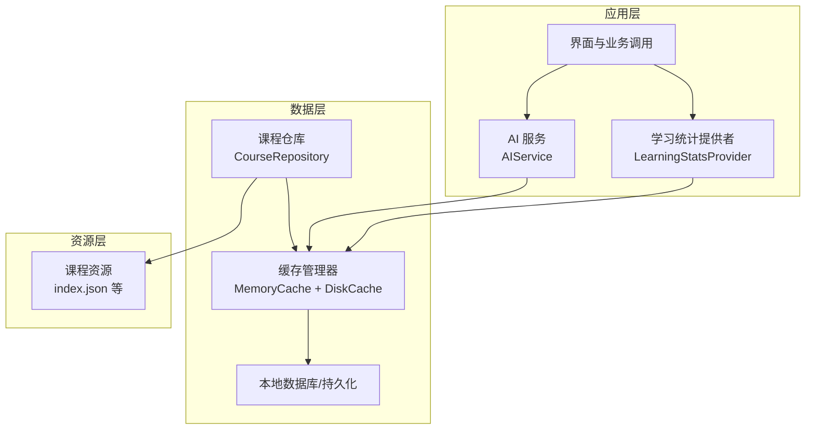
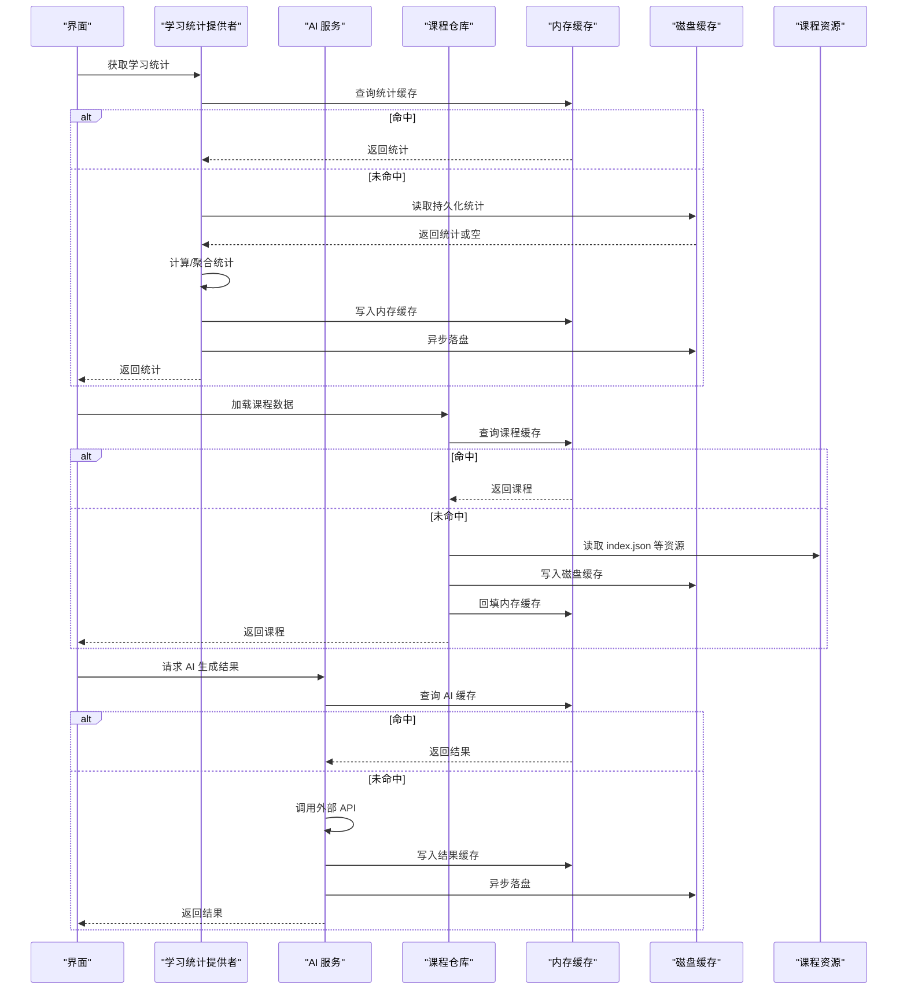
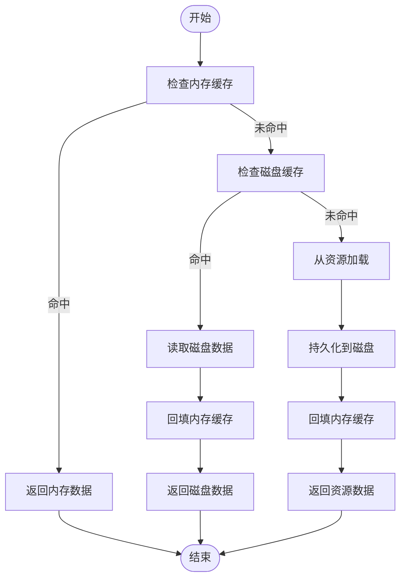
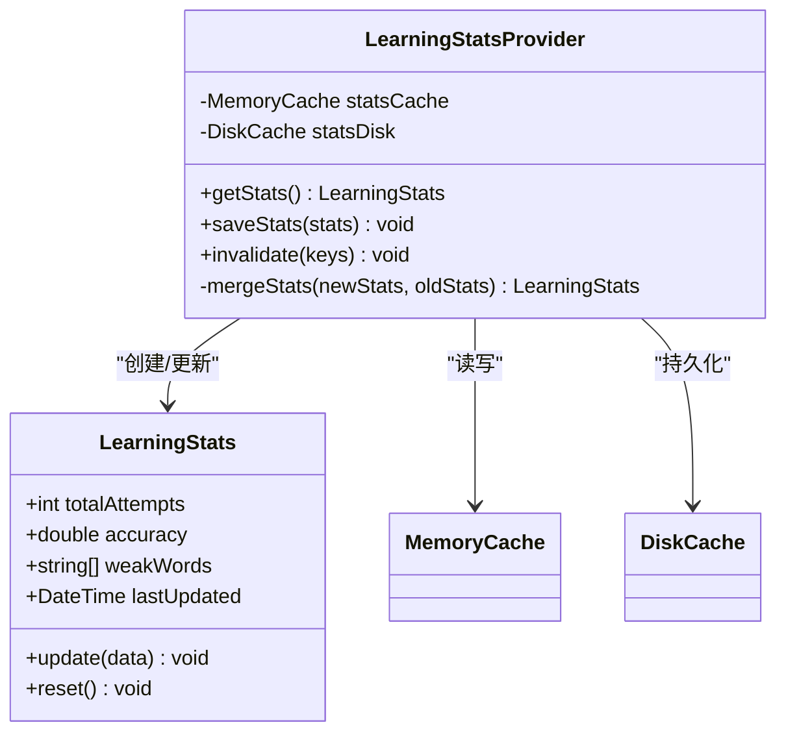
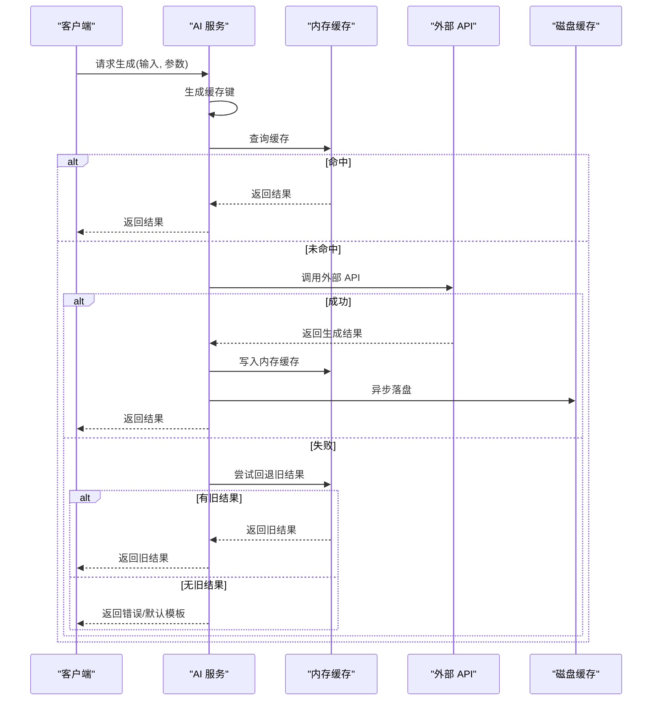
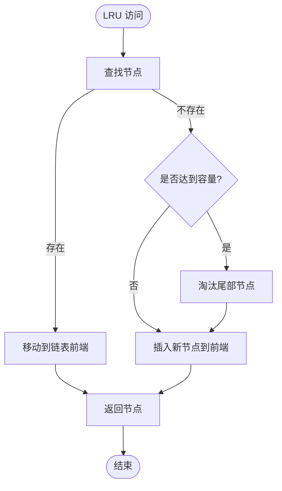
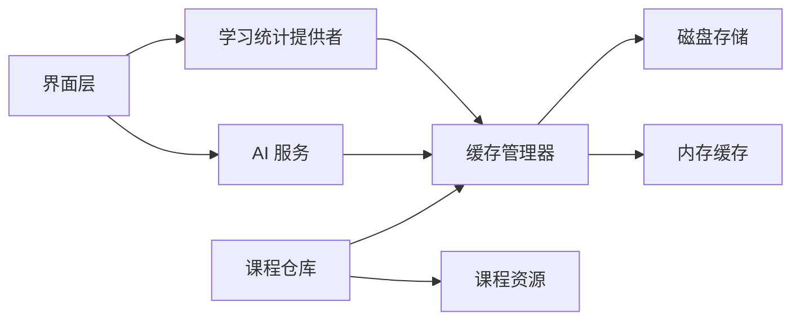

# 缓存策略

<cite>
**本文引用的文件**   
- [lib/main.dart](file://lib/main.dart)
- [lib/data/course_repository.dart](file://lib/data/course_repository.dart)
- [lib/application/learning_stats_provider.dart](file://lib/application/learning_stats_provider.dart)
- [lib/application/ai_service.dart](file://lib/application/ai_service.dart)
- [test/application/learning_stats_cache_test.dart](file://test/application/learning_stats_cache_test.dart)
- [test/courses/lesson_body_lru_test.dart](file://test/courses/lesson_body_lru_test.dart)
- [assets/courses/turkish/index.json](file://assets/courses/turkish/index.json)
</cite>

## 目录
1. [简介](#简介)
2. [项目结构](#项目结构)
3. [核心组件](#核心组件)
4. [架构总览](#架构总览)
5. [详细组件分析](#详细组件分析)
6. [依赖关系分析](#依赖关系分析)
7. [性能考量](#性能考量)
8. [故障排查指南](#故障排查指南)
9. [结论](#结论)
10. [附录](#附录)

## 简介
本技术文档围绕 Varnamalaplus 的缓存系统，系统性阐述多级缓存架构、内存与磁盘缓存的实现策略，以及课程数据缓存、学习统计缓存、AI 生成结果缓存的具体实现。文档还覆盖缓存失效机制、LRU 算法应用、内存管理策略，并提供缓存预热、批量操作优化与一致性保证的实践建议，最后给出性能调优、监控指标与故障恢复方案。

## 项目结构
Varnamalaplus 采用 Flutter 工程组织，核心代码位于 lib 目录，测试位于 test 目录，课程资源位于 assets 目录。缓存相关能力主要分布在：
- data 层：课程仓库（course_repository）负责课程数据的加载与缓存
- application 层：学习统计提供者（learning_stats_provider）承载学习统计缓存；AI 服务（ai_service）承载 AI 生成结果缓存
- core 层：通用 LRU 工具与数据结构（通过测试用例可见其使用方式）
- assets 层：课程索引与静态资源，作为冷数据源或预加载素材

图表来源
- [lib/data/course_repository.dart:1-200](file://lib/data/course_repository.dart#L1-L200)
- [lib/application/learning_stats_provider.dart:1-200](file://lib/application/learning_stats_provider.dart#L1-L200)
- [lib/application/ai_service.dart:1-200](file://lib/application/ai_service.dart#L1-L200)
- [assets/courses/turkish/index.json:1-200](file://assets/courses/turkish/index.json#L1-L200)

章节来源
- [lib/main.dart:1-100](file://lib/main.dart#L1-L100)
- [lib/data/course_repository.dart:1-200](file://lib/data/course_repository.dart#L1-L200)
- [lib/application/learning_stats_provider.dart:1-200](file://lib/application/learning_stats_provider.dart#L1-L200)
- [lib/application/ai_service.dart:1-200](file://lib/application/ai_service.dart#L1-L200)
- [assets/courses/turkish/index.json:1-200](file://assets/courses/turkish/index.json#L1-L200)

## 核心组件
- 课程数据缓存（CourseRepository）
  - 职责：统一课程数据的读取入口，优先从内存缓存命中，未命中则回退到磁盘/文件系统，再落盘并回填内存
  - 关键特性：按课程/章节维度分片缓存，支持批量加载与增量更新
- 学习统计缓存（LearningStatsProvider）
  - 职责：聚合学习进度、正确率、弱项词等统计信息，提供读写接口与失效策略
  - 关键特性：基于时间窗口与变更事件触发失效，避免频繁写盘
- AI 生成结果缓存（AIService）
  - 职责：缓存 AI 生成的题目、解析、提示等结果，减少重复请求
  - 关键特性：以输入特征为键，结合版本与参数哈希，确保结果一致性与可失效性

章节来源
- [lib/data/course_repository.dart:1-200](file://lib/data/course_repository.dart#L1-L200)
- [lib/application/learning_stats_provider.dart:1-200](file://lib/application/learning_stats_provider.dart#L1-L200)
- [lib/application/ai_service.dart:1-200](file://lib/application/ai_service.dart#L1-L200)

## 架构总览
多级缓存体系由“内存缓存 + 磁盘缓存”组成，上层为应用层组件（学习统计、AI 服务），数据层为课程仓库与持久化存储。整体遵循“读多写少、热数据常驻内存、冷数据落盘”的原则。

图表来源
- [lib/application/learning_stats_provider.dart:1-200](file://lib/application/learning_stats_provider.dart#L1-L200)
- [lib/application/ai_service.dart:1-200](file://lib/application/ai_service.dart#L1-L200)
- [lib/data/course_repository.dart:1-200](file://lib/data/course_repository.dart#L1-L200)
- [assets/courses/turkish/index.json:1-200](file://assets/courses/turkish/index.json#L1-L200)

## 详细组件分析

### 课程数据缓存（CourseRepository）
- 设计要点
  - 分层缓存：内存缓存用于高频访问的课程片段（如章节、词汇表），磁盘缓存用于完整课程包与历史数据
  - 键空间：以课程 ID + 资源类型 + 版本号作为缓存键，确保不同课程与版本隔离
  - 批量加载：支持按章节批量拉取，减少 I/O 次数与序列化开销
- 失效策略
  - 显式失效：课程更新后按课程 ID 失效对应缓存
  - 软失效：基于时间戳或版本号判断，避免频繁重建
- 一致性保证
  - 先写磁盘后回填内存，保证崩溃恢复后数据可用
  - 并发读取安全：读路径无锁，写路径加锁或使用不可变快照

图表来源
- [lib/data/course_repository.dart:1-200](file://lib/data/course_repository.dart#L1-L200)
- [assets/courses/turkish/index.json:1-200](file://assets/courses/turkish/index.json#L1-L200)

章节来源
- [lib/data/course_repository.dart:1-200](file://lib/data/course_repository.dart#L1-L200)

### 学习统计缓存（LearningStatsProvider）
- 设计要点
  - 统计模型：包含练习次数、正确率、弱项词列表、最近学习时间等
  - 缓存粒度：按用户会话或全局维度缓存，避免跨会话污染
  - 写合并：短时间内的多次修改合并为一次落盘，降低 I/O 压力
- 失效策略
  - 事件驱动：当课程数据或用户行为发生显著变化时触发失效
  - 时间窗口：超过阈值自动刷新，保证统计时效性
- 一致性保证
  - 幂等写入：相同输入产生相同输出，避免重复计算
  - 冲突解决：多写场景下采用最后写入胜出或合并策略

图表来源
- [lib/application/learning_stats_provider.dart:1-200](file://lib/application/learning_stats_provider.dart#L1-L200)

章节来源
- [lib/application/learning_stats_provider.dart:1-200](file://lib/application/learning_stats_provider.dart#L1-L200)
- [test/application/learning_stats_cache_test.dart:1-200](file://test/application/learning_stats_cache_test.dart#L1-L200)

### AI 生成结果缓存（AIService）
- 设计要点
  - 键生成：将输入文本、模型参数、版本等信息哈希为稳定键
  - 结果结构：包含生成内容、元数据（耗时、模型版本）、过期时间
  - 降级策略：网络失败时返回最近成功结果或默认模板
- 失效策略
  - 版本控制：模型或参数升级后强制失效旧结果
  - TTL：设置合理过期时间，平衡新鲜度与命中率
- 一致性保证
  - 幂等性：相同输入与参数必定返回相同结果
  - 校验：可选对生成内容进行签名或摘要校验

图表来源
- [lib/application/ai_service.dart:1-200](file://lib/application/ai_service.dart#L1-L200)

章节来源
- [lib/application/ai_service.dart:1-200](file://lib/application/ai_service.dart#L1-L200)

### LRU 算法与内存管理
- LRU 实现
  - 使用双向链表 + 哈希表实现 O(1) 插入与访问
  - 容量上限：根据设备内存动态调整，避免 OOM
  - 淘汰策略：优先淘汰最久未使用的条目
- 内存管理
  - 大对象分块：将大课程数据拆分为小块，按需加载
  - 引用计数：跟踪对象引用，及时释放无用内存
  - 监控指标：记录命中率、淘汰率、内存占用

图表来源
- [test/courses/lesson_body_lru_test.dart:1-200](file://test/courses/lesson_body_lru_test.dart#L1-L200)

章节来源
- [test/courses/lesson_body_lru_test.dart:1-200](file://test/courses/lesson_body_lru_test.dart#L1-L200)

## 依赖关系分析
各组件之间的依赖关系清晰，遵循单一职责与低耦合原则：
- 应用层依赖缓存抽象，不关心具体实现
- 数据层依赖持久化与资源加载
- 测试用例验证缓存行为与边界条件

图表来源
- [lib/application/learning_stats_provider.dart:1-200](file://lib/application/learning_stats_provider.dart#L1-L200)
- [lib/application/ai_service.dart:1-200](file://lib/application/ai_service.dart#L1-L200)
- [lib/data/course_repository.dart:1-200](file://lib/data/course_repository.dart#L1-L200)

章节来源
- [lib/application/learning_stats_provider.dart:1-200](file://lib/application/learning_stats_provider.dart#L1-L200)
- [lib/application/ai_service.dart:1-200](file://lib/application/ai_service.dart#L1-L200)
- [lib/data/course_repository.dart:1-200](file://lib/data/course_repository.dart#L1-L200)

## 性能考量
- 缓存命中率优化
  - 热点数据预热：启动时预加载常用课程片段与统计
  - 批量操作：合并多次小写为大写，减少 I/O 次数
  - 压缩存储：对大对象进行压缩，节省磁盘与内存
- 并发与线程安全
  - 读多写少场景下使用无锁读与写时复制
  - 异步写盘：非阻塞写入，避免阻塞主线程
- 监控与度量
  - 关键指标：命中率、平均延迟、内存占用、淘汰率
  - 日志采样：记录慢查询与异常路径，便于定位瓶颈

[本节为通用指导，无需特定文件来源]

## 故障排查指南
- 常见问题
  - 缓存未命中率高：检查键生成逻辑与失效策略
  - 内存溢出：监控内存使用，调整 LRU 容量与大对象拆分
  - 数据不一致：确认写顺序与并发控制
- 诊断步骤
  - 启用详细日志，记录缓存操作轨迹
  - 使用内存分析工具定位泄漏点
  - 模拟极端场景（高并发、低内存）验证稳定性

章节来源
- [test/application/learning_stats_cache_test.dart:1-200](file://test/application/learning_stats_cache_test.dart#L1-L200)
- [test/courses/lesson_body_lru_test.dart:1-200](file://test/courses/lesson_body_lru_test.dart#L1-L200)

## 结论
Varnamalaplus 的缓存系统通过多级缓存架构有效提升了课程数据、学习统计与 AI 结果的访问性能。LRU 算法与内存管理策略确保了资源的高效利用，而失效机制与一致性保证则保障了数据的准确性与可靠性。通过持续的性能调优与监控，系统能够在复杂场景下保持稳定与高效。

[本节为总结性内容，无需特定文件来源]

## 附录
- 配置建议
  - 内存缓存大小：根据设备内存动态调整，建议初始值为 50-100MB
  - 磁盘缓存路径：独立分区或 SSD 以提升 I/O 性能
  - 过期策略：TTL 设置为 1-24 小时，视数据新鲜度需求而定
- 最佳实践
  - 键命名规范：使用语义化键名，便于调试与维护
  - 错误处理：捕获并记录异常，提供降级与重试机制
  - 单元测试：覆盖边界条件与异常路径，确保缓存行为正确

[本节为补充信息，无需特定文件来源]