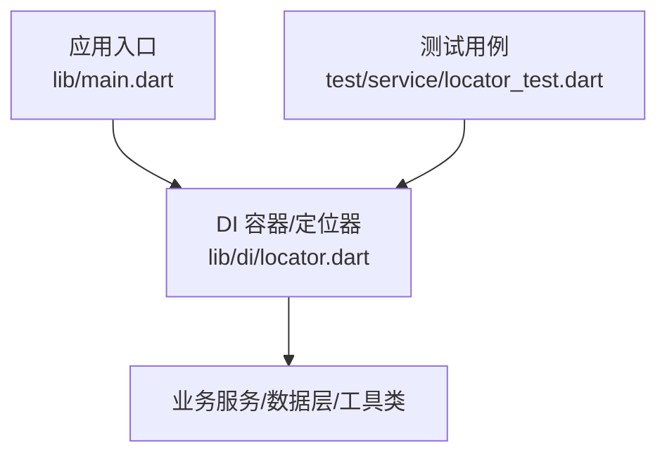
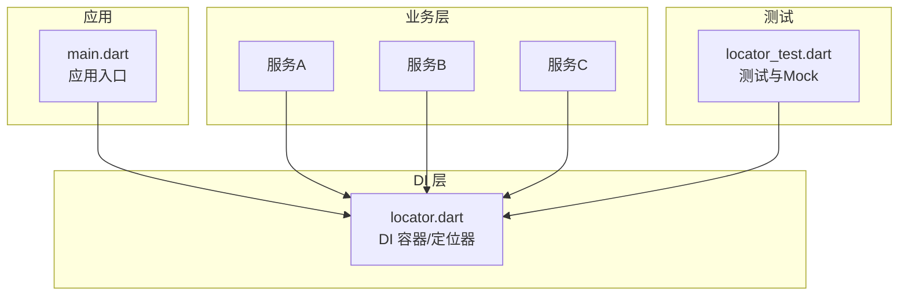
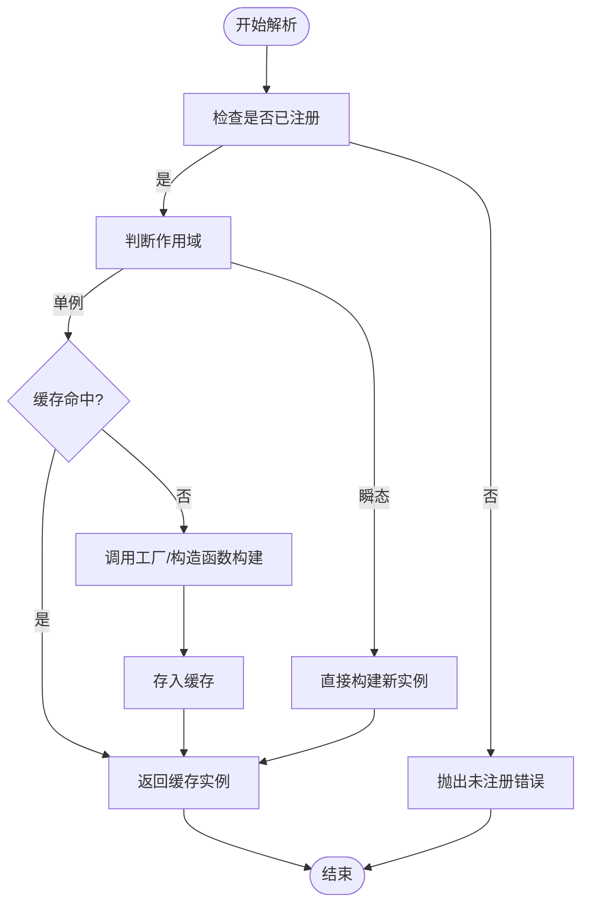
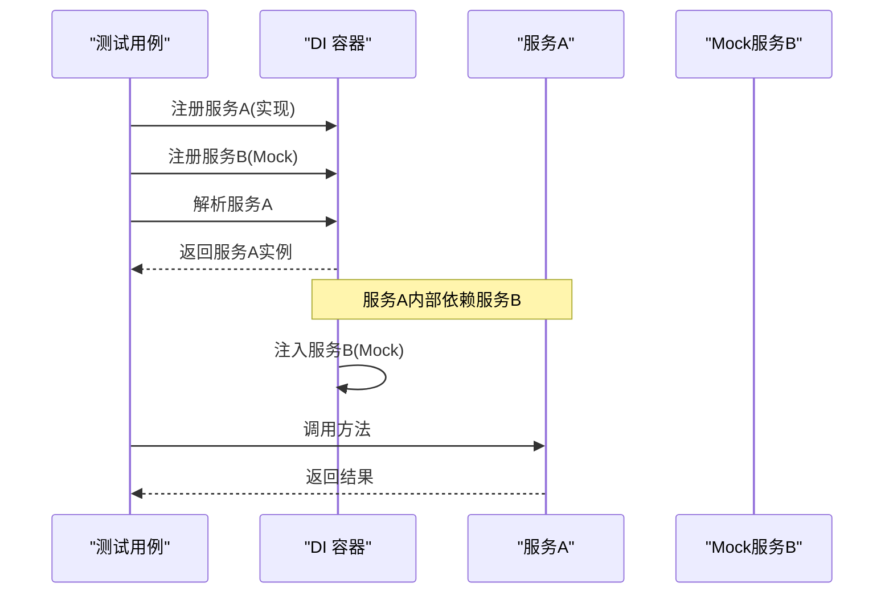
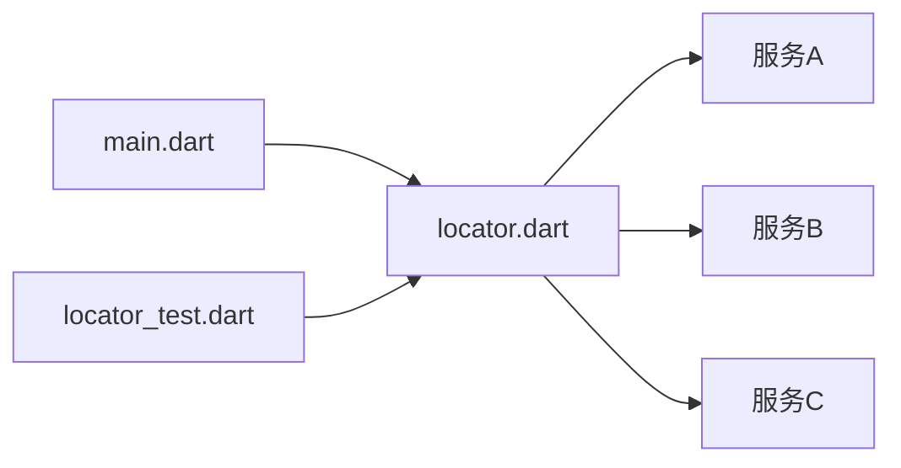

# 依赖注入系统

<cite>
**本文引用的文件**   
- [lib/main.dart](file://lib/main.dart)
- [lib/di/locator.dart](file://lib/di/locator.dart)
- [lib/service/locator_test.dart](file://lib/service/locator_test.dart)
</cite>

## 目录
1. [简介](#简介)
2. [项目结构](#项目结构)
3. [核心组件](#核心组件)
4. [架构总览](#架构总览)
5. [详细组件分析](#详细组件分析)
6. [依赖关系分析](#依赖关系分析)
7. [性能考量](#性能考量)
8. [故障排查指南](#故障排查指南)
9. [结论](#结论)
10. [附录](#附录)

## 简介
本文件为 Varnamalaplus 项目的依赖注入（DI）系统提供系统化文档。内容涵盖自定义 DI 容器的实现原理、服务注册与获取流程、生命周期与作用域管理、循环依赖处理策略、单例模式实现，以及测试环境下的依赖替换与 Mock 使用方式。同时给出依赖关系图、关键流程图和常见问题排查建议，帮助开发者正确理解和使用该 DI 系统。

## 项目结构
Varnamalaplus 的依赖注入相关代码集中在 lib/di 目录，并通过应用入口进行初始化与装配。典型结构如下：
- lib/main.dart：应用启动入口，负责初始化 DI 容器并注册全局服务。
- lib/di/locator.dart：DI 容器与定位器实现，提供服务注册、解析、作用域与生命周期控制。
- test/service/locator_test.dart：针对 DI 容器的单元测试，覆盖注册、解析、Mock 替换等场景。

图表来源
- [lib/main.dart](file://lib/main.dart)
- [lib/di/locator.dart](file://lib/di/locator.dart)
- [lib/service/locator_test.dart](file://lib/service/locator_test.dart)

章节来源
- [lib/main.dart](file://lib/main.dart)
- [lib/di/locator.dart](file://lib/di/locator.dart)
- [lib/service/locator_test.dart](file://lib/service/locator_test.dart)

## 核心组件
- DI 容器（Locator）
  - 职责：维护服务类型到实例或工厂的映射；支持按作用域创建或复用实例；提供统一的解析接口。
  - 关键能力：服务注册（构造函数注入）、按需解析、单例缓存、作用域隔离、生命周期钩子（可选）。
- 应用入口（main.dart）
  - 职责：在应用启动时构建并配置 DI 容器，完成核心服务的注册与初始化。
- 测试适配（locator_test.dart）
  - 职责：演示如何在测试中替换服务实现、注入 Mock、验证行为。

章节来源
- [lib/di/locator.dart](file://lib/di/locator.dart)
- [lib/main.dart](file://lib/main.dart)
- [lib/service/locator_test.dart](file://lib/service/locator_test.dart)

## 架构总览
下图展示了 DI 容器在应用中的位置与交互关系：应用入口负责装配，业务模块通过定位器获取服务，测试通过替换注册表注入 Mock。

图表来源
- [lib/main.dart](file://lib/main.dart)
- [lib/di/locator.dart](file://lib/di/locator.dart)
- [lib/service/locator_test.dart](file://lib/service/locator_test.dart)

## 详细组件分析

### DI 容器（locator.dart）
- 设计要点
  - 服务注册：支持以类型键注册具体实现或工厂函数，便于后续解析。
  - 解析机制：根据请求类型查找已注册项，若为工厂则调用生成实例，若为单例则返回缓存。
  - 作用域控制：区分“单例”与“每次新建”的作用域，避免跨作用域共享状态。
  - 循环依赖检测：在解析过程中记录正在构建的依赖链，发现环即抛出明确错误。
  - 生命周期管理：对需要释放资源的对象提供销毁钩子（如适用），并在容器关闭时统一清理。
- 复杂度与性能
  - 注册阶段 O(1) 插入；解析阶段 O(1) 查找；循环检测采用栈式追踪，最坏 O(n)。
  - 单例缓存减少重复构造开销，适合重资源对象（数据库连接、网络客户端等）。
- 错误处理
  - 未注册类型解析失败、循环依赖、作用域不匹配等异常均会给出清晰信息，便于定位。

图表来源
- [lib/di/locator.dart](file://lib/di/locator.dart)

章节来源
- [lib/di/locator.dart](file://lib/di/locator.dart)

### 应用入口（main.dart）
- 职责
  - 初始化 DI 容器，注册核心服务（如配置、日志、网络、存储等）。
  - 确保在应用启动早期完成依赖装配，保证运行时稳定。
- 最佳实践
  - 将易变服务（如第三方 SDK）抽象为接口，通过 DI 注册具体实现，便于切换与测试。
  - 将耗时初始化放入延迟加载或异步初始化路径，避免阻塞启动。

章节来源
- [lib/main.dart](file://lib/main.dart)

### 测试与 Mock（locator_test.dart）
- 目标
  - 验证 DI 容器的注册、解析、作用域与生命周期行为。
  - 演示在测试中替换真实服务为 Mock 的实现方式。
- 常用模式
  - 在测试前清空或重建容器，避免用例间污染。
  - 使用轻量 Mock 替代外部依赖（网络、IO、时间源等）。
  - 断言服务被正确注入且行为符合预期。

图表来源
- [lib/service/locator_test.dart](file://lib/service/locator_test.dart)
- [lib/di/locator.dart](file://lib/di/locator.dart)

章节来源
- [lib/service/locator_test.dart](file://lib/service/locator_test.dart)
- [lib/di/locator.dart](file://lib/di/locator.dart)

## 依赖关系分析
- 组件耦合
  - main.dart 仅依赖 locator.dart 提供的容器 API，低耦合、高内聚。
  - 业务服务通过 locator.dart 获取依赖，避免硬编码 new。
- 外部依赖
  - 可结合平台插件、网络库、持久化库等，通过 DI 统一接入。
- 潜在循环依赖
  - 通过容器内置检测机制提前暴露问题，建议在重构时保持单向依赖。

图表来源
- [lib/main.dart](file://lib/main.dart)
- [lib/di/locator.dart](file://lib/di/locator.dart)
- [lib/service/locator_test.dart](file://lib/service/locator_test.dart)

章节来源
- [lib/main.dart](file://lib/main.dart)
- [lib/di/locator.dart](file://lib/di/locator.dart)
- [lib/service/locator_test.dart](file://lib/service/locator_test.dart)

## 性能考量
- 单例缓存
  - 对昂贵对象（数据库连接、HTTP 客户端、加密上下文）使用单例，降低重复构造成本。
- 延迟初始化
  - 对非关键路径服务采用懒加载，缩短冷启动时间。
- 作用域隔离
  - 避免跨作用域共享可变状态，减少锁竞争与内存泄漏风险。
- 解析优化
  - 优先使用类型键直查，避免反射带来的额外开销。

[本节为通用指导，无需源码引用]

## 故障排查指南
- 常见错误与定位
  - 未注册类型解析失败：检查是否在入口正确注册了所需服务。
  - 循环依赖：查看依赖链，拆分职责或使用延迟注入/事件解耦。
  - 作用域不一致：确认服务应在单例还是瞬态作用域下运行。
  - 资源未释放：确保容器关闭或作用域结束时调用销毁钩子。
- 调试技巧
  - 在解析前后打印依赖树，快速定位缺失或冲突项。
  - 在测试中逐步替换依赖，缩小问题范围。
  - 利用断点与日志输出，观察实例生命周期与共享情况。

章节来源
- [lib/di/locator.dart](file://lib/di/locator.dart)
- [lib/service/locator_test.dart](file://lib/service/locator_test.dart)

## 结论
Varnamalaplus 的自定义 DI 容器提供了清晰的注册与解析接口，支持作用域控制与循环依赖检测，满足生产与测试环境的多样化需求。通过合理划分作用域、使用单例缓存与延迟初始化，可在保证可测试性的同时获得良好性能。建议遵循“面向接口编程、集中装配、最小化副作用”的原则，持续优化依赖结构与可维护性。

[本节为总结性内容，无需源码引用]

## 附录
- 使用建议
  - 将对外部系统的访问抽象为接口，通过 DI 注入，提升可替换性与可测性。
  - 在测试中使用轻量 Mock，避免集成外部依赖。
  - 定期审查依赖图，消除不必要的强耦合与循环依赖。
- 扩展方向
  - 增加基于注解的自动装配（可选）。
  - 引入更细粒度的作用域（如请求级、页面级）。
  - 增强生命周期钩子，支持优雅停机与资源回收。

[本节为补充说明，无需源码引用]