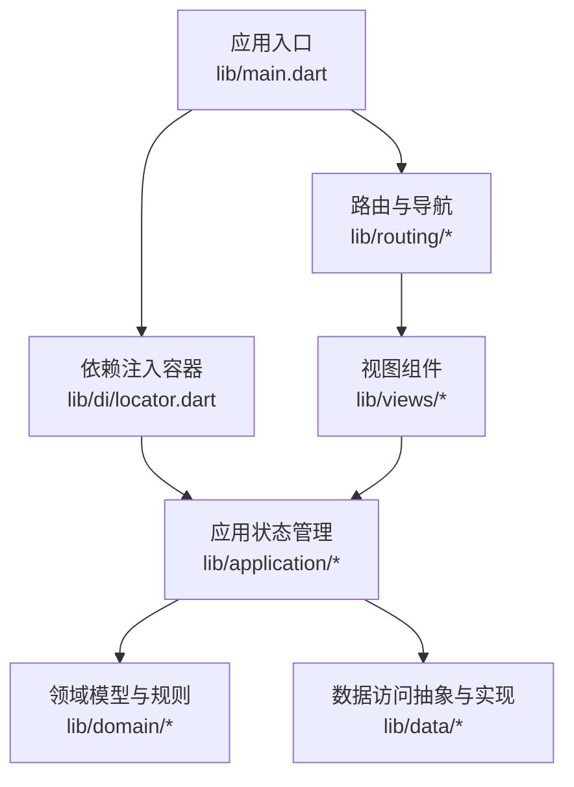
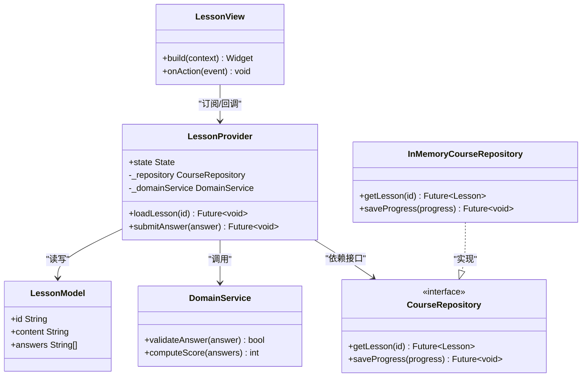
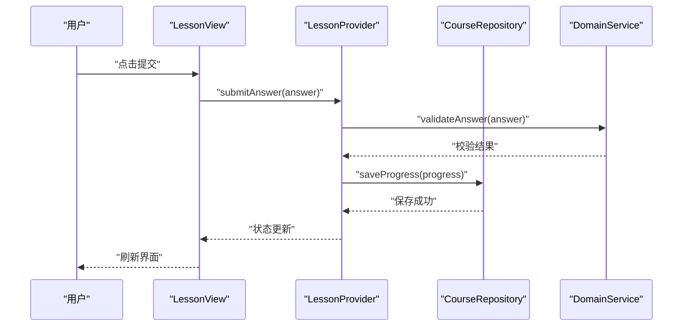
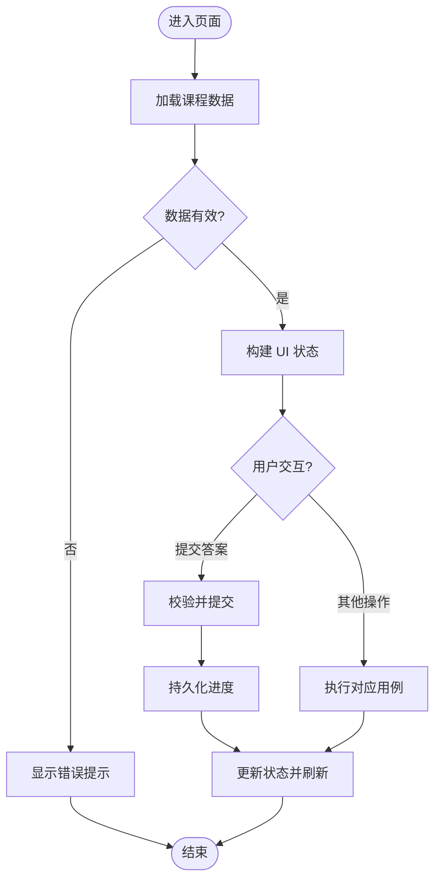
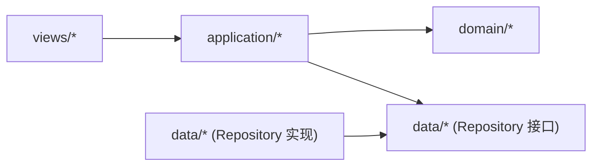

# 分层架构设计

<cite>
**本文引用的文件**   
- [main.dart](file://lib/main.dart)
- [application/lesson_provider.dart](file://lib/application/lesson_provider.dart)
- [domain/course/models.dart](file://lib/domain/course/models.dart)
- [data/course_repository.dart](file://lib/data/course_repository.dart)
- [di/locator.dart](file://lib/di/locator.dart)
- [views/home/home_view.dart](file://lib/views/home/home_view.dart)
- [views/lesson/lesson_view.dart](file://lib/views/lesson/lesson_view.dart)
</cite>

## 目录
1. [简介](#简介)
2. [项目结构](#项目结构)
3. [核心组件](#核心组件)
4. [架构总览](#架构总览)
5. [详细组件分析](#详细组件分析)
6. [依赖关系分析](#依赖关系分析)
7. [性能考量](#性能考量)
8. [故障排查指南](#故障排查指南)
9. [结论](#结论)
10. [附录](#附录)

## 简介
本文件面向 Varnamalaplus 项目的分层架构与 MVVM 实现，系统阐述 presentation（视图层）、application（应用层）、domain（领域层）和 data（数据层）的职责边界、依赖方向与数据流向。文档通过架构图、类图与时序图展示各层组件的交互关系，并给出层间通信模式与接口抽象的实践要点，帮助开发者理解整体结构设计思路与扩展方式。

## 项目结构
Varnamalaplus 采用 Flutter 工程组织，核心代码位于 lib 目录，按职责划分为 application、core、courses、data、di、domain、routing、service、views 等模块。入口为 main.dart，负责初始化依赖注入与路由配置；presentation 层以 views 为主；application 层使用 Provider 管理状态；domain 层定义业务模型与规则；data 层封装课程数据源与持久化；di 层提供依赖解析。

图表来源
- [main.dart:1-200](file://lib/main.dart#L1-L200)
- [locator.dart:1-200](file://lib/di/locator.dart#L1-L200)
- [home_view.dart:1-200](file://lib/views/home/home_view.dart#L1-L200)
- [lesson_view.dart:1-200](file://lib/views/lesson/lesson_view.dart#L1-L200)

章节来源
- [main.dart:1-200](file://lib/main.dart#L1-L200)
- [locator.dart:1-200](file://lib/di/locator.dart#L1-L200)

## 核心组件
- 视图层（presentation/views）：Flutter Widget 树与用户交互，仅消费 application 层暴露的状态与事件回调，不直接访问 domain 或 data。
- 应用层（application）：基于 Provider 的 ViewModel/Provider，编排业务流程、协调领域与数据层、维护 UI 状态。
- 领域层（domain）：纯 Dart 实体、值对象与业务规则，不包含框架与 I/O 细节。
- 数据层（data）：仓库与适配器，统一对外暴露 Repository 接口，屏蔽数据库、网络与本地缓存差异。
- 依赖注入（di）：集中注册与解析服务，确保层间解耦与可测试性。

章节来源
- [lesson_provider.dart:1-200](file://lib/application/lesson_provider.dart#L1-L200)
- [models.dart:1-200](file://lib/domain/course/models.dart#L1-L200)
- [course_repository.dart:1-200](file://lib/data/course_repository.dart#L1-L200)
- [locator.dart:1-200](file://lib/di/locator.dart#L1-L200)

## 架构总览
MVVM 在本项目中体现为：
- View（Widget）订阅 Provider 状态变化，触发事件回调。
- ViewModel（Provider）处理业务编排，调用领域服务与仓库接口。
- Domain 定义不可变模型与用例，保持无副作用。
- Data 提供 Repository 实现，聚合多数据源。

图表来源
- [lesson_view.dart:1-200](file://lib/views/lesson/lesson_view.dart#L1-L200)
- [lesson_provider.dart:1-200](file://lib/application/lesson_provider.dart#L1-L200)
- [models.dart:1-200](file://lib/domain/course/models.dart#L1-L200)
- [course_repository.dart:1-200](file://lib/data/course_repository.dart#L1-L200)

## 详细组件分析

### 视图层（Presentation/Views）
- 职责：渲染界面、收集用户输入、转发事件到 Provider。
- 约束：不持有业务逻辑，不直接访问数据层；通过 ChangeNotifier/Provider 订阅状态更新。
- 典型流程：用户点击“提交答案”→调用 Provider 方法→Provider 更新状态→Widget 重建。

图表来源
- [lesson_view.dart:1-200](file://lib/views/lesson/lesson_view.dart#L1-L200)
- [lesson_provider.dart:1-200](file://lib/application/lesson_provider.dart#L1-L200)
- [course_repository.dart:1-200](file://lib/data/course_repository.dart#L1-L200)

章节来源
- [lesson_view.dart:1-200](file://lib/views/lesson/lesson_view.dart#L1-L200)

### 应用层（Application/Providers）
- 职责：编排用例、组合领域与数据层、维护 UI 状态、处理错误与加载态。
- 关键点：对上层暴露稳定 API；对下层依赖接口而非具体实现；避免在 Provider 中做复杂计算。
- 示例流程：加载课程→读取领域模型→组装 UI 状态→响应交互。

图表来源
- [lesson_provider.dart:1-200](file://lib/application/lesson_provider.dart#L1-L200)

章节来源
- [lesson_provider.dart:1-200](file://lib/application/lesson_provider.dart#L1-L200)

### 领域层（Domain）
- 职责：定义实体、值对象与业务规则；保证无外部依赖与副作用。
- 关键原则：不可变模型、明确的输入输出、可测试性强。
- 示例：课程模型、答题校验、分数计算等。

章节来源
- [models.dart:1-200](file://lib/domain/course/models.dart#L1-L200)

### 数据层（Data）
- 职责：实现 Repository 接口，聚合本地存储、网络请求与缓存策略。
- 关键点：对外只暴露接口；内部可切换实现（内存、SQLite、远程）。
- 示例：课程数据获取、学习进度保存。

章节来源
- [course_repository.dart:1-200](file://lib/data/course_repository.dart#L1-L200)

### 依赖注入（DI）
- 职责：集中注册服务与仓库实现，向应用层提供实例。
- 好处：便于替换实现、单元测试友好、降低耦合。

章节来源
- [locator.dart:1-200](file://lib/di/locator.dart#L1-L200)

## 依赖关系分析
- 依赖方向严格自顶向下：views → application → domain ↔ data。
- 应用层依赖领域与数据接口，不感知具体实现。
- 领域层不依赖任何框架或 I/O。
- 数据层实现领域接口，向上透明。

图表来源
- [lesson_provider.dart:1-200](file://lib/application/lesson_provider.dart#L1-L200)
- [course_repository.dart:1-200](file://lib/data/course_repository.dart#L1-L200)

章节来源
- [lesson_provider.dart:1-200](file://lib/application/lesson_provider.dart#L1-L200)
- [course_repository.dart:1-200](file://lib/data/course_repository.dart#L1-L200)

## 性能考量
- 状态粒度：Provider 状态尽量细粒度，减少不必要的重建。
- 异步处理：I/O 操作统一在应用层调度，避免阻塞 UI。
- 缓存策略：数据层可实现 LRU/内存缓存，降低重复查询。
- 懒加载：课程详情按需加载，首屏快速渲染。

[本节为通用指导，无需源码引用]

## 故障排查指南
- 常见问题
  - 状态未更新：检查 Provider 是否调用 notifyListeners 或返回新状态。
  - 依赖注入失败：确认 locator 是否正确注册与解析。
  - 数据源异常：在应用层捕获并转换为 UI 友好的错误提示。
- 调试建议
  - 打印关键流程日志（加载、校验、保存）。
  - 使用内存仓库进行单元测试，隔离外部依赖。

章节来源
- [lesson_provider.dart:1-200](file://lib/application/lesson_provider.dart#L1-L200)
- [locator.dart:1-200](file://lib/di/locator.dart#L1-L200)

## 结论
Varnamalaplus 的分层架构清晰划分了视图、应用、领域与数据职责，通过接口抽象与依赖注入实现了松耦合与高内聚。MVVM 模式使 UI 与业务解耦，提升了可测试性与可维护性。遵循该架构有助于团队并行开发、平滑演进与持续集成。

[本节为总结性内容，无需源码引用]

## 附录
- 最佳实践
  - 在 application 层编排用例，不在 view 中写业务逻辑。
  - 领域模型保持不可变，变更通过工厂或 builder 生成新实例。
  - 数据层对外暴露接口，内部自由切换实现。
  - 所有跨层通信通过类型安全的 DTO/模型传递。

[本节为通用指导，无需源码引用]