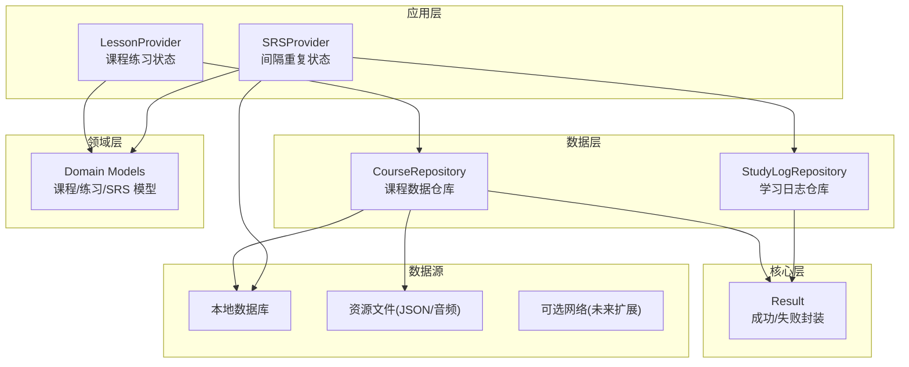
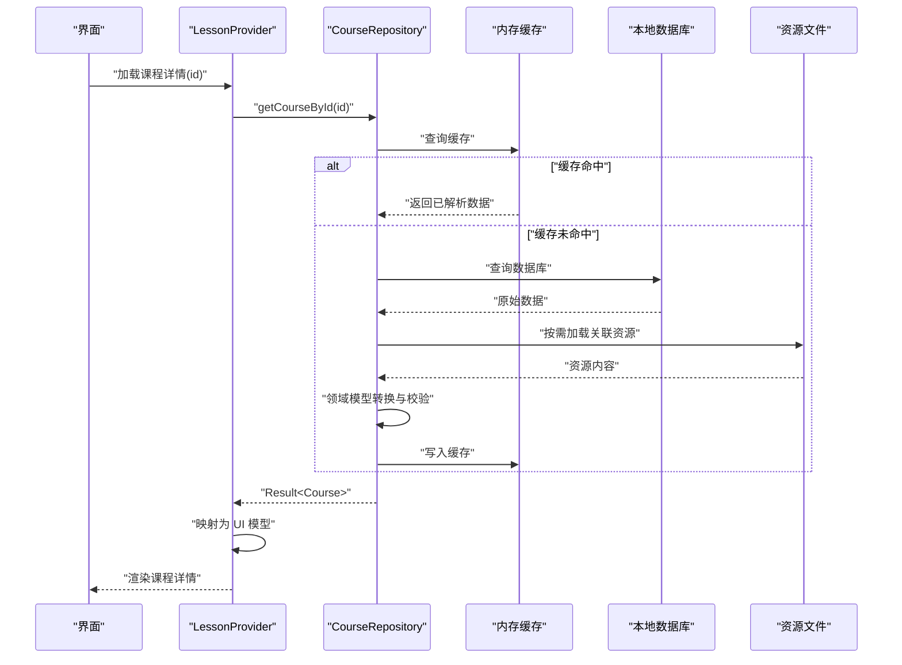
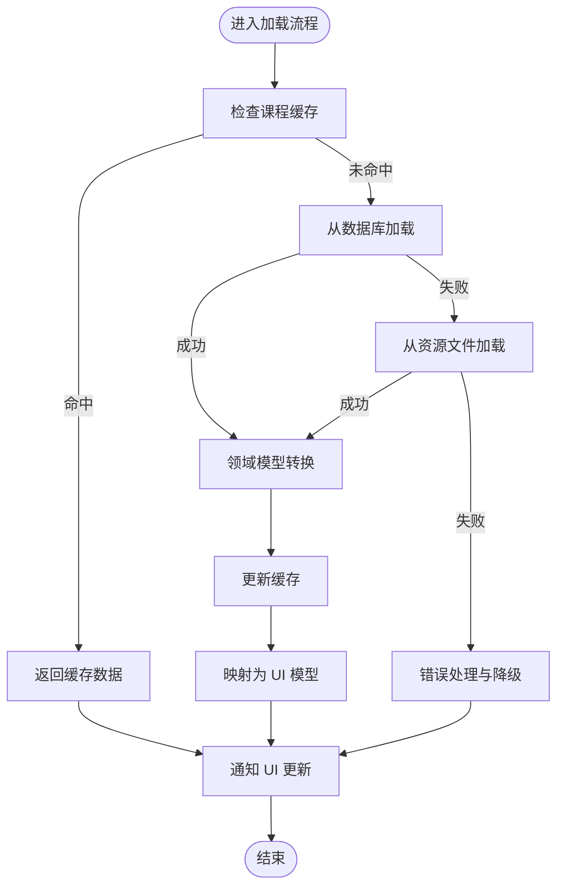
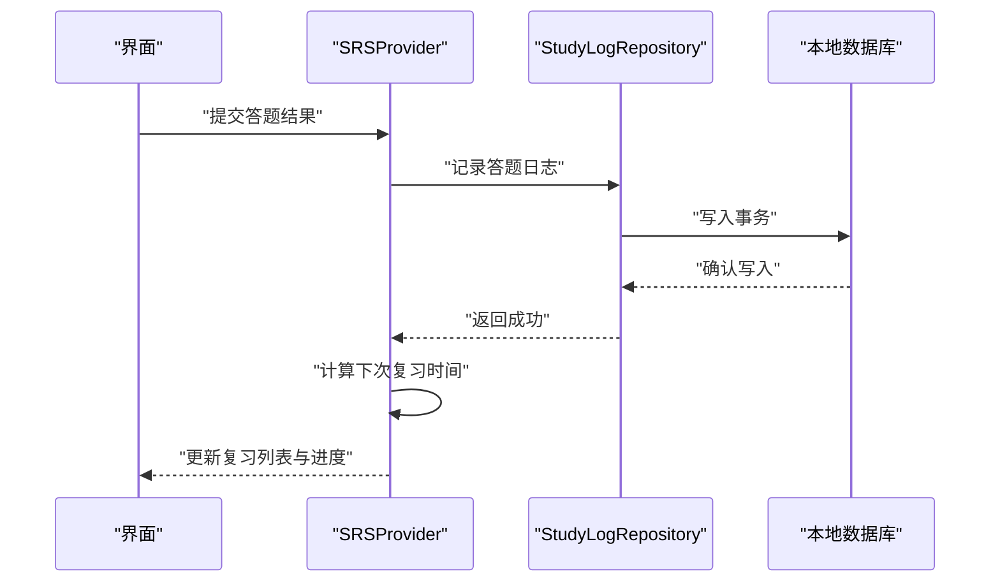
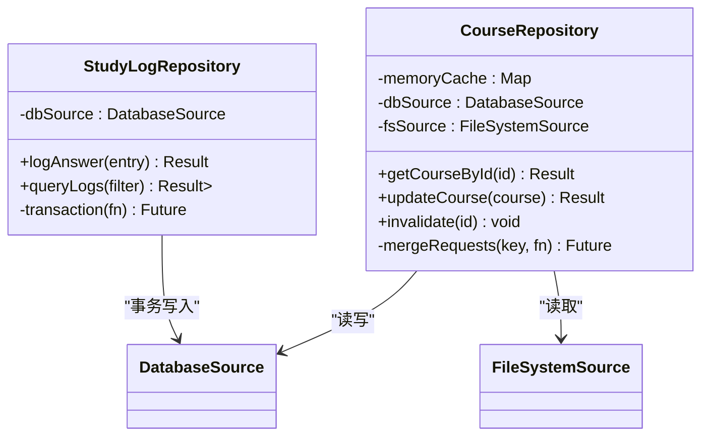
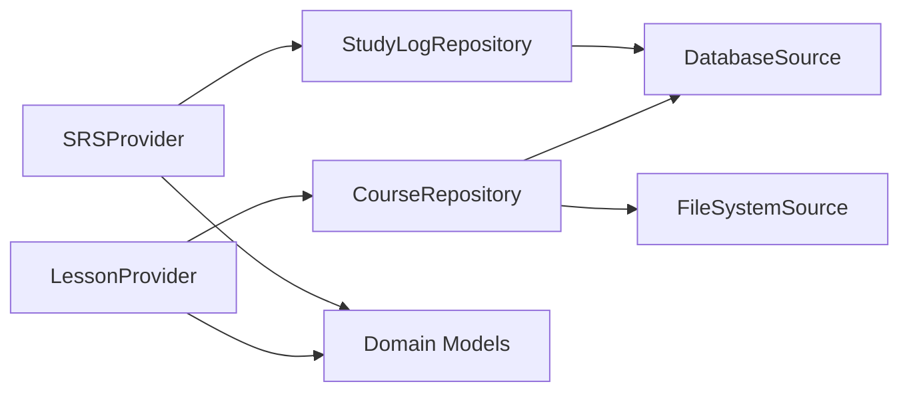

# 数据流设计

<cite>
**本文引用的文件**   
- [lib/main.dart](file://lib/main.dart)
- [lib/data/course_repository.dart](file://lib/data/course_repository.dart)
- [lib/data/study_log_repository.dart](file://lib/data/study_log_repository.dart)
- [lib/application/lesson_provider.dart](file://lib/application/lesson_provider.dart)
- [lib/application/srs_provider.dart](file://lib/application/srs_provider.dart)
- [lib/domain/course/models.dart](file://lib/domain/course/models.dart)
- [lib/core/result.dart](file://lib/core/result.dart)
- [test/data/course_repository_test.dart](file://test/data/course_repository_test.dart)
- [test/application/lesson_provider_flow_test.dart](file://test/application/lesson_provider_flow_test.dart)
- [test/application/race_condition_test.dart](file://test/application/race_condition_test.dart)
</cite>

## 目录
1. [简介](#简介)
2. [项目结构](#项目结构)
3. [核心组件](#核心组件)
4. [架构总览](#架构总览)
5. [详细组件分析](#详细组件分析)
6. [依赖关系分析](#依赖关系分析)
7. [性能考虑](#性能考虑)
8. [故障排查指南](#故障排查指南)
9. [结论](#结论)
10. [附录](#附录)

## 简介
本文件面向 Varnamalaplus 的数据流设计与实现，聚焦单向数据流（Single Direction Data Flow, SDDF）在应用中的落地：从数据获取、转换、缓存到更新的完整链路。文档重点阐述 Repository 模式与数据源抽象、缓存策略、并发访问控制、一致性保证以及错误恢复机制，并通过流程图与时序图帮助开发者理解与优化数据处理性能。

## 项目结构
本项目采用分层架构，围绕“领域模型—应用状态—数据仓库—持久化/外部源”的单向数据流组织代码：
- 领域层（domain）：定义课程、学习进度、SRS 等核心实体与不变式。
- 应用层（application）：以 Provider 管理 UI 状态，驱动数据请求、转换与更新。
- 数据层（data）：通过 Repository 统一抽象数据源（本地数据库、资源文件、网络），并内置缓存与去重逻辑。
- 核心层（core）：提供 Result 类型、工具函数与通用能力。
- 入口（main）：初始化依赖注入、启动应用与全局数据准备。

图表来源
- [lib/application/lesson_provider.dart](file://lib/application/lesson_provider.dart)
- [lib/application/srs_provider.dart](file://lib/application/srs_provider.dart)
- [lib/data/course_repository.dart](file://lib/data/course_repository.dart)
- [lib/data/study_log_repository.dart](file://lib/data/study_log_repository.dart)
- [lib/domain/course/models.dart](file://lib/domain/course/models.dart)
- [lib/core/result.dart](file://lib/core/result.dart)

章节来源
- [lib/main.dart](file://lib/main.dart)
- [lib/data/course_repository.dart](file://lib/data/course_repository.dart)
- [lib/data/study_log_repository.dart](file://lib/data/study_log_repository.dart)
- [lib/application/lesson_provider.dart](file://lib/application/lesson_provider.dart)
- [lib/application/srs_provider.dart](file://lib/application/srs_provider.dart)
- [lib/domain/course/models.dart](file://lib/domain/course/models.dart)
- [lib/core/result.dart](file://lib/core/result.dart)

## 核心组件
- LessonProvider：负责课程与练习相关的应用状态，发起加载、刷新、分页与增量更新，并将领域模型转换为 UI 友好的数据结构。
- SRSProvider：管理间隔重复的学习状态，记录答题结果、计算下次复习时间，并在变更时触发 UI 更新。
- CourseRepository：统一课程数据的读取与写入，屏蔽本地数据库与资源文件的差异，提供缓存与并发安全。
- StudyLogRepository：集中处理学习日志的增删改查，确保事务性与幂等性。
- Result：统一的返回封装，承载成功数据或错误信息，便于上层进行一致的错误处理。

章节来源
- [lib/application/lesson_provider.dart](file://lib/application/lesson_provider.dart)
- [lib/application/srs_provider.dart](file://lib/application/srs_provider.dart)
- [lib/data/course_repository.dart](file://lib/data/course_repository.dart)
- [lib/data/study_log_repository.dart](file://lib/data/study_log_repository.dart)
- [lib/core/result.dart](file://lib/core/result.dart)

## 架构总览
下图展示一次典型的“加载课程详情”的单向数据流：UI 触发 → Provider 调用 Repository → Repository 选择数据源（缓存优先）→ 转换领域模型 → 返回 Result → Provider 更新状态 → UI 重建。

图表来源
- [lib/application/lesson_provider.dart](file://lib/application/lesson_provider.dart)
- [lib/data/course_repository.dart](file://lib/data/course_repository.dart)

## 详细组件分析

### LessonProvider 数据流
- 职责：维护课程列表与当前课程详情；处理加载、刷新、错误重试；将领域模型转换为 UI 友好结构。
- 关键流程：
  - 首次加载：检查本地缓存/数据库，若缺失则拉取资源文件并构建领域模型。
  - 刷新：强制绕过缓存，重新从数据源获取最新数据。
  - 增量更新：监听数据变化事件，仅更新受影响的部分，避免全量重建。
- 并发控制：对同一课程的加载请求进行合并，避免重复 I/O。
- 错误处理：捕获异常并包装为 Result，向上抛出可恢复错误，允许 UI 显示降级视图。

图表来源
- [lib/application/lesson_provider.dart](file://lib/application/lesson_provider.dart)
- [lib/data/course_repository.dart](file://lib/data/course_repository.dart)

章节来源
- [lib/application/lesson_provider.dart](file://lib/application/lesson_provider.dart)
- [test/application/lesson_provider_flow_test.dart](file://test/application/lesson_provider_flow_test.dart)

### SRSProvider 数据流
- 职责：管理用户的答题结果与复习计划；根据算法计算下次复习时间；持久化学习日志。
- 关键流程：
  - 答题提交：记录答案、正确性、耗时，触发 SRS 计算。
  - 复习调度：基于间隔重复算法更新下次复习时间，必要时触发即时复习。
  - 状态同步：将变更广播给订阅者，驱动 UI 刷新。
- 一致性保证：使用事务包裹日志写入，确保答题记录与复习计划的一致性。
- 错误恢复：当持久化失败时，回滚事务并提示用户重试。

图表来源
- [lib/application/srs_provider.dart](file://lib/application/srs_provider.dart)
- [lib/data/study_log_repository.dart](file://lib/data/study_log_repository.dart)

章节来源
- [lib/application/srs_provider.dart](file://lib/application/srs_provider.dart)
- [lib/data/study_log_repository.dart](file://lib/data/study_log_repository.dart)

### CourseRepository 数据流
- 职责：统一课程数据的读取与写入；管理内存缓存与磁盘缓存；处理并发请求合并。
- 关键流程：
  - 读取：优先内存缓存 → 本地数据库 → 资源文件 → 网络（预留）。
  - 写入：先写内存缓存，再异步落盘，失败时回滚。
  - 失效策略：按课程 ID 粒度失效，支持批量失效。
- 并发控制：对相同 key 的请求进行合并，避免重复 I/O。
- 错误处理：将底层异常包装为 Result，并提供重试与降级策略。

图表来源
- [lib/data/course_repository.dart](file://lib/data/course_repository.dart)
- [lib/data/study_log_repository.dart](file://lib/data/study_log_repository.dart)

章节来源
- [lib/data/course_repository.dart](file://lib/data/course_repository.dart)
- [test/data/course_repository_test.dart](file://test/data/course_repository_test.dart)

### 领域模型与转换管道
- 领域模型：课程、练习、词汇、语法点、SRS 状态等实体，定义不变式与业务规则。
- 转换管道：
  - 原始数据 → 领域模型：校验必填字段、规范化格式、建立关联关系。
  - 领域模型 → UI 模型：扁平化嵌套结构、计算展示字段、格式化文本与时间。
- 复杂度：转换过程通常为 O(n) 线性遍历，注意避免重复计算与不必要的对象创建。

章节来源
- [lib/domain/course/models.dart](file://lib/domain/course/models.dart)

### 错误处理与 Result 类型
- Result：统一封装成功与失败场景，避免空指针与异常传播。
- 错误分类：网络错误、数据不一致、IO 异常、业务校验失败。
- 恢复策略：重试、降级、回滚、用户提示。

章节来源
- [lib/core/result.dart](file://lib/core/result.dart)

## 依赖关系分析
- 耦合度：Provider 依赖 Repository，Repository 依赖数据源（数据库/文件系统），领域模型被多层复用。
- 内聚性：每个组件职责单一，数据流向清晰，易于测试与维护。
- 潜在循环依赖：通过接口与依赖注入避免直接循环引用。

图表来源
- [lib/application/lesson_provider.dart](file://lib/application/lesson_provider.dart)
- [lib/application/srs_provider.dart](file://lib/application/srs_provider.dart)
- [lib/data/course_repository.dart](file://lib/data/course_repository.dart)
- [lib/data/study_log_repository.dart](file://lib/data/study_log_repository.dart)
- [lib/domain/course/models.dart](file://lib/domain/course/models.dart)

章节来源
- [lib/application/lesson_provider.dart](file://lib/application/lesson_provider.dart)
- [lib/application/srs_provider.dart](file://lib/application/srs_provider.dart)
- [lib/data/course_repository.dart](file://lib/data/course_repository.dart)
- [lib/data/study_log_repository.dart](file://lib/data/study_log_repository.dart)
- [lib/domain/course/models.dart](file://lib/domain/course/models.dart)

## 性能考虑
- 缓存策略：
  - 内存缓存：热点数据常驻内存，减少 I/O 延迟。
  - 磁盘缓存：持久化结构化数据，支持离线访问。
  - 失效策略：按 ID 粒度失效，避免全表扫描。
- 并发优化：
  - 请求合并：相同 key 的请求合并执行，避免重复 I/O。
  - 懒加载：按需加载关联资源，减少初始加载时间。
- 转换优化：
  - 增量更新：仅更新变化的部分，避免全量重建。
  - 预计算：对频繁使用的展示字段进行预计算与缓存。
- 监控与度量：
  - 埋点统计：I/O 耗时、缓存命中率、错误率。
  - 基准测试：关键路径的性能回归检测。

[本节为通用指导，不直接分析具体文件]

## 故障排查指南
- 常见问题：
  - 数据不一致：检查事务边界与回滚逻辑。
  - 缓存污染：验证失效策略与键空间隔离。
  - 并发冲突：审查请求合并与锁机制。
  - 错误恢复：确认 Result 分支处理与重试策略。
- 调试建议：
  - 启用详细日志：记录关键步骤与异常堆栈。
  - 单元测试覆盖：模拟数据源异常与边界条件。
  - 集成测试：端到端验证数据流完整性。

章节来源
- [test/application/race_condition_test.dart](file://test/application/race_condition_test.dart)
- [test/data/course_repository_test.dart](file://test/data/course_repository_test.dart)

## 结论
Varnamalaplus 通过清晰的单向数据流与 Repository 模式，实现了高内聚、低耦合的数据处理架构。结合缓存、并发控制与错误恢复机制，系统在性能与可靠性之间取得平衡。开发者应遵循数据流规范，合理设计转换管道与缓存策略，持续优化用户体验与系统稳定性。

[本节为总结性内容，不直接分析具体文件]

## 附录
- 术语表：
  - 单向数据流：数据从源到 UI 的单向传递，避免双向绑定带来的复杂性。
  - Repository 模式：抽象数据源，提供统一的数据访问接口。
  - 间隔重复：基于遗忘曲线的复习算法，优化记忆效果。
- 参考文件：
  - [lib/main.dart](file://lib/main.dart)
  - [lib/data/course_repository.dart](file://lib/data/course_repository.dart)
  - [lib/data/study_log_repository.dart](file://lib/data/study_log_repository.dart)
  - [lib/application/lesson_provider.dart](file://lib/application/lesson_provider.dart)
  - [lib/application/srs_provider.dart](file://lib/application/srs_provider.dart)
  - [lib/domain/course/models.dart](file://lib/domain/course/models.dart)
  - [lib/core/result.dart](file://lib/core/result.dart)
  - [test/data/course_repository_test.dart](file://test/data/course_repository_test.dart)
  - [test/application/lesson_provider_flow_test.dart](file://test/application/lesson_provider_flow_test.dart)
  - [test/application/race_condition_test.dart](file://test/application/race_condition_test.dart)