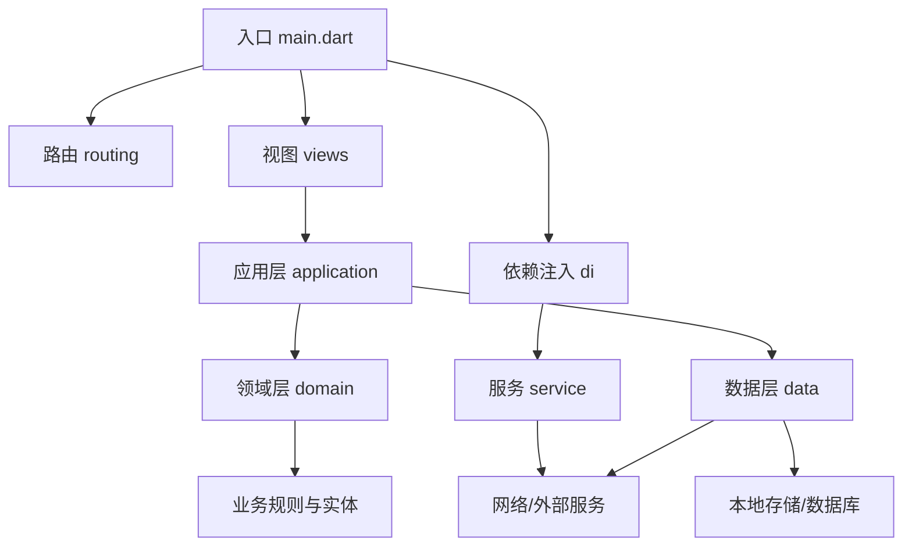
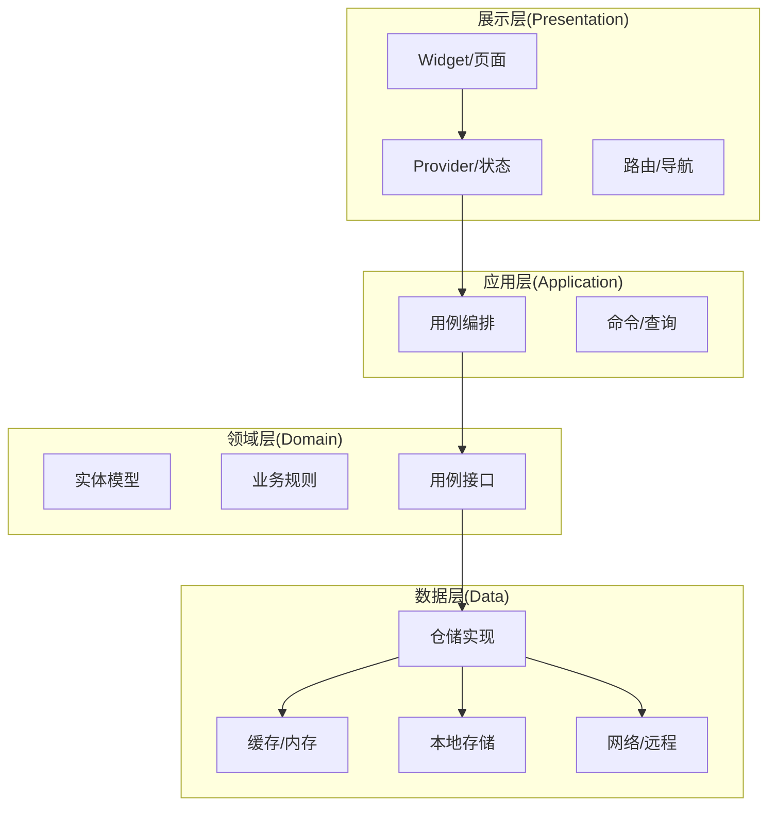
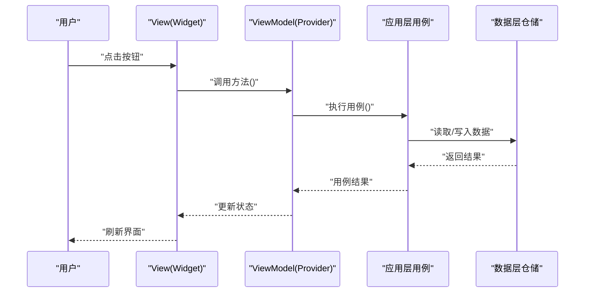
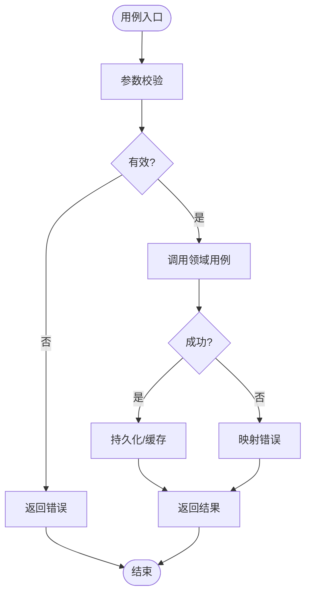
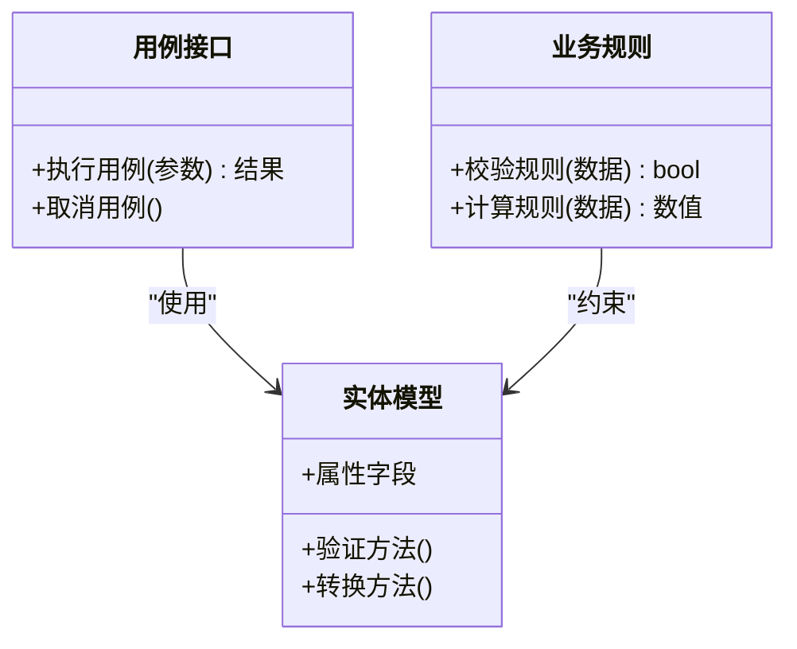
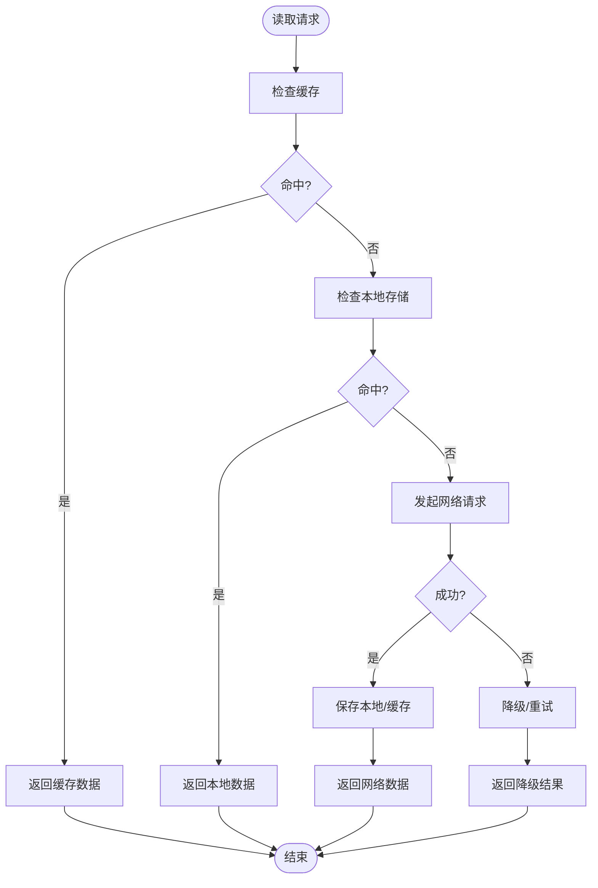
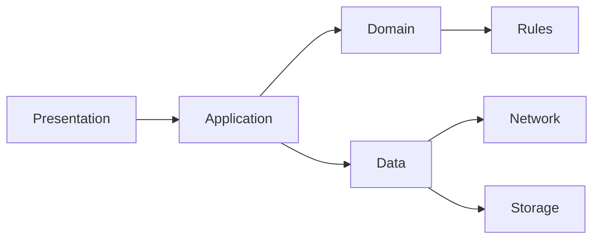

# 架构设计

<cite>
**本文档引用的文件**   
- [main.dart](file://lib/main.dart)
- [pubspec.yaml](file://pubspec.yaml)
- [README.md](file://README.md)
- [analysis_options.yaml](file://analysis_options.yaml)
- [build.yaml](file://build.yaml)
- [devtools_options.yaml](file://devtools_options.yaml)
- [Makefile](file://Makefile)
</cite>

## 目录
1. [简介](#简介)
2. [项目结构](#项目结构)
3. [核心组件](#核心组件)
4. [架构总览](#架构总览)
5. [详细组件分析](#详细组件分析)
6. [依赖分析](#依赖分析)
7. [性能考虑](#性能考虑)
8. [故障排查指南](#故障排查指南)
9. [结论](#结论)
10. [附录](#附录)

## 简介
本架构设计文档面向 Varnamalaplus 项目的开发者与架构师，系统阐述分层架构模式（presentation、application、domain、data）的职责划分与协作方式，解释 MVVM 的实现细节、Provider 的使用策略、状态管理与数据流向，并给出系统边界、扩展点设计与第三方服务集成策略。文档同时提供架构图与组件关系图，帮助读者快速把握整体设计思路与关键交互路径。

## 项目结构
Varnamalaplus 采用 Flutter/Dart 技术栈，代码组织遵循清晰的分层与模块化原则：
- lib/ 为应用源码根目录，包含 application、core、courses、data、di、domain、routing、service、views 等模块
- android/、ios/、web/、windows/、linux/、macos/ 为各平台适配与构建配置
- assets/ 存放课程资源、图片与音频
- test/ 覆盖单元测试、集成测试与黄金测试
- tool/ 包含课程工具链与脚本
- docs/ 记录架构决策与设计说明

图表来源
- [main.dart:1-200](file://lib/main.dart#L1-L200)

章节来源
- [main.dart:1-200](file://lib/main.dart#L1-L200)
- [pubspec.yaml:1-200](file://pubspec.yaml#L1-L200)

## 核心组件
- 入口与初始化：应用启动时完成依赖注入、路由注册、主题与国际化设置，以及必要的服务可用性检查
- 路由管理：集中式路由定义与守卫逻辑，确保页面跳转时的前置条件满足
- 依赖注入：统一的容器管理 Provider 与服务实例，支持按作用域与生命周期管理
- 视图层（Presentation）：基于 Flutter Widget 的 UI 组件，通过 Provider 订阅状态变化并响应事件
- 应用层（Application）：编排用例流程，协调领域与数据层，处理跨用例的状态与事务
- 领域层（Domain）：纯业务模型、规则与用例接口，不依赖具体实现
- 数据层（Data）：仓储实现、缓存策略、网络请求与本地持久化，屏蔽底层差异

章节来源
- [main.dart:1-200](file://lib/main.dart#L1-L200)
- [pubspec.yaml:1-200](file://pubspec.yaml#L1-L200)

## 架构总览
Varnamalaplus 采用分层架构与 MVVM 模式结合：
- Presentation 层仅负责渲染与用户交互，通过 Provider 暴露状态与动作
- Application 层封装用例，调用 Domain 与 Data 提供的能力
- Domain 层定义实体与用例接口，保持业务稳定
- Data 层实现仓储，统一数据源抽象，向上提供稳定的 API

图表来源
- [main.dart:1-200](file://lib/main.dart#L1-L200)

章节来源
- [main.dart:1-200](file://lib/main.dart#L1-L200)

## 详细组件分析

### 展示层（Views）与 MVVM
- 职责：渲染界面、收集用户输入、触发事件、显示加载/错误状态
- MVVM 实现：
  - View：Flutter Widget，无业务逻辑，仅做 UI 呈现
  - ViewModel：通过 Provider 暴露状态与操作方法，订阅数据变化并驱动 UI 更新
  - Model：领域实体或 DTO，用于传输与展示
- 组件交互：
  - 页面通过 Provider.of 获取 ViewModel
  - 用户操作调用 ViewModel 方法，ViewModel 调用应用层用例
  - 用例返回结果后，ViewModel 更新状态，View 自动重建

图表来源
- [main.dart:1-200](file://lib/main.dart#L1-L200)

章节来源
- [main.dart:1-200](file://lib/main.dart#L1-L200)

### 应用层（Application）
- 职责：编排业务流程、组合多个领域与数据操作、处理跨用例事务
- 典型用例：
  - 课程加载与准备
  - 学习进度同步
  - 测验生成与提交
- 数据流：
  - 接收来自 ViewModel 的命令
  - 调用领域用例接口
  - 根据结果更新状态或抛出异常

图表来源
- [main.dart:1-200](file://lib/main.dart#L1-L200)

章节来源
- [main.dart:1-200](file://lib/main.dart#L1-L200)

### 领域层（Domain）
- 职责：定义业务实体、规则与用例接口，不包含外部依赖
- 设计要点：
  - 实体不可变或受控可变
  - 用例接口明确输入输出契约
  - 规则函数纯函数化，便于测试

图表来源
- [main.dart:1-200](file://lib/main.dart#L1-L200)

章节来源
- [main.dart:1-200](file://lib/main.dart#L1-L200)

### 数据层（Data）
- 职责：实现仓储接口，聚合多数据源，提供一致的数据访问 API
- 数据源：
  - 本地存储：SQLite/SharedPreferences
  - 缓存：内存缓存/磁盘缓存
  - 网络：HTTP/GraphQL
- 数据流：
  - 优先读取缓存
  - 未命中则从本地或网络获取
  - 写操作先落盘再同步远端

图表来源
- [main.dart:1-200](file://lib/main.dart#L1-L200)

章节来源
- [main.dart:1-200](file://lib/main.dart#L1-L200)

### 依赖注入（DI）与 Provider
- 容器设计：
  - 全局单例或作用域容器
  - 支持懒加载与按需创建
- Provider 使用：
  - 状态类继承 ChangeNotifier 或通过 Riverpod/Bloc 管理
  - 页面通过 Provider 订阅状态变化
- 最佳实践：
  - 避免循环依赖
  - 合理划分 Provider 作用域
  - 使用工厂模式创建复杂对象

章节来源
- [main.dart:1-200](file://lib/main.dart#L1-L200)

### 路由与导航
- 路由定义：集中式路由表，支持命名路由与参数传递
- 守卫机制：在跳转前进行权限或状态检查
- 深度链接：支持 URL 到页面的映射

章节来源
- [main.dart:1-200](file://lib/main.dart#L1-L200)

### 服务集成（Service）
- 第三方服务：TTS、词典、AI 助手等
- 抽象接口：定义统一的服务协议
- 降级策略：服务不可用时回退到默认行为

章节来源
- [main.dart:1-200](file://lib/main.dart#L1-L200)

## 依赖分析
- 耦合度：
  - Presentation 依赖 Application
  - Application 依赖 Domain 与 Data
  - Domain 无外部依赖
  - Data 依赖基础设施（网络、存储）
- 内聚性：
  - 每层职责清晰，模块内高内聚
- 扩展点：
  - 新增数据源：实现仓储接口
  - 新增服务：实现服务接口并注册到 DI
  - 新增页面：添加路由与 Provider

图表来源
- [main.dart:1-200](file://lib/main.dart#L1-L200)

章节来源
- [main.dart:1-200](file://lib/main.dart#L1-L200)

## 性能考虑
- 状态管理：
  - 使用 Provider 的 select 或等价机制精确订阅
  - 避免不必要的 rebuild
- 数据加载：
  - 分页加载与懒加载
  - 缓存热点数据
- 网络优化：
  - 请求去重与合并
  - 超时与重试策略
- UI 性能：
  - 列表虚拟化
  - 图片压缩与缓存

[本节为通用指导，无需特定文件引用]

## 故障排查指南
- 常见问题：
  - Provider 未正确注入导致空引用
  - 路由守卫失败导致无法跳转
  - 数据层缓存不一致
- 调试技巧：
  - 使用 DevTools 监控状态变化
  - 打印关键日志定位问题
  - 单元测试覆盖边界情况

章节来源
- [main.dart:1-200](file://lib/main.dart#L1-L200)

## 结论
Varnamalaplus 通过分层架构与 MVVM 模式实现了清晰的职责分离与松耦合设计。Presentation 层专注 UI，Application 层编排用例，Domain 层保证业务稳定性，Data 层屏蔽数据源差异。依赖注入与 Provider 提供了灵活的状态管理与服务集成能力。该设计易于扩展与维护，适合大型应用的持续演进。

[本节为总结性内容，无需特定文件引用]

## 附录
- 开发规范：代码风格、命名约定、注释规范
- 构建与发布：CI/CD 流程、签名与打包
- 测试策略：单元测试、集成测试、UI 测试

[本节为补充信息，无需特定文件引用]