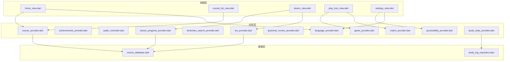
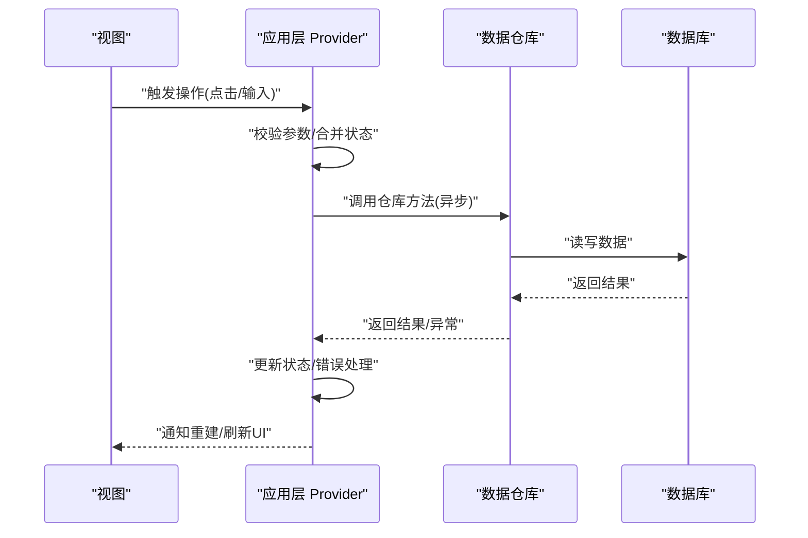
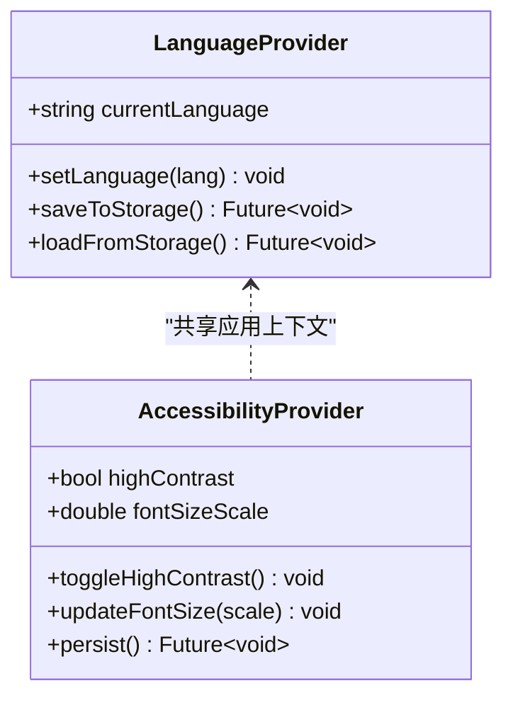
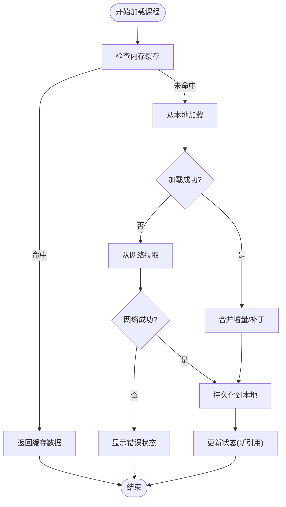
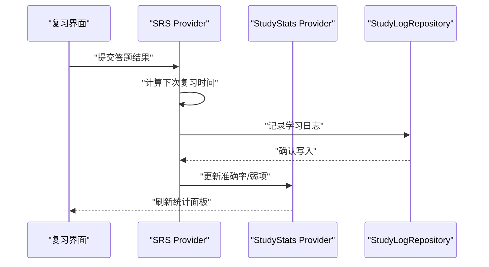
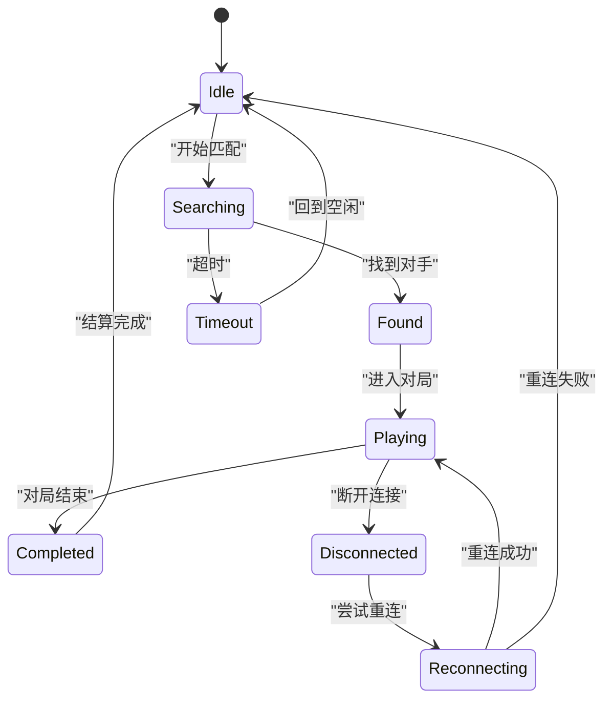
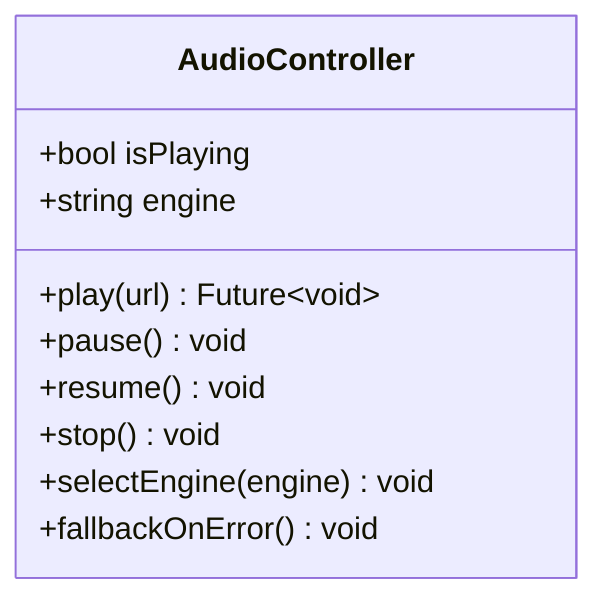
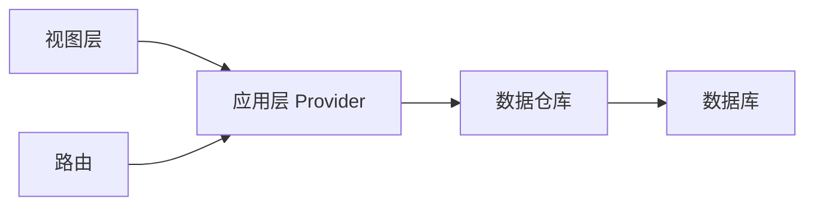

# 状态管理架构

<cite>
**本文引用的文件**   
- [lib/main.dart](file://lib/main.dart)
- [lib/application/accessibility_provider.dart](file://lib/application/accessibility_provider.dart)
- [lib/application/achievements_provider.dart](file://lib/application/achievements_provider.dart)
- [lib/application/audio_controller.dart](file://lib/application/audio_controller.dart)
- [lib/application/course_provider.dart](file://lib/application/course_provider.dart)
- [lib/application/dictionary_search_provider.dart](file://lib/application/dictionary_search_provider.dart)
- [lib/application/game_provider.dart](file://lib/application/game_provider.dart)
- [lib/application/grammar_review_provider.dart](file://lib/application/grammar_review_provider.dart)
- [lib/application/language_provider.dart](file://lib/application/language_provider.dart)
- [lib/application/lesson_progress_provider.dart](file://lib/application/lesson_progress_provider.dart)
- [lib/application/match_provider.dart](file://lib/application/match_provider.dart)
- [lib/application/srs_provider.dart](file://lib/application/srs_provider.dart)
- [lib/application/study_stats_provider.dart](file://lib/application/study_stats_provider.dart)
- [lib/data/course_database.dart](file://lib/data/course_database.dart)
- [lib/data/study_log_repository.dart](file://lib/data/study_log_repository.dart)
- [lib/routing/router.dart](file://lib/routing/router.dart)
- [lib/views/home/home_view.dart](file://lib/views/home/home_view.dart)
- [lib/views/courses/course_list_view.dart](file://lib/views/courses/course_list_view.dart)
- [lib/views/lesson/lesson_view.dart](file://lib/views/lesson/lesson_view.dart)
- [lib/views/play/play_hub_view.dart](file://lib/views/play/play_hub_view.dart)
- [lib/views/settings/settings_view.dart](file://lib/views/settings/settings_view.dart)
- [test/application/provider_identity_test.dart](file://test/application/provider_identity_test.dart)
- [test/application/race_condition_test.dart](file://test/application/race_condition_test.dart)
- [test/application/srs_persist_benchmark_test.dart](file://test/application/srs_persist_benchmark_test.dart)
</cite>

## 目录
1. [简介](#简介)
2. [项目结构](#项目结构)
3. [核心组件](#核心组件)
4. [架构总览](#架构总览)
5. [详细组件分析](#详细组件分析)
6. [依赖关系分析](#依赖关系分析)
7. [性能考量](#性能考量)
8. [故障排查指南](#故障排查指南)
9. [结论](#结论)
10. [附录](#附录)

## 简介
本文件为 Varnamalaplus 项目的状态管理架构文档，聚焦 Provider 的使用模式与最佳实践，涵盖 StateProvider、ChangeNotifierProvider 等类型的应用场景。文档解释状态提升策略、状态同步机制、异步更新处理、错误状态管理与状态持久化方案，并给出复杂状态场景的处理思路、不可变性的实现原则、状态流程图与调试技巧，帮助开发者理解与维护应用状态。

## 项目结构
Varnamalaplus 采用分层架构：
- 视图层（views）：负责 UI 展示与用户交互，通过 Provider 订阅状态变化。
- 应用层（application）：封装业务逻辑与状态管理，提供各类 Provider。
- 数据层（data）：数据库与仓库，负责持久化与数据访问。
- 路由（routing）：页面导航与守卫。
- 入口（main.dart）：初始化依赖注入、主题、路由与根 Provider。

图表来源
- [lib/views/home/home_view.dart](file://lib/views/home/home_view.dart)
- [lib/views/courses/course_list_view.dart](file://lib/views/courses/course_list_view.dart)
- [lib/views/lesson/lesson_view.dart](file://lib/views/lesson/lesson_view.dart)
- [lib/views/play/play_hub_view.dart](file://lib/views/play/play_hub_view.dart)
- [lib/views/settings/settings_view.dart](file://lib/views/settings/settings_view.dart)
- [lib/application/course_provider.dart](file://lib/application/course_provider.dart)
- [lib/application/language_provider.dart](file://lib/application/language_provider.dart)
- [lib/application/lesson_progress_provider.dart](file://lib/application/lesson_progress_provider.dart)
- [lib/application/srs_provider.dart](file://lib/application/srs_provider.dart)
- [lib/application/game_provider.dart](file://lib/application/game_provider.dart)
- [lib/application/match_provider.dart](file://lib/application/match_provider.dart)
- [lib/application/accessibility_provider.dart](file://lib/application/accessibility_provider.dart)
- [lib/data/course_database.dart](file://lib/data/course_database.dart)
- [lib/data/study_log_repository.dart](file://lib/data/study_log_repository.dart)

章节来源
- [lib/main.dart](file://lib/main.dart)

## 核心组件
- 应用级 Provider：语言、可访问性、成就、学习统计、课程加载、SRS、学习进度、游戏匹配等。
- 控制器类：音频控制器作为 ChangeNotifier，驱动播放状态与引擎选择。
- 数据仓库：课程数据库与学习日志仓库，提供持久化能力。
- 路由与守卫：在页面切换时确保课程就绪与状态一致性。

章节来源
- [lib/application/language_provider.dart](file://lib/application/language_provider.dart)
- [lib/application/accessibility_provider.dart](file://lib/application/accessibility_provider.dart)
- [lib/application/achievements_provider.dart](file://lib/application/achievements_provider.dart)
- [lib/application/study_stats_provider.dart](file://lib/application/study_stats_provider.dart)
- [lib/application/course_provider.dart](file://lib/application/course_provider.dart)
- [lib/application/srs_provider.dart](file://lib/application/srs_provider.dart)
- [lib/application/lesson_progress_provider.dart](file://lib/application/lesson_progress_provider.dart)
- [lib/application/game_provider.dart](file://lib/application/game_provider.dart)
- [lib/application/match_provider.dart](file://lib/application/match_provider.dart)
- [lib/application/audio_controller.dart](file://lib/application/audio_controller.dart)
- [lib/data/course_database.dart](file://lib/data/course_database.dart)
- [lib/data/study_log_repository.dart](file://lib/data/study_log_repository.dart)
- [lib/routing/router.dart](file://lib/routing/router.dart)

## 架构总览
整体遵循“单向数据流”的 Provider 模式：
- 视图通过 Provider 读取状态并响应变化。
- 业务逻辑集中在 application 层的 Provider 或控制器中。
- 数据层通过 Repository 抽象出持久化细节，避免耦合。
- 路由层保证页面进入时的前置条件（如课程就绪）。

图表来源
- [lib/application/course_provider.dart](file://lib/application/course_provider.dart)
- [lib/data/course_database.dart](file://lib/data/course_database.dart)
- [lib/views/home/home_view.dart](file://lib/views/home/home_view.dart)

## 详细组件分析

### 语言与可访问性 Provider
- 职责：维护当前语言、主题、字体大小、无障碍选项等全局设置。
- 模式：使用 StateProvider 暴露只读配置，变更通过 setter 方法触发。
- 同步：跨页面共享同一实例，避免重复初始化。
- 持久化：启动时从本地存储加载，退出或关键节点写入。

图表来源
- [lib/application/language_provider.dart](file://lib/application/language_provider.dart)
- [lib/application/accessibility_provider.dart](file://lib/application/accessibility_provider.dart)

章节来源
- [lib/application/language_provider.dart](file://lib/application/language_provider.dart)
- [lib/application/accessibility_provider.dart](file://lib/application/accessibility_provider.dart)

### 课程加载与学习进度 Provider
- 职责：加载课程元数据、章节与词汇；跟踪每课的学习进度。
- 模式：CourseProvider 负责课程数据获取与缓存；LessonProgressProvider 记录完成度与复习计划。
- 异步：网络或磁盘 IO 使用 Future，结合 Loading/Error/Success 状态。
- 不可变性：每次更新生成新对象引用，确保 Provider 精确重建。

图表来源
- [lib/application/course_provider.dart](file://lib/application/course_provider.dart)
- [lib/application/lesson_progress_provider.dart](file://lib/application/lesson_progress_provider.dart)
- [lib/data/course_database.dart](file://lib/data/course_database.dart)

章节来源
- [lib/application/course_provider.dart](file://lib/application/course_provider.dart)
- [lib/application/lesson_progress_provider.dart](file://lib/application/lesson_progress_provider.dart)
- [lib/data/course_database.dart](file://lib/data/course_database.dart)

### SRS 与学习统计 Provider
- 职责：间隔重复算法（SM2）计算下次复习时间；汇总正确率、弱项词等统计。
- 模式：SRS Provider 暴露复习队列与卡片状态；StudyStats Provider 聚合指标。
- 持久化：批量写入日志与复习计划，减少 I/O 次数。
- 性能：惰性计算与缓存热点数据，避免频繁重算。

图表来源
- [lib/application/srs_provider.dart](file://lib/application/srs_provider.dart)
- [lib/application/study_stats_provider.dart](file://lib/application/study_stats_provider.dart)
- [lib/data/study_log_repository.dart](file://lib/data/study_log_repository.dart)

章节来源
- [lib/application/srs_provider.dart](file://lib/application/srs_provider.dart)
- [lib/application/study_stats_provider.dart](file://lib/application/study_stats_provider.dart)
- [lib/data/study_log_repository.dart](file://lib/data/study_log_repository.dart)

### 游戏与匹配 Provider
- 职责：管理游戏会话、匹配状态与对局结果。
- 模式：GameProvider 维护会话生命周期；MatchProvider 协调匹配流程。
- 错误处理：超时、断线重试与回退策略。
- 状态提升：将公共状态提升到父级 Provider，避免子树重复订阅。

图表来源
- [lib/application/game_provider.dart](file://lib/application/game_provider.dart)
- [lib/application/match_provider.dart](file://lib/application/match_provider.dart)

章节来源
- [lib/application/game_provider.dart](file://lib/application/game_provider.dart)
- [lib/application/match_provider.dart](file://lib/application/match_provider.dart)

### 音频控制器（ChangeNotifierProvider）
- 职责：控制音频播放、TTS 引擎选择与回退。
- 模式：继承 ChangeNotifier，暴露播放状态与事件回调。
- 最佳实践：避免在 UI 层直接修改状态，统一通过控制器方法。
- 错误处理：引擎不可用自动回退，提示用户。

图表来源
- [lib/application/audio_controller.dart](file://lib/application/audio_controller.dart)

章节来源
- [lib/application/audio_controller.dart](file://lib/application/audio_controller.dart)

## 依赖关系分析
- 视图依赖应用层 Provider，不直接访问数据层。
- 应用层 Provider 依赖数据仓库，屏蔽持久化细节。
- 路由守卫依赖课程就绪状态，防止非法跳转。
- 测试覆盖 Provider 身份、竞态条件与持久化基准。

图表来源
- [lib/views/home/home_view.dart](file://lib/views/home/home_view.dart)
- [lib/application/course_provider.dart](file://lib/application/course_provider.dart)
- [lib/data/course_database.dart](file://lib/data/course_database.dart)
- [lib/routing/router.dart](file://lib/routing/router.dart)

章节来源
- [test/application/provider_identity_test.dart](file://test/application/provider_identity_test.dart)
- [test/application/race_condition_test.dart](file://test/application/race_condition_test.dart)
- [test/application/srs_persist_benchmark_test.dart](file://test/application/srs_persist_benchmark_test.dart)

## 性能考量
- 最小化重建：使用 select 或等价方式仅订阅必要字段，避免整树重建。
- 不可变更新：每次状态变更创建新对象引用，便于差异比较。
- 批量写入：合并多次 I/O，降低磁盘压力。
- 懒加载：按需加载课程与资源，减少初始开销。
- 缓存策略：内存缓存热点数据，配合失效与过期策略。
- 防抖与节流：高频输入（搜索、滚动）进行去抖与节流。

[本节为通用指导，无需具体文件引用]

## 故障排查指南
- 竞态问题：确保异步任务完成后才更新状态，避免中间态污染。
- 状态不一致：检查 Provider 是否被多处修改，统一入口。
- 持久化失败：增加重试与降级逻辑，记录错误日志。
- 内存泄漏：及时释放监听器与定时器，避免长生命周期持有短生命周期对象。
- 调试技巧：打印状态快照、使用 DevTools 观察 Provider 重建次数。

章节来源
- [test/application/race_condition_test.dart](file://test/application/race_condition_test.dart)
- [test/application/srs_persist_benchmark_test.dart](file://test/application/srs_persist_benchmark_test.dart)

## 结论
Varnamalaplus 的状态管理以 Provider 为核心，结合不可变更新、单向数据流与分层架构，实现了清晰的状态流转与良好的可维护性。通过合理运用 StateProvider 与 ChangeNotifierProvider，配合数据仓库与路由守卫，应用具备稳定的状态同步、可靠的异步处理与高效的性能表现。建议持续完善错误处理与监控，保持状态的最小化与一致性。

[本节为总结，无需具体文件引用]

## 附录
- 状态提升策略：将跨组件共享的状态提升到最近的共同祖先 Provider，避免深层传递。
- 状态同步机制：基于事件驱动的更新模型，确保 UI 与状态一致。
- 异步更新处理：使用 Future/Stream 组合，明确 Loading/Error/Success 三态。
- 错误状态管理：集中捕获与展示错误，支持用户重试与回退。
- 状态持久化：关键状态落盘，启动时恢复，定期增量保存。
- 不可变性原理：通过创建新对象引用，使 Provider 能精确识别变化并触发最小重建。

[本节为概念性内容，无需具体文件引用]