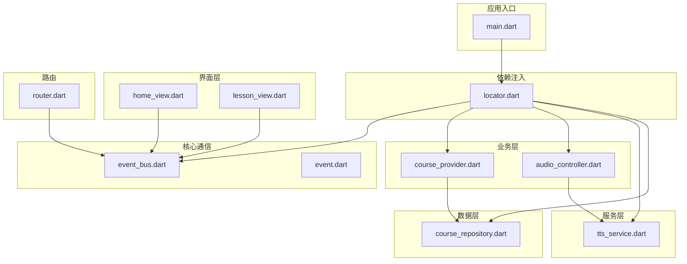
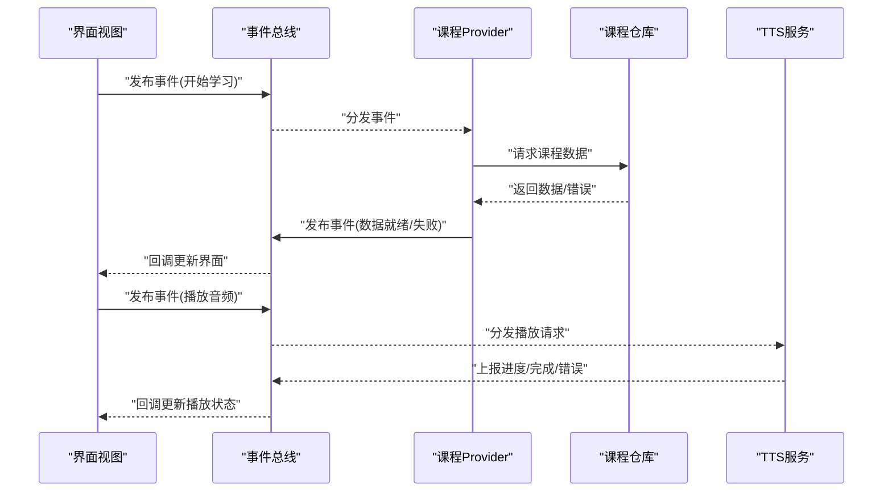
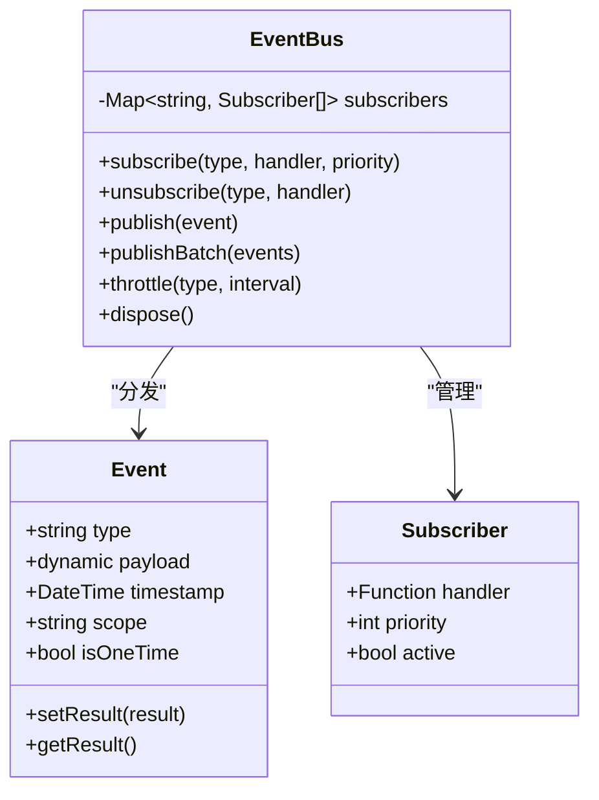
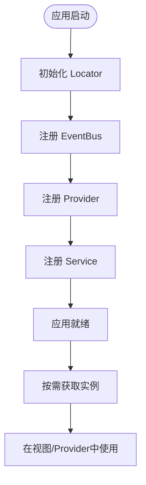
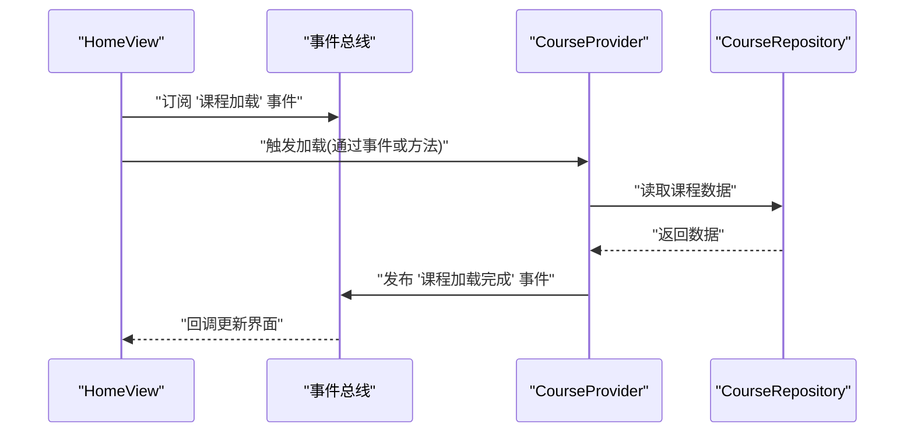
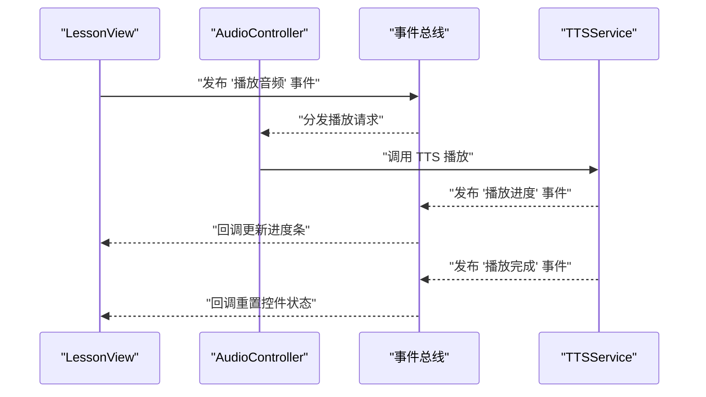
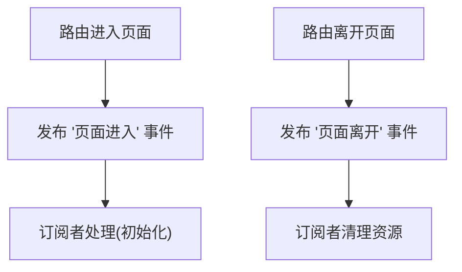
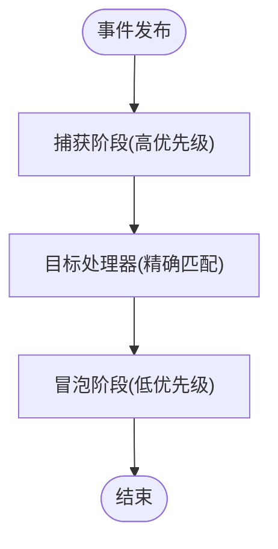
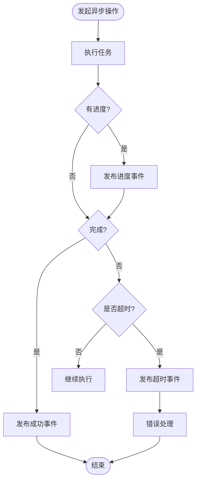
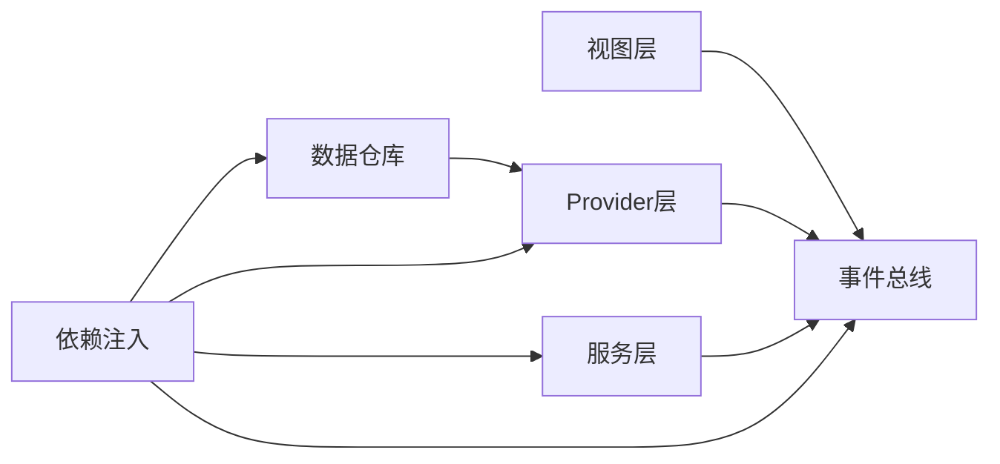

# 组件通信机制

<cite>
**本文档引用的文件**   
- [lib/main.dart](file://lib/main.dart)
- [lib/di/locator.dart](file://lib/di/locator.dart)
- [lib/core/event_bus.dart](file://lib/core/event_bus.dart)
- [lib/core/event.dart](file://lib/core/event.dart)
- [lib/application/providers/course_provider.dart](file://lib/application/providers/course_provider.dart)
- [lib/application/providers/audio_controller.dart](file://lib/application/providers/audio_controller.dart)
- [lib/views/home/home_view.dart](file://lib/views/home/home_view.dart)
- [lib/views/lesson/lesson_view.dart](file://lib/views/lesson/lesson_view.dart)
- [lib/routing/router.dart](file://lib/routing/router.dart)
- [lib/service/tts_service.dart](file://lib/service/tts_service.dart)
- [lib/data/repository/course_repository.dart](file://lib/data/repository/course_repository.dart)
</cite>

## 目录
1. [简介](#简介)
2. [项目结构](#项目结构)
3. [核心组件](#核心组件)
4. [架构总览](#架构总览)
5. [详细组件分析](#详细组件分析)
6. [依赖关系分析](#依赖关系分析)
7. [性能考虑](#性能考虑)
8. [故障排查指南](#故障排查指南)
9. [结论](#结论)
10. [附录](#附录)

## 简介
本文件面向 Varnamalaplus 项目的组件通信机制，聚焦事件驱动架构的实现与最佳实践。内容涵盖：
- 自定义事件系统与消息总线设计
- 跨组件数据传递、状态同步与生命周期协调
- 异步通信、错误传播与超时处理
- 事件冒泡与捕获机制
- 典型通信场景的代码级示例（以路径引用代替具体代码）
- 通信流程图与性能优化建议

目标读者包括希望理解并扩展系统内组件交互的开发者，以及需要构建高可靠、高性能通信链路的工程师。

## 项目结构
Varnamalaplus 采用分层与模块化组织方式，通信相关能力集中在 core、di、application、service、data 等层：
- lib/core：通用基础设施，包含事件总线与事件定义
- lib/di：依赖注入容器，提供全局服务定位器
- lib/application：业务提供者（Provider），承载状态与业务逻辑
- lib/service：外部服务封装（如 TTS）
- lib/data：数据仓库与持久化访问
- lib/views：UI 视图层，订阅事件或调用服务
- lib/routing：路由管理，触发页面级事件

图表来源
- [lib/main.dart:1-50](file://lib/main.dart#L1-L50)
- [lib/di/locator.dart:1-80](file://lib/di/locator.dart#L1-L80)
- [lib/core/event_bus.dart:1-120](file://lib/core/event_bus.dart#L1-L120)
- [lib/core/event.dart:1-60](file://lib/core/event.dart#L1-L60)
- [lib/application/providers/course_provider.dart:1-120](file://lib/application/providers/course_provider.dart#L1-L120)
- [lib/application/providers/audio_controller.dart:1-120](file://lib/application/providers/audio_controller.dart#L1-L120)
- [lib/service/tts_service.dart:1-100](file://lib/service/tts_service.dart#L1-L100)
- [lib/data/repository/course_repository.dart:1-120](file://lib/data/repository/course_repository.dart#L1-L120)
- [lib/views/home/home_view.dart:1-120](file://lib/views/home/home_view.dart#L1-L120)
- [lib/views/lesson/lesson_view.dart:1-120](file://lib/views/lesson/lesson_view.dart#L1-L120)
- [lib/routing/router.dart:1-100](file://lib/routing/router.dart#L1-L100)

章节来源
- [lib/main.dart:1-50](file://lib/main.dart#L1-L50)
- [lib/di/locator.dart:1-80](file://lib/di/locator.dart#L1-L80)

## 核心组件
- 事件总线（EventBus）：提供发布/订阅、类型安全的事件分发、优先级与去重、取消订阅与生命周期清理
- 事件定义（Event）：统一事件模型，支持元数据、时间戳、作用域与结果回传
- 依赖注入（Locator）：集中注册与获取 EventBus、Provider、Service，确保单例与可测试性
- Provider（课程、音频等）：通过事件总线与 UI 层解耦，负责状态变更与副作用
- Service（TTS）：对外部能力的封装，通过事件上报进度与错误
- Repository（课程仓库）：数据访问抽象，通过事件通知加载状态变化
- UI 视图（Home/Lesson）：订阅事件更新界面，或通过 Locator 调用服务

章节来源
- [lib/core/event_bus.dart:1-120](file://lib/core/event_bus.dart#L1-L120)
- [lib/core/event.dart:1-60](file://lib/core/event.dart#L1-L60)
- [lib/di/locator.dart:1-80](file://lib/di/locator.dart#L1-L80)
- [lib/application/providers/course_provider.dart:1-120](file://lib/application/providers/course_provider.dart#L1-L120)
- [lib/application/providers/audio_controller.dart:1-120](file://lib/application/providers/audio_controller.dart#L1-L120)
- [lib/service/tts_service.dart:1-100](file://lib/service/tts_service.dart#L1-L100)
- [lib/data/repository/course_repository.dart:1-120](file://lib/data/repository/course_repository.dart#L1-L120)
- [lib/views/home/home_view.dart:1-120](file://lib/views/home/home_view.dart#L1-L120)
- [lib/views/lesson/lesson_view.dart:1-120](file://lib/views/lesson/lesson_view.dart#L1-L120)

## 架构总览
事件驱动架构的核心在于“解耦”与“可扩展”。各组件通过事件总线进行通信，避免直接耦合；Provider 与 Service 作为事件生产者，UI 与控制器作为消费者。依赖注入保证实例生命周期一致性与可替换性。

图表来源
- [lib/core/event_bus.dart:1-120](file://lib/core/event_bus.dart#L1-L120)
- [lib/application/providers/course_provider.dart:1-120](file://lib/application/providers/course_provider.dart#L1-L120)
- [lib/data/repository/course_repository.dart:1-120](file://lib/data/repository/course_repository.dart#L1-L120)
- [lib/service/tts_service.dart:1-100](file://lib/service/tts_service.dart#L1-L100)
- [lib/views/home/home_view.dart:1-120](file://lib/views/home/home_view.dart#L1-L120)
- [lib/views/lesson/lesson_view.dart:1-120](file://lib/views/lesson/lesson_view.dart#L1-L120)

## 详细组件分析

### 事件总线与事件模型
- 事件模型：统一事件类型、载荷、时间戳、作用域与可选的结果通道
- 事件总线：支持按类型订阅、通配符匹配、优先级队列、一次性订阅、取消订阅、批量发布与节流
- 生命周期：在 Provider/Service 销毁时自动取消订阅，防止内存泄漏

图表来源
- [lib/core/event.dart:1-60](file://lib/core/event.dart#L1-L60)
- [lib/core/event_bus.dart:1-120](file://lib/core/event_bus.dart#L1-L120)

章节来源
- [lib/core/event.dart:1-60](file://lib/core/event.dart#L1-L60)
- [lib/core/event_bus.dart:1-120](file://lib/core/event_bus.dart#L1-L120)

### 依赖注入与服务定位
- 使用 Locator 集中注册 EventBus、Provider、Service
- 提供 get<T>() 获取实例，支持延迟初始化与单例模式
- 便于单元测试替换为 Mock 实现

图表来源
- [lib/di/locator.dart:1-80](file://lib/di/locator.dart#L1-L80)
- [lib/main.dart:1-50](file://lib/main.dart#L1-L50)

章节来源
- [lib/di/locator.dart:1-80](file://lib/di/locator.dart#L1-L80)
- [lib/main.dart:1-50](file://lib/main.dart#L1-L50)

### Provider 与 UI 的状态同步
- Provider 通过事件总线发布状态变更事件
- UI 订阅事件并更新本地状态，避免直接调用 Provider
- 支持一次性订阅用于单次操作后的自动清理

图表来源
- [lib/application/providers/course_provider.dart:1-120](file://lib/application/providers/course_provider.dart#L1-L120)
- [lib/data/repository/course_repository.dart:1-120](file://lib/data/repository/course_repository.dart#L1-L120)
- [lib/views/home/home_view.dart:1-120](file://lib/views/home/home_view.dart#L1-L120)
- [lib/core/event_bus.dart:1-120](file://lib/core/event_bus.dart#L1-L120)

章节来源
- [lib/application/providers/course_provider.dart:1-120](file://lib/application/providers/course_provider.dart#L1-L120)
- [lib/views/home/home_view.dart:1-120](file://lib/views/home/home_view.dart#L1-L120)

### 音频控制与 TTS 服务通信
- 音频控制器通过事件总线发起播放、暂停、停止等操作
- TTS 服务上报播放进度、完成与错误事件
- 界面根据事件更新播放控件状态

图表来源
- [lib/application/providers/audio_controller.dart:1-120](file://lib/application/providers/audio_controller.dart#L1-L120)
- [lib/service/tts_service.dart:1-100](file://lib/service/tts_service.dart#L1-L100)
- [lib/views/lesson/lesson_view.dart:1-120](file://lib/views/lesson/lesson_view.dart#L1-L120)
- [lib/core/event_bus.dart:1-120](file://lib/core/event_bus.dart#L1-L120)

章节来源
- [lib/application/providers/audio_controller.dart:1-120](file://lib/application/providers/audio_controller.dart#L1-L120)
- [lib/service/tts_service.dart:1-100](file://lib/service/tts_service.dart#L1-L100)
- [lib/views/lesson/lesson_view.dart:1-120](file://lib/views/lesson/lesson_view.dart#L1-L120)

### 路由与页面级事件
- 路由跳转前后发布生命周期事件（进入/离开）
- 页面组件订阅这些事件以执行初始化与清理逻辑

图表来源
- [lib/routing/router.dart:1-100](file://lib/routing/router.dart#L1-L100)
- [lib/core/event_bus.dart:1-120](file://lib/core/event_bus.dart#L1-L120)

章节来源
- [lib/routing/router.dart:1-100](file://lib/routing/router.dart#L1-L100)

### 事件冒泡与捕获机制
- 捕获阶段：高层组件先接收事件，可用于拦截或预处理
- 冒泡阶段：事件从子节点向父节点传播，适合聚合响应
- 在事件总线中可通过作用域与优先级模拟冒泡/捕获行为

图表来源
- [lib/core/event_bus.dart:1-120](file://lib/core/event_bus.dart#L1-L120)
- [lib/core/event.dart:1-60](file://lib/core/event.dart#L1-L60)

章节来源
- [lib/core/event_bus.dart:1-120](file://lib/core/event_bus.dart#L1-L120)
- [lib/core/event.dart:1-60](file://lib/core/event.dart#L1-L60)

### 异步通信、错误传播与超时处理
- 异步任务：Provider/Service 内部使用异步流程，通过事件上报中间状态
- 错误传播：错误事件携带错误码与消息，消费者统一处理
- 超时处理：对长耗时操作设置超时事件，避免阻塞主线程

图表来源
- [lib/core/event_bus.dart:1-120](file://lib/core/event_bus.dart#L1-L120)
- [lib/application/providers/course_provider.dart:1-120](file://lib/application/providers/course_provider.dart#L1-L120)
- [lib/service/tts_service.dart:1-100](file://lib/service/tts_service.dart#L1-L100)

章节来源
- [lib/core/event_bus.dart:1-120](file://lib/core/event_bus.dart#L1-L120)
- [lib/application/providers/course_provider.dart:1-120](file://lib/application/providers/course_provider.dart#L1-L120)
- [lib/service/tts_service.dart:1-100](file://lib/service/tts_service.dart#L1-L100)

## 依赖关系分析
- 松耦合：UI 不直接依赖 Provider/Service，而是通过事件总线
- 集中式注册：Locator 统一管理实例生命周期，降低循环依赖风险
- 可测试性：通过 Locator 替换为 Mock 实现，验证事件流与状态同步

图表来源
- [lib/di/locator.dart:1-80](file://lib/di/locator.dart#L1-L80)
- [lib/core/event_bus.dart:1-120](file://lib/core/event_bus.dart#L1-L120)
- [lib/application/providers/course_provider.dart:1-120](file://lib/application/providers/course_provider.dart#L1-L120)
- [lib/service/tts_service.dart:1-100](file://lib/service/tts_service.dart#L1-L100)
- [lib/data/repository/course_repository.dart:1-120](file://lib/data/repository/course_repository.dart#L1-L120)

章节来源
- [lib/di/locator.dart:1-80](file://lib/di/locator.dart#L1-L80)
- [lib/core/event_bus.dart:1-120](file://lib/core/event_bus.dart#L1-L120)

## 性能考虑
- 事件去重与节流：对高频事件（如播放进度）进行节流，减少 UI 刷新频率
- 一次性订阅：操作完成后自动取消订阅，避免内存泄漏
- 优先级调度：关键事件优先处理，非关键事件延后处理
- 批量发布：合并多次状态变更为一次事件，降低分发开销
- 作用域隔离：不同模块使用独立作用域，避免不必要的事件广播

[本节为通用指导，无需特定文件来源]

## 故障排查指南
- 事件未触发：检查订阅是否正确注册、作用域是否匹配、是否存在重复订阅导致覆盖
- 内存泄漏：确认在组件销毁时取消订阅，避免持有强引用
- 异步错误：查看错误事件中的错误码与消息，定位上游服务或数据源问题
- 超时问题：调整超时阈值，检查网络或服务可用性
- 性能瓶颈：启用事件统计，识别热点事件与高频处理器

章节来源
- [lib/core/event_bus.dart:1-120](file://lib/core/event_bus.dart#L1-L120)
- [lib/service/tts_service.dart:1-100](file://lib/service/tts_service.dart#L1-L100)
- [lib/application/providers/course_provider.dart:1-120](file://lib/application/providers/course_provider.dart#L1-L120)

## 结论
Varnamalaplus 的事件驱动架构通过统一的事件模型与消息总线实现了松耦合、可扩展的组件通信。结合依赖注入与 Provider 模式，系统在状态同步、异步处理与错误传播方面具备良好的一致性与可维护性。遵循本文的最佳实践与性能建议，可进一步提升系统的可靠性与用户体验。

[本节为总结性内容，无需特定文件来源]

## 附录
- 典型通信场景参考路径：
  - 课程加载与 UI 更新：[lib/application/providers/course_provider.dart:1-120](file://lib/application/providers/course_provider.dart#L1-L120)、[lib/views/home/home_view.dart:1-120](file://lib/views/home/home_view.dart#L1-L120)
  - 音频播放与进度反馈：[lib/application/providers/audio_controller.dart:1-120](file://lib/application/providers/audio_controller.dart#L1-L120)、[lib/service/tts_service.dart:1-100](file://lib/service/tts_service.dart#L1-L100)、[lib/views/lesson/lesson_view.dart:1-120](file://lib/views/lesson/lesson_view.dart#L1-L120)
  - 路由生命周期事件：[lib/routing/router.dart:1-100](file://lib/routing/router.dart#L1-L100)
  - 事件总线与事件模型：[lib/core/event_bus.dart:1-120](file://lib/core/event_bus.dart#L1-L120)、[lib/core/event.dart:1-60](file://lib/core/event.dart#L1-L60)
  - 依赖注入配置：[lib/di/locator.dart:1-80](file://lib/di/locator.dart#L1-L80)、[lib/main.dart:1-50](file://lib/main.dart#L1-L50)

[本节为参考信息，无需特定文件来源]