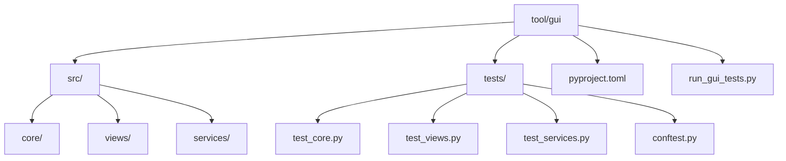
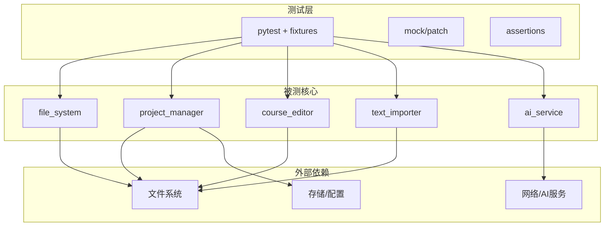
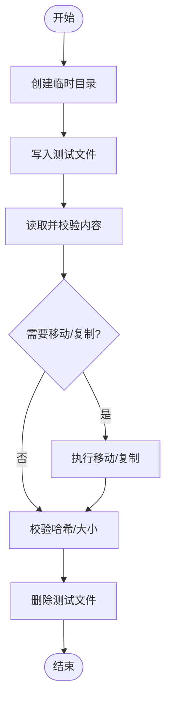
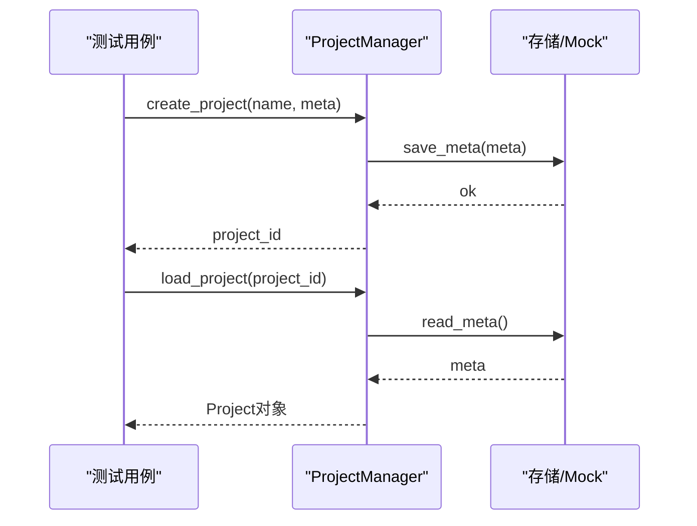
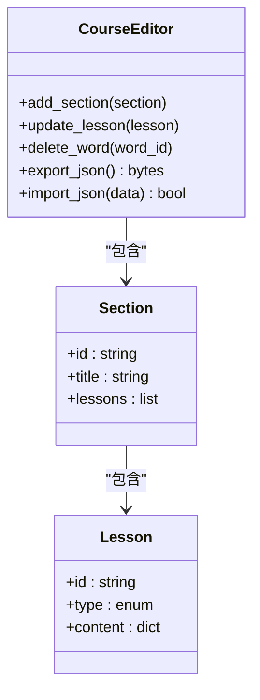
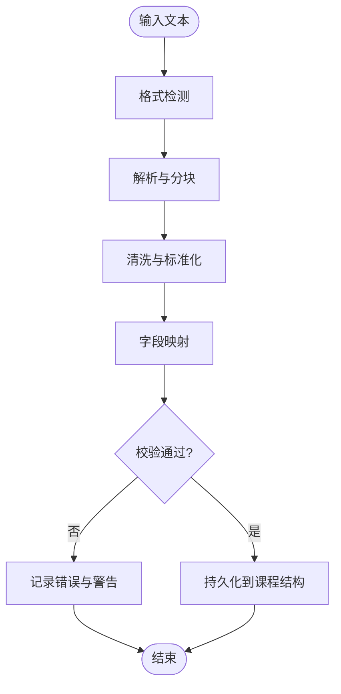
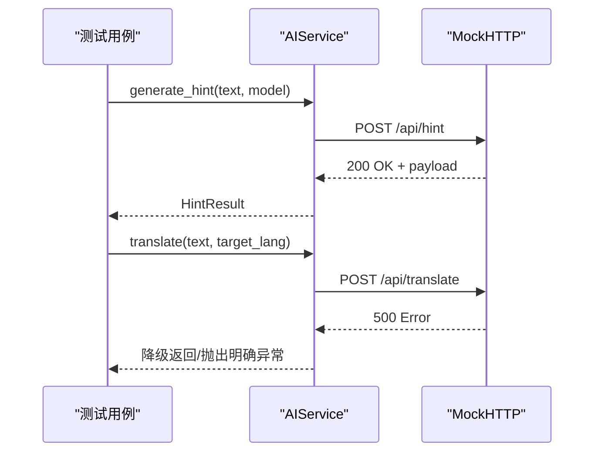
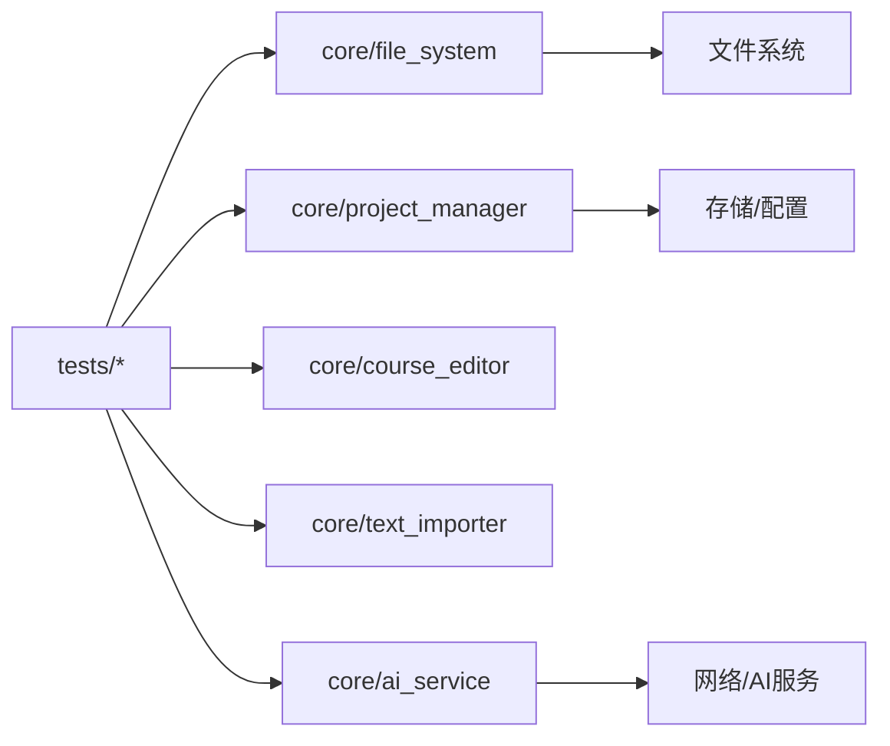

# GUI工具测试

<cite>
**本文档引用的文件**
- [tool/gui/pyproject.toml](file://tool/gui/pyproject.toml)
- [tool/gui/run_gui_tests.py](file://tool/gui/run_gui_tests.py)
- [tool/gui/README.md](file://tool/gui/README.md)
- [test/tool/gui_round_trip_test.py](file://test/tool/gui_round_trip_test.py)
- [tool/gui/src/core/file_system.py](file://tool/gui/src/core/file_system.py)
- [tool/gui/src/core/project_manager.py](file://tool/gui/src/core/project_manager.py)
- [tool/gui/src/core/course_editor.py](file://tool/gui/src/core/course_editor.py)
- [tool/gui/src/core/text_importer.py](file://tool/gui/src/core/text_importer.py)
- [tool/gui/src/core/ai_service.py](file://tool/gui/src/core/ai_service.py)
- [tool/gui/tests/test_file_system.py](file://tool/gui/tests/test_file_system.py)
- [tool/gui/tests/test_project_manager.py](file://tool/gui/tests/test_project_manager.py)
- [tool/gui/tests/test_course_editor.py](file://tool/gui/tests/test_course_editor.py)
- [tool/gui/tests/test_text_importer.py](file://tool/gui/tests/test_text_importer.py)
- [tool/gui/tests/test_ai_service.py](file://tool/gui/tests/test_ai_service.py)
- [tool/gui/tests/conftest.py](file://tool/gui/tests/conftest.py)
</cite>

## 目录
1. [简介](#简介)
2. [项目结构](#项目结构)
3. [核心组件](#核心组件)
4. [架构总览](#架构总览)
5. [详细组件分析](#详细组件分析)
6. [依赖分析](#依赖分析)
7. [性能考虑](#性能考虑)
8. [故障排查指南](#故障排查指南)
9. [结论](#结论)
10. [附录](#附录)

## 简介
本文件为 Varnamalaplus GUI工具的测试文档，聚焦Python测试框架的使用与最佳实践。内容涵盖pytest配置、测试目录结构与命名约定、GUI组件测试、后端API测试、业务逻辑测试的实现方法；并提供课程编辑器、文本导入工具、AI功能等模块的测试示例与技巧。同时给出测试数据生成、模拟文件系统与目录操作的方法，帮助读者快速搭建稳定可靠的GUI工具测试体系。

## 项目结构
GUI工具的测试位于 tool/gui 目录下，采用“源码与测试分离”的组织方式：
- 源码位于 tool/gui/src，按功能划分core、views、services等子包。
- 测试位于 tool/gui/tests，按被测模块组织对应测试文件，便于定位与维护。
- pytest配置通过 pyproject.toml 集中管理，统一运行参数与插件行为。
- 提供 run_gui_tests.py 作为统一的测试入口脚本，支持筛选、并行执行与结果输出。

图表来源
- [tool/gui/pyproject.toml](file://tool/gui/pyproject.toml)
- [tool/gui/run_gui_tests.py](file://tool/gui/run_gui_tests.py)
- [tool/gui/README.md](file://tool/gui/README.md)

章节来源
- [tool/gui/pyproject.toml](file://tool/gui/pyproject.toml)
- [tool/gui/run_gui_tests.py](file://tool/gui/run_gui_tests.py)
- [tool/gui/README.md](file://tool/gui/README.md)

## 核心组件
- 测试运行器
  - run_gui_tests.py：封装pytest调用，支持过滤、并发、日志级别与报告输出。
- 测试配置
  - pyproject.toml：定义pytest参数、插件、标记（markers）、路径与缓存设置。
- 公共夹具与辅助
  - tests/conftest.py：提供全局fixture，如临时目录、Mock服务、固定数据集。
- 被测模块
  - core/file_system.py：文件与目录操作的抽象与实现。
  - core/project_manager.py：项目管理（创建、加载、保存、迁移）。
  - core/course_editor.py：课程编辑器的核心逻辑（章节、词汇、语法点）。
  - core/text_importer.py：文本导入工具（解析、清洗、映射）。
  - core/ai_service.py：AI能力（提示生成、翻译、校对）的接口与适配。

章节来源
- [tool/gui/run_gui_tests.py](file://tool/gui/run_gui_tests.py)
- [tool/gui/pyproject.toml](file://tool/gui/pyproject.toml)
- [tool/gui/tests/conftest.py](file://tool/gui/tests/conftest.py)
- [tool/gui/src/core/file_system.py](file://tool/gui/src/core/file_system.py)
- [tool/gui/src/core/project_manager.py](file://tool/gui/src/core/project_manager.py)
- [tool/gui/src/core/course_editor.py](file://tool/gui/src/core/course_editor.py)
- [tool/gui/src/core/text_importer.py](file://tool/gui/src/core/text_importer.py)
- [tool/gui/src/core/ai_service.py](file://tool/gui/src/core/ai_service.py)

## 架构总览
GUI工具测试围绕“输入—处理—输出”的闭环展开：
- 输入层：测试数据（JSON、CSV、TXT、音频/图片占位）由 fixtures 或工厂函数生成。
- 处理层：core模块负责业务逻辑，测试通过注入Mock或In-Memory实现隔离外部依赖。
- 输出层：断言持久化结果（文件/数据库）、状态变更（UI模型）与副作用（日志/事件）。

图表来源
- [tool/gui/src/core/file_system.py](file://tool/gui/src/core/file_system.py)
- [tool/gui/src/core/project_manager.py](file://tool/gui/src/core/project_manager.py)
- [tool/gui/src/core/course_editor.py](file://tool/gui/src/core/course_editor.py)
- [tool/gui/src/core/text_importer.py](file://tool/gui/src/core/text_importer.py)
- [tool/gui/src/core/ai_service.py](file://tool/gui/src/core/ai_service.py)

## 详细组件分析

### 文件系统与目录操作测试
- 目标：验证读写、移动、删除、权限、编码、路径规范化等行为。
- 策略：使用临时目录与内存文件系统，避免污染真实环境。
- 关键用例：
  - 新建/删除目录与文件
  - 批量复制与校验哈希
  - 大文件分块读取与进度回调
  - 异常路径与非法字符处理
- 推荐夹具：
  - tmp_dir：每次测试自动清理
  - sample_files：预置常用样例文件集合

章节来源
- [tool/gui/src/core/file_system.py](file://tool/gui/src/core/file_system.py)
- [tool/gui/tests/test_file_system.py](file://tool/gui/tests/test_file_system.py)
- [tool/gui/tests/conftest.py](file://tool/gui/tests/conftest.py)

### 项目管理器测试
- 目标：确保项目的创建、加载、保存、版本迁移与冲突解决正确。
- 策略：注入内存存储或Mock持久化层，断言元数据与索引一致性。
- 关键用例：
  - 新项目初始化与默认模板
  - 多语言资源合并与去重
  - 增量保存与回滚
  - 冲突检测与三方合并
- 推荐夹具：
  - mock_repo：模拟仓库/存储接口
  - sample_project：标准项目骨架

图表来源
- [tool/gui/src/core/project_manager.py](file://tool/gui/src/core/project_manager.py)
- [tool/gui/tests/test_project_manager.py](file://tool/gui/tests/test_project_manager.py)

章节来源
- [tool/gui/src/core/project_manager.py](file://tool/gui/src/core/project_manager.py)
- [tool/gui/tests/test_project_manager.py](file://tool/gui/tests/test_project_manager.py)

### 课程编辑器测试
- 目标：验证章节结构、词汇表、语法点的增删改查与关联关系。
- 策略：以最小数据集驱动，断言序列化前后一致性与约束规则。
- 关键用例：
  - 新增章节与顺序调整
  - 词汇词条去重与同义词合并
  - 语法点引用校验与循环依赖检测
  - 导出/导入往返一致性
- 推荐夹具：
  - minimal_course：最小可用课程结构
  - course_factory：按需构造复杂场景

图表来源
- [tool/gui/src/core/course_editor.py](file://tool/gui/src/core/course_editor.py)
- [tool/gui/tests/test_course_editor.py](file://tool/gui/tests/test_course_editor.py)

章节来源
- [tool/gui/src/core/course_editor.py](file://tool/gui/src/core/course_editor.py)
- [tool/gui/tests/test_course_editor.py](file://tool/gui/tests/test_course_editor.py)

### 文本导入工具测试
- 目标：保证不同格式文本的解析、清洗、映射与错误恢复可靠。
- 策略：覆盖边界输入（空行、乱码、超长段落），断言中间态与最终产物。
- 关键用例：
  - CSV/TSV列映射与类型转换
  - HTML片段提取与标签清洗
  - 正则匹配失败的回退策略
  - 导入日志与问题清单输出
- 推荐夹具：
  - sample_texts：多格式样例集
  - mapping_rules：字段映射规则

章节来源
- [tool/gui/src/core/text_importer.py](file://tool/gui/src/core/text_importer.py)
- [tool/gui/tests/test_text_importer.py](file://tool/gui/tests/test_text_importer.py)

### AI服务测试
- 目标：验证AI能力（提示生成、翻译、校对）的接口契约与容错。
- 策略：使用Mock/Stub替代真实网络请求，断言请求构造与响应解析。
- 关键用例：
  - 超时与重试策略
  - 错误码与降级返回
  - 敏感信息脱敏与日志安全
  - 流式响应的中断与恢复
- 推荐夹具：
  - mock_ai_client：模拟HTTP客户端
  - ai_responses：常见成功/失败响应集

图表来源
- [tool/gui/src/core/ai_service.py](file://tool/gui/src/core/ai_service.py)
- [tool/gui/tests/test_ai_service.py](file://tool/gui/tests/test_ai_service.py)

章节来源
- [tool/gui/src/core/ai_service.py](file://tool/gui/src/core/ai_service.py)
- [tool/gui/tests/test_ai_service.py](file://tool/gui/tests/test_ai_service.py)

### 端到端往返测试（GUI Round Trip）
- 目标：从GUI触发到数据落盘再到重新加载的一致性验证。
- 策略：构造最小GUI交互序列，断言中间产物与最终状态。
- 参考实现：见 test/tool/gui_round_trip_test.py

章节来源
- [test/tool/gui_round_trip_test.py](file://test/tool/gui_round_trip_test.py)

## 依赖分析
- 测试对源码的依赖集中在core模块，通过依赖注入或接口替换降低耦合。
- 外部依赖（文件系统、网络、存储）均被Mock或In-Memory实现替代，确保可重复性。
- 测试间共享夹具集中于 conftest.py，避免重复代码与状态泄漏。

图表来源
- [tool/gui/tests/test_file_system.py](file://tool/gui/tests/test_file_system.py)
- [tool/gui/tests/test_project_manager.py](file://tool/gui/tests/test_project_manager.py)
- [tool/gui/tests/test_course_editor.py](file://tool/gui/tests/test_course_editor.py)
- [tool/gui/tests/test_text_importer.py](file://tool/gui/tests/test_text_importer.py)
- [tool/gui/tests/test_ai_service.py](file://tool/gui/tests/test_ai_service.py)

章节来源
- [tool/gui/tests/conftest.py](file://tool/gui/tests/conftest.py)

## 性能考虑
- 使用内存文件系统与轻量Mock减少IO开销，提升测试速度。
- 合理拆分测试粒度，避免单用例过大导致阻塞。
- 启用pytest-xdist进行并行执行，注意线程安全与资源隔离。
- 对大数据集导入测试采用采样与分页策略，控制内存占用。

[本节为通用指导，不直接分析具体文件]

## 故障排查指南
- 常见问题
  - 测试环境不一致：确保使用临时目录与固定种子数据。
  - Mock未生效：检查patch作用域与导入路径。
  - 异步/事件回调未等待：在测试中显式await或同步钩子。
  - 编码问题：统一UTF-8，必要时显式声明编码。
- 调试技巧
  - 使用pytest -s 打印日志与中间状态。
  - 增加 --tb=short 快速定位堆栈。
  - 针对失败用例添加断言中间变量快照。

章节来源
- [tool/gui/tests/conftest.py](file://tool/gui/tests/conftest.py)
- [tool/gui/run_gui_tests.py](file://tool/gui/run_gui_tests.py)

## 结论
通过清晰的测试分层、严格的依赖隔离与完善的夹具体系，Varnamalaplus GUI工具的测试覆盖了GUI组件、后端API与业务逻辑的关键路径。建议持续完善边界用例与回归套件，结合CI自动化保障质量。

[本节为总结性内容，不直接分析具体文件]

## 附录
- 运行测试
  - 使用 run_gui_tests.py 启动全部或指定模块测试。
  - 通过 pyproject.toml 自定义参数与插件行为。
- 编写新测试
  - 在 tests 下新增对应模块的测试文件。
  - 将共享夹具放入 conftest.py。
  - 优先使用最小数据集与Mock外部依赖。
- 参考实现
  - 端到端往返测试：test/tool/gui_round_trip_test.py

章节来源
- [tool/gui/run_gui_tests.py](file://tool/gui/run_gui_tests.py)
- [tool/gui/pyproject.toml](file://tool/gui/pyproject.toml)
- [test/tool/gui_round_trip_test.py](file://test/tool/gui_round_trip_test.py)
- [tool/gui/tests/conftest.py](file://tool/gui/tests/conftest.py)