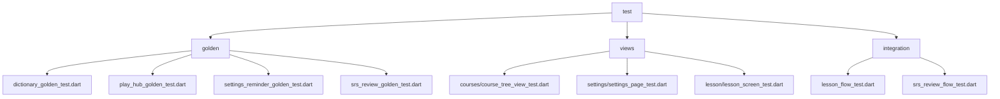
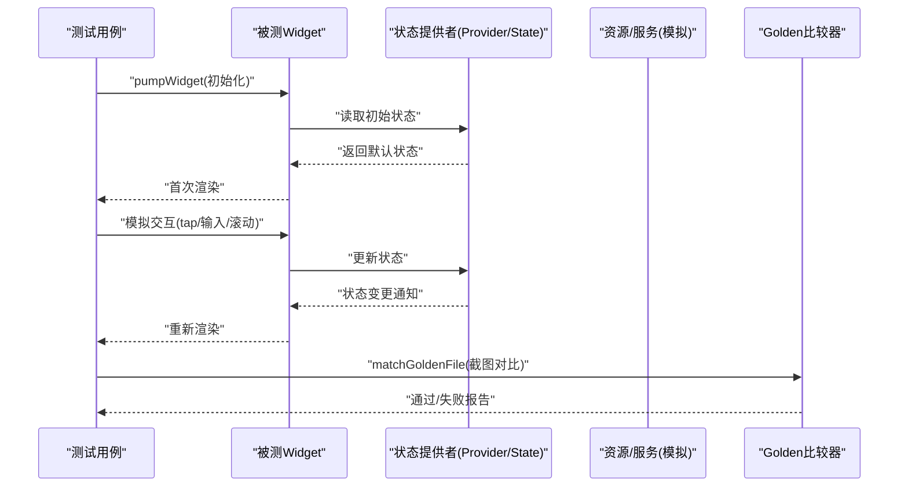
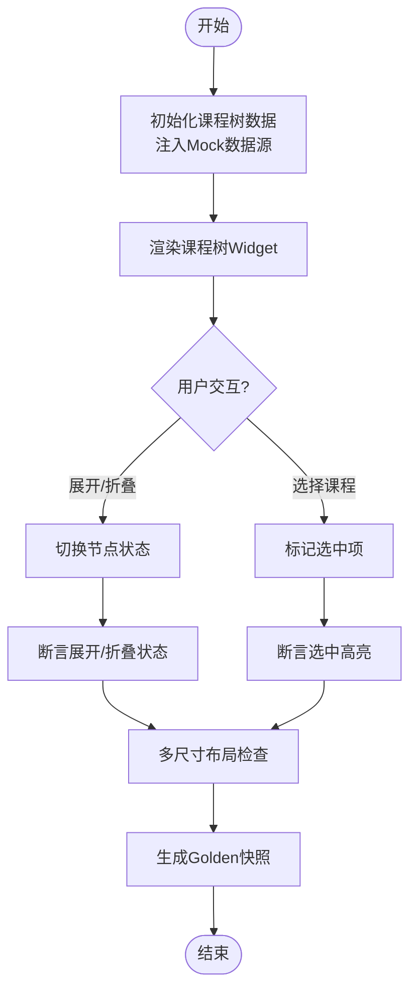
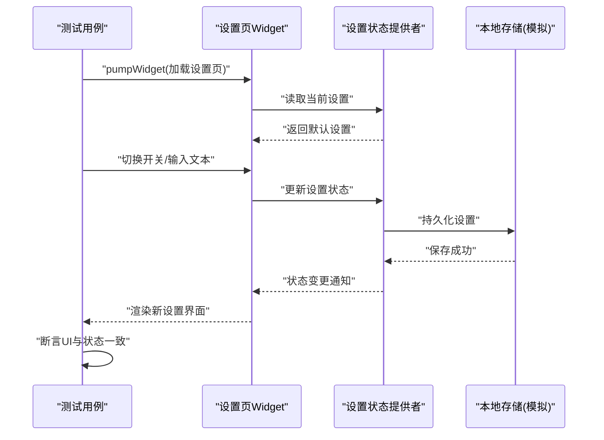
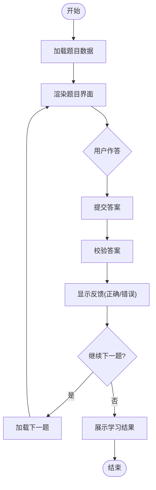
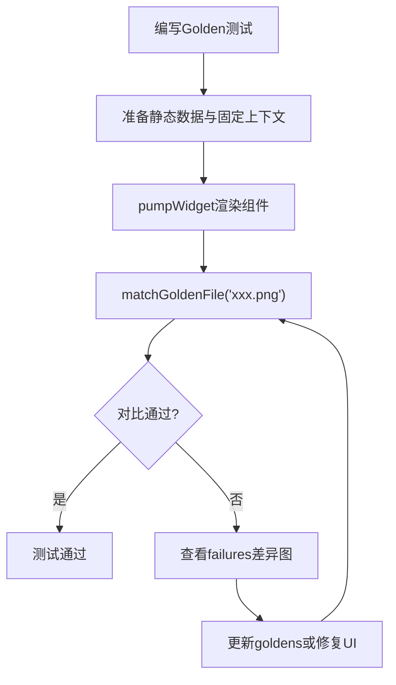
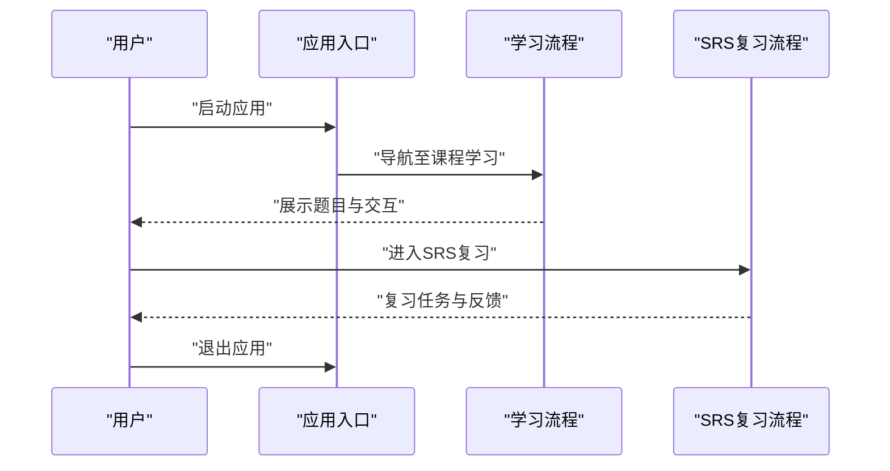
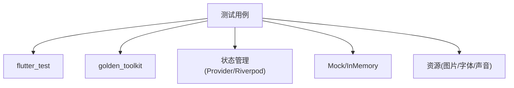

# UI测试

<cite>
**本文档引用的文件**
- [test/golden/dictionary_golden_test.dart](file://test/golden/dictionary_golden_test.dart)
- [test/golden/play_hub_golden_test.dart](file://test/golden/play_hub_golden_test.dart)
- [test/golden/settings_reminder_golden_test.dart](file://test/golden/settings_reminder_golden_test.dart)
- [test/golden/srs_review_golden_test.dart](file://test/golden/srs_review_golden_test.dart)
- [test/views/courses/course_tree_view_test.dart](file://test/views/courses/course_tree_view_test.dart)
- [test/views/settings/settings_page_test.dart](file://test/views/settings/settings_page_test.dart)
- [test/views/lesson/lesson_screen_test.dart](file://test/views/lesson/lesson_screen_test.dart)
- [test/integration/lesson_flow_test.dart](file://test/integration/lesson_flow_test.dart)
- [test/integration/srs_review_flow_test.dart](file://test/integration/srs_review_flow_test.dart)
- [pubspec.yaml](file://pubspec.yaml)
- [lib/main.dart](file://lib/main.dart)
</cite>

## 目录
1. [简介](#简介)
2. [项目结构](#项目结构)
3. [核心组件](#核心组件)
4. [架构总览](#架构总览)
5. [详细组件分析](#详细组件分析)
6. [依赖分析](#依赖分析)
7. [性能考虑](#性能考虑)
8. [故障排查指南](#故障排查指南)
9. [结论](#结论)
10. [附录](#附录)

## 简介
本文件面向 Varnamalaplus 项目的 UI 测试，聚焦 Flutter Widget 测试框架与 Golden（视觉回归）测试。文档涵盖：
- 如何使用 Flutter 的 Widget 测试进行用户交互模拟、状态变化验证与响应式布局测试
- Golden 测试的配置与使用，用于视觉回归检测
- 针对课程树视图、设置页面、学习界面的具体测试示例
- 动画与过渡效果的测试策略
- 跨平台兼容性测试要点

## 项目结构
Varnamalaplus 的测试代码集中在 test 目录下，UI 相关测试主要分布在以下位置：
- golden：Golden 视觉回归测试用例与基准图片
- views：按视图模块划分的 Widget 测试
- integration：端到端流程测试（如课程学习流、SRS 复习流）

**图表来源**
- [test/golden/dictionary_golden_test.dart](file://test/golden/dictionary_golden_test.dart)
- [test/golden/play_hub_golden_test.dart](file://test/golden/play_hub_golden_test.dart)
- [test/golden/settings_reminder_golden_test.dart](file://test/golden/settings_reminder_golden_test.dart)
- [test/golden/srs_review_golden_test.dart](file://test/golden/srs_review_golden_test.dart)
- [test/views/courses/course_tree_view_test.dart](file://test/views/courses/course_tree_view_test.dart)
- [test/views/settings/settings_page_test.dart](file://test/views/settings/settings_page_test.dart)
- [test/views/lesson/lesson_screen_test.dart](file://test/views/lesson/lesson_screen_test.dart)
- [test/integration/lesson_flow_test.dart](file://test/integration/lesson_flow_test.dart)
- [test/integration/srs_review_flow_test.dart](file://test/integration/srs_review_flow_test.dart)

**章节来源**
- [pubspec.yaml](file://pubspec.yaml)
- [lib/main.dart](file://lib/main.dart)

## 核心组件
- Widget 测试基础
  - 使用 flutter_test 提供的 pumpWidget、find、tester 等能力挂载组件、触发事件、断言渲染结果
  - 通过 MockProvider 或 InMemoryRepository 隔离外部依赖，确保测试稳定可重复
- Golden 测试
  - 使用 golden_toolkit 或 flutter_tester 的 matchGoldenFile 进行像素级对比
  - 维护 goldens（基准图）与 failures（差异图），在 CI 中自动比对
- 交互与状态
  - 使用 tester.tap、enterText、drag 等模拟用户操作
  - 结合 StateNotifier/Provider/Riverpod 等状态管理，断言状态变更后 UI 的变化
- 响应式布局
  - 使用 SizedBox 包裹被测组件并指定不同宽高，验证在不同屏幕尺寸下的布局行为
- 动画与过渡
  - 使用 tester.pumpAndSettle 等待动画完成，或使用 CustomPainter 快照进行关键帧对比

**章节来源**
- [test/golden/dictionary_golden_test.dart](file://test/golden/dictionary_golden_test.dart)
- [test/golden/play_hub_golden_test.dart](file://test/golden/play_hub_golden_test.dart)
- [test/golden/settings_reminder_golden_test.dart](file://test/golden/settings_reminder_golden_test.dart)
- [test/golden/srs_review_golden_test.dart](file://test/golden/srs_review_golden_test.dart)
- [test/views/courses/course_tree_view_test.dart](file://test/views/courses/course_tree_view_test.dart)
- [test/views/settings/settings_page_test.dart](file://test/views/settings/settings_page_test.dart)
- [test/views/lesson/lesson_screen_test.dart](file://test/views/lesson/lesson_screen_test.dart)
- [test/integration/lesson_flow_test.dart](file://test/integration/lesson_flow_test.dart)
- [test/integration/srs_review_flow_test.dart](file://test/integration/srs_review_flow_test.dart)

## 架构总览
下图展示了 UI 测试在应用中的角色与数据流向：测试驱动 Widget 渲染，通过注入的状态与数据源驱动界面更新，最终通过 Golden 或断言验证输出。

**图表来源**
- [test/golden/dictionary_golden_test.dart](file://test/golden/dictionary_golden_test.dart)
- [test/golden/play_hub_golden_test.dart](file://test/golden/play_hub_golden_test.dart)
- [test/golden/settings_reminder_golden_test.dart](file://test/golden/settings_reminder_golden_test.dart)
- [test/golden/srs_review_golden_test.dart](file://test/golden/srs_review_golden_test.dart)
- [test/views/courses/course_tree_view_test.dart](file://test/views/courses/course_tree_view_test.dart)
- [test/views/settings/settings_page_test.dart](file://test/views/settings/settings_page_test.dart)
- [test/views/lesson/lesson_screen_test.dart](file://test/views/lesson/lesson_screen_test.dart)
- [test/integration/lesson_flow_test.dart](file://test/integration/lesson_flow_test.dart)
- [test/integration/srs_review_flow_test.dart](file://test/integration/srs_review_flow_test.dart)

## 详细组件分析

### 课程树视图测试（Course Tree View）
目标：验证课程树在不同层级、展开/折叠状态下的渲染正确性与交互反馈。
- 交互模拟：点击节点展开/折叠、选择课程
- 状态验证：选中态高亮、加载指示器显示/隐藏
- 响应式布局：在小屏与大屏下树形结构的展示差异
- Golden 对比：关键节点的渲染快照

**图表来源**
- [test/views/courses/course_tree_view_test.dart](file://test/views/courses/course_tree_view_test.dart)

**章节来源**
- [test/views/courses/course_tree_view_test.dart](file://test/views/courses/course_tree_view_test.dart)

### 设置页面测试（Settings Page）
目标：验证设置项的开关、文本输入、保存反馈以及主题切换效果。
- 交互模拟：切换开关、输入文本、确认保存
- 状态验证：设置项持久化、主题切换生效
- 动画测试：主题切换时的过渡动画是否平滑
- Golden 对比：主题切换前后截图对比

**图表来源**
- [test/views/settings/settings_page_test.dart](file://test/views/settings/settings_page_test.dart)

**章节来源**
- [test/views/settings/settings_page_test.dart](file://test/views/settings/settings_page_test.dart)

### 学习界面测试（Lesson Screen）
目标：验证学习流程中的题目展示、答案输入、进度推进与结果反馈。
- 交互模拟：选择答案、提交、进入下一题
- 状态验证：进度条更新、得分计算、错误提示
- 动画测试：答题反馈动画、页面转场
- Golden 对比：关键步骤截图对比

**图表来源**
- [test/views/lesson/lesson_screen_test.dart](file://test/views/lesson/lesson_screen_test.dart)

**章节来源**
- [test/views/lesson/lesson_screen_test.dart](file://test/views/lesson/lesson_screen_test.dart)

### Golden 测试配置与使用
- 基准图片管理：goldens 目录存放期望截图，failures 目录存放差异截图
- 常用断言：matchGoldenFile、compareGoldenFile
- 环境适配：字体、DPI、系统主题一致性
- 常见陷阱：动态内容（时间戳、随机数）需固定或忽略

**图表来源**
- [test/golden/dictionary_golden_test.dart](file://test/golden/dictionary_golden_test.dart)
- [test/golden/play_hub_golden_test.dart](file://test/golden/play_hub_golden_test.dart)
- [test/golden/settings_reminder_golden_test.dart](file://test/golden/settings_reminder_golden_test.dart)
- [test/golden/srs_review_golden_test.dart](file://test/golden/srs_review_golden_test.dart)

**章节来源**
- [test/golden/dictionary_golden_test.dart](file://test/golden/dictionary_golden_test.dart)
- [test/golden/play_hub_golden_test.dart](file://test/golden/play_hub_golden_test.dart)
- [test/golden/settings_reminder_golden_test.dart](file://test/golden/settings_reminder_golden_test.dart)
- [test/golden/srs_review_golden_test.dart](file://test/golden/srs_review_golden_test.dart)

### 集成测试（端到端流程）
- 课程学习流：从首页进入课程，完成若干题目，验证整体流程
- SRS 复习流：进入复习界面，完成一组复习任务，验证统计更新
- 断言重点：路由跳转、状态同步、数据持久化

**图表来源**
- [test/integration/lesson_flow_test.dart](file://test/integration/lesson_flow_test.dart)
- [test/integration/srs_review_flow_test.dart](file://test/integration/srs_review_flow_test.dart)

**章节来源**
- [test/integration/lesson_flow_test.dart](file://test/integration/lesson_flow_test.dart)
- [test/integration/srs_review_flow_test.dart](file://test/integration/srs_review_flow_test.dart)

## 依赖分析
- 测试框架依赖：flutter_test、golden_toolkit（或等效库）
- 状态管理依赖：Provider/Riverpod/Bloc（根据实际实现）
- 外部服务依赖：网络、数据库、音频等，需在测试中使用 Mock 或 InMemory 实现
- 资源依赖：图片、字体、声音，需确保测试环境可用

**图表来源**
- [pubspec.yaml](file://pubspec.yaml)

**章节来源**
- [pubspec.yaml](file://pubspec.yaml)

## 性能考虑
- 避免在测试中进行真实网络请求，使用 Mock 或缓存
- 控制渲染复杂度，必要时使用 RepaintBoundary 隔离重绘区域
- 合理使用 pump 与 pumpAndSettle，减少不必要的重建
- Golden 对比时固定字体与 DPI，避免平台差异导致的误报

[本节为通用指导，不直接分析具体文件]

## 故障排查指南
- Golden 测试失败
  - 检查基准图片是否与当前平台一致
  - 确认动态内容已固定（时间戳、随机数）
  - 查看 failures 目录的差异图定位问题
- 交互未生效
  - 确认 find 到的元素存在且可交互
  - 使用 tester.tap 前确保组件已渲染
- 状态未更新
  - 检查状态提供者的更新逻辑是否正确触发
  - 使用 pump 或 pumpAndSettle 等待异步操作完成

**章节来源**
- [test/golden/dictionary_golden_test.dart](file://test/golden/dictionary_golden_test.dart)
- [test/golden/play_hub_golden_test.dart](file://test/golden/play_hub_golden_test.dart)
- [test/golden/settings_reminder_golden_test.dart](file://test/golden/settings_reminder_golden_test.dart)
- [test/golden/srs_review_golden_test.dart](file://test/golden/srs_review_golden_test.dart)
- [test/views/courses/course_tree_view_test.dart](file://test/views/courses/course_tree_view_test.dart)
- [test/views/settings/settings_page_test.dart](file://test/views/settings/settings_page_test.dart)
- [test/views/lesson/lesson_screen_test.dart](file://test/views/lesson/lesson_screen_test.dart)
- [test/integration/lesson_flow_test.dart](file://test/integration/lesson_flow_test.dart)
- [test/integration/srs_review_flow_test.dart](file://test/integration/srs_review_flow_test.dart)

## 结论
通过系统化地采用 Flutter Widget 测试与 Golden 测试，Varnamalaplus 可以在保证功能正确性的同时，有效防止视觉回归。建议：
- 为新页面与关键交互补充 Widget 测试
- 对重要界面建立 Golden 基线，纳入 CI 自动化比对
- 持续优化测试稳定性，减少平台差异影响

[本节为总结性内容，不直接分析具体文件]

## 附录
- 运行测试命令：flutter test
- Golden 更新命令：flutter test --update-goldens
- 推荐工具：golden_toolkit、mockito、fake_async

[本节为补充信息，不直接分析具体文件]