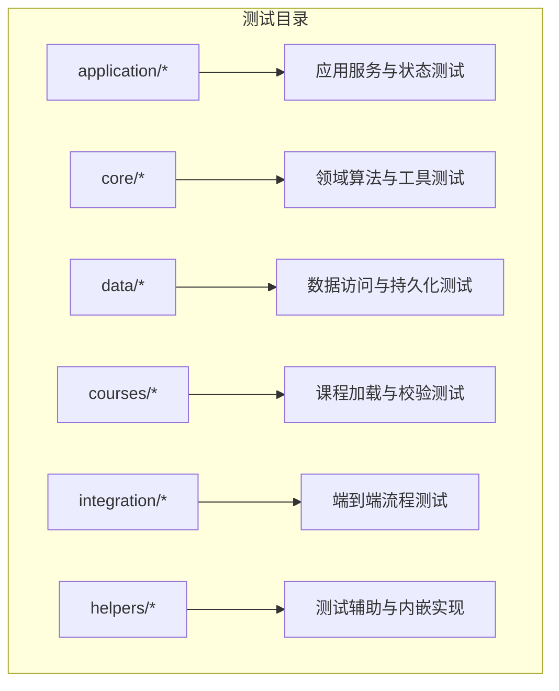
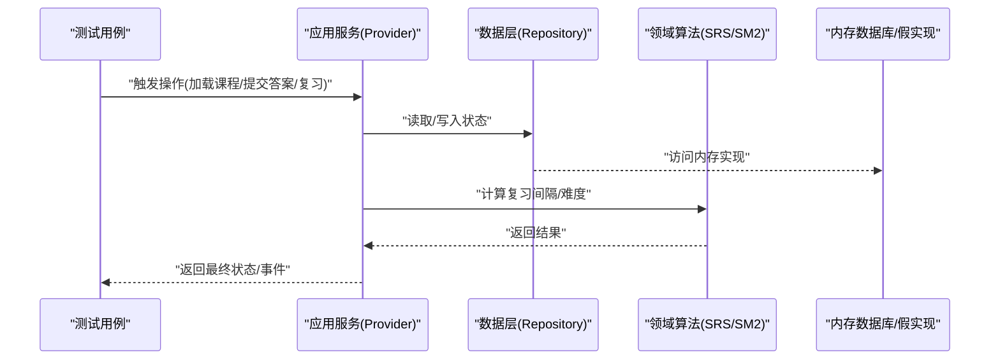
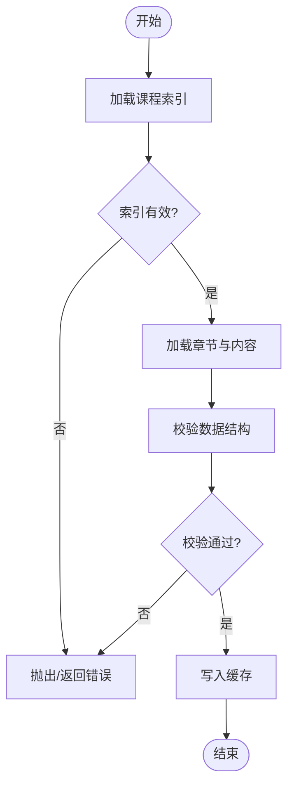
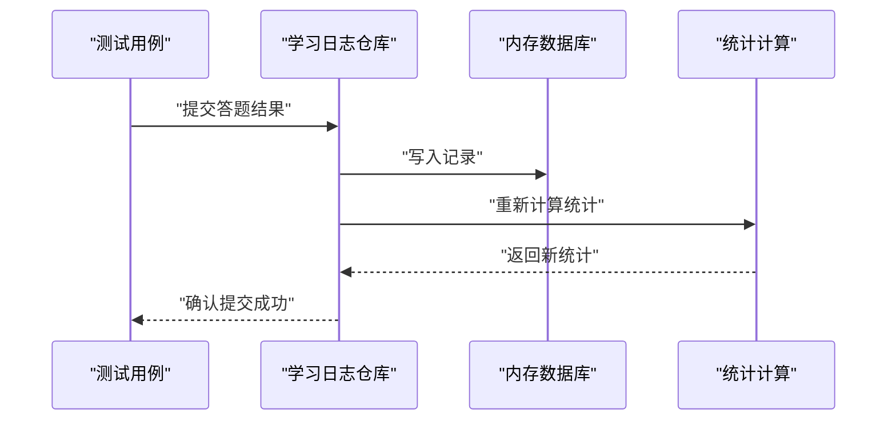
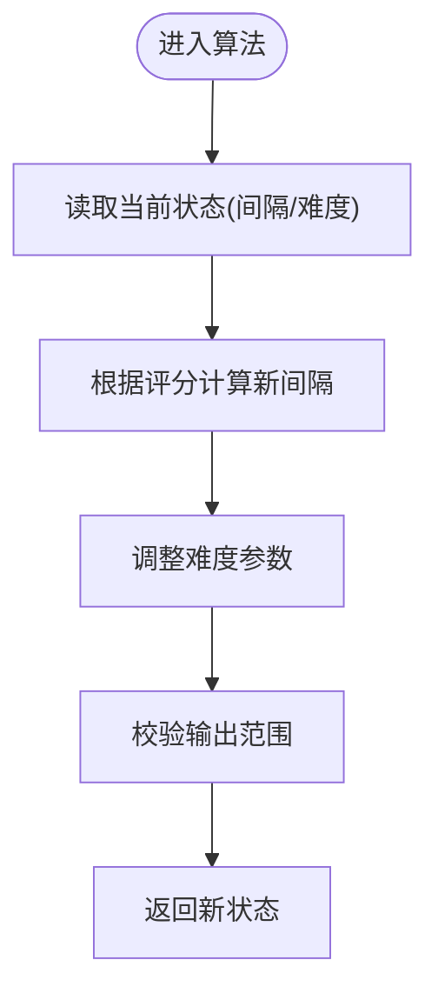
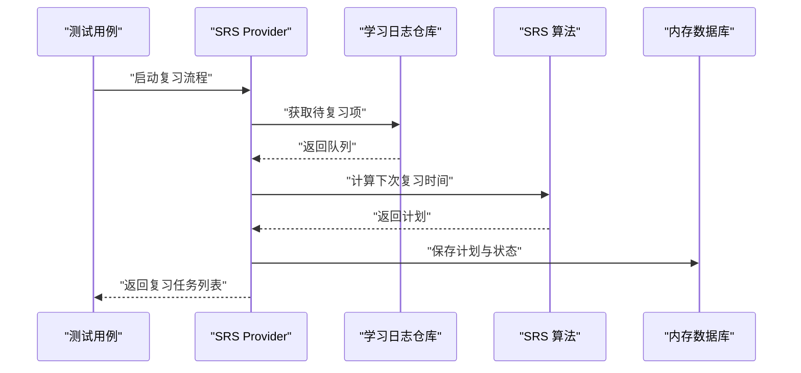
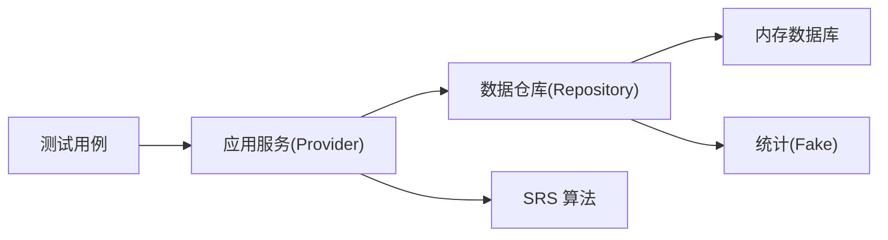

# 单元测试

<cite>
**本文引用的文件**   
- [pubspec.yaml](file://pubspec.yaml)
- [test/courses/course_loader_test.dart](file://test/courses/course_loader_test.dart)
- [test/application/srs_provider_test.dart](file://test/application/srs_provider_test.dart)
- [test/core/sm2_test.dart](file://test/core/sm2_test.dart)
- [test/data/study_log_repository_test.dart](file://test/data/study_log_repository_test.dart)
- [test/helpers/in_memory_course_db.dart](file://test/helpers/in_memory_course_db.dart)
- [test/helpers/fake_study_stats.dart](file://test/helpers/fake_study_stats.dart)
- [test/integration/srs_review_flow_test.dart](file://test/integration/srs_review_flow_test.dart)
</cite>

## 目录
1. [简介](#简介)
2. [项目结构](#项目结构)
3. [核心组件](#核心组件)
4. [架构总览](#架构总览)
5. [详细组件分析](#详细组件分析)
6. [依赖分析](#依赖分析)
7. [性能考虑](#性能考虑)
8. [故障排查指南](#故障排查指南)
9. [结论](#结论)
10. [附录](#附录)

## 简介
本文件面向 Varnamalaplus 项目的测试实践，聚焦于使用 Dart/Flutter 测试框架进行单元测试的配置与最佳实践。文档围绕业务逻辑、领域模型、数据层与服务层的测试方法展开，涵盖模拟对象（Mock）的创建与使用、异步代码测试策略、测试数据管理策略，并结合课程加载器、学习进度跟踪、SRS 算法等核心功能提供具体测试用例指引与参考路径。

## 项目结构
测试目录遵循 Flutter/Dart 标准约定，按功能域组织：
- application：应用服务与状态提供者（Provider）相关测试
- core：领域核心算法与工具类测试（如 SRS/SM2）
- data：数据访问层与持久化测试
- courses：课程内容加载与校验测试
- integration：端到端流程测试
- helpers：测试辅助与内嵌实现（内存数据库、假统计等）

[无图表来源，因为该图为概念性结构示意]

## 核心组件
- 课程加载器（Course Loader）：负责从资源或数据库加载课程结构与内容，测试需覆盖成功、失败、缓存命中、增量更新等场景。
- 学习进度跟踪（Study Progress）：记录用户答题结果、复习间隔、掌握度等，测试需关注状态一致性、并发写入与幂等性。
- SRS 算法（SM2/变体）：计算下次复习时间与难度调整，测试需覆盖边界条件、数值稳定性与回归验证。

上述组件在测试中通常通过以下手段隔离外部依赖：
- 使用内存数据库或内存仓库替代真实存储
- 注入 Mock/Stub/Fake 替代网络、文件系统、音频引擎等
- 使用同步断言与异步等待结合的方式处理 Future/Stream

**章节来源**
- [test/courses/course_loader_test.dart](file://test/courses/course_loader_test.dart)
- [test/application/srs_provider_test.dart](file://test/application/srs_provider_test.dart)
- [test/core/sm2_test.dart](file://test/core/sm2_test.dart)
- [test/data/study_log_repository_test.dart](file://test/data/study_log_repository_test.dart)
- [test/helpers/in_memory_course_db.dart](file://test/helpers/in_memory_course_db.dart)
- [test/helpers/fake_study_stats.dart](file://test/helpers/fake_study_stats.dart)

## 架构总览
下图展示了测试视角下的关键交互：应用服务（Provider）调用领域算法与数据层，测试通过注入替换实现以验证行为。

[无图表来源，因为该图为概念性交互示意]

## 详细组件分析

### 课程加载器测试（Course Loader）
- 目标：验证课程索引、章节、词汇、语法点等资源的正确加载与解析；错误路径（缺失文件、格式错误）的处理；缓存与增量更新。
- 关键点：
  - 使用内存文件或内存仓库模拟资源源
  - 断言加载后的数据结构完整性与一致性
  - 覆盖异常分支（IO 错误、JSON 解析失败）
- 参考路径：
  - [test/courses/course_loader_test.dart](file://test/courses/course_loader_test.dart)

[无图表来源，因为该图为概念性流程示意]

**章节来源**
- [test/courses/course_loader_test.dart](file://test/courses/course_loader_test.dart)

### 学习进度跟踪测试（Study Progress）
- 目标：确保答题结果、复习间隔、掌握度等状态的原子更新与一致性；并发写入不丢失；幂等提交。
- 关键点：
  - 使用内存仓库或事务封装保证一致性
  - 模拟多次提交与撤销，验证状态回滚与恢复
  - 断言统计指标（正确率、弱项词）计算准确
- 参考路径：
  - [test/data/study_log_repository_test.dart](file://test/data/study_log_repository_test.dart)
  - [test/helpers/fake_study_stats.dart](file://test/helpers/fake_study_stats.dart)

**章节来源**
- [test/data/study_log_repository_test.dart](file://test/data/study_log_repository_test.dart)
- [test/helpers/fake_study_stats.dart](file://test/helpers/fake_study_stats.dart)

### SRS 算法测试（SM2/变体）
- 目标：验证间隔计算、难度调整、复习计划生成的正确性与稳定性。
- 关键点：
  - 覆盖边界输入（首次学习、连续正确/错误、极端间隔）
  - 数值精度与舍入规则验证
  - 与历史版本对比回归测试
- 参考路径：
  - [test/core/sm2_test.dart](file://test/core/sm2_test.dart)
  - [test/application/srs_provider_test.dart](file://test/application/srs_provider_test.dart)

**章节来源**
- [test/core/sm2_test.dart](file://test/core/sm2_test.dart)
- [test/application/srs_provider_test.dart](file://test/application/srs_provider_test.dart)

### 集成流程测试（SRS 复习流）
- 目标：验证从课程加载到复习调度的完整链路，包括 Provider 状态变化、数据持久化与 UI 驱动的事件流。
- 关键点：
  - 使用内存数据库与假统计快速执行
  - 断言中间状态与最终状态的一致性
  - 覆盖异常中断与恢复路径
- 参考路径：
  - [test/integration/srs_review_flow_test.dart](file://test/integration/srs_review_flow_test.dart)

**章节来源**
- [test/integration/srs_review_flow_test.dart](file://test/integration/srs_review_flow_test.dart)

## 依赖分析
- 测试对真实依赖的替换：
  - 数据层：使用内存数据库实现（in-memory）替代 SQLite/文件存储
  - 统计模块：使用 Fake 实现替代复杂计算
  - 网络/音频：通过 Mock/Stub 隔离
- 耦合与内聚：
  - 应用服务与数据层通过接口解耦，便于注入替换
  - 领域算法纯函数化，易于单测覆盖
- 循环依赖：
  - 测试应避免引入循环依赖，保持单向依赖关系

[无图表来源，因为该图为概念性依赖示意]

**章节来源**
- [test/helpers/in_memory_course_db.dart](file://test/helpers/in_memory_course_db.dart)
- [test/helpers/fake_study_stats.dart](file://test/helpers/fake_study_stats.dart)

## 性能考虑
- 测试数据规模控制：避免加载过大数据集导致测试缓慢
- 并行执行：将独立测试分组并行运行，缩短 CI 时间
- 缓存策略：在测试中启用轻量缓存以减少重复 IO
- 基准测试：对 SRS 算法与统计计算添加基准测试，监控回归

[本节为通用指导，无需特定文件来源]

## 故障排查指南
- 常见问题：
  - 异步未等待：Future/Stream 未 await 导致断言提前执行
  - 状态污染：测试间共享状态未清理，导致偶发失败
  - Mock 配置不当：返回值与期望不一致
- 排查步骤：
  - 使用 print/log 定位执行顺序
  - 缩小测试范围，逐步隔离问题
  - 检查依赖注入是否正确替换
- 参考路径：
  - [test/application/srs_provider_test.dart](file://test/application/srs_provider_test.dart)
  - [test/data/study_log_repository_test.dart](file://test/data/study_log_repository_test.dart)

**章节来源**
- [test/application/srs_provider_test.dart](file://test/application/srs_provider_test.dart)
- [test/data/study_log_repository_test.dart](file://test/data/study_log_repository_test.dart)

## 结论
通过对课程加载器、学习进度跟踪与 SRS 算法的系统化测试，结合内存实现与 Mock 策略，能够有效保障核心功能的正确性与稳定性。建议持续完善测试覆盖率，强化边界与异常路径覆盖，并在 CI 中集成自动化测试与基准监控。

[本节为总结性内容，无需特定文件来源]

## 附录
- 测试配置与依赖：
  - 查看项目依赖与测试框架配置，确保 flutter_test、mockito、fake_async 等依赖可用
  - 参考路径：[pubspec.yaml](file://pubspec.yaml)

**章节来源**
- [pubspec.yaml](file://pubspec.yaml)