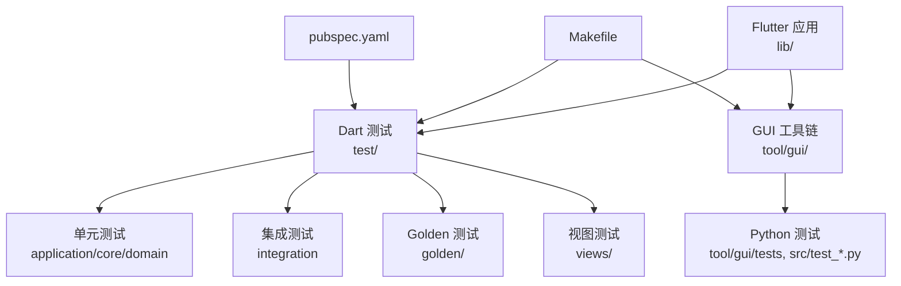
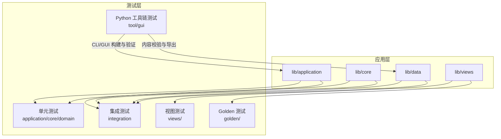
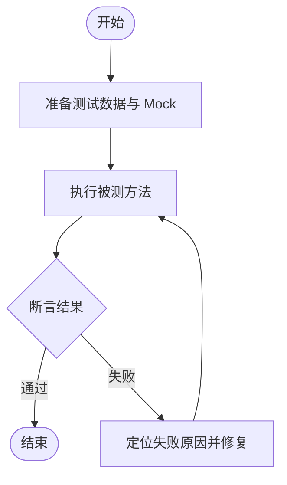
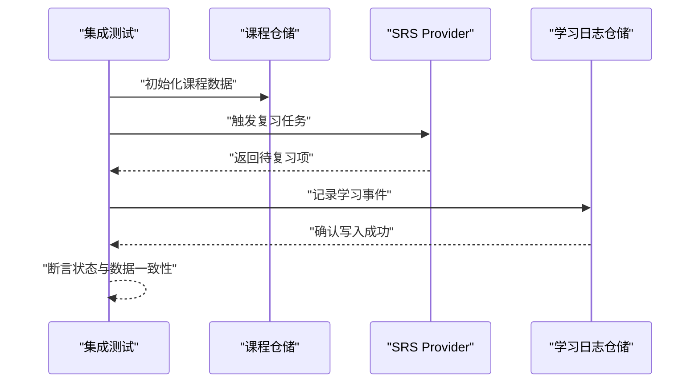
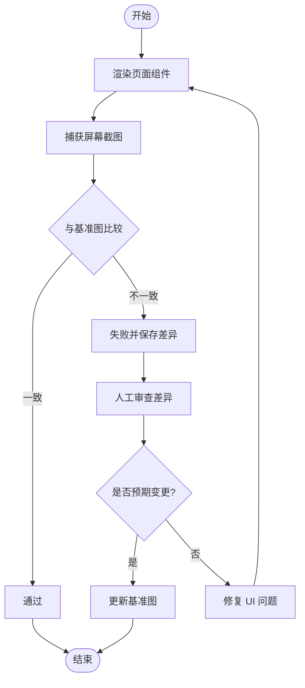
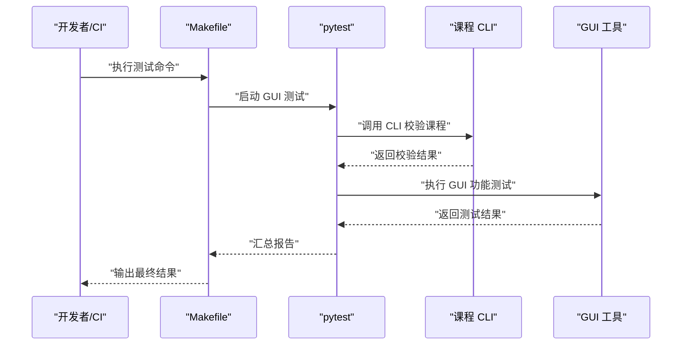
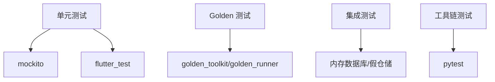

# 测试策略

<cite>
**本文引用的文件**   
- [pubspec.yaml](file://pubspec.yaml)
- [Makefile](file://Makefile)
- [test/BASELINE.md](file://test/BASELINE.md)
- [test/golden/dictionary_golden_test.dart](file://test/golden/dictionary_golden_test.dart)
- [test/golden/play_hub_golden_test.dart](file://test/golden/play_hub_golden_test.dart)
- [test/golden/settings_reminder_golden_test.dart](file://test/golden/settings_reminder_golden_test.dart)
- [test/golden/srs_review_golden_test.dart](file://test/golden/srs_review_golden_test.dart)
- [test/integration/lesson_flow_test.dart](file://test/integration/lesson_flow_test.dart)
- [test/integration/srs_review_flow_test.dart](file://test/integration/srs_review_flow_test.dart)
- [test/integration/dictionary_and_weak_words_test.dart](file://test/integration/dictionary_and_weak_words_test.dart)
- [test/application/lesson_viewmodel_flow_test.dart](file://test/application/lesson_viewmodel_flow_test.dart)
- [test/application/srs_provider_test.dart](file://test/application/srs_provider_test.dart)
- [test/data/course_repository_test.dart](file://test/data/course_repository_test.dart)
- [test/data/study_log_repository_test.dart](file://test/data/study_log_repository_test.dart)
- [test/helpers/in_memory_course_db.dart](file://test/helpers/in_memory_course_db.dart)
- [tool/gui/run_gui_tests.py](file://tool/gui/run_gui_tests.py)
- [tool/build_release_test.py](file://tool/build_release_test.py)
- [tool/course_cli_validate_test.py](file://tool/course_cli_validate_test.py)
- [tool/gui/src/test_*.py](file://tool/gui/src/test_*.py)
</cite>

## 目录
1. [简介](#简介)
2. [项目结构](#项目结构)
3. [核心组件](#核心组件)
4. [架构总览](#架构总览)
5. [详细组件分析](#详细组件分析)
6. [依赖分析](#依赖分析)
7. [性能考虑](#性能考虑)
8. [故障排查指南](#故障排查指南)
9. [结论](#结论)
10. [附录](#附录)

## 简介
本文件为 Varnamalaplus 项目的全面测试策略，覆盖单元测试、集成测试、UI 测试与端到端测试的实施方法；明确测试框架选择、测试数据管理与模拟对象策略；给出 Golden 测试、性能测试与兼容性测试的配置要点；说明持续集成流程、自动化执行与质量门禁；并提供编写最佳实践、调试技巧与常见问题解决方案。目标是帮助开发者以可维护、可扩展的方式保障应用质量。

## 项目结构
仓库采用 Flutter/Dart 为主的多端工程，测试代码集中在 test 目录，GUI 工具链测试位于 tool/gui/tests 与 tool/gui/src 下的 Python 测试脚本。关键结构与职责：
- test/: Dart 测试主目录，按 application、core、courses、data、domain、golden、integration、routing、service、views、helpers、tool 等子目录组织，对应业务分层与关注点分离。
- tool/gui: GUI 工具的 Python 测试与构建脚本，用于验证内容生成、导出与一致性。
- Makefile: 提供统一的测试与构建命令入口，便于本地与 CI 环境一致执行。
- pubspec.yaml: 声明 Flutter/Dart 依赖与测试相关包（如 flutter_test、mockito、golden_toolkit 等）。

**图表来源** 
- [pubspec.yaml](file://pubspec.yaml)
- [Makefile](file://Makefile)

**章节来源**
- [pubspec.yaml](file://pubspec.yaml)
- [Makefile](file://Makefile)

## 核心组件
- 测试框架与工具
  - Dart/Flutter: 使用 flutter_test 进行单元与 UI 测试；golden_toolkit 或 golden_runner 用于视觉回归；mockito 用于模拟依赖；假数据库与内存实现用于隔离外部系统。
  - Python: 使用 pytest 运行 GUI 工具链的测试脚本，确保内容生成与导出流程稳定。
- 测试分层
  - 单元测试: 针对领域逻辑、Provider/ViewModel、算法与工具函数，强调快速、确定性与无副作用。
  - 集成测试: 跨层验证课程加载、学习记录、SRS 复习流程、词典与弱词联动等。
  - UI/Golden 测试: 校验界面渲染与布局稳定性，防止视觉回归。
  - 端到端/工具链测试: 通过 CLI 与 GUI 工具验证内容构建、资源打包与发布产物一致性。
- 测试数据与模拟
  - 内存数据库与假 Provider: 在 data 与 helpers 中提供 in-memory 实现，避免真实存储与网络依赖。
  - 固定种子数据: 课程与词汇、语法点、音频等资源作为测试基线，保证可重复性。
  - 模拟外部服务: TTS、网络请求、文件系统访问均通过 mock/fake 替代。

**章节来源**
- [test/helpers/in_memory_course_db.dart](file://test/helpers/in_memory_course_db.dart)
- [test/application/srs_provider_test.dart](file://test/application/srs_provider_test.dart)
- [test/data/course_repository_test.dart](file://test/data/course_repository_test.dart)

## 架构总览
下图展示测试体系与应用的交互关系：应用层（lib）被各层测试覆盖，Golden 测试对比快照，集成测试串联多个子系统，工具链测试保障内容生产管线。

[此图为概念性架构图，不直接映射具体源码文件]

## 详细组件分析

### 单元测试策略
- 目标与范围
  - 覆盖领域模型、状态管理（Provider/ViewModel）、算法与工具函数。
  - 确保纯函数与无副作用逻辑的高覆盖率与确定性。
- 实施要点
  - 使用 mockito 对 Repository、Service、TTS 等外部依赖进行模拟。
  - 使用内存数据库与假 Provider 隔离持久化与网络。
  - 用例命名遵循 Given-When-Then 风格，断言清晰明确。
- 示例参考
  - SRS Provider 行为与边界条件：[test/application/srs_provider_test.dart](file://test/application/srs_provider_test.dart)
  - ViewModel 流程与状态流转：[test/application/lesson_viewmodel_flow_test.dart](file://test/application/lesson_viewmodel_flow_test.dart)
  - 领域模型与算法：core、domain 目录下各类 *_test.dart

**章节来源**
- [test/application/srs_provider_test.dart](file://test/application/srs_provider_test.dart)
- [test/application/lesson_viewmodel_flow_test.dart](file://test/application/lesson_viewmodel_flow_test.dart)

### 集成测试策略
- 目标与范围
  - 验证跨模块协作：课程加载、学习日志、SRS 复习流程、词典与弱词联动。
  - 确保数据流与状态同步正确。
- 实施要点
  - 使用内存数据库与固定种子数据，避免外部依赖。
  - 模拟异步操作与时间推进，确保时序相关逻辑稳定。
  - 用例覆盖关键路径与异常分支。
- 示例参考
  - 课程与学习日志仓储：[test/data/course_repository_test.dart](file://test/data/course_repository_test.dart)、[test/data/study_log_repository_test.dart](file://test/data/study_log_repository_test.dart)
  - 完整学习流程：[test/integration/lesson_flow_test.dart](file://test/integration/lesson_flow_test.dart)
  - SRS 复习流程：[test/integration/srs_review_flow_test.dart](file://test/integration/srs_review_flow_test.dart)
  - 词典与弱词联动：[test/integration/dictionary_and_weak_words_test.dart](file://test/integration/dictionary_and_weak_words_test.dart)

**章节来源**
- [test/data/course_repository_test.dart](file://test/data/course_repository_test.dart)
- [test/data/study_log_repository_test.dart](file://test/data/study_log_repository_test.dart)
- [test/integration/lesson_flow_test.dart](file://test/integration/lesson_flow_test.dart)
- [test/integration/srs_review_flow_test.dart](file://test/integration/srs_review_flow_test.dart)
- [test/integration/dictionary_and_weak_words_test.dart](file://test/integration/dictionary_and_weak_words_test.dart)

### UI 与 Golden 测试策略
- 目标与范围
  - 校验界面渲染、布局与文本显示，防止视觉回归。
  - 覆盖词典页、播放中心、设置提醒、SRS 复习页等关键视图。
- 实施要点
  - 使用 golden_toolkit/golden_runner 生成与对比基准图。
  - 固定字体、主题与设备参数，确保跨平台一致性。
  - 将失败截图归档到 failures 目录，便于审查差异。
- 示例参考
  - 词典页 Golden 测试：[test/golden/dictionary_golden_test.dart](file://test/golden/dictionary_golden_test.dart)
  - 播放中心 Golden 测试：[test/golden/play_hub_golden_test.dart](file://test/golden/play_hub_golden_test.dart)
  - 设置提醒 Golden 测试：[test/golden/settings_reminder_golden_test.dart](file://test/golden/settings_reminder_golden_test.dart)
  - SRS 复习页 Golden 测试：[test/golden/srs_review_golden_test.dart](file://test/golden/srs_review_golden_test.dart)
  - 基准基线文件：[test/BASELINE.md](file://test/BASELINE.md)

**章节来源**
- [test/golden/dictionary_golden_test.dart](file://test/golden/dictionary_golden_test.dart)
- [test/golden/play_hub_golden_test.dart](file://test/golden/play_hub_golden_test.dart)
- [test/golden/settings_reminder_golden_test.dart](file://test/golden/settings_reminder_golden_test.dart)
- [test/golden/srs_review_golden_test.dart](file://test/golden/srs_review_golden_test.dart)
- [test/BASELINE.md](file://test/BASELINE.md)

### 端到端与工具链测试策略
- 目标与范围
  - 验证 CLI 与 GUI 工具的内容生成、导出、校验与发布流程。
  - 确保构建产物与资源一致性，避免发布风险。
- 实施要点
  - 使用 Python pytest 运行 tool/gui 下的测试脚本。
  - 结合 Makefile 统一入口，支持本地与 CI 环境一致执行。
  - 输出结构化报告与产物，便于追溯与审计。
- 示例参考
  - GUI 测试运行器：[tool/gui/run_gui_tests.py](file://tool/gui/run_gui_tests.py)
  - 构建与发布测试：[tool/build_release_test.py](file://tool/build_release_test.py)
  - 课程 CLI 校验测试：[tool/course_cli_validate_test.py](file://tool/course_cli_validate_test.py)
  - GUI 工具内部测试：[tool/gui/src/test_*.py](file://tool/gui/src/test_*.py)

**章节来源**
- [tool/gui/run_gui_tests.py](file://tool/gui/run_gui_tests.py)
- [tool/build_release_test.py](file://tool/build_release_test.py)
- [tool/course_cli_validate_test.py](file://tool/course_cli_validate_test.py)
- [tool/gui/src/test_*.py](file://tool/gui/src/test_*.py)

## 依赖分析
- 测试依赖
  - Dart/Flutter: flutter_test、mockito、golden_toolkit/golden_runner、假数据库与内存实现。
  - Python: pytest、命令行与文件系统工具库。
- 耦合与内聚
  - 单元测试高内聚、低耦合，避免直接依赖外部系统。
  - 集成测试适度耦合仓储与服务，但通过内存实现隔离。
  - Golden 测试与视图组件强耦合，需严格管理基准图版本。
- 外部依赖
  - TTS、网络、文件系统通过 mock/fake 替代，确保测试稳定性。
  - 课程资源与音频作为静态资源，纳入版本控制以保证可重复性。

[此图为概念性依赖图，不直接映射具体源码文件]

**章节来源**
- [pubspec.yaml](file://pubspec.yaml)
- [Makefile](file://Makefile)

## 性能考虑
- 测试性能优化
  - 单元测试优先，保持快速执行；避免 IO 与网络调用。
  - 集成测试使用内存数据库与固定数据集，减少启动开销。
  - Golden 测试批量执行，缓存渲染上下文，避免重复初始化。
- 性能基准
  - 对 SRS 计算、课程加载、词典搜索等热点路径添加基准测试。
  - 监控 CPU、内存与渲染帧率，设定阈值与告警。
- 兼容性测试
  - 多平台（Android/iOS/Web/Desktop）并行执行，覆盖关键分辨率与主题。
  - 字体与国际化场景纳入 Golden 与集成测试。

[本节为通用指导，不直接分析具体文件]

## 故障排查指南
- 常见失败类型
  - Golden 测试差异：检查字体、主题、设备参数与基准图版本。
  - 集成测试不稳定：检查异步时序、随机数据与外部依赖模拟。
  - 工具链测试失败：检查 CLI 输入、资源路径与权限。
- 调试技巧
  - 启用详细日志与断点，逐步定位失败点。
  - 使用独立测试环境与数据隔离，避免污染。
  - 对比失败截图与基准图，标注差异区域。
- 回滚与修复
  - 若为预期变更，更新基准图并记录变更说明。
  - 若非预期变更，修复代码后重新运行测试集。

**章节来源**
- [test/BASELINE.md](file://test/BASELINE.md)
- [test/golden/dictionary_golden_test.dart](file://test/golden/dictionary_golden_test.dart)
- [tool/build_release_test.py](file://tool/build_release_test.py)

## 结论
Varnamalaplus 的测试策略以分层测试为核心，结合 Golden 测试与工具链测试，形成从单元到端到端的完整质量保障体系。通过明确的框架选择、数据管理与模拟策略，以及持续的 CI 集成与质量门禁，确保应用在功能、视觉与构建层面保持稳定与可靠。建议团队持续完善覆盖率与性能基准，强化兼容性测试，提升整体交付质量。

[本节为总结性内容，不直接分析具体文件]

## 附录
- 持续集成与质量门禁
  - 使用 Makefile 统一入口，在 CI 中执行全量测试集。
  - 设置覆盖率阈值与 Golden 差异门禁，阻止不合格提交。
  - 输出结构化报告与产物，便于追溯与审计。
- 最佳实践
  - 测试命名清晰，断言明确，避免隐式依赖。
  - 使用固定种子数据与内存实现，确保可重复性。
  - 定期清理过时测试与基准图，保持测试集精简高效。

[本节为通用指导，不直接分析具体文件]