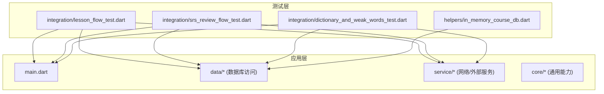
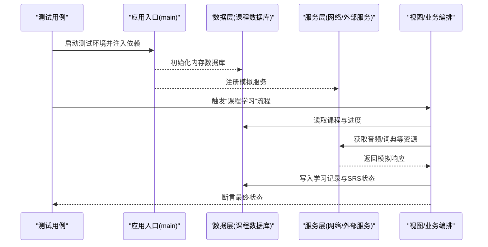
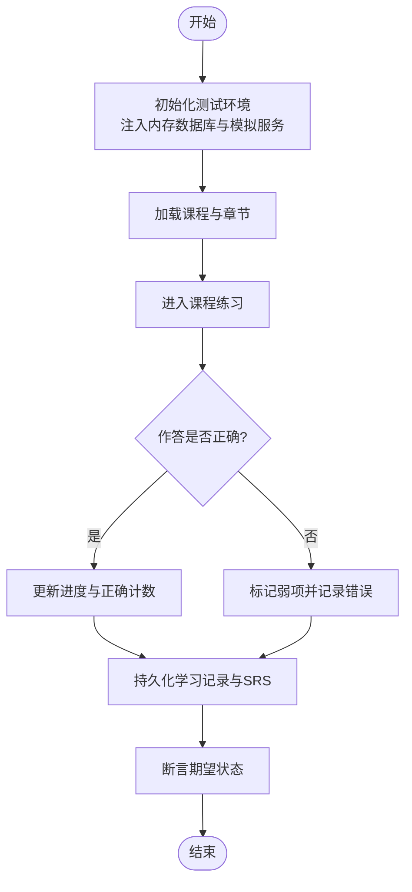
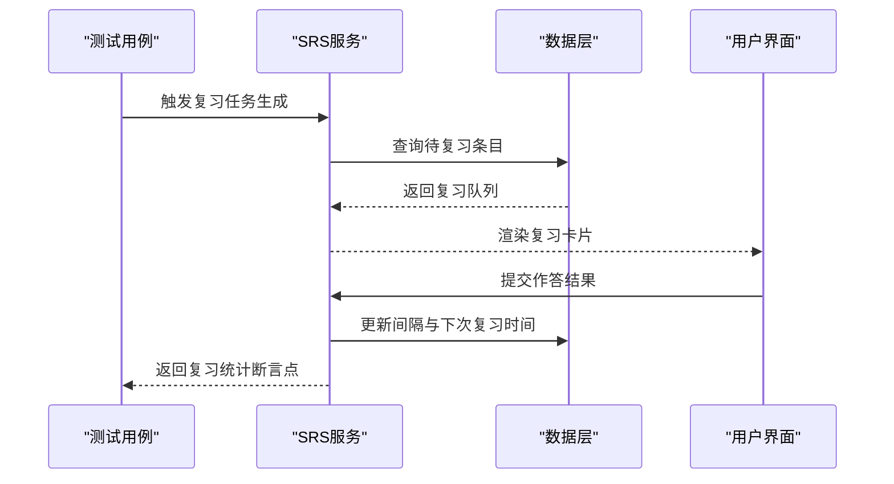
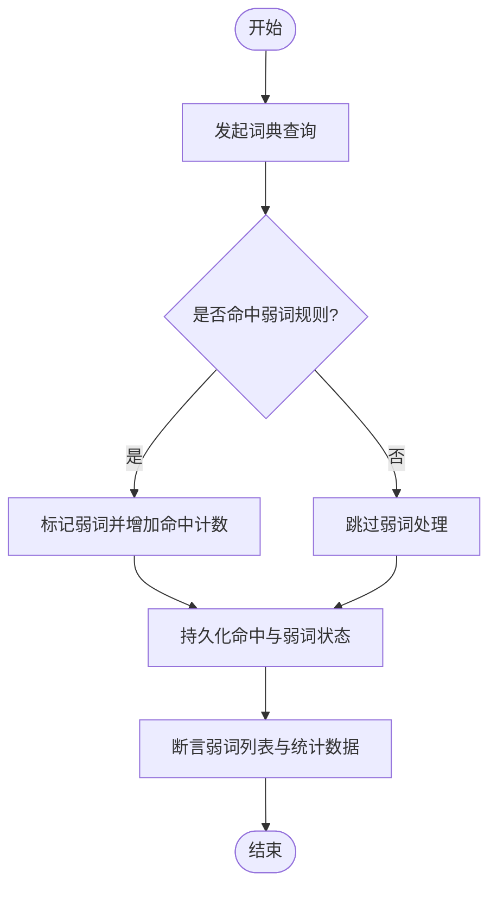
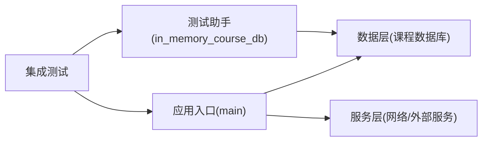

# 集成测试

<cite>
**本文档引用的文件**   
- [test/integration/lesson_flow_test.dart](file://test/integration/lesson_flow_test.dart)
- [test/integration/srs_review_flow_test.dart](file://test/integration/srs_review_flow_test.dart)
- [test/integration/dictionary_and_weak_words_test.dart](file://test/integration/dictionary_and_weak_words_test.dart)
- [test/helpers/in_memory_course_db.dart](file://test/helpers/in_memory_course_db.dart)
- [lib/main.dart](file://lib/main.dart)
- [pubspec.yaml](file://pubspec.yaml)
</cite>

## 目录
1. [简介](#简介)
2. [项目结构](#项目结构)
3. [核心组件](#核心组件)
4. [架构总览](#架构总览)
5. [详细组件分析](#详细组件分析)
6. [依赖关系分析](#依赖关系分析)
7. [性能考虑](#性能考虑)
8. [故障排查指南](#故障排查指南)
9. [结论](#结论)
10. [附录](#附录)

## 简介
本文件为 Varnamalaplus 项目的集成测试文档，聚焦于多组件交互的端到端验证，覆盖数据库操作、文件 I/O 和网络请求等关键路径。文档提供测试环境搭建、测试数据库配置与数据准备策略，并给出课程学习流程、复习流程和设置流程的完整测试覆盖方案。通过内存数据库与模拟服务，确保测试的稳定性和可重复性。

## 项目结构
Varnamalaplus 使用 Flutter/Dart 进行开发，测试代码位于 test 目录下，其中 integration 子目录包含端到端集成测试用例；helpers 目录提供测试辅助工具（如内存数据库实现）。应用入口在 lib/main.dart，依赖声明在 pubspec.yaml。

图表来源 
- [test/integration/lesson_flow_test.dart](file://test/integration/lesson_flow_test.dart)
- [test/integration/srs_review_flow_test.dart](file://test/integration/srs_review_flow_test.dart)
- [test/integration/dictionary_and_weak_words_test.dart](file://test/integration/dictionary_and_weak_words_test.dart)
- [test/helpers/in_memory_course_db.dart](file://test/helpers/in_memory_course_db.dart)
- [lib/main.dart](file://lib/main.dart)

章节来源
- [lib/main.dart](file://lib/main.dart)
- [pubspec.yaml](file://pubspec.yaml)

## 核心组件
- 集成测试套件
  - 课程学习流程：验证从课程加载到练习完成的全链路，包括状态更新与持久化。
  - SRS 复习流程：验证间隔重复算法触发、复习任务生成与结果回写。
  - 词典与弱词联动：验证查询、命中统计与弱词列表更新。
- 测试基础设施
  - 内存数据库：用于替代真实 SQLite，保证隔离与快速清理。
  - 模拟服务：对网络请求与外部资源进行 Mock，避免外部依赖不稳定。
- 应用入口与依赖注入
  - main.dart 负责初始化应用上下文与依赖注入容器，测试中通过替换容器中的服务实现来切换为测试版本。

章节来源
- [test/integration/lesson_flow_test.dart](file://test/integration/lesson_flow_test.dart)
- [test/integration/srs_review_flow_test.dart](file://test/integration/srs_review_flow_test.dart)
- [test/integration/dictionary_and_weak_words_test.dart](file://test/integration/dictionary_and_weak_words_test.dart)
- [test/helpers/in_memory_course_db.dart](file://test/helpers/in_memory_course_db.dart)
- [lib/main.dart](file://lib/main.dart)

## 架构总览
下图展示了集成测试如何驱动应用层各组件协同工作，并通过内存数据库与模拟服务屏蔽外部依赖。

图表来源 
- [test/integration/lesson_flow_test.dart](file://test/integration/lesson_flow_test.dart)
- [test/integration/srs_review_flow_test.dart](file://test/integration/srs_review_flow_test.dart)
- [test/integration/dictionary_and_weak_words_test.dart](file://test/integration/dictionary_and_weak_words_test.dart)
- [test/helpers/in_memory_course_db.dart](file://test/helpers/in_memory_course_db.dart)
- [lib/main.dart](file://lib/main.dart)

## 详细组件分析

### 课程学习流程集成测试
该测试覆盖从课程选择、内容加载、答题交互到结果持久化的完整链路。重点验证：
- 课程数据加载与缓存
- 用户作答与进度推进
- 学习日志与 SRS 状态更新
- 异常路径（如资源缺失）下的降级行为

图表来源 
- [test/integration/lesson_flow_test.dart](file://test/integration/lesson_flow_test.dart)

章节来源
- [test/integration/lesson_flow_test.dart](file://test/integration/lesson_flow_test.dart)

### 复习流程集成测试（SRS）
该测试验证间隔重复算法在集成环境中的行为，包括：
- 复习队列生成与优先级排序
- 复习作答后的难度与间隔调整
- 复习结果持久化与统计指标一致性

图表来源 
- [test/integration/srs_review_flow_test.dart](file://test/integration/srs_review_flow_test.dart)

章节来源
- [test/integration/srs_review_flow_test.dart](file://test/integration/srs_review_flow_test.dart)

### 词典与弱词联动集成测试
该测试覆盖词典查询、命中统计与弱词列表更新的联动逻辑，确保：
- 查询接口被正确调用且结果可用
- 命中次数与弱词标签同步更新
- 弱词导出或展示的数据一致性

图表来源 
- [test/integration/dictionary_and_weak_words_test.dart](file://test/integration/dictionary_and_weak_words_test.dart)

章节来源
- [test/integration/dictionary_and_weak_words_test.dart](file://test/integration/dictionary_and_weak_words_test.dart)

### 内存数据库与数据准备
- 内存数据库：通过 helpers/in_memory_course_db.dart 提供轻量级、可重置的数据库实现，适合集成测试的快速迭代。
- 数据准备策略：
  - 每个测试用例开始前创建独立数据库实例，避免交叉污染。
  - 预置最小数据集（课程、词汇、语法点），确保流程可运行。
  - 使用幂等脚本或工厂方法生成稳定数据，便于复现问题。

章节来源
- [test/helpers/in_memory_course_db.dart](file://test/helpers/in_memory_course_db.dart)

### 模拟服务与网络请求
- 模拟策略：
  - 对网络请求进行拦截与返回固定响应，避免外部服务波动。
  - 对音频、图片等资源使用本地或内存资源，减少 I/O 开销。
- 适用场景：
  - 词典查询、音频播放、远程配置拉取等。
  - 失败与超时场景的健壮性验证。

章节来源
- [test/integration/lesson_flow_test.dart](file://test/integration/lesson_flow_test.dart)
- [test/integration/srs_review_flow_test.dart](file://test/integration/srs_review_flow_test.dart)
- [test/integration/dictionary_and_weak_words_test.dart](file://test/integration/dictionary_and_weak_words_test.dart)

## 依赖关系分析
集成测试依赖应用入口与数据/服务层。通过依赖注入替换生产实现，使测试具备可控性与可重复性。

图表来源 
- [lib/main.dart](file://lib/main.dart)
- [test/helpers/in_memory_course_db.dart](file://test/helpers/in_memory_course_db.dart)
- [test/integration/lesson_flow_test.dart](file://test/integration/lesson_flow_test.dart)
- [test/integration/srs_review_flow_test.dart](file://test/integration/srs_review_flow_test.dart)
- [test/integration/dictionary_and_weak_words_test.dart](file://test/integration/dictionary_and_weak_words_test.dart)

章节来源
- [lib/main.dart](file://lib/main.dart)
- [pubspec.yaml](file://pubspec.yaml)

## 性能考虑
- 使用内存数据库显著降低 I/O 开销，提升测试执行速度。
- 模拟网络请求避免真实延迟，提高稳定性。
- 合理拆分测试用例，避免单用例过长导致执行缓慢。
- 对大数据集采用分页或抽样策略，平衡覆盖率与性能。

## 故障排查指南
- 常见问题
  - 数据库未初始化或连接失败：检查内存数据库实例是否在测试前创建并正确注入。
  - 模拟服务未生效：确认拦截器或依赖替换在测试上下文中生效。
  - 资源路径错误：核对音频、图片等资源的相对路径与打包配置。
- 定位步骤
  - 启用详细日志输出，观察关键节点的状态变化。
  - 逐步缩小范围，先验证数据层，再验证服务层，最后验证 UI 编排。
  - 使用最小数据集复现问题，排除数据干扰。

章节来源
- [test/integration/lesson_flow_test.dart](file://test/integration/lesson_flow_test.dart)
- [test/integration/srs_review_flow_test.dart](file://test/integration/srs_review_flow_test.dart)
- [test/integration/dictionary_and_weak_words_test.dart](file://test/integration/dictionary_and_weak_words_test.dart)

## 结论
通过内存数据库与模拟服务的组合，Varnamalaplus 的集成测试能够稳定地覆盖课程学习、复习与词典联动等核心流程。建议在持续集成环境中定期运行这些测试，以确保多组件交互的正确性与鲁棒性。

## 附录
- 运行方式
  - 使用 Flutter 测试命令执行集成测试，确保测试环境与依赖已安装。
  - 可通过参数控制测试并行度与日志级别。
- 扩展建议
  - 增加更多边界条件与异常路径的测试用例。
  - 引入性能基准测试，监控回归趋势。