# 内容编辑器

<cite>
**本文引用的文件**   
- [README.md](file://README.md)
- [CLAUDE.md](file://CLAUDE.md)
- [Makefile](file://Makefile)
- [tool/gui/README.md](file://tool/gui/README.md)
- [tool/gui/build_gui.py](file://tool/gui/build_gui.py)
- [tool/gui/pyproject.toml](file://tool/gui/pyproject.toml)
- [tool/gui/varnamala_gui.spec](file://tool/gui/varnamala_gui.spec)
- [tool/gui/src/main.py](file://tool/gui/src/main.py)
- [tool/gui/src/app.py](file://tool/gui/src/app.py)
- [tool/gui/src/views/course_editor_view.py](file://tool/gui/src/views/course_editor_view.py)
- [tool/gui/src/views/lesson_editor_view.py](file://tool/gui/src/views/lesson_editor_view.py)
- [tool/gui/src/controllers/course_controller.py](file://tool/gui/src/controllers/course_controller.py)
- [tool/gui/src/controllers/lesson_controller.py](file://tool/gui/src/controllers/lesson_controller.py)
- [tool/gui/src/models/course_model.py](file://tool/gui/src/models/course_model.py)
- [tool/gui/src/models/lesson_model.py](file://tool/gui/src/models/lesson_model.py)
- [tool/gui/src/services/file_service.py](file://tool/gui/src/services/file_service.py)
- [tool/gui/src/services/git_service.py](file://tool/gui/src/services/git_service.py)
- [tool/gui/src/services/template_service.py](file://tool/gui/src/services/template_service.py)
- [tool/gui/src/services/import_export_service.py](file://tool/gui/src/services/import_export_service.py)
- [tool/gui/src/services/collaboration_service.py](file://tool/gui/src/services/collaboration_service.py)
- [tool/gui/src/utils/keymap.py](file://tool/gui/src/utils/keymap.py)
- [tool/gui/src/utils/config.py](file://tool/gui/src/utils/config.py)
- [tool/gui/src/plugins/loader.py](file://tool/gui/src/plugins/loader.py)
- [tool/gui/tests/test_course_editor_view.py](file://tool/gui/tests/test_course_editor_view.py)
- [tool/gui/tests/test_git_service.py](file://tool/gui/tests/test_git_service.py)
- [tool/gui/tests/test_template_service.py](file://tool/gui/tests/test_template_service.py)
- [tool/gui/tests/test_import_export_service.py](file://tool/gui/tests/test_import_export_service.py)
- [tool/gui/tests/test_collaboration_service.py](file://tool/gui/tests/test_collaboration_service.py)
- [tool/gui/tests/test_keymap.py](file://tool/gui/tests/test_keymap.py)
- [tool/gui/tests/test_config.py](file://tool/gui/tests/test_config.py)
- [tool/gui/tests/test_loader.py](file://tool/gui/tests/test_loader.py)
- [docs/authoring/gui-course-editor.md](file://docs/authoring/gui-course-editor.md)
- [docs/decisions/0023-git-branch-and-conflict-resolution.md](file://docs/decisions/0023-git-branch-and-conflict-resolution.md)
- [docs/decisions/0024-team-collaboration-enhancements.md](file://docs/decisions/0024-team-collaboration-enhancements.md)
- [docs/decisions/0025-textbook-git-integration.md](file://docs/decisions/0025-textbook-git-integration.md)
- [assets/courses/turkish/index.json](file://assets/courses/turkish/index.json)
- [assets/courses/turkish/vocab.json](file://assets/courses/turkish/vocab.json)
- [assets/courses/turkish/grammar_points.json](file://assets/courses/turkish/grammar_points.json)
- [assets/courses/turkish/expressions.json](file://assets/courses/turkish/expressions.json)
</cite>

## 目录
1. [简介](#简介)
2. [项目结构](#项目结构)
3. [核心组件](#核心组件)
4. [架构总览](#架构总览)
5. [详细组件分析](#详细组件分析)
6. [依赖关系分析](#依赖关系分析)
7. [性能考量](#性能考量)
8. [故障排查指南](#故障排查指南)
9. [结论](#结论)
10. [附录](#附录)

## 简介
本文件面向“内容编辑器”（GUI 课程与课时编辑器）的使用者与开发者，系统性阐述其功能特性、界面布局、操作逻辑与扩展机制。重点覆盖：
- 课程内容的可视化编辑与实时预览
- 版本控制集成（Git 分支、冲突检测与合并策略）
- 模板系统、批量操作与导入导出
- 协作开发与冲突解决流程
- 快捷键、自定义配置与插件扩展
- 使用指南、最佳实践与常见问题

## 项目结构
内容编辑器位于 tool/gui 子工程中，采用 Python + GUI 框架实现，配合服务层与模型层解耦业务逻辑，并通过工具脚本完成构建与打包。

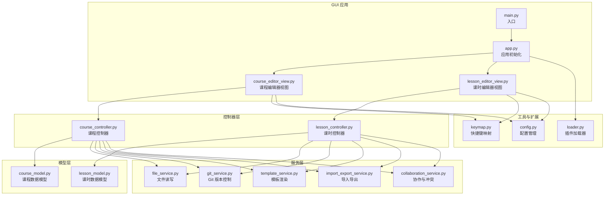

图表来源
- [tool/gui/src/main.py](file://tool/gui/src/main.py)
- [tool/gui/src/app.py](file://tool/gui/src/app.py)
- [tool/gui/src/views/course_editor_view.py](file://tool/gui/src/views/course_editor_view.py)
- [tool/gui/src/views/lesson_editor_view.py](file://tool/gui/src/views/lesson_editor_view.py)
- [tool/gui/src/controllers/course_controller.py](file://tool/gui/src/controllers/course_controller.py)
- [tool/gui/src/controllers/lesson_controller.py](file://tool/gui/src/controllers/lesson_controller.py)
- [tool/gui/src/models/course_model.py](file://tool/gui/src/models/course_model.py)
- [tool/gui/src/models/lesson_model.py](file://tool/gui/src/models/lesson_model.py)
- [tool/gui/src/services/file_service.py](file://tool/gui/src/services/file_service.py)
- [tool/gui/src/services/git_service.py](file://tool/gui/src/services/git_service.py)
- [tool/gui/src/services/template_service.py](file://tool/gui/src/services/template_service.py)
- [tool/gui/src/services/import_export_service.py](file://tool/gui/src/services/import_export_service.py)
- [tool/gui/src/services/collaboration_service.py](file://tool/gui/src/services/collaboration_service.py)
- [tool/gui/src/utils/keymap.py](file://tool/gui/src/utils/keymap.py)
- [tool/gui/src/utils/config.py](file://tool/gui/src/utils/config.py)
- [tool/gui/src/plugins/loader.py](file://tool/gui/src/plugins/loader.py)

章节来源
- [tool/gui/README.md](file://tool/gui/README.md)
- [tool/gui/build_gui.py](file://tool/gui/build_gui.py)
- [tool/gui/pyproject.toml](file://tool/gui/pyproject.toml)
- [tool/gui/varnamala_gui.spec](file://tool/gui/varnamala_gui.spec)

## 核心组件
- 入口与应用初始化
  - main.py：程序启动、命令行参数解析与环境准备
  - app.py：应用生命周期管理、主题与窗口初始化、插件加载
- 视图层
  - course_editor_view.py：课程树、元数据编辑、批量操作面板、预览面板
  - lesson_editor_view.py：课时内容编辑、题型模板选择、媒体资源插入、实时预览
- 控制器层
  - course_controller.py：课程 CRUD、索引更新、校验与保存
  - lesson_controller.py：课时变更、草稿与发布、预览生成
- 模型层
  - course_model.py：课程结构、章节与课时映射、校验规则
  - lesson_model.py：课时数据结构、题型字段、媒体引用
- 服务层
  - file_service.py：JSON/YAML 读写、路径规范化、备份与恢复
  - git_service.py：分支切换、提交、拉取/推送、冲突检测与合并
  - template_service.py：模板渲染、变量替换、批量生成
  - import_export_service.py：多格式导入导出、映射表、校验报告
  - collaboration_service.py：多人协作状态、差异对比、合并策略
- 工具与扩展
  - keymap.py：快捷键注册、组合键冲突检测
  - config.py：用户配置、默认值、持久化
  - loader.py：插件发现、生命周期钩子、事件总线

章节来源
- [tool/gui/src/main.py](file://tool/gui/src/main.py)
- [tool/gui/src/app.py](file://tool/gui/src/app.py)
- [tool/gui/src/views/course_editor_view.py](file://tool/gui/src/views/course_editor_view.py)
- [tool/gui/src/views/lesson_editor_view.py](file://tool/gui/src/views/lesson_editor_view.py)
- [tool/gui/src/controllers/course_controller.py](file://tool/gui/src/controllers/course_controller.py)
- [tool/gui/src/controllers/lesson_controller.py](file://tool/gui/src/controllers/lesson_controller.py)
- [tool/gui/src/models/course_model.py](file://tool/gui/src/models/course_model.py)
- [tool/gui/src/models/lesson_model.py](file://tool/gui/src/models/lesson_model.py)
- [tool/gui/src/services/file_service.py](file://tool/gui/src/services/file_service.py)
- [tool/gui/src/services/git_service.py](file://tool/gui/src/services/git_service.py)
- [tool/gui/src/services/template_service.py](file://tool/gui/src/services/template_service.py)
- [tool/gui/src/services/import_export_service.py](file://tool/gui/src/services/import_export_service.py)
- [tool/gui/src/services/collaboration_service.py](file://tool/gui/src/services/collaboration_service.py)
- [tool/gui/src/utils/keymap.py](file://tool/gui/src/utils/keymap.py)
- [tool/gui/src/utils/config.py](file://tool/gui/src/utils/config.py)
- [tool/gui/src/plugins/loader.py](file://tool/gui/src/plugins/loader.py)

## 架构总览
编辑器采用 MVC 分层与插件化架构，视图通过控制器调用服务，服务访问文件系统与 Git，模型负责数据结构与校验。插件可注入新视图、命令或处理器。

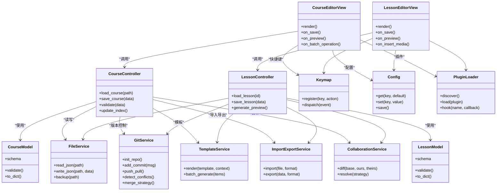

图表来源
- [tool/gui/src/views/course_editor_view.py](file://tool/gui/src/views/course_editor_view.py)
- [tool/gui/src/views/lesson_editor_view.py](file://tool/gui/src/views/lesson_editor_view.py)
- [tool/gui/src/controllers/course_controller.py](file://tool/gui/src/controllers/course_controller.py)
- [tool/gui/src/controllers/lesson_controller.py](file://tool/gui/src/controllers/lesson_controller.py)
- [tool/gui/src/models/course_model.py](file://tool/gui/src/models/course_model.py)
- [tool/gui/src/models/lesson_model.py](file://tool/gui/src/models/lesson_model.py)
- [tool/gui/src/services/file_service.py](file://tool/gui/src/services/file_service.py)
- [tool/gui/src/services/git_service.py](file://tool/gui/src/services/git_service.py)
- [tool/gui/src/services/template_service.py](file://tool/gui/src/services/template_service.py)
- [tool/gui/src/services/import_export_service.py](file://tool/gui/src/services/import_export_service.py)
- [tool/gui/src/services/collaboration_service.py](file://tool/gui/src/services/collaboration_service.py)
- [tool/gui/src/utils/keymap.py](file://tool/gui/src/utils/keymap.py)
- [tool/gui/src/utils/config.py](file://tool/gui/src/utils/config.py)
- [tool/gui/src/plugins/loader.py](file://tool/gui/src/plugins/loader.py)

## 详细组件分析

### 课程编辑器视图（Course Editor View）
- 功能要点
  - 课程树导航、章节与课时增删改
  - 元数据编辑（标题、描述、语言、级别）
  - 批量操作（批量修改标签、批量移动、批量删除）
  - 实时预览（HTML/PDF 预览开关）
  - 快捷键支持（保存、撤销、重做、搜索）
- 交互流程
  - 用户操作触发控制器方法
  - 控制器调用模型校验与服务层持久化
  - 预览由模板服务渲染并返回结果
  - Git 自动记录变更并提交

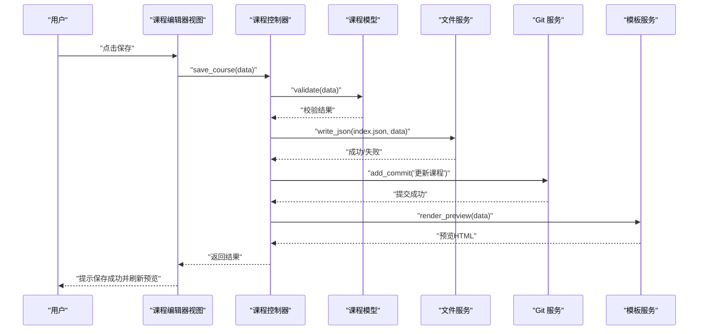

图表来源
- [tool/gui/src/views/course_editor_view.py](file://tool/gui/src/views/course_editor_view.py)
- [tool/gui/src/controllers/course_controller.py](file://tool/gui/src/controllers/course_controller.py)
- [tool/gui/src/models/course_model.py](file://tool/gui/src/models/course_model.py)
- [tool/gui/src/services/file_service.py](file://tool/gui/src/services/file_service.py)
- [tool/gui/src/services/git_service.py](file://tool/gui/src/services/git_service.py)
- [tool/gui/src/services/template_service.py](file://tool/gui/src/services/template_service.py)

章节来源
- [tool/gui/src/views/course_editor_view.py](file://tool/gui/src/views/course_editor_view.py)
- [tool/gui/src/controllers/course_controller.py](file://tool/gui/src/controllers/course_controller.py)
- [tool/gui/src/models/course_model.py](file://tool/gui/src/models/course_model.py)
- [tool/gui/src/services/file_service.py](file://tool/gui/src/services/file_service.py)
- [tool/gui/src/services/git_service.py](file://tool/gui/src/services/git_service.py)
- [tool/gui/src/services/template_service.py](file://tool/gui/src/services/template_service.py)
- [tool/gui/tests/test_course_editor_view.py](file://tool/gui/tests/test_course_editor_view.py)

### 课时编辑器视图（Lesson Editor View）
- 功能要点
  - 课时内容编辑（文本、图片、音频、视频）
  - 题型模板选择（填空、选择、听力、口语）
  - 实时预览（富文本渲染、媒体播放）
  - 草稿与发布（本地草稿、远程同步）
- 交互流程
  - 编辑变更触发增量保存
  - 预览由模板服务按题型渲染
  - 媒体资源上传至指定目录并更新引用

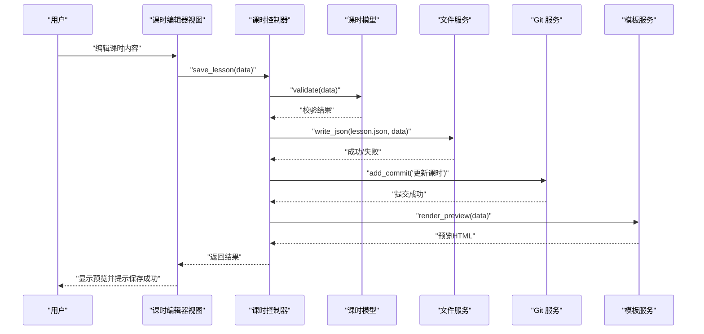

图表来源
- [tool/gui/src/views/lesson_editor_view.py](file://tool/gui/src/views/lesson_editor_view.py)
- [tool/gui/src/controllers/lesson_controller.py](file://tool/gui/src/controllers/lesson_controller.py)
- [tool/gui/src/models/lesson_model.py](file://tool/gui/src/models/lesson_model.py)
- [tool/gui/src/services/file_service.py](file://tool/gui/src/services/file_service.py)
- [tool/gui/src/services/git_service.py](file://tool/gui/src/services/git_service.py)
- [tool/gui/src/services/template_service.py](file://tool/gui/src/services/template_service.py)

章节来源
- [tool/gui/src/views/lesson_editor_view.py](file://tool/gui/src/views/lesson_editor_view.py)
- [tool/gui/src/controllers/lesson_controller.py](file://tool/gui/src/controllers/lesson_controller.py)
- [tool/gui/src/models/lesson_model.py](file://tool/gui/src/models/lesson_model.py)
- [tool/gui/src/services/file_service.py](file://tool/gui/src/services/file_service.py)
- [tool/gui/src/services/git_service.py](file://tool/gui/src/services/git_service.py)
- [tool/gui/src/services/template_service.py](file://tool/gui/src/services/template_service.py)
- [tool/gui/tests/test_course_editor_view.py](file://tool/gui/tests/test_course_editor_view.py)

### 模板系统（Template Service）
- 能力说明
  - 支持多种题型模板与课程页面模板
  - 变量替换、条件渲染、循环列表
  - 批量生成（按词汇表、语法点生成课时）
- 处理流程

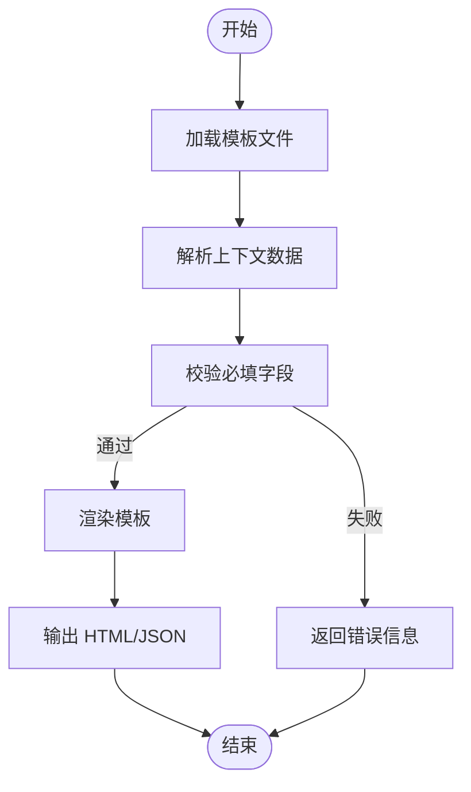

图表来源
- [tool/gui/src/services/template_service.py](file://tool/gui/src/services/template_service.py)
- [tool/gui/src/models/course_model.py](file://tool/gui/src/models/course_model.py)
- [tool/gui/src/models/lesson_model.py](file://tool/gui/src/models/lesson_model.py)

章节来源
- [tool/gui/src/services/template_service.py](file://tool/gui/src/services/template_service.py)
- [tool/gui/tests/test_template_service.py](file://tool/gui/tests/test_template_service.py)

### 导入导出（Import/Export Service）
- 支持格式
  - JSON、CSV、Anki Deck、自定义映射
- 功能特性
  - 字段映射、类型转换、缺失字段处理
  - 批量导入进度与错误报告
  - 导出为课程包（含媒体资源）

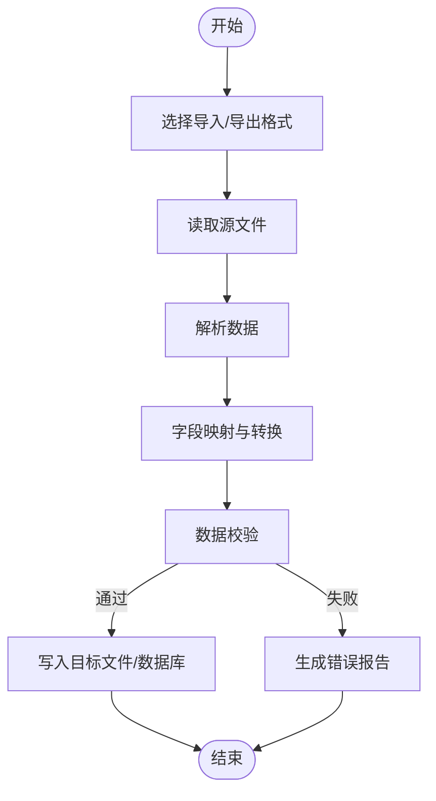

图表来源
- [tool/gui/src/services/import_export_service.py](file://tool/gui/src/services/import_export_service.py)

章节来源
- [tool/gui/src/services/import_export_service.py](file://tool/gui/src/services/import_export_service.py)
- [tool/gui/tests/test_import_export_service.py](file://tool/gui/tests/test_import_export_service.py)

### 版本控制集成（Git Service）
- 能力说明
  - 仓库初始化、分支管理、提交历史
  - 拉取/推送、冲突检测与合并策略
  - 与编辑器操作联动（自动提交、快照）
- 冲突解决流程

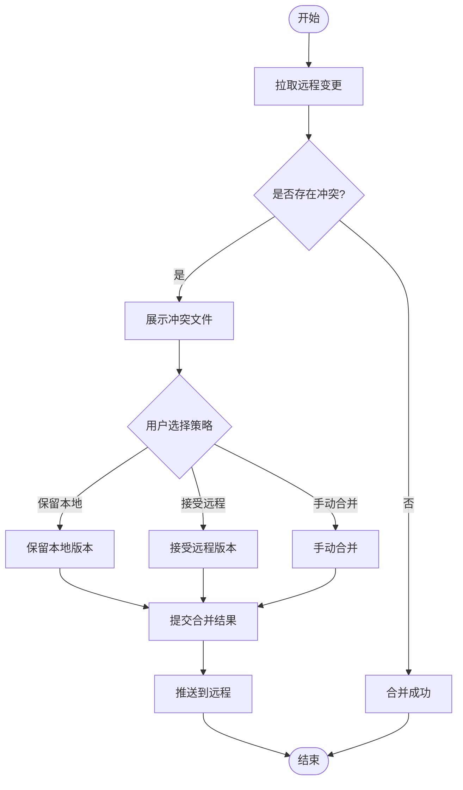

图表来源
- [tool/gui/src/services/git_service.py](file://tool/gui/src/services/git_service.py)
- [docs/decisions/0023-git-branch-and-conflict-resolution.md](file://docs/decisions/0023-git-branch-and-conflict-resolution.md)

章节来源
- [tool/gui/src/services/git_service.py](file://tool/gui/src/services/git_service.py)
- [tool/gui/tests/test_git_service.py](file://tool/gui/tests/test_git_service.py)
- [docs/decisions/0023-git-branch-and-conflict-resolution.md](file://docs/decisions/0023-git-branch-and-conflict-resolution.md)

### 协作开发（Collaboration Service）
- 能力说明
  - 多人编辑状态同步、差异对比
  - 合并策略（优先本地、优先远程、三方合并）
  - 协作日志与审计
- 工作流

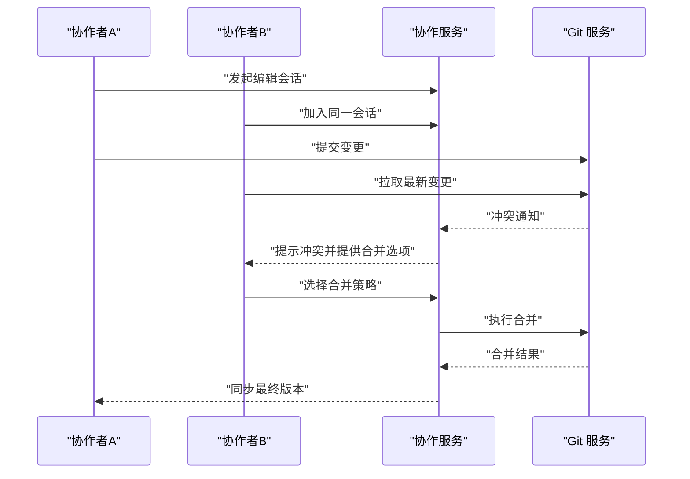

图表来源
- [tool/gui/src/services/collaboration_service.py](file://tool/gui/src/services/collaboration_service.py)
- [docs/decisions/0024-team-collaboration-enhancements.md](file://docs/decisions/0024-team-collaboration-enhancements.md)

章节来源
- [tool/gui/src/services/collaboration_service.py](file://tool/gui/src/services/collaboration_service.py)
- [tool/gui/tests/test_collaboration_service.py](file://tool/gui/tests/test_collaboration_service.py)
- [docs/decisions/0024-team-collaboration-enhancements.md](file://docs/decisions/0024-team-collaboration-enhancements.md)

### 快捷键与配置（Keymap & Config）
- 快捷键
  - 全局快捷键注册、组合键冲突检测
  - 按视图绑定常用操作（保存、预览、撤销）
- 配置
  - 用户偏好（主题、字体、预览引擎）
  - 默认模板、导入导出默认设置
  - 配置持久化与迁移

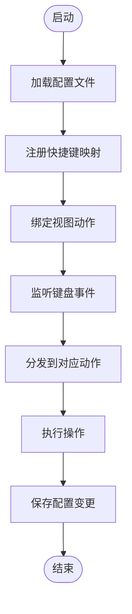

图表来源
- [tool/gui/src/utils/keymap.py](file://tool/gui/src/utils/keymap.py)
- [tool/gui/src/utils/config.py](file://tool/gui/src/utils/config.py)

章节来源
- [tool/gui/src/utils/keymap.py](file://tool/gui/src/utils/keymap.py)
- [tool/gui/src/utils/config.py](file://tool/gui/src/utils/config.py)
- [tool/gui/tests/test_keymap.py](file://tool/gui/tests/test_keymap.py)
- [tool/gui/tests/test_config.py](file://tool/gui/tests/test_config.py)

### 插件扩展机制（Plugin Loader）
- 能力说明
  - 插件发现与加载、生命周期钩子
  - 注入新视图、命令、处理器
  - 事件总线通信
- 扩展点
  - 视图扩展：新增编辑器面板
  - 命令扩展：新增菜单项与快捷键
  - 处理器扩展：自定义导入导出、模板渲染

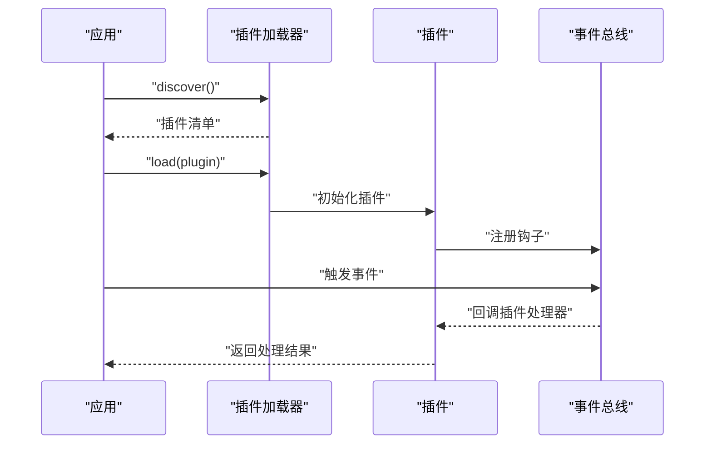

图表来源
- [tool/gui/src/plugins/loader.py](file://tool/gui/src/plugins/loader.py)

章节来源
- [tool/gui/src/plugins/loader.py](file://tool/gui/src/plugins/loader.py)
- [tool/gui/tests/test_loader.py](file://tool/gui/tests/test_loader.py)

## 依赖关系分析
- 内部依赖
  - 视图依赖控制器，控制器依赖模型与服务
  - 服务之间低耦合，通过接口调用
  - 插件通过事件总线与核心模块解耦
- 外部依赖
  - Git 客户端（用于版本控制）
  - 文件系统（JSON/YAML/媒体资源）
  - 模板引擎（渲染 HTML/预览）
- 潜在风险
  - 循环依赖需避免（通过服务层隔离）
  - 插件稳定性影响整体可用性（沙箱隔离）

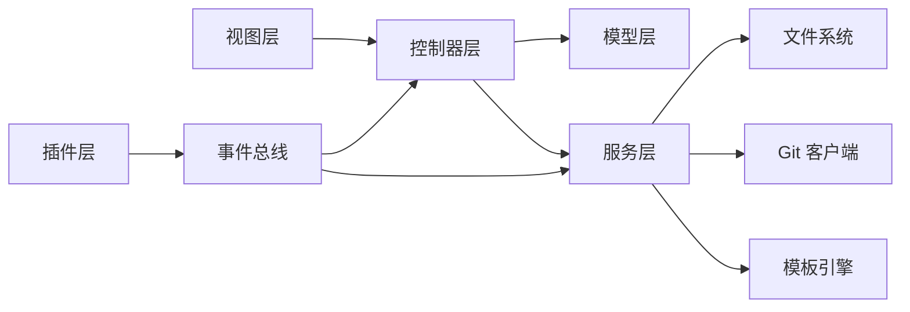

图表来源
- [tool/gui/src/views/course_editor_view.py](file://tool/gui/src/views/course_editor_view.py)
- [tool/gui/src/controllers/course_controller.py](file://tool/gui/src/controllers/course_controller.py)
- [tool/gui/src/models/course_model.py](file://tool/gui/src/models/course_model.py)
- [tool/gui/src/services/file_service.py](file://tool/gui/src/services/file_service.py)
- [tool/gui/src/services/git_service.py](file://tool/gui/src/services/git_service.py)
- [tool/gui/src/services/template_service.py](file://tool/gui/src/services/template_service.py)
- [tool/gui/src/plugins/loader.py](file://tool/gui/src/plugins/loader.py)

章节来源
- [tool/gui/src/views/course_editor_view.py](file://tool/gui/src/views/course_editor_view.py)
- [tool/gui/src/controllers/course_controller.py](file://tool/gui/src/controllers/course_controller.py)
- [tool/gui/src/models/course_model.py](file://tool/gui/src/models/course_model.py)
- [tool/gui/src/services/file_service.py](file://tool/gui/src/services/file_service.py)
- [tool/gui/src/services/git_service.py](file://tool/gui/src/services/git_service.py)
- [tool/gui/src/services/template_service.py](file://tool/gui/src/services/template_service.py)
- [tool/gui/src/plugins/loader.py](file://tool/gui/src/plugins/loader.py)

## 性能考量
- 大文件处理
  - 分块读取与写入，避免内存溢出
  - 媒体资源懒加载与缩略图生成
- 预览渲染
  - 异步渲染与缓存命中
  - 增量更新减少重绘
- 版本控制
  - 批量提交与压缩
  - 冲突检测并行化
- 插件性能
  - 限制 CPU/IO 使用上限
  - 超时与降级策略

[本节为通用指导，不直接分析具体文件]

## 故障排查指南
- 常见错误
  - JSON 解析失败：检查字段类型与必填项
  - Git 冲突：查看冲突文件并选择合并策略
  - 模板渲染错误：确认变量存在且格式正确
  - 导入导出失败：核对映射表与文件格式
- 调试建议
  - 启用详细日志与堆栈跟踪
  - 使用测试用例复现问题
  - 逐步断点定位控制器或服务层

章节来源
- [tool/gui/tests/test_course_editor_view.py](file://tool/gui/tests/test_course_editor_view.py)
- [tool/gui/tests/test_git_service.py](file://tool/gui/tests/test_git_service.py)
- [tool/gui/tests/test_template_service.py](file://tool/gui/tests/test_template_service.py)
- [tool/gui/tests/test_import_export_service.py](file://tool/gui/tests/test_import_export_service.py)
- [tool/gui/tests/test_collaboration_service.py](file://tool/gui/tests/test_collaboration_service.py)
- [tool/gui/tests/test_keymap.py](file://tool/gui/tests/test_keymap.py)
- [tool/gui/tests/test_config.py](file://tool/gui/tests/test_config.py)
- [tool/gui/tests/test_loader.py](file://tool/gui/tests/test_loader.py)

## 结论
内容编辑器以清晰的 MVC 分层与插件化架构，提供了强大的课程与课时编辑能力。通过模板系统、导入导出、Git 版本控制与协作功能，满足复杂的内容创作需求。建议遵循最佳实践，合理使用快捷键与配置，借助插件扩展提升效率。

[本节为总结性内容，不直接分析具体文件]

## 附录
- 使用指南
  - 安装与运行：参考 tool/gui/README.md 与 Makefile
  - 首次创建课程：新建课程、添加章节与课时、保存并发布
  - 批量操作：使用批量面板进行标签、移动、删除等操作
  - 导入导出：选择格式、映射字段、执行导入/导出
- 最佳实践
  - 频繁提交小变更，便于回溯
  - 使用模板统一结构与风格
  - 团队协作前拉取最新代码，及时合并冲突
- 常见问题
  - 预览不显示：检查模板与媒体路径
  - 导入失败：核对字段映射与数据类型
  - 插件无效：确认插件兼容性与权限

章节来源
- [tool/gui/README.md](file://tool/gui/README.md)
- [Makefile](file://Makefile)
- [docs/authoring/gui-course-editor.md](file://docs/authoring/gui-course-editor.md)
- [docs/decisions/0025-textbook-git-integration.md](file://docs/decisions/0025-textbook-git-integration.md)
- [assets/courses/turkish/index.json](file://assets/courses/turkish/index.json)
- [assets/courses/turkish/vocab.json](file://assets/courses/turkish/vocab.json)
- [assets/courses/turkish/grammar_points.json](file://assets/courses/turkish/grammar_points.json)
- [assets/courses/turkish/expressions.json](file://assets/courses/turkish/expressions.json)