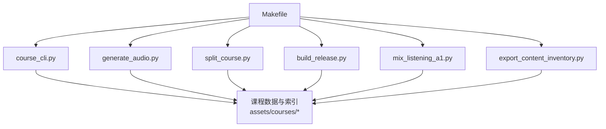
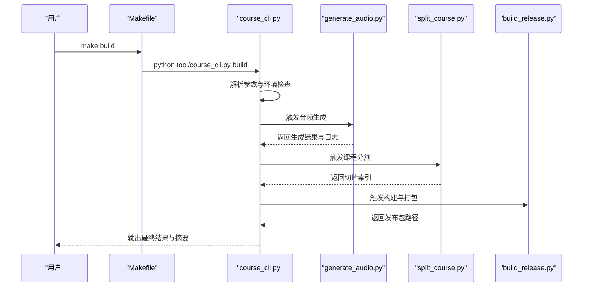
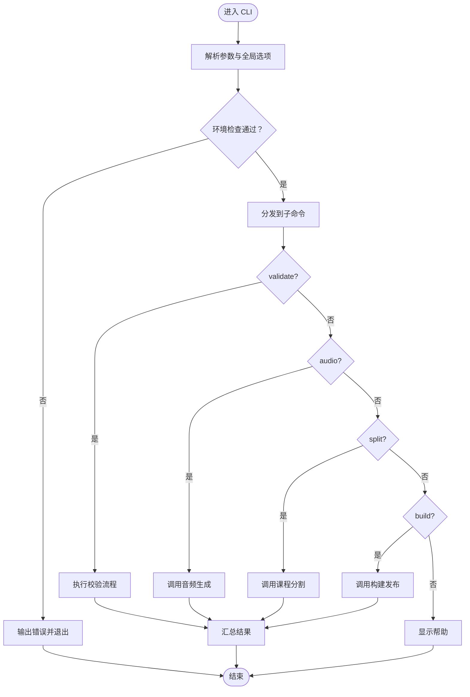
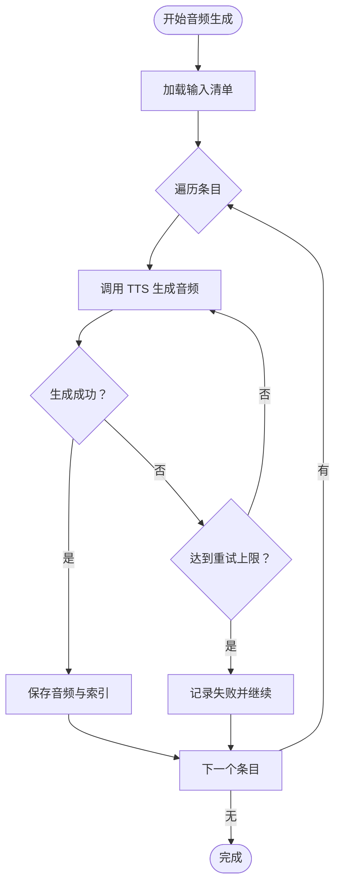
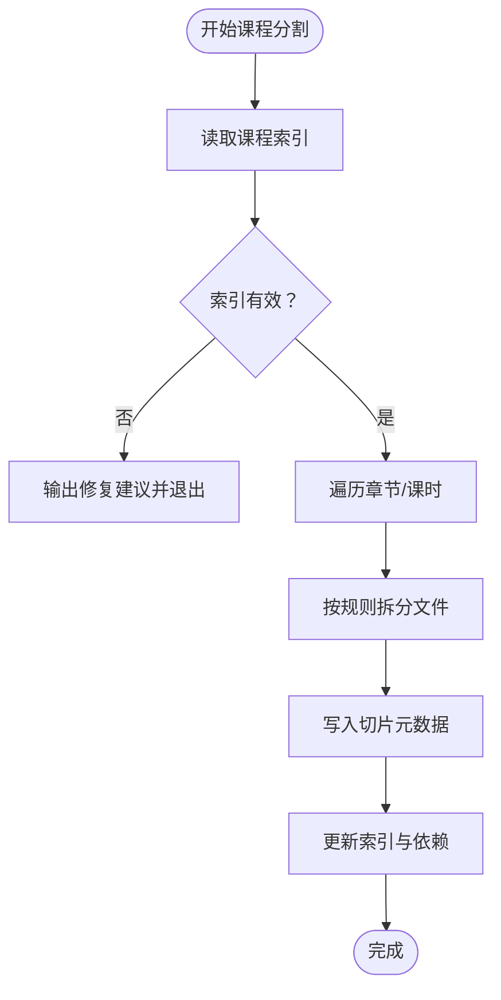
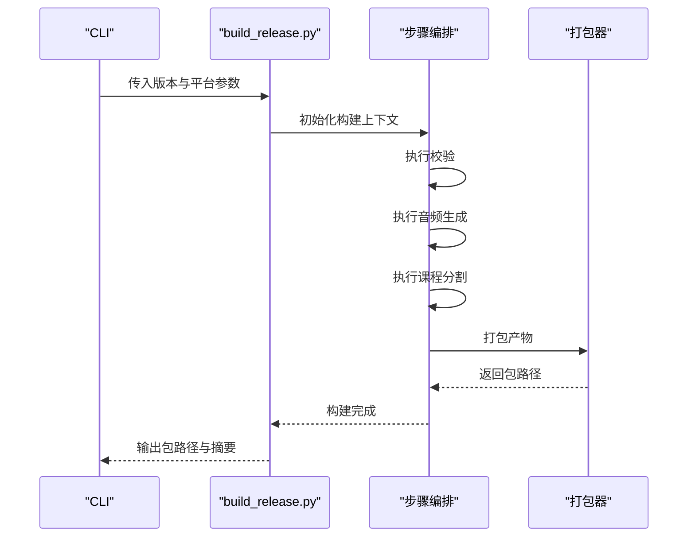
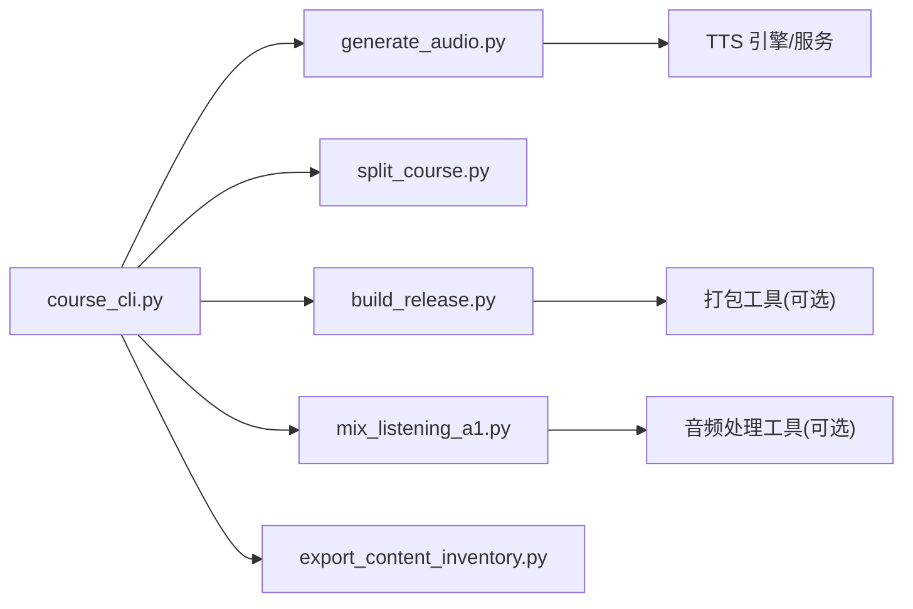

# 命令行工具

<cite>
**本文引用的文件**   
- [course_cli.py](file://tool/course_cli.py)
- [generate_audio.py](file://tool/generate_audio.py)
- [split_course.py](file://tool/split_course.py)
- [build_release.py](file://tool/build_release.py)
- [mix_listening_a1.py](file://tool/mix_listening_a1.py)
- [export_content_inventory.py](file://tool/export_content_inventory.py)
- [Makefile](file://Makefile)
- [README.md](file://README.md)
- [test/course_cli_test.py](file://test/course_cli_test.py)
- [test/generate_audio_test.py](file://test/generate_audio_test.py)
- [test/tool/build_release_test.py](file://test/tool/build_release_test.py)
- [test/tool/course_cli_validate_test.py](file://test/tool/course_cli_validate_test.py)
</cite>

## 目录
1. [简介](#简介)
2. [项目结构](#项目结构)
3. [核心组件](#核心组件)
4. [架构总览](#架构总览)
5. [详细组件分析](#详细组件分析)
6. [依赖关系分析](#依赖关系分析)
7. [性能考虑](#性能考虑)
8. [故障排查指南](#故障排查指南)
9. [结论](#结论)
10. [附录](#附录)

## 简介
本文件为课程命令行工具的完整文档，聚焦于 tool 目录下的自动化脚本与命令集。内容涵盖：
- course_cli.py 的功能模块、命令参数与使用场景
- 音频生成（generate_audio.py）、课程分割（split_course.py）、构建发布（build_release.py）等脚本的使用方法
- 批量处理、管道操作与错误处理机制
- 环境变量配置、日志输出与调试技巧
- 常用命令示例、批处理脚本与工作流集成方案
- 与其他工具的集成方式与扩展开发指南

该工具链围绕课程内容生产与发布流程设计，提供从资源校验、音频合成、课程切分到打包发布的端到端能力，便于在本地或 CI/CD 环境中稳定运行。

## 项目结构
命令行工具主要位于 tool 目录，配套测试位于 test 目录，顶层 Makefile 提供便捷入口。关键文件职责如下：
- course_cli.py：课程 CLI 主入口，聚合子命令与通用参数
- generate_audio.py：根据文本与元数据生成音频资源
- split_course.py：按章节/课时对课程进行切分与整理
- build_release.py：执行构建与发布流水线
- mix_listening_a1.py：听力素材混音与导出
- export_content_inventory.py：导出内容清单与统计
- Makefile：封装常用命令，简化调用
- README.md：项目说明与总体指引
- 测试用例：覆盖 CLI、音频生成、构建发布与校验流程

图表来源
- [Makefile](file://Makefile)
- [course_cli.py](file://tool/course_cli.py)
- [generate_audio.py](file://tool/generate_audio.py)
- [split_course.py](file://tool/split_course.py)
- [build_release.py](file://tool/build_release.py)
- [mix_listening_a1.py](file://tool/mix_listening_a1.py)
- [export_content_inventory.py](file://tool/export_content_inventory.py)

章节来源
- [Makefile](file://Makefile)
- [README.md](file://README.md)

## 核心组件
- 课程 CLI（course_cli.py）
  - 统一入口，提供子命令（如 validate、audio、split、build 等）
  - 支持全局参数（如 --verbose、--root、--output-dir）
  - 负责参数解析、环境检查、任务编排与结果汇总
- 音频生成（generate_audio.py）
  - 读取文本与元数据，调用 TTS/外部引擎生成音频
  - 支持批量、并发与失败重试策略
  - 输出标准化音频文件与索引映射
- 课程分割（split_course.py）
  - 依据章节/课时结构拆分课程资源
  - 生成切片索引与依赖关系
  - 支持增量更新与回滚
- 构建发布（build_release.py）
  - 串联校验、音频、分割、打包步骤
  - 生成发布包与版本信息
  - 支持多平台产物与签名校验
- 听力混音（mix_listening_a1.py）
  - 将听力素材混音并导出到目标目录
  - 支持音量均衡、静音裁剪与格式转换
- 内容清单导出（export_content_inventory.py）
  - 扫描课程资源，生成清单与统计报告
  - 输出 JSON/CSV 供下游消费

章节来源
- [course_cli.py](file://tool/course_cli.py)
- [generate_audio.py](file://tool/generate_audio.py)
- [split_course.py](file://tool/split_course.py)
- [build_release.py](file://tool/build_release.py)
- [mix_listening_a1.py](file://tool/mix_listening_a1.py)
- [export_content_inventory.py](file://tool/export_content_inventory.py)

## 架构总览
命令行工具采用“CLI 聚合 + 子脚本分工”的架构。顶层 Makefile 暴露常用命令，CLI 负责参数解析与流程编排，各子脚本专注单一职责，通过文件系统与标准输入/输出协作。

图表来源
- [Makefile](file://Makefile)
- [course_cli.py](file://tool/course_cli.py)
- [generate_audio.py](file://tool/generate_audio.py)
- [split_course.py](file://tool/split_course.py)
- [build_release.py](file://tool/build_release.py)

## 详细组件分析

### 课程 CLI（course_cli.py）
- 功能要点
  - 子命令注册与参数绑定
  - 全局选项：--root（课程根目录）、--output-dir（输出目录）、--verbose（详细日志）
  - 内置校验器：检查索引完整性、资源缺失、格式规范
  - 任务编排：顺序/并行执行子任务，收集错误与统计
- 典型工作流
  - validate：校验课程结构与资源
  - audio：调用音频生成脚本
  - split：调用课程分割脚本
  - build：调用构建发布脚本
- 错误处理
  - 捕获异常并记录上下文
  - 非零退出码用于 CI 集成
  - 可选跳过失败项继续执行

图表来源
- [course_cli.py](file://tool/course_cli.py)

章节来源
- [course_cli.py](file://tool/course_cli.py)
- [test/course_cli_test.py](file://test/course_cli_test.py)

### 音频生成（generate_audio.py）
- 功能要点
  - 读取文本与元数据（语言、语速、说话人等）
  - 调用 TTS 引擎或外部服务生成音频
  - 支持批量处理、并发控制与失败重试
  - 输出标准化音频文件与映射索引
- 关键参数
  - --input：输入文本或清单
  - --engine：TTS 引擎选择
  - --concurrency：并发数
  - --retry：重试次数
  - --output：输出目录
- 错误处理
  - 网络/引擎不可用时的降级策略
  - 部分失败不影响整体流程（可配置）

图表来源
- [generate_audio.py](file://tool/generate_audio.py)

章节来源
- [generate_audio.py](file://tool/generate_audio.py)
- [test/generate_audio_test.py](file://test/generate_audio_test.py)

### 课程分割（split_course.py）
- 功能要点
  - 基于章节/课时结构拆分课程资源
  - 生成切片索引与依赖关系图
  - 支持增量更新与回滚
- 关键参数
  - --course-root：课程根目录
  - --index：索引文件路径
  - --output：输出目录
  - --dry-run：仅模拟不写入
- 错误处理
  - 索引不一致时提示修复建议
  - 文件锁定与并发安全

图表来源
- [split_course.py](file://tool/split_course.py)

章节来源
- [split_course.py](file://tool/split_course.py)

### 构建发布（build_release.py）
- 功能要点
  - 串联校验、音频、分割、打包步骤
  - 生成发布包与版本信息
  - 支持多平台产物与签名校验
- 关键参数
  - --version：版本号
  - --platforms：目标平台列表
  - --sign：是否签名
  - --output：输出目录
- 错误处理
  - 任一阶段失败即中止（可配置继续）
  - 生成构建日志与产物清单

图表来源
- [build_release.py](file://tool/build_release.py)

章节来源
- [build_release.py](file://tool/build_release.py)
- [test/tool/build_release_test.py](file://test/tool/build_release_test.py)

### 听力混音（mix_listening_a1.py）
- 功能要点
  - 将听力素材混音并导出到目标目录
  - 支持音量均衡、静音裁剪与格式转换
- 关键参数
  - --input：输入素材目录
  - --output：输出目录
  - --format：输出格式
  - --normalize：是否归一化音量
- 错误处理
  - 无效素材跳过并记录
  - 输出兼容性与校验

章节来源
- [mix_listening_a1.py](file://tool/mix_listening_a1.py)

### 内容清单导出（export_content_inventory.py）
- 功能要点
  - 扫描课程资源，生成清单与统计报告
  - 输出 JSON/CSV 供下游消费
- 关键参数
  - --root：课程根目录
  - --format：输出格式
  - --output：输出文件路径
- 错误处理
  - 权限不足或路径不存在时提示

章节来源
- [export_content_inventory.py](file://tool/export_content_inventory.py)

## 依赖关系分析
- 内部依赖
  - course_cli.py 作为聚合层，依赖各子脚本提供的可执行接口
  - 子脚本之间通过文件系统与标准输入/输出协作，避免强耦合
- 外部依赖
  - TTS 引擎或服务（由 generate_audio.py 调用）
  - 音频处理工具（如 ffmpeg，若混音需要）
  - 打包工具（如 zip/tar，构建发布需要）
- 测试依赖
  - 单元测试覆盖 CLI、音频生成、构建发布与校验流程

图表来源
- [course_cli.py](file://tool/course_cli.py)
- [generate_audio.py](file://tool/generate_audio.py)
- [split_course.py](file://tool/split_course.py)
- [build_release.py](file://tool/build_release.py)
- [mix_listening_a1.py](file://tool/mix_listening_a1.py)
- [export_content_inventory.py](file://tool/export_content_inventory.py)

章节来源
- [course_cli.py](file://tool/course_cli.py)
- [test/course_cli_test.py](file://test/course_cli_test.py)
- [test/generate_audio_test.py](file://test/generate_audio_test.py)
- [test/tool/build_release_test.py](file://test/tool/build_release_test.py)
- [test/tool/course_cli_validate_test.py](file://test/tool/course_cli_validate_test.py)

## 性能考虑
- 并发与批处理
  - 音频生成支持并发控制，合理设置 --concurrency 以平衡速度与资源占用
  - 大清单分批处理，避免内存峰值
- I/O 优化
  - 使用增量更新减少重复计算
  - 输出目录预创建与磁盘空间检查
- 缓存与幂等
  - 已生成的音频与切片结果可复用
  - 幂等设计确保重复执行不会破坏状态
- 错误恢复
  - 失败重试与断点续跑
  - 细粒度日志定位瓶颈

[本节为通用指导，无需引用具体文件]

## 故障排查指南
- 常见问题
  - TTS 引擎不可用：检查环境变量与服务端口，确认凭据正确
  - 路径不存在或权限不足：确认 --root 与 --output 路径存在且可写
  - 索引不一致：运行 validate 并参考修复建议
  - 构建失败：查看构建日志与产物清单，定位失败阶段
- 调试技巧
  - 启用 --verbose 获取详细日志
  - 使用 --dry-run 模拟执行，验证参数与流程
  - 分步执行子命令，隔离问题范围
- 日志与输出
  - 标准输出与错误输出分离
  - 结构化日志便于解析与归档

章节来源
- [course_cli.py](file://tool/course_cli.py)
- [generate_audio.py](file://tool/generate_audio.py)
- [split_course.py](file://tool/split_course.py)
- [build_release.py](file://tool/build_release.py)

## 结论
本课程命令行工具提供了从资源校验、音频合成、课程切分到打包发布的完整流水线。通过清晰的模块化设计与完善的错误处理机制，能够在本地与 CI/CD 环境中高效稳定地运行。建议结合 Makefile 与测试用例，形成标准化的开发与发布工作流。

[本节为总结性内容，无需引用具体文件]

## 附录
- 常用命令示例
  - 校验课程：make validate 或 python tool/course_cli.py validate --root assets/courses --verbose
  - 生成音频：python tool/course_cli.py audio --input assets/courses/turkish/index.json --engine tts --concurrency 4
  - 分割课程：python tool/course_cli.py split --course-root assets/courses/turkish --index assets/courses/turkish/index.json --output assets/courses/turkish/sections
  - 构建发布：make build 或 python tool/course_cli.py build --version 1.0.0 --platforms android,ios
  - 混音听力：python tool/mix_listening_a1.py --input assets/sounds/turkish/listening --output assets/sounds/turkish/listening/out --format mp3
  - 导出清单：python tool/export_content_inventory.py --root assets/courses --format json --output inventory.json
- 环境变量配置
  - TTS_ENGINE：指定 TTS 引擎类型
  - TTS_API_KEY：TTS 服务密钥
  - OUTPUT_DIR：默认输出目录
  - LOG_LEVEL：日志级别（info/debug/error）
- 批处理脚本与工作流集成
  - 在 Makefile 中封装多步骤任务，便于一键执行
  - 在 CI/CD 中调用 CLI 子命令，结合缓存与并行提升效率
- 与其他工具的集成
  - 与 TTS 服务对接：通过环境变量配置凭据与端点
  - 与音频处理工具对接：如 ffmpeg，用于格式转换与混音
  - 与打包工具对接：如 zip/tar，用于构建发布
- 扩展开发指南
  - 新增子命令：在 CLI 中注册命令与参数，实现对应逻辑
  - 新增子脚本：遵循单一职责，提供命令行接口与错误码
  - 编写测试：覆盖参数解析、正常路径与异常路径

[本节为补充信息，无需引用具体文件]