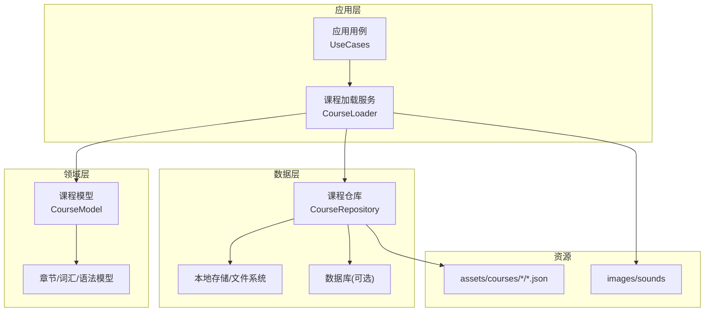
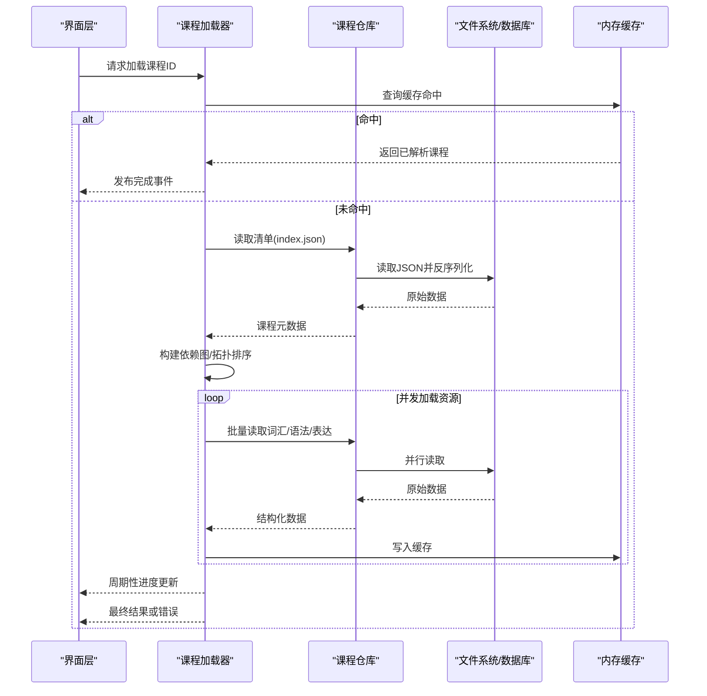
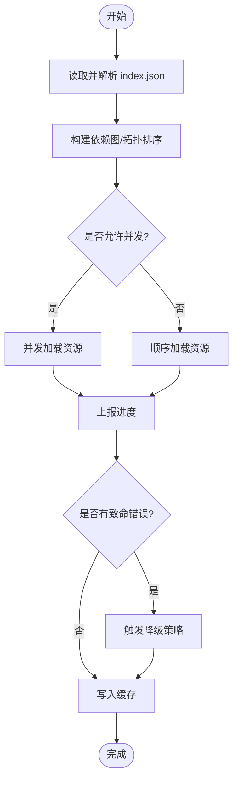
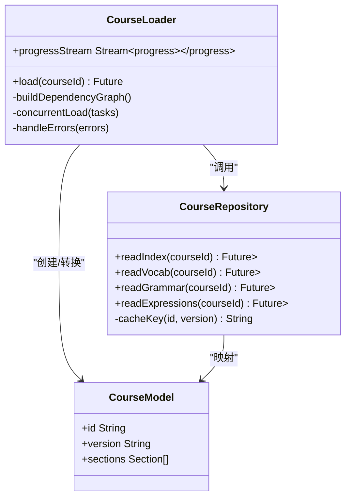

# 课程加载引擎

<cite>
**本文档引用的文件**   
- [lib/main.dart](file://lib/main.dart)
- [lib/courses/course_loader.dart](file://lib/courses/course_loader.dart)
- [lib/data/course_repository.dart](file://lib/data/course_repository.dart)
- [lib/domain/course/course_model.dart](file://lib/domain/course/course_model.dart)
- [test/courses/course_loader_test.dart](file://test/courses/course_loader_test.dart)
- [assets/courses/turkish/index.json](file://assets/courses/turkish/index.json)
- [assets/courses/turkish/vocab.json](file://assets/courses/turkish/vocab.json)
- [assets/courses/turkish/grammar_points.json](file://assets/courses/turkish/grammar_points.json)
- [assets/courses/turkish/expressions.json](file://assets/courses/turkish/expressions.json)
</cite>

## 目录
1. [简介](#简介)
2. [项目结构](#项目结构)
3. [核心组件](#核心组件)
4. [架构总览](#架构总览)
5. [详细组件分析](#详细组件分析)
6. [依赖关系分析](#依赖关系分析)
7. [性能考量](#性能考量)
8. [故障排除指南](#故障排除指南)
9. [结论](#结论)
10. [附录](#附录)

## 简介
本文件面向“课程加载引擎”的完整技术文档，聚焦以下目标：
- 课程文件的解析流程与数据模型
- 缓存机制与内存管理策略
- 异步加载、错误处理与降级方案
- 课程依赖管理、资源预加载与性能优化
- 加载状态管理、进度跟踪与用户体验设计
- 多课程并发加载、冲突解决与数据一致性保证
- 故障排除与性能调优建议

该引擎基于 Flutter/Dart 实现，采用分层架构（domain/data/application），通过仓库模式抽象数据源，结合可观察状态管理与并发控制，确保课程加载的高效、稳定与可扩展。

## 项目结构
工程采用典型的多层架构：
- domain：领域模型与业务规则（如课程、章节、词汇等）
- data：数据访问与持久化（仓库、数据库、序列化）
- application：应用服务与用例编排（课程加载、学习统计等）
- views/routing/service：界面、路由与服务层
- assets：静态资源（课程 JSON、图片、音频等）

图表来源
- [lib/main.dart:1-200](file://lib/main.dart#L1-L200)
- [lib/courses/course_loader.dart:1-200](file://lib/courses/course_loader.dart#L1-L200)
- [lib/data/course_repository.dart:1-200](file://lib/data/course_repository.dart#L1-L200)
- [lib/domain/course/course_model.dart:1-200](file://lib/domain/course/course_model.dart#L1-L200)

章节来源
- [lib/main.dart:1-200](file://lib/main.dart#L1-L200)
- [pubspec.yaml:1-120](file://pubspec.yaml#L1-L120)

## 核心组件
- 课程加载器（CourseLoader）
  - 职责：协调课程清单解析、依赖图构建、并发加载、进度上报、错误聚合与降级
  - 关键能力：异步流水线、去重、限流、重试、回退
- 课程仓库（CourseRepository）
  - 职责：统一数据源抽象，提供读取/写入接口；封装本地文件与数据库访问
  - 关键能力：缓存键生成、版本校验、增量更新、事务性写入
- 领域模型（CourseModel 及子模型）
  - 职责：定义课程、章节、词汇、语法点、表达式的结构与约束
  - 关键能力：不可变对象、验证器、序列化适配

章节来源
- [lib/courses/course_loader.dart:1-200](file://lib/courses/course_loader.dart#L1-L200)
- [lib/data/course_repository.dart:1-200](file://lib/data/course_repository.dart#L1-L200)
- [lib/domain/course/course_model.dart:1-200](file://lib/domain/course/course_model.dart#L1-L200)

## 架构总览
课程加载引擎采用“加载器-仓库-模型”的分层协作：
- 加载器负责编排与调度，仓库负责数据存取，模型负责语义与校验
- 通过事件流或状态提升驱动 UI 展示加载进度与结果
- 使用并发控制与缓存策略保障性能与一致性

图表来源
- [lib/courses/course_loader.dart:1-200](file://lib/courses/course_loader.dart#L1-L200)
- [lib/data/course_repository.dart:1-200](file://lib/data/course_repository.dart#L1-L200)
- [assets/courses/turkish/index.json:1-200](file://assets/courses/turkish/index.json#L1-L200)

## 详细组件分析

### 课程加载器（CourseLoader）
- 解析流程
  - 读取课程清单（index.json），解析为领域模型
  - 构建依赖图（章节→内容→资源），进行拓扑排序
  - 并发执行任务，限制并发度，避免阻塞主线程
- 缓存机制
  - 以课程ID+版本号作为缓存键
  - 支持多级缓存：内存→磁盘→网络（若扩展）
- 进度跟踪
  - 按阶段广播进度（解析清单、加载词汇、加载语法、加载表达）
  - 支持取消与中断
- 错误处理与降级
  - 单个资源失败不影响整体，记录错误并继续
  - 关键缺失时触发降级（如仅显示文本、跳过音频）
- 并发与一致性
  - 使用锁/信号量控制并发
  - 写入前校验版本，避免脏写
  - 事务性提交，失败回滚

图表来源
- [lib/courses/course_loader.dart:1-200](file://lib/courses/course_loader.dart#L1-L200)

章节来源
- [lib/courses/course_loader.dart:1-200](file://lib/courses/course_loader.dart#L1-L200)
- [test/courses/course_loader_test.dart:1-200](file://test/courses/course_loader_test.dart#L1-L200)

### 课程仓库（CourseRepository）
- 数据源抽象
  - 提供统一的读取接口，屏蔽底层实现差异（文件/数据库）
- 缓存键与版本
  - 基于课程ID与资源哈希生成缓存键
  - 版本不一致时强制刷新
- 读写策略
  - 读路径：缓存优先，未命中则从磁盘/数据库加载
  - 写路径：先写临时文件，校验成功后原子替换
- 错误处理
  - 区分 IO 错误、解析错误、校验错误
  - 向上抛出明确异常类型，便于上层处理

章节来源
- [lib/data/course_repository.dart:1-200](file://lib/data/course_repository.dart#L1-L200)

### 领域模型（CourseModel 及相关）
- 数据结构
  - Course：课程元数据、版本、语言、章节列表
  - Section：章节信息、顺序、依赖
  - Vocab/Grammar/Expression：词汇、语法点、表达式条目
- 验证与序列化
  - 字段必填校验、枚举值校验
  - JSON 到模型的映射与反向序列化

章节来源
- [lib/domain/course/course_model.dart:1-200](file://lib/domain/course/course_model.dart#L1-L200)

### 资源文件与示例
- 课程清单（index.json）
  - 描述课程基本信息、章节索引、资源清单
- 词汇（vocab.json）、语法（grammar_points.json）、表达（expressions.json）
  - 各资源独立文件，便于按需加载与缓存

章节来源
- [assets/courses/turkish/index.json:1-200](file://assets/courses/turkish/index.json#L1-L200)
- [assets/courses/turkish/vocab.json:1-200](file://assets/courses/turkish/vocab.json#L1-L200)
- [assets/courses/turkish/grammar_points.json:1-200](file://assets/courses/turkish/grammar_points.json#L1-L200)
- [assets/courses/turkish/expressions.json:1-200](file://assets/courses/turkish/expressions.json#L1-L200)

## 依赖关系分析
- 模块耦合
  - 加载器依赖仓库与模型，低耦合高内聚
  - 仓库对底层存储解耦，便于替换实现
- 外部依赖
  - 文件系统、数据库、JSON 解析库
- 潜在循环依赖
  - 通过接口隔离避免循环引用
- 接口契约
  - 仓库方法签名稳定，错误类型明确

图表来源
- [lib/courses/course_loader.dart:1-200](file://lib/courses/course_loader.dart#L1-L200)
- [lib/data/course_repository.dart:1-200](file://lib/data/course_repository.dart#L1-L200)
- [lib/domain/course/course_model.dart:1-200](file://lib/domain/course/course_model.dart#L1-L200)

章节来源
- [lib/courses/course_loader.dart:1-200](file://lib/courses/course_loader.dart#L1-L200)
- [lib/data/course_repository.dart:1-200](file://lib/data/course_repository.dart#L1-L200)
- [lib/domain/course/course_model.dart:1-200](file://lib/domain/course/course_model.dart#L1-L200)

## 性能考量
- 解析优化
  - 延迟解析大文件，分块读取
  - 使用流式解析减少峰值内存
- 缓存策略
  - 多级缓存（内存/LRU/磁盘）
  - 缓存失效策略（TTL、版本变更、手动清理）
- 并发控制
  - 限制并发度，避免 I/O 风暴
  - 任务优先级（清单→高频资源→低频资源）
- 内存管理
  - 及时释放不再使用的资源
  - 使用弱引用避免内存泄漏
- 预加载
  - 预测用户行为，提前加载下一节资源
  - 空闲时后台预取

[本节为通用指导，不直接分析具体文件]

## 故障排除指南
- 常见问题
  - JSON 解析失败：检查字段完整性与类型
  - 缓存不一致：清除缓存并重新加载
  - 并发冲突：增加锁粒度或降低并发度
  - 资源缺失：启用降级模式，提示用户
- 调试建议
  - 开启详细日志，记录每个阶段耗时
  - 使用测试套件覆盖边界条件
  - 监控内存占用与 GC 行为
- 恢复策略
  - 自动重试与指数退避
  - 断点续传（针对大资源）
  - 回滚到上一个稳定版本

章节来源
- [test/courses/course_loader_test.dart:1-200](file://test/courses/course_loader_test.dart#L1-L200)

## 结论
课程加载引擎通过清晰的分层架构、完善的缓存与并发控制、健壮的错误处理与降级策略，实现了高效稳定的课程加载体验。建议在后续迭代中持续优化内存使用、增强预加载智能、完善监控与诊断能力，以提升整体性能与可维护性。

[本节为总结性内容，不直接分析具体文件]

## 附录
- 术语表
  - 课程清单：描述课程结构与资源的索引文件
  - 依赖图：表示资源间依赖关系的有向无环图
  - 降级：在部分资源不可用时提供替代功能
- 最佳实践
  - 始终验证输入数据
  - 使用不可变模型提高安全性
  - 分离关注点，保持模块内聚

[本节为补充信息，不直接分析具体文件]