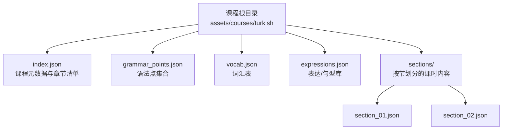
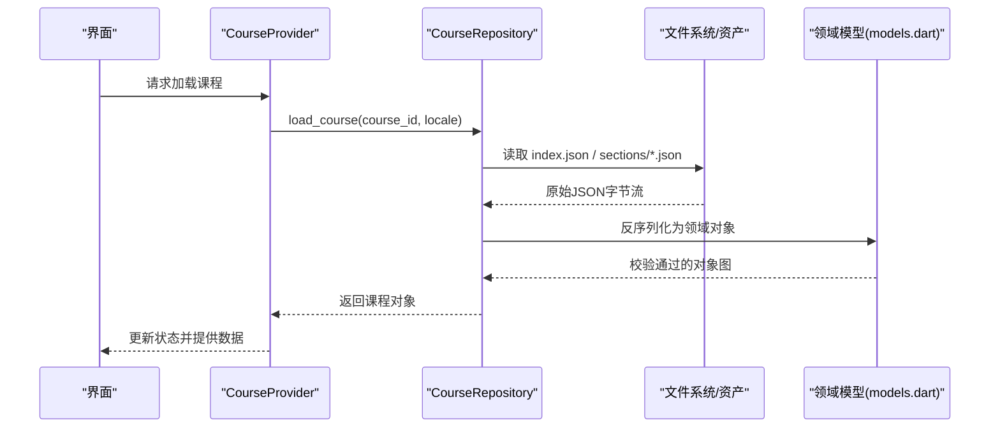
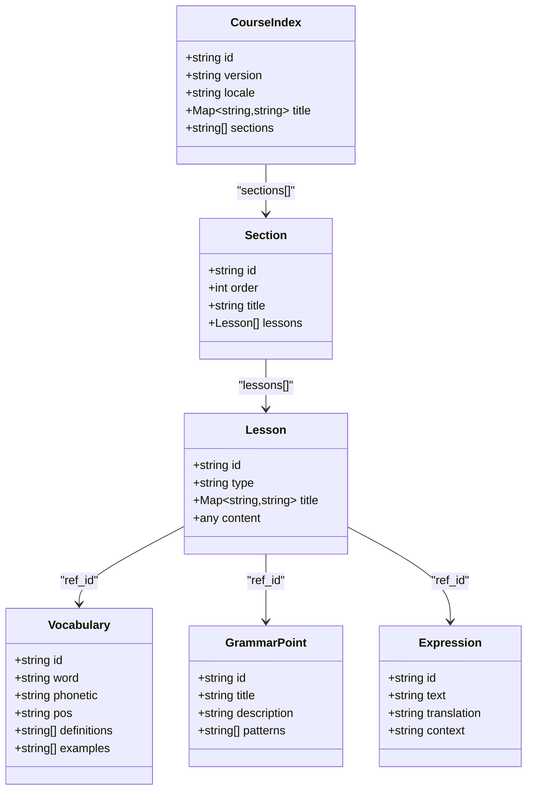

# 课程数据结构

<cite>
**本文档引用的文件**   
- [assets/courses/turkish/index.json](file://assets/courses/turkish/index.json)
- [assets/courses/turkish/grammar_points.json](file://assets/courses/turkish/grammar_points.json)
- [assets/courses/turkish/vocab.json](file://assets/courses/turkish/vocab.json)
- [assets/courses/turkish/expressions.json](file://assets/courses/turkish/expressions.json)
- [assets/courses/turkish/sections/section_01.json](file://assets/courses/turkish/sections/section_01.json)
- [lib/domain/course/models.dart](file://lib/domain/course/models.dart)
- [lib/data/course_repository.dart](file://lib/data/course_repository.dart)
- [lib/application/course_provider.dart](file://lib/application/course_provider.dart)
- [tool/course_cli.py](file://tool/course_cli.py)
- [test/courses/seeder_round_trip_test.dart](file://test/courses/seeder_round_trip_test.dart)
- [test/data/schema_migration_test.dart](file://test/data/schema_migration_test.dart)
- [docs/authoring/course-layout.md](file://docs/authoring/course-layout.md)
- [docs/authoring/lesson-type-templates.md](file://docs/authoring/lesson-type-templates.md)
</cite>

## 目录
1. [简介](#简介)
2. [项目结构](#项目结构)
3. [核心组件](#核心组件)
4. [架构总览](#架构总览)
5. [详细组件分析](#详细组件分析)
6. [依赖关系分析](#依赖关系分析)
7. [性能考虑](#性能考虑)
8. [故障排查指南](#故障排查指南)
9. [结论](#结论)
10. [附录](#附录)

## 简介
本文件系统化阐述 Varnamalaplus 的课程数据结构，覆盖课程元数据、章节组织、词汇表、语法点与练习内容的 JSON 规范、字段定义与校验规则；说明版本管理、ID 生成策略与引用关系；提供多语言支持与本地化机制；并给出数据迁移与向后兼容性建议。文档同时包含可视化图示与实际数据示例路径，帮助作者与开发者快速理解与扩展课程数据模型。

## 项目结构
课程数据以资源形式存放于 assets/courses/<language>/ 下，采用“扁平索引 + 分块内容”的组织方式：
- index.json：课程级元数据与章节清单
- grammar_points.json：语法点集合
- vocab.json：词汇表
- expressions.json：表达/句型库
- sections/：按节划分的课时内容（每个 section 一个 JSON）

图表来源
- [assets/courses/turkish/index.json](file://assets/courses/turkish/index.json)
- [assets/courses/turkish/grammar_points.json](file://assets/courses/turkish/grammar_points.json)
- [assets/courses/turkish/vocab.json](file://assets/courses/turkish/vocab.json)
- [assets/courses/turkish/expressions.json](file://assets/courses/turkish/expressions.json)
- [assets/courses/turkish/sections/section_01.json](file://assets/courses/turkish/sections/section_01.json)

章节来源
- [assets/courses/turkish/index.json](file://assets/courses/turkish/index.json)
- [docs/authoring/course-layout.md](file://docs/authoring/course-layout.md)

## 核心组件
- 课程元数据（index.json）
  - 标识与版本：id、version、locale、title、description、tags、image
  - 学习参数：level、target_language、source_language、estimated_hours
  - 章节清单：sections[] 指向 sections/*.json
- 章节（sections/*.json）
  - 标识与顺序：id、order、title、subtitle、summary
  - 目标与范围：objectives、prerequisites、related_sections
  - 内容组织：lessons[] 数组，每项为一种课型
- 词汇表（vocab.json）
  - 词条：id、word、phonetic、pos、definitions、examples、collocations、synonyms、antonyms
  - 标签与难度：tags、difficulty、frequency、mastery_level
  - 媒体与音频：audio_file、image_file
- 语法点（grammar_points.json）
  - 标识与标题：id、title、description
  - 结构与用法：patterns、rules、notes、examples、common_mistakes
  - 关联：related_vocab_ids、related_expressions_ids、difficulty
- 表达/句型（expressions.json）
  - 标识与文本：id、text、translation、context、register
  - 语用信息：usage_notes、formality、cultural_notes
  - 关联：related_vocab_ids、related_grammar_ids

章节来源
- [assets/courses/turkish/index.json](file://assets/courses/turkish/index.json)
- [assets/courses/turkish/grammar_points.json](file://assets/courses/turkish/grammar_points.json)
- [assets/courses/turkish/vocab.json](file://assets/courses/turkish/vocab.json)
- [assets/courses/turkish/expressions.json](file://assets/courses/turkish/expressions.json)
- [assets/courses/turkish/sections/section_01.json](file://assets/courses/turkish/sections/section_01.json)

## 架构总览
课程数据在应用中的加载与使用流程如下：
- 资源层：assets/courses/<lang> 下的 JSON 文件
- 数据层：CourseRepository 负责读取、解析与缓存
- 领域层：models.dart 定义强类型实体与校验
- 应用层：CourseProvider 暴露状态与业务方法供 UI 消费

图表来源
- [lib/data/course_repository.dart](file://lib/data/course_repository.dart)
- [lib/domain/course/models.dart](file://lib/domain/course/models.dart)
- [lib/application/course_provider.dart](file://lib/application/course_provider.dart)
- [assets/courses/turkish/index.json](file://assets/courses/turkish/index.json)

章节来源
- [lib/data/course_repository.dart](file://lib/data/course_repository.dart)
- [lib/domain/course/models.dart](file://lib/domain/course/models.dart)
- [lib/application/course_provider.dart](file://lib/application/course_provider.dart)

## 详细组件分析

### 课程元数据（index.json）
- 关键字段
  - id：课程唯一标识（语义化或哈希），用于跨模块引用
  - version：语义化版本（如 1.0.0），用于增量更新与回滚
  - locale：语言代码（如 tr、zh-CN），决定默认展示语言
  - title/description：多语言键值映射（如 {tr:"...", zh:"..."}）
  - sections：字符串数组，指向 sections/*.json 的文件名
- 校验规则
  - id 非空且符合命名约定
  - version 遵循语义化版本格式
  - locale 为 IETF BCP 47 兼容代码
  - sections 中每个文件名必须存在且可解析

章节来源
- [assets/courses/turkish/index.json](file://assets/courses/turkish/index.json)
- [lib/domain/course/models.dart](file://lib/domain/course/models.dart)

### 章节结构（sections/*.json）
- 关键字段
  - id/order/title/subtitle/summary：基础描述与排序
  - objectives/prerequisites：学习目标与前置知识
  - related_sections：相关章节 ID 列表
  - lessons[]：课型数组，支持多种模板（见下节）
- 校验规则
  - order 为正整数，保证稳定排序
  - prerequisites 与 related_sections 引用需存在
  - lessons 中每个项的 type 必须受支持

章节来源
- [assets/courses/turkish/sections/section_01.json](file://assets/courses/turkish/sections/section_01.json)
- [docs/authoring/lesson-type-templates.md](file://docs/authoring/lesson-type-templates.md)

### 词汇表（vocab.json）
- 关键字段
  - id：词条唯一标识
  - word/phonetic/pos：词形、音标、词性
  - definitions/examples/collocations/synonyms/antonyms：释义与用例
  - tags/difficulty/frequency/mastery_level：标签、难度、频率、掌握度
  - audio_file/image_file：媒体资源路径
- 校验规则
  - id 全局唯一
  - difficulty/frequency 为数值范围约束
  - 媒体文件路径相对 assets 根目录

章节来源
- [assets/courses/turkish/vocab.json](file://assets/courses/turkish/vocab.json)
- [lib/domain/course/models.dart](file://lib/domain/course/models.dart)

### 语法点（grammar_points.json）
- 关键字段
  - id/title/description：基本描述
  - patterns/rules/notes：结构与规则
  - examples/common_mistakes：示例与易错点
  - related_vocab_ids/related_expressions_ids/difficulty：关联与难度
- 校验规则
  - id 全局唯一
  - related_* 数组中的 ID 需在对应表中存在

章节来源
- [assets/courses/turkish/grammar_points.json](file://assets/courses/turkish/grammar_points.json)
- [lib/domain/course/models.dart](file://lib/domain/course/models.dart)

### 表达/句型（expressions.json）
- 关键字段
  - id/text/translation/context/register：文本与语用
  - usage_notes/formality/cultural_notes：使用说明与文化注释
  - related_vocab_ids/related_grammar_ids：关联
- 校验规则
  - id 全局唯一
  - register/formality 取值受限

章节来源
- [assets/courses/turkish/expressions.json](file://assets/courses/turkish/expressions.json)
- [lib/domain/course/models.dart](file://lib/domain/course/models.dart)

### 课型模板与嵌套结构
- 支持的课型包括：词汇讲解、听力理解、语法练习、口语对话、综合任务等
- 每种课型包含通用字段（id、type、title、content、media）与特定字段（如听力的音频列表、口语的评分标准）
- 嵌套结构允许在一个 lesson 内组合多个子任务，形成学习闭环

章节来源
- [docs/authoring/lesson-type-templates.md](file://docs/authoring/lesson-type-templates.md)
- [assets/courses/turkish/sections/section_01.json](file://assets/courses/turkish/sections/section_01.json)

### 多语言支持与本地化
- 标题、描述、释义等文本字段采用 locale-key 映射结构
- 默认语言由 index.locale 决定，缺失时回退到默认语言
- 运行时根据设备语言选择最佳匹配，未匹配则降级显示英文或占位符

章节来源
- [assets/courses/turkish/index.json](file://assets/courses/turkish/index.json)
- [lib/domain/course/models.dart](file://lib/domain/course/models.dart)

### ID 生成策略与引用关系
- ID 生成
  - 课程/章节/词条/语法点/表达均使用稳定 ID（语义化或短哈希）
  - 避免使用自增主键，确保跨平台一致性与可移植性
- 引用关系
  - sections[].lessons[].content.*.ref_id 指向 vocab/grammar/expressions 的 id
  - 校验阶段检查引用完整性，缺失时报错并阻止加载

章节来源
- [lib/domain/course/models.dart](file://lib/domain/course/models.dart)
- [lib/data/course_repository.dart](file://lib/data/course_repository.dart)

### 数据验证与错误处理
- 解析阶段：JSON 反序列化失败时抛出结构化异常，附带文件路径与行号
- 校验阶段：字段类型、必填项、枚举值、范围限制、引用完整性
- 容错策略：可选字段缺失时提供默认值；引用缺失记录警告并跳过该条目

章节来源
- [lib/data/course_repository.dart](file://lib/data/course_repository.dart)
- [lib/domain/course/models.dart](file://lib/domain/course/models.dart)

### 版本管理与变更追踪
- 语义化版本控制：major/minor/patch 分别表示破坏性更新、功能新增与修复
- 变更日志：建议在 index.json 的 changelog 字段记录每次更新要点
- 增量更新：客户端比较版本号，仅下载差异部分

章节来源
- [assets/courses/turkish/index.json](file://assets/courses/turkish/index.json)
- [lib/application/course_provider.dart](file://lib/application/course_provider.dart)

### 实际数据示例与嵌套结构
- 课程根：index.json 列出 sections 与元数据
- 章节：sections/section_XX.json 包含 lessons 数组
- 词汇/语法/表达：独立 JSON 文件，通过 id 被引用
- 嵌套：lesson.content 可包含子任务、媒体、交互元素

章节来源
- [assets/courses/turkish/index.json](file://assets/courses/turkish/index.json)
- [assets/courses/turkish/sections/section_01.json](file://assets/courses/turkish/sections/section_01.json)
- [assets/courses/turkish/vocab.json](file://assets/courses/turkish/vocab.json)
- [assets/courses/turkish/grammar_points.json](file://assets/courses/turkish/grammar_points.json)
- [assets/courses/turkish/expressions.json](file://assets/courses/turkish/expressions.json)

## 依赖关系分析
课程数据在各层之间的依赖关系如下：

图表来源
- [lib/domain/course/models.dart](file://lib/domain/course/models.dart)
- [assets/courses/turkish/index.json](file://assets/courses/turkish/index.json)
- [assets/courses/turkish/sections/section_01.json](file://assets/courses/turkish/sections/section_01.json)
- [assets/courses/turkish/vocab.json](file://assets/courses/turkish/vocab.json)
- [assets/courses/turkish/grammar_points.json](file://assets/courses/turkish/grammar_points.json)
- [assets/courses/turkish/expressions.json](file://assets/courses/turkish/expressions.json)

章节来源
- [lib/domain/course/models.dart](file://lib/domain/course/models.dart)

## 性能考虑
- 懒加载：仅在需要时加载章节与课型内容，减少初始内存占用
- 缓存策略：对已解析的模型进行内存缓存，避免重复反序列化
- 批量校验：在校验阶段合并错误报告，减少往返次数
- 媒体优化：图片压缩与音频转码，按需加载

[本节为通用指导，不直接分析具体文件]

## 故障排查指南
- 常见错误
  - JSON 解析失败：检查语法与编码
  - 字段缺失或类型错误：对照 models.dart 的字段定义
  - 引用不存在：确保 ref_id 在对应表中存在
  - 版本不一致：检查 index.version 与客户端期望版本
- 调试工具
  - course_cli.py 提供校验与导出能力
  - seeder_round_trip_test.dart 验证读写一致性
  - schema_migration_test.dart 验证数据库迁移

章节来源
- [tool/course_cli.py](file://tool/course_cli.py)
- [test/courses/seeder_round_trip_test.dart](file://test/courses/seeder_round_trip_test.dart)
- [test/data/schema_migration_test.dart](file://test/data/schema_migration_test.dart)

## 结论
Varnamalaplus 的课程数据结构以清晰的 JSON 规范与强类型模型为核心，支持多语言、版本管理与灵活的课型模板。通过严格的校验与引用完整性检查，确保数据质量与运行稳定性。作者可基于本规范扩展新字段与新课型，开发者可通过领域模型与仓库层高效集成。

[本节为总结性内容，不直接分析具体文件]

## 附录
- 数据迁移指南
  - 新增字段：保持向后兼容，旧数据缺失时提供默认值
  - 删除字段：标记废弃并在下个主版本移除
  - 版本升级：客户端检测版本差异并执行迁移脚本
- 最佳实践
  - 使用稳定的 ID 与语义化版本
  - 所有用户可见文本走多语言映射
  - 媒体资源集中管理并按需加载
  - 校验与测试覆盖关键路径

[本节为通用指导，不直接分析具体文件]