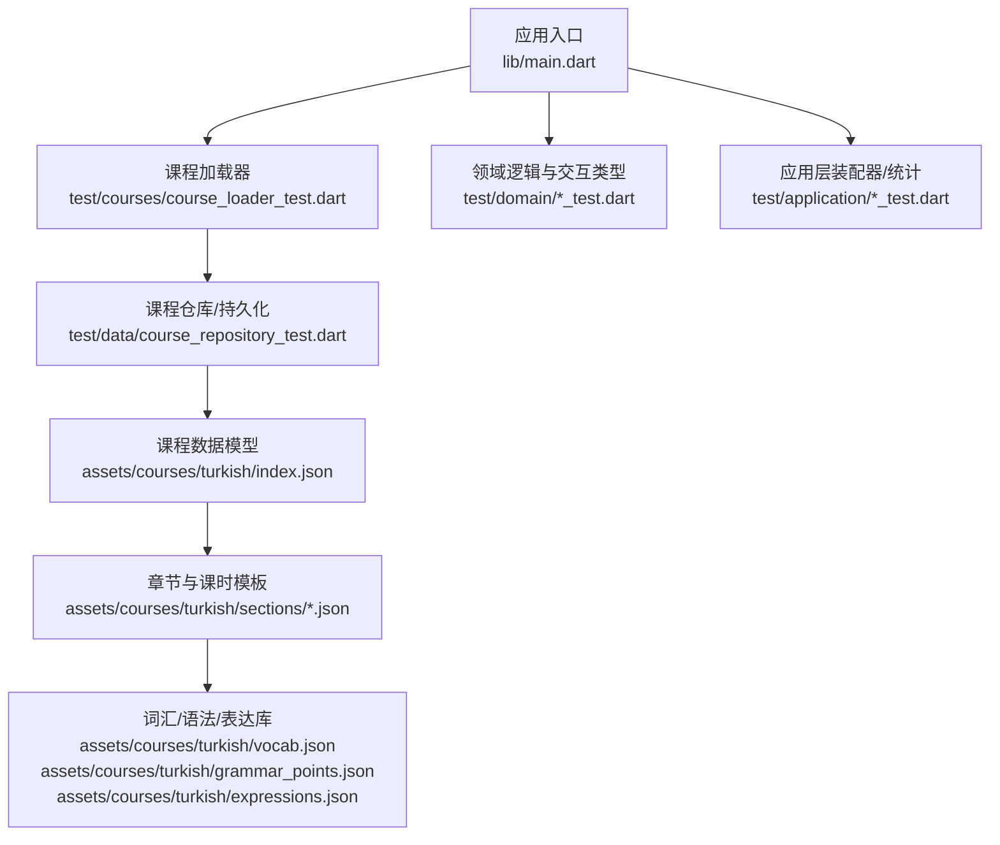
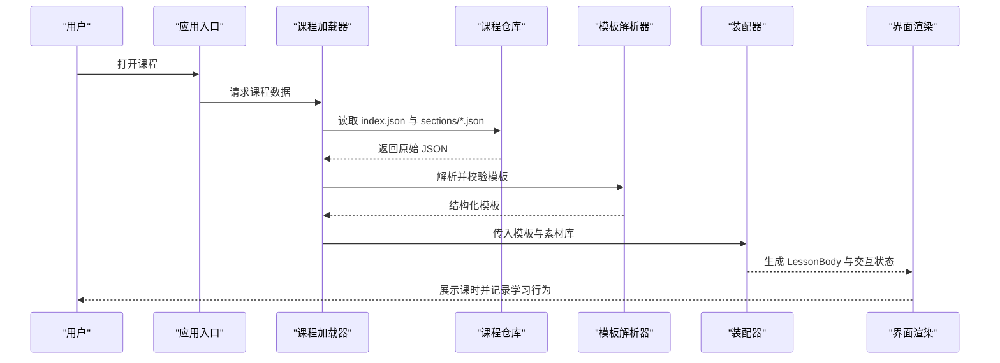
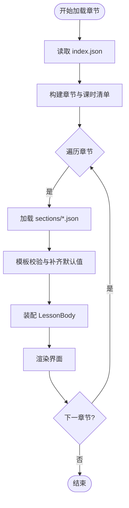
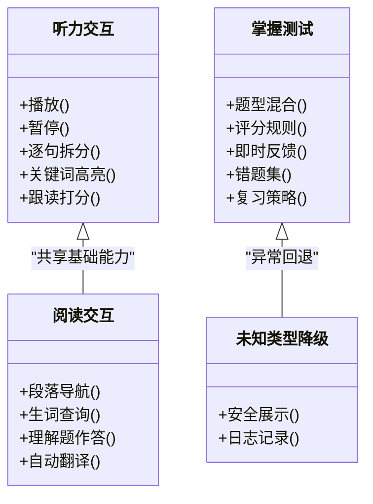
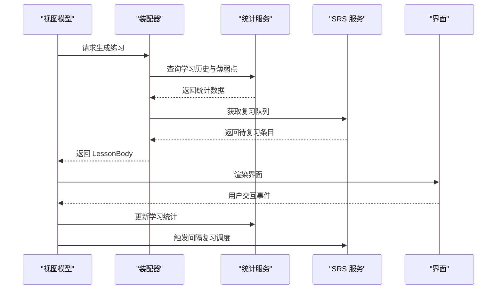
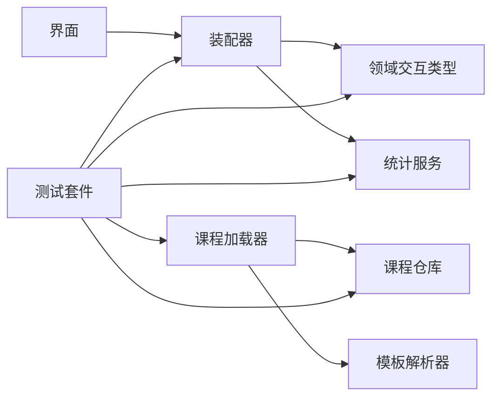

# 课程模板系统

<cite>
**本文引用的文件**   
- [README.md](file://README.md)
- [lesson-type-templates.md](file://docs/authoring/lesson-type-templates.md)
- [listening-show-format.md](file://docs/authoring/listening-show-format.md)
- [course-layout.md](file://docs/authoring/course-layout.md)
- [gui-course-editor.md](file://docs/authoring/gui-course-editor.md)
- [index.json](file://assets/courses/turkish/index.json)
- [vocab.json](file://assets/courses/turkish/vocab.json)
- [grammar_points.json](file://assets/courses/turkish/grammar_points.json)
- [expressions.json](file://assets/courses/turkish/expressions.json)
- [sections/01_intro.json](file://assets/courses/turkish/sections/01_intro.json)
- [section_02.json](file://assets/courses/turkish/sections/section_02.json)
- [section_03.json](file://assets/courses/turkish/sections/section_03.json)
- [section_04.json](file://assets/courses/turkish/sections/section_04.json)
- [section_05.json](file://assets/courses/turkish/sections/section_05.json)
- [section_06.json](file://assets/courses/turkish/sections/section_06.json)
- [section_07.json](file://assets/courses/turkish/sections/section_07.json)
- [section_08.json](file://assets/courses/turkish/sections/section_08.json)
- [main.dart](file://lib/main.dart)
- [course_loader_test.dart](file://test/courses/course_loader_test.dart)
- [seeder_round_trip_test.dart](file://test/courses/seeder_round_trip_test.dart)
- [lesson_body_lru_test.dart](file://test/courses/lesson_body_lru_test.dart)
- [course_repository_test.dart](file://test/data/course_repository_test.dart)
- [schema_migration_test.dart](file://test/data/schema_migration_test.dart)
- [seeder_cross_course_validation_test.dart](file://test/data/seeder_cross_course_validation_test.dart)
- [seeder_idempotent_test.dart](file://test/data/seeder_idempotent_test.dart)
- [study_log_repository_test.dart](file://test/data/study_log_repository_test.dart)
- [lesson_flatten_test.dart](file://test/domain/lesson_flatten_test.dart)
- [lesson_word_link_test.dart](file://test/domain/lesson_word_link_test.dart)
- [mistake_grammar_link_test.dart](file://test/domain/mistake_grammar_link_test.dart)
- [interaction_listen_only_label_test.dart](file://test/domain/interaction_listen_only_label_test.dart)
- [interaction_unknown_type_fallback_test.dart](file://test/domain/interaction_unknown_type_fallback_test.dart)
- [daily_challenge_assembler_test.dart](file://test/application/daily_challenge_assembler_test.dart)
- [weak_word_quiz_assembler_test.dart](file://test/application/weak_word_quiz_assembler_test.dart)
- [mastery_dialog_stats_test.dart](file://test/application/mastery_dialog_stats_test.dart)
- [lesson_progress_provider_test.dart](file://test/application/lesson_progress_provider_test.dart)
- [lesson_viewmodel_flow_test.dart](file://test/application/lesson_viewmodel_flow_test.dart)
- [audio_controller_tts_engine_test.dart](file://test/application/audio_controller_tts_engine_test.dart)
- [audio_controller_fallback_test.dart](file://test/application/audio_controller_fallback_test.dart)
- [srs_provider_test.dart](file://test/application/srs_provider_test.dart)
- [srs_persist_benchmark_test.dart](file://test/application/srs_persist_benchmark_test.dart)
- [learning_stats_accuracy_test.dart](file://test/application/learning_stats_accuracy_test.dart)
- [learning_stats_cache_test.dart](file://test/application/learning_stats_cache_test.dart)
- [course_provider_id_test.dart](file://test/application/course_provider_id_test.dart)
- [provider_identity_test.dart](file://test/application/provider_identity_test.dart)
- [race_condition_test.dart](file://test/application/race_condition_test.dart)
- [settings_reminder_test.dart](file://test/application/settings_reminder_test.dart)
- [dictionary_search_test.dart](file://test/application/dictionary_search_test.dart)
- [game_provider_test.dart](file://test/application/game_provider_test.dart)
- [grammar_review_provider_test.dart](file://test/application/grammar_review_provider_test.dart)
- [language_provider_test.dart](file://test/application/language_provider_test.dart)
- [mastery_dialog_stats_test.dart](file://test/application/mastery_dialog_stats_test.dart)
- [match_provider_test.dart](file://test/application/match_provider_test.dart)
- [mistake_provider_test.dart](file://test/application/mistake_provider_test.dart)
- [study_stats_random_suffix_test.dart](file://test/application/study_stats_random_suffix_test.dart)
- [weak_word_quiz_assembler_test.dart](file://test/application/weak_word_quiz_assembler_test.dart)
- [lesson_progress_provider_test.dart](file://test/application/lesson_progress_provider_test.dart)
- [lesson_viewmodel_flow_test.dart](file://test/application/lesson_viewmodel_flow_test.dart)
- [audio_controller_tts_engine_test.dart](file://test/application/audio_controller_tts_engine_test.dart)
- [audio_controller_fallback_test.dart](file://test/application/audio_controller_fallback_test.dart)
- [srs_provider_test.dart](file://test/application/srs_provider_test.dart)
- [srs_persist_benchmark_test.dart](file://test/application/srs_persist_benchmark_test.dart)
- [learning_stats_accuracy_test.dart](file://test/application/learning_stats_accuracy_test.dart)
- [learning_stats_cache_test.dart](file://test/application/learning_stats_cache_test.dart)
- [course_provider_id_test.dart](file://test/application/course_provider_id_test.dart)
- [provider_identity_test.dart](file://test/application/provider_identity_test.dart)
- [race_condition_test.dart](file://test/application/race_condition_test.dart)
- [settings_reminder_test.dart](file://test/application/settings_reminder_test.dart)
- [dictionary_search_test.dart](file://test/application/dictionary_search_test.dart)
- [game_provider_test.dart](file://test/application/game_provider_test.dart)
- [grammar_review_provider_test.dart](file://test/application/grammar_review_provider_test.dart)
- [language_provider_test.dart](file://test/application/language_provider_test.dart)
</cite>

## 目录
1. [简介](#简介)
2. [项目结构](#项目结构)
3. [核心组件](#核心组件)
4. [架构总览](#架构总览)
5. [详细组件分析](#详细组件分析)
6. [依赖分析](#依赖分析)
7. [性能考虑](#性能考虑)
8. [故障排查指南](#故障排查指南)
9. [结论](#结论)
10. [附录](#附录)

## 简介
本文件面向课程作者与开发者，系统化阐述课程模板系统的结构与规范。内容覆盖：
- 课程类型模板的结构、字段定义与使用场景（听力练习、阅读理解、掌握测试等）
- 模板继承、变量替换与条件渲染机制
- 模板定制、自定义字段与扩展开发指南
- 模板创建最佳实践、性能优化建议与兼容性考虑
- 模板验证、错误处理与调试工具使用方法

## 项目结构
仓库采用多端 Flutter 工程组织，课程内容以 JSON 数据驱动，UI 由 Dart 代码实现。与课程模板系统直接相关的资源集中在 assets/courses 与 docs/authoring 两个区域：
- assets/courses/{语言}/index.json：课程索引与章节清单
- assets/courses/{语言}/sections/*.json：章节与课时模板实例
- assets/courses/{语言}/{vocab, grammar_points, expressions}.json：词汇、语法点与表达素材库
- docs/authoring/*：课程编排与模板规范文档

图表来源
- [main.dart:1-200](file://lib/main.dart#L1-L200)
- [course_loader_test.dart:1-200](file://test/courses/course_loader_test.dart#L1-L200)
- [course_repository_test.dart:1-200](file://test/data/course_repository_test.dart#L1-L200)
- [index.json:1-200](file://assets/courses/turkish/index.json#L1-L200)
- [vocab.json:1-200](file://assets/courses/turkish/vocab.json#L1-L200)
- [grammar_points.json:1-200](file://assets/courses/turkish/grammar_points.json#L1-L200)
- [expressions.json:1-200](file://assets/courses/turkish/expressions.json#L1-L200)

章节来源
- [README.md:1-200](file://README.md#L1-L200)
- [course-layout.md:1-200](file://docs/authoring/course-layout.md#L1-L200)

## 核心组件
- 课程索引与章节清单：通过 index.json 声明课程元信息与章节顺序，便于统一管理与加载。
- 章节与课时模板：sections/*.json 描述具体课时的模板类型、字段与交互流程，是“模板实例化”的输入。
- 素材库：vocab.json、grammar_points.json、expressions.json 提供可复用的词汇、语法点与表达片段，供模板引用。
- 应用层装配器：application 层将模板与素材组装为可渲染的 LessonBody，并驱动学习统计、SRS、TTS 等功能。
- 领域层交互类型：domain 层定义不同交互类型（如听力、阅读、匹配、填空等）的行为与校验规则。

章节来源
- [lesson-type-templates.md:1-200](file://docs/authoring/lesson-type-templates.md#L1-L200)
- [listening-show-format.md:1-200](file://docs/authoring/listening-show-format.md#L1-L200)
- [gui-course-editor.md:1-200](file://docs/authoring/gui-course-editor.md#L1-L200)

## 架构总览
课程模板系统遵循“数据驱动 + 分层装配”的架构：
- 数据层：JSON 模板与素材库
- 解析层：课程加载器与校验器
- 装配层：LessonAssembler 将模板与素材组合为运行时对象
- 表现层：Flutter UI 根据运行时对象渲染交互界面
- 持久化与统计：学习进度、错题、SRS、统计指标等

图表来源
- [course_loader_test.dart:1-200](file://test/courses/course_loader_test.dart#L1-L200)
- [course_repository_test.dart:1-200](file://test/data/course_repository_test.dart#L1-L200)
- [lesson_flatten_test.dart:1-200](file://test/domain/lesson_flatten_test.dart#L1-L200)

## 详细组件分析

### 课程类型模板与字段规范
- 听力练习模板
  - 典型字段：音频资源路径、文本转语音开关、题目题干、选项列表、正确答案、提示与解析、难度等级、标签
  - 使用场景：训练听辨能力，支持重复播放、逐句拆分、关键词高亮
  - 参考规范：[listening-show-format.md:1-200](file://docs/authoring/listening-show-format.md#L1-L200)
- 阅读理解模板
  - 典型字段：文章文本、段落划分、问题列表、选项、答案、生词标注、理解题类型（选择/判断/简答）
  - 使用场景：提升阅读速度与理解力，支持跳转定位与词汇查询
  - 参考规范：[lesson-type-templates.md:1-200](file://docs/authoring/lesson-type-templates.md#L1-L200)
- 掌握测试模板
  - 典型字段：题型集合（单选、多选、填空、匹配）、评分规则、即时反馈、错题回看、复习策略
  - 使用场景：阶段性评估与巩固，结合 SRS 进行间隔复习
  - 参考规范：[lesson-type-templates.md:1-200](file://docs/authoring/lesson-type-templates.md#L1-L200)

章节来源
- [lesson-type-templates.md:1-200](file://docs/authoring/lesson-type-templates.md#L1-L200)
- [listening-show-format.md:1-200](file://docs/authoring/listening-show-format.md#L1-L200)

### 模板继承、变量替换与条件渲染
- 模板继承
  - 基础模板定义通用字段与默认行为，子模板通过继承减少重复，仅覆盖差异部分
  - 建议在 sections/*.json 中通过继承键引用父模板，避免冗余
- 变量替换
  - 在模板中使用占位符引用素材库字段（如词汇、语法点、表达），在装配阶段完成替换
  - 支持字符串插值、列表展开、条件分支输出
- 条件渲染
  - 基于运行时上下文（如学习者水平、已学词汇、设备能力）决定显示内容与交互流程
  - 常见条件：是否具备 TTS、是否开启辅助模式、是否处于复习模式

章节来源
- [gui-course-editor.md:1-200](file://docs/authoring/gui-course-editor.md#L1-L200)
- [course-layout.md:1-200](file://docs/authoring/course-layout.md#L1-L200)

### 章节与课时模板实例
- 章节索引与顺序：index.json 声明章节 ID、标题、顺序与包含的课时模板
- 课时模板：sections/*.json 定义每个课时的模板类型、字段值与交互参数
- 示例章节：01_intro.json、section_02.json 至 section_08.json 展示了不同主题与难度的课时组织方式

图表来源
- [index.json:1-200](file://assets/courses/turkish/index.json#L1-L200)
- [sections/01_intro.json:1-200](file://assets/courses/turkish/sections/01_intro.json#L1-L200)
- [sections/section_02.json:1-200](file://assets/courses/turkish/sections/section_02.json#L1-L200)
- [sections/section_03.json:1-200](file://assets/courses/turkish/sections/section_03.json#L1-L200)
- [sections/section_04.json:1-200](file://assets/courses/turkish/sections/section_04.json#L1-L200)
- [sections/section_05.json:1-200](file://assets/courses/turkish/sections/section_05.json#L1-L200)
- [sections/section_06.json:1-200](file://assets/courses/turkish/sections/section_06.json#L1-L200)
- [sections/section_07.json:1-200](file://assets/courses/turkish/sections/section_07.json#L1-L200)
- [sections/section_08.json:1-200](file://assets/courses/turkish/sections/section_08.json#L1-L200)

章节来源
- [index.json:1-200](file://assets/courses/turkish/index.json#L1-L200)
- [sections/01_intro.json:1-200](file://assets/courses/turkish/sections/01_intro.json#L1-L200)
- [sections/section_02.json:1-200](file://assets/courses/turkish/sections/section_02.json#L1-L200)
- [sections/section_03.json:1-200](file://assets/courses/turkish/sections/section_03.json#L1-L200)
- [sections/section_04.json:1-200](file://assets/courses/turkish/sections/section_04.json#L1-L200)
- [sections/section_05.json:1-200](file://assets/courses/turkish/sections/section_05.json#L1-L200)
- [sections/section_06.json:1-200](file://assets/courses/turkish/sections/section_06.json#L1-L200)
- [sections/section_07.json:1-200](file://assets/courses/turkish/sections/section_07.json#L1-L200)
- [sections/section_08.json:1-200](file://assets/courses/turkish/sections/section_08.json#L1-L200)

### 素材库与模板引用
- 词汇库 vocab.json：词条、释义、例句、发音、标签、难度
- 语法点 grammar_points.json：规则说明、示例、关联词汇、常见错误
- 表达库 expressions.json：固定搭配、句型、语用场景
- 模板通过字段引用素材库条目，实现内容复用与一致性

章节来源
- [vocab.json:1-200](file://assets/courses/turkish/vocab.json#L1-L200)
- [grammar_points.json:1-200](file://assets/courses/turkish/grammar_points.json#L1-L200)
- [expressions.json:1-200](file://assets/courses/turkish/expressions.json#L1-L200)

### 领域交互类型与行为
- 听力交互：播放控制、逐句拆分、关键词高亮、跟读打分（可选）
- 阅读交互：段落导航、生词查询、理解题作答、自动翻译开关
- 掌握测试：题型混合、评分规则、即时反馈、错题集、复习策略
- 未知类型降级：当遇到未识别的交互类型时，系统应回退到安全展示模式

图表来源
- [interaction_listen_only_label_test.dart:1-200](file://test/domain/interaction_listen_only_label_test.dart#L1-L200)
- [interaction_unknown_type_fallback_test.dart:1-200](file://test/domain/interaction_unknown_type_fallback_test.dart#L1-L200)

章节来源
- [interaction_listen_only_label_test.dart:1-200](file://test/domain/interaction_listen_only_label_test.dart#L1-L200)
- [interaction_unknown_type_fallback_test.dart:1-200](file://test/domain/interaction_unknown_type_fallback_test.dart#L1-L200)

### 应用层装配器与统计
- 每日挑战装配器：根据学习进度与薄弱点生成个性化练习
- 弱词测验装配器：针对高频错词生成专项练习
- 掌握对话框统计：计算正确率、用时、复习次数等指标
- 学习进度提供者：持久化学习状态，支持断点续学

图表来源
- [daily_challenge_assembler_test.dart:1-200](file://test/application/daily_challenge_assembler_test.dart#L1-L200)
- [weak_word_quiz_assembler_test.dart:1-200](file://test/application/weak_word_quiz_assembler_test.dart#L1-L200)
- [mastery_dialog_stats_test.dart:1-200](file://test/application/mastery_dialog_stats_test.dart#L1-L200)
- [lesson_progress_provider_test.dart:1-200](file://test/application/lesson_progress_provider_test.dart#L1-L200)

章节来源
- [daily_challenge_assembler_test.dart:1-200](file://test/application/daily_challenge_assembler_test.dart#L1-L200)
- [weak_word_quiz_assembler_test.dart:1-200](file://test/application/weak_word_quiz_assembler_test.dart#L1-L200)
- [mastery_dialog_stats_test.dart:1-200](file://test/application/mastery_dialog_stats_test.dart#L1-L200)
- [lesson_progress_provider_test.dart:1-200](file://test/application/lesson_progress_provider_test.dart#L1-L200)

## 依赖分析
- 课程加载器依赖课程仓库与模板解析器
- 装配器依赖领域交互类型与应用统计服务
- UI 依赖运行时 LessonBody 与状态管理
- 测试覆盖：课程加载、数据迁移、跨课程校验、幂等性、学习日志、领域行为、应用装配器等

图表来源
- [course_loader_test.dart:1-200](file://test/courses/course_loader_test.dart#L1-L200)
- [course_repository_test.dart:1-200](file://test/data/course_repository_test.dart#L1-L200)
- [lesson_flatten_test.dart:1-200](file://test/domain/lesson_flatten_test.dart#L1-L200)
- [daily_challenge_assembler_test.dart:1-200](file://test/application/daily_challenge_assembler_test.dart#L1-L200)

章节来源
- [course_loader_test.dart:1-200](file://test/courses/course_loader_test.dart#L1-L200)
- [course_repository_test.dart:1-200](file://test/data/course_repository_test.dart#L1-L200)
- [lesson_flatten_test.dart:1-200](file://test/domain/lesson_flatten_test.dart#L1-L200)
- [daily_challenge_assembler_test.dart:1-200](file://test/application/daily_challenge_assembler_test.dart#L1-L200)

## 性能考虑
- 模板解析与校验：批量加载与缓存，避免重复解析；对大型 sections 文件进行分块加载
- 内存管理：LessonBody LRU 缓存，限制最大条目数，及时释放不活跃课时
- I/O 优化：异步读取与并行加载，减少主线程阻塞；使用流式解析大文件
- 渲染优化：按需渲染与懒加载，避免一次性构建大量 Widget
- 统计与 SRS：批处理写入与延迟提交，降低数据库压力

章节来源
- [lesson_body_lru_test.dart:1-200](file://test/courses/lesson_body_lru_test.dart#L1-L200)
- [srs_persist_benchmark_test.dart:1-200](file://test/application/srs_persist_benchmark_test.dart#L1-L200)

## 故障排查指南
- 模板校验失败：检查必填字段、类型约束、引用有效性；查看解析器日志
- 未知交互类型：确认模板类型名称拼写，必要时启用降级展示并记录告警
- 音频/TTS 异常：检查资源路径、权限、引擎可用性；回退到文本朗读或静音模式
- 数据迁移问题：确认 schema 版本与迁移脚本；使用迁移测试定位不一致
- 跨课程校验错误：检查 ID 唯一性、外键引用完整性；修复循环依赖

章节来源
- [schema_migration_test.dart:1-200](file://test/data/schema_migration_test.dart#L1-L200)
- [seeder_cross_course_validation_test.dart:1-200](file://test/data/seeder_cross_course_validation_test.dart#L1-L200)
- [seeder_idempotent_test.dart:1-200](file://test/data/seeder_idempotent_test.dart#L1-L200)
- [study_log_repository_test.dart:1-200](file://test/data/study_log_repository_test.dart#L1-L200)
- [audio_controller_tts_engine_test.dart:1-200](file://test/application/audio_controller_tts_engine_test.dart#L1-L200)
- [audio_controller_fallback_test.dart:1-200](file://test/application/audio_controller_fallback_test.dart#L1-L200)

## 结论
课程模板系统通过 JSON 驱动的模板与素材库，结合分层装配与领域行为，实现了灵活、可扩展的课程编排与学习体验。遵循本文档的规范与实践，可高效创建与维护高质量的课程模板，保障兼容性与性能。

## 附录
- 模板创建最佳实践
  - 明确模板职责，避免过度耦合；优先使用继承与组合
  - 合理拆分素材库，保持条目粒度适中，便于复用与维护
  - 使用条件渲染适配不同学习者水平与设备能力
  - 编写单元测试与集成测试，覆盖边界与异常路径
- 自定义字段与扩展开发
  - 在模板中新增字段需同步更新解析器与校验器
  - 为新交互类型提供默认降级策略，确保向后兼容
  - 通过插件或模块扩展装配器与统计服务
- 兼容性考虑
  - 向前兼容旧版模板，提供迁移脚本与默认值补齐
  - 对不同平台（Android/iOS/Web）的能力差异进行探测与回退
  - 保持 API 稳定，变更需经过充分测试与文档更新