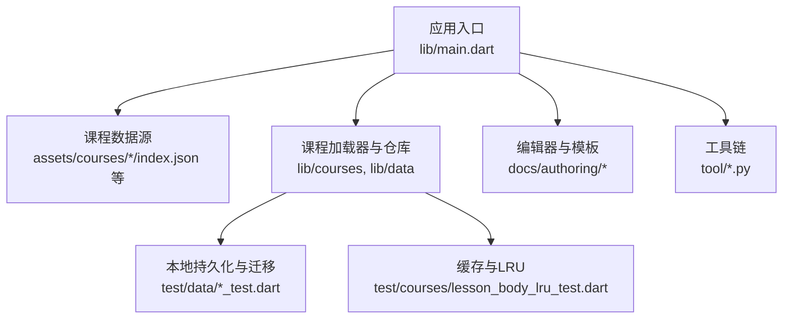
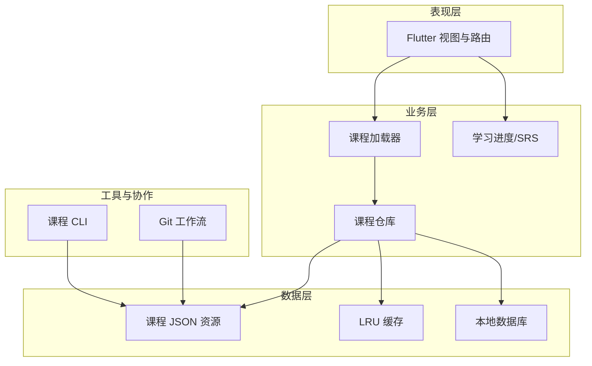
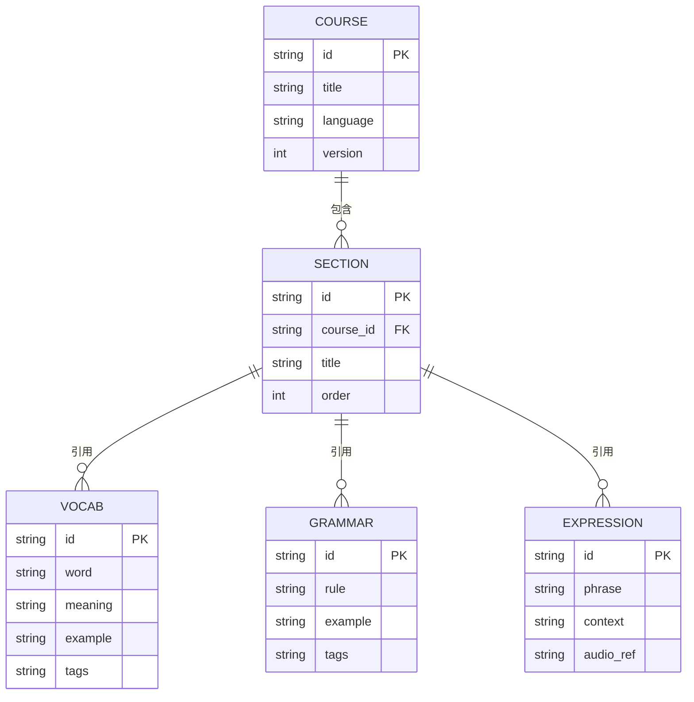
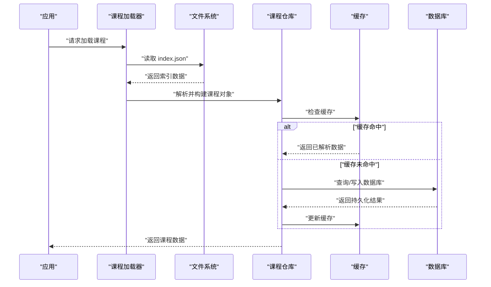
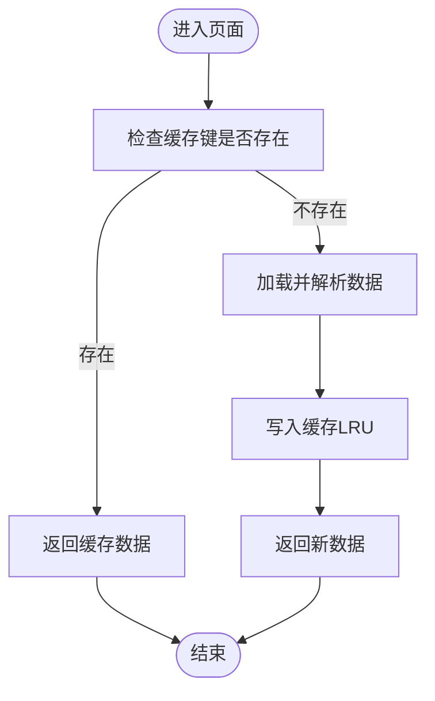
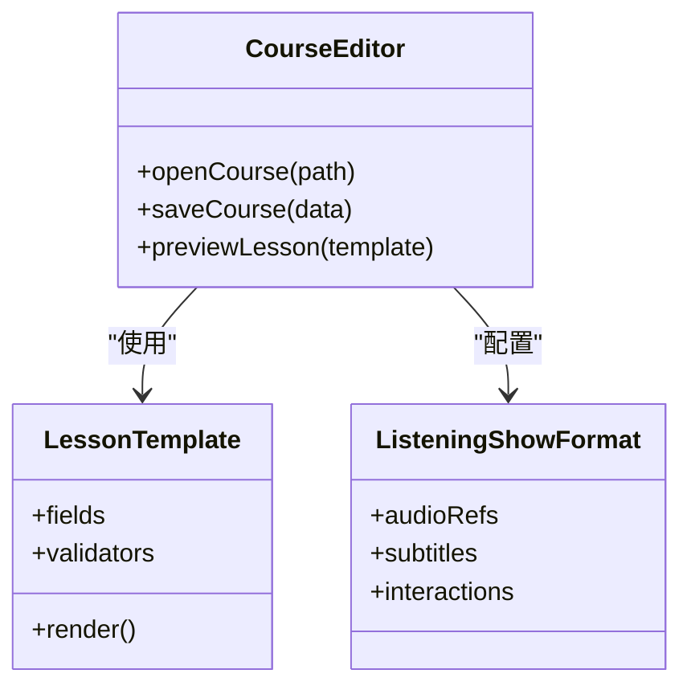
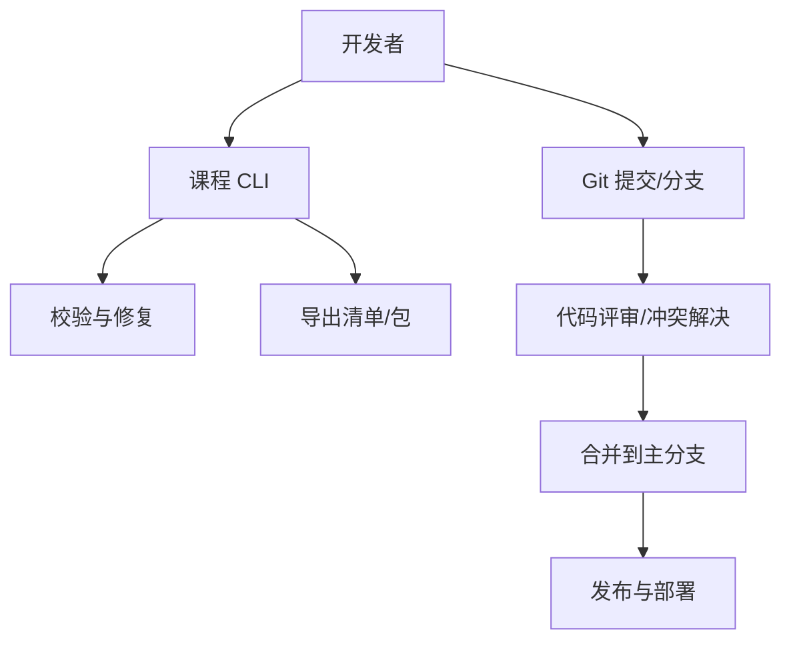
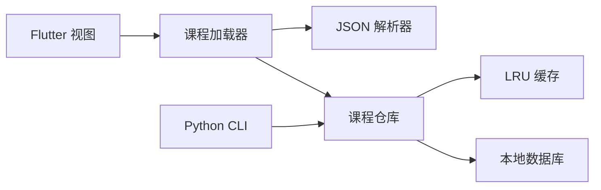

# 课程管理系统

<cite>
**本文档引用的文件**   
- [README.md](file://README.md)
- [pubspec.yaml](file://pubspec.yaml)
- [main.dart](file://lib/main.dart)
- [index.json](file://assets/courses/turkish/index.json)
- [expressions.json](file://assets/courses/turkish/expressions.json)
- [grammar_points.json](file://assets/courses/turkish/grammar_points.json)
- [vocab.json](file://assets/courses/turkish/vocab.json)
- [course_loader_test.dart](file://test/courses/course_loader_test.dart)
- [lesson_body_lru_test.dart](file://test/courses/lesson_body_lru_test.dart)
- [seeder_round_trip_test.dart](file://test/courses/seeder_round_trip_test.dart)
- [course_repository_test.dart](file://test/data/course_repository_test.dart)
- [schema_migration_test.dart](file://test/data/schema_migration_test.dart)
- [gui-course-editor.md](file://docs/authoring/gui-course-editor.md)
- [lesson-type-templates.md](file://docs/authoring/lesson-type-templates.md)
- [listening-show-format.md](file://docs/authoring/listening-show-format.md)
- [course-layout.md](file://docs/authoring/course-layout.md)
- [0021-git-resource-library-architecture.md](file://docs/decisions/0021-git-resource-library-architecture.md)
- [0022-git-auth-and-credential-store.md](file://docs/decisions/0022-git-auth-and-credential-store.md)
- [0023-git-branch-and-conflict-resolution.md](file://docs/decisions/0023-git-branch-and-conflict-resolution.md)
- [0024-team-collaboration-enhancements.md](file://docs/decisions/0024-team-collaboration-enhancements.md)
- [0025-textbook-git-integration.md](file://docs/decisions/0025-textbook-git-integration.md)
- [0026-local-resource-editor-enhancements.md](file://docs/decisions/0026-local-resource-editor-enhancements.md)
- [course_cli.py](file://tool/course_cli.py)
- [generate_audio.py](file://tool/generate_audio.py)
- [export_content_inventory.py](file://tool/export_content_inventory.py)
</cite>

## 目录
1. [简介](#简介)
2. [项目结构](#项目结构)
3. [核心组件](#核心组件)
4. [架构总览](#架构总览)
5. [详细组件分析](#详细组件分析)
6. [依赖关系分析](#依赖关系分析)
7. [性能考虑](#性能考虑)
8. [故障排查指南](#故障排查指南)
9. [结论](#结论)
10. [附录](#附录)

## 简介
本文件为 Varnamalaplus 课程管理系统的综合技术文档，聚焦于课程数据结构、章节组织与内容管理策略；课程加载机制、资源管理与缓存策略；课程编辑器工作原理、JSON 格式规范与模板系统；课程导入导出、版本控制与协作开发支持；以及课程创建最佳实践、内容组织建议、性能优化技巧与多语言支持。

## 项目结构
Varnamalaplus 采用 Flutter 跨平台应用架构，课程数据以 JSON 形式存放在 assets 中，并通过测试与工具链保障数据质量与可维护性。关键目录说明：
- lib：Flutter 应用代码（入口、路由、视图、领域模型、数据层等）
- assets/courses：课程资源（索引、词汇、语法点、表达等 JSON 文件及媒体资源）
- docs/authoring：作者指南与模板（课程布局、题型模板、听力展示格式等）
- docs/decisions：架构决策记录（Git 资源库、分支冲突、团队协作等）
- tool：课程 CLI、音频生成、内容清单导出等工具脚本
- test：覆盖课程加载、数据库迁移、SRS、学习统计等的测试集

图表来源
- [main.dart](file://lib/main.dart)
- [index.json](file://assets/courses/turkish/index.json)
- [course_loader_test.dart](file://test/courses/course_loader_test.dart)
- [lesson_body_lru_test.dart](file://test/courses/lesson_body_lru_test.dart)
- [gui-course-editor.md](file://docs/authoring/gui-course-editor.md)
- [course_cli.py](file://tool/course_cli.py)

章节来源
- [README.md](file://README.md)
- [pubspec.yaml](file://pubspec.yaml)
- [main.dart](file://lib/main.dart)

## 核心组件
- 课程数据模型与索引
  - index.json：课程元数据与章节索引，定义课程结构与资源引用
  - vocab.json、grammar_points.json、expressions.json：词汇、语法点、表达等资源
- 课程加载与仓库
  - 课程加载器负责解析 JSON、校验字段、构建领域对象并注入到运行时
  - 仓库层提供统一的读取接口，屏蔽数据来源差异（本地资源、远程同步等）
- 缓存与 LRU
  - 针对课程正文与高频访问内容进行 LRU 缓存，降低重复解析与 I/O 开销
- 编辑器与模板
  - GUI 编辑器基于 docs/authoring 中的规范与模板，支持题型模板与听力展示格式
- 工具链
  - course_cli.py：课程校验、批量处理、导入导出
  - generate_audio.py：批量生成或校对音频资源
  - export_content_inventory.py：导出内容清单用于审计与发布

章节来源
- [index.json](file://assets/courses/turkish/index.json)
- [vocab.json](file://assets/courses/turkish/vocab.json)
- [grammar_points.json](file://assets/courses/turkish/grammar_points.json)
- [expressions.json](file://assets/courses/turkish/expressions.json)
- [course_loader_test.dart](file://test/courses/course_loader_test.dart)
- [lesson_body_lru_test.dart](file://test/courses/lesson_body_lru_test.dart)
- [gui-course-editor.md](file://docs/authoring/gui-course-editor.md)
- [lesson-type-templates.md](file://docs/authoring/lesson-type-templates.md)
- [listening-show-format.md](file://docs/authoring/listening-show-format.md)
- [course_cli.py](file://tool/course_cli.py)
- [generate_audio.py](file://tool/generate_audio.py)
- [export_content_inventory.py](file://tool/export_content_inventory.py)

## 架构总览
课程管理系统遵循“数据驱动 + 分层架构”的设计：
- 表现层：Flutter 视图与路由，渲染课程列表、章节导航与练习界面
- 业务层：课程加载器、题库组装、学习进度与 SRS 计算
- 数据层：JSON 资源解析、本地数据库持久化、缓存与迁移
- 工具与协作：CLI 工具、Git 工作流与团队协作文档

图表来源
- [course_loader_test.dart](file://test/courses/course_loader_test.dart)
- [lesson_body_lru_test.dart](file://test/courses/lesson_body_lru_test.dart)
- [course_repository_test.dart](file://test/data/course_repository_test.dart)
- [schema_migration_test.dart](file://test/data/schema_migration_test.dart)
- [index.json](file://assets/courses/turkish/index.json)

## 详细组件分析

### 课程数据结构与章节组织
- 课程索引（index.json）
  - 定义课程标题、语言、版本、章节顺序与资源引用
  - 作为课程加载的入口，确保章节与资源的一致性
- 词汇与语法（vocab.json、grammar_points.json）
  - 词汇条目包含词项、释义、例句、标签等
  - 语法点包含规则描述、示例句、关联词汇
- 表达（expressions.json）
  - 常用表达、场景分类、发音与例句
- 章节组织
  - 通过索引文件串联各资源，形成线性或分层的章节结构
  - 支持按难度、主题或技能维度组织

图表来源
- [index.json](file://assets/courses/turkish/index.json)
- [vocab.json](file://assets/courses/turkish/vocab.json)
- [grammar_points.json](file://assets/courses/turkish/grammar_points.json)
- [expressions.json](file://assets/courses/turkish/expressions.json)

章节来源
- [index.json](file://assets/courses/turkish/index.json)
- [vocab.json](file://assets/courses/turkish/vocab.json)
- [grammar_points.json](file://assets/courses/turkish/grammar_points.json)
- [expressions.json](file://assets/courses/turkish/expressions.json)
- [course-layout.md](file://docs/authoring/course-layout.md)

### 课程加载机制与资源管理
- 加载流程
  - 从 assets 读取 index.json，解析章节与资源清单
  - 按需加载词汇、语法、表达等资源，构建领域对象
  - 将结果写入本地数据库并更新缓存
- 资源管理
  - 统一路径与命名约定，避免硬编码
  - 对大体积资源（音频、图片）进行懒加载与压缩

图表来源
- [course_loader_test.dart](file://test/courses/course_loader_test.dart)
- [lesson_body_lru_test.dart](file://test/courses/lesson_body_lru_test.dart)
- [course_repository_test.dart](file://test/data/course_repository_test.dart)

章节来源
- [course_loader_test.dart](file://test/courses/course_loader_test.dart)
- [lesson_body_lru_test.dart](file://test/courses/lesson_body_lru_test.dart)
- [course_repository_test.dart](file://test/data/course_repository_test.dart)

### 缓存策略与 LRU
- 目标
  - 减少重复解析与 I/O，提升首屏与翻页性能
- 实现要点
  - 使用 LRU 策略限制缓存大小，自动淘汰低频数据
  - 区分课程元数据、章节正文与媒体资源的缓存粒度
- 验证
  - 通过单元测试验证命中率与淘汰行为

图表来源
- [lesson_body_lru_test.dart](file://test/courses/lesson_body_lru_test.dart)

章节来源
- [lesson_body_lru_test.dart](file://test/courses/lesson_body_lru_test.dart)

### 课程编辑器与模板系统
- GUI 编辑器
  - 基于 docs/authoring 中的课程布局与题型模板，提供可视化编辑能力
  - 支持听力展示格式配置与预览
- 模板系统
  - 题型模板定义字段、校验规则与渲染逻辑
  - 听力展示格式统一音频播放、字幕与交互

图表来源
- [gui-course-editor.md](file://docs/authoring/gui-course-editor.md)
- [lesson-type-templates.md](file://docs/authoring/lesson-type-templates.md)
- [listening-show-format.md](file://docs/authoring/listening-show-format.md)

章节来源
- [gui-course-editor.md](file://docs/authoring/gui-course-editor.md)
- [lesson-type-templates.md](file://docs/authoring/lesson-type-templates.md)
- [listening-show-format.md](file://docs/authoring/listening-show-format.md)

### 导入导出、版本控制与协作开发
- 导入导出
  - 通过 CLI 工具进行批量校验、转换与导出
  - 内容清单导出便于审计与发布
- 版本控制
  - 基于 Git 的资源库架构与分支策略
  - 冲突解决与合并流程规范化
- 团队协作
  - 权限与凭证管理、文本教材集成、本地资源编辑器增强

图表来源
- [course_cli.py](file://tool/course_cli.py)
- [export_content_inventory.py](file://tool/export_content_inventory.py)
- [0021-git-resource-library-architecture.md](file://docs/decisions/0021-git-resource-library-architecture.md)
- [0022-git-auth-and-credential-store.md](file://docs/decisions/0022-git-auth-and-credential-store.md)
- [0023-git-branch-and-conflict-resolution.md](file://docs/decisions/0023-git-branch-and-conflict-resolution.md)
- [0024-team-collaboration-enhancements.md](file://docs/decisions/0024-team-collaboration-enhancements.md)
- [0025-textbook-git-integration.md](file://docs/decisions/0025-textbook-git-integration.md)
- [0026-local-resource-editor-enhancements.md](file://docs/decisions/0026-local-resource-editor-enhancements.md)

章节来源
- [course_cli.py](file://tool/course_cli.py)
- [export_content_inventory.py](file://tool/export_content_inventory.py)
- [0021-git-resource-library-architecture.md](file://docs/decisions/0021-git-resource-library-architecture.md)
- [0022-git-auth-and-credential-store.md](file://docs/decisions/0022-git-auth-and-credential-store.md)
- [0023-git-branch-and-conflict-resolution.md](file://docs/decisions/0023-git-branch-and-conflict-resolution.md)
- [0024-team-collaboration-enhancements.md](file://docs/decisions/0024-team-collaboration-enhancements.md)
- [0025-textbook-git-integration.md](file://docs/decisions/0025-textbook-git-integration.md)
- [0026-local-resource-editor-enhancements.md](file://docs/decisions/0026-local-resource-editor-enhancements.md)

### 多语言支持与国际化
- 课程语言标识
  - 在课程索引中声明语言代码，便于前端切换与资源定位
- 文本国际化
  - 词汇、语法、表达等文本内容按语言分离存储
- 音频与媒体
  - 音频资源按语言目录组织，播放器根据当前语言选择对应资源

章节来源
- [index.json](file://assets/courses/turkish/index.json)
- [vocab.json](file://assets/courses/turkish/vocab.json)
- [grammar_points.json](file://assets/courses/turkish/grammar_points.json)
- [expressions.json](file://assets/courses/turkish/expressions.json)

## 依赖关系分析
- 模块耦合
  - 课程加载器依赖 JSON 解析与仓库接口
  - 仓库层依赖缓存与数据库，屏蔽底层存储差异
- 外部依赖
  - Flutter 框架与插件（音视频、文件系统、网络等）
  - Python 工具链（CLI、音频生成、清单导出）

图表来源
- [course_loader_test.dart](file://test/courses/course_loader_test.dart)
- [course_repository_test.dart](file://test/data/course_repository_test.dart)
- [lesson_body_lru_test.dart](file://test/courses/lesson_body_lru_test.dart)
- [course_cli.py](file://tool/course_cli.py)

章节来源
- [course_loader_test.dart](file://test/courses/course_loader_test.dart)
- [course_repository_test.dart](file://test/data/course_repository_test.dart)
- [lesson_body_lru_test.dart](file://test/courses/lesson_body_lru_test.dart)
- [course_cli.py](file://tool/course_cli.py)

## 性能考虑
- 首屏加载
  - 预取 index.json 与高频章节，结合 LRU 缓存减少延迟
- 内存管理
  - 限制缓存大小，及时释放大对象（音频解码缓冲）
- I/O 优化
  - 批量读写与异步任务调度，避免阻塞 UI
- 资源压缩
  - 音频与图片压缩，按需下载与懒加载

[本节为通用指导，不直接分析具体文件]

## 故障排查指南
- 课程加载失败
  - 检查 index.json 字段完整性与路径正确性
  - 查看课程加载器日志与解析错误
- 缓存异常
  - 清理缓存并重新加载，确认 LRU 淘汰策略生效
- 数据库迁移问题
  - 参考迁移测试用例，确认 schema 版本兼容
- 编辑器与模板
  - 校验模板字段与必填项，确保预览正常

章节来源
- [course_loader_test.dart](file://test/courses/course_loader_test.dart)
- [lesson_body_lru_test.dart](file://test/courses/lesson_body_lru_test.dart)
- [schema_migration_test.dart](file://test/data/schema_migration_test.dart)
- [gui-course-editor.md](file://docs/authoring/gui-course-editor.md)

## 结论
Varnamalaplus 课程管理系统以 JSON 驱动的课程数据为核心，结合分层架构、缓存与工具链，实现了高效的课程加载、编辑与协作。通过严格的测试与文档化的模板规范，系统在可扩展性与可维护性方面具备良好基础。建议在后续迭代中持续优化资源加载与缓存策略，完善多语言与国际化支持，并强化团队协作流程。

[本节为总结性内容，不直接分析具体文件]

## 附录
- 课程创建最佳实践
  - 保持 index.json 简洁明确，章节顺序合理
  - 词汇与语法条目标准化，标签体系一致
  - 音频资源命名规范，按语言与章节组织
- 内容组织建议
  - 按主题或难度划分章节，便于学习路径设计
  - 使用模板统一题型结构，提高一致性
- 性能优化技巧
  - 启用懒加载与缓存，减少重复 I/O
  - 压缩媒体资源，按需下载

[本节为通用指导，不直接分析具体文件]